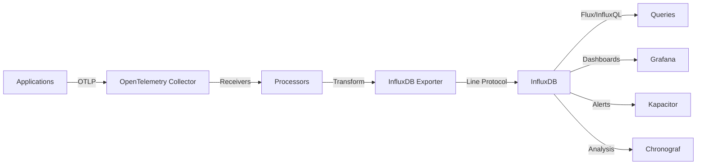

# How to Configure the InfluxDB Exporter in the OpenTelemetry Collector

Author: [nawazdhandala](https://www.github.com/nawazdhandala)

Tags: OpenTelemetry, Collector, Exporters, InfluxDB, Time Series, Metrics, Monitoring, Observability

Description: Learn how to configure the InfluxDB exporter in the OpenTelemetry Collector for time-series metrics storage and analysis with InfluxDB 2.x and 3.x.

InfluxDB is a high-performance time-series database designed for handling large volumes of timestamped data. The OpenTelemetry Collector's InfluxDB exporter enables you to send metrics data to InfluxDB for storage, analysis, and visualization. This integration is ideal for organizations looking to leverage InfluxDB's powerful query language and time-series optimizations.

## Understanding the InfluxDB Exporter

The InfluxDB exporter converts OpenTelemetry metrics into InfluxDB's line protocol format and writes them to InfluxDB using either the v1 or v2 API. It supports both InfluxDB OSS and InfluxDB Cloud, providing flexibility in deployment options. The exporter handles batching, compression, and automatic retries to ensure reliable data delivery.

InfluxDB excels at storing and querying time-series data, making it perfect for metrics analysis, alerting, and long-term data retention.

## Architecture Overview

Here's how the InfluxDB exporter fits into your observability pipeline:



## Prerequisites

Before configuring the InfluxDB exporter, ensure you have:

- InfluxDB 2.x or 3.x installed and running
- An InfluxDB organization and bucket created
- An API token with write permissions
- OpenTelemetry Collector Contrib installed (version 0.80.0 or later)

## Setting Up InfluxDB

Install and configure InfluxDB 2.x:

```bash
# Download and install InfluxDB (example for Linux)
wget https://dl.influxdata.com/influxdb/releases/influxdb2-2.7.4-linux-amd64.tar.gz
tar xvfz influxdb2-2.7.4-linux-amd64.tar.gz
cd influxdb2-2.7.4-linux-amd64

# Start InfluxDB
./influxd

# Initial setup (in another terminal)
./influx setup \
  --username admin \
  --password mypassword123 \
  --org myorg \
  --bucket telemetry \
  --retention 30d \
  --force
```

Create an API token:

```bash
# Create a token with write access to the bucket
influx auth create \
  --org myorg \
  --read-bucket telemetry \
  --write-bucket telemetry \
  --description "OpenTelemetry Collector Token"

# Output will include the token string
```

Alternatively, for InfluxDB Cloud:

1. Sign up at https://cloud2.influxdata.com/
2. Create an organization and bucket
3. Generate an API token from the UI

## Basic Configuration

Here's a minimal configuration for the InfluxDB exporter:

```yaml
# OpenTelemetry Collector configuration for InfluxDB
receivers:
  otlp:
    protocols:
      grpc:
        endpoint: 0.0.0.0:4317
      http:
        endpoint: 0.0.0.0:4318

processors:
  batch:
    # Batch metrics for efficient writes
    timeout: 10s
    send_batch_size: 1024

exporters:
  influxdb:
    # InfluxDB endpoint URL
    endpoint: "http://localhost:8086"

    # Organization name
    org: "myorg"

    # Bucket name for storing metrics
    bucket: "telemetry"

    # API token for authentication
    token: "${INFLUXDB_TOKEN}"

    # Timeout for write operations
    timeout: 10s

service:
  pipelines:
    metrics:
      receivers: [otlp]
      processors: [batch]
      exporters: [influxdb]
```

This configuration sets up a metrics pipeline that receives OTLP metrics and exports them to InfluxDB.

## InfluxDB v1 Compatibility Mode

For InfluxDB 1.x or compatibility mode:

```yaml
exporters:
  influxdb:
    # InfluxDB v1.x endpoint
    endpoint: "http://localhost:8086"

    # Database name (v1.x concept)
    # For v2.x, this maps to bucket
    # db: "telegraf"

    # Username and password (v1.x authentication)
    # username: "admin"
    # password: "password"

    # For v2.x with v1 compatibility API
    org: "myorg"
    bucket: "telemetry"
    token: "${INFLUXDB_TOKEN}"

    # Use v1 write endpoint
    # v1_compatibility:
    #   enabled: true
    #   db: "telegraf"
    #   username: "admin"
    #   password: "password"

    timeout: 10s
```

## Advanced Configuration Options

For production deployments, customize additional parameters:

```yaml
exporters:
  influxdb:
    endpoint: "http://influxdb.example.com:8086"
    org: "production-org"
    bucket: "metrics"
    token: "${INFLUXDB_TOKEN}"

    # Write precision (ns, us, ms, s)
    # Controls timestamp precision in line protocol
    precision: "ms"

    # Timeout for HTTP requests
    timeout: 30s

    # HTTP headers
    headers:
      User-Agent: "opentelemetry-collector/v0.93.0"

    # Queue configuration for handling bursts
    sending_queue:
      enabled: true
      num_consumers: 10
      queue_size: 10000
      storage:
        directory: /var/lib/otelcol/queue
        timeout: 10s

    # Retry configuration
    retry_on_failure:
      enabled: true
      initial_interval: 5s
      max_interval: 30s
      max_elapsed_time: 300s

    # Metrics specific configuration
    metrics_schema: "telegraf-prometheus-v2"

    # Tags to add to all metrics
    tags:
      - key: "collector"
        value: "otel"
      - key: "environment"
        value: "production"

    # HTTP client settings
    compression: "gzip"

    # TLS configuration
    tls:
      insecure: false
      insecure_skip_verify: false
      ca_file: "/path/to/ca.pem"
      cert_file: "/path/to/cert.pem"
      key_file: "/path/to/key.pem"
```

## Metrics Schema Options

The exporter supports different schema mappings:

**telegraf-prometheus-v1:**
- Legacy schema
- Compatible with Telegraf metrics
- Simple tag structure

**telegraf-prometheus-v2:**
- Recommended for new deployments
- Better Prometheus compatibility
- Enhanced metadata handling

```yaml
exporters:
  influxdb:
    endpoint: "http://localhost:8086"
    org: "myorg"
    bucket: "telemetry"
    token: "${INFLUXDB_TOKEN}"

    # Choose schema based on your needs
    metrics_schema: "telegraf-prometheus-v2"
```

## Resource Attributes and Tags

Map OpenTelemetry resource attributes to InfluxDB tags:

```yaml
processors:
  # Add resource attributes
  resource:
    attributes:
      - key: service.name
        value: "${SERVICE_NAME}"
        action: upsert
      - key: service.version
        value: "${SERVICE_VERSION}"
        action: upsert
      - key: deployment.environment
        value: "${ENVIRONMENT}"
        action: upsert
      - key: host.name
        value: "${HOSTNAME}"
        action: upsert

  # Transform attributes to better tag names
  attributes/transform:
    actions:
      - key: service_name
        from_attribute: service.name
        action: insert
      - key: environment
        from_attribute: deployment.environment
        action: insert

  batch:
    timeout: 10s
    send_batch_size: 1024

exporters:
  influxdb:
    endpoint: "http://localhost:8086"
    org: "myorg"
    bucket: "telemetry"
    token: "${INFLUXDB_TOKEN}"

    # Add global tags
    tags:
      - key: "cluster"
        value: "production"
      - key: "region"
        value: "us-east-1"

service:
  pipelines:
    metrics:
      receivers: [otlp]
      processors: [resource, attributes/transform, batch]
      exporters: [influxdb]
```

## Metric Filtering and Transformation

Filter and transform metrics before export:

```yaml
processors:
  # Filter out unwanted metrics
  filter/metrics:
    metrics:
      metric:
        # Exclude specific metrics
        - 'name == "up"'
        - 'name == "scrape_duration_seconds"'

      datapoint:
        # Filter by attribute values
        - 'attributes["status"] == "healthy"'

  # Transform metric names
  metricstransform:
    transforms:
      # Rename metrics
      - include: "http.server.duration"
        action: update
        new_name: "http_request_duration"

      # Convert units
      - include: "http_request_duration"
        action: update
        operations:
          - action: experimental_scale_value
            experimental_scale: 0.001  # Convert ms to seconds

      # Add prefix
      - include: "^(.*)$"
        match_type: regexp
        action: update
        new_name: "otel_$$1"

      # Aggregate metrics
      - include: "request_count"
        action: update
        aggregation_type: sum
        submatch_case: lower

  # Convert cumulative to delta
  cumulativetodelta:
    metrics:
      - http_requests_total
      - bytes_sent_total

  batch:
    timeout: 10s
    send_batch_size: 512

exporters:
  influxdb:
    endpoint: "http://localhost:8086"
    org: "myorg"
    bucket: "telemetry"
    token: "${INFLUXDB_TOKEN}"

service:
  pipelines:
    metrics:
      receivers: [otlp]
      processors: [filter/metrics, metricstransform, cumulativetodelta, batch]
      exporters: [influxdb]
```

## High Availability Configuration

For production environments, configure multiple InfluxDB instances:

```yaml
exporters:
  # Primary InfluxDB instance
  influxdb/primary:
    endpoint: "http://influxdb-primary.example.com:8086"
    org: "myorg"
    bucket: "telemetry"
    token: "${INFLUXDB_PRIMARY_TOKEN}"
    timeout: 30s

    sending_queue:
      enabled: true
      num_consumers: 10
      queue_size: 10000

    retry_on_failure:
      enabled: true
      initial_interval: 5s
      max_interval: 30s
      max_elapsed_time: 300s

  # Secondary InfluxDB instance (backup)
  influxdb/secondary:
    endpoint: "http://influxdb-secondary.example.com:8086"
    org: "myorg"
    bucket: "telemetry"
    token: "${INFLUXDB_SECONDARY_TOKEN}"
    timeout: 30s

    sending_queue:
      enabled: true
      num_consumers: 10
      queue_size: 10000

    retry_on_failure:
      enabled: true
      initial_interval: 5s
      max_interval: 30s
      max_elapsed_time: 300s

processors:
  batch:
    timeout: 10s
    send_batch_size: 1024

service:
  pipelines:
    metrics:
      receivers: [otlp]
      processors: [batch]
      # Write to both instances
      exporters: [influxdb/primary, influxdb/secondary]
```

## Querying Data with Flux

Once metrics are in InfluxDB, query them using Flux:

```flux
// Query request rate over last hour
from(bucket: "telemetry")
  |> range(start: -1h)
  |> filter(fn: (r) => r["_measurement"] == "http_requests_total")
  |> filter(fn: (r) => r["service_name"] == "payment-service")
  |> derivative(unit: 1s, nonNegative: true)
  |> aggregateWindow(every: 1m, fn: mean)

// Calculate percentiles
from(bucket: "telemetry")
  |> range(start: -1h)
  |> filter(fn: (r) => r["_measurement"] == "http_request_duration")
  |> filter(fn: (r) => r["service_name"] == "payment-service")
  |> quantile(q: 0.95, method: "exact_mean")

// Aggregate by tags
from(bucket: "telemetry")
  |> range(start: -1h)
  |> filter(fn: (r) => r["_measurement"] == "cpu_usage")
  |> group(columns: ["service_name", "environment"])
  |> mean()

// Join multiple measurements
requests = from(bucket: "telemetry")
  |> range(start: -1h)
  |> filter(fn: (r) => r["_measurement"] == "http_requests_total")
  |> derivative(unit: 1s, nonNegative: true)

errors = from(bucket: "telemetry")
  |> range(start: -1h)
  |> filter(fn: (r) => r["_measurement"] == "http_errors_total")
  |> derivative(unit: 1s, nonNegative: true)

join(
  tables: {requests: requests, errors: errors},
  on: ["_time", "service_name"]
)
|> map(fn: (r) => ({
    _time: r._time,
    service_name: r.service_name,
    error_rate: r._value_errors / r._value_requests
  }))
```

## Creating Tasks and Alerts

Set up automated tasks in InfluxDB:

```flux
// Downsampling task - aggregate 5-minute data to hourly
option task = {
  name: "downsample_hourly",
  every: 1h,
  offset: 5m
}

from(bucket: "telemetry")
  |> range(start: -1h)
  |> filter(fn: (r) => r["_measurement"] == "http_request_duration")
  |> aggregateWindow(every: 1h, fn: mean)
  |> to(bucket: "telemetry_downsampled", org: "myorg")

// Data retention task - delete old data
option task = {
  name: "delete_old_data",
  every: 24h
}

from(bucket: "telemetry")
  |> range(start: -90d, stop: -60d)
  |> drop()
```

Create alerts using InfluxDB checks:

```bash
# Create a deadman check (no data)
influx check create deadman \
  --name "Service Down Check" \
  --every 1m \
  --org myorg \
  --level CRIT \
  --time-since 5m \
  --stale-time 10m

# Create a threshold check
influx check create threshold \
  --name "High CPU Check" \
  --every 1m \
  --org myorg \
  --level CRIT \
  --threshold-crit 90 \
  --threshold-warn 75
```

## Integration with Grafana

Configure Grafana to visualize InfluxDB metrics:

```yaml
# Grafana datasource configuration
apiVersion: 1
datasources:
  - name: InfluxDB
    type: influxdb
    access: proxy
    url: http://influxdb:8086
    jsonData:
      version: Flux
      organization: myorg
      defaultBucket: telemetry
      tlsSkipVerify: false
    secureJsonData:
      token: ${INFLUXDB_TOKEN}
```

Create a Grafana dashboard with Flux queries:

```json
{
  "dashboard": {
    "title": "Service Metrics",
    "panels": [
      {
        "title": "Request Rate",
        "targets": [
          {
            "query": "from(bucket: \"telemetry\") |> range(start: v.timeRangeStart, stop: v.timeRangeStop) |> filter(fn: (r) => r[\"_measurement\"] == \"http_requests_total\") |> derivative(unit: 1s, nonNegative: true)"
          }
        ]
      }
    ]
  }
}
```

## Performance Optimization

Optimize the exporter for high-throughput scenarios:

```yaml
processors:
  # Memory limiter to prevent OOM
  memory_limiter:
    check_interval: 1s
    limit_mib: 512
    spike_limit_mib: 128

  # Larger batches reduce write overhead
  batch:
    timeout: 30s
    send_batch_size: 4096

exporters:
  influxdb:
    endpoint: "http://influxdb:8086"
    org: "myorg"
    bucket: "telemetry"
    token: "${INFLUXDB_TOKEN}"

    # Increase timeout for large batches
    timeout: 60s

    # Enable compression
    compression: "gzip"

    # Optimize queue settings
    sending_queue:
      enabled: true
      num_consumers: 20
      queue_size: 20000
      storage:
        directory: /var/lib/otelcol/queue
        timeout: 10s

    retry_on_failure:
      enabled: true
      initial_interval: 5s
      max_interval: 30s
      max_elapsed_time: 300s

service:
  pipelines:
    metrics:
      receivers: [otlp]
      processors: [memory_limiter, batch]
      exporters: [influxdb]

  # Tune collector telemetry
  telemetry:
    logs:
      level: info
    metrics:
      address: 0.0.0.0:8888
```

## Data Retention and Management

Configure retention policies in InfluxDB:

```bash
# Create bucket with retention policy
influx bucket create \
  --name telemetry \
  --org myorg \
  --retention 30d

# Update retention policy
influx bucket update \
  --id <bucket-id> \
  --retention 90d

# Create bucket for long-term downsampled data
influx bucket create \
  --name telemetry_downsampled \
  --org myorg \
  --retention 365d
```

Implement downsampling for long-term storage:

```flux
// Downsample to 1-hour aggregates
option task = {
  name: "downsample_1h",
  every: 1h
}

from(bucket: "telemetry")
  |> range(start: -1h)
  |> aggregateWindow(every: 1h, fn: mean)
  |> to(bucket: "telemetry_1h", org: "myorg")

// Downsample to daily aggregates
option task = {
  name: "downsample_1d",
  every: 24h
}

from(bucket: "telemetry_1h")
  |> range(start: -24h)
  |> aggregateWindow(every: 1d, fn: mean)
  |> to(bucket: "telemetry_1d", org: "myorg")
```

## Security Best Practices

Secure your InfluxDB deployment:

**1. Use TLS/SSL:**

```yaml
exporters:
  influxdb:
    endpoint: "https://influxdb.example.com:8086"
    org: "myorg"
    bucket: "telemetry"
    token: "${INFLUXDB_TOKEN}"

    tls:
      insecure: false
      insecure_skip_verify: false
      ca_file: "/etc/ssl/certs/ca.pem"
      cert_file: "/etc/ssl/certs/client-cert.pem"
      key_file: "/etc/ssl/private/client-key.pem"
```

**2. Rotate API Tokens:**

```bash
# Create new token
influx auth create \
  --org myorg \
  --write-bucket telemetry \
  --description "Rotated token $(date +%Y-%m-%d)"

# Delete old token
influx auth delete --id <old-token-id>
```

**3. Use Limited Permissions:**

Create tokens with minimal required permissions:

```bash
# Create read-only token
influx auth create \
  --org myorg \
  --read-bucket telemetry \
  --description "Read-only token"

# Create write-only token
influx auth create \
  --org myorg \
  --write-bucket telemetry \
  --description "Write-only token for collector"
```

**4. Enable Authentication and Authorization:**

Configure InfluxDB with authentication enabled:

```toml
# influxdb.conf
[http]
  auth-enabled = true
  flux-enabled = true
```

## Complete Production Example

Here's a comprehensive configuration for production:

```yaml
receivers:
  otlp:
    protocols:
      grpc:
        endpoint: 0.0.0.0:4317
      http:
        endpoint: 0.0.0.0:4318

processors:
  # Memory protection
  memory_limiter:
    check_interval: 1s
    limit_mib: 512
    spike_limit_mib: 128

  # Add resource attributes
  resource:
    attributes:
      - key: service.name
        value: "${SERVICE_NAME}"
        action: upsert
      - key: service.version
        value: "${SERVICE_VERSION}"
        action: upsert
      - key: deployment.environment
        value: "${ENVIRONMENT}"
        action: upsert
      - key: host.name
        value: "${HOSTNAME}"
        action: upsert

  # Filter unnecessary metrics
  filter/metrics:
    metrics:
      metric:
        - 'name == "up"'
        - 'name == "scrape_duration_seconds"'

  # Transform metrics
  metricstransform:
    transforms:
      - include: "http.server.duration"
        action: update
        new_name: "http_request_duration_seconds"
        operations:
          - action: experimental_scale_value
            experimental_scale: 0.001

  # Convert cumulative to delta
  cumulativetodelta:
    metrics:
      - http_requests_total
      - bytes_sent_total

  # Batch for efficiency
  batch:
    timeout: 30s
    send_batch_size: 4096

exporters:
  influxdb:
    endpoint: "${INFLUXDB_ENDPOINT}"
    org: "${INFLUXDB_ORG}"
    bucket: "${INFLUXDB_BUCKET}"
    token: "${INFLUXDB_TOKEN}"

    metrics_schema: "telegraf-prometheus-v2"
    precision: "ms"
    timeout: 60s
    compression: "gzip"

    tags:
      - key: "collector"
        value: "opentelemetry"
      - key: "cluster"
        value: "${CLUSTER_NAME}"
      - key: "environment"
        value: "${ENVIRONMENT}"

    sending_queue:
      enabled: true
      num_consumers: 20
      queue_size: 20000
      storage:
        directory: /var/lib/otelcol/queue
        timeout: 10s

    retry_on_failure:
      enabled: true
      initial_interval: 5s
      max_interval: 30s
      max_elapsed_time: 300s

    tls:
      insecure: false
      insecure_skip_verify: false
      ca_file: "${TLS_CA_FILE}"

service:
  pipelines:
    metrics:
      receivers: [otlp]
      processors: [memory_limiter, resource, filter/metrics, metricstransform, cumulativetodelta, batch]
      exporters: [influxdb]

  telemetry:
    logs:
      level: info
    metrics:
      address: 0.0.0.0:8888
```

## Troubleshooting Common Issues

**Issue: Authentication failures**

Solutions:
- Verify API token is correct and has write permissions
- Check token hasn't expired
- Ensure organization and bucket names are correct
- Verify token has access to the specified bucket

**Issue: High write latency**

Optimize:
- Increase batch size to reduce write frequency
- Enable compression to reduce payload size
- Check network latency to InfluxDB
- Verify InfluxDB has sufficient resources

**Issue: Data not appearing in InfluxDB**

Check:
- Collector logs for errors
- InfluxDB logs for write errors
- Bucket exists and is accessible
- Retention policy hasn't expired data
- Measurement names are valid

**Issue: High cardinality warnings**

Solutions:
- Reduce tag cardinality by filtering attributes
- Avoid using high-cardinality values as tags
- Use fields instead of tags for variable data
- Implement metric aggregation

## Conclusion

The InfluxDB exporter provides a powerful solution for storing OpenTelemetry metrics in a purpose-built time-series database. With InfluxDB's efficient storage, powerful query language, and extensive ecosystem, you can build comprehensive monitoring and analytics solutions.

For more information on OpenTelemetry exporters, check out these related articles:
- https://oneuptime.com/blog/post/2026-02-06-google-managed-prometheus-exporter-opentelemetry-collector/view
- https://oneuptime.com/blog/post/2026-02-06-aws-s3-exporter-opentelemetry-collector/view

For detailed information about the InfluxDB exporter configuration options, refer to the official OpenTelemetry Collector documentation.
