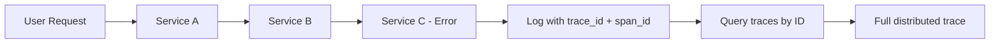

# How to Inject Trace IDs into Application Logs with OpenTelemetry SDKs

Author: [nawazdhandala](https://www.github.com/nawazdhandala)

Tags: OpenTelemetry, Tracing, Logging, Trace Context, Observability, Python, Java, Node.js

Description: Learn how to inject OpenTelemetry trace IDs and span IDs into your application logs to correlate log entries with distributed traces across services.

---

When something breaks in a distributed system, you usually start with the logs. You find an error message, but then what? You need to figure out which request caused it, what happened upstream, and what else was affected. Without a way to connect logs to traces, you end up jumping between tools and guessing at correlations.

Injecting trace IDs into your application logs solves this problem. Every log line gets tagged with the trace ID and span ID from the active OpenTelemetry context, so you can go from a log entry straight to the full distributed trace. This guide covers how to set this up in Python, Java, and Node.js.

---

## Why Trace-Log Correlation Matters

In a monolithic application, a stack trace usually tells you everything you need. But in microservices, a single user request might touch five or ten services. The error you see in Service C might have been caused by a timeout in Service A. Without trace context in your logs, connecting these dots requires timestamps and guesswork.

Here is how the correlation flow works:



With trace IDs in your logs, you can search your log aggregator for a specific trace ID and see every log line from every service that participated in that request. You can also click through from a log entry to the visual trace timeline in your observability backend.

---

## Python: Using the OpenTelemetry Logging Integration

Python's standard `logging` module is the most common logging framework in the ecosystem. OpenTelemetry provides a log record processor that automatically injects trace context into log records.

First, install the required packages:

```bash
# Install the OpenTelemetry SDK and the logging instrumentation
pip install opentelemetry-api \
            opentelemetry-sdk \
            opentelemetry-instrumentation-logging
```

Now configure your application to inject trace context into every log record:

```python
import logging
from opentelemetry import trace
from opentelemetry.sdk.trace import TracerProvider
from opentelemetry.sdk.trace.export import (
    SimpleSpanProcessor,
    ConsoleSpanExporter,
)
from opentelemetry.instrumentation.logging import LoggingInstrumentor

# Set up the tracer provider so spans are created and exported
provider = TracerProvider()
provider.add_span_processor(SimpleSpanProcessor(ConsoleSpanExporter()))
trace.set_tracer_provider(provider)

# This call patches the logging module to inject
# otelTraceID, otelSpanID, and otelServiceName
# into every log record automatically
LoggingInstrumentor().instrument(set_logging_format=True)

# Configure a formatter that includes the trace context fields
formatter = logging.Formatter(
    "%(asctime)s %(levelname)s [trace_id=%(otelTraceID)s "
    "span_id=%(otelSpanID)s] %(message)s"
)

handler = logging.StreamHandler()
handler.setFormatter(formatter)

# Set up the root logger with our custom handler
logger = logging.getLogger(__name__)
logger.addHandler(handler)
logger.setLevel(logging.INFO)

# Create a span and log within its context
tracer = trace.get_tracer(__name__)
with tracer.start_as_current_span("process-order"):
    logger.info("Processing order #12345")
    # This log line will include the active trace_id and span_id
```

The `LoggingInstrumentor` works by adding a logging filter that reads the current span context and attaches it to the log record. When there is no active span, the fields will be set to zero values, so your formatter will not break.

The output will look something like this:

```
2026-02-06 10:15:30 INFO [trace_id=a1b2c3d4e5f6a1b2c3d4e5f6a1b2c3d4 span_id=1a2b3c4d5e6f7a8b] Processing order #12345
```

---

## Java: Using the OpenTelemetry Log4j2 and Logback Appenders

Java applications typically use Log4j2 or Logback. OpenTelemetry provides MDC (Mapped Diagnostic Context) integration for both frameworks, which is the standard Java mechanism for attaching contextual data to log entries.

### Log4j2 Setup

Add the dependency to your project:

```xml
<!-- Maven dependency for OpenTelemetry Log4j2 context injection -->
<dependency>
    <groupId>io.opentelemetry.instrumentation</groupId>
    <artifactId>opentelemetry-log4j-context-data-2.17-autoconfigure</artifactId>
    <version>2.11.0-alpha</version>
    <scope>runtime</scope>
</dependency>
```

Then update your Log4j2 pattern to include the trace context from the MDC:

```xml
<!-- Log4j2 configuration with trace context in the pattern -->
<Configuration>
    <Appenders>
        <Console name="Console" target="SYSTEM_OUT">
            <!-- %X{trace_id} and %X{span_id} pull values from the MDC -->
            <!-- These are populated automatically by the OTel integration -->
            <PatternLayout pattern="%d{yyyy-MM-dd HH:mm:ss} %-5level [trace_id=%X{trace_id} span_id=%X{span_id}] %logger{36} - %msg%n"/>
        </Console>
    </Appenders>
    <Loggers>
        <Root level="info">
            <AppenderRef ref="Console"/>
        </Root>
    </Loggers>
</Configuration>
```

The OpenTelemetry Java agent automatically populates the MDC with `trace_id`, `span_id`, and `trace_flags` whenever a span is active. If you are using the agent, you do not need to write any code at all. Just add the dependency and update your log pattern.

### Logback Setup

For Logback, the setup is similar:

```xml
<!-- Maven dependency for OpenTelemetry Logback MDC injection -->
<dependency>
    <groupId>io.opentelemetry.instrumentation</groupId>
    <artifactId>opentelemetry-logback-mdc-1.0</artifactId>
    <version>2.11.0-alpha</version>
    <scope>runtime</scope>
</dependency>
```

Update your `logback.xml` to reference the MDC keys:

```xml
<!-- Logback configuration referencing OTel MDC fields -->
<configuration>
    <appender name="STDOUT" class="ch.qos.logback.core.ConsoleAppender">
        <encoder>
            <!-- %mdc{trace_id} reads the trace ID from the MDC map -->
            <pattern>%d{yyyy-MM-dd HH:mm:ss} %-5level [trace_id=%mdc{trace_id} span_id=%mdc{span_id}] %logger{36} - %msg%n</pattern>
        </encoder>
    </appender>
    <root level="info">
        <appender-ref ref="STDOUT"/>
    </root>
</configuration>
```

---

## Node.js: Using Winston or Pino with Trace Context

In the Node.js ecosystem, Winston and Pino are the two most popular logging libraries. Here is how to inject trace context into both.

### Winston Integration

```javascript
const { trace, context } = require("@opentelemetry/api");
const winston = require("winston");

// Custom format that extracts trace context from the active span
// and attaches it to every log entry as structured fields
const traceFormat = winston.format((info) => {
  const span = trace.getSpan(context.active());
  if (span) {
    const spanContext = span.spanContext();
    // Attach trace_id and span_id to the log record
    info.trace_id = spanContext.traceId;
    info.span_id = spanContext.spanId;
    info.trace_flags = spanContext.traceFlags.toString(16);
  }
  return info;
});

const logger = winston.createLogger({
  level: "info",
  format: winston.format.combine(
    traceFormat(),
    winston.format.timestamp(),
    // JSON format makes it easy for log aggregators to parse
    winston.format.json()
  ),
  transports: [new winston.transports.Console()],
});

module.exports = logger;
```

### Pino Integration

Pino uses a slightly different approach since it favors serializers and mixins:

```javascript
const { trace, context } = require("@opentelemetry/api");
const pino = require("pino");

// Pino's mixin function runs on every log call and merges
// the returned object into the log entry. This is the
// idiomatic way to add contextual fields in Pino.
const logger = pino({
  mixin() {
    const span = trace.getSpan(context.active());
    if (span) {
      const spanContext = span.spanContext();
      return {
        trace_id: spanContext.traceId,
        span_id: spanContext.spanId,
      };
    }
    return {};
  },
});

module.exports = logger;
```

Both approaches produce structured JSON logs where every entry that occurs inside an active span will carry the trace and span IDs.

---

## Structured Logging with the OTLP Log Exporter

Beyond just injecting trace IDs into text logs, OpenTelemetry also supports exporting logs directly through the OTLP protocol. This approach sends your logs as first-class telemetry data, with trace context attached automatically.

```python
from opentelemetry.sdk._logs import LoggerProvider, LoggingHandler
from opentelemetry.sdk._logs.export import BatchLogRecordProcessor
from opentelemetry.exporter.otlp.proto.grpc._log_exporter import (
    OTLPLogExporter,
)
import logging

# Configure the OTLP log exporter to send logs to your backend
# Trace context is attached to each log record automatically
exporter = OTLPLogExporter(endpoint="https://oneuptime.com/otlp")
logger_provider = LoggerProvider()
logger_provider.add_log_record_processor(
    BatchLogRecordProcessor(exporter)
)

# The LoggingHandler bridges Python's logging module with
# the OpenTelemetry Logs SDK. Any log record that passes
# through this handler gets exported via OTLP.
handler = LoggingHandler(
    level=logging.INFO,
    logger_provider=logger_provider,
)

logger = logging.getLogger(__name__)
logger.addHandler(handler)
```

With this setup, your logs, traces, and metrics all flow through the same OTLP pipeline. Your observability backend can automatically correlate them without any post-processing.

---

## Tips for Production Use

There are a few practical considerations when rolling this out across a real system.

First, always use structured logging (JSON) rather than plain text. Log aggregation tools like Elasticsearch or Loki can index the `trace_id` field directly, making searches fast.

Second, make sure your log sampling aligns with your trace sampling. If you sample 10% of traces but log everything, 90% of your log entries will have trace IDs that point to traces that do not exist. Consider logging at a higher level (WARN or ERROR) for unsampled requests.

Third, be mindful of log volume. Adding trace and span IDs increases the size of every log line by about 50 to 80 bytes. At high throughput, this adds up. Use batch processors and compression in your OTLP exporters to keep network costs manageable.

Finally, test the correlation end to end. Generate a request, grab the trace ID from the logs, and search for it in your tracing backend. If you are using [OneUptime](https://oneuptime.com), you can search by trace ID in the traces view and see the corresponding logs side by side.

---

## Conclusion

Injecting trace IDs into application logs is one of the highest-value, lowest-effort improvements you can make to your observability setup. It bridges the gap between logs and traces, turning your logging from a collection of isolated messages into a connected narrative that spans your entire distributed system. Whether you are using Python, Java, or Node.js, the OpenTelemetry SDK makes this straightforward with just a few lines of configuration.
