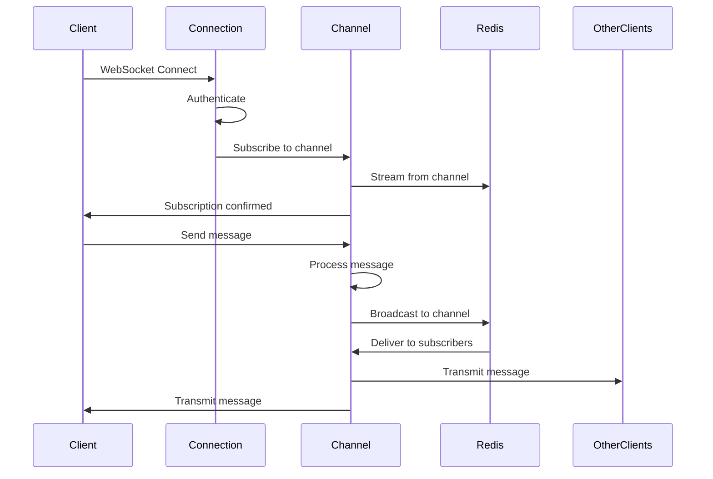

# How to Instrument ActionCable WebSockets with OpenTelemetry in Rails

Author: [nawazdhandala](https://www.github.com/nawazdhandala)

Tags: OpenTelemetry, Ruby, Rails, ActionCable, WebSockets, Real-Time

Description: Master OpenTelemetry instrumentation for ActionCable WebSocket connections, channels, and broadcasts in Rails applications for real-time observability.

ActionCable brings real-time features to Rails through WebSockets, powering chat applications, notifications, live updates, and collaborative editing. Unlike traditional HTTP requests, WebSocket connections are long-lived and bidirectional, making them challenging to monitor and debug. OpenTelemetry provides the instrumentation needed to track connection lifecycles, message flows, and performance issues in real-time applications.

## Why WebSocket Observability Matters

WebSocket connections operate differently from HTTP requests, creating unique observability challenges:

- Connections can last hours or days without visibility into their state
- Messages flow bidirectionally without clear request-response patterns
- Broadcasting to multiple clients happens asynchronously
- Connection drops and reconnections occur silently
- Performance issues manifest as message delays rather than slow responses

Without proper instrumentation, debugging WebSocket problems means blind guessing. OpenTelemetry makes every connection, subscription, broadcast, and message visible.

## Setting Up OpenTelemetry for ActionCable

Add required gems to your Gemfile:

```ruby
# Gemfile
gem 'opentelemetry-sdk'
gem 'opentelemetry-exporter-otlp'
gem 'opentelemetry-instrumentation-action_cable'
gem 'opentelemetry-instrumentation-rails'
gem 'opentelemetry-instrumentation-redis'
```

Install dependencies:

```bash
bundle install
```

Configure OpenTelemetry with ActionCable instrumentation:

```ruby
# config/initializers/opentelemetry.rb
require 'opentelemetry/sdk'
require 'opentelemetry/exporter/otlp'
require 'opentelemetry/instrumentation/all'

OpenTelemetry::SDK.configure do |c|
  c.service_name = 'rails-actioncable-app'
  c.service_version = '1.0.0'

  c.use_all({
    'OpenTelemetry::Instrumentation::ActionCable' => {
      # Enable detailed tracing
      enable_redis_notification: true,
      span_naming: :channel_name
    },
    'OpenTelemetry::Instrumentation::Redis' => {},
    'OpenTelemetry::Instrumentation::Rails' => {}
  })
end
```

This automatically instruments connection handling, channel subscriptions, and message broadcasting.

## Tracing WebSocket Connections

ActionCable connection lifecycle is automatically traced, but add custom context:

```ruby
# app/channels/application_cable/connection.rb
module ApplicationCable
  class Connection < ActionCable::Connection::Base
    identified_by :current_user

    def connect
      tracer = OpenTelemetry.tracer_provider.tracer('actioncable-connection')

      tracer.in_span('websocket_connect',
                     attributes: {
                       'connection.id' => connection.connection_identifier,
                       'connection.origin' => request.origin
                     }) do |span|

        self.current_user = find_verified_user

        span.set_attribute('user.id', current_user.id)
        span.set_attribute('user.email', current_user.email)
        span.add_event('user_authenticated')

        logger.add_tags 'ActionCable', "User #{current_user.id}"

        span.set_attribute('connection.established', true)
      end
    end

    def disconnect
      tracer = OpenTelemetry.tracer_provider.tracer('actioncable-connection')

      tracer.in_span('websocket_disconnect',
                     attributes: {
                       'connection.id' => connection.connection_identifier,
                       'user.id' => current_user&.id
                     }) do |span|

        span.add_event('user_disconnected')
        span.set_attribute('connection.duration_seconds',
                          (Time.now - @connected_at).to_i) if @connected_at
      end
    end

    private

    def find_verified_user
      @connected_at = Time.now

      if verified_user = User.find_by(id: cookies.encrypted[:user_id])
        verified_user
      else
        reject_unauthorized_connection
      end
    end
  end
end
```

## Instrumenting Channel Subscriptions

Trace channel subscriptions and message handling:

```ruby
# app/channels/chat_channel.rb
class ChatChannel < ApplicationCable::Channel
  def subscribed
    tracer = OpenTelemetry.tracer_provider.tracer('chat-channel')

    tracer.in_span('chat_channel_subscribed',
                   attributes: {
                     'channel.name' => 'ChatChannel',
                     'user.id' => current_user.id,
                     'room.id' => params[:room_id]
                   }) do |span|

      @room = ChatRoom.find(params[:room_id])

      # Verify user has access to room
      unless @room.accessible_by?(current_user)
        span.set_attribute('subscription.rejected', true)
        span.add_event('unauthorized_subscription_attempt')
        reject
        return
      end

      stream_from "chat_room_#{@room.id}"

      span.set_attribute('subscription.accepted', true)
      span.set_attribute('room.name', @room.name)
      span.set_attribute('room.participant_count', @room.participants.count)
      span.add_event('streaming_started', attributes: {
        'stream.name' => "chat_room_#{@room.id}"
      })
    end
  end

  def unsubscribed
    tracer = OpenTelemetry.tracer_provider.tracer('chat-channel')

    tracer.in_span('chat_channel_unsubscribed',
                   attributes: {
                     'channel.name' => 'ChatChannel',
                     'user.id' => current_user.id,
                     'room.id' => @room&.id
                   }) do |span|

      span.add_event('streaming_stopped')
      stop_all_streams
    end
  end

  def receive(data)
    tracer = OpenTelemetry.tracer_provider.tracer('chat-channel')

    tracer.in_span('chat_message_received',
                   attributes: {
                     'channel.name' => 'ChatChannel',
                     'user.id' => current_user.id,
                     'room.id' => @room.id,
                     'message.type' => data['type']
                   }) do |span|

      case data['type']
      when 'message'
        handle_message(data['content'], span)
      when 'typing'
        handle_typing_indicator(span)
      else
        span.add_event('unknown_message_type', attributes: {
          'type' => data['type']
        })
      end
    end
  end

  private

  def handle_message(content, span)
    message = @room.messages.create!(
      user: current_user,
      content: content
    )

    span.set_attribute('message.id', message.id)
    span.set_attribute('message.length', content.length)

    # Broadcast to all room participants
    broadcast_message(message, span)
  end

  def handle_typing_indicator(span)
    span.add_event('typing_indicator_received')

    ActionCable.server.broadcast(
      "chat_room_#{@room.id}",
      {
        type: 'typing',
        user_id: current_user.id,
        user_name: current_user.name
      }
    )
  end

  def broadcast_message(message, span)
    tracer = OpenTelemetry.tracer_provider.tracer('chat-channel')

    tracer.in_span('broadcast_chat_message',
                   attributes: {
                     'message.id' => message.id,
                     'room.id' => @room.id
                   }) do |broadcast_span|

      broadcast_to_room({
        type: 'message',
        id: message.id,
        user_id: message.user_id,
        user_name: message.user.name,
        content: message.content,
        created_at: message.created_at
      })

      broadcast_span.add_event('message_broadcasted', attributes: {
        'recipient_count' => @room.participants.count
      })
    end
  end

  def broadcast_to_room(data)
    ActionCable.server.broadcast("chat_room_#{@room.id}", data)
  end
end
```

## Tracking Broadcast Performance

Create a wrapper to monitor broadcast operations:

```ruby
# app/services/instrumented_broadcaster.rb
class InstrumentedBroadcaster
  def initialize
    @tracer = OpenTelemetry.tracer_provider.tracer('broadcaster')
    @meter = OpenTelemetry.meter_provider.meter('broadcast-metrics')

    @broadcast_counter = @meter.create_counter(
      'actioncable.broadcasts',
      unit: '1',
      description: 'Total broadcasts sent'
    )

    @broadcast_duration = @meter.create_histogram(
      'actioncable.broadcast.duration',
      unit: 'ms',
      description: 'Broadcast operation duration'
    )
  end

  def broadcast_to(stream, data)
    @tracer.in_span('actioncable_broadcast',
                    attributes: {
                      'stream.name' => stream,
                      'data.type' => data[:type]
                    }) do |span|

      start_time = Time.now

      # Perform broadcast
      ActionCable.server.broadcast(stream, data)

      duration_ms = ((Time.now - start_time) * 1000).round(2)

      # Record metrics
      @broadcast_counter.add(1, attributes: {
        'stream.prefix' => extract_stream_prefix(stream),
        'data.type' => data[:type]
      })

      @broadcast_duration.record(duration_ms, attributes: {
        'stream.prefix' => extract_stream_prefix(stream)
      })

      span.set_attribute('broadcast.duration_ms', duration_ms)
      span.set_attribute('broadcast.data_size_bytes', data.to_json.bytesize)
      span.add_event('broadcast_completed')
    end
  end

  def broadcast_to_multiple(streams, data)
    @tracer.in_span('actioncable_broadcast_multiple',
                    attributes: {
                      'stream.count' => streams.length,
                      'data.type' => data[:type]
                    }) do |span|

      streams.each do |stream|
        broadcast_to(stream, data)
      end

      span.add_event('all_broadcasts_completed', attributes: {
        'streams_broadcasted' => streams.length
      })
    end
  end

  private

  def extract_stream_prefix(stream)
    stream.to_s.split('_').first || 'unknown'
  end
end
```

## Monitoring Real-Time Notifications

Implement a notification channel with comprehensive tracing:

```ruby
# app/channels/notifications_channel.rb
class NotificationsChannel < ApplicationCable::Channel
  def subscribed
    tracer = OpenTelemetry.tracer_provider.tracer('notifications-channel')

    tracer.in_span('notifications_channel_subscribed',
                   attributes: {
                     'user.id' => current_user.id
                   }) do |span|

      stream_for current_user

      span.add_event('streaming_user_notifications')

      # Send pending notifications on subscription
      send_pending_notifications(span)
    end
  end

  def mark_as_read(data)
    tracer = OpenTelemetry.tracer_provider.tracer('notifications-channel')

    tracer.in_span('mark_notification_read',
                   attributes: {
                     'user.id' => current_user.id,
                     'notification.id' => data['notification_id']
                   }) do |span|

      notification = current_user.notifications.find(data['notification_id'])
      notification.mark_as_read!

      span.add_event('notification_marked_read')

      # Acknowledge to client
      transmit({
        type: 'read_acknowledged',
        notification_id: notification.id
      })
    end
  end

  private

  def send_pending_notifications(span)
    pending = current_user.notifications.unread.recent.limit(20)

    span.set_attribute('pending_notifications.count', pending.count)

    if pending.any?
      transmit({
        type: 'pending_notifications',
        notifications: pending.map(&:to_broadcast_hash)
      })

      span.add_event('pending_notifications_sent', attributes: {
        'count' => pending.count
      })
    end
  end
end

# app/models/notification.rb
class Notification < ApplicationRecord
  belongs_to :user

  after_create_commit :broadcast_to_user

  def broadcast_to_user
    tracer = OpenTelemetry.tracer_provider.tracer('notification-model')

    tracer.in_span('broadcast_notification',
                   attributes: {
                     'notification.id' => id,
                     'notification.type' => notification_type,
                     'user.id' => user_id
                   }) do |span|

      NotificationsChannel.broadcast_to(
        user,
        {
          type: 'new_notification',
          notification: to_broadcast_hash
        }
      )

      span.add_event('notification_broadcasted')
    end
  end

  def to_broadcast_hash
    {
      id: id,
      type: notification_type,
      title: title,
      message: message,
      created_at: created_at,
      read: read_at.present?
    }
  end
end
```

## Visualizing WebSocket Message Flow

Here is how WebSocket messages flow through ActionCable:



## Handling Connection Failures and Reconnections

Track connection stability and reconnection patterns:

```ruby
# app/channels/application_cable/connection.rb
module ApplicationCable
  class Connection < ActionCable::Connection::Base
    identified_by :current_user, :session_id

    def connect
      @session_id = SecureRandom.uuid
      @connected_at = Time.now

      tracer = OpenTelemetry.tracer_provider.tracer('actioncable-connection')

      tracer.in_span('websocket_connect',
                     attributes: {
                       'session.id' => @session_id,
                       'connection.attempt' => connection_attempt_count
                     }) do |span|

        self.current_user = find_verified_user

        span.set_attribute('user.id', current_user.id)

        # Track if this is a reconnection
        if previous_session = find_previous_session
          span.set_attribute('connection.is_reconnection', true)
          span.set_attribute('connection.previous_session_id', previous_session.id)

          time_since_disconnect = Time.now - previous_session.disconnected_at
          span.set_attribute('connection.time_since_disconnect_seconds',
                            time_since_disconnect.to_i)

          span.add_event('reconnection_detected', attributes: {
            'downtime_seconds' => time_since_disconnect.to_i
          })
        else
          span.set_attribute('connection.is_reconnection', false)
        end

        # Store connection info
        ConnectionSession.create!(
          user: current_user,
          session_id: @session_id,
          connected_at: @connected_at
        )
      end
    end

    def disconnect
      tracer = OpenTelemetry.tracer_provider.tracer('actioncable-connection')

      tracer.in_span('websocket_disconnect',
                     attributes: {
                       'session.id' => @session_id,
                       'user.id' => current_user&.id
                     }) do |span|

        duration = Time.now - @connected_at
        span.set_attribute('connection.duration_seconds', duration.to_i)

        # Update session record
        if session = ConnectionSession.find_by(session_id: @session_id)
          session.update!(
            disconnected_at: Time.now,
            duration_seconds: duration.to_i
          )
        end

        span.add_event('connection_closed', attributes: {
          'duration_seconds' => duration.to_i
        })
      end
    end

    private

    def find_previous_session
      current_user.connection_sessions
                  .where('disconnected_at > ?', 5.minutes.ago)
                  .order(disconnected_at: :desc)
                  .first
    end

    def connection_attempt_count
      cookies[:connection_attempts].to_i + 1
    end
  end
end
```

## Monitoring Channel Performance Metrics

Create comprehensive metrics for channel operations:

```ruby
# app/channels/concerns/instrumented_channel.rb
module InstrumentedChannel
  extend ActiveSupport::Concern

  included do
    before_subscribe :track_subscription_start
    after_subscribe :track_subscription_complete
  end

  private

  def track_subscription_start
    @subscription_start_time = Time.now
    @tracer = OpenTelemetry.tracer_provider.tracer(self.class.name.underscore)
  end

  def track_subscription_complete
    return unless @subscription_start_time

    duration_ms = ((Time.now - @subscription_start_time) * 1000).round(2)

    @tracer.in_span('subscription_completed',
                    attributes: {
                      'channel.name' => self.class.name,
                      'subscription.duration_ms' => duration_ms
                    }) do |span|

      span.add_event('subscription_ready')
    end
  end

  def track_message_transmission(data)
    @tracer.in_span('message_transmission',
                    attributes: {
                      'channel.name' => self.class.name,
                      'message.type' => data[:type],
                      'message.size_bytes' => data.to_json.bytesize
                    }) do |span|

      transmit(data)

      span.add_event('message_transmitted')
    end
  end
end

# Usage in channels
class ChatChannel < ApplicationCable::Channel
  include InstrumentedChannel

  def subscribed
    # Automatic instrumentation via concern
    stream_from "chat_room_#{params[:room_id]}"
  end

  def receive(data)
    track_message_transmission({
      type: 'message',
      content: data['content']
    })
  end
end
```

## Best Practices for ActionCable Observability

Always propagate trace context through WebSocket messages:

```ruby
# app/channels/application_cable/channel.rb
module ApplicationCable
  class Channel < ActionCable::Channel::Base
    private

    def transmit_with_trace_context(data)
      current_span = OpenTelemetry::Trace.current_span

      if current_span
        data[:trace_id] = current_span.context.trace_id.unpack1('H*')
        data[:span_id] = current_span.context.span_id.unpack1('H*')
      end

      transmit(data)
    end
  end
end
```

With comprehensive OpenTelemetry instrumentation, your ActionCable WebSocket infrastructure becomes fully observable. You can track connection lifecycles, monitor message flows, measure broadcast performance, and debug real-time issues with confidence. This visibility is critical for building reliable, performant real-time features in Rails applications.
