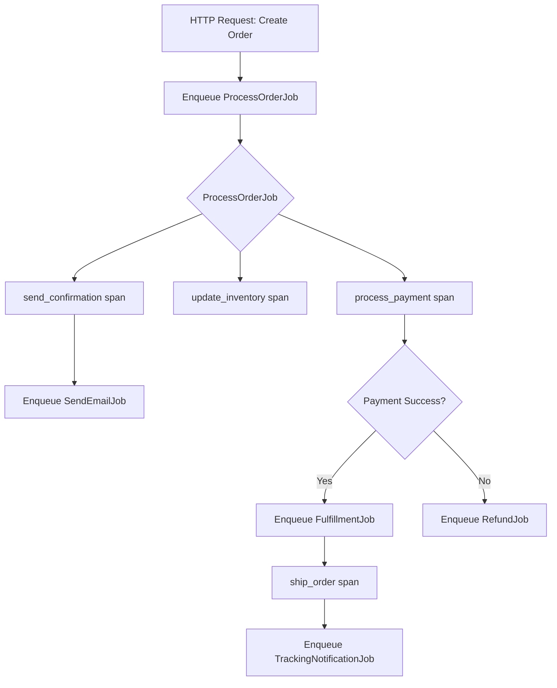

# How to Instrument ActiveJob Background Processes with OpenTelemetry in Rails

Author: [nawazdhandala](https://www.github.com/nawazdhandala)

Tags: OpenTelemetry, Ruby, Rails, ActiveJob, Background Jobs, Tracing

Description: Learn how to add comprehensive OpenTelemetry tracing to ActiveJob background processes in Rails applications for better observability and debugging.

Background jobs are the backbone of modern Rails applications, handling everything from sending emails to processing payments. When these jobs fail or slow down, debugging becomes a nightmare without proper observability. OpenTelemetry provides the instrumentation you need to trace job execution, measure performance, and understand dependencies between jobs.

## Understanding ActiveJob and Observability Challenges

ActiveJob provides a unified interface for background job processing in Rails, supporting multiple backends like Sidekiq, Resque, and Delayed Job. Each job runs asynchronously, often on different servers, making it difficult to track execution flow and identify bottlenecks.

Common observability challenges include:

- Jobs failing silently without clear error context
- Cascading job failures that are hard to trace back to root causes
- Performance degradation that affects user-facing features
- Missing correlation between HTTP requests and the jobs they trigger
- Difficulty measuring job queue depth and processing times

OpenTelemetry solves these problems by creating distributed traces that span from the initial request through all background jobs, providing end-to-end visibility.

## Setting Up OpenTelemetry for ActiveJob

First, add the necessary gems to your Gemfile:

```ruby
# Gemfile
gem 'opentelemetry-sdk'
gem 'opentelemetry-exporter-otlp'
gem 'opentelemetry-instrumentation-active_job'
gem 'opentelemetry-instrumentation-active_support'
gem 'opentelemetry-instrumentation-rails'
```

Install the gems:

```bash
bundle install
```

Create an OpenTelemetry initializer to configure instrumentation:

```ruby
# config/initializers/opentelemetry.rb
require 'opentelemetry/sdk'
require 'opentelemetry/exporter/otlp'
require 'opentelemetry/instrumentation/all'

OpenTelemetry::SDK.configure do |c|
  c.service_name = 'rails-background-jobs'
  c.service_version = '1.0.0'

  # Configure OTLP exporter to send to your collector
  c.use_all({
    'OpenTelemetry::Instrumentation::ActiveJob' => {
      # Capture job arguments for better debugging
      span_naming: :job_class,
      propagation_style: :link,
    },
    'OpenTelemetry::Instrumentation::ActiveSupport' => {},
    'OpenTelemetry::Instrumentation::Rails' => {},
  })
end
```

This configuration automatically instruments all ActiveJob executions, creating spans for each job with relevant metadata.

## Tracing Job Execution Flow

The basic instrumentation captures job lifecycle automatically. Here's what a typical job looks like:

```ruby
# app/jobs/send_welcome_email_job.rb
class SendWelcomeEmailJob < ApplicationJob
  queue_as :default

  def perform(user_id)
    user = User.find(user_id)
    UserMailer.welcome_email(user).deliver_now
  end
end
```

When this job executes, OpenTelemetry automatically creates a span with attributes like:

- `messaging.system`: The queue adapter (sidekiq, delayed_job, etc.)
- `messaging.destination`: The queue name
- `messaging.operation`: enqueue or process
- `code.namespace`: SendWelcomeEmailJob
- `code.function`: perform

## Adding Custom Spans and Context

For complex jobs, add custom spans to track specific operations:

```ruby
# app/jobs/process_order_job.rb
class ProcessOrderJob < ApplicationJob
  queue_as :orders

  def perform(order_id)
    tracer = OpenTelemetry.tracer_provider.tracer('order-processing')

    order = Order.find(order_id)

    # Create a custom span for payment processing
    tracer.in_span('process_payment',
                   attributes: {
                     'order.id' => order.id,
                     'order.total' => order.total_amount
                   }) do |span|
      payment_result = PaymentService.charge(order)

      span.set_attribute('payment.status', payment_result.status)
      span.set_attribute('payment.transaction_id', payment_result.transaction_id)

      if payment_result.failed?
        span.status = OpenTelemetry::Trace::Status.error('Payment failed')
        raise PaymentError, payment_result.error_message
      end
    end

    # Track inventory update separately
    tracer.in_span('update_inventory') do
      InventoryService.reserve_items(order.line_items)
    end

    # Track notification sending
    tracer.in_span('send_confirmation') do
      OrderMailer.confirmation(order).deliver_now
    end
  end
end
```

This creates a detailed trace showing exactly where time is spent and which operation failed if something goes wrong.

## Propagating Context Between Jobs

When jobs trigger other jobs, maintaining trace context is crucial for understanding the complete workflow:

```ruby
# app/jobs/user_onboarding_job.rb
class UserOnboardingJob < ApplicationJob
  queue_as :onboarding

  def perform(user_id)
    tracer = OpenTelemetry.tracer_provider.tracer('onboarding')

    tracer.in_span('user_onboarding') do |span|
      user = User.find(user_id)
      span.set_attribute('user.id', user_id)
      span.set_attribute('user.email', user.email)

      # These jobs will be linked to the parent trace
      SendWelcomeEmailJob.perform_later(user_id)
      SetupDefaultPreferencesJob.perform_later(user_id)
      AssignOnboardingTasksJob.perform_later(user_id)

      # Track completion
      span.add_event('onboarding_jobs_enqueued',
                     attributes: { 'jobs.count' => 3 })
    end
  end
end
```

The OpenTelemetry instrumentation automatically propagates trace context through job serialization, so all child jobs appear in the same distributed trace.

## Monitoring Job Performance and Errors

Add custom metrics and error tracking to jobs:

```ruby
# app/jobs/data_import_job.rb
class DataImportJob < ApplicationJob
  queue_as :imports
  retry_on StandardError, wait: :exponentially_longer, attempts: 5

  def perform(import_id)
    tracer = OpenTelemetry.tracer_provider.tracer('data-import')

    tracer.in_span('data_import',
                   kind: :consumer,
                   attributes: { 'import.id' => import_id }) do |span|
      import = DataImport.find(import_id)

      begin
        records_processed = 0
        errors = []

        import.data_rows.find_each do |row|
          tracer.in_span('process_row') do |row_span|
            process_row(row)
            records_processed += 1
            row_span.set_attribute('row.id', row.id)
          end
        rescue StandardError => e
          errors << { row_id: row.id, error: e.message }
          span.add_event('row_processing_error',
                         attributes: {
                           'row.id' => row.id,
                           'error.message' => e.message
                         })
        end

        # Record final statistics
        span.set_attribute('import.records_processed', records_processed)
        span.set_attribute('import.errors_count', errors.length)
        span.set_attribute('import.success_rate',
                          (records_processed.to_f / import.data_rows.count * 100).round(2))

        if errors.any?
          span.status = OpenTelemetry::Trace::Status.error('Import completed with errors')
        else
          span.status = OpenTelemetry::Trace::Status.ok
        end

      rescue StandardError => e
        span.record_exception(e)
        span.status = OpenTelemetry::Trace::Status.error(e.message)
        raise
      end
    end
  end

  private

  def process_row(row)
    # Row processing logic
  end
end
```

## Visualizing Job Workflows

Complex workflows involving multiple jobs benefit from structured tracing. Here's a workflow diagram:



This workflow creates a trace tree where each node is a span, making it easy to identify slow operations or failures.

## Advanced Patterns for Job Observability

For batch processing jobs, implement chunked tracing:

```ruby
# app/jobs/batch_processor_job.rb
class BatchProcessorJob < ApplicationJob
  queue_as :batch

  def perform(record_ids)
    tracer = OpenTelemetry.tracer_provider.tracer('batch-processor')

    tracer.in_span('batch_processing',
                   attributes: { 'batch.size' => record_ids.length }) do |span|

      # Process in chunks to avoid overwhelming traces
      record_ids.each_slice(100).with_index do |chunk, chunk_index|
        tracer.in_span("process_chunk_#{chunk_index}",
                       attributes: {
                         'chunk.index' => chunk_index,
                         'chunk.size' => chunk.length
                       }) do |chunk_span|

          chunk.each do |record_id|
            process_record(record_id)
          end

          chunk_span.set_attribute('chunk.completed', true)
        end
      end

      span.set_attribute('batch.status', 'completed')
    end
  end

  private

  def process_record(record_id)
    # Processing logic
  end
end
```

## Debugging Failed Jobs

When jobs fail, OpenTelemetry traces provide detailed context:

```ruby
# app/jobs/retry_aware_job.rb
class RetryAwareJob < ApplicationJob
  queue_as :default
  retry_on StandardError, wait: 5.seconds, attempts: 3

  def perform(item_id)
    tracer = OpenTelemetry.tracer_provider.tracer('retry-aware')

    tracer.in_span('retry_aware_processing') do |span|
      # Track retry attempts
      retry_count = executions - 1
      span.set_attribute('job.retry_count', retry_count)
      span.set_attribute('job.max_attempts', 3)

      if retry_count > 0
        span.add_event('job_retry',
                       attributes: { 'attempt' => retry_count + 1 })
      end

      begin
        # Job logic that might fail
        result = ExternalService.call(item_id)
        span.set_attribute('result.status', result.status)

      rescue ExternalService::RateLimitError => e
        span.record_exception(e)
        span.add_event('rate_limit_hit',
                       attributes: {
                         'retry_after' => e.retry_after,
                         'will_retry' => retry_count < 2
                       })
        raise
      rescue StandardError => e
        span.record_exception(e)
        span.status = OpenTelemetry::Trace::Status.error(e.message)
        raise
      end
    end
  end
end
```

## Configuration for Different Queue Adapters

Different queue adapters need specific configuration:

```ruby
# config/initializers/opentelemetry.rb
OpenTelemetry::SDK.configure do |c|
  c.service_name = ENV.fetch('OTEL_SERVICE_NAME', 'rails-app')

  # Adapter-specific configuration
  adapter_config = case Rails.application.config.active_job.queue_adapter
  when :sidekiq
    {
      peer_service: 'sidekiq',
      span_naming: :job_class,
    }
  when :delayed_job
    {
      peer_service: 'delayed_job',
      span_naming: :job_class,
    }
  when :resque
    {
      peer_service: 'resque',
      span_naming: :job_class,
    }
  else
    {}
  end

  c.use_all({
    'OpenTelemetry::Instrumentation::ActiveJob' => adapter_config
  })
end
```

## Performance Considerations

Instrumentation adds overhead, so configure sampling for high-volume jobs:

```ruby
# config/initializers/opentelemetry.rb
OpenTelemetry::SDK.configure do |c|
  c.service_name = 'rails-background-jobs'

  # Use parent-based sampling to inherit decisions
  c.add_span_processor(
    OpenTelemetry::SDK::Trace::Export::BatchSpanProcessor.new(
      OpenTelemetry::Exporter::OTLP::Exporter.new
    )
  )

  # Configure sampler based on environment
  c.sampler = if Rails.env.production?
    # Sample 10% of traces in production
    OpenTelemetry::SDK::Trace::Samplers::TraceIdRatioBased.new(0.1)
  else
    # Sample everything in development
    OpenTelemetry::SDK::Trace::Samplers::ALWAYS_ON
  end
end
```

With comprehensive OpenTelemetry instrumentation, your ActiveJob background processes become transparent and debuggable. You can trace the complete lifecycle of every job, understand performance characteristics, and quickly identify the root cause of failures. This visibility is essential for maintaining reliable background processing in production Rails applications.
