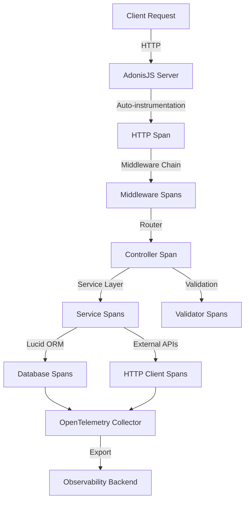

# How to Instrument AdonisJS with OpenTelemetry

Author: [nawazdhandala](https://www.github.com/nawazdhandala)

Tags: OpenTelemetry, AdonisJS, Node.js, TypeScript, Full-Stack, Tracing

Description: Learn how to implement comprehensive OpenTelemetry instrumentation in AdonisJS applications for distributed tracing, monitoring, and full-stack observability.

AdonisJS stands out as a batteries-included TypeScript framework that brings structure and elegance to Node.js development. With its powerful ORM, built-in authentication, validator, and IoC container, AdonisJS applications can quickly grow into complex systems handling critical business logic. As these applications scale, comprehensive observability becomes essential for maintaining performance and reliability.

OpenTelemetry provides standardized instrumentation that integrates seamlessly with AdonisJS's architecture, enabling distributed tracing across controllers, middleware, services, and database operations. This guide demonstrates implementing complete observability in AdonisJS applications, from initial setup through advanced patterns for monitoring the entire application stack.

## Why Instrument AdonisJS Applications

AdonisJS applications often serve as the backbone of business systems, handling everything from API requests to background jobs and scheduled tasks. The framework's opinionated structure and rich feature set mean multiple layers execute for each request, making performance debugging challenging without proper visibility.

OpenTelemetry instrumentation provides:

- End-to-end request tracing through middleware and controllers
- Database query performance monitoring with Lucid ORM
- Tracking of background jobs and scheduled tasks
- External service dependency analysis
- Error correlation across the application stack
- Performance insights into authentication and authorization

## Architecture Overview

OpenTelemetry integrates with AdonisJS at multiple architectural layers:



## Installing Dependencies

Install OpenTelemetry packages alongside your AdonisJS application. AdonisJS 5 uses Node.js, allowing standard Node.js instrumentation.

```bash
# Install AdonisJS packages if not already present
npm install @adonisjs/core @adonisjs/lucid @adonisjs/auth

# Install OpenTelemetry packages
npm install @opentelemetry/api \
  @opentelemetry/sdk-node \
  @opentelemetry/auto-instrumentations-node \
  @opentelemetry/instrumentation-http \
  @opentelemetry/exporter-trace-otlp-http \
  @opentelemetry/resources \
  @opentelemetry/semantic-conventions
```

## Configuring OpenTelemetry Initialization

Create an instrumentation provider that initializes OpenTelemetry before AdonisJS bootstraps. This ensures all framework operations are captured.

```typescript
// providers/TelemetryProvider.ts
// OpenTelemetry provider for AdonisJS application
// Initializes tracing infrastructure

import { ApplicationContract } from '@ioc:Adonis/Core/Application';
import { NodeSDK } from '@opentelemetry/sdk-node';
import { getNodeAutoInstrumentations } from '@opentelemetry/auto-instrumentations-node';
import { OTLPTraceExporter } from '@opentelemetry/exporter-trace-otlp-http';
import { Resource } from '@opentelemetry/resources';
import { SemanticResourceAttributes } from '@opentelemetry/semantic-conventions';

export default class TelemetryProvider {
  private sdk: NodeSDK;

  constructor(protected app: ApplicationContract) {}

  public register() {
    // Configure OTLP exporter
    const traceExporter = new OTLPTraceExporter({
      url: this.app.env.get('OTEL_EXPORTER_OTLP_ENDPOINT', 'http://localhost:4318/v1/traces'),
      headers: {},
    });

    // Define service resource
    const resource = Resource.default().merge(
      new Resource({
        [SemanticResourceAttributes.SERVICE_NAME]: this.app.env.get('SERVICE_NAME', 'adonisjs-app'),
        [SemanticResourceAttributes.SERVICE_VERSION]: this.app.env.get('SERVICE_VERSION', '1.0.0'),
        [SemanticResourceAttributes.DEPLOYMENT_ENVIRONMENT]: this.app.env.get('NODE_ENV', 'development'),
        'service.framework': 'adonisjs',
        'service.framework.version': '5.0',
      })
    );

    // Initialize OpenTelemetry SDK
    this.sdk = new NodeSDK({
      resource,
      traceExporter,
      instrumentations: [
        getNodeAutoInstrumentations({
          '@opentelemetry/instrumentation-http': {
            ignoreIncomingRequestHook: (req) => {
              // Exclude health checks and static assets
              return req.url === '/health' || req.url?.startsWith('/assets');
            },
            requestHook: (span, request) => {
              span.setAttribute('http.user_agent', request.headers['user-agent'] || 'unknown');
            },
          },
          '@opentelemetry/instrumentation-fs': {
            enabled: false,
          },
        }),
      ],
    });

    // Start SDK
    this.sdk.start();
    console.log('OpenTelemetry instrumentation started for AdonisJS');
  }

  public async boot() {
    // Provider boot logic if needed
  }

  public async ready() {
    // Provider ready logic if needed
  }

  public async shutdown() {
    // Gracefully shutdown OpenTelemetry SDK
    try {
      await this.sdk.shutdown();
      console.log('OpenTelemetry SDK shutdown complete');
    } catch (error) {
      console.error('Error shutting down OpenTelemetry SDK', error);
    }
  }
}
```

Register the provider in your AdonisJS configuration:

```typescript
// .adonisrc.json
// Add TelemetryProvider to providers list
{
  "providers": [
    "./providers/AppProvider",
    "./providers/TelemetryProvider",
    "@adonisjs/core"
  ]
}
```

## Creating Tracing Middleware

Build middleware that enriches traces with AdonisJS-specific context and tracks request lifecycle.

```typescript
// app/Middleware/TracingMiddleware.ts
// Middleware for OpenTelemetry trace enrichment in AdonisJS

import { HttpContextContract } from '@ioc:Adonis/Core/HttpContext';
import { trace } from '@opentelemetry/api';

const tracer = trace.getTracer('adonisjs-middleware');

export default class TracingMiddleware {
  public async handle(ctx: HttpContextContract, next: () => Promise<void>) {
    return await tracer.startActiveSpan('middleware.tracing', async (span) => {
      try {
        const activeSpan = trace.getActiveSpan();

        if (activeSpan) {
          // Enrich span with AdonisJS context
          activeSpan.setAttribute('adonisjs.route', ctx.route?.name || 'unknown');
          activeSpan.setAttribute('adonisjs.controller', ctx.route?.meta?.resolvedHandler?.name || 'unknown');
          activeSpan.setAttribute('http.method', ctx.request.method());
          activeSpan.setAttribute('http.url', ctx.request.url(true));
          activeSpan.setAttribute('http.route', ctx.route?.pattern || ctx.request.url());

          // Extract request ID if present
          const requestId = ctx.request.header('x-request-id');
          if (requestId) {
            activeSpan.setAttribute('request.id', requestId);
          }

          // Add user information if authenticated
          if (ctx.auth?.user) {
            activeSpan.setAttribute('user.id', ctx.auth.user.id);
            activeSpan.setAttribute('user.authenticated', true);
          }

          // Track tenant information for multi-tenant apps
          const tenantId = ctx.request.header('x-tenant-id');
          if (tenantId) {
            activeSpan.setAttribute('tenant.id', tenantId);
          }
        }

        const startTime = Date.now();
        await next();
        const duration = Date.now() - startTime;

        if (activeSpan) {
          // Add response information
          activeSpan.setAttribute('http.status_code', ctx.response.getStatus());
          activeSpan.setAttribute('http.response.duration_ms', duration);

          // Set span status based on response
          const status = ctx.response.getStatus();
          if (status >= 500) {
            activeSpan.setStatus({ code: 2, message: 'Server error' });
          } else if (status >= 400) {
            activeSpan.setStatus({ code: 2, message: 'Client error' });
          } else {
            activeSpan.setStatus({ code: 1 });
          }
        }

        span.setStatus({ code: 1 });
      } catch (error) {
        span.recordException(error);
        span.setStatus({ code: 2, message: error.message });
        throw error;
      } finally {
        span.end();
      }
    });
  }
}
```

Register the middleware in your kernel:

```typescript
// start/kernel.ts
// Register TracingMiddleware globally

import Server from '@ioc:Adonis/Core/Server';

Server.middleware.register([
  () => import('@ioc:Adonis/Core/BodyParser'),
  () => import('App/Middleware/TracingMiddleware'),
]);
```

## Instrumenting Controllers

Add tracing to controllers to monitor business logic execution and identify performance bottlenecks.

```typescript
// app/Controllers/Http/UsersController.ts
// User controller with OpenTelemetry tracing

import { HttpContextContract } from '@ioc:Adonis/Core/HttpContext';
import User from 'App/Models/User';
import { trace } from '@opentelemetry/api';

const tracer = trace.getTracer('adonisjs-controllers');

export default class UsersController {
  // GET /users - List users with pagination
  public async index({ request, response }: HttpContextContract) {
    return await tracer.startActiveSpan('controller.users.index', async (span) => {
      try {
        span.setAttribute('controller', 'UsersController');
        span.setAttribute('action', 'index');

        // Parse pagination parameters
        const page = request.input('page', 1);
        const limit = request.input('limit', 10);

        span.setAttribute('pagination.page', page);
        span.setAttribute('pagination.limit', limit);

        // Query users with tracing
        const users = await tracer.startActiveSpan('db.query.users', async (dbSpan) => {
          dbSpan.setAttribute('db.operation', 'SELECT');
          dbSpan.setAttribute('db.model', 'User');

          try {
            const result = await User.query()
              .select('id', 'email', 'username', 'created_at')
              .paginate(page, limit);

            dbSpan.setAttribute('db.result.count', result.length);
            dbSpan.setAttribute('db.result.total', result.total);
            dbSpan.setStatus({ code: 1 });

            return result;
          } catch (error) {
            dbSpan.recordException(error);
            dbSpan.setStatus({ code: 2, message: error.message });
            throw error;
          } finally {
            dbSpan.end();
          }
        });

        span.setAttribute('response.user_count', users.length);
        span.setAttribute('response.total', users.total);
        span.setStatus({ code: 1 });

        return response.ok(users);
      } catch (error) {
        span.recordException(error);
        span.setStatus({ code: 2, message: error.message });
        return response.internalServerError({ error: 'Failed to fetch users' });
      } finally {
        span.end();
      }
    });
  }

  // GET /users/:id - Get user by ID
  public async show({ params, response }: HttpContextContract) {
    return await tracer.startActiveSpan('controller.users.show', async (span) => {
      try {
        const userId = params.id;

        span.setAttribute('controller', 'UsersController');
        span.setAttribute('action', 'show');
        span.setAttribute('user.id', userId);

        // Fetch user with relations
        const user = await tracer.startActiveSpan('db.query.user', async (dbSpan) => {
          dbSpan.setAttribute('db.operation', 'SELECT');
          dbSpan.setAttribute('db.model', 'User');
          dbSpan.setAttribute('user.id', userId);

          try {
            const result = await User.query()
              .where('id', userId)
              .preload('profile')
              .firstOrFail();

            dbSpan.setStatus({ code: 1 });
            return result;
          } catch (error) {
            dbSpan.recordException(error);
            dbSpan.setStatus({ code: 2, message: error.message });
            throw error;
          } finally {
            dbSpan.end();
          }
        });

        span.setAttribute('user.found', true);
        span.setStatus({ code: 1 });

        return response.ok(user);
      } catch (error) {
        span.recordException(error);
        span.setStatus({ code: 2, message: error.message });

        if (error.code === 'E_ROW_NOT_FOUND') {
          return response.notFound({ error: 'User not found' });
        }

        return response.internalServerError({ error: 'Failed to fetch user' });
      } finally {
        span.end();
      }
    });
  }

  // POST /users - Create new user
  public async store({ request, response }: HttpContextContract) {
    return await tracer.startActiveSpan('controller.users.store', async (span) => {
      try {
        span.setAttribute('controller', 'UsersController');
        span.setAttribute('action', 'store');

        const payload = request.only(['email', 'username', 'password']);

        span.setAttribute('user.email', payload.email);
        span.setAttribute('user.username', payload.username);

        // Validate input with tracing
        await tracer.startActiveSpan('validation.user', async (validationSpan) => {
          validationSpan.setAttribute('validation.fields', JSON.stringify(Object.keys(payload)));

          try {
            await request.validate({
              schema: {
                email: 'required|email|unique:users,email',
                username: 'required|string|min:3|max:50|unique:users,username',
                password: 'required|string|min:8',
              },
            });

            validationSpan.setStatus({ code: 1 });
          } catch (error) {
            validationSpan.recordException(error);
            validationSpan.setStatus({ code: 2, message: error.message });
            throw error;
          } finally {
            validationSpan.end();
          }
        });

        // Create user in database
        const user = await tracer.startActiveSpan('db.insert.user', async (insertSpan) => {
          insertSpan.setAttribute('db.operation', 'INSERT');
          insertSpan.setAttribute('db.model', 'User');

          try {
            const newUser = await User.create(payload);

            insertSpan.setAttribute('user.id', newUser.id);
            insertSpan.setStatus({ code: 1 });

            return newUser;
          } catch (error) {
            insertSpan.recordException(error);
            insertSpan.setStatus({ code: 2, message: error.message });
            throw error;
          } finally {
            insertSpan.end();
          }
        });

        span.setAttribute('user.id', user.id);
        span.setStatus({ code: 1 });

        return response.created(user);
      } catch (error) {
        span.recordException(error);
        span.setStatus({ code: 2, message: error.message });

        if (error.messages) {
          return response.badRequest({ errors: error.messages });
        }

        return response.internalServerError({ error: 'Failed to create user' });
      } finally {
        span.end();
      }
    });
  }

  // PUT /users/:id - Update user
  public async update({ params, request, response }: HttpContextContract) {
    return await tracer.startActiveSpan('controller.users.update', async (span) => {
      try {
        const userId = params.id;

        span.setAttribute('controller', 'UsersController');
        span.setAttribute('action', 'update');
        span.setAttribute('user.id', userId);

        const payload = request.only(['email', 'username']);

        // Find user
        const user = await tracer.startActiveSpan('db.query.user', async (querySpan) => {
          querySpan.setAttribute('db.operation', 'SELECT');
          querySpan.setAttribute('db.model', 'User');

          try {
            const result = await User.findOrFail(userId);
            querySpan.setStatus({ code: 1 });
            return result;
          } catch (error) {
            querySpan.recordException(error);
            querySpan.setStatus({ code: 2, message: error.message });
            throw error;
          } finally {
            querySpan.end();
          }
        });

        // Update user
        await tracer.startActiveSpan('db.update.user', async (updateSpan) => {
          updateSpan.setAttribute('db.operation', 'UPDATE');
          updateSpan.setAttribute('db.model', 'User');

          try {
            user.merge(payload);
            await user.save();

            updateSpan.setStatus({ code: 1 });
          } catch (error) {
            updateSpan.recordException(error);
            updateSpan.setStatus({ code: 2, message: error.message });
            throw error;
          } finally {
            updateSpan.end();
          }
        });

        span.setStatus({ code: 1 });
        return response.ok(user);
      } catch (error) {
        span.recordException(error);
        span.setStatus({ code: 2, message: error.message });

        if (error.code === 'E_ROW_NOT_FOUND') {
          return response.notFound({ error: 'User not found' });
        }

        return response.internalServerError({ error: 'Failed to update user' });
      } finally {
        span.end();
      }
    });
  }

  // DELETE /users/:id - Delete user
  public async destroy({ params, response }: HttpContextContract) {
    return await tracer.startActiveSpan('controller.users.destroy', async (span) => {
      try {
        const userId = params.id;

        span.setAttribute('controller', 'UsersController');
        span.setAttribute('action', 'destroy');
        span.setAttribute('user.id', userId);

        await tracer.startActiveSpan('db.delete.user', async (deleteSpan) => {
          deleteSpan.setAttribute('db.operation', 'DELETE');
          deleteSpan.setAttribute('db.model', 'User');

          try {
            const user = await User.findOrFail(userId);
            await user.delete();

            deleteSpan.setStatus({ code: 1 });
          } catch (error) {
            deleteSpan.recordException(error);
            deleteSpan.setStatus({ code: 2, message: error.message });
            throw error;
          } finally {
            deleteSpan.end();
          }
        });

        span.setStatus({ code: 1 });
        return response.noContent();
      } catch (error) {
        span.recordException(error);
        span.setStatus({ code: 2, message: error.message });

        if (error.code === 'E_ROW_NOT_FOUND') {
          return response.notFound({ error: 'User not found' });
        }

        return response.internalServerError({ error: 'Failed to delete user' });
      } finally {
        span.end();
      }
    });
  }
}
```

## Tracing Services and Business Logic

Implement tracing in service classes to monitor complex business operations that span multiple models or external services.

```typescript
// app/Services/OrderService.ts
// Order service with OpenTelemetry tracing

import Order from 'App/Models/Order';
import User from 'App/Models/User';
import { trace } from '@opentelemetry/api';
import Database from '@ioc:Adonis/Lucid/Database';

const tracer = trace.getTracer('adonisjs-services');

export default class OrderService {
  // Create order with inventory check and payment processing
  public async createOrder(userId: string, items: Array<{ productId: string; quantity: number }>) {
    return await tracer.startActiveSpan('service.order.create', async (span) => {
      try {
        span.setAttribute('service', 'OrderService');
        span.setAttribute('operation', 'createOrder');
        span.setAttribute('user.id', userId);
        span.setAttribute('items.count', items.length);

        // Verify user exists
        const user = await tracer.startActiveSpan('db.query.user', async (userSpan) => {
          userSpan.setAttribute('db.operation', 'SELECT');
          userSpan.setAttribute('db.model', 'User');

          try {
            const result = await User.findOrFail(userId);
            userSpan.setStatus({ code: 1 });
            return result;
          } catch (error) {
            userSpan.recordException(error);
            userSpan.setStatus({ code: 2, message: error.message });
            throw error;
          } finally {
            userSpan.end();
          }
        });

        // Use database transaction for atomicity
        const order = await tracer.startActiveSpan('db.transaction.create_order', async (txSpan) => {
          txSpan.setAttribute('db.operation', 'TRANSACTION');

          try {
            const result = await Database.transaction(async (trx) => {
              // Create order record
              const newOrder = await tracer.startActiveSpan('db.insert.order', async (orderSpan) => {
                orderSpan.setAttribute('db.operation', 'INSERT');
                orderSpan.setAttribute('db.model', 'Order');

                try {
                  const order = new Order();
                  order.useTransaction(trx);
                  order.userId = userId;
                  order.status = 'pending';
                  order.total = 0;
                  await order.save();

                  orderSpan.setAttribute('order.id', order.id);
                  orderSpan.setStatus({ code: 1 });

                  return order;
                } finally {
                  orderSpan.end();
                }
              });

              // Add order items
              let total = 0;
              for (const item of items) {
                await tracer.startActiveSpan('db.insert.order_item', async (itemSpan) => {
                  itemSpan.setAttribute('db.operation', 'INSERT');
                  itemSpan.setAttribute('product.id', item.productId);
                  itemSpan.setAttribute('quantity', item.quantity);

                  try {
                    // Simulate adding order item
                    total += 29.99 * item.quantity;
                    itemSpan.setStatus({ code: 1 });
                  } finally {
                    itemSpan.end();
                  }
                });
              }

              // Update order total
              newOrder.total = total;
              await newOrder.save();

              return newOrder;
            });

            txSpan.setStatus({ code: 1 });
            return result;
          } catch (error) {
            txSpan.recordException(error);
            txSpan.setStatus({ code: 2, message: error.message });
            throw error;
          } finally {
            txSpan.end();
          }
        });

        // Process payment with external service
        await tracer.startActiveSpan('external.payment.process', async (paymentSpan) => {
          paymentSpan.setAttribute('service.name', 'payment-gateway');
          paymentSpan.setAttribute('order.id', order.id);
          paymentSpan.setAttribute('amount', order.total);

          try {
            // Simulate payment processing
            await new Promise(resolve => setTimeout(resolve, 200));
            paymentSpan.setStatus({ code: 1 });
          } catch (error) {
            paymentSpan.recordException(error);
            paymentSpan.setStatus({ code: 2, message: error.message });
            throw error;
          } finally {
            paymentSpan.end();
          }
        });

        span.setAttribute('order.id', order.id);
        span.setAttribute('order.total', order.total);
        span.setStatus({ code: 1 });

        return order;
      } catch (error) {
        span.recordException(error);
        span.setStatus({ code: 2, message: error.message });
        throw error;
      } finally {
        span.end();
      }
    });
  }
}
```

## Tracing Background Jobs

Monitor background jobs and queued tasks to ensure they execute successfully and within acceptable timeframes.

```typescript
// app/Jobs/SendWelcomeEmail.ts
// Background job with OpenTelemetry tracing

import { JobContract } from '@ioc:Rocketseat/Bull';
import { trace } from '@opentelemetry/api';
import Mail from '@ioc:Adonis/Addons/Mail';

const tracer = trace.getTracer('adonisjs-jobs');

interface SendWelcomeEmailPayload {
  userId: string;
  email: string;
  name: string;
}

export default class SendWelcomeEmail implements JobContract {
  public key = 'SendWelcomeEmail';

  public async handle(job: any) {
    return await tracer.startActiveSpan('job.send_welcome_email', async (span) => {
      try {
        const { userId, email, name } = job.data as SendWelcomeEmailPayload;

        span.setAttribute('job.name', this.key);
        span.setAttribute('user.id', userId);
        span.setAttribute('user.email', email);
        span.setAttribute('job.id', job.id);
        span.setAttribute('job.attempt', job.attemptsMade + 1);

        // Send email with tracing
        await tracer.startActiveSpan('mail.send', async (mailSpan) => {
          mailSpan.setAttribute('mail.to', email);
          mailSpan.setAttribute('mail.subject', 'Welcome to Our Platform');

          try {
            await Mail.send((message) => {
              message
                .to(email)
                .from('noreply@example.com')
                .subject('Welcome to Our Platform')
                .htmlView('emails/welcome', { name });
            });

            mailSpan.setStatus({ code: 1 });
          } catch (error) {
            mailSpan.recordException(error);
            mailSpan.setStatus({ code: 2, message: error.message });
            throw error;
          } finally {
            mailSpan.end();
          }
        });

        span.setStatus({ code: 1 });
      } catch (error) {
        span.recordException(error);
        span.setStatus({ code: 2, message: error.message });
        throw error;
      } finally {
        span.end();
      }
    });
  }

  public async failed(job: any, error: Error) {
    const span = trace.getActiveSpan();
    if (span) {
      span.recordException(error);
      span.setAttribute('job.status', 'failed');
      span.setAttribute('job.attempts', job.attemptsMade);
      span.setStatus({ code: 2, message: error.message });
    }
    console.error('Job failed:', error);
  }
}
```

## Environment Configuration

Configure OpenTelemetry through environment variables in your `.env` file.

```bash
# .env.production
# OpenTelemetry configuration for AdonisJS production

# OTLP exporter endpoint
OTEL_EXPORTER_OTLP_ENDPOINT=https://otel-collector.example.com:4318/v1/traces

# Service identification
SERVICE_NAME=adonisjs-app
SERVICE_VERSION=1.0.0

# Sampling configuration
OTEL_TRACES_SAMPLER=parentbased_traceidratio
OTEL_TRACES_SAMPLER_ARG=0.1

# Resource attributes
OTEL_RESOURCE_ATTRIBUTES=deployment.environment=production,region=eu-west-1

# Application settings
NODE_ENV=production
PORT=3333
HOST=0.0.0.0
```

## Monitoring Key Metrics

Focus on these critical metrics for AdonisJS applications:

**Controller Action Latency**: Track P50, P95, and P99 latencies per controller action for performance baselines.

**Database Query Performance**: Monitor Lucid ORM query execution times. Identify N+1 queries and missing indexes.

**Middleware Execution Time**: Measure individual middleware duration to identify bottlenecks in the request pipeline.

**Background Job Duration**: Track job execution times and failure rates. Set alerts for jobs exceeding expected duration.

**Authentication Performance**: Monitor auth middleware and guard execution times to ensure security doesn't impact UX.

**Validation Overhead**: Track validation span duration to identify complex validation rules affecting performance.

## Best Practices

**Provider Registration**: Register the TelemetryProvider early in the providers list to ensure complete instrumentation coverage.

**Span Naming**: Use consistent hierarchical naming like `layer.component.action` (e.g., `controller.users.store`, `service.order.create`).

**Context Enrichment**: Use middleware to add application context early so all downstream spans inherit relevant attributes.

**Transaction Tracing**: Wrap database transactions in custom spans to monitor their overall duration and success rates.

**Error Recording**: Always record exceptions with `span.recordException()` and set appropriate status codes for accurate tracking.

**Job Monitoring**: Implement comprehensive tracing in background jobs to monitor async operations affecting user experience.

## Troubleshooting

**Missing Traces**: Verify TelemetryProvider is registered and initializes before other providers. Check OTLP endpoint connectivity.

**Incomplete Database Traces**: Ensure Lucid queries execute within active span context. Consider adding database instrumentation.

**Broken Job Traces**: Background jobs may lose trace context. Explicitly propagate context when queuing jobs if needed.

**High Memory Usage**: If tracing causes memory issues, reduce sampling rate or disable tracing for high-frequency operations.

## Conclusion

OpenTelemetry provides comprehensive instrumentation capabilities for AdonisJS applications, integrating seamlessly with the framework's architecture to deliver visibility across controllers, services, ORM operations, and background jobs. By implementing distributed tracing, you gain the insights needed to optimize performance, debug complex issues, and maintain reliability as your application scales.

Start with automatic HTTP instrumentation and provider-based initialization, then add custom spans for business-critical operations like order processing and payment handling. Monitor key metrics including controller latency, database query performance, and background job execution times.

With proper instrumentation in place, you'll have the observability foundation needed to confidently scale your AdonisJS application while maintaining the excellent developer experience and structure the framework provides.
