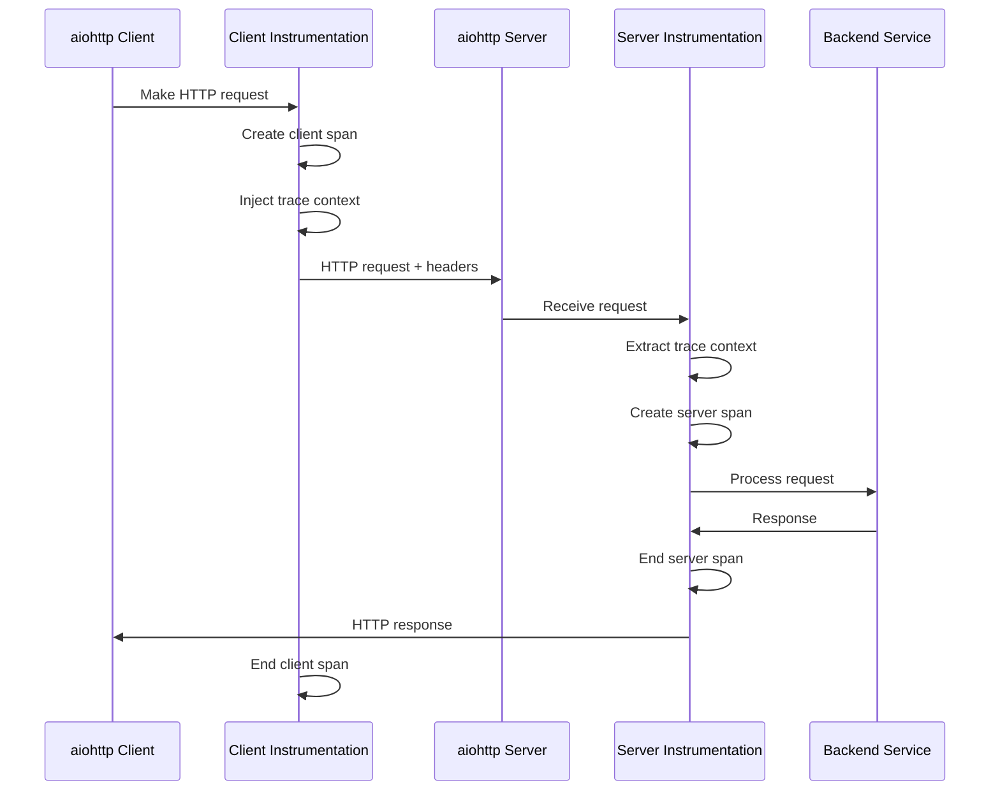

# How to Instrument aiohttp Client and Server with OpenTelemetry

Author: [nawazdhandala](https://www.github.com/nawazdhandala)

Tags: OpenTelemetry, aiohttp, Python, HTTP Client, Server, Async

Description: Complete guide to instrumenting aiohttp async HTTP client and server applications with OpenTelemetry for distributed tracing and observability.

The aiohttp library is one of the most popular async HTTP frameworks in Python, supporting both client and server implementations. When building microservices with aiohttp, observability becomes critical for understanding request flows, identifying bottlenecks, and debugging issues across service boundaries.

OpenTelemetry provides automatic instrumentation for aiohttp through the `opentelemetry-instrumentation-aiohttp-client` and `opentelemetry-instrumentation-aiohttp-server` packages, making it straightforward to add distributed tracing to your async applications.

## Understanding aiohttp Instrumentation Architecture

OpenTelemetry instruments aiohttp by hooking into the request lifecycle at multiple points. For the client, it wraps outgoing HTTP requests to create spans. For the server, it intercepts incoming requests to extract trace context and create server spans.



## Installing Dependencies

First, install the required packages for aiohttp instrumentation.

```bash
pip install opentelemetry-api \
            opentelemetry-sdk \
            opentelemetry-instrumentation-aiohttp-client \
            opentelemetry-instrumentation-aiohttp-server \
            opentelemetry-exporter-otlp \
            aiohttp
```

## Instrumenting aiohttp Server

Here's how to instrument an aiohttp server application with automatic tracing.

```python
from aiohttp import web
from opentelemetry import trace
from opentelemetry.sdk.trace import TracerProvider
from opentelemetry.sdk.trace.export import BatchSpanProcessor
from opentelemetry.exporter.otlp.proto.grpc.trace_exporter import OTLPSpanExporter
from opentelemetry.sdk.resources import Resource
from opentelemetry.instrumentation.aiohttp_server import AioHttpServerInstrumentor
import asyncio

# Configure OpenTelemetry with service name and metadata
resource = Resource.create({
    "service.name": "aiohttp-server",
    "service.version": "1.0.0",
    "deployment.environment": "production"
})

# Set up the tracer provider with OTLP exporter
provider = TracerProvider(resource=resource)
processor = BatchSpanProcessor(
    OTLPSpanExporter(endpoint="http://localhost:4317", insecure=True)
)
provider.add_span_processor(processor)
trace.set_tracer_provider(provider)

# Get a tracer for custom spans
tracer = trace.get_tracer(__name__)

# Define application routes with business logic
async def hello_handler(request):
    """Simple endpoint that returns a greeting"""
    name = request.match_info.get('name', 'World')

    # Add custom span attributes for business context
    current_span = trace.get_current_span()
    current_span.set_attribute("user.name", name)
    current_span.set_attribute("endpoint.type", "greeting")

    return web.Response(text=f"Hello, {name}!")

async def fetch_data_handler(request):
    """Endpoint that simulates data fetching with custom spans"""
    with tracer.start_as_current_span("fetch-user-data") as span:
        span.set_attribute("operation", "database_query")

        # Simulate database operation
        await asyncio.sleep(0.1)
        user_data = {"id": 123, "name": "John Doe"}

        span.set_attribute("user.id", user_data["id"])

    with tracer.start_as_current_span("process-data") as span:
        span.set_attribute("operation", "data_processing")

        # Simulate data processing
        await asyncio.sleep(0.05)
        processed = f"Processed: {user_data['name']}"

    return web.json_response({"result": processed})

async def error_handler(request):
    """Endpoint that demonstrates error tracking"""
    current_span = trace.get_current_span()

    try:
        # Simulate an error condition
        raise ValueError("Simulated error for demonstration")
    except Exception as e:
        # Record the exception in the span
        current_span.record_exception(e)
        current_span.set_attribute("error", True)
        current_span.set_status(trace.Status(trace.StatusCode.ERROR, str(e)))

        return web.Response(status=500, text="Internal Server Error")

# Create and configure the aiohttp application
app = web.Application()
app.router.add_get('/hello/{name}', hello_handler)
app.router.add_get('/hello', hello_handler)
app.router.add_get('/data', fetch_data_handler)
app.router.add_get('/error', error_handler)

# Instrument the aiohttp server before running
AioHttpServerInstrumentor().instrument()

if __name__ == '__main__':
    web.run_app(app, host='127.0.0.1', port=8080)
```

## Instrumenting aiohttp Client

The client instrumentation automatically traces all outgoing HTTP requests made with aiohttp.

```python
import aiohttp
import asyncio
from opentelemetry import trace
from opentelemetry.sdk.trace import TracerProvider
from opentelemetry.sdk.trace.export import BatchSpanProcessor
from opentelemetry.exporter.otlp.proto.grpc.trace_exporter import OTLPSpanExporter
from opentelemetry.sdk.resources import Resource
from opentelemetry.instrumentation.aiohttp_client import AioHttpClientInstrumentor

# Configure OpenTelemetry for the client application
resource = Resource.create({
    "service.name": "aiohttp-client",
    "service.version": "1.0.0"
})

provider = TracerProvider(resource=resource)
processor = BatchSpanProcessor(
    OTLPSpanExporter(endpoint="http://localhost:4317", insecure=True)
)
provider.add_span_processor(processor)
trace.set_tracer_provider(provider)

# Instrument aiohttp client before making requests
AioHttpClientInstrumentor().instrument()

tracer = trace.get_tracer(__name__)

async def make_http_requests():
    """Demonstrate instrumented HTTP client requests"""

    # Create a client session (instrumentation is automatic)
    async with aiohttp.ClientSession() as session:

        # Single GET request with custom span
        with tracer.start_as_current_span("user-workflow") as span:
            span.set_attribute("workflow.type", "user_data_fetch")

            # Make GET request (automatically traced)
            async with session.get('http://localhost:8080/hello/Alice') as response:
                text = await response.text()
                print(f"Response: {text}")
                span.set_attribute("response.length", len(text))

        # Multiple parallel requests to demonstrate distributed tracing
        with tracer.start_as_current_span("parallel-requests") as span:
            span.set_attribute("request.count", 3)

            tasks = [
                session.get('http://localhost:8080/hello/Bob'),
                session.get('http://localhost:8080/data'),
                session.get('http://localhost:8080/hello/Charlie')
            ]

            # Execute requests concurrently
            responses = await asyncio.gather(*tasks, return_exceptions=True)

            successful = sum(1 for r in responses if not isinstance(r, Exception))
            span.set_attribute("request.successful", successful)

        # POST request with custom headers and body
        with tracer.start_as_current_span("create-user") as span:
            span.set_attribute("http.method", "POST")

            payload = {"name": "David", "email": "david@example.com"}
            headers = {"Content-Type": "application/json"}

            async with session.post(
                'http://localhost:8080/users',
                json=payload,
                headers=headers
            ) as response:
                span.set_attribute("http.status_code", response.status)
                print(f"Status: {response.status}")

async def main():
    """Main entry point for client application"""
    await make_http_requests()

if __name__ == '__main__':
    asyncio.run(main())
```

## Configuring Custom Span Attributes

You can customize the instrumentation to add specific attributes or filter requests.

```python
from opentelemetry.instrumentation.aiohttp_client import AioHttpClientInstrumentor
from opentelemetry.trace import SpanKind

def request_hook(span, params):
    """
    Hook called before request is sent.
    Allows adding custom attributes based on request parameters.
    """
    # params contains: method, url, headers, etc.
    if params.get("url"):
        url = str(params["url"])
        span.set_attribute("http.target", url)

        # Add custom attributes based on URL patterns
        if "/api/" in url:
            span.set_attribute("api.version", "v1")

        # Tag sensitive endpoints
        if "/admin/" in url:
            span.set_attribute("endpoint.sensitive", True)

def response_hook(span, params):
    """
    Hook called after response is received.
    Allows adding attributes based on response data.
    """
    # params contains: response object
    response = params.get("response")
    if response:
        # Add custom response attributes
        span.set_attribute("response.content_type",
                          response.headers.get("Content-Type", "unknown"))

        # Track response size
        content_length = response.headers.get("Content-Length")
        if content_length:
            span.set_attribute("response.size_bytes", int(content_length))

# Instrument with custom hooks
AioHttpClientInstrumentor().instrument(
    request_hook=request_hook,
    response_hook=response_hook
)
```

## Server-Side Request Filtering

For the server, you can filter which requests to trace based on URL patterns.

```python
from opentelemetry.instrumentation.aiohttp_server import AioHttpServerInstrumentor

def server_request_hook(span, request):
    """Add custom attributes to server spans"""
    # Add request metadata
    span.set_attribute("http.user_agent", request.headers.get("User-Agent", "unknown"))
    span.set_attribute("http.client_ip", request.remote)

    # Add business context
    if "X-User-ID" in request.headers:
        span.set_attribute("user.id", request.headers["X-User-ID"])

def should_trace(request):
    """
    Determine if request should be traced.
    Return False to skip tracing for this request.
    """
    # Skip health check endpoints
    if request.path in ["/health", "/healthz", "/ping"]:
        return False

    # Skip static assets
    if request.path.startswith("/static/"):
        return False

    return True

# Instrument with filtering and hooks
AioHttpServerInstrumentor().instrument(
    server_request_hook=server_request_hook,
    tracer_provider=trace.get_tracer_provider()
)
```

## Complete Microservices Example

Here's a complete example showing client-server interaction with distributed tracing.

```python
# service_a.py - First service that calls another service
from aiohttp import web
import aiohttp
from opentelemetry import trace
from opentelemetry.sdk.trace import TracerProvider
from opentelemetry.sdk.trace.export import BatchSpanProcessor, ConsoleSpanExporter
from opentelemetry.sdk.resources import Resource
from opentelemetry.instrumentation.aiohttp_client import AioHttpClientInstrumentor
from opentelemetry.instrumentation.aiohttp_server import AioHttpServerInstrumentor

# Setup tracing
resource = Resource.create({"service.name": "service-a"})
provider = TracerProvider(resource=resource)
provider.add_span_processor(BatchSpanProcessor(ConsoleSpanExporter()))
trace.set_tracer_provider(provider)

# Instrument both client and server
AioHttpClientInstrumentor().instrument()
AioHttpServerInstrumentor().instrument()

tracer = trace.get_tracer(__name__)

async def handle_order(request):
    """Process order by calling service B"""
    order_id = request.match_info['order_id']

    with tracer.start_as_current_span("process-order") as span:
        span.set_attribute("order.id", order_id)
        span.set_attribute("service", "order_processing")

        # Call service B to validate inventory
        async with aiohttp.ClientSession() as session:
            async with session.get(
                f'http://localhost:8081/inventory/{order_id}'
            ) as response:
                inventory_data = await response.json()
                span.set_attribute("inventory.available",
                                 inventory_data.get("available", False))

        # Process the order
        result = {
            "order_id": order_id,
            "status": "completed",
            "inventory": inventory_data
        }

        return web.json_response(result)

app = web.Application()
app.router.add_get('/order/{order_id}', handle_order)

if __name__ == '__main__':
    web.run_app(app, host='127.0.0.1', port=8080)
```

## Trace Context Propagation

OpenTelemetry automatically propagates trace context between services using W3C Trace Context headers. The instrumentation handles this automatically, but you can also manually control context propagation.

```python
from opentelemetry.propagate import inject, extract

async def manual_context_propagation():
    """Example of manual trace context propagation"""

    async with aiohttp.ClientSession() as session:
        headers = {}

        # Manually inject trace context into headers
        inject(headers)

        # Make request with propagated context
        async with session.get(
            'http://localhost:8080/api/data',
            headers=headers
        ) as response:
            return await response.json()
```

## Monitoring and Best Practices

When instrumenting aiohttp applications, follow these practices for optimal observability:

1. **Use meaningful service names** that reflect your architecture
2. **Add custom attributes** for business-relevant data (user IDs, transaction IDs)
3. **Filter health checks** and other high-frequency low-value requests
4. **Set appropriate sampling rates** for high-traffic services
5. **Use async context managers** properly to ensure spans are closed
6. **Record exceptions** in spans for error tracking
7. **Monitor span duration** to identify performance bottlenecks

The aiohttp instrumentation provides comprehensive visibility into your async HTTP services with minimal code changes. By leveraging automatic instrumentation alongside strategic custom spans, you can build a robust observability foundation for your Python microservices architecture.
