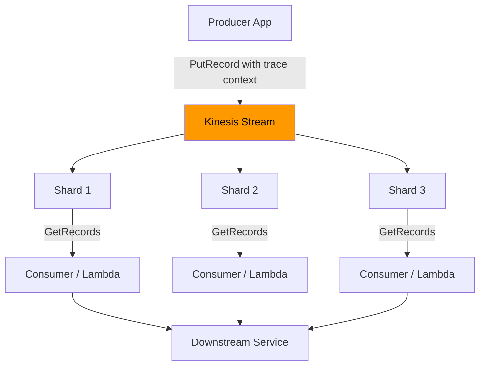

# How to Instrument Amazon Kinesis with OpenTelemetry

Author: [nawazdhandala](https://www.github.com/nawazdhandala)

Tags: OpenTelemetry, AWS, Kinesis, Tracing, Streaming, Distributed Systems

Description: Learn how to instrument Amazon Kinesis producers and consumers with OpenTelemetry for distributed tracing and metrics across your streaming data pipelines.

---

Amazon Kinesis is a managed streaming platform that handles massive volumes of real-time data. Whether you are using Kinesis Data Streams for log aggregation, event sourcing, or real-time analytics, tracing messages through the system is essential for understanding latency, debugging failures, and optimizing throughput. OpenTelemetry provides the instrumentation primitives you need to connect Kinesis producers and consumers into unified traces.

This guide covers practical instrumentation patterns for Kinesis Data Streams using OpenTelemetry in Python, though the concepts translate directly to Java, Go, and Node.js implementations.

## The Observability Gap in Kinesis

Kinesis sits between your services as a managed buffer. CloudWatch gives you shard-level metrics like incoming records and iterator age, but it cannot tell you what happened to a specific record. When a producer puts a record into a stream and a Lambda function or KCL consumer processes it, you need distributed tracing to connect those two events into a single story.



The challenge with Kinesis specifically is that the record payload is a blob of bytes. There is no built-in header mechanism like Kafka has. You need to embed trace context within the record data itself.

## Initializing OpenTelemetry for Kinesis Workloads

Set up your tracer provider with resource attributes that identify your Kinesis application.

```python
# OpenTelemetry setup for Kinesis producer/consumer services
from opentelemetry import trace
from opentelemetry.sdk.trace import TracerProvider
from opentelemetry.sdk.trace.export import BatchSpanProcessor
from opentelemetry.exporter.otlp.proto.grpc.trace_exporter import OTLPSpanExporter
from opentelemetry.sdk.resources import Resource

resource = Resource.create({
    "service.name": "kinesis-event-processor",
    "service.version": "2.1.0",
    "cloud.provider": "aws",
    "cloud.region": "us-east-1",
})

provider = TracerProvider(resource=resource)
provider.add_span_processor(
    BatchSpanProcessor(OTLPSpanExporter(endpoint="http://localhost:4317"))
)
trace.set_tracer_provider(provider)

tracer = trace.get_tracer("kinesis.instrumentation")
```

Including `cloud.provider` and `cloud.region` in your resource attributes helps you filter traces by AWS region later, which is especially useful if you run multi-region Kinesis deployments.

## Instrumenting the Kinesis Producer

The producer wraps each PutRecord call in a span and injects trace context into the record data. Since Kinesis records are raw bytes, you need to structure your payload to include both the business data and the trace headers.

```python
import boto3
import json
from opentelemetry.context.propagation import get_global_textmap_propagator

kinesis_client = boto3.client("kinesis", region_name="us-east-1")

def put_traced_record(stream_name, data, partition_key):
    # Create a producer span for the Kinesis PutRecord operation
    with tracer.start_as_current_span(
        f"{stream_name} send",
        kind=trace.SpanKind.PRODUCER,
        attributes={
            "messaging.system": "aws_kinesis",
            "messaging.destination.name": stream_name,
            "messaging.operation": "publish",
            "messaging.kinesis.partition_key": partition_key,
        }
    ) as span:
        # Inject the current trace context into a carrier
        carrier = {}
        get_global_textmap_propagator().inject(carrier)

        # Wrap the original data with trace context metadata
        envelope = {
            "data": data,
            "_otel": {
                "traceparent": carrier.get("traceparent", ""),
                "tracestate": carrier.get("tracestate", ""),
            }
        }

        # PutRecord with the enriched payload
        response = kinesis_client.put_record(
            StreamName=stream_name,
            Data=json.dumps(envelope).encode("utf-8"),
            PartitionKey=partition_key,
        )

        # Capture Kinesis-specific response metadata
        span.set_attribute("messaging.kinesis.shard_id", response["ShardId"])
        span.set_attribute("messaging.kinesis.sequence_number", response["SequenceNumber"])

        return response
```

The envelope pattern wraps your actual data inside an object that also carries OpenTelemetry context under the `_otel` key. This approach is clean because consumers that are not yet instrumented can still access the data field without breaking, while instrumented consumers know to look for `_otel` to extract trace context.

## Instrumenting the Kinesis Consumer

The consumer extracts trace context from the record envelope and creates a child span that continues the distributed trace.

```python
from opentelemetry.propagate import extract

def process_kinesis_records(stream_name, shard_iterator):
    # Poll for records from the shard
    response = kinesis_client.get_records(
        ShardIterator=shard_iterator,
        Limit=100
    )

    for record in response["Records"]:
        raw_data = record["Data"]

        try:
            envelope = json.loads(raw_data.decode("utf-8"))
        except (json.JSONDecodeError, UnicodeDecodeError):
            # Handle non-envelope records gracefully
            envelope = {"data": raw_data, "_otel": {}}

        # Extract trace context from the envelope
        otel_headers = envelope.get("_otel", {})
        carrier = {
            "traceparent": otel_headers.get("traceparent", ""),
            "tracestate": otel_headers.get("tracestate", ""),
        }
        parent_context = extract(carrier)

        # Start a consumer span linked to the producer trace
        with tracer.start_as_current_span(
            f"{stream_name} process",
            context=parent_context,
            kind=trace.SpanKind.CONSUMER,
            attributes={
                "messaging.system": "aws_kinesis",
                "messaging.source.name": stream_name,
                "messaging.operation": "process",
                "messaging.kinesis.sequence_number": record["SequenceNumber"],
                "messaging.kinesis.partition_key": record["PartitionKey"],
                "messaging.kinesis.approximate_arrival": str(
                    record["ApproximateArrivalTimestamp"]
                ),
            }
        ) as span:
            try:
                # Process the actual business data
                business_data = envelope.get("data", {})
                handle_event(business_data)
            except Exception as e:
                span.set_status(trace.StatusCode.ERROR, str(e))
                span.record_exception(e)
```

The `ApproximateArrivalTimestamp` from Kinesis is recorded as a span attribute. This is valuable because it lets you calculate the difference between when a record arrived in Kinesis and when your consumer actually processed it, giving you a precise measure of consumer lag.

## Lambda Consumer Instrumentation

Many Kinesis consumers run as AWS Lambda functions. Lambda has its own considerations since the function is invoked with a batch of records from the Kinesis trigger.

```python
# Lambda handler for Kinesis stream processing
from opentelemetry.propagate import extract

def lambda_handler(event, lambda_context):
    # Process each record from the Kinesis event source mapping
    for record in event["Records"]:
        # Kinesis data in Lambda events is base64-encoded
        import base64
        raw_data = base64.b64decode(record["kinesis"]["data"])

        try:
            envelope = json.loads(raw_data.decode("utf-8"))
        except (json.JSONDecodeError, UnicodeDecodeError):
            envelope = {"data": raw_data, "_otel": {}}

        otel_headers = envelope.get("_otel", {})
        carrier = {
            "traceparent": otel_headers.get("traceparent", ""),
            "tracestate": otel_headers.get("tracestate", ""),
        }
        parent_context = extract(carrier)

        # Each record in the batch gets its own span
        with tracer.start_as_current_span(
            f"kinesis process {record['kinesis']['partitionKey']}",
            context=parent_context,
            kind=trace.SpanKind.CONSUMER,
            attributes={
                "messaging.system": "aws_kinesis",
                "messaging.operation": "process",
                "messaging.kinesis.sequence_number": record["kinesis"]["sequenceNumber"],
                "messaging.kinesis.partition_key": record["kinesis"]["partitionKey"],
                "faas.trigger": "datasource",
                "cloud.resource_id": record["eventSourceARN"],
            }
        ) as span:
            try:
                business_data = envelope.get("data", {})
                handle_event(business_data)
            except Exception as e:
                span.set_status(trace.StatusCode.ERROR, str(e))
                span.record_exception(e)
                raise  # Re-raise to trigger Lambda retry
```

The `faas.trigger` attribute follows the OpenTelemetry semantic conventions for serverless functions. Setting it to `datasource` indicates that this invocation was triggered by a data source event rather than an HTTP request. The `cloud.resource_id` records the Kinesis stream ARN for precise identification.

## Collecting Kinesis Shard Metrics

Beyond traces, you want to monitor shard-level health. The OpenTelemetry Collector can pull CloudWatch metrics for Kinesis and forward them alongside your trace data.

```yaml
# Collector configuration for Kinesis metrics via CloudWatch
receivers:
  otlp:
    protocols:
      grpc:
        endpoint: 0.0.0.0:4317
  # Pull Kinesis metrics from CloudWatch
  awscloudwatch:
    region: us-east-1
    poll_interval: 60s
    metrics:
      named:
        kinesis_incoming:
          namespace: AWS/Kinesis
          metric_name: IncomingRecords
          period: 60s
          statistics: [Sum]
          dimensions:
            - name: StreamName
              value: "my-event-stream"
        kinesis_iterator_age:
          namespace: AWS/Kinesis
          metric_name: GetRecords.IteratorAgeMilliseconds
          period: 60s
          statistics: [Maximum]
          dimensions:
            - name: StreamName
              value: "my-event-stream"

processors:
  batch:
    timeout: 10s

exporters:
  otlp:
    endpoint: https://your-oneuptime-instance.com:4317

service:
  pipelines:
    traces:
      receivers: [otlp]
      processors: [batch]
      exporters: [otlp]
    metrics:
      receivers: [otlp, awscloudwatch]
      processors: [batch]
      exporters: [otlp]
```

The `GetRecords.IteratorAgeMilliseconds` metric is the single most important Kinesis health indicator. It tells you how far behind your consumers are from the tip of the stream. When iterator age climbs, it means your consumers cannot keep up with the incoming data rate. Correlating this metric with your per-record trace latencies helps you pinpoint whether the bottleneck is in record processing time or in the polling cadence.

## Batch PutRecords Instrumentation

For high-throughput producers, you will likely use PutRecords (plural) to send up to 500 records in a single API call. This needs slightly different instrumentation.

```python
def put_traced_records_batch(stream_name, records):
    # Parent span covers the entire batch operation
    with tracer.start_as_current_span(
        f"{stream_name} batch_send",
        kind=trace.SpanKind.PRODUCER,
        attributes={
            "messaging.system": "aws_kinesis",
            "messaging.destination.name": stream_name,
            "messaging.batch.message_count": len(records),
        }
    ) as batch_span:
        kinesis_records = []

        for item in records:
            # Each record in the batch gets its own child span
            with tracer.start_as_current_span(
                f"{stream_name} send",
                kind=trace.SpanKind.PRODUCER,
            ) as record_span:
                carrier = {}
                get_global_textmap_propagator().inject(carrier)

                envelope = {
                    "data": item["data"],
                    "_otel": {
                        "traceparent": carrier.get("traceparent", ""),
                        "tracestate": carrier.get("tracestate", ""),
                    }
                }

                kinesis_records.append({
                    "Data": json.dumps(envelope).encode("utf-8"),
                    "PartitionKey": item["partition_key"],
                })

        # Send the entire batch in one API call
        response = kinesis_client.put_records(
            StreamName=stream_name,
            Records=kinesis_records
        )

        # Check for partial failures
        failed_count = response.get("FailedRecordCount", 0)
        batch_span.set_attribute("messaging.kinesis.failed_record_count", failed_count)

        if failed_count > 0:
            batch_span.set_status(
                trace.StatusCode.ERROR,
                f"{failed_count} records failed"
            )
```

The batch span captures the overall operation, while each individual record gets its own span with a unique trace context injection. This means consumers can trace back each individual record to its specific producer span even when they were part of a larger batch. Tracking `FailedRecordCount` on the batch span is critical because Kinesis PutRecords does not throw an exception on partial failures.

## Wrapping Up

Instrumenting Amazon Kinesis with OpenTelemetry requires the envelope pattern since Kinesis records lack native header support. By embedding trace context within the record payload, you get full distributed tracing from producers through shard distribution to consumers, whether they run on EC2, ECS, or Lambda. Combine per-record traces with CloudWatch shard metrics in your collector pipeline, and you have complete observability over your Kinesis streaming infrastructure.

The most impactful thing you can do first is instrument the producer with envelope-based context propagation and the consumer with context extraction. Once those traces are flowing, layer on the CloudWatch metrics receiver to get the full picture of stream health alongside individual record journeys.
