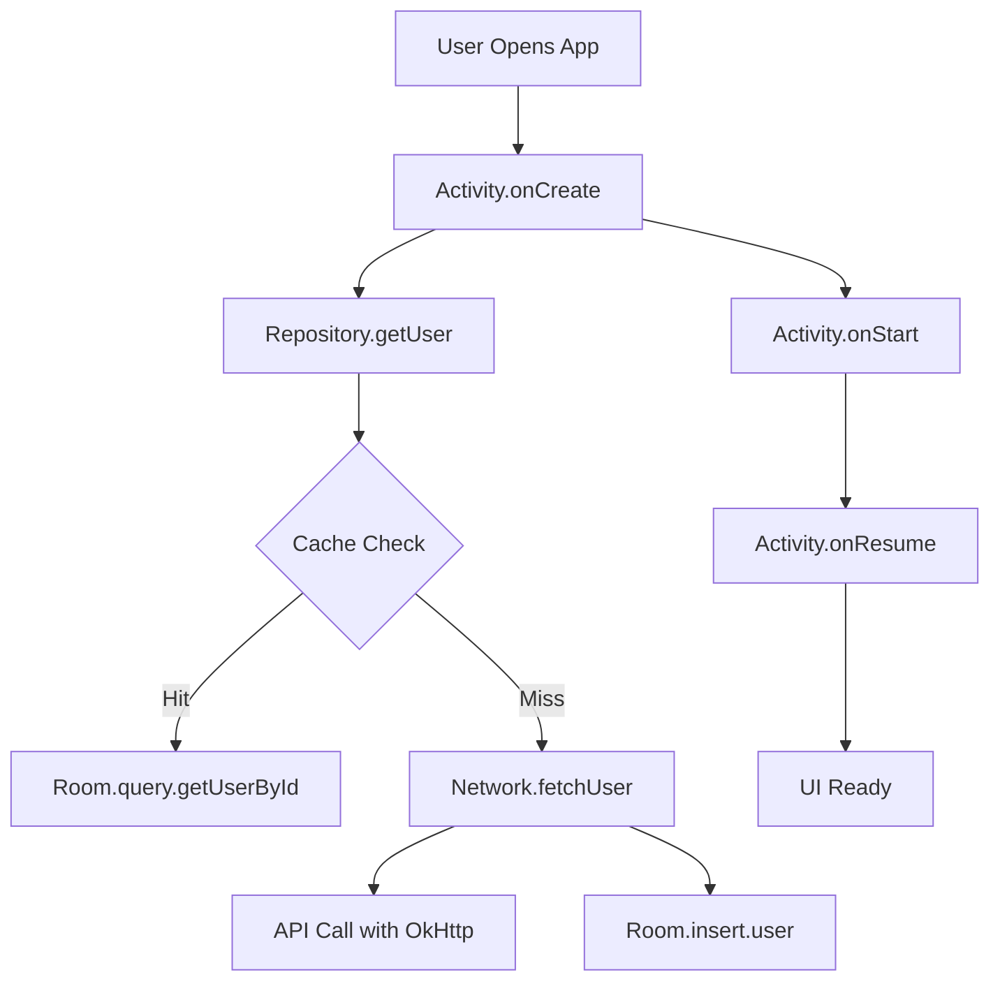

# How to Instrument Android Applications with OpenTelemetry

Author: [nawazdhandala](https://www.github.com/nawazdhandala)

Tags: OpenTelemetry, Android, Kotlin, Java, Mobile, Tracing

Description: A comprehensive guide to instrumenting Android applications with OpenTelemetry, covering setup, automatic instrumentation, custom spans, and best practices for tracking app performance and user behavior.

Monitoring Android applications presents unique challenges. Unlike backend services running in controlled environments, Android apps execute on diverse devices with varying capabilities, network conditions, and user behaviors. OpenTelemetry provides a vendor-neutral way to capture telemetry data from your Android app, giving you insights into performance, errors, and user experience across your entire user base.

## Why Instrument Your Android App

Modern Android applications are complex systems. They interact with multiple backend services, persist data locally, render dynamic UIs, and handle background processing. Without proper instrumentation, issues like slow API calls, inefficient database queries, or memory leaks remain invisible until users complain.

OpenTelemetry instrumentation gives you visibility into what's actually happening on user devices. You can identify which API endpoints are slow, which screens take too long to render, and where crashes occur. This data drives informed decisions about optimization priorities and helps validate that performance improvements actually help users.

## Setting Up OpenTelemetry in Android

Start by adding the OpenTelemetry dependencies to your app's build.gradle file. The Android SDK provides automatic instrumentation for many common operations, but you'll also want manual instrumentation for business logic.

```groovy
// app/build.gradle
dependencies {
    // OpenTelemetry API for manual instrumentation
    implementation 'io.opentelemetry:opentelemetry-api:1.32.0'
    implementation 'io.opentelemetry:opentelemetry-sdk:1.32.0'

    // OpenTelemetry exporters
    implementation 'io.opentelemetry:opentelemetry-exporter-otlp:1.32.0'

    // Semantic conventions for standard attributes
    implementation 'io.opentelemetry.semconv:opentelemetry-semconv:1.23.1-alpha'

    // Android-specific extensions
    implementation 'io.opentelemetry.android:instrumentation:0.3.0'

    // HTTP client instrumentation
    implementation 'io.opentelemetry.instrumentation:opentelemetry-okhttp-3.0:1.32.0-alpha'
}
```

Create a configuration class that initializes OpenTelemetry when your app starts. This setup should happen in your Application class to ensure telemetry is ready before any activities launch.

```kotlin
import android.app.Application
import android.os.Build
import io.opentelemetry.api.OpenTelemetry
import io.opentelemetry.api.common.Attributes
import io.opentelemetry.api.trace.Tracer
import io.opentelemetry.exporter.otlp.trace.OtlpGrpcSpanExporter
import io.opentelemetry.sdk.OpenTelemetrySdk
import io.opentelemetry.sdk.resources.Resource
import io.opentelemetry.sdk.trace.SdkTracerProvider
import io.opentelemetry.sdk.trace.export.BatchSpanProcessor
import io.opentelemetry.semconv.resource.attributes.ResourceAttributes
import java.util.concurrent.TimeUnit

class MyApplication : Application() {
    companion object {
        private lateinit var openTelemetry: OpenTelemetry
        lateinit var tracer: Tracer
            private set
    }

    override fun onCreate() {
        super.onCreate()
        initializeOpenTelemetry()
    }

    private fun initializeOpenTelemetry() {
        // Create resource with app and device information
        val resource = Resource.create(
            Attributes.builder()
                .put(ResourceAttributes.SERVICE_NAME, "MyAndroidApp")
                .put(ResourceAttributes.SERVICE_VERSION, BuildConfig.VERSION_NAME)
                .put(ResourceAttributes.DEPLOYMENT_ENVIRONMENT, BuildConfig.BUILD_TYPE)
                .put(ResourceAttributes.DEVICE_MODEL_IDENTIFIER, Build.MODEL)
                .put(ResourceAttributes.DEVICE_MANUFACTURER, Build.MANUFACTURER)
                .put(ResourceAttributes.OS_NAME, "Android")
                .put(ResourceAttributes.OS_VERSION, Build.VERSION.RELEASE)
                .put("device.screen.width", resources.displayMetrics.widthPixels)
                .put("device.screen.height", resources.displayMetrics.heightPixels)
                .put("device.screen.density", resources.displayMetrics.density)
                .build()
        )

        // Configure the OTLP exporter to send data to your backend
        val spanExporter = OtlpGrpcSpanExporter.builder()
            .setEndpoint("https://your-observability-backend.com:4317")
            .setTimeout(30, TimeUnit.SECONDS)
            .build()

        // Use batch processor to reduce network calls
        // Spans are batched and sent periodically rather than one-by-one
        val spanProcessor = BatchSpanProcessor.builder(spanExporter)
            .setScheduleDelay(5, TimeUnit.SECONDS)
            .setMaxQueueSize(2048)
            .setMaxExportBatchSize(512)
            .setExporterTimeout(30, TimeUnit.SECONDS)
            .build()

        // Build the tracer provider
        val tracerProvider = SdkTracerProvider.builder()
            .addSpanProcessor(spanProcessor)
            .setResource(resource)
            .build()

        // Initialize the global OpenTelemetry instance
        openTelemetry = OpenTelemetrySdk.builder()
            .setTracerProvider(tracerProvider)
            .build()

        // Get a tracer for manual instrumentation
        tracer = openTelemetry.getTracer("com.example.myapp", BuildConfig.VERSION_NAME)
    }
}
```

## Instrumenting Activity Lifecycle

Activities are the core building blocks of Android apps. Tracking their lifecycle helps you understand navigation patterns, identify slow screen loads, and measure time-to-interactive.

```kotlin
import android.os.Bundle
import androidx.appcompat.app.AppCompatActivity
import io.opentelemetry.api.trace.Span
import io.opentelemetry.api.trace.StatusCode
import io.opentelemetry.api.trace.Tracer
import io.opentelemetry.context.Context

open class InstrumentedActivity : AppCompatActivity() {
    private var activitySpan: Span? = null
    private var createSpan: Span? = null
    protected val tracer: Tracer = MyApplication.tracer

    override fun onCreate(savedInstanceState: Bundle?) {
        // Start a span for the complete activity lifecycle
        activitySpan = tracer.spanBuilder("Activity.${this::class.simpleName}")
            .setSpanKind(io.opentelemetry.api.trace.SpanKind.INTERNAL)
            .startSpan()

        // Make this span the current active span
        val scope = activitySpan?.makeCurrent()

        // Start a span specifically for onCreate
        createSpan = tracer.spanBuilder("Activity.onCreate")
            .setSpanKind(io.opentelemetry.api.trace.SpanKind.INTERNAL)
            .setAttribute("activity.name", this::class.simpleName ?: "Unknown")
            .setAttribute("activity.is_first_launch", savedInstanceState == null)
            .startSpan()

        try {
            super.onCreate(savedInstanceState)
            createSpan?.setStatus(StatusCode.OK)
        } catch (e: Exception) {
            createSpan?.recordException(e)
            createSpan?.setStatus(StatusCode.ERROR, "onCreate failed")
            throw e
        } finally {
            createSpan?.end()
            scope?.close()
        }
    }

    override fun onStart() {
        val span = tracer.spanBuilder("Activity.onStart")
            .setSpanKind(io.opentelemetry.api.trace.SpanKind.INTERNAL)
            .setAttribute("activity.name", this::class.simpleName ?: "Unknown")
            .startSpan()

        try {
            super.onStart()
            span.setStatus(StatusCode.OK)
        } catch (e: Exception) {
            span.recordException(e)
            span.setStatus(StatusCode.ERROR, "onStart failed")
            throw e
        } finally {
            span.end()
        }
    }

    override fun onResume() {
        val span = tracer.spanBuilder("Activity.onResume")
            .setSpanKind(io.opentelemetry.api.trace.SpanKind.INTERNAL)
            .startSpan()

        try {
            super.onResume()
            span.setStatus(StatusCode.OK)
        } catch (e: Exception) {
            span.recordException(e)
            span.setStatus(StatusCode.ERROR, "onResume failed")
            throw e
        } finally {
            span.end()
        }
    }

    override fun onPause() {
        val span = tracer.spanBuilder("Activity.onPause")
            .setSpanKind(io.opentelemetry.api.trace.SpanKind.INTERNAL)
            .startSpan()

        try {
            super.onPause()
            span.setStatus(StatusCode.OK)
        } catch (e: Exception) {
            span.recordException(e)
            span.setStatus(StatusCode.ERROR, "onPause failed")
            throw e
        } finally {
            span.end()
        }
    }

    override fun onDestroy() {
        try {
            super.onDestroy()
            activitySpan?.setStatus(StatusCode.OK)
        } catch (e: Exception) {
            activitySpan?.recordException(e)
            activitySpan?.setStatus(StatusCode.ERROR, "Activity lifecycle failed")
            throw e
        } finally {
            activitySpan?.end()
        }
    }
}
```

## Auto-Instrumenting Network Calls with OkHttp

Most Android apps use OkHttp for networking. OpenTelemetry provides an interceptor that automatically instruments HTTP requests, capturing timing, headers, and response codes.

```kotlin
import io.opentelemetry.instrumentation.okhttp.v3_0.OkHttpTelemetry
import okhttp3.OkHttpClient
import java.util.concurrent.TimeUnit

object NetworkClient {
    private val openTelemetry = MyApplication.openTelemetry

    // Create OkHttp telemetry wrapper
    private val okHttpTelemetry = OkHttpTelemetry.builder(openTelemetry)
        .setCapturedRequestHeaders(listOf("Content-Type", "Accept"))
        .setCapturedResponseHeaders(listOf("Content-Type", "Content-Length"))
        .build()

    val client: OkHttpClient by lazy {
        OkHttpClient.Builder()
            // Add OpenTelemetry interceptor for automatic instrumentation
            .addInterceptor(okHttpTelemetry.newInterceptor())
            .connectTimeout(30, TimeUnit.SECONDS)
            .readTimeout(30, TimeUnit.SECONDS)
            .writeTimeout(30, TimeUnit.SECONDS)
            .build()
    }
}

// Usage in your API client
class ApiClient {
    private val client = NetworkClient.client
    private val baseUrl = "https://api.example.com"

    suspend fun fetchUserProfile(userId: String): UserProfile {
        val request = okhttp3.Request.Builder()
            .url("$baseUrl/users/$userId")
            .get()
            .build()

        // The OkHttp interceptor automatically creates spans for this request
        return withContext(Dispatchers.IO) {
            client.newCall(request).execute().use { response ->
                if (!response.isSuccessful) {
                    throw IOException("Unexpected response: ${response.code}")
                }

                // Parse response body
                val body = response.body?.string()
                    ?: throw IOException("Empty response body")

                parseUserProfile(body)
            }
        }
    }
}
```

## Instrumenting Repository Layer

The repository pattern is common in Android for abstracting data sources. Instrument repositories to track data access performance and cache hit rates.

```kotlin
import io.opentelemetry.api.trace.Span
import io.opentelemetry.api.trace.StatusCode
import io.opentelemetry.api.trace.Tracer
import kotlinx.coroutines.withContext
import kotlinx.coroutines.Dispatchers

class UserRepository(
    private val apiClient: ApiClient,
    private val localDatabase: UserDao,
    private val tracer: Tracer
) {
    suspend fun getUser(userId: String): User {
        // Create a span for the repository operation
        val span = tracer.spanBuilder("UserRepository.getUser")
            .setSpanKind(io.opentelemetry.api.trace.SpanKind.INTERNAL)
            .setAttribute("user.id", userId)
            .startSpan()

        return withContext(Dispatchers.IO) {
            try {
                // Try to get from local cache first
                val cachedUser = getCachedUser(userId, span)
                if (cachedUser != null) {
                    span.addEvent("cache_hit")
                    span.setAttribute("cache.hit", true)
                    span.setStatus(StatusCode.OK)
                    return@withContext cachedUser
                }

                // Cache miss, fetch from network
                span.addEvent("cache_miss")
                span.setAttribute("cache.hit", false)

                val user = fetchUserFromNetwork(userId, span)
                cacheUser(user, span)

                span.setStatus(StatusCode.OK)
                user
            } catch (e: Exception) {
                span.recordException(e)
                span.setStatus(StatusCode.ERROR, "Failed to get user")
                throw e
            } finally {
                span.end()
            }
        }
    }

    private suspend fun getCachedUser(userId: String, parentSpan: Span): User? {
        val span = tracer.spanBuilder("UserRepository.getCachedUser")
            .setParent(io.opentelemetry.context.Context.current().with(parentSpan))
            .setSpanKind(io.opentelemetry.api.trace.SpanKind.INTERNAL)
            .setAttribute("user.id", userId)
            .startSpan()

        return try {
            val user = localDatabase.getUserById(userId)
            span.setAttribute("cache.found", user != null)
            span.setStatus(StatusCode.OK)
            user
        } catch (e: Exception) {
            span.recordException(e)
            span.setStatus(StatusCode.ERROR, "Cache read failed")
            null
        } finally {
            span.end()
        }
    }

    private suspend fun fetchUserFromNetwork(userId: String, parentSpan: Span): User {
        val span = tracer.spanBuilder("UserRepository.fetchUserFromNetwork")
            .setParent(io.opentelemetry.context.Context.current().with(parentSpan))
            .setSpanKind(io.opentelemetry.api.trace.SpanKind.CLIENT)
            .setAttribute("user.id", userId)
            .startSpan()

        return try {
            val user = apiClient.fetchUserProfile(userId)
            span.setStatus(StatusCode.OK)
            user
        } catch (e: Exception) {
            span.recordException(e)
            span.setStatus(StatusCode.ERROR, "Network fetch failed")
            throw e
        } finally {
            span.end()
        }
    }

    private suspend fun cacheUser(user: User, parentSpan: Span) {
        val span = tracer.spanBuilder("UserRepository.cacheUser")
            .setParent(io.opentelemetry.context.Context.current().with(parentSpan))
            .setSpanKind(io.opentelemetry.api.trace.SpanKind.INTERNAL)
            .setAttribute("user.id", user.id)
            .startSpan()

        try {
            localDatabase.insertUser(user)
            span.setStatus(StatusCode.OK)
        } catch (e: Exception) {
            span.recordException(e)
            span.setStatus(StatusCode.ERROR, "Cache write failed")
            // Don't throw - caching failure shouldn't fail the operation
        } finally {
            span.end()
        }
    }
}
```

## Instrumenting Room Database Operations

Room is Android's recommended database library. Instrument Room operations to track query performance and identify slow database operations.

```kotlin
import androidx.room.Dao
import androidx.room.Insert
import androidx.room.OnConflictStrategy
import androidx.room.Query
import io.opentelemetry.api.trace.Span
import io.opentelemetry.api.trace.StatusCode

@Dao
abstract class UserDao {
    protected val tracer: Tracer = MyApplication.tracer

    @Query("SELECT * FROM users WHERE id = :userId")
    protected abstract suspend fun getUserByIdInternal(userId: String): User?

    @Insert(onConflict = OnConflictStrategy.REPLACE)
    protected abstract suspend fun insertUserInternal(user: User)

    @Query("SELECT * FROM users WHERE last_synced < :timestamp")
    protected abstract suspend fun getStaleUsersInternal(timestamp: Long): List<User>

    // Instrumented wrapper for getUserById
    suspend fun getUserById(userId: String): User? {
        val span = tracer.spanBuilder("Room.query.getUserById")
            .setSpanKind(io.opentelemetry.api.trace.SpanKind.CLIENT)
            .setAttribute("db.system", "sqlite")
            .setAttribute("db.operation", "SELECT")
            .setAttribute("db.table", "users")
            .setAttribute("user.id", userId)
            .startSpan()

        return try {
            val startTime = System.currentTimeMillis()
            val result = getUserByIdInternal(userId)
            val duration = System.currentTimeMillis() - startTime

            span.setAttribute("db.duration_ms", duration)
            span.setAttribute("db.result_found", result != null)
            span.setStatus(StatusCode.OK)
            result
        } catch (e: Exception) {
            span.recordException(e)
            span.setStatus(StatusCode.ERROR, "Query failed")
            throw e
        } finally {
            span.end()
        }
    }

    // Instrumented wrapper for insertUser
    suspend fun insertUser(user: User) {
        val span = tracer.spanBuilder("Room.insert.user")
            .setSpanKind(io.opentelemetry.api.trace.SpanKind.CLIENT)
            .setAttribute("db.system", "sqlite")
            .setAttribute("db.operation", "INSERT")
            .setAttribute("db.table", "users")
            .setAttribute("user.id", user.id)
            .startSpan()

        try {
            val startTime = System.currentTimeMillis()
            insertUserInternal(user)
            val duration = System.currentTimeMillis() - startTime

            span.setAttribute("db.duration_ms", duration)
            span.setStatus(StatusCode.OK)
        } catch (e: Exception) {
            span.recordException(e)
            span.setStatus(StatusCode.ERROR, "Insert failed")
            throw e
        } finally {
            span.end()
        }
    }

    // Instrumented wrapper for getStaleUsers
    suspend fun getStaleUsers(timestamp: Long): List<User> {
        val span = tracer.spanBuilder("Room.query.getStaleUsers")
            .setSpanKind(io.opentelemetry.api.trace.SpanKind.CLIENT)
            .setAttribute("db.system", "sqlite")
            .setAttribute("db.operation", "SELECT")
            .setAttribute("db.table", "users")
            .setAttribute("query.timestamp", timestamp)
            .startSpan()

        return try {
            val startTime = System.currentTimeMillis()
            val results = getStaleUsersInternal(timestamp)
            val duration = System.currentTimeMillis() - startTime

            span.setAttribute("db.duration_ms", duration)
            span.setAttribute("db.result_count", results.size)
            span.setStatus(StatusCode.OK)
            results
        } catch (e: Exception) {
            span.recordException(e)
            span.setStatus(StatusCode.ERROR, "Query failed")
            throw e
        } finally {
            span.end()
        }
    }
}
```

## Tracing User Interactions

Track user interactions to understand which features get used and how long operations take from the user's perspective.

```kotlin
import android.view.View
import io.opentelemetry.api.trace.Span
import io.opentelemetry.api.trace.StatusCode

class InstrumentedClickListener(
    private val tracer: Tracer,
    private val actionName: String,
    private val action: (View) -> Unit
) : View.OnClickListener {

    override fun onClick(view: View) {
        val span = tracer.spanBuilder("user.interaction.$actionName")
            .setSpanKind(io.opentelemetry.api.trace.SpanKind.INTERNAL)
            .setAttribute("ui.element.id", view.id)
            .setAttribute("ui.element.type", view::class.simpleName ?: "Unknown")
            .setAttribute("ui.action", "click")
            .startSpan()

        try {
            action(view)
            span.setStatus(StatusCode.OK)
        } catch (e: Exception) {
            span.recordException(e)
            span.setStatus(StatusCode.ERROR, "User interaction failed")
            throw e
        } finally {
            span.end()
        }
    }
}

// Usage in your activity
class MainActivity : InstrumentedActivity() {
    override fun onCreate(savedInstanceState: Bundle?) {
        super.onCreate(savedInstanceState)
        setContentView(R.layout.activity_main)

        findViewById<Button>(R.id.loadDataButton).setOnClickListener(
            InstrumentedClickListener(tracer, "load_user_data") { view ->
                loadUserData()
            }
        )
    }
}
```

## Trace Hierarchy Visualization

Here's how traces flow through your Android app:



## Best Practices for Android Instrumentation

When instrumenting Android applications, follow these guidelines to maximize value while minimizing overhead:

**Instrument at appropriate granularity**. Track major operations like network calls, database queries, and screen loads, but avoid creating spans for trivial operations like string parsing or simple calculations.

**Use span attributes effectively**. Include context like user IDs, resource IDs, and operation parameters. This makes traces searchable and helps correlate issues across users.

**Handle exceptions properly**. Always record exceptions in spans using `recordException()` and set error status. This creates a clear signal when operations fail.

**Minimize battery impact**. Use batch span processors rather than simple processors to reduce network calls. Consider sampling strategies to limit telemetry volume on user devices.

**Test instrumentation overhead**. Measure your app's performance with and without instrumentation to ensure the overhead is acceptable.

**Propagate context correctly**. When starting background work or crossing thread boundaries, ensure trace context is propagated so operations remain connected in your traces.

Instrumenting your Android application with OpenTelemetry transforms debugging from guesswork to data-driven investigation. You gain visibility into real user experiences and can identify performance issues before they impact user satisfaction and retention.
