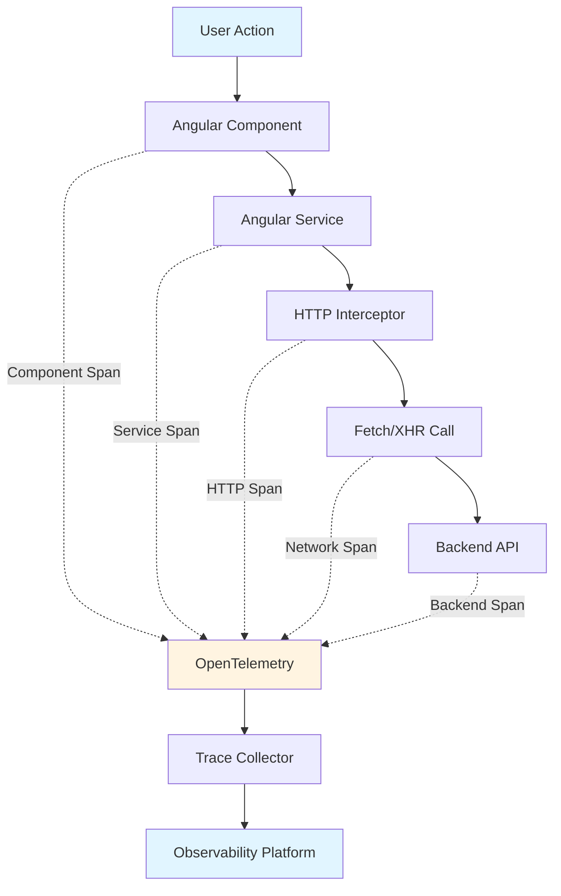

# How to Instrument an Angular Application with OpenTelemetry Web SDK

Author: [nawazdhandala](https://www.github.com/nawazdhandala)

Tags: OpenTelemetry, Angular, Web SDK, TypeScript, Browser, Tracing

Description: Complete guide to implementing OpenTelemetry Web SDK in Angular applications for comprehensive observability and distributed tracing.

Angular applications benefit tremendously from comprehensive observability. OpenTelemetry's Web SDK integrates seamlessly with Angular's dependency injection system and lifecycle hooks, providing automatic instrumentation and manual tracing capabilities. This guide demonstrates how to implement OpenTelemetry in Angular applications using TypeScript and Angular's architectural patterns.

## Why OpenTelemetry for Angular

Angular's opinionated structure and TypeScript foundation make it ideal for structured observability. OpenTelemetry provides vendor-neutral instrumentation that works with Angular's services, modules, and routing. The Web SDK captures browser events, network requests, and custom application logic without interfering with Angular's change detection or performance.

## Project Setup and Dependencies

Install OpenTelemetry packages through npm. These packages provide core tracing functionality and automatic browser instrumentation.

```bash
npm install @opentelemetry/api \
  @opentelemetry/sdk-trace-web \
  @opentelemetry/instrumentation \
  @opentelemetry/auto-instrumentations-web \
  @opentelemetry/exporter-trace-otlp-http \
  @opentelemetry/resources \
  @opentelemetry/semantic-conventions
```

The Web SDK works alongside Angular without requiring special configuration or build modifications.

## Creating a Tracing Service

Angular's dependency injection system makes it natural to encapsulate OpenTelemetry configuration in a service. This service initializes the tracer provider and manages the tracing lifecycle.

```typescript
// src/app/services/tracing.service.ts

import { Injectable } from '@angular/core';
import { WebTracerProvider } from '@opentelemetry/sdk-trace-web';
import { Resource } from '@opentelemetry/resources';
import { SemanticResourceAttributes } from '@opentelemetry/semantic-conventions';
import { registerInstrumentations } from '@opentelemetry/instrumentation';
import { getWebAutoInstrumentations } from '@opentelemetry/auto-instrumentations-web';
import { OTLPTraceExporter } from '@opentelemetry/exporter-trace-otlp-http';
import { BatchSpanProcessor } from '@opentelemetry/sdk-trace-web';
import { Tracer } from '@opentelemetry/api';
import { environment } from '../../environments/environment';

@Injectable({
  providedIn: 'root'
})
export class TracingService {
  private provider: WebTracerProvider;
  private tracer: Tracer;

  constructor() {
    this.initializeTracing();
  }

  private initializeTracing(): void {
    // Create resource with application metadata
    const resource = new Resource({
      [SemanticResourceAttributes.SERVICE_NAME]: 'angular-app',
      [SemanticResourceAttributes.SERVICE_VERSION]: environment.version,
      [SemanticResourceAttributes.DEPLOYMENT_ENVIRONMENT]: environment.name,
    });

    // Initialize the tracer provider
    this.provider = new WebTracerProvider({
      resource: resource,
    });

    // Configure the exporter to send traces to backend
    const exporter = new OTLPTraceExporter({
      url: environment.otelCollectorUrl,
      headers: {
        'x-api-key': environment.otelApiKey,
      },
    });

    // Add batch span processor for efficient trace export
    this.provider.addSpanProcessor(new BatchSpanProcessor(exporter, {
      maxQueueSize: 2048,
      maxExportBatchSize: 512,
      scheduledDelayMillis: 5000,
    }));

    // Register the provider globally
    this.provider.register();

    // Get tracer instance for manual instrumentation
    this.tracer = this.provider.getTracer('angular-app');

    // Register automatic instrumentations
    this.registerInstrumentations();
  }

  private registerInstrumentations(): void {
    registerInstrumentations({
      instrumentations: [
        getWebAutoInstrumentations({
          '@opentelemetry/instrumentation-document-load': {
            enabled: true,
          },
          '@opentelemetry/instrumentation-fetch': {
            propagateTraceHeaderCorsUrls: [
              new RegExp(environment.apiUrl),
            ],
            clearTimingResources: true,
          },
          '@opentelemetry/instrumentation-xml-http-request': {
            propagateTraceHeaderCorsUrls: [
              new RegExp(environment.apiUrl),
            ],
          },
          '@opentelemetry/instrumentation-user-interaction': {
            enabled: true,
            eventNames: ['click', 'submit'],
          },
        }),
      ],
    });
  }

  public getTracer(): Tracer {
    return this.tracer;
  }

  public shutdown(): Promise<void> {
    return this.provider.shutdown();
  }
}
```

## Configuring Environment Files

Define environment-specific configuration for OpenTelemetry settings.

```typescript
// src/environments/environment.ts

export const environment = {
  production: false,
  name: 'development',
  version: '1.0.0',
  apiUrl: 'http://localhost:3000',
  otelCollectorUrl: 'http://localhost:4318/v1/traces',
  otelApiKey: 'dev-key',
};
```

```typescript
// src/environments/environment.prod.ts

export const environment = {
  production: true,
  name: 'production',
  version: '1.0.0',
  apiUrl: 'https://api.yourapp.com',
  otelCollectorUrl: 'https://collector.yourapp.com/v1/traces',
  otelApiKey: process.env['OTEL_API_KEY'] || '',
};
```

## Initializing Tracing in App Module

Initialize the tracing service when the Angular application bootstraps. This ensures instrumentation starts before any components render.

```typescript
// src/app/app.module.ts

import { NgModule, APP_INITIALIZER } from '@angular/core';
import { BrowserModule } from '@angular/platform-browser';
import { HttpClientModule } from '@angular/common/http';
import { AppComponent } from './app.component';
import { TracingService } from './services/tracing.service';

// Factory function to initialize tracing before app starts
export function initializeTracing(tracingService: TracingService) {
  return () => {
    // Tracing initialization happens in the service constructor
    // This factory ensures the service is instantiated early
    return Promise.resolve();
  };
}

@NgModule({
  declarations: [
    AppComponent,
  ],
  imports: [
    BrowserModule,
    HttpClientModule,
  ],
  providers: [
    TracingService,
    {
      provide: APP_INITIALIZER,
      useFactory: initializeTracing,
      deps: [TracingService],
      multi: true,
    },
  ],
  bootstrap: [AppComponent]
})
export class AppModule { }
```

## Creating a Tracing Interceptor for HTTP Requests

Angular's HTTP interceptors integrate perfectly with OpenTelemetry, allowing you to add custom attributes to automatically instrumented requests.

```typescript
// src/app/interceptors/tracing.interceptor.ts

import { Injectable } from '@angular/core';
import {
  HttpInterceptor,
  HttpRequest,
  HttpHandler,
  HttpEvent,
  HttpResponse,
  HttpErrorResponse,
} from '@angular/common/http';
import { Observable } from 'rxjs';
import { tap } from 'rxjs/operators';
import { trace, context, SpanStatusCode } from '@opentelemetry/api';

@Injectable()
export class TracingInterceptor implements HttpInterceptor {
  private tracer = trace.getTracer('angular-http-client');

  intercept(
    request: HttpRequest<unknown>,
    next: HttpHandler
  ): Observable<HttpEvent<unknown>> {
    // Create a span for this HTTP request
    const span = this.tracer.startSpan(`HTTP ${request.method} ${request.url}`, {
      attributes: {
        'http.method': request.method,
        'http.url': request.url,
        'http.target': request.urlWithParams,
      },
    });

    // Execute request within span context
    return context.with(trace.setSpan(context.active(), span), () => {
      const startTime = Date.now();

      return next.handle(request).pipe(
        tap({
          next: (event) => {
            if (event instanceof HttpResponse) {
              const duration = Date.now() - startTime;

              // Add response attributes
              span.setAttributes({
                'http.status_code': event.status,
                'http.response_time_ms': duration,
                'http.response_content_length':
                  event.headers.get('content-length') || 0,
              });

              span.setStatus({ code: SpanStatusCode.OK });
              span.end();
            }
          },
          error: (error) => {
            if (error instanceof HttpErrorResponse) {
              span.setAttributes({
                'http.status_code': error.status,
                'http.error_message': error.message,
              });

              span.recordException(error);
              span.setStatus({
                code: SpanStatusCode.ERROR,
                message: error.message,
              });
            }
            span.end();
          },
        })
      );
    });
  }
}
```

Register the interceptor in your app module:

```typescript
// src/app/app.module.ts

import { HTTP_INTERCEPTORS } from '@angular/common/http';
import { TracingInterceptor } from './interceptors/tracing.interceptor';

@NgModule({
  providers: [
    {
      provide: HTTP_INTERCEPTORS,
      useClass: TracingInterceptor,
      multi: true,
    },
  ],
})
export class AppModule { }
```

## Tracing Angular Services

Instrument Angular services to track business logic execution and service method calls.

```typescript
// src/app/services/user.service.ts

import { Injectable } from '@angular/core';
import { HttpClient } from '@angular/common/http';
import { Observable } from 'rxjs';
import { tap } from 'rxjs/operators';
import { trace, SpanStatusCode } from '@opentelemetry/api';
import { TracingService } from './tracing.service';
import { environment } from '../../environments/environment';

interface User {
  id: string;
  name: string;
  email: string;
}

@Injectable({
  providedIn: 'root'
})
export class UserService {
  private tracer = this.tracingService.getTracer();
  private apiUrl = `${environment.apiUrl}/users`;

  constructor(
    private http: HttpClient,
    private tracingService: TracingService
  ) {}

  getUsers(): Observable<User[]> {
    const span = this.tracer.startSpan('UserService.getUsers');

    return this.http.get<User[]>(this.apiUrl).pipe(
      tap({
        next: (users) => {
          span.setAttribute('users.count', users.length);
          span.setStatus({ code: SpanStatusCode.OK });
          span.end();
        },
        error: (error) => {
          span.recordException(error);
          span.setStatus({
            code: SpanStatusCode.ERROR,
            message: error.message,
          });
          span.end();
        },
      })
    );
  }

  getUserById(id: string): Observable<User> {
    const span = this.tracer.startSpan('UserService.getUserById', {
      attributes: { 'user.id': id },
    });

    return this.http.get<User>(`${this.apiUrl}/${id}`).pipe(
      tap({
        next: (user) => {
          span.setAttribute('user.name', user.name);
          span.setStatus({ code: SpanStatusCode.OK });
          span.end();
        },
        error: (error) => {
          span.recordException(error);
          span.setStatus({
            code: SpanStatusCode.ERROR,
            message: error.message,
          });
          span.end();
        },
      })
    );
  }

  createUser(user: Omit<User, 'id'>): Observable<User> {
    const span = this.tracer.startSpan('UserService.createUser', {
      attributes: {
        'user.name': user.name,
        'user.email': user.email,
      },
    });

    return this.http.post<User>(this.apiUrl, user).pipe(
      tap({
        next: (createdUser) => {
          span.setAttribute('user.id', createdUser.id);
          span.setStatus({ code: SpanStatusCode.OK });
          span.end();
        },
        error: (error) => {
          span.recordException(error);
          span.setStatus({
            code: SpanStatusCode.ERROR,
            message: error.message,
          });
          span.end();
        },
      })
    );
  }
}
```

## Instrumenting Angular Components

Track component lifecycle events and user interactions to understand how users navigate your application.

```typescript
// src/app/components/user-list/user-list.component.ts

import { Component, OnInit, OnDestroy } from '@angular/core';
import { trace, Span } from '@opentelemetry/api';
import { TracingService } from '../../services/tracing.service';
import { UserService } from '../../services/user.service';

@Component({
  selector: 'app-user-list',
  templateUrl: './user-list.component.html',
  styleUrls: ['./user-list.component.css']
})
export class UserListComponent implements OnInit, OnDestroy {
  users: any[] = [];
  loading = false;
  error: string | null = null;

  private tracer = this.tracingService.getTracer();
  private componentSpan: Span | null = null;

  constructor(
    private userService: UserService,
    private tracingService: TracingService
  ) {}

  ngOnInit(): void {
    // Create a span for component initialization
    this.componentSpan = this.tracer.startSpan('UserListComponent.init');
    this.loadUsers();
  }

  ngOnDestroy(): void {
    // End the component span when component is destroyed
    if (this.componentSpan) {
      this.componentSpan.end();
    }
  }

  loadUsers(): void {
    const span = this.tracer.startSpan('UserListComponent.loadUsers');
    this.loading = true;
    this.error = null;

    this.userService.getUsers().subscribe({
      next: (users) => {
        this.users = users;
        this.loading = false;

        span.setAttribute('users.loaded', users.length);
        span.end();
      },
      error: (error) => {
        this.error = error.message;
        this.loading = false;

        span.recordException(error);
        span.end();
      },
    });
  }

  onUserClick(userId: string): void {
    const span = this.tracer.startSpan('UserListComponent.userClicked', {
      attributes: { 'user.id': userId },
    });

    // Handle user click logic
    // Navigation, state update, etc.

    span.end();
  }
}
```

## Creating a Tracing Decorator

Use TypeScript decorators to automatically instrument methods across your application.

```typescript
// src/app/decorators/traced.decorator.ts

import { trace } from '@opentelemetry/api';

// Get global tracer
const tracer = trace.getTracer('angular-app');

export function Traced(spanName?: string) {
  return function (
    target: any,
    propertyKey: string,
    descriptor: PropertyDescriptor
  ) {
    const originalMethod = descriptor.value;
    const name = spanName || `${target.constructor.name}.${propertyKey}`;

    descriptor.value = async function (...args: any[]) {
      const span = tracer.startSpan(name);

      try {
        const result = await originalMethod.apply(this, args);
        span.end();
        return result;
      } catch (error) {
        span.recordException(error as Error);
        span.end();
        throw error;
      }
    };

    return descriptor;
  };
}
```

Use the decorator in your services:

```typescript
// src/app/services/data.service.ts

import { Injectable } from '@angular/core';
import { Traced } from '../decorators/traced.decorator';

@Injectable({
  providedIn: 'root'
})
export class DataService {

  @Traced('DataService.processData')
  async processData(data: any[]): Promise<any[]> {
    // Complex data processing logic
    await this.delay(100);
    return data.map(item => ({ ...item, processed: true }));
  }

  @Traced()
  async fetchExternalData(url: string): Promise<any> {
    const response = await fetch(url);
    return response.json();
  }

  private delay(ms: number): Promise<void> {
    return new Promise(resolve => setTimeout(resolve, ms));
  }
}
```

## Tracing Angular Router Navigation

Track route changes and navigation timing to understand how users move through your application.

```typescript
// src/app/services/router-tracing.service.ts

import { Injectable } from '@angular/core';
import { Router, NavigationStart, NavigationEnd, NavigationError } from '@angular/router';
import { filter } from 'rxjs/operators';
import { trace, Span } from '@opentelemetry/api';
import { TracingService } from './tracing.service';

@Injectable({
  providedIn: 'root'
})
export class RouterTracingService {
  private tracer = this.tracingService.getTracer();
  private navigationSpans = new Map<number, Span>();

  constructor(
    private router: Router,
    private tracingService: TracingService
  ) {
    this.initializeRouterTracing();
  }

  private initializeRouterTracing(): void {
    // Track navigation start
    this.router.events
      .pipe(filter(event => event instanceof NavigationStart))
      .subscribe((event: NavigationStart) => {
        const span = this.tracer.startSpan('route.navigation', {
          attributes: {
            'route.url': event.url,
            'route.id': event.id,
            'navigation.trigger': event.navigationTrigger,
          },
        });
        this.navigationSpans.set(event.id, span);
      });

    // Track navigation end
    this.router.events
      .pipe(filter(event => event instanceof NavigationEnd))
      .subscribe((event: NavigationEnd) => {
        const span = this.navigationSpans.get(event.id);
        if (span) {
          span.setAttribute('route.final_url', event.urlAfterRedirects);
          span.end();
          this.navigationSpans.delete(event.id);
        }
      });

    // Track navigation errors
    this.router.events
      .pipe(filter(event => event instanceof NavigationError))
      .subscribe((event: NavigationError) => {
        const span = this.navigationSpans.get(event.id);
        if (span) {
          span.recordException(event.error);
          span.end();
          this.navigationSpans.delete(event.id);
        }
      });
  }
}
```

Initialize router tracing in your app module:

```typescript
// src/app/app.module.ts

import { RouterTracingService } from './services/router-tracing.service';

@NgModule({
  providers: [
    RouterTracingService,
  ],
})
export class AppModule {
  constructor(private routerTracing: RouterTracingService) {
    // Service instantiation initializes router tracing
  }
}
```

## Visualization of Trace Flow

Understanding how traces flow through your Angular application helps optimize instrumentation placement.



## Performance Considerations and Best Practices

OpenTelemetry adds minimal overhead to Angular applications when configured properly. Use batch span processors to reduce network calls, and consider sampling in production to manage data volume. Always test instrumentation performance in a staging environment before deploying to production.

```typescript
// Configure sampling for production
import { TraceIdRatioBasedSampler } from '@opentelemetry/sdk-trace-web';

const sampler = environment.production
  ? new TraceIdRatioBasedSampler(0.1) // Sample 10% in production
  : undefined; // Sample 100% in development

const provider = new WebTracerProvider({
  resource: resource,
  sampler: sampler,
});
```

OpenTelemetry integrates naturally with Angular's architecture, providing comprehensive observability without compromising performance or developer experience. By combining automatic instrumentation with strategic manual tracing, you gain deep insights into how your Angular application behaves in production.

