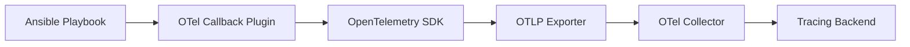

# How to Instrument Ansible Playbook Execution with OpenTelemetry

Author: [nawazdhandala](https://www.github.com/nawazdhandala)

Tags: OpenTelemetry, Ansible, Automation, Tracing, DevOps, Observability

Description: Learn how to instrument Ansible playbook execution with OpenTelemetry to trace task durations, identify slow roles, and gain full observability into your automation workflows.

---

Ansible playbooks are the backbone of infrastructure automation for many teams. They provision servers, deploy applications, configure networking, and orchestrate complex multi-step workflows. But when a playbook that used to finish in three minutes suddenly takes fifteen, figuring out which task or role is responsible can be a frustrating exercise in reading log output line by line.

OpenTelemetry gives you a much better approach. By instrumenting your Ansible runs with distributed tracing, you can visualize every play, role, and task as spans in a trace. You get timing data, success and failure status, and the ability to correlate playbook execution with downstream services that Ansible might be touching.

This guide walks through the practical steps of wiring up Ansible with OpenTelemetry, from callback plugins to the Collector, so you can stop guessing and start observing.

## Why Trace Ansible Playbooks?

Ansible outputs task results sequentially to stdout, and while the built-in profiling callback gives you task-level timing, it does not provide the hierarchical view you need to understand how plays, roles, and tasks nest together. It also does not let you correlate Ansible activity with application traces or infrastructure metrics.

With OpenTelemetry tracing, you get:

- A hierarchical span tree showing play, role, and task relationships
- Precise duration measurements for every unit of work
- Error attribution with task failure details attached to spans
- Correlation with application deployments and service restarts
- Historical trend analysis across playbook runs over time

## Architecture Overview

The instrumentation approach uses an Ansible callback plugin that emits OpenTelemetry spans. The callback hooks into Ansible's event lifecycle and creates spans at each stage of execution.



Each playbook run becomes a root trace. Plays become child spans of the run. Roles become children of plays. Tasks become children of roles (or plays, if they are not inside a role). This hierarchy maps naturally to how Ansible actually executes work.

## Building the Callback Plugin

Ansible callback plugins are Python classes that receive events during playbook execution. We will build one that uses the OpenTelemetry Python SDK to create and manage spans.

First, install the required packages on your Ansible control node:

```bash
# Install the OpenTelemetry SDK and OTLP exporter
pip install opentelemetry-api opentelemetry-sdk opentelemetry-exporter-otlp-proto-grpc
```

Now create the callback plugin. Place this file in your project's `callback_plugins/` directory or in one of the paths configured in `ansible.cfg`:

```python
# callback_plugins/opentelemetry_tracer.py
# Ansible callback plugin that emits OpenTelemetry spans for playbook execution

from __future__ import absolute_import, division, print_function

__metaclass__ = type

DOCUMENTATION = """
    name: opentelemetry_tracer
    type: aggregate
    short_description: Emits OpenTelemetry traces for playbook execution
    description:
        - Creates spans for plays, roles, and tasks during Ansible execution
    requirements:
        - opentelemetry-api
        - opentelemetry-sdk
        - opentelemetry-exporter-otlp-proto-grpc
"""

from ansible.plugins.callback import CallbackBase
from opentelemetry import trace
from opentelemetry.sdk.trace import TracerProvider
from opentelemetry.sdk.trace.export import BatchSpanProcessor
from opentelemetry.exporter.otlp.proto.grpc.trace_exporter import OTLPSpanExporter
from opentelemetry.trace.status import Status, StatusCode
import os
import time


class CallbackModule(CallbackBase):
    CALLBACK_VERSION = 2.0
    CALLBACK_TYPE = "aggregate"
    CALLBACK_NAME = "opentelemetry_tracer"

    def __init__(self):
        super().__init__()

        # Configure the OTLP exporter to send spans to the collector
        endpoint = os.environ.get("OTEL_EXPORTER_OTLP_ENDPOINT", "localhost:4317")
        exporter = OTLPSpanExporter(endpoint=endpoint, insecure=True)

        # Set up the tracer provider with batch processing
        provider = TracerProvider()
        provider.add_span_processor(BatchSpanProcessor(exporter))
        trace.set_tracer_provider(provider)

        self.tracer = trace.get_tracer("ansible.playbook")
        self.play_spans = {}
        self.task_spans = {}
        self.root_span = None
        self.root_context = None

    def v2_playbook_on_start(self, playbook):
        # Create the root span for the entire playbook run
        self.root_span = self.tracer.start_span(
            name=f"playbook: {os.path.basename(playbook._file_name)}",
            attributes={
                "ansible.playbook.file": playbook._file_name,
                "ansible.type": "playbook",
            },
        )
        self.root_context = trace.set_span_in_context(self.root_span)

    def v2_playbook_on_play_start(self, play):
        # Create a child span for each play within the playbook
        play_name = play.get_name().strip()
        ctx = trace.set_span_in_context(self.root_span)
        span = self.tracer.start_span(
            name=f"play: {play_name}",
            context=ctx,
            attributes={
                "ansible.play.name": play_name,
                "ansible.type": "play",
            },
        )
        self.play_spans[play._uuid] = span

    def v2_playbook_on_task_start(self, task, is_conditional):
        # Create a child span for each task
        play = task._parent._play
        parent_span = self.play_spans.get(play._uuid, self.root_span)
        ctx = trace.set_span_in_context(parent_span)

        task_name = task.get_name().strip()
        span = self.tracer.start_span(
            name=f"task: {task_name}",
            context=ctx,
            attributes={
                "ansible.task.name": task_name,
                "ansible.task.action": task.action,
                "ansible.type": "task",
            },
        )
        self.task_spans[task._uuid] = span

    def v2_runner_on_ok(self, result, **kwargs):
        # Mark the task span as successful and record result details
        task_uuid = result._task._uuid
        span = self.task_spans.get(task_uuid)
        if span:
            span.set_attribute("ansible.task.host", result._host.get_name())
            span.set_attribute("ansible.task.changed", result._result.get("changed", False))
            span.set_status(Status(StatusCode.OK))
            span.end()

    def v2_runner_on_failed(self, result, ignore_errors=False, **kwargs):
        # Mark the task span as failed and attach error details
        task_uuid = result._task._uuid
        span = self.task_spans.get(task_uuid)
        if span:
            span.set_attribute("ansible.task.host", result._host.get_name())
            error_msg = result._result.get("msg", "Unknown error")
            span.set_status(Status(StatusCode.ERROR, error_msg))
            span.set_attribute("ansible.task.error", error_msg)
            span.set_attribute("ansible.task.ignore_errors", ignore_errors)
            span.end()

    def v2_playbook_on_stats(self, stats):
        # End all play spans and the root span when the playbook finishes
        for play_uuid, span in self.play_spans.items():
            span.end()

        if self.root_span:
            # Attach summary stats as attributes on the root span
            hosts = sorted(stats.processed.keys())
            for host in hosts:
                summary = stats.summarize(host)
                self.root_span.set_attribute(f"ansible.stats.{host}.ok", summary["ok"])
                self.root_span.set_attribute(f"ansible.stats.{host}.failures", summary["failures"])
                self.root_span.set_attribute(f"ansible.stats.{host}.changed", summary["changed"])
            self.root_span.end()

        # Force flush to make sure all spans are exported
        trace.get_tracer_provider().force_flush()
```

This plugin follows the Ansible callback lifecycle. The `v2_playbook_on_start` method fires once at the beginning and creates the root span. Each play and task gets its own child span, and the `v2_runner_on_ok` and `v2_runner_on_failed` handlers close task spans with appropriate status codes. Finally, `v2_playbook_on_stats` cleans everything up when the run completes.

## Configuring the Collector

Set up an OpenTelemetry Collector to receive the spans from your Ansible control node and forward them to your tracing backend:

```yaml
# otel-collector-config.yaml
# Collector config for receiving Ansible playbook traces

receivers:
  otlp:
    protocols:
      grpc:
        # Listen for OTLP gRPC connections from the Ansible callback plugin
        endpoint: 0.0.0.0:4317

processors:
  batch:
    # Batch spans before exporting to reduce network overhead
    timeout: 5s
    send_batch_size: 256

  resource:
    attributes:
      - key: service.name
        value: "ansible-automation"
        action: upsert
      - key: deployment.environment
        value: "production"
        action: upsert

exporters:
  otlp:
    # Forward traces to your backend (OneUptime, Jaeger, etc.)
    endpoint: your-backend:4317
    tls:
      insecure: false

service:
  pipelines:
    traces:
      receivers: [otlp]
      processors: [resource, batch]
      exporters: [otlp]
```

The resource processor adds a consistent `service.name` attribute to all spans, which makes it easy to filter Ansible traces in your backend. The batch processor groups spans together to reduce the number of export calls.

## Enabling the Plugin

Tell Ansible to use the callback plugin by updating your `ansible.cfg`:

```ini
# ansible.cfg
[defaults]
# Point Ansible to the directory containing our callback plugin
callback_plugins = ./callback_plugins

# Enable the OpenTelemetry callback alongside any others you use
callbacks_enabled = opentelemetry_tracer

# Optional: increase verbosity if you need to debug the plugin itself
# verbosity = 2
```

Then set the environment variable for the Collector endpoint before running your playbook:

```bash
# Set the OTLP endpoint to your collector
export OTEL_EXPORTER_OTLP_ENDPOINT="collector.example.com:4317"

# Run the playbook as usual
ansible-playbook -i inventory.yml site.yml
```

The playbook will execute normally, but now every play and task emits spans to your tracing backend.

## Adding Role-Level Spans

The basic plugin creates spans for plays and tasks. To get role-level visibility, you can hook into the `v2_playbook_on_include` event and track role boundaries:

```python
# Additional method for the CallbackModule class
# Tracks role boundaries to create intermediate spans

def v2_playbook_on_include(self, included_file):
    # When a role or include is processed, record it as an attribute
    # on subsequent task spans so you can group tasks by role
    role_name = None
    if included_file._role:
        role_name = included_file._role.get_name()

    if role_name:
        # Store the current role so task spans can reference it
        self._current_role = role_name
```

You can then add `ansible.task.role` as an attribute on each task span, which lets you filter and group spans by role in your tracing UI.

## Analyzing Playbook Traces

Once spans are flowing, you will start seeing traces like this in your backend:

```
playbook: site.yml                    [14.2s]
  play: Configure web servers         [8.7s]
    task: Install nginx               [3.1s]
    task: Copy nginx config           [0.4s]
    task: Enable nginx service        [1.2s]
    task: Deploy application          [4.0s]
  play: Configure database servers    [5.5s]
    task: Install PostgreSQL          [2.8s]
    task: Configure pg_hba.conf       [0.3s]
    task: Restart PostgreSQL          [2.4s]
```

This view immediately tells you that "Install nginx" and "Restart PostgreSQL" are the slowest tasks. Over time, you can track whether playbook durations are creeping up and identify which tasks are responsible.

## Setting Up Alerts

With your traces landing in a backend like OneUptime, you can set up alerts based on playbook performance:

- Alert when total playbook duration exceeds a threshold (for example, a deploy playbook taking more than 10 minutes)
- Alert when any individual task fails across multiple consecutive runs
- Track the ratio of changed vs. unchanged tasks to detect configuration drift

These alerts turn your automation from a fire-and-forget tool into something you actively observe and manage.

## Wrapping Up

Instrumenting Ansible with OpenTelemetry is not complicated, but the visibility it provides is substantial. A single callback plugin gives you hierarchical tracing of every playbook run, with task-level timing, error attribution, and the ability to correlate automation activity with the rest of your observability stack. If your team runs Ansible regularly, whether for deployments, provisioning, or configuration management, adding OpenTelemetry tracing to your playbooks is one of the highest-value instrumentation investments you can make.
