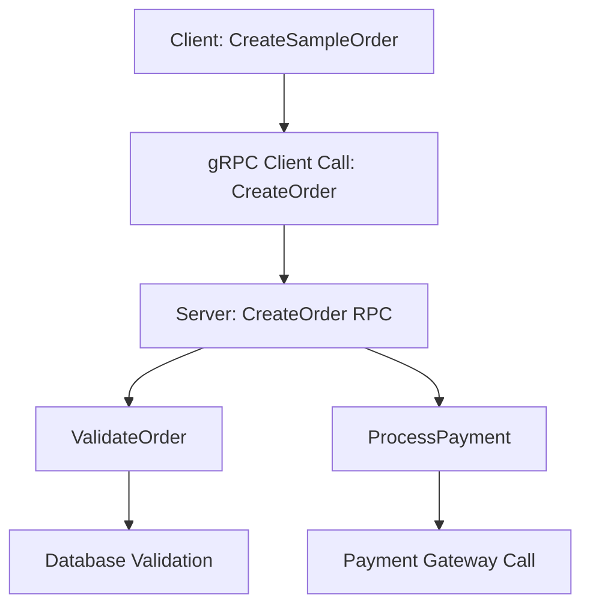

# How to Instrument ASP.NET Core gRPC Services with OpenTelemetry

Author: [nawazdhandala](https://www.github.com/nawazdhandala)

Tags: OpenTelemetry, ASP.NET Core, gRPC, .NET, Tracing, C#

Description: Learn how to implement distributed tracing and metrics for ASP.NET Core gRPC services using OpenTelemetry for complete observability of your microservices.

gRPC has become the go-to choice for inter-service communication in microservices architectures, offering efficient binary serialization, strong typing through Protocol Buffers, and excellent performance. However, debugging issues in distributed gRPC systems requires comprehensive observability. OpenTelemetry provides the instrumentation needed to trace requests across services and collect meaningful metrics about gRPC performance.

ASP.NET Core's gRPC implementation integrates seamlessly with OpenTelemetry, automatically creating spans for incoming requests and outgoing calls. Combined with custom instrumentation, you get complete visibility into your gRPC services.

## Understanding gRPC Observability Challenges

Traditional HTTP observability tools don't always translate well to gRPC. gRPC uses HTTP/2 with binary payloads, making traffic harder to inspect. Streaming RPCs add complexity since a single RPC can involve multiple messages flowing in both directions over an extended period.

OpenTelemetry addresses these challenges by providing automatic instrumentation that understands gRPC semantics, creating appropriate spans for unary calls, server streaming, client streaming, and bidirectional streaming RPCs.

## Setting Up the gRPC Project

Create a new ASP.NET Core gRPC service and add the necessary OpenTelemetry packages:

```bash
# Create a new gRPC service project
dotnet new grpc -n GrpcObservabilityDemo
cd GrpcObservabilityDemo

# Add OpenTelemetry packages
dotnet add package OpenTelemetry.Extensions.Hosting
dotnet add package OpenTelemetry.Instrumentation.AspNetCore
dotnet add package OpenTelemetry.Instrumentation.GrpcNetClient
dotnet add package OpenTelemetry.Exporter.Console
dotnet add package OpenTelemetry.Exporter.OpenTelemetryProtocol
dotnet add package Grpc.Net.Client
```

The GrpcNetClient package provides instrumentation for gRPC clients, while AspNetCore instrumentation handles server-side gRPC calls.

## Defining the Proto Service Contract

Create a proto file that defines a realistic service for order management:

```protobuf
// Protos/orders.proto
syntax = "proto3";

option csharp_namespace = "GrpcObservabilityDemo";

package orders;

service OrderService {
  rpc CreateOrder (CreateOrderRequest) returns (CreateOrderResponse);
  rpc GetOrder (GetOrderRequest) returns (Order);
  rpc ListOrders (ListOrdersRequest) returns (stream Order);
  rpc ProcessOrderStream (stream OrderUpdate) returns (ProcessOrderStreamResponse);
}

message CreateOrderRequest {
  string customer_id = 1;
  repeated OrderItem items = 2;
  string payment_method = 3;
}

message CreateOrderResponse {
  string order_id = 1;
  OrderStatus status = 2;
  double total_amount = 3;
}

message GetOrderRequest {
  string order_id = 1;
}

message Order {
  string order_id = 1;
  string customer_id = 2;
  repeated OrderItem items = 3;
  OrderStatus status = 4;
  double total_amount = 5;
  int64 created_at = 6;
}

message OrderItem {
  string product_id = 1;
  int32 quantity = 2;
  double price = 3;
}

message ListOrdersRequest {
  string customer_id = 1;
  int32 page_size = 2;
}

message OrderUpdate {
  string order_id = 1;
  OrderStatus status = 2;
}

message ProcessOrderStreamResponse {
  int32 processed_count = 1;
}

enum OrderStatus {
  PENDING = 0;
  PROCESSING = 1;
  COMPLETED = 2;
  FAILED = 3;
}
```

Add the proto file to your .csproj:

```xml
<ItemGroup>
  <Protobuf Include="Protos\orders.proto" GrpcServices="Server" />
</ItemGroup>
```

## Configuring OpenTelemetry for gRPC

Set up comprehensive observability in your Program.cs:

```csharp
using OpenTelemetry.Resources;
using OpenTelemetry.Trace;
using OpenTelemetry.Metrics;

var builder = WebApplication.CreateBuilder(args);

// Add gRPC services
builder.Services.AddGrpc();

// Configure OpenTelemetry
builder.Services.AddOpenTelemetry()
    .ConfigureResource(resource => resource
        .AddService(
            serviceName: "GrpcObservabilityDemo",
            serviceVersion: "1.0.0",
            serviceInstanceId: Environment.MachineName))
    .WithTracing(tracing => tracing
        .AddAspNetCoreInstrumentation(options =>
        {
            // Enrich spans with additional gRPC context
            options.RecordException = true;
            options.EnrichWithHttpRequest = (activity, httpRequest) =>
            {
                // Add gRPC-specific metadata
                if (httpRequest.Headers.TryGetValue("grpc-status", out var status))
                {
                    activity.SetTag("grpc.status_code", status.ToString());
                }
            };
        })
        .AddGrpcClientInstrumentation(options =>
        {
            options.RecordException = true;
        })
        .AddSource("GrpcObservabilityDemo.*")
        .AddConsoleExporter()
        .AddOtlpExporter(otlpOptions =>
        {
            otlpOptions.Endpoint = new Uri("http://localhost:4317");
        }))
    .WithMetrics(metrics => metrics
        .AddAspNetCoreInstrumentation()
        .AddMeter("GrpcObservabilityDemo.*")
        .AddConsoleExporter());

var app = builder.Build();

// Map gRPC service
app.MapGrpcService<OrderService>();

app.MapGet("/", () => "gRPC service is running. Use a gRPC client to communicate.");

app.Run();
```

This configuration automatically instruments both server and client gRPC calls, creating spans that capture timing, status codes, and errors.

## Implementing the Instrumented gRPC Service

Create the order service implementation with custom instrumentation:

```csharp
using Grpc.Core;
using System.Diagnostics;
using System.Diagnostics.Metrics;

namespace GrpcObservabilityDemo.Services;

public class OrderService : GrpcObservabilityDemo.OrderService.OrderServiceBase
{
    private readonly ILogger<OrderService> _logger;
    private static readonly ActivitySource ActivitySource = new("GrpcObservabilityDemo.OrderService");
    private readonly Meter _meter;
    private readonly Counter<long> _ordersCreatedCounter;
    private readonly Histogram<double> _orderProcessingDuration;
    private readonly Dictionary<string, Order> _orders = new();

    public OrderService(ILogger<OrderService> logger, IMeterFactory meterFactory)
    {
        _logger = logger;
        _meter = meterFactory.Create("GrpcObservabilityDemo.OrderService");

        _ordersCreatedCounter = _meter.CreateCounter<long>(
            "orders.created",
            unit: "{orders}",
            description: "Total number of orders created");

        _orderProcessingDuration = _meter.CreateHistogram<double>(
            "order.processing.duration",
            unit: "ms",
            description: "Order processing duration in milliseconds");
    }

    public override async Task<CreateOrderResponse> CreateOrder(
        CreateOrderRequest request,
        ServerCallContext context)
    {
        // Start custom activity for detailed tracing
        using var activity = ActivitySource.StartActivity("CreateOrder");
        var stopwatch = Stopwatch.StartNew();

        try
        {
            // Add context to the span
            activity?.SetTag("customer.id", request.CustomerId);
            activity?.SetTag("payment.method", request.PaymentMethod);
            activity?.SetTag("items.count", request.Items.Count);

            _logger.LogInformation(
                "Creating order for customer {CustomerId} with {ItemCount} items",
                request.CustomerId,
                request.Items.Count);

            // Validate the request
            await ValidateOrderAsync(request, activity);

            // Calculate total
            var totalAmount = CalculateTotal(request.Items);
            activity?.SetTag("order.total", totalAmount);

            // Process payment
            await ProcessPaymentAsync(request.PaymentMethod, totalAmount, activity);

            // Create order
            var orderId = Guid.NewGuid().ToString();
            var order = new Order
            {
                OrderId = orderId,
                CustomerId = request.CustomerId,
                Status = OrderStatus.Completed,
                TotalAmount = totalAmount,
                CreatedAt = DateTimeOffset.UtcNow.ToUnixTimeSeconds()
            };
            order.Items.AddRange(request.Items);

            _orders[orderId] = order;

            stopwatch.Stop();

            // Record metrics
            _ordersCreatedCounter.Add(1,
                new KeyValuePair<string, object?>("payment.method", request.PaymentMethod));
            _orderProcessingDuration.Record(stopwatch.Elapsed.TotalMilliseconds);

            activity?.SetStatus(ActivityStatusCode.Ok);
            activity?.SetTag("order.id", orderId);

            _logger.LogInformation(
                "Order {OrderId} created successfully in {Duration}ms",
                orderId,
                stopwatch.Elapsed.TotalMilliseconds);

            return new CreateOrderResponse
            {
                OrderId = orderId,
                Status = OrderStatus.Completed,
                TotalAmount = totalAmount
            };
        }
        catch (RpcException)
        {
            // Let gRPC exceptions propagate
            activity?.SetStatus(ActivityStatusCode.Error);
            throw;
        }
        catch (Exception ex)
        {
            _logger.LogError(ex, "Error creating order");
            activity?.SetStatus(ActivityStatusCode.Error, ex.Message);
            activity?.RecordException(ex);

            throw new RpcException(new Status(StatusCode.Internal, "Failed to create order"));
        }
    }

    private async Task ValidateOrderAsync(CreateOrderRequest request, Activity? activity)
    {
        using var validationActivity = ActivitySource.StartActivity("ValidateOrder");

        // Simulate validation
        await Task.Delay(20);

        if (string.IsNullOrEmpty(request.CustomerId))
        {
            throw new RpcException(new Status(StatusCode.InvalidArgument, "Customer ID is required"));
        }

        if (request.Items.Count == 0)
        {
            throw new RpcException(new Status(StatusCode.InvalidArgument, "At least one item is required"));
        }

        validationActivity?.SetTag("validation.result", "success");
    }

    private double CalculateTotal(IEnumerable<OrderItem> items)
    {
        return items.Sum(item => item.Price * item.Quantity);
    }

    private async Task ProcessPaymentAsync(string paymentMethod, double amount, Activity? activity)
    {
        using var paymentActivity = ActivitySource.StartActivity("ProcessPayment");
        paymentActivity?.SetTag("payment.method", paymentMethod);
        paymentActivity?.SetTag("payment.amount", amount);

        // Simulate payment processing
        await Task.Delay(100);

        paymentActivity?.SetTag("payment.status", "success");
    }

    public override async Task<Order> GetOrder(GetOrderRequest request, ServerCallContext context)
    {
        using var activity = ActivitySource.StartActivity("GetOrder");
        activity?.SetTag("order.id", request.OrderId);

        _logger.LogInformation("Retrieving order {OrderId}", request.OrderId);

        // Simulate database lookup
        await Task.Delay(30);

        if (_orders.TryGetValue(request.OrderId, out var order))
        {
            activity?.SetStatus(ActivityStatusCode.Ok);
            return order;
        }

        activity?.SetTag("order.found", false);
        activity?.SetStatus(ActivityStatusCode.Error, "Order not found");

        throw new RpcException(new Status(StatusCode.NotFound, $"Order {request.OrderId} not found"));
    }

    public override async Task ListOrders(
        ListOrdersRequest request,
        IServerStreamWriter<Order> responseStream,
        ServerCallContext context)
    {
        using var activity = ActivitySource.StartActivity("ListOrders");
        activity?.SetTag("customer.id", request.CustomerId);
        activity?.SetTag("page.size", request.PageSize);

        _logger.LogInformation(
            "Listing orders for customer {CustomerId}",
            request.CustomerId);

        var customerOrders = _orders.Values
            .Where(o => o.CustomerId == request.CustomerId)
            .Take(request.PageSize > 0 ? request.PageSize : 10)
            .ToList();

        activity?.SetTag("orders.count", customerOrders.Count);

        foreach (var order in customerOrders)
        {
            // Check for cancellation
            if (context.CancellationToken.IsCancellationRequested)
            {
                activity?.AddEvent(new ActivityEvent("StreamCancelled"));
                break;
            }

            await responseStream.WriteAsync(order);

            // Simulate delay between streaming responses
            await Task.Delay(50);
        }

        activity?.SetStatus(ActivityStatusCode.Ok);
        _logger.LogInformation(
            "Streamed {Count} orders for customer {CustomerId}",
            customerOrders.Count,
            request.CustomerId);
    }

    public override async Task<ProcessOrderStreamResponse> ProcessOrderStream(
        IAsyncStreamReader<OrderUpdate> requestStream,
        ServerCallContext context)
    {
        using var activity = ActivitySource.StartActivity("ProcessOrderStream");
        var processedCount = 0;

        _logger.LogInformation("Starting to process order update stream");

        await foreach (var update in requestStream.ReadAllAsync())
        {
            using var updateActivity = ActivitySource.StartActivity("ProcessOrderUpdate");
            updateActivity?.SetTag("order.id", update.OrderId);
            updateActivity?.SetTag("order.status", update.Status.ToString());

            if (_orders.TryGetValue(update.OrderId, out var order))
            {
                order.Status = update.Status;
                processedCount++;
                updateActivity?.SetTag("update.result", "success");
            }
            else
            {
                updateActivity?.SetTag("update.result", "order_not_found");
            }

            // Simulate processing time
            await Task.Delay(30);
        }

        activity?.SetTag("processed.count", processedCount);
        activity?.SetStatus(ActivityStatusCode.Ok);

        _logger.LogInformation(
            "Processed {Count} order updates from stream",
            processedCount);

        return new ProcessOrderStreamResponse
        {
            ProcessedCount = processedCount
        };
    }
}
```

The service creates detailed spans for each operation, adding relevant tags and recording exceptions. Streaming operations get their own spans, with child spans for individual messages.

## Building a gRPC Client with Instrumentation

Create a client to test the instrumented service:

```csharp
using Grpc.Net.Client;
using System.Diagnostics;

namespace GrpcObservabilityDemo.Client;

public class OrderClient
{
    private readonly GrpcChannel _channel;
    private readonly OrderService.OrderServiceClient _client;
    private static readonly ActivitySource ActivitySource = new("GrpcObservabilityDemo.Client");

    public OrderClient(string address)
    {
        _channel = GrpcChannel.ForAddress(address);
        _client = new OrderService.OrderServiceClient(_channel);
    }

    public async Task<string> CreateSampleOrderAsync()
    {
        using var activity = ActivitySource.StartActivity("CreateSampleOrder");

        try
        {
            var request = new CreateOrderRequest
            {
                CustomerId = "CUST-001",
                PaymentMethod = "credit_card"
            };

            request.Items.Add(new OrderItem
            {
                ProductId = "PROD-123",
                Quantity = 2,
                Price = 29.99
            });

            request.Items.Add(new OrderItem
            {
                ProductId = "PROD-456",
                Quantity = 1,
                Price = 49.99
            });

            activity?.SetTag("customer.id", request.CustomerId);
            activity?.SetTag("items.count", request.Items.Count);

            // The gRPC client instrumentation automatically creates a span
            var response = await _client.CreateOrderAsync(request);

            activity?.SetTag("order.id", response.OrderId);
            activity?.SetTag("order.total", response.TotalAmount);
            activity?.SetStatus(ActivityStatusCode.Ok);

            return response.OrderId;
        }
        catch (Exception ex)
        {
            activity?.SetStatus(ActivityStatusCode.Error, ex.Message);
            activity?.RecordException(ex);
            throw;
        }
    }

    public async Task<Order> GetOrderAsync(string orderId)
    {
        using var activity = ActivitySource.StartActivity("GetOrder");
        activity?.SetTag("order.id", orderId);

        var request = new GetOrderRequest { OrderId = orderId };
        var order = await _client.GetOrderAsync(request);

        activity?.SetTag("order.status", order.Status.ToString());
        activity?.SetStatus(ActivityStatusCode.Ok);

        return order;
    }

    public async Task<List<Order>> ListOrdersAsync(string customerId, int pageSize = 10)
    {
        using var activity = ActivitySource.StartActivity("ListOrders");
        activity?.SetTag("customer.id", customerId);

        var request = new ListOrdersRequest
        {
            CustomerId = customerId,
            PageSize = pageSize
        };

        var orders = new List<Order>();
        var call = _client.ListOrders(request);

        await foreach (var order in call.ResponseStream.ReadAllAsync())
        {
            orders.Add(order);
        }

        activity?.SetTag("orders.count", orders.Count);
        activity?.SetStatus(ActivityStatusCode.Ok);

        return orders;
    }
}
```

The client-side instrumentation automatically creates spans for outgoing gRPC calls and propagates trace context to the server.

## Understanding gRPC Trace Hierarchy

When a client calls a gRPC service, OpenTelemetry creates a distributed trace that spans both sides:



Each span captures timing, status, and contextual information. The trace context flows automatically through gRPC metadata.

## Handling gRPC Status Codes

gRPC has its own status code system that should be reflected in traces:

```csharp
public override async Task<Order> GetOrder(GetOrderRequest request, ServerCallContext context)
{
    using var activity = ActivitySource.StartActivity("GetOrder");
    activity?.SetTag("order.id", request.OrderId);

    try
    {
        if (string.IsNullOrEmpty(request.OrderId))
        {
            activity?.SetStatus(ActivityStatusCode.Error, "Invalid argument");
            throw new RpcException(new Status(StatusCode.InvalidArgument, "Order ID is required"));
        }

        if (!_orders.TryGetValue(request.OrderId, out var order))
        {
            activity?.SetStatus(ActivityStatusCode.Error, "Not found");
            throw new RpcException(new Status(StatusCode.NotFound, $"Order {request.OrderId} not found"));
        }

        activity?.SetStatus(ActivityStatusCode.Ok);
        activity?.SetTag("grpc.status_code", StatusCode.OK);

        return order;
    }
    catch (RpcException ex)
    {
        activity?.SetTag("grpc.status_code", ex.StatusCode);
        throw;
    }
}
```

Mapping gRPC status codes to span status and tags helps you filter and analyze failures in your observability backend.

## Instrumenting Bidirectional Streaming

Bidirectional streaming RPCs require special attention since multiple messages flow in both directions:

```csharp
public override async Task<BidirectionalStreamResponse> ProcessBidirectional(
    IAsyncStreamReader<StreamRequest> requestStream,
    IServerStreamWriter<StreamResponse> responseStream,
    ServerCallContext context)
{
    using var activity = ActivitySource.StartActivity("ProcessBidirectional");
    var messageCount = 0;

    try
    {
        await foreach (var request in requestStream.ReadAllAsync())
        {
            // Create a span for each message processed
            using var messageActivity = ActivitySource.StartActivity("ProcessStreamMessage");
            messageActivity?.SetTag("message.number", messageCount);
            messageActivity?.SetTag("message.data", request.Data);

            // Process the request
            var response = new StreamResponse
            {
                Result = $"Processed: {request.Data}",
                Timestamp = DateTimeOffset.UtcNow.ToUnixTimeSeconds()
            };

            await responseStream.WriteAsync(response);
            messageCount++;

            messageActivity?.SetStatus(ActivityStatusCode.Ok);
        }

        activity?.SetTag("messages.processed", messageCount);
        activity?.SetStatus(ActivityStatusCode.Ok);

        return new BidirectionalStreamResponse { ProcessedCount = messageCount };
    }
    catch (Exception ex)
    {
        activity?.SetStatus(ActivityStatusCode.Error, ex.Message);
        activity?.RecordException(ex);
        throw;
    }
}
```

Creating child spans for individual messages provides granular visibility into stream processing.

## Best Practices for gRPC Observability

Keep these practices in mind when instrumenting gRPC services:

Always propagate trace context across service boundaries. OpenTelemetry does this automatically for gRPC, but if you're using custom metadata, ensure you don't accidentally override the trace context headers.

Use semantic conventions for span names and attributes. Follow OpenTelemetry's semantic conventions for RPC calls to ensure consistency across your services.

Add business context through tags. While automatic instrumentation captures technical details, add tags for business-relevant information like customer IDs, order amounts, or feature flags.

Handle streaming RPCs appropriately. Create child spans for individual messages in streams rather than trying to capture everything in a single span.

## Conclusion

OpenTelemetry provides excellent support for observing ASP.NET Core gRPC services. Automatic instrumentation captures the technical details of RPC calls, while custom activities let you add business context and trace complex operations.

The combination of distributed tracing and metrics gives you complete visibility into gRPC service behavior. You can track request latency, identify bottlenecks, debug errors, and understand how requests flow through your microservices architecture.

Start with the automatic instrumentation for gRPC servers and clients, then add custom activities for business logic that needs deeper visibility. Use consistent naming and tagging conventions, properly handle streaming RPCs, and map gRPC status codes to span status. With comprehensive instrumentation in place, debugging distributed gRPC systems becomes significantly more manageable.
