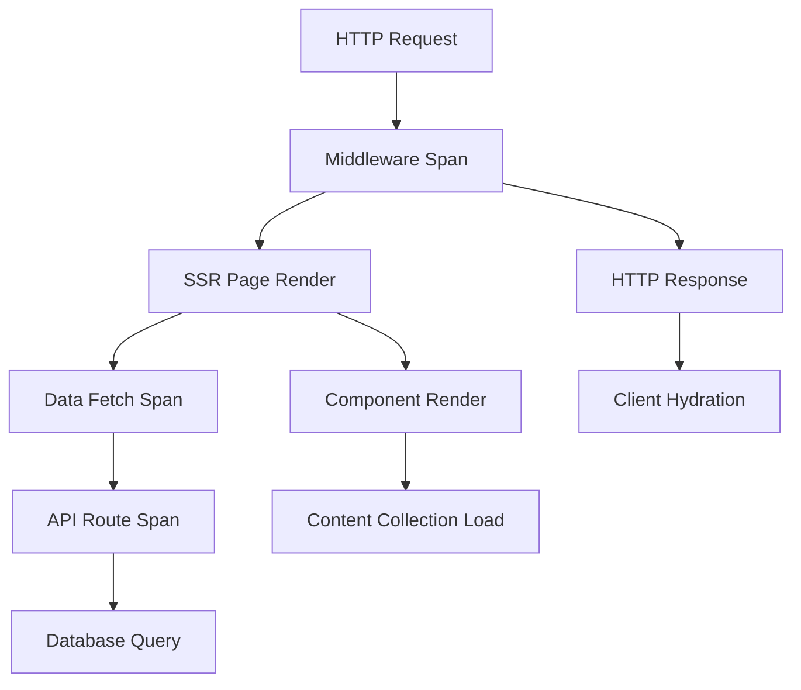

# How to Instrument Astro Applications with OpenTelemetry

Author: [nawazdhandala](https://www.github.com/nawazdhandala)

Tags: OpenTelemetry, Astro, JavaScript, SSR, Static Site, Tracing

Description: Learn how to implement comprehensive OpenTelemetry instrumentation in Astro applications to monitor both static site generation and server-side rendering performance.

Astro combines static site generation with optional server-side rendering, creating unique observability challenges. Unlike pure SSR frameworks or purely static sites, Astro applications require instrumentation that spans build-time operations, server-side API routes, and hybrid rendering strategies. OpenTelemetry provides the flexible observability layer needed to understand performance across all these contexts.

## Understanding Astro's Architecture and Observability Needs

Astro generates static HTML by default but allows opt-in server rendering for specific pages or components. This hybrid approach means you need observability at multiple layers: build-time component rendering, runtime server requests, API route execution, and client-side hydration. Each layer presents different performance characteristics and potential bottlenecks.

Traditional monitoring solutions focus on either build tools or runtime servers, but Astro requires both. You need to track how long static pages take to build, measure server-side rendering latency for dynamic routes, and understand how API endpoints perform under load.

## Setting Up OpenTelemetry for Astro

Install the necessary OpenTelemetry packages for Node.js:

```bash
npm install @opentelemetry/api @opentelemetry/sdk-node
npm install @opentelemetry/auto-instrumentations-node
npm install @opentelemetry/exporter-trace-otlp-http
npm install @opentelemetry/instrumentation-http
```

Create an instrumentation file that initializes OpenTelemetry before Astro starts:

```typescript
// instrumentation.ts - Initialize OpenTelemetry
import { NodeSDK } from '@opentelemetry/sdk-node';
import { getNodeAutoInstrumentations } from '@opentelemetry/auto-instrumentations-node';
import { OTLPTraceExporter } from '@opentelemetry/exporter-trace-otlp-http';
import { Resource } from '@opentelemetry/resources';
import { SemanticResourceAttributes } from '@opentelemetry/semantic-conventions';

const sdk = new NodeSDK({
  resource: new Resource({
    [SemanticResourceAttributes.SERVICE_NAME]: 'astro-application',
    [SemanticResourceAttributes.SERVICE_VERSION]: '1.0.0',
    [SemanticResourceAttributes.DEPLOYMENT_ENVIRONMENT]:
      process.env.NODE_ENV || 'development',
  }),
  traceExporter: new OTLPTraceExporter({
    url: process.env.OTEL_EXPORTER_OTLP_ENDPOINT ||
         'http://localhost:4318/v1/traces',
  }),
  instrumentations: [
    getNodeAutoInstrumentations({
      '@opentelemetry/instrumentation-fs': { enabled: false },
      '@opentelemetry/instrumentation-http': { enabled: true },
    }),
  ],
});

sdk.start();

console.log('OpenTelemetry instrumentation started');

process.on('SIGTERM', () => {
  sdk.shutdown()
    .then(() => console.log('Tracing terminated'))
    .catch((error) => console.error('Error terminating tracing', error))
    .finally(() => process.exit(0));
});
```

## Configuring Astro to Load Instrumentation

Update your Astro configuration to load instrumentation in SSR mode:

```typescript
// astro.config.mjs
import { defineConfig } from 'astro/config';
import node from '@astrojs/node';

// Load instrumentation for server builds
if (process.env.NODE_ENV === 'production' || process.env.SSR === 'true') {
  await import('./instrumentation.ts');
}

export default defineConfig({
  output: 'hybrid', // or 'server' for full SSR
  adapter: node({
    mode: 'standalone',
  }),
  integrations: [],
});
```

## Instrumenting API Routes

Create instrumented API routes that track execution time and errors:

```typescript
// src/pages/api/users/[id].ts - Instrumented API route
import type { APIRoute } from 'astro';
import { trace, SpanStatusCode, context } from '@opentelemetry/api';

const tracer = trace.getTracer('astro-api', '1.0.0');

export const GET: APIRoute = async ({ params, request }) => {
  const span = tracer.startSpan('api.users.get', {
    attributes: {
      'http.method': 'GET',
      'http.route': '/api/users/:id',
      'http.url': request.url,
      'user.id': params.id,
    },
  });

  const startTime = Date.now();

  try {
    // Extract trace context from incoming request
    const traceParent = request.headers.get('traceparent');
    if (traceParent) {
      span.setAttribute('trace.parent', traceParent);
    }

    // Simulate database query
    const dbSpan = tracer.startSpan(
      'db.query.users',
      {
        attributes: {
          'db.system': 'postgresql',
          'db.operation': 'SELECT',
          'db.table': 'users',
        },
      },
      trace.setSpan(context.active(), span)
    );

    const user = await fetchUser(params.id!);

    dbSpan.setAttributes({
      'db.rows_returned': user ? 1 : 0,
    });
    dbSpan.end();

    if (!user) {
      span.setAttribute('http.status_code', 404);
      span.end();

      return new Response(JSON.stringify({ error: 'User not found' }), {
        status: 404,
        headers: { 'Content-Type': 'application/json' },
      });
    }

    const duration = Date.now() - startTime;

    span.setAttributes({
      'http.status_code': 200,
      'http.response.duration_ms': duration,
    });
    span.setStatus({ code: SpanStatusCode.OK });
    span.end();

    return new Response(JSON.stringify(user), {
      status: 200,
      headers: { 'Content-Type': 'application/json' },
    });
  } catch (error) {
    const duration = Date.now() - startTime;

    span.setAttributes({
      'http.status_code': 500,
      'http.response.duration_ms': duration,
    });
    span.recordException(error as Error);
    span.setStatus({
      code: SpanStatusCode.ERROR,
      message: (error as Error).message,
    });
    span.end();

    return new Response(JSON.stringify({ error: 'Internal server error' }), {
      status: 500,
      headers: { 'Content-Type': 'application/json' },
    });
  }
};

export const POST: APIRoute = async ({ request }) => {
  const span = tracer.startSpan('api.users.create', {
    attributes: {
      'http.method': 'POST',
      'http.route': '/api/users',
    },
  });

  try {
    const body = await request.json();

    span.addEvent('request.body.parsed', {
      'body.keys': Object.keys(body).join(','),
    });

    // Validation span
    const validationSpan = tracer.startSpan(
      'validation.user.create',
      {},
      trace.setSpan(context.active(), span)
    );

    const validationErrors = validateUserInput(body);
    validationSpan.setAttribute('validation.errors', validationErrors.length);
    validationSpan.end();

    if (validationErrors.length > 0) {
      span.setAttribute('http.status_code', 400);
      span.end();

      return new Response(JSON.stringify({ errors: validationErrors }), {
        status: 400,
        headers: { 'Content-Type': 'application/json' },
      });
    }

    // Database insert span
    const insertSpan = tracer.startSpan(
      'db.insert.users',
      {
        attributes: {
          'db.system': 'postgresql',
          'db.operation': 'INSERT',
          'db.table': 'users',
        },
      },
      trace.setSpan(context.active(), span)
    );

    const newUser = await createUser(body);
    insertSpan.setAttribute('db.user.id', newUser.id);
    insertSpan.end();

    span.setAttributes({
      'http.status_code': 201,
      'user.id': newUser.id,
    });
    span.setStatus({ code: SpanStatusCode.OK });
    span.end();

    return new Response(JSON.stringify(newUser), {
      status: 201,
      headers: { 'Content-Type': 'application/json' },
    });
  } catch (error) {
    span.recordException(error as Error);
    span.setStatus({ code: SpanStatusCode.ERROR });
    span.end();

    return new Response(JSON.stringify({ error: 'Failed to create user' }), {
      status: 500,
      headers: { 'Content-Type': 'application/json' },
    });
  }
};

// Helper functions
async function fetchUser(id: string) {
  // Database query implementation
  return { id, name: 'John Doe', email: 'john@example.com' };
}

function validateUserInput(body: any): string[] {
  const errors: string[] = [];
  if (!body.name) errors.push('Name is required');
  if (!body.email) errors.push('Email is required');
  return errors;
}

async function createUser(data: any) {
  // Database insert implementation
  return { id: 'new-id', ...data };
}
```

## Instrumenting Server-Side Rendered Pages

Track SSR page rendering performance:

```astro
---
// src/pages/users/[id].astro - SSR page with tracing
import { trace, context as otelContext } from '@opentelemetry/api';

const tracer = trace.getTracer('astro-ssr', '1.0.0');

const span = tracer.startSpan('ssr.page.render.user', {
  attributes: {
    'page.route': '/users/:id',
    'page.params.id': Astro.params.id,
  },
});

try {
  // Fetch data with tracing
  const dataSpan = tracer.startSpan(
    'ssr.data.fetch.user',
    {},
    trace.setSpan(otelContext.active(), span)
  );

  const response = await fetch(`http://localhost:4321/api/users/${Astro.params.id}`, {
    headers: {
      // Propagate trace context
      'traceparent': `00-${span.spanContext().traceId}-${span.spanContext().spanId}-01`,
    },
  });

  const user = await response.json();

  dataSpan.setAttributes({
    'http.status': response.status,
    'data.user.id': user.id,
  });
  dataSpan.end();

  // Component rendering span
  const renderSpan = tracer.startSpan(
    'ssr.component.render',
    {},
    trace.setSpan(otelContext.active(), span)
  );

  const startRender = Date.now();
---

<!DOCTYPE html>
<html lang="en">
  <head>
    <title>{user.name}</title>
  </head>
  <body>
    <h1>{user.name}</h1>
    <p>Email: {user.email}</p>
  </body>
</html>

---
  const renderDuration = Date.now() - startRender;
  renderSpan.setAttribute('render.duration_ms', renderDuration);
  renderSpan.end();

  span.setAttributes({
    'ssr.success': true,
    'ssr.user.id': user.id,
  });
  span.end();
} catch (error) {
  span.recordException(error as Error);
  span.setStatus({ code: 2, message: (error as Error).message });
  span.end();
  throw error;
}
---
```

## Creating Reusable Tracing Utilities

Build helper functions to simplify instrumentation across your application:

```typescript
// src/lib/tracing.ts - Reusable tracing utilities
import { trace, context, Span, SpanStatusCode } from '@opentelemetry/api';

const tracer = trace.getTracer('astro-app', '1.0.0');

export async function traceAsync<T>(
  operationName: string,
  attributes: Record<string, string | number | boolean>,
  fn: (span: Span) => Promise<T>
): Promise<T> {
  const span = tracer.startSpan(operationName, { attributes });

  try {
    const result = await context.with(
      trace.setSpan(context.active(), span),
      () => fn(span)
    );

    span.setStatus({ code: SpanStatusCode.OK });
    span.end();
    return result;
  } catch (error) {
    span.recordException(error as Error);
    span.setStatus({
      code: SpanStatusCode.ERROR,
      message: (error as Error).message,
    });
    span.end();
    throw error;
  }
}

export function traceSync<T>(
  operationName: string,
  attributes: Record<string, string | number | boolean>,
  fn: (span: Span) => T
): T {
  const span = tracer.startSpan(operationName, { attributes });

  try {
    const result = fn(span);
    span.setStatus({ code: SpanStatusCode.OK });
    span.end();
    return result;
  } catch (error) {
    span.recordException(error as Error);
    span.setStatus({ code: SpanStatusCode.ERROR });
    span.end();
    throw error;
  }
}

export function getCurrentSpan(): Span | undefined {
  return trace.getSpan(context.active());
}

export function addSpanEvent(
  name: string,
  attributes?: Record<string, string | number | boolean>
) {
  const span = getCurrentSpan();
  if (span) {
    span.addEvent(name, attributes);
  }
}
```

## Instrumenting Middleware

Create Astro middleware that automatically traces requests:

```typescript
// src/middleware/index.ts - Request tracing middleware
import { defineMiddleware } from 'astro:middleware';
import { trace, context as otelContext, SpanStatusCode } from '@opentelemetry/api';

const tracer = trace.getTracer('astro-middleware', '1.0.0');

export const onRequest = defineMiddleware(async (context, next) => {
  const { request, url } = context;

  const span = tracer.startSpan('http.request', {
    attributes: {
      'http.method': request.method,
      'http.url': url.href,
      'http.route': url.pathname,
      'http.scheme': url.protocol.replace(':', ''),
      'http.host': url.hostname,
    },
  });

  const startTime = Date.now();

  try {
    // Execute the request within the span context
    const response = await otelContext.with(
      trace.setSpan(otelContext.active(), span),
      () => next()
    );

    const duration = Date.now() - startTime;

    span.setAttributes({
      'http.status_code': response.status,
      'http.response.duration_ms': duration,
    });

    if (response.status >= 400) {
      span.setStatus({
        code: SpanStatusCode.ERROR,
        message: `HTTP ${response.status}`,
      });
    } else {
      span.setStatus({ code: SpanStatusCode.OK });
    }

    span.end();
    return response;
  } catch (error) {
    const duration = Date.now() - startTime;

    span.setAttributes({
      'http.response.duration_ms': duration,
    });
    span.recordException(error as Error);
    span.setStatus({
      code: SpanStatusCode.ERROR,
      message: (error as Error).message,
    });
    span.end();

    throw error;
  }
});
```

## Tracing Build-Time Operations

Instrument the build process to understand static generation performance:

```typescript
// src/lib/buildTracing.ts - Build-time instrumentation
import { trace, context } from '@opentelemetry/api';

const tracer = trace.getTracer('astro-build', '1.0.0');

export async function tracePageGeneration(
  pagePath: string,
  generator: () => Promise<void>
) {
  const span = tracer.startSpan('build.page.generate', {
    attributes: {
      'build.page.path': pagePath,
      'build.mode': 'static',
    },
  });

  const startTime = Date.now();

  try {
    await generator();

    const duration = Date.now() - startTime;
    span.setAttributes({
      'build.duration_ms': duration,
      'build.success': true,
    });
    span.end();
  } catch (error) {
    span.recordException(error as Error);
    span.setStatus({ code: 2 });
    span.end();
    throw error;
  }
}
```

## Integrating with Astro Content Collections

Trace content loading and processing:

```typescript
// src/content/config.ts - Content collections with tracing
import { defineCollection, z } from 'astro:content';
import { traceAsync } from '../lib/tracing';

const blog = defineCollection({
  type: 'content',
  schema: z.object({
    title: z.string(),
    description: z.string(),
    publishDate: z.date(),
  }),
});

export const collections = { blog };

// Traced content loader utility
export async function getTracedCollection(collectionName: string) {
  return traceAsync(
    'content.collection.load',
    {
      'collection.name': collectionName,
    },
    async (span) => {
      const { getCollection } = await import('astro:content');
      const entries = await getCollection(collectionName);

      span.setAttribute('collection.entries.count', entries.length);
      return entries;
    }
  );
}
```

## Monitoring Component Hydration

Track client-side hydration performance:

```typescript
// src/components/TracedCounter.tsx - Instrumented interactive component
import { useEffect, useState } from 'react';
import { trace } from '@opentelemetry/api';

const tracer = trace.getTracer('astro-client', '1.0.0');

export default function TracedCounter() {
  const [count, setCount] = useState(0);

  useEffect(() => {
    const span = tracer.startSpan('component.hydrate.counter', {
      attributes: {
        'component.name': 'TracedCounter',
        'component.framework': 'react',
      },
    });

    const hydrationEnd = performance.now();
    const hydrationDuration = hydrationEnd - performance.timeOrigin;

    span.setAttributes({
      'hydration.duration_ms': hydrationDuration,
      'hydration.success': true,
    });
    span.end();
  }, []);

  const handleClick = () => {
    const span = tracer.startSpan('component.interaction.click', {
      attributes: {
        'component.name': 'TracedCounter',
        'interaction.type': 'button_click',
      },
    });

    setCount((c) => c + 1);
    span.setAttribute('counter.new_value', count + 1);
    span.end();
  };

  return (
    <button onClick={handleClick}>
      Count: {count}
    </button>
  );
}
```

## Visualizing Astro Application Traces

The complete instrumentation creates traces showing the full request lifecycle:



## Performance Optimization with Traces

Use trace data to identify optimization opportunities:

```typescript
// src/lib/optimization.ts - Performance analysis utilities
import { trace } from '@opentelemetry/api';

export function measureCriticalPath<T>(
  operationName: string,
  threshold: number,
  fn: () => T
): T {
  const tracer = trace.getTracer('astro-optimization', '1.0.0');
  const span = tracer.startSpan(operationName);
  const startTime = performance.now();

  try {
    const result = fn();
    const duration = performance.now() - startTime;

    span.setAttributes({
      'performance.duration_ms': duration,
      'performance.threshold_ms': threshold,
      'performance.exceeds_threshold': duration > threshold,
    });

    if (duration > threshold) {
      span.addEvent('performance.threshold.exceeded', {
        'excess_ms': duration - threshold,
      });
    }

    span.end();
    return result;
  } catch (error) {
    span.recordException(error as Error);
    span.end();
    throw error;
  }
}
```

## Best Practices for Astro Observability

Keep instrumentation consistent across both static and server-rendered pages. Use the same tracing utilities and patterns whether code runs at build time or runtime. This consistency makes it easier to compare performance characteristics and identify issues.

Be selective about what you trace during builds. Static generation might process hundreds of pages, so avoid creating excessive spans that slow down builds. Focus on high-level metrics and sample detailed traces for representative pages.

Propagate trace context from server-side rendering to API routes so you can see the complete request flow. Use standard W3C Trace Context headers to maintain trace continuity across HTTP boundaries.

Monitor both server-side and client-side performance. Track time to first byte for SSR pages, but also measure hydration time and client-side interaction latency. Full observability requires understanding performance from both perspectives.

OpenTelemetry transforms Astro applications from partially observable static sites into fully instrumented systems. You gain visibility into build performance, runtime request handling, and client-side behavior. This comprehensive observability enables you to optimize every layer of your application and deliver exceptional user experiences.
