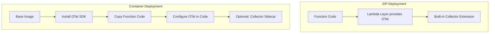

# How to Instrument AWS Lambda Container Images with OpenTelemetry

Author: [nawazdhandala](https://www.github.com/nawazdhandala)

Tags: OpenTelemetry, AWS Lambda, Docker, Container Images, Serverless, Instrumentation, Python, Observability

Description: Learn how to add OpenTelemetry instrumentation to AWS Lambda functions deployed as container images with Dockerfiles and manual SDK setup.

---

AWS Lambda supports deploying functions as container images up to 10 GB in size. This opens the door to packaging complex dependencies, ML models, and custom runtimes that would never fit in a standard deployment package. But it also changes how you instrument with OpenTelemetry. You cannot use Lambda layers with container images. The layer mechanism is only available for zip-based deployments.

With container images, you bundle the OpenTelemetry SDK and all its dependencies directly into your Docker image. This actually gives you more control over the instrumentation. You pick the exact versions, configure everything in code, and avoid the version conflicts that sometimes happen with layers. This guide walks through the process for a Python Lambda function, though the same principles apply to any runtime.

## Why Container Images Change the Instrumentation Approach

When you use zip-based Lambda deployments, the OpenTelemetry Lambda layer provides the SDK, auto-instrumentation, and a collector sidecar. With container images, you need to provide all of these yourself.



The trade-off is more setup work for more control. You decide exactly what gets installed, how it is configured, and when telemetry gets flushed. For production workloads where you need predictable behavior, this control is valuable.

## Building the Dockerfile with OpenTelemetry

Start with the AWS-provided base image for your runtime. These images include the Lambda Runtime Interface Client, which handles the communication between your code and the Lambda execution environment.

```dockerfile
# Use the official AWS Lambda Python base image.
# This includes the Lambda runtime interface and is
# optimized for the Lambda execution environment.
FROM public.ecr.aws/lambda/python:3.12

# Install OpenTelemetry packages.
# We pin specific versions to ensure reproducible builds
# and avoid surprises from automatic upgrades.
RUN pip install --no-cache-dir \
    opentelemetry-api==1.27.0 \
    opentelemetry-sdk==1.27.0 \
    opentelemetry-exporter-otlp-proto-http==1.27.0 \
    opentelemetry-instrumentation-botocore==0.48b0 \
    opentelemetry-instrumentation-requests==0.48b0 \
    opentelemetry-semantic-conventions==0.48b0 \
    opentelemetry-propagator-aws-xray==1.0.2

# Copy your function code into the container
COPY app/ ${LAMBDA_TASK_ROOT}/

# Set the handler that Lambda will invoke
CMD ["handler.lambda_handler"]
```

The key packages here are:
- `opentelemetry-api` and `opentelemetry-sdk` for core tracing and metrics
- `opentelemetry-exporter-otlp-proto-http` for sending telemetry over HTTP (gRPC may also work but HTTP is more reliable behind Lambda's network)
- `opentelemetry-instrumentation-botocore` for auto-instrumenting AWS SDK calls
- `opentelemetry-propagator-aws-xray` for compatibility with AWS X-Ray trace IDs

## Setting Up the OpenTelemetry SDK in Code

Since you do not have a layer handling initialization, you set up the SDK yourself. Create a module that configures the tracer provider and gets called at import time, which happens during the Lambda cold start.

```python
# otel_setup.py
from opentelemetry import trace
from opentelemetry.sdk.trace import TracerProvider
from opentelemetry.sdk.trace.export import BatchSpanProcessor
from opentelemetry.exporter.otlp.proto.http.trace_exporter import OTLPSpanExporter
from opentelemetry.sdk.resources import Resource
from opentelemetry.semconv.resource import ResourceAttributes
from opentelemetry.propagators.aws import AwsXRayPropagator
from opentelemetry import propagate
import os

def configure_opentelemetry():
    """
    Initialize the OpenTelemetry SDK for Lambda container deployment.
    This should be called once during the cold start phase, outside
    the handler function, so the overhead only happens on init.
    """
    # Define the resource that identifies this service
    resource = Resource.create({
        ResourceAttributes.SERVICE_NAME: os.environ.get(
            "OTEL_SERVICE_NAME", "lambda-container-service"
        ),
        ResourceAttributes.SERVICE_VERSION: "1.0.0",
        ResourceAttributes.CLOUD_PROVIDER: "aws",
        ResourceAttributes.CLOUD_PLATFORM: "aws_lambda",
        ResourceAttributes.FAAS_NAME: os.environ.get(
            "AWS_LAMBDA_FUNCTION_NAME", "unknown"
        ),
        ResourceAttributes.FAAS_VERSION: os.environ.get(
            "AWS_LAMBDA_FUNCTION_VERSION", "$LATEST"
        ),
    })

    # Configure the OTLP HTTP exporter.
    # Using HTTP instead of gRPC because it works more reliably
    # in the Lambda networking environment.
    exporter = OTLPSpanExporter(
        endpoint=os.environ.get(
            "OTEL_EXPORTER_OTLP_ENDPOINT", "https://your-collector:4318"
        ) + "/v1/traces",
    )

    # Use a BatchSpanProcessor with tuned settings for Lambda.
    # The default batch settings assume a long-running server.
    # Lambda needs shorter delays and smaller batches because
    # the function may freeze between invocations.
    provider = TracerProvider(
        resource=resource,
        active_span_processor=BatchSpanProcessor(
            exporter,
            # Export quickly since Lambda may freeze after the handler returns
            schedule_delay_millis=1000,
            # Keep batch size small for faster flushes
            max_export_batch_size=32,
            # Set a short timeout so we do not block the response
            export_timeout_millis=5000,
        ),
    )

    # Register the provider globally
    trace.set_tracer_provider(provider)

    # Set AWS X-Ray propagator for compatibility with
    # other AWS services that use X-Ray trace headers
    propagate.set_global_textmap(AwsXRayPropagator())

    return provider
```

The batch processor settings matter a lot in Lambda. The default `schedule_delay_millis` is 5000 (5 seconds), which is fine for a web server but could cause you to lose telemetry in Lambda. When the handler finishes, the execution environment freezes. Any pending batches that have not been exported yet could be lost if the environment is recycled before the next invocation thaws it. Setting a shorter delay reduces this risk.

## Writing the Instrumented Handler

Now wire the SDK initialization into your handler module. The initialization happens at module import time, which corresponds to the Lambda cold start. The handler itself creates spans for each invocation and ensures telemetry is flushed before returning.

```python
# handler.py
import json
from otel_setup import configure_opentelemetry
from opentelemetry import trace, context
from opentelemetry.trace import SpanKind, StatusCode
from opentelemetry.instrumentation.botocore import BotocoreInstrumentor
import boto3

# Initialize OpenTelemetry during cold start.
# This runs once when Lambda loads the module for the first time.
provider = configure_opentelemetry()

# Enable auto-instrumentation for all boto3/botocore calls.
# Every DynamoDB query, S3 operation, or SQS send will
# automatically generate child spans.
BotocoreInstrumentor().instrument()

# Create a tracer for manual instrumentation
tracer = trace.get_tracer("lambda-container-handler", "1.0.0")

# Initialize AWS clients outside the handler for connection reuse
dynamodb = boto3.resource("dynamodb")
table = dynamodb.Table("orders")


def lambda_handler(event, lambda_context):
    """
    Main Lambda handler with OpenTelemetry instrumentation.
    Each invocation creates a root span with relevant attributes.
    """
    # Start a root span for this invocation
    with tracer.start_as_current_span(
        "lambda.invocation",
        kind=SpanKind.SERVER,
        attributes={
            "faas.invocation_id": lambda_context.aws_request_id,
            "faas.coldstart": _is_cold_start(),
            "cloud.account.id": lambda_context.invoked_function_arn.split(":")[4],
        },
    ) as span:
        try:
            # Process the incoming event
            result = process_event(event)

            span.set_status(StatusCode.OK)
            response = {
                "statusCode": 200,
                "body": json.dumps(result),
            }
        except Exception as e:
            # Record the exception on the span so it shows up
            # in your trace viewer with the full stack trace
            span.record_exception(e)
            span.set_status(StatusCode.ERROR, str(e))
            response = {
                "statusCode": 500,
                "body": json.dumps({"error": str(e)}),
            }
        finally:
            # Force flush all pending telemetry before returning.
            # Without this, the execution environment may freeze
            # before the batch processor has a chance to export.
            provider.force_flush(timeout_millis=5000)

        return response


def process_event(event):
    """Process the event with traced sub-operations."""
    # Create a child span for the database operation.
    # The botocore instrumentation will create its own spans
    # for the actual DynamoDB API call, nested under this one.
    with tracer.start_as_current_span(
        "process.save_order",
        attributes={"order.source": event.get("source", "unknown")},
    ):
        order_data = event.get("body", {})
        if isinstance(order_data, str):
            order_data = json.loads(order_data)

        # This DynamoDB call will be auto-instrumented by botocore
        table.put_item(Item=order_data)

        return {"orderId": order_data.get("id"), "status": "saved"}


# Track cold starts using a module-level flag
_cold = True

def _is_cold_start():
    global _cold
    if _cold:
        _cold = False
        return True
    return False
```

The `force_flush` call in the `finally` block is essential. It ensures all spans from this invocation are exported before Lambda freezes the execution environment. Without it, you would lose telemetry on low-traffic functions where invocations are spaced far apart.

## Adding the Collector as a Lambda Extension

For container images, you can include the OpenTelemetry Collector as a Lambda extension directly in your image. This gives you local telemetry processing, batching, and retry logic without sending data directly from your function code to a remote endpoint.

```dockerfile
# Multi-stage build: first stage gets the collector binary
FROM public.ecr.aws/lambda/python:3.12 AS collector-stage

# Download the OpenTelemetry Lambda collector extension
RUN curl -L -o /tmp/collector.tar.gz \
    https://github.com/open-telemetry/opentelemetry-lambda/releases/download/v0.10.0/opentelemetry-collector-layer-amd64.tar.gz \
    && mkdir -p /opt/extensions \
    && tar -xzf /tmp/collector.tar.gz -C /opt/ \
    && rm /tmp/collector.tar.gz

# Final image with both the function and the collector
FROM public.ecr.aws/lambda/python:3.12

# Copy the collector extension from the build stage
COPY --from=collector-stage /opt/extensions /opt/extensions
COPY --from=collector-stage /opt/collector-config /opt/collector-config

# Copy the collector configuration
COPY collector-config.yaml /opt/collector-config/config.yaml

# Install Python dependencies
RUN pip install --no-cache-dir \
    opentelemetry-api==1.27.0 \
    opentelemetry-sdk==1.27.0 \
    opentelemetry-exporter-otlp-proto-http==1.27.0 \
    opentelemetry-instrumentation-botocore==0.48b0

# Copy function code
COPY app/ ${LAMBDA_TASK_ROOT}/

CMD ["handler.lambda_handler"]
```

The collector extension runs alongside your function as a separate process. Your function sends telemetry to localhost, and the collector handles export to your backend with proper retry logic and buffering.

```yaml
# collector-config.yaml
receivers:
  otlp:
    protocols:
      # Listen on localhost for telemetry from the Lambda function
      http:
        endpoint: 0.0.0.0:4318

exporters:
  otlp:
    # Forward telemetry to your observability backend
    endpoint: https://your-backend:4317
    tls:
      insecure: false

service:
  pipelines:
    traces:
      receivers: [otlp]
      exporters: [otlp]
```

When using the collector extension, point your function's OTLP exporter at `http://localhost:4318` instead of a remote endpoint. The collector handles the rest.

## Deploying the Container Image

Build and push the image to ECR, then create or update your Lambda function to use it.

```bash
# Build the container image
docker build -t lambda-otel-container .

# Tag and push to ECR
aws ecr get-login-password --region us-east-1 | \
  docker login --username AWS --password-stdin 123456789.dkr.ecr.us-east-1.amazonaws.com

docker tag lambda-otel-container:latest \
  123456789.dkr.ecr.us-east-1.amazonaws.com/lambda-otel-container:latest

docker push \
  123456789.dkr.ecr.us-east-1.amazonaws.com/lambda-otel-container:latest

# Create the Lambda function from the container image
aws lambda create-function \
  --function-name otel-container-function \
  --package-type Image \
  --code ImageUri=123456789.dkr.ecr.us-east-1.amazonaws.com/lambda-otel-container:latest \
  --role arn:aws:iam::123456789:role/lambda-execution-role \
  --timeout 30 \
  --memory-size 512 \
  --environment "Variables={OTEL_SERVICE_NAME=lambda-container-service,OTEL_EXPORTER_OTLP_ENDPOINT=http://localhost:4318}"
```

Setting the memory to at least 512 MB is recommended when running with the collector extension, since both your function and the collector share that memory allocation.

## Wrapping Up

Instrumenting Lambda container images with OpenTelemetry requires bundling everything yourself, but that gives you precise control over versions, configuration, and behavior. The pattern is straightforward: install the SDK in your Dockerfile, initialize the provider during cold start, create spans in your handler, and force flush before returning. If you want local telemetry processing, add the collector extension to your container image as well. The result is the same rich observability you get with layers, packaged in a way that works with any container size and any custom runtime.
