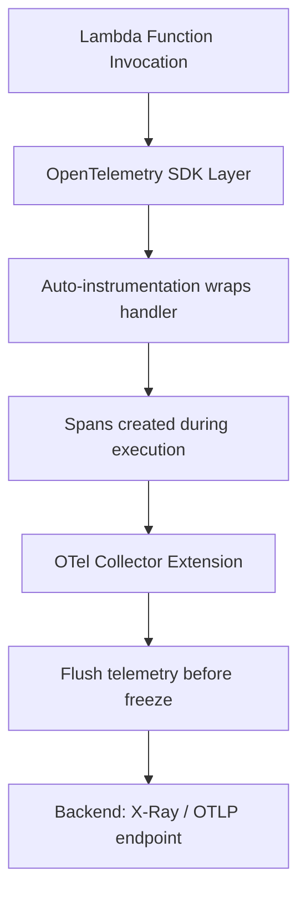

# How to Instrument AWS Lambda Functions with OpenTelemetry Layers

Author: [nawazdhandala](https://www.github.com/nawazdhandala)

Tags: OpenTelemetry, AWS Lambda, Serverless, Tracing, Observability, ADOT

Description: Learn how to add OpenTelemetry instrumentation to AWS Lambda functions using Lambda Layers for automatic trace collection and export.

---

AWS Lambda functions are notoriously difficult to observe. They spin up, do their work, and vanish. Traditional APM agents that rely on long-running processes do not fit well here. OpenTelemetry solves this with Lambda Layers, which are pre-packaged bundles of the OpenTelemetry SDK and auto-instrumentation libraries that attach to your function without modifying your application code.

This guide shows you how to instrument Lambda functions using OpenTelemetry Layers so you can capture traces, correlate them across services, and export them to your preferred backend.

## How OpenTelemetry Lambda Layers Work

A Lambda Layer is a ZIP archive that gets extracted into the `/opt` directory of your function's execution environment. The OpenTelemetry Lambda Layers contain:

- The OpenTelemetry SDK for your runtime (Python, Node.js, Java, etc.)
- Auto-instrumentation libraries for common frameworks
- A stripped-down OpenTelemetry Collector that runs as a Lambda extension
- Configuration defaults that work out of the box



The collector extension runs as a separate process alongside your function. When your function finishes executing, the extension flushes any buffered telemetry data before Lambda freezes the execution environment. This is critical because Lambda can freeze your environment at any time after the handler returns.

## Choosing the Right Layer

AWS publishes ADOT Lambda Layers for several runtimes. Here are the most commonly used ones:

| Runtime | Layer Name | Auto-instrumentation |
|---------|-----------|---------------------|
| Python 3.9-3.12 | aws-otel-python-amd64 | Yes (requests, boto3, etc.) |
| Node.js 18-20 | aws-otel-nodejs-amd64 | Yes (http, express, aws-sdk) |
| Java 11-21 | aws-otel-java-agent-amd64 | Yes (Spring, AWS SDK) |
| .NET 6-8 | aws-otel-dotnet-amd64 | Yes (ASP.NET, HttpClient) |
| Collector only | aws-otel-collector-amd64 | No (bring your own SDK) |

For ARM64 (Graviton2) functions, replace `amd64` with `arm64` in the layer name.

## Step 1: Add the OpenTelemetry Layer to Your Function

You can add layers through the AWS Console, CLI, or infrastructure-as-code tools. Here is the CLI approach.

First, find the latest layer ARN for your region and runtime:

```bash
# List available ADOT layer versions for Python in us-east-1
# Pick the latest version number from the output
aws lambda list-layer-versions \
  --layer-name aws-otel-python-amd64-ver-1-25-0 \
  --region us-east-1 \
  --query 'LayerVersions[0].LayerVersionArn' \
  --output text
```

Then attach the layer to your function:

```bash
# Add the ADOT layer and the collector extension layer to your Lambda function
# Both layers are needed: one for SDK auto-instrumentation, one for the collector
aws lambda update-function-configuration \
  --function-name my-function \
  --layers \
    arn:aws:lambda:us-east-1:901920570463:layer:aws-otel-python-amd64-ver-1-25-0:1 \
    arn:aws:lambda:us-east-1:901920570463:layer:aws-otel-collector-amd64-ver-0-98-0:1 \
  --region us-east-1
```

## Step 2: Configure the Handler Wrapper

The auto-instrumentation layer works by wrapping your original handler. You need to tell Lambda to invoke the wrapper instead of your handler directly.

```bash
# Set environment variables that configure the OpenTelemetry layer
# AWS_LAMBDA_EXEC_WRAPPER tells Lambda to use the OTel wrapper script
# OTEL_SERVICE_NAME identifies your function in traces
aws lambda update-function-configuration \
  --function-name my-function \
  --environment "Variables={
    AWS_LAMBDA_EXEC_WRAPPER=/opt/otel-handler,
    OTEL_SERVICE_NAME=my-function,
    OTEL_PROPAGATORS=tracecontext,
    OPENTELEMETRY_COLLECTOR_CONFIG_FILE=/var/task/collector.yaml
  }" \
  --region us-east-1
```

The `AWS_LAMBDA_EXEC_WRAPPER` variable is the key piece. It points to a script in the layer that initializes OpenTelemetry before calling your actual handler function.

## Step 3: Create a Collector Configuration

The embedded collector needs a configuration file to know where to send data. Create a `collector.yaml` in your function's deployment package.

```yaml
# collector.yaml
# Minimal collector config for Lambda - receives from the SDK and exports to X-Ray
receivers:
  otlp:
    protocols:
      grpc:
        endpoint: localhost:4317

processors:
  # Batch spans but with a short timeout since Lambda has limited execution time
  batch:
    timeout: 5s
    send_batch_size: 50

exporters:
  # Export traces to AWS X-Ray
  awsxray:
    region: us-east-1

  # Alternatively, send to any OTLP-compatible backend
  # otlp:
  #   endpoint: "https://otel-collector.example.com:4317"
  #   headers:
  #     Authorization: "Bearer your-token"

service:
  pipelines:
    traces:
      receivers: [otlp]
      processors: [batch]
      exporters: [awsxray]
```

If you want to send traces to a third-party backend or your own collector, swap out the `awsxray` exporter for an `otlp` exporter pointing at your endpoint.

## Step 4: Write Your Lambda Function (Python Example)

Here is a Python Lambda function that will be automatically instrumented by the layer. You do not need to add any OpenTelemetry imports for basic instrumentation. The layer handles it.

```python
# lambda_function.py
# This function is auto-instrumented by the ADOT Lambda layer
# HTTP calls to external services and boto3 calls will generate child spans automatically
import json
import boto3
import urllib.request

def lambda_handler(event, context):
    # This DynamoDB call will be traced automatically by the boto3 instrumentation
    dynamodb = boto3.resource('dynamodb')
    table = dynamodb.Table('users')
    response = table.get_item(Key={'user_id': event.get('user_id', '123')})

    # This HTTP call will also be traced automatically
    req = urllib.request.urlopen('https://api.example.com/health')
    status = req.getcode()

    return {
        'statusCode': 200,
        'body': json.dumps({
            'user': response.get('Item', {}),
            'external_api_status': status
        })
    }
```

The auto-instrumentation layer patches `boto3` and `urllib` at startup. Every DynamoDB call and HTTP request your function makes gets wrapped in a child span under the main invocation span.

## Step 5: Add Manual Instrumentation (Optional)

Sometimes auto-instrumentation is not enough. You might want to create custom spans around business logic or add attributes with domain-specific context.

```python
# lambda_function.py with manual instrumentation added
# Import the trace API to create custom spans alongside auto-instrumented ones
import json
import boto3
from opentelemetry import trace

# Get a tracer for this module
tracer = trace.get_tracer("my-function")

def lambda_handler(event, context):
    # The outer invocation span is created automatically by the layer

    # Create a custom span for a business logic operation
    with tracer.start_as_current_span("process-order") as span:
        order_id = event.get("order_id", "unknown")
        # Add business context as span attributes for easier debugging
        span.set_attribute("order.id", order_id)
        span.set_attribute("order.source", event.get("source", "api"))

        # This boto3 call creates a child span under "process-order"
        dynamodb = boto3.resource("dynamodb")
        table = dynamodb.Table("orders")
        table.put_item(Item={"order_id": order_id, "status": "processing"})

        # Nested span for a sub-operation
        with tracer.start_as_current_span("validate-inventory") as child_span:
            inventory_ok = check_inventory(order_id)
            child_span.set_attribute("inventory.available", inventory_ok)

    return {"statusCode": 200, "body": json.dumps({"order_id": order_id})}

def check_inventory(order_id):
    # Simulated inventory check
    return True
```

## Step 6: Deploy and Test

Package your function with the collector config and deploy it:

```bash
# Zip the function code and collector config together
zip -r function.zip lambda_function.py collector.yaml

# Deploy the updated function code
aws lambda update-function-code \
  --function-name my-function \
  --zip-file fileb://function.zip \
  --region us-east-1
```

Invoke the function and check for traces:

```bash
# Invoke the function with a test payload
aws lambda invoke \
  --function-name my-function \
  --payload '{"user_id": "456"}' \
  --region us-east-1 \
  output.json

# Check the function logs for OpenTelemetry initialization messages
aws logs tail /aws/lambda/my-function --since 5m --region us-east-1
```

## Using SAM or CDK for Infrastructure-as-Code

If you manage your Lambda functions with AWS SAM, here is how to add the layer in your template:

```yaml
# template.yaml (AWS SAM)
# Defines a Lambda function with the ADOT layer for automatic OpenTelemetry instrumentation
Resources:
  MyFunction:
    Type: AWS::Serverless::Function
    Properties:
      Handler: lambda_function.lambda_handler
      Runtime: python3.12
      CodeUri: ./src
      Layers:
        # ADOT Python instrumentation layer
        - arn:aws:lambda:us-east-1:901920570463:layer:aws-otel-python-amd64-ver-1-25-0:1
        # ADOT Collector extension layer
        - arn:aws:lambda:us-east-1:901920570463:layer:aws-otel-collector-amd64-ver-0-98-0:1
      Environment:
        Variables:
          AWS_LAMBDA_EXEC_WRAPPER: /opt/otel-handler
          OTEL_SERVICE_NAME: my-function
          OPENTELEMETRY_COLLECTOR_CONFIG_FILE: /var/task/collector.yaml
      Policies:
        # Grant X-Ray write permissions
        - Statement:
            - Effect: Allow
              Action:
                - xray:PutTraceSegments
                - xray:PutTelemetryRecords
              Resource: "*"
```

## Cold Start Impact

Adding OpenTelemetry instrumentation does add some overhead to cold starts. In my testing, the impact varies by runtime:

- **Python**: 200-400ms additional cold start time
- **Node.js**: 150-300ms additional cold start time
- **Java**: 500-1000ms additional cold start time (Java cold starts are already heavy)

For warm invocations, the overhead is typically under 10ms. If cold start latency is critical for your use case, consider using provisioned concurrency to keep environments warm.

## Troubleshooting

**No traces appearing:** Check that the `AWS_LAMBDA_EXEC_WRAPPER` environment variable is set correctly. Also verify the function's execution role has `xray:PutTraceSegments` permission.

**Collector config not found:** Make sure `collector.yaml` is in the root of your deployment package and the `OPENTELEMETRY_COLLECTOR_CONFIG_FILE` path matches.

**Timeout errors:** The collector extension needs a few hundred milliseconds to flush data after your handler returns. If your function timeout is very tight (under 3 seconds), increase it slightly to give the collector time to export.

## Wrapping Up

Lambda Layers make it surprisingly easy to add OpenTelemetry to serverless functions. The auto-instrumentation catches most of the interesting operations (HTTP calls, SDK calls, database queries), and you can layer manual instrumentation on top for business-specific context. The embedded collector handles the tricky part of flushing data before Lambda freezes the environment. Once everything is wired up, you get full distributed traces that flow seamlessly from your Lambda functions through the rest of your architecture.
