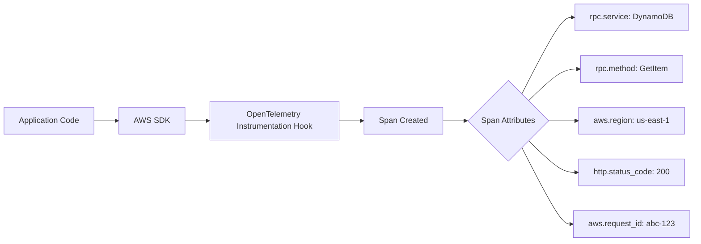
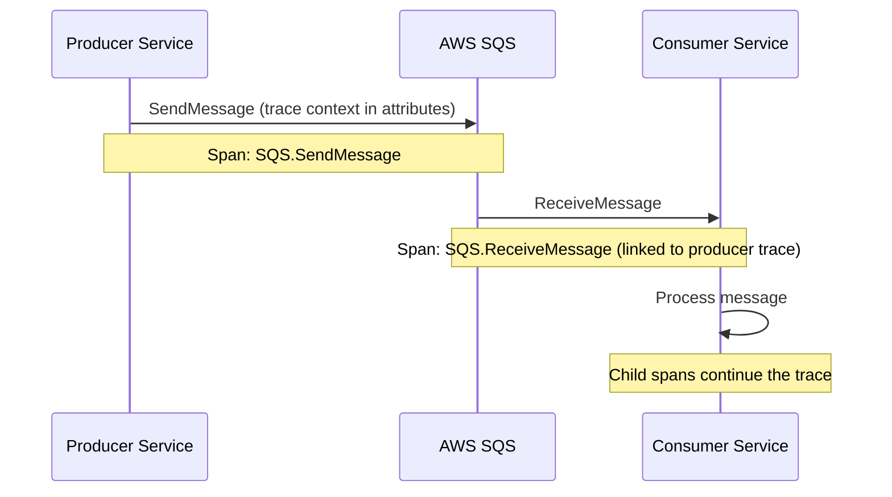
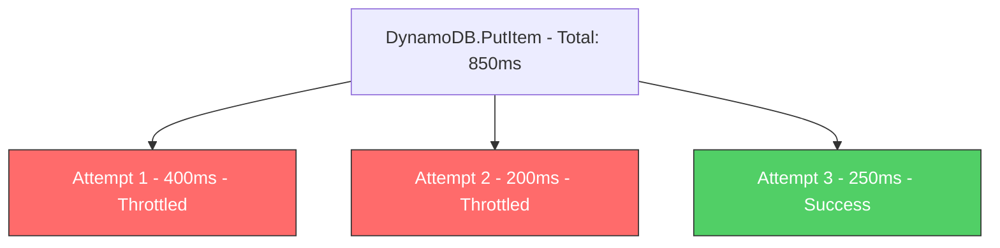

# How to Instrument AWS SDK Calls with OpenTelemetry Auto-Instrumentation

Author: [nawazdhandala](https://www.github.com/nawazdhandala)

Tags: OpenTelemetry, AWS, SDK, Auto-Instrumentation, Python, Node.js, Java, Tracing, Observability

Description: Step-by-step guide to auto-instrumenting AWS SDK calls with OpenTelemetry in Python, Node.js, and Java for full distributed tracing of cloud operations.

---

Every time your application talks to an AWS service, it makes an HTTP API call through the AWS SDK. These calls can fail, time out, or get throttled, and without tracing them, you are left guessing which service call caused a downstream problem. OpenTelemetry auto-instrumentation wraps these SDK calls automatically, creating spans that capture the service, operation, duration, and response status.

This guide walks through setting up auto-instrumentation for AWS SDK calls in Python (boto3), Node.js (AWS SDK v3), and Java (AWS SDK v2). You will not need to modify your business logic. The instrumentation hooks into the SDK layer and captures everything transparently.

## What Gets Captured

When you instrument the AWS SDK, every API call becomes a span in your distributed trace. The span includes several useful attributes that help with debugging and performance analysis.



These attributes let you filter traces by AWS service, operation type, region, and error status. When something breaks, you can quickly find all failing DynamoDB PutItem calls in us-east-1, for instance.

## Python: Instrumenting boto3 and botocore

Python's AWS SDK is built in two layers: botocore (the low-level client) and boto3 (the high-level resource abstraction). The OpenTelemetry instrumentation targets botocore, which means it catches calls from both libraries.

### Installation

Install the OpenTelemetry SDK, the OTLP exporter, and the botocore instrumentation package.

```bash
# Install core OpenTelemetry packages
pip install opentelemetry-api opentelemetry-sdk

# Install the OTLP exporter for sending traces to your backend
pip install opentelemetry-exporter-otlp-proto-grpc

# Install the botocore instrumentation - covers both botocore and boto3
pip install opentelemetry-instrumentation-botocore
```

### Programmatic Setup

You can enable the instrumentation in your application startup code. This approach gives you full control over the tracer provider configuration.

```python
# tracing_setup.py - Configure OpenTelemetry and enable AWS SDK tracing
from opentelemetry import trace
from opentelemetry.sdk.trace import TracerProvider
from opentelemetry.sdk.trace.export import BatchSpanProcessor
from opentelemetry.exporter.otlp.proto.grpc.trace_exporter import OTLPSpanExporter
from opentelemetry.sdk.resources import Resource
from opentelemetry.instrumentation.botocore import BotocoreInstrumentor

# Define service metadata that will appear on all spans
resource = Resource.create({
    "service.name": "my-order-service",
    "service.version": "1.2.0",
    "deployment.environment": "production",
})

# Set up the tracer provider with an OTLP exporter
provider = TracerProvider(resource=resource)
exporter = OTLPSpanExporter(endpoint="https://oneuptime.com/otlp")
provider.add_span_processor(BatchSpanProcessor(exporter))
trace.set_tracer_provider(provider)

# Instrument botocore - this is the only line needed for AWS SDK tracing
BotocoreInstrumentor().instrument()
```

After calling `instrument()`, all boto3 and botocore calls are automatically traced. Here is what that looks like in practice.

```python
# order_service.py - Business logic with automatically traced AWS calls
import boto3

# No tracing code needed here - botocore instrumentation handles it
dynamodb = boto3.resource("dynamodb", region_name="us-east-1")
s3 = boto3.client("s3", region_name="us-east-1")
sqs = boto3.client("sqs", region_name="us-east-1")

def process_order(order_id, order_data):
    # Span: DynamoDB.PutItem
    table = dynamodb.Table("orders")
    table.put_item(Item={
        "order_id": order_id,
        "status": "processing",
        "data": order_data,
    })

    # Span: S3.PutObject
    s3.put_object(
        Bucket="order-receipts",
        Key=f"receipts/{order_id}.json",
        Body=json.dumps(order_data),
    )

    # Span: SQS.SendMessage
    sqs.send_message(
        QueueUrl="https://sqs.us-east-1.amazonaws.com/123456789/fulfillment-queue",
        MessageBody=json.dumps({"order_id": order_id}),
    )
```

Each of those three AWS calls produces a child span under whatever parent span is active. If `process_order` is called from within a Flask or FastAPI request handler (which is also instrumented), you get a complete trace from HTTP request to database write to queue publish.

### Zero-Code Auto-Instrumentation

If you prefer not to add any code at all, use the `opentelemetry-instrument` CLI wrapper.

```bash
# Run your app with auto-instrumentation - no code changes required
# The wrapper detects installed instrumentation packages and enables them
OTEL_SERVICE_NAME=my-order-service \
OTEL_EXPORTER_OTLP_ENDPOINT=https://oneuptime.com/otlp \
opentelemetry-instrument python app.py
```

This approach uses the `opentelemetry-distro` package to automatically discover and enable all installed instrumentation libraries at startup.

## Node.js: Instrumenting AWS SDK v3

The AWS SDK for JavaScript v3 uses a modular architecture where each service is a separate package. The OpenTelemetry instrumentation supports this modular design.

### Installation

```bash
# Install OpenTelemetry core packages for Node.js
npm install @opentelemetry/api \
            @opentelemetry/sdk-node \
            @opentelemetry/exporter-trace-otlp-grpc

# Install the AWS SDK v3 instrumentation
npm install @opentelemetry/instrumentation-aws-sdk
```

### Setup with the Node SDK

Create a tracing initialization file that runs before your application code. The Node SDK makes this straightforward.

```javascript
// tracing.js - Initialize OpenTelemetry with AWS SDK instrumentation
const { NodeSDK } = require("@opentelemetry/sdk-node");
const { OTLPTraceExporter } = require("@opentelemetry/exporter-trace-otlp-grpc");
const { AwsInstrumentation } = require("@opentelemetry/instrumentation-aws-sdk");

// Create and configure the SDK
const sdk = new NodeSDK({
  // Where to send traces
  traceExporter: new OTLPTraceExporter({
    url: "https://oneuptime.com/otlp",
  }),
  // Enable AWS SDK auto-instrumentation
  instrumentations: [
    new AwsInstrumentation({
      suppressInternalInstrumentation: true,  // Avoid duplicate HTTP spans
      sqsExtractContextPropagation: true,     // Propagate trace context through SQS
    }),
  ],
  serviceName: "my-node-service",
});

// Start the SDK before importing your application code
sdk.start();

// Graceful shutdown on process exit
process.on("SIGTERM", () => {
  sdk.shutdown().then(() => process.exit(0));
});
```

Start your application by requiring the tracing file first.

```bash
# Load tracing configuration before the application starts
node --require ./tracing.js app.js
```

Now every AWS SDK v3 call in your application is traced automatically.

```javascript
// app.js - Application code with automatically traced AWS SDK calls
const { DynamoDBClient, PutItemCommand } = require("@aws-sdk/client-dynamodb");
const { S3Client, GetObjectCommand } = require("@aws-sdk/client-s3");

const dynamodb = new DynamoDBClient({ region: "us-east-1" });
const s3 = new S3Client({ region: "us-east-1" });

async function getConfig() {
  // Span: S3.GetObject - automatically created by instrumentation
  const response = await s3.send(new GetObjectCommand({
    Bucket: "config-bucket",
    Key: "app-config.json",
  }));
  return JSON.parse(await response.Body.transformToString());
}

async function saveUser(userId, userData) {
  // Span: DynamoDB.PutItem - automatically created by instrumentation
  await dynamodb.send(new PutItemCommand({
    TableName: "users",
    Item: {
      user_id: { S: userId },
      data: { S: JSON.stringify(userData) },
    },
  }));
}
```

### SQS Context Propagation

A particularly useful feature of the Node.js instrumentation is SQS context propagation. When enabled, the instrumentation injects trace context into SQS message attributes on send and extracts it on receive. This means traces flow across asynchronous queue boundaries.



This is critical for microservices architectures where SQS sits between producers and consumers. Without context propagation, you lose trace continuity at the queue boundary.

## Java: Instrumenting AWS SDK v2

Java has the most mature OpenTelemetry instrumentation ecosystem. For the AWS SDK, you can use the Java agent for fully automatic instrumentation.

### Using the Java Agent

Download the OpenTelemetry Java agent, which includes AWS SDK instrumentation out of the box.

```bash
# Download the OpenTelemetry Java agent (includes AWS SDK instrumentation)
curl -L -o opentelemetry-javaagent.jar \
  https://github.com/open-telemetry/opentelemetry-java-instrumentation/releases/latest/download/opentelemetry-javaagent.jar
```

Attach the agent to your Java application at startup. No code changes needed.

```bash
# Run your Java app with the OpenTelemetry agent attached
# The agent auto-instruments AWS SDK v2 calls, HTTP clients, JDBC, and more
java -javaagent:opentelemetry-javaagent.jar \
  -Dotel.service.name=my-java-service \
  -Dotel.exporter.otlp.endpoint=https://oneuptime.com/otlp \
  -Dotel.instrumentation.aws-sdk.experimental-span-attributes=true \
  -jar my-app.jar
```

The `experimental-span-attributes` flag enables additional span attributes like DynamoDB table names and S3 bucket names, which are extremely useful for debugging.

### Programmatic Setup (Alternative)

If you prefer not to use the Java agent, you can configure instrumentation programmatically.

```java
// TracingConfig.java - Manual OpenTelemetry setup for AWS SDK v2
import io.opentelemetry.api.OpenTelemetry;
import io.opentelemetry.sdk.OpenTelemetrySdk;
import io.opentelemetry.sdk.trace.SdkTracerProvider;
import io.opentelemetry.sdk.trace.export.BatchSpanProcessor;
import io.opentelemetry.exporter.otlp.trace.OtlpGrpcSpanExporter;
import io.opentelemetry.instrumentation.awssdk.v2_2.AwsSdkTelemetry;
import software.amazon.awssdk.core.client.config.ClientOverrideConfiguration;
import software.amazon.awssdk.services.dynamodb.DynamoDbClient;

public class TracingConfig {
    public static DynamoDbClient createTracedDynamoDbClient() {
        // Build the OpenTelemetry SDK
        OtlpGrpcSpanExporter exporter = OtlpGrpcSpanExporter.builder()
            .setEndpoint("https://oneuptime.com/otlp")
            .build();

        SdkTracerProvider tracerProvider = SdkTracerProvider.builder()
            .addSpanProcessor(BatchSpanProcessor.builder(exporter).build())
            .build();

        OpenTelemetry openTelemetry = OpenTelemetrySdk.builder()
            .setTracerProvider(tracerProvider)
            .build();

        // Create AWS SDK telemetry interceptor
        AwsSdkTelemetry awsTelemetry = AwsSdkTelemetry.create(openTelemetry);

        // Build the DynamoDB client with the tracing interceptor
        return DynamoDbClient.builder()
            .overrideConfiguration(ClientOverrideConfiguration.builder()
                .addExecutionInterceptor(awsTelemetry.newExecutionInterceptor())
                .build())
            .build();
    }
}
```

## Span Attributes Reference

Regardless of language, the AWS SDK instrumentation produces spans with a consistent set of attributes following OpenTelemetry semantic conventions.

| Attribute | Example | Description |
|-----------|---------|-------------|
| `rpc.system` | `aws-api` | Identifies this as an AWS API call |
| `rpc.service` | `DynamoDB` | The AWS service being called |
| `rpc.method` | `GetItem` | The specific API operation |
| `aws.region` | `us-east-1` | The AWS region of the request |
| `aws.request_id` | `ABC123...` | The unique request ID from AWS |
| `http.status_code` | `200` | The HTTP response status code |
| `aws.dynamodb.table_names` | `["users"]` | DynamoDB table (when available) |
| `aws.s3.bucket` | `my-bucket` | S3 bucket name (when available) |

## Handling Errors and Retries

The AWS SDK has built-in retry logic. When retries happen, the instrumentation captures them correctly. You will see the overall operation span with child spans for each retry attempt.



This visibility into retries is invaluable. A single DynamoDB call that looks fast in your application logs might actually be retrying three times due to throttling, and the instrumentation makes that visible.

## Summary

Auto-instrumenting AWS SDK calls with OpenTelemetry requires minimal effort and produces high-value traces. Install the right instrumentation package for your language, enable it at startup, and every AWS API call becomes a span in your distributed traces. Combined with the resource attributes that identify the service, operation, and region, you get the visibility needed to debug performance issues and failures across your AWS infrastructure.
