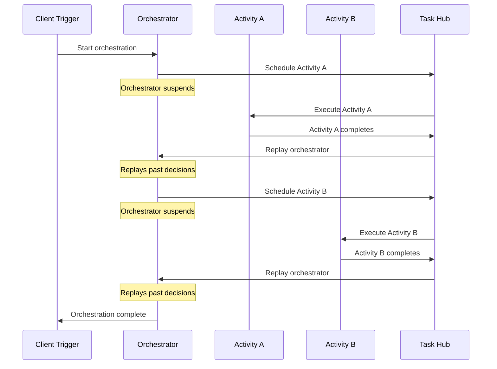

```mermaid
gantt
    title Order Processing Orchestration Trace
    dateFormat X
    axisFormat %s

    section Orchestrator
    orchestration.order-processing : 0, 30

    section Activities
    activity.validate-order : 2, 8
    activity.process-payment : 10, 20
    activity.ship-order : 22, 28
```

# How to Instrument Azure Durable Functions with OpenTelemetry

Author: [nawazdhandala](https://www.github.com/nawazdhandala)

Tags: OpenTelemetry, Azure Functions, Durable Functions, Distributed Tracing, Serverless, .NET

Description: Learn how to add OpenTelemetry tracing to Azure Durable Functions orchestrations, activities, and sub-orchestrations for full workflow visibility.

---

Azure Durable Functions extend the standard Azure Functions model with stateful workflows. An orchestration can coordinate multiple activity functions, wait for external events, and run for hours or even days. This long-running, multi-step nature makes observability critical but also tricky. Standard request-response tracing does not capture the full picture of a workflow that starts, pauses, replays, and resumes across many function invocations.

This post shows you how to instrument Durable Functions with OpenTelemetry so you get complete traces that span entire orchestrations, including activity calls, sub-orchestrations, and timer waits.

## Understanding the Durable Functions Execution Model

Before diving into instrumentation, you need to understand how Durable Functions execute. The orchestrator function does not run once from start to finish. It uses an event-sourcing pattern where the orchestrator replays from the beginning every time an activity completes or an event arrives.



Each replay re-executes the orchestrator code, but the Durable Task Framework intercepts calls to `CallActivityAsync` and returns cached results for activities that already completed. This replay behavior is the main challenge for instrumentation. If you create spans inside the orchestrator, they will be created multiple times during replays, producing duplicate and misleading trace data.

## Setting Up OpenTelemetry in an Azure Functions Project

Start by adding the necessary NuGet packages to your .NET isolated worker project.

```xml
<!-- Add these packages to your .csproj file -->
<ItemGroup>
  <!-- OpenTelemetry core SDK -->
  <PackageReference Include="OpenTelemetry" Version="1.9.0" />
  <!-- OTLP exporter for sending data to collectors -->
  <PackageReference Include="OpenTelemetry.Exporter.OpenTelemetryProtocol" Version="1.9.0" />
  <!-- Azure Functions instrumentation -->
  <PackageReference Include="OpenTelemetry.Extensions.Hosting" Version="1.9.0" />
  <!-- HTTP client instrumentation for outbound calls -->
  <PackageReference Include="OpenTelemetry.Instrumentation.Http" Version="1.9.0" />
</ItemGroup>
```

Configure the OpenTelemetry SDK in your `Program.cs` file.

```csharp
// Program.cs
// Configure OpenTelemetry for the Azure Functions host
using Microsoft.Extensions.DependencyInjection;
using Microsoft.Extensions.Hosting;
using OpenTelemetry.Resources;
using OpenTelemetry.Trace;

var host = new HostBuilder()
    .ConfigureFunctionsWebApplication()
    .ConfigureServices(services =>
    {
        services.AddOpenTelemetry()
            .ConfigureResource(resource =>
            {
                resource.AddService(
                    serviceName: "order-processing-workflow",
                    serviceVersion: "1.0.0"
                );
                // Add Azure-specific resource attributes
                resource.AddAttributes(new Dictionary<string, object>
                {
                    ["cloud.provider"] = "azure",
                    ["cloud.platform"] = "azure_functions",
                });
            })
            .WithTracing(tracing =>
            {
                tracing
                    // Instrument outbound HTTP calls
                    .AddHttpClientInstrumentation()
                    // Add custom activity source for orchestration tracing
                    .AddSource("DurableFunctions.Orchestrations")
                    // Export to an OTLP-compatible backend
                    .AddOtlpExporter(options =>
                    {
                        options.Endpoint = new Uri(
                            Environment.GetEnvironmentVariable("OTEL_EXPORTER_OTLP_ENDPOINT")
                            ?? "http://localhost:4318"
                        );
                    });
            });
    })
    .Build();

host.Run();
```

The `AddSource("DurableFunctions.Orchestrations")` line registers a custom ActivitySource that you will use to create spans for orchestration steps. This gives you control over exactly what gets traced.

## Instrumenting the Orchestrator Function

The orchestrator function needs special handling because of the replay behavior. You should only create spans for actions that are actually being executed, not for replayed decisions.

```csharp
// OrderOrchestrator.cs
// Orchestrator with replay-aware OpenTelemetry instrumentation
using System.Diagnostics;
using Microsoft.Azure.Functions.Worker;
using Microsoft.DurableTask;

public class OrderOrchestrator
{
    // Custom ActivitySource for orchestration spans
    private static readonly ActivitySource OrchestratorSource =
        new("DurableFunctions.Orchestrations");

    [Function("OrderOrchestrator")]
    public async Task<OrderResult> RunOrchestrator(
        [OrchestrationTrigger] TaskOrchestrationContext context)
    {
        var orderId = context.GetInput<string>();

        // Only create spans when NOT replaying
        // During replay, IsReplaying is true and we skip span creation
        using var orchestrationSpan = !context.IsReplaying
            ? OrchestratorSource.StartActivity(
                "orchestration.order-processing",
                ActivityKind.Internal,
                parentContext: default,
                tags: new ActivityTagsCollection
                {
                    ["order.id"] = orderId,
                    ["orchestration.instance_id"] = context.InstanceId,
                })
            : null;

        // Step 1: Validate the order
        var isValid = await context.CallActivityAsync<bool>(
            "ValidateOrder", orderId);

        if (!isValid)
        {
            orchestrationSpan?.SetTag("order.status", "invalid");
            return new OrderResult { Status = "Invalid" };
        }

        // Step 2: Process payment
        var paymentResult = await context.CallActivityAsync<PaymentResult>(
            "ProcessPayment", orderId);

        // Step 3: Ship the order
        var shipmentResult = await context.CallActivityAsync<ShipmentResult>(
            "ShipOrder", orderId);

        orchestrationSpan?.SetTag("order.status", "completed");
        orchestrationSpan?.SetTag("shipment.tracking_id",
            shipmentResult.TrackingId);

        return new OrderResult
        {
            Status = "Completed",
            TrackingId = shipmentResult.TrackingId
        };
    }
}
```

The `context.IsReplaying` check is the key to correct instrumentation. When the orchestrator replays, `IsReplaying` is true, and you skip span creation entirely. This prevents duplicate spans from cluttering your traces. When the orchestrator is executing new logic (not replaying), spans are created normally.

## Instrumenting Activity Functions

Activity functions are simpler to instrument because they run exactly once and do not replay. You can create spans freely.

```csharp
// OrderActivities.cs
// Activity functions with standard OpenTelemetry instrumentation
using System.Diagnostics;
using Microsoft.Azure.Functions.Worker;
using Microsoft.DurableTask;

public class OrderActivities
{
    private static readonly ActivitySource ActivitySource =
        new("DurableFunctions.Orchestrations");

    [Function("ValidateOrder")]
    public async Task<bool> ValidateOrder(
        [ActivityTrigger] string orderId)
    {
        // Create a span for this activity execution
        using var span = ActivitySource.StartActivity(
            "activity.validate-order",
            ActivityKind.Internal);

        span?.SetTag("order.id", orderId);

        // Validate order against inventory and business rules
        var order = await GetOrder(orderId);
        var inventoryAvailable = await CheckInventory(order.Items);

        span?.SetTag("order.item_count", order.Items.Count);
        span?.SetTag("order.inventory_available", inventoryAvailable);

        return inventoryAvailable;
    }

    [Function("ProcessPayment")]
    public async Task<PaymentResult> ProcessPayment(
        [ActivityTrigger] string orderId)
    {
        using var span = ActivitySource.StartActivity(
            "activity.process-payment",
            ActivityKind.Internal);

        span?.SetTag("order.id", orderId);

        try
        {
            // Call payment gateway (HTTP calls are auto-instrumented)
            var result = await paymentGateway.ChargeOrder(orderId);

            span?.SetTag("payment.status", result.Status);
            span?.SetTag("payment.transaction_id", result.TransactionId);

            return result;
        }
        catch (Exception ex)
        {
            // Record the exception on the span
            span?.SetStatus(ActivityStatusCode.Error, ex.Message);
            span?.RecordException(ex);
            throw;
        }
    }

    [Function("ShipOrder")]
    public async Task<ShipmentResult> ShipOrder(
        [ActivityTrigger] string orderId)
    {
        using var span = ActivitySource.StartActivity(
            "activity.ship-order",
            ActivityKind.Internal);

        span?.SetTag("order.id", orderId);

        var result = await shippingService.CreateShipment(orderId);

        span?.SetTag("shipment.carrier", result.Carrier);
        span?.SetTag("shipment.tracking_id", result.TrackingId);

        return result;
    }
}
```

Each activity function creates its own span with relevant business attributes. The `RecordException` method in the payment activity captures error details as span events, which makes it easy to diagnose failures in your trace viewer.

## Linking Orchestration and Activity Spans

One challenge with Durable Functions is that the orchestrator and its activities run in separate function invocations. The trace context is not automatically propagated between them. You need to pass context explicitly.

```csharp
// ContextPropagation.cs
// Propagate trace context from orchestrator to activities
using System.Diagnostics;
using OpenTelemetry;
using OpenTelemetry.Context.Propagation;

public static class TraceContextHelper
{
    private static readonly TextMapPropagator Propagator =
        Propagators.DefaultTextMapPropagator;

    // Serialize the current trace context into a dictionary
    public static Dictionary<string, string> GetCurrentContext()
    {
        var context = new Dictionary<string, string>();

        // Inject the current span context into the carrier
        Propagator.Inject(
            new PropagationContext(
                Activity.Current?.Context ?? default,
                Baggage.Current),
            context,
            (carrier, key, value) => carrier[key] = value);

        return context;
    }

    // Restore trace context from a dictionary
    public static ActivityContext ExtractContext(
        Dictionary<string, string> carrier)
    {
        var context = Propagator.Extract(
            default,
            carrier,
            (c, key) =>
            {
                return c.TryGetValue(key, out var value)
                    ? new[] { value }
                    : Enumerable.Empty<string>();
            });

        return context.ActivityContext;
    }
}
```

Use this helper in your orchestrator to pass context along with activity inputs.

```csharp
// Pass trace context as part of the activity input
var activityInput = new ActivityInput
{
    OrderId = orderId,
    TraceContext = TraceContextHelper.GetCurrentContext()
};

var result = await context.CallActivityAsync<bool>(
    "ValidateOrder", activityInput);
```

Then in the activity, extract the context and use it as the parent for your span.

```csharp
// Extract parent context in the activity function
[Function("ValidateOrder")]
public async Task<bool> ValidateOrder(
    [ActivityTrigger] ActivityInput input)
{
    var parentContext = TraceContextHelper.ExtractContext(
        input.TraceContext);

    // Create a span linked to the orchestrator's trace
    using var span = ActivitySource.StartActivity(
        "activity.validate-order",
        ActivityKind.Internal,
        parentContext);

    span?.SetTag("order.id", input.OrderId);
    // ... rest of the activity logic
}
```

This explicit propagation creates a connected trace that spans the entire orchestration. When you view the trace in your backend, you will see the orchestrator span as the parent with activity spans nested underneath it.

## Instrumenting Sub-Orchestrations

Durable Functions support sub-orchestrations where one orchestrator calls another. The same replay-aware pattern applies, and you need to propagate context across the sub-orchestration boundary.

```csharp
// Sub-orchestration with context propagation
[Function("MainOrchestrator")]
public async Task RunMainOrchestrator(
    [OrchestrationTrigger] TaskOrchestrationContext context)
{
    using var span = !context.IsReplaying
        ? OrchestratorSource.StartActivity("orchestration.main")
        : null;

    // Call a sub-orchestration with trace context
    var subInput = new SubOrchestrationInput
    {
        Data = "some-data",
        TraceContext = !context.IsReplaying
            ? TraceContextHelper.GetCurrentContext()
            : new Dictionary<string, string>()
    };

    // Sub-orchestration runs as a separate orchestration instance
    var result = await context.CallSubOrchestratorAsync<string>(
        "SubOrchestrator", subInput);
}
```

The sub-orchestrator extracts the parent context the same way activities do. This creates a trace tree that accurately represents the nesting of your workflow logic.

## Handling Long-Running Orchestrations

Some orchestrations run for hours or days, waiting for human approval or external events. These long-running workflows present a unique challenge for tracing because most trace backends have limits on span duration.

```csharp
// Long-running orchestration with segmented tracing
[Function("ApprovalOrchestrator")]
public async Task<string> RunApproval(
    [OrchestrationTrigger] TaskOrchestrationContext context)
{
    var input = context.GetInput<ApprovalInput>();

    // Span for the submission phase
    using (var submitSpan = !context.IsReplaying
        ? OrchestratorSource.StartActivity("phase.submit-for-approval")
        : null)
    {
        await context.CallActivityAsync("SendApprovalRequest", input);
        submitSpan?.SetTag("approval.requested_by", input.RequestedBy);
    }

    // Wait for external event (could take days)
    // Do NOT wrap this in a span, as span duration would be extreme
    var approval = await context.WaitForExternalEvent<ApprovalDecision>(
        "ApprovalReceived");

    // Span for the post-approval phase
    using (var processSpan = !context.IsReplaying
        ? OrchestratorSource.StartActivity("phase.process-approval")
        : null)
    {
        processSpan?.SetTag("approval.decision", approval.Decision);
        processSpan?.SetTag("approval.approved_by", approval.ApprovedBy);

        if (approval.Decision == "approved")
        {
            await context.CallActivityAsync("ExecuteApprovedAction", input);
        }
    }

    return approval.Decision;
}
```

By breaking the orchestration into phase-level spans instead of one giant span, you keep individual span durations reasonable and still get visibility into each phase of the workflow. The wait for the external event sits between spans, so it does not inflate any span's duration.

## Viewing the Complete Trace

With all the pieces in place, a complete order processing trace looks like this in your trace viewer:



Each activity appears as a child span of the orchestration, with gaps between them representing the time the orchestrator was suspended and waiting for results. This gives you a clear picture of where time is spent and which activities are bottlenecks.

Instrumenting Azure Durable Functions requires understanding the replay model and working with it rather than against it. The `IsReplaying` check, explicit context propagation, and phase-based span design give you accurate traces that reflect the actual execution flow of your workflows.
