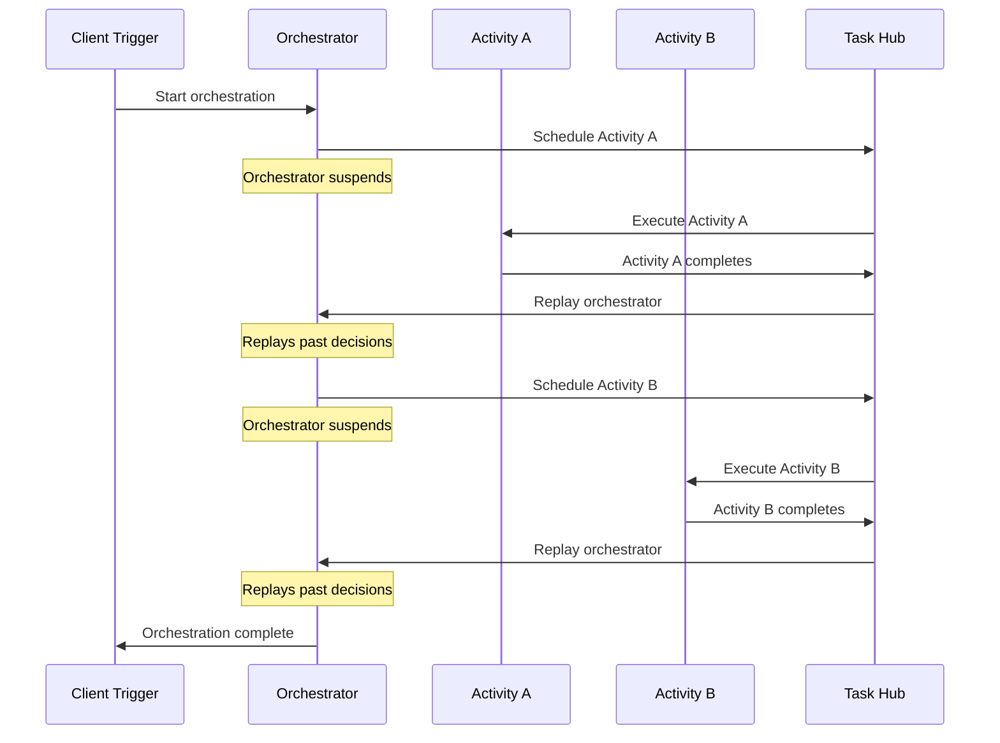

# How to Instrument Azure Durable Functions with OpenTelemetry

Author: [nawazdhandala](https://www.github.com/nawazdhandala)

Tags: OpenTelemetry, Azure Function, Durable Functions, Distributed Tracing, Serverless, .NET

Description: Learn how to add OpenTelemetry tracing to Azure Durable Functions orchestrations, activities, and sub-orchestrations for full workflow visibility.

---

Azure Durable Functions extend the standard Azure Functions model with stateful workflows. An orchestration can coordinate multiple activity functions, wait for external events, and run for hours or even days. This long-running, multi-step nature makes observability critical but also tricky. Standard request-response tracing does not capture the full picture of a workflow that starts, pauses, replays, and resumes across many function invocations.

This post shows you how to enable Durable Functions distributed tracing with OpenTelemetry and how to add custom business spans where they are useful. With Durable Task Scheduler, the Durable Task SDK emits workflow spans for orchestrations, activity calls, sub-orchestrations, and timer waits; custom spans should supplement those workflow spans instead of replacing them.

## Understanding the Durable Functions Execution Model

Before diving into instrumentation, you need to understand how Durable Functions execute. The orchestrator function does not run once from start to finish. It uses an event-sourcing pattern where the orchestrator replays from the beginning every time an activity completes or an event arrives.


```mermaid
sequenceDiagram
    participant Client as Client Trigger
    participant Orch as Orchestrator
    participant Act1 as Activity A
    participant Act2 as Activity B
    participant Store as Task Hub

    Client->>Orch: Start orchestration
    Orch->>Store: Schedule Activity A
    Note over Orch: Orchestrator suspends

    Store->>Act1: Execute Activity A
    Act1->>Store: Activity A completes

    Store->>Orch: Replay orchestrator
    Note over Orch: Replays past decisions
    Orch->>Store: Schedule Activity B
    Note over Orch: Orchestrator suspends

    Store->>Act2: Execute Activity B
    Act2->>Store: Activity B completes

    Store->>Orch: Replay orchestrator
    Note over Orch: Replays past decisions
    Orch->>Client: Orchestration complete
```

Each replay re-executes the orchestrator code, but the Durable Task Framework intercepts calls to `CallActivityAsync` and returns cached results for activities that already completed. This replay behavior is the main challenge for instrumentation. If you create spans inside the orchestrator, they will be created multiple times during replays, producing duplicate and misleading trace data.

## Setting Up OpenTelemetry in an Azure Functions Project

Start by adding the necessary NuGet packages to your .NET isolated worker project.

```xml
<!-- Add these packages to your .csproj file -->
<ItemGroup>
  <!-- OpenTelemetry core SDK -->
  <PackageReference Include="OpenTelemetry" Version="1.15.3" />
  <!-- OTLP exporter for sending data to collectors -->
  <PackageReference Include="OpenTelemetry.Exporter.OpenTelemetryProtocol" Version="1.15.3" />
  <!-- OpenTelemetry hosting extensions -->
  <PackageReference Include="OpenTelemetry.Extensions.Hosting" Version="1.15.3" />
  <!-- Azure Functions isolated worker OpenTelemetry defaults -->
  <PackageReference Include="Microsoft.Azure.Functions.Worker.OpenTelemetry" Version="1.2.0" />
  <!-- HTTP client instrumentation for outbound calls -->
  <PackageReference Include="OpenTelemetry.Instrumentation.Http" Version="1.15.1" />
</ItemGroup>
```

Enable Durable Functions distributed tracing in `host.json`.

```json
{
  "version": "2.0",
  "extensions": {
    "durableTask": {
      "tracing": {
        "DistributedTracingEnabled": true,
        "Version": "V2"
      }
    }
  }
}
```

Configure the OpenTelemetry SDK in your `Program.cs` file.

```csharp
// Program.cs
// Configure OpenTelemetry for the Azure Functions host
using Microsoft.Azure.Functions.Worker.OpenTelemetry;
using Microsoft.Extensions.DependencyInjection;
using Microsoft.Extensions.Hosting;
using OpenTelemetry.Exporter;
using OpenTelemetry.Resources;
using OpenTelemetry.Trace;

var host = new HostBuilder()
    .ConfigureFunctionsWebApplication()
    .ConfigureServices(services =>
    {
        services.AddOpenTelemetry()
            .UseFunctionsWorkerDefaults()
            .ConfigureResource(resource =>
            {
                resource.AddService(
                    serviceName: "order-processing-workflow",
                    serviceVersion: "1.0.0"
                );
                // Add Azure-specific resource attributes
                resource.AddAttributes(new Dictionary<string, object>
                {
                    ["cloud.provider"] = "azure",
                    ["cloud.platform"] = "azure_functions",
                });
            })
            .WithTracing(tracing =>
            {
                tracing
                    // Instrument outbound HTTP calls
                    .AddHttpClientInstrumentation()
                    // Capture spans emitted by the Durable Task SDK
                    .AddSource("Microsoft.DurableTask")
                    // Add custom activity source for business-level spans
                    .AddSource("DurableFunctions.Orchestrations")
                    // Export to an OTLP-compatible backend
                    .AddOtlpExporter(options =>
                    {
                        options.Endpoint = new Uri(
                            Environment.GetEnvironmentVariable("OTEL_EXPORTER_OTLP_ENDPOINT")
                            ?? "http://localhost:4317"
                        );
                        options.Protocol = OtlpExportProtocol.Grpc;
                    });
            });
    })
    .Build();

host.Run();
```

The `AddSource("Microsoft.DurableTask")` line captures the workflow spans emitted by the Durable Task SDK. The `AddSource("DurableFunctions.Orchestrations")` line registers a custom ActivitySource that you can use for additional business-level spans.

## Instrumenting the Orchestrator Function

The orchestrator function needs special handling because of the replay behavior. Let the Durable Task SDK produce the long-lived workflow spans, and only create custom spans for short, replay-aware business annotations.

```csharp
// OrderOrchestrator.cs
// Orchestrator with replay-aware OpenTelemetry instrumentation
using System.Diagnostics;
using Microsoft.Azure.Functions.Worker;
using Microsoft.DurableTask;

public class OrderOrchestrator
{
    // Custom ActivitySource for orchestration spans
    private static readonly ActivitySource OrchestratorSource =
        new("DurableFunctions.Orchestrations");

    [Function("OrderOrchestrator")]
    public async Task<OrderResult> RunOrchestrator(
        [OrchestrationTrigger] TaskOrchestrationContext context)
    {
        var orderId = context.GetInput<string>();

        // Only create short custom spans when NOT replaying.
        // Do not keep custom spans open across durable awaits.
        if (!context.IsReplaying)
        {
            using var startSpan = OrchestratorSource.StartActivity(
                "orchestration.order-processing.started",
                ActivityKind.Internal,
                parentContext: default,
                tags: new ActivityTagsCollection
                {
                    ["order.id"] = orderId,
                    ["orchestration.instance_id"] = context.InstanceId,
                });
        }

        // Step 1: Validate the order
        var isValid = await context.CallActivityAsync<bool>(
            "ValidateOrder", orderId);

        if (!isValid)
        {
            if (!context.IsReplaying)
            {
                using var invalidSpan = OrchestratorSource.StartActivity(
                    "orchestration.order-processing.invalid");
                invalidSpan?.SetTag("order.id", orderId);
                invalidSpan?.SetTag("order.status", "invalid");
            }

            return new OrderResult { Status = "Invalid" };
        }

        // Step 2: Process payment
        var paymentResult = await context.CallActivityAsync<PaymentResult>(
            "ProcessPayment", orderId);

        // Step 3: Ship the order
        var shipmentResult = await context.CallActivityAsync<ShipmentResult>(
            "ShipOrder", orderId);

        if (!context.IsReplaying)
        {
            using var completedSpan = OrchestratorSource.StartActivity(
                "orchestration.order-processing.completed");
            completedSpan?.SetTag("order.id", orderId);
            completedSpan?.SetTag("order.status", "completed");
            completedSpan?.SetTag("shipment.tracking_id",
                shipmentResult.TrackingId);
        }

        return new OrderResult
        {
            Status = "Completed",
            TrackingId = shipmentResult.TrackingId
        };
    }
}
```

The `context.IsReplaying` check is the key to correct custom instrumentation. When the orchestrator replays, `IsReplaying` is true, and you skip custom span creation. This prevents duplicate spans from cluttering your traces. The Durable Task SDK spans registered through `Microsoft.DurableTask` provide the full orchestration, activity, sub-orchestration, and timer trace.

## Instrumenting Activity Functions

Activity functions are simpler to instrument because they do not replay like orchestrators. Durable Task activities have at-least-once execution semantics, so activity logic should still be idempotent, but you do not need an `IsReplaying` guard for spans inside activity functions.

```csharp
// OrderActivities.cs
// Activity functions with standard OpenTelemetry instrumentation
using System.Diagnostics;
using Microsoft.Azure.Functions.Worker;
using Microsoft.DurableTask;
using OpenTelemetry.Trace;

public class OrderActivities
{
    private static readonly ActivitySource ActivitySource =
        new("DurableFunctions.Orchestrations");

    [Function("ValidateOrder")]
    public async Task<bool> ValidateOrder(
        [ActivityTrigger] string orderId)
    {
        // Create a span for this activity execution
        using var span = ActivitySource.StartActivity(
            "activity.validate-order",
            ActivityKind.Internal);

        span?.SetTag("order.id", orderId);

        // Validate order against inventory and business rules
        var order = await GetOrder(orderId);
        var inventoryAvailable = await CheckInventory(order.Items);

        span?.SetTag("order.item_count", order.Items.Count);
        span?.SetTag("order.inventory_available", inventoryAvailable);

        return inventoryAvailable;
    }

    [Function("ProcessPayment")]
    public async Task<PaymentResult> ProcessPayment(
        [ActivityTrigger] string orderId)
    {
        using var span = ActivitySource.StartActivity(
            "activity.process-payment",
            ActivityKind.Internal);

        span?.SetTag("order.id", orderId);

        try
        {
            // Call payment gateway (HTTP calls are auto-instrumented)
            var result = await paymentGateway.ChargeOrder(orderId);

            span?.SetTag("payment.status", result.Status);
            span?.SetTag("payment.transaction_id", result.TransactionId);

            return result;
        }
        catch (Exception ex)
        {
            // Record the exception on the span
            span?.SetStatus(ActivityStatusCode.Error, ex.Message);
            span?.RecordException(ex);
            throw;
        }
    }

    [Function("ShipOrder")]
    public async Task<ShipmentResult> ShipOrder(
        [ActivityTrigger] string orderId)
    {
        using var span = ActivitySource.StartActivity(
            "activity.ship-order",
            ActivityKind.Internal);

        span?.SetTag("order.id", orderId);

        var result = await shippingService.CreateShipment(orderId);

        span?.SetTag("shipment.carrier", result.Carrier);
        span?.SetTag("shipment.tracking_id", result.TrackingId);

        return result;
    }
}
```

Each activity function creates its own span with relevant business attributes. The `RecordException` method in the payment activity captures error details as span events, which makes it easy to diagnose failures in your trace viewer.

## Linking Custom Orchestration and Activity Spans

The Durable Task SDK handles workflow trace context for its own spans when Durable Task Scheduler tracing is enabled. If you add your own custom spans and need a custom activity span to be a child of another custom span, pass that context explicitly as serializable activity input.

```csharp
// ContextPropagation.cs
// Propagate custom trace context from orchestrator to activities
using System.Diagnostics;
using OpenTelemetry;
using OpenTelemetry.Context.Propagation;

public static class TraceContextHelper
{
    private static readonly TextMapPropagator Propagator =
        Propagators.DefaultTextMapPropagator;

    // Serialize the current trace context into a dictionary
    public static Dictionary<string, string> GetCurrentContext()
    {
        var context = new Dictionary<string, string>();

        // Inject the current span context into the carrier
        Propagator.Inject(
            new PropagationContext(
                Activity.Current?.Context ?? default,
                Baggage.Current),
            context,
            (carrier, key, value) => carrier[key] = value);

        return context;
    }

    // Restore trace context from a dictionary
    public static ActivityContext ExtractContext(
        Dictionary<string, string> carrier)
    {
        var context = Propagator.Extract(
            default,
            carrier,
            (c, key) =>
            {
                return c.TryGetValue(key, out var value)
                    ? new[] { value }
                    : Enumerable.Empty<string>();
            });

        return context.ActivityContext;
    }
}
```

Use this helper in your orchestrator to pass a custom span context along with activity inputs.

```csharp
// Pass trace context as part of the activity input
var activityInput = new ActivityInput
{
    OrderId = orderId,
    TraceContext = TraceContextHelper.GetCurrentContext()
};

var result = await context.CallActivityAsync<bool>(
    "ValidateOrder", activityInput);
```

Then in the activity, extract the context and use it as the parent for your span.

```csharp
// Extract parent context in the activity function
[Function("ValidateOrder")]
public async Task<bool> ValidateOrder(
    [ActivityTrigger] ActivityInput input)
{
    var parentContext = TraceContextHelper.ExtractContext(
        input.TraceContext);

    // Create a span linked to the orchestrator's trace
    using var span = ActivitySource.StartActivity(
        "activity.validate-order",
        ActivityKind.Internal,
        parentContext);

    span?.SetTag("order.id", input.OrderId);
    // ... rest of the activity logic
}
```

This explicit propagation connects your custom spans. The Durable Task SDK spans still provide the full workflow trace for the orchestration, activities, sub-orchestrations, and timers.

## Instrumenting Sub-Orchestrations

Durable Functions support sub-orchestrations where one orchestrator calls another. The same replay-aware pattern applies for custom spans, and you can propagate custom context across the sub-orchestration boundary when you need custom parent-child relationships.

```csharp
// Sub-orchestration with context propagation
[Function("MainOrchestrator")]
public async Task RunMainOrchestrator(
    [OrchestrationTrigger] TaskOrchestrationContext context)
{
    using var span = !context.IsReplaying
        ? OrchestratorSource.StartActivity("orchestration.main")
        : null;

    // Call a sub-orchestration with trace context
    var subInput = new SubOrchestrationInput
    {
        Data = "some-data",
        TraceContext = !context.IsReplaying
            ? TraceContextHelper.GetCurrentContext()
            : new Dictionary<string, string>()
    };

    // Sub-orchestration runs as a separate orchestration instance
    var result = await context.CallSubOrchestratorAsync<string>(
        "SubOrchestrator", subInput);
}
```

The sub-orchestrator extracts the parent context the same way activities do. The Durable Task SDK spans represent the workflow nesting, while this custom context keeps any additional business spans connected.

## Handling Long-Running Orchestrations

Some orchestrations run for hours or days, waiting for human approval or external events. The Durable Task SDK can show this workflow shape, but custom spans around business phases should stay short because many trace backends are easier to use when individual spans represent bounded work.

```csharp
// Long-running orchestration with segmented tracing
[Function("ApprovalOrchestrator")]
public async Task<string> RunApproval(
    [OrchestrationTrigger] TaskOrchestrationContext context)
{
    var input = context.GetInput<ApprovalInput>();

    // Custom marker for the submission phase
    if (!context.IsReplaying)
    {
        using var submitSpan =
            OrchestratorSource.StartActivity("phase.submit-for-approval");
        submitSpan?.SetTag("approval.requested_by", input.RequestedBy);
    }

    await context.CallActivityAsync("SendApprovalRequest", input);

    // Wait for external event (could take days).
    // Do NOT wrap this in a custom business span, as span duration would be extreme.
    var approval = await context.WaitForExternalEvent<ApprovalDecision>(
        "ApprovalReceived");

    // Custom marker for the post-approval phase
    if (!context.IsReplaying)
    {
        using var processSpan =
            OrchestratorSource.StartActivity("phase.process-approval");
        processSpan?.SetTag("approval.decision", approval.Decision);
        processSpan?.SetTag("approval.approved_by", approval.ApprovedBy);
    }

    if (approval.Decision == "approved")
    {
        await context.CallActivityAsync("ExecuteApprovedAction", input);
    }

    return approval.Decision;
}
```

By breaking custom instrumentation into phase markers instead of one giant span, you keep individual custom span durations reasonable and still get visibility into each phase of the workflow. The wait for the external event sits between custom spans, so it does not inflate any custom span's duration.

## Viewing the Complete Trace

With Durable Task workflow spans and your custom business spans in place, a complete order processing trace looks like this in your trace viewer:


```mermaid
gantt
    title Order Processing Orchestration Trace
    dateFormat X
    axisFormat %s

    section Orchestrator
    orchestration.order-processing : 0, 30

    section Activities
    activity.validate-order : 2, 8
    activity.process-payment : 10, 20
    activity.ship-order : 22, 28
```

Each Durable Task activity span appears under the orchestration span, with gaps between them representing the time the orchestrator was suspended and waiting for results. This gives you a clear picture of where time is spent and which activities are bottlenecks.

Instrumenting Azure Durable Functions requires understanding the replay model and working with it rather than against it. The Durable Task SDK workflow spans, the `IsReplaying` check for custom spans, explicit context propagation for custom parent-child relationships, and phase-based span design give you accurate traces that reflect the actual execution flow of your workflows.
