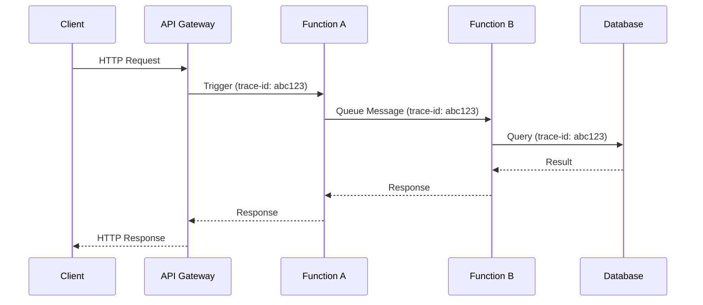

# How to Instrument Azure Functions with OpenTelemetry

Author: [nawazdhandala](https://www.github.com/nawazdhandala)

Tags: OpenTelemetry, Azure Functions, Serverless, Observability, Azure, Tracing, .NET, Python, Node.js

Description: Learn how to add OpenTelemetry instrumentation to Azure Functions for distributed tracing, metrics, and logs across your serverless workloads.

---

> Serverless functions are notoriously hard to observe. They spin up, execute, and disappear, often in under a second. OpenTelemetry brings structure to this chaos by providing consistent tracing, metrics, and logging across your Azure Functions.

Azure Functions support several languages, and the approach to OpenTelemetry instrumentation varies by runtime. This guide covers Python, Node.js, and .NET, with practical examples you can drop into your projects today.

---

## Why Instrument Serverless Functions?

When a request flows through multiple Azure Functions, API gateways, and backend services, it can be difficult to pinpoint where things slow down or break. OpenTelemetry distributed tracing links all these operations together with a single trace ID. You get:

- End-to-end visibility across function invocations
- Latency breakdowns for each function and its dependencies
- Error tracking with full context about what went wrong
- Correlation between function triggers (HTTP, queue, timer) and downstream calls



The trace ID propagates through every hop, so you can see the entire request lifecycle in a single trace view.

---

## Prerequisites

- An Azure account with an active subscription
- Azure Functions Core Tools v4+
- Your preferred language runtime (Python 3.9+, Node.js 18+, or .NET 8)
- An OpenTelemetry-compatible backend (Azure Monitor, OneUptime, Jaeger, etc.)

---

## Instrumenting Azure Functions in Python

Python Azure Functions use the v2 programming model, which supports decorators for defining triggers. Here is how to add OpenTelemetry instrumentation.

### Install Dependencies

```bash
# Install OpenTelemetry SDK and OTLP exporter
# The azure-functions package should already be in your requirements
pip install opentelemetry-api \
            opentelemetry-sdk \
            opentelemetry-exporter-otlp-proto-grpc \
            opentelemetry-instrumentation-requests \
            opentelemetry-instrumentation-urllib3
```

### Configure the Tracer

Create a shared telemetry configuration that initializes once when the function host starts. This avoids reinitializing the SDK on every invocation.

```python
# telemetry.py
# Shared OpenTelemetry configuration for Azure Functions

import os
from opentelemetry import trace
from opentelemetry.sdk.trace import TracerProvider
from opentelemetry.sdk.trace.export import BatchSpanProcessor
from opentelemetry.exporter.otlp.proto.grpc.trace_exporter import OTLPSpanExporter
from opentelemetry.sdk.resources import Resource

def configure_telemetry():
    """Initialize OpenTelemetry once for the function app."""
    resource = Resource.create({
        "service.name": os.environ.get("OTEL_SERVICE_NAME", "azure-functions-app"),
        "service.version": "1.0.0",
        "deployment.environment": os.environ.get("AZURE_FUNCTIONS_ENVIRONMENT", "development"),
    })

    # Create a tracer provider with the service resource metadata
    provider = TracerProvider(resource=resource)

    # Use the OTLP exporter to send spans to your backend
    otlp_exporter = OTLPSpanExporter(
        endpoint=os.environ.get("OTEL_EXPORTER_OTLP_ENDPOINT", "http://localhost:4317"),
    )

    # BatchSpanProcessor batches spans and sends them periodically
    # This is more efficient than sending each span individually
    provider.add_span_processor(BatchSpanProcessor(otlp_exporter))

    # Set this as the global tracer provider
    trace.set_tracer_provider(provider)

    return trace.get_tracer(__name__)
```

### Instrument a Function

Now use the tracer in your function code. The key thing is to call `configure_telemetry()` at module level so it runs once during cold start.

```python
# function_app.py
# Azure Functions v2 app with OpenTelemetry tracing

import azure.functions as func
import json
from telemetry import configure_telemetry

# Initialize telemetry at module level (runs once on cold start)
tracer = configure_telemetry()

app = func.FunctionApp()

@app.route(route="orders", methods=["POST"])
def create_order(req: func.HttpRequest) -> func.HttpResponse:
    """HTTP-triggered function that creates an order."""

    # Start a span for the entire function execution
    with tracer.start_as_current_span("create-order") as span:
        try:
            # Parse the request body
            body = req.get_json()
            order_id = body.get("order_id")

            # Add attributes that help with debugging
            span.set_attribute("order.id", order_id)
            span.set_attribute("order.item_count", len(body.get("items", [])))

            # Process the order (your business logic here)
            result = process_order(body)

            span.set_attribute("order.status", "created")
            return func.HttpResponse(
                json.dumps({"status": "created", "order_id": order_id}),
                status_code=201,
                mimetype="application/json",
            )

        except Exception as e:
            # Record the exception on the span for error tracking
            span.set_status(trace.StatusCode.ERROR, str(e))
            span.record_exception(e)
            return func.HttpResponse(
                json.dumps({"error": str(e)}),
                status_code=500,
                mimetype="application/json",
            )


def process_order(order_data):
    """Simulate order processing with a child span."""
    with tracer.start_as_current_span("process-order-items") as span:
        items = order_data.get("items", [])
        span.set_attribute("items.count", len(items))
        # Your actual order processing logic goes here
        return {"processed": True}
```

### Local Settings

Add the OpenTelemetry configuration to your `local.settings.json` for local development.

```json
{
  "IsEncrypted": false,
  "Values": {
    "AzureWebJobsStorage": "UseDevelopmentStorage=true",
    "FUNCTIONS_WORKER_RUNTIME": "python",
    "OTEL_SERVICE_NAME": "order-functions",
    "OTEL_EXPORTER_OTLP_ENDPOINT": "http://localhost:4317"
  }
}
```

---

## Instrumenting Azure Functions in Node.js

The Node.js approach uses the OpenTelemetry SDK with a setup file that runs before the function host loads your code.

### Install Dependencies

```bash
# Install OpenTelemetry packages for Node.js functions
npm install @opentelemetry/sdk-node \
            @opentelemetry/sdk-trace-node \
            @opentelemetry/exporter-trace-otlp-grpc \
            @opentelemetry/instrumentation-http \
            @opentelemetry/resources \
            @opentelemetry/semantic-conventions
```

### Tracer Setup

Create the telemetry configuration file. In the v4 Node.js programming model, you can use the `main` field in package.json to load this before your functions.

```javascript
// src/telemetry.js
// OpenTelemetry setup for Azure Functions (Node.js)

const { NodeSDK } = require("@opentelemetry/sdk-node");
const { OTLPTraceExporter } = require("@opentelemetry/exporter-trace-otlp-grpc");
const { HttpInstrumentation } = require("@opentelemetry/instrumentation-http");
const { Resource } = require("@opentelemetry/resources");
const { ATTR_SERVICE_NAME, ATTR_SERVICE_VERSION } = require("@opentelemetry/semantic-conventions");

// Create the SDK with OTLP export
const sdk = new NodeSDK({
    resource: new Resource({
        [ATTR_SERVICE_NAME]: process.env.OTEL_SERVICE_NAME || "azure-func-node",
        [ATTR_SERVICE_VERSION]: "1.0.0",
    }),
    traceExporter: new OTLPTraceExporter({
        url: process.env.OTEL_EXPORTER_OTLP_ENDPOINT || "http://localhost:4317",
    }),
    // Auto-instrument outgoing HTTP calls made by your functions
    instrumentations: [new HttpInstrumentation()],
});

sdk.start();

// Ensure telemetry is flushed when the function host shuts down
process.on("SIGTERM", async () => {
    await sdk.shutdown();
});

module.exports = sdk;
```

### Instrumented Function

```javascript
// src/functions/processOrder.js
// HTTP-triggered Azure Function with custom spans

const { app } = require("@azure/functions");
const { trace } = require("@opentelemetry/api");

// Get a tracer instance for this module
const tracer = trace.getTracer("order-functions");

app.http("processOrder", {
    methods: ["POST"],
    route: "orders",
    handler: async (request, context) => {
        // Create a span for the function execution
        return tracer.startActiveSpan("process-order", async (span) => {
            try {
                const body = await request.json();

                // Add useful attributes for filtering and debugging
                span.setAttribute("order.id", body.orderId);
                span.setAttribute("trigger.type", "http");

                // Simulate calling a downstream service
                const result = await processItems(body.items);

                span.setAttribute("order.status", "completed");
                span.end();

                return {
                    status: 201,
                    jsonBody: { status: "created", orderId: body.orderId },
                };
            } catch (error) {
                span.setStatus({ code: 2, message: error.message }); // ERROR status
                span.recordException(error);
                span.end();

                return {
                    status: 500,
                    jsonBody: { error: error.message },
                };
            }
        });
    },
});

async function processItems(items) {
    // Create a child span for the processing step
    return tracer.startActiveSpan("process-items", async (span) => {
        span.setAttribute("items.count", items?.length || 0);
        // Your item processing logic
        span.end();
        return { processed: true };
    });
}
```

---

## Instrumenting Azure Functions in .NET

.NET Azure Functions have built-in support for OpenTelemetry through dependency injection.

### Install NuGet Packages

```bash
# Install OpenTelemetry packages for .NET Functions
dotnet add package OpenTelemetry
dotnet add package OpenTelemetry.Extensions.Hosting
dotnet add package OpenTelemetry.Exporter.OpenTelemetryProtocol
dotnet add package OpenTelemetry.Instrumentation.Http
dotnet add package OpenTelemetry.Instrumentation.AspNetCore
```

### Configure in Program.cs

The .NET isolated worker model lets you configure OpenTelemetry in the host builder, just like a regular ASP.NET Core application.

```csharp
// Program.cs
// Configure OpenTelemetry for .NET Azure Functions (isolated worker)

using Microsoft.Extensions.Hosting;
using Microsoft.Extensions.DependencyInjection;
using OpenTelemetry.Resources;
using OpenTelemetry.Trace;
using OpenTelemetry.Metrics;

var host = new HostBuilder()
    .ConfigureFunctionsWorkerDefaults()
    .ConfigureServices(services =>
    {
        // Add OpenTelemetry tracing with OTLP export
        services.AddOpenTelemetry()
            .ConfigureResource(resource =>
            {
                resource.AddService(
                    serviceName: "order-functions-dotnet",
                    serviceVersion: "1.0.0"
                );
            })
            .WithTracing(tracing =>
            {
                tracing
                    .AddAspNetCoreInstrumentation()  // Trace incoming HTTP triggers
                    .AddHttpClientInstrumentation()    // Trace outgoing HTTP calls
                    .AddSource("OrderFunctions")       // Listen for custom activity sources
                    .AddOtlpExporter(options =>
                    {
                        // Send traces to your OTLP-compatible backend
                        options.Endpoint = new Uri(
                            Environment.GetEnvironmentVariable("OTEL_EXPORTER_OTLP_ENDPOINT")
                            ?? "http://localhost:4317"
                        );
                    });
            })
            .WithMetrics(metrics =>
            {
                metrics
                    .AddAspNetCoreInstrumentation()
                    .AddHttpClientInstrumentation()
                    .AddOtlpExporter();
            });
    })
    .Build();

host.Run();
```

---

## Handling Cold Starts

Cold starts are a reality of serverless platforms. When a new function instance spins up, the OpenTelemetry SDK needs to initialize. There are a few things you can do to minimize the impact:

- **Initialize at module level**: Do not create a new tracer provider per invocation. The examples above all initialize once.
- **Use BatchSpanProcessor**: This batches and sends spans asynchronously, so it does not add latency to function execution.
- **Keep dependencies minimal**: Only install the instrumentation libraries you actually need. Each library adds to cold start time.

---

## Environment Variables for Azure Functions

When deploying to Azure, set these application settings in your Function App configuration.

```bash
# Set OpenTelemetry environment variables in Azure
az functionapp config appsettings set \
  --name your-function-app \
  --resource-group your-resource-group \
  --settings \
    OTEL_SERVICE_NAME="order-functions" \
    OTEL_EXPORTER_OTLP_ENDPOINT="https://your-collector-endpoint:4317" \
    OTEL_EXPORTER_OTLP_HEADERS="Authorization=Bearer your-token"
```

---

## Summary

Instrumenting Azure Functions with OpenTelemetry gives you the same distributed tracing capabilities that you get with long-running services. The pattern is the same across languages: initialize the SDK once, create spans around your business logic, and export to an OTLP-compatible backend. The biggest thing to remember is to handle initialization carefully so you do not pay the cost on every invocation. With traces flowing, debugging serverless applications becomes a lot less painful.
