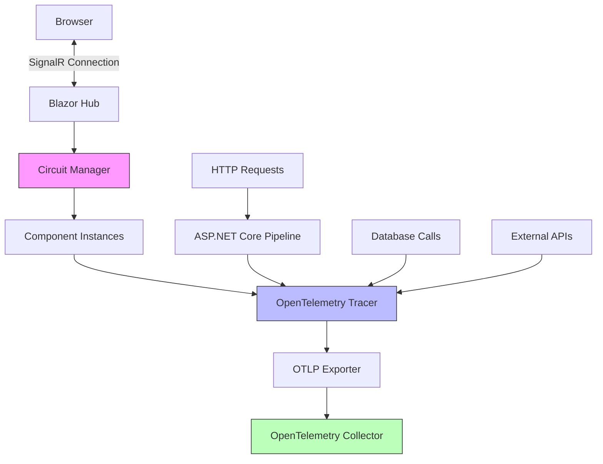

# How to Instrument Blazor Server Applications with OpenTelemetry

Author: [nawazdhandala](https://www.github.com/nawazdhandala)

Tags: OpenTelemetry, Blazor Server, .NET, SignalR, Tracing, C#

Description: Complete guide to instrumenting Blazor Server applications with OpenTelemetry, including SignalR connection tracking, component lifecycle tracing, and circuit monitoring.

Blazor Server applications operate through a persistent SignalR connection between the browser and server, maintaining stateful circuits for each user session. This architecture creates unique observability requirements that differ from both traditional web applications and Blazor WebAssembly. Understanding how to trace SignalR connections, monitor circuit health, and instrument component interactions is essential for maintaining reliable Blazor Server applications.

## Understanding Blazor Server Architecture

Blazor Server maintains a live connection to the server using SignalR over WebSockets or long polling. Each user session creates a circuit, which is a server-side container for component state and event handling. When users interact with the UI, events are sent to the server over SignalR, processed in the circuit, and UI updates are sent back to the browser.

This architecture means most of your application logic executes on the server, making traditional server-side instrumentation highly effective. However, you also need visibility into SignalR connection health, circuit lifecycle, and the interaction between the browser and server.

## Architecture and Data Flow



## Installing Dependencies

Start by adding the OpenTelemetry packages and instrumentation libraries for ASP.NET Core, SignalR, and other dependencies.

```bash
# Core OpenTelemetry packages
dotnet add package OpenTelemetry
dotnet add package OpenTelemetry.Extensions.Hosting

# Instrumentation libraries
dotnet add package OpenTelemetry.Instrumentation.AspNetCore
dotnet add package OpenTelemetry.Instrumentation.Http
dotnet add package OpenTelemetry.Instrumentation.SqlClient

# Exporters
dotnet add package OpenTelemetry.Exporter.OpenTelemetryProtocol
dotnet add package OpenTelemetry.Exporter.Console
```

## Basic OpenTelemetry Configuration

Configure OpenTelemetry in your Program.cs file. Blazor Server apps benefit from comprehensive instrumentation across the entire ASP.NET Core pipeline.

```csharp
using OpenTelemetry;
using OpenTelemetry.Resources;
using OpenTelemetry.Trace;
using OpenTelemetry.Metrics;

var builder = WebApplication.CreateBuilder(args);

// Add Blazor Server services
builder.Services.AddRazorPages();
builder.Services.AddServerSideBlazor();

// Configure OpenTelemetry
builder.Services.AddOpenTelemetry()
    .ConfigureResource(resource => resource
        .AddService(
            serviceName: "blazor-server-app",
            serviceVersion: typeof(Program).Assembly.GetName().Version?.ToString() ?? "1.0.0")
        .AddAttributes(new Dictionary<string, object>
        {
            ["deployment.environment"] = builder.Environment.EnvironmentName,
            ["host.name"] = Environment.MachineName
        }))
    .WithTracing(tracing => tracing
        // Instrument ASP.NET Core request pipeline
        .AddAspNetCoreInstrumentation(options =>
        {
            // Enrich spans with additional request data
            options.EnrichWithHttpRequest = (activity, request) =>
            {
                activity.SetTag("http.request.path", request.Path);
                activity.SetTag("http.request.query", request.QueryString.ToString());
            };

            // Enrich with response data
            options.EnrichWithHttpResponse = (activity, response) =>
            {
                activity.SetTag("http.response.status_code", response.StatusCode);
            };

            // Filter out health check endpoints
            options.Filter = (context) =>
            {
                return !context.Request.Path.StartsWithSegments("/health");
            };
        })
        // Instrument outgoing HTTP calls
        .AddHttpClientInstrumentation(options =>
        {
            options.FilterHttpRequestMessage = (request) =>
            {
                return !request.RequestUri?.AbsolutePath.Contains("/telemetry") ?? true;
            };
        })
        // Instrument SQL Client
        .AddSqlClientInstrumentation(options =>
        {
            options.SetDbStatementForText = true;
            options.EnableConnectionLevelAttributes = true;
            options.RecordException = true;
        })
        // Add custom activity sources for Blazor components
        .AddSource("BlazorServerApp.Components")
        .AddSource("BlazorServerApp.Circuits")
        // Export to OTLP collector
        .AddOtlpExporter(options =>
        {
            options.Endpoint = new Uri(
                builder.Configuration["OpenTelemetry:Endpoint"] ?? "http://localhost:4317");
            options.Protocol = OpenTelemetry.Exporter.OtlpExportProtocol.Grpc;
        }))
    .WithMetrics(metrics => metrics
        .AddAspNetCoreInstrumentation()
        .AddHttpClientInstrumentation()
        .AddRuntimeInstrumentation()
        .AddOtlpExporter());

var app = builder.Build();

// Configure middleware pipeline
if (!app.Environment.IsDevelopment())
{
    app.UseExceptionHandler("/Error");
    app.UseHsts();
}

app.UseHttpsRedirection();
app.UseStaticFiles();
app.UseRouting();

app.MapBlazorHub();
app.MapFallbackToPage("/_Host");

app.Run();
```

## Instrumenting SignalR Connections

SignalR connections are the lifeline of Blazor Server applications. Create a custom hub filter to trace connection lifecycle and message flow.

```csharp
using System.Diagnostics;
using Microsoft.AspNetCore.SignalR;

namespace BlazorServerApp.Telemetry;

public class OpenTelemetryHubFilter : IHubFilter
{
    private static readonly ActivitySource ActivitySource = new(
        "BlazorServerApp.SignalR",
        "1.0.0");

    public async ValueTask<object?> InvokeMethodAsync(
        HubInvocationContext invocationContext,
        Func<HubInvocationContext, ValueTask<object?>> next)
    {
        // Create a span for each hub method invocation
        using var activity = ActivitySource.StartActivity(
            $"SignalR.{invocationContext.HubMethodName}",
            ActivityKind.Server);

        activity?.SetTag("signalr.hub", invocationContext.Hub.GetType().Name);
        activity?.SetTag("signalr.method", invocationContext.HubMethodName);
        activity?.SetTag("signalr.connection_id", invocationContext.Context.ConnectionId);
        activity?.SetTag("signalr.user", invocationContext.Context.User?.Identity?.Name ?? "anonymous");

        try
        {
            var result = await next(invocationContext);
            activity?.SetStatus(ActivityStatusCode.Ok);
            return result;
        }
        catch (Exception ex)
        {
            activity?.SetStatus(ActivityStatusCode.Error, ex.Message);
            activity?.RecordException(ex);
            throw;
        }
    }

    public async Task OnConnectedAsync(
        HubLifetimeContext context,
        Func<HubLifetimeContext, Task> next)
    {
        using var activity = ActivitySource.StartActivity(
            "SignalR.Connected",
            ActivityKind.Server);

        activity?.SetTag("signalr.connection_id", context.Context.ConnectionId);
        activity?.SetTag("signalr.user", context.Context.User?.Identity?.Name ?? "anonymous");
        activity?.SetTag("signalr.transport", context.Context.Features.Get<IHttpTransportFeature>()?.TransportType.ToString());

        await next(context);
    }

    public async Task OnDisconnectedAsync(
        HubLifetimeContext context,
        Exception? exception,
        Func<HubLifetimeContext, Exception?, Task> next)
    {
        using var activity = ActivitySource.StartActivity(
            "SignalR.Disconnected",
            ActivityKind.Server);

        activity?.SetTag("signalr.connection_id", context.Context.ConnectionId);
        activity?.SetTag("signalr.user", context.Context.User?.Identity?.Name ?? "anonymous");

        if (exception != null)
        {
            activity?.SetStatus(ActivityStatusCode.Error, exception.Message);
            activity?.RecordException(exception);
        }

        await next(context, exception);
    }
}
```

Register the hub filter in Program.cs:

```csharp
builder.Services.AddServerSideBlazor()
    .AddHubOptions(options =>
    {
        options.AddFilter<OpenTelemetryHubFilter>();
    });
```

## Tracking Circuit Lifecycle

Circuits are fundamental to Blazor Server's operation. Monitor circuit creation, disposal, and errors with a circuit handler.

```csharp
using System.Diagnostics;
using Microsoft.AspNetCore.Components.Server.Circuits;

namespace BlazorServerApp.Telemetry;

public class OpenTelemetryCircuitHandler : CircuitHandler
{
    private static readonly ActivitySource ActivitySource = new(
        "BlazorServerApp.Circuits",
        "1.0.0");

    private readonly Dictionary<string, Activity?> _circuitActivities = new();
    private readonly ILogger<OpenTelemetryCircuitHandler> _logger;

    public OpenTelemetryCircuitHandler(ILogger<OpenTelemetryCircuitHandler> logger)
    {
        _logger = logger;
    }

    public override Task OnCircuitOpenedAsync(Circuit circuit, CancellationToken cancellationToken)
    {
        // Create a long-running activity for the circuit lifetime
        var activity = ActivitySource.StartActivity(
            "Circuit.Lifetime",
            ActivityKind.Server);

        activity?.SetTag("circuit.id", circuit.Id);
        activity?.AddEvent(new ActivityEvent("Circuit opened"));

        _circuitActivities[circuit.Id] = activity;

        _logger.LogInformation("Circuit {CircuitId} opened", circuit.Id);

        return Task.CompletedTask;
    }

    public override Task OnConnectionUpAsync(Circuit circuit, CancellationToken cancellationToken)
    {
        if (_circuitActivities.TryGetValue(circuit.Id, out var activity))
        {
            activity?.AddEvent(new ActivityEvent("Connection established"));
        }

        _logger.LogInformation("Circuit {CircuitId} connection up", circuit.Id);

        return Task.CompletedTask;
    }

    public override Task OnConnectionDownAsync(Circuit circuit, CancellationToken cancellationToken)
    {
        if (_circuitActivities.TryGetValue(circuit.Id, out var activity))
        {
            activity?.AddEvent(new ActivityEvent("Connection lost"));
        }

        _logger.LogWarning("Circuit {CircuitId} connection down", circuit.Id);

        return Task.CompletedTask;
    }

    public override Task OnCircuitClosedAsync(Circuit circuit, CancellationToken cancellationToken)
    {
        if (_circuitActivities.TryGetValue(circuit.Id, out var activity))
        {
            activity?.AddEvent(new ActivityEvent("Circuit closed"));
            activity?.SetStatus(ActivityStatusCode.Ok);
            activity?.Dispose();
            _circuitActivities.Remove(circuit.Id);
        }

        _logger.LogInformation("Circuit {CircuitId} closed", circuit.Id);

        return Task.CompletedTask;
    }

    public override Func<CircuitInboundActivityContext, Task> CreateInboundActivityHandler(
        Func<CircuitInboundActivityContext, Task> next)
    {
        return async context =>
        {
            // Trace each inbound activity (UI event from browser)
            using var activity = ActivitySource.StartActivity(
                "Circuit.InboundActivity",
                ActivityKind.Server);

            activity?.SetTag("circuit.id", context.Circuit.Id);

            try
            {
                await next(context);
                activity?.SetStatus(ActivityStatusCode.Ok);
            }
            catch (Exception ex)
            {
                activity?.SetStatus(ActivityStatusCode.Error, ex.Message);
                activity?.RecordException(ex);
                throw;
            }
        };
    }
}
```

Register the circuit handler:

```csharp
builder.Services.AddScoped<CircuitHandler, OpenTelemetryCircuitHandler>();
```

## Creating a Component Instrumentation Service

Build a service to instrument Blazor component lifecycle events and custom operations.

```csharp
using System.Diagnostics;

namespace BlazorServerApp.Services;

public interface IComponentTracingService
{
    Activity? StartComponentActivity(string componentName, string operation);
    void RecordComponentEvent(string eventName, Dictionary<string, object>? attributes = null);
    void RecordException(Exception exception);
}

public class ComponentTracingService : IComponentTracingService
{
    private static readonly ActivitySource ActivitySource = new(
        "BlazorServerApp.Components",
        "1.0.0");

    public Activity? StartComponentActivity(string componentName, string operation)
    {
        var activity = ActivitySource.StartActivity(
            $"Component.{componentName}.{operation}",
            ActivityKind.Internal);

        activity?.SetTag("component.name", componentName);
        activity?.SetTag("component.operation", operation);

        return activity;
    }

    public void RecordComponentEvent(string eventName, Dictionary<string, object>? attributes = null)
    {
        var activity = Activity.Current;
        if (activity != null)
        {
            var tags = attributes != null
                ? new ActivityTagsCollection(attributes)
                : null;
            activity.AddEvent(new ActivityEvent(eventName, tags: tags));
        }
    }

    public void RecordException(Exception exception)
    {
        var activity = Activity.Current;
        if (activity != null)
        {
            activity.SetStatus(ActivityStatusCode.Error, exception.Message);
            activity.RecordException(exception);
        }
    }
}
```

Register the service:

```csharp
builder.Services.AddScoped<IComponentTracingService, ComponentTracingService>();
```

## Instrumenting Blazor Components

Now instrument your Blazor components to trace initialization, data loading, and user interactions.

```csharp
@page "/fetchdata"
@using System.Diagnostics
@inject WeatherForecastService ForecastService
@inject IComponentTracingService TracingService

<PageTitle>Weather forecast</PageTitle>

<h1>Weather forecast</h1>

<p>This component demonstrates fetching data from a service.</p>

@if (forecasts == null)
{
    <p><em>Loading...</em></p>
}
else
{
    <table class="table">
        <thead>
            <tr>
                <th>Date</th>
                <th>Temp. (C)</th>
                <th>Temp. (F)</th>
                <th>Summary</th>
            </tr>
        </thead>
        <tbody>
            @foreach (var forecast in forecasts)
            {
                <tr>
                    <td>@forecast.Date.ToShortDateString()</td>
                    <td>@forecast.TemperatureC</td>
                    <td>@forecast.TemperatureF</td>
                    <td>@forecast.Summary</td>
                </tr>
            }
        </tbody>
    </table>

    <button class="btn btn-primary" @onclick="RefreshData">Refresh</button>
}

@code {
    private WeatherForecast[]? forecasts;

    protected override async Task OnInitializedAsync()
    {
        // Trace component initialization
        using var activity = TracingService.StartComponentActivity(
            "FetchData",
            "Initialize");

        try
        {
            TracingService.RecordComponentEvent("Loading weather data");

            forecasts = await ForecastService.GetForecastAsync(DateTime.Now);

            activity?.SetTag("forecast.count", forecasts.Length);
            TracingService.RecordComponentEvent("Weather data loaded", new Dictionary<string, object>
            {
                ["record_count"] = forecasts.Length
            });
        }
        catch (Exception ex)
        {
            TracingService.RecordException(ex);
            throw;
        }
    }

    private async Task RefreshData()
    {
        // Trace user-initiated refresh
        using var activity = TracingService.StartComponentActivity(
            "FetchData",
            "Refresh");

        activity?.SetTag("trigger", "user_action");

        try
        {
            TracingService.RecordComponentEvent("User requested refresh");

            forecasts = null;
            StateHasChanged(); // Show loading indicator

            await Task.Delay(500); // Simulate network delay
            forecasts = await ForecastService.GetForecastAsync(DateTime.Now);

            activity?.SetTag("forecast.count", forecasts.Length);
            TracingService.RecordComponentEvent("Data refreshed successfully");
        }
        catch (Exception ex)
        {
            TracingService.RecordException(ex);
            throw;
        }
    }

    public class WeatherForecast
    {
        public DateTime Date { get; set; }
        public int TemperatureC { get; set; }
        public int TemperatureF => 32 + (int)(TemperatureC / 0.5556);
        public string? Summary { get; set; }
    }
}
```

## Instrumenting Services

Services called by components should also be instrumented to provide end-to-end visibility.

```csharp
using System.Diagnostics;

namespace BlazorServerApp.Data;

public class WeatherForecastService
{
    private static readonly ActivitySource ActivitySource = new(
        "BlazorServerApp.Services",
        "1.0.0");

    private static readonly string[] Summaries = new[]
    {
        "Freezing", "Bracing", "Chilly", "Cool", "Mild",
        "Warm", "Balmy", "Hot", "Sweltering", "Scorching"
    };

    public async Task<WeatherForecast[]> GetForecastAsync(DateTime startDate)
    {
        // Create a span for the service operation
        using var activity = ActivitySource.StartActivity(
            "WeatherForecastService.GetForecast",
            ActivityKind.Internal);

        activity?.SetTag("service.name", "WeatherForecastService");
        activity?.SetTag("service.method", "GetForecastAsync");
        activity?.SetTag("start_date", startDate.ToString("yyyy-MM-dd"));

        try
        {
            // Simulate async data fetch
            await Task.Delay(Random.Shared.Next(100, 300));

            var forecasts = Enumerable.Range(1, 5).Select(index => new WeatherForecast
            {
                Date = startDate.AddDays(index),
                TemperatureC = Random.Shared.Next(-20, 55),
                Summary = Summaries[Random.Shared.Next(Summaries.Length)]
            }).ToArray();

            activity?.SetTag("forecast.count", forecasts.Length);

            return forecasts;
        }
        catch (Exception ex)
        {
            activity?.SetStatus(ActivityStatusCode.Error, ex.Message);
            activity?.RecordException(ex);
            throw;
        }
    }
}
```

## Monitoring Circuit Health with Metrics

In addition to tracing, collect metrics about circuit health and performance.

```csharp
using System.Diagnostics.Metrics;
using Microsoft.AspNetCore.Components.Server.Circuits;

namespace BlazorServerApp.Telemetry;

public class CircuitMetricsHandler : CircuitHandler
{
    private static readonly Meter Meter = new("BlazorServerApp.Circuits", "1.0.0");
    private static readonly Counter<long> CircuitOpenedCounter = Meter.CreateCounter<long>("circuit.opened");
    private static readonly Counter<long> CircuitClosedCounter = Meter.CreateCounter<long>("circuit.closed");
    private static readonly Counter<long> ConnectionDownCounter = Meter.CreateCounter<long>("circuit.connection_down");
    private static readonly UpDownCounter<long> ActiveCircuits = Meter.CreateUpDownCounter<long>("circuit.active");

    public override Task OnCircuitOpenedAsync(Circuit circuit, CancellationToken cancellationToken)
    {
        CircuitOpenedCounter.Add(1);
        ActiveCircuits.Add(1);
        return Task.CompletedTask;
    }

    public override Task OnCircuitClosedAsync(Circuit circuit, CancellationToken cancellationToken)
    {
        CircuitClosedCounter.Add(1);
        ActiveCircuits.Add(-1);
        return Task.CompletedTask;
    }

    public override Task OnConnectionDownAsync(Circuit circuit, CancellationToken cancellationToken)
    {
        ConnectionDownCounter.Add(1);
        return Task.CompletedTask;
    }
}
```

Register the metrics handler:

```csharp
builder.Services.AddScoped<CircuitHandler, CircuitMetricsHandler>();
```

## Best Practices for Blazor Server Observability

Always instrument both the component layer and service layer. This provides visibility into the complete request flow from UI event to data access.

Use circuit handlers to understand user session behavior. Track circuit lifetime, connection stability, and the number of active circuits to identify scaling issues.

Be mindful of activity disposal in components. Blazor Server components can have complex lifecycles with multiple renders. Always use `using` statements or ensure activities are properly disposed.

Monitor SignalR connection health separately from HTTP requests. Connection drops and reconnections can indicate network issues or server overload that won't appear in HTTP logs.

Instrumenting Blazor Server applications with OpenTelemetry provides comprehensive visibility into the unique aspects of the SignalR-based architecture. By tracing circuits, connections, and component interactions alongside traditional HTTP and database calls, you gain the insights needed to maintain reliable, performant applications for your users.
