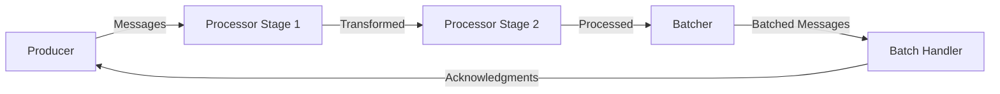
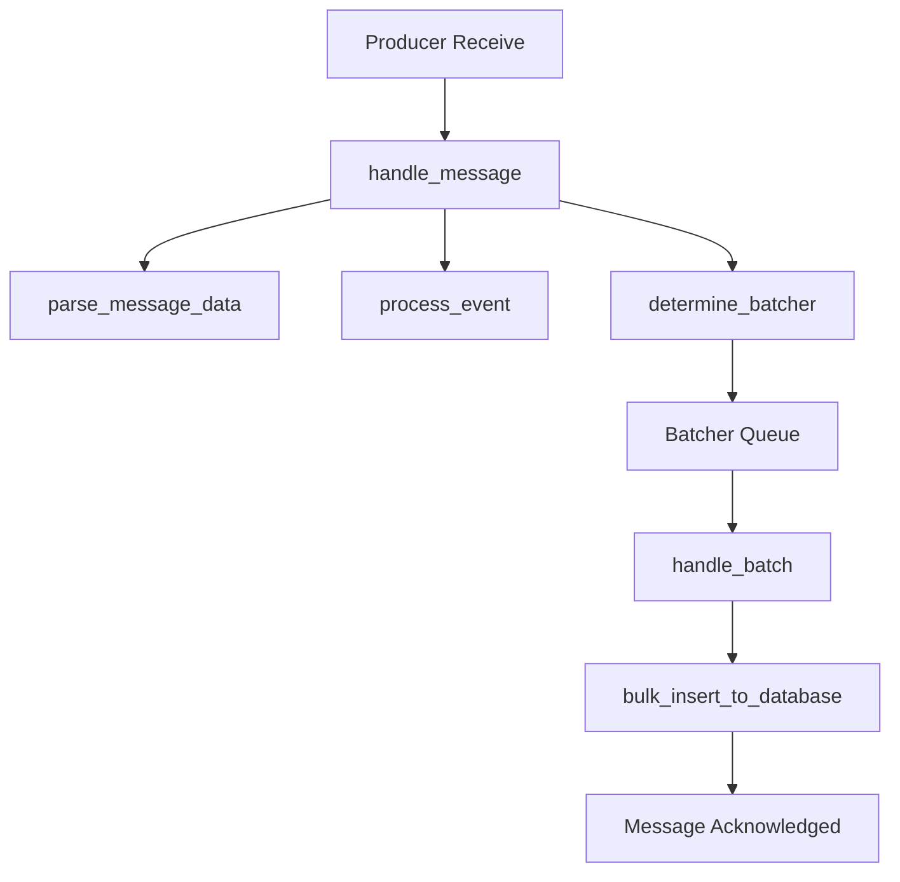

# How to Instrument Broadway Message Processing with OpenTelemetry in Elixir

Author: [nawazdhandala](https://www.github.com/nawazdhandala)

Tags: OpenTelemetry, Elixir, Broadway, Message Processing, Streaming

Description: Instrument Broadway pipelines with OpenTelemetry to trace message processing from ingestion through acknowledgment in your Elixir applications.

Broadway provides a powerful framework for building concurrent, multi-stage data processing pipelines in Elixir. Whether you're consuming messages from RabbitMQ, AWS SQS, or Kafka, understanding how messages flow through your pipeline is crucial for maintaining reliability and performance. OpenTelemetry instrumentation gives you visibility into processing times, batch behaviors, and error patterns across Broadway stages.

## Understanding Broadway Architecture

Broadway pipelines consist of several components that work together to process messages efficiently:



The producer pulls messages from your data source, processors transform them through multiple stages, batchers group messages for efficient bulk operations, and batch handlers execute the final processing. Each component operates concurrently with configurable parallelism. Tracing this architecture requires capturing spans at each stage and linking them together.

## Setting Up Broadway with OpenTelemetry

Start by adding Broadway and OpenTelemetry dependencies:

```elixir
defp deps do
  [
    {:broadway, "~> 1.0"},
    {:broadway_rabbitmq, "~> 0.7"},  # or your producer of choice
    {:opentelemetry, "~> 1.3"},
    {:opentelemetry_api, "~> 1.2"},
    {:opentelemetry_exporter, "~> 1.6"}
  ]
end
```

Configure OpenTelemetry in your application:

```elixir
# config/config.exs
import Config

config :opentelemetry, :resource,
  service: [
    name: "message-processor",
    version: "1.0.0"
  ]

config :opentelemetry_exporter,
  otlp_protocol: :http_protobuf,
  otlp_endpoint: "http://localhost:4318"
```

## Creating an Instrumented Broadway Pipeline

Build a Broadway pipeline with integrated tracing:

```elixir
defmodule MyApp.MessageProcessor do
  use Broadway
  require OpenTelemetry.Tracer, as: Tracer
  alias Broadway.Message
  alias OpenTelemetry.Ctx

  def start_link(_opts) do
    Broadway.start_link(__MODULE__,
      name: __MODULE__,
      producer: [
        module: {BroadwayRabbitMQ.Producer,
          queue: "events",
          connection: [
            host: "localhost",
            username: "guest",
            password: "guest"
          ],
          qos: [
            prefetch_count: 50
          ]
        },
        concurrency: 2
      ],
      processors: [
        default: [
          concurrency: 10,
          min_demand: 5,
          max_demand: 10
        ]
      ],
      batchers: [
        database: [
          concurrency: 5,
          batch_size: 100,
          batch_timeout: 2000
        ],
        notifications: [
          concurrency: 3,
          batch_size: 50,
          batch_timeout: 1000
        ]
      ]
    )
  end

  @impl true
  def handle_message(:default, message, _context) do
    # Extract trace context from message metadata
    parent_ctx = extract_trace_context(message)
    Ctx.attach(parent_ctx)

    # Create a span for processing this message
    Tracer.with_span "broadway.handle_message" do
      Tracer.set_attributes([
        {"message_id", message.acknowledger.ack_ref},
        {"processor", "default"},
        {"queue", "events"}
      ])

      try do
        # Parse and validate the message
        data = parse_message_data(message.data)

        Tracer.add_event("message_parsed", %{
          event_type: data["event_type"],
          size_bytes: byte_size(message.data)
        })

        # Process based on event type
        processed = process_event(data)

        # Route to appropriate batcher
        batcher = determine_batcher(data["event_type"])

        Tracer.set_attributes([
          {"event_type", data["event_type"]},
          {"batcher", batcher},
          {"processing_successful", true}
        ])

        Tracer.set_status(:ok)

        # Store trace context in message metadata for later stages
        message
        |> Message.update_data(fn _ -> processed end)
        |> Message.put_batcher(batcher)
        |> attach_trace_context()

      rescue
        error ->
          Tracer.set_status(:error, Exception.message(error))
          Tracer.record_exception(error, __STACKTRACE__)

          # Failed messages can be sent to a dead letter queue
          Message.failed(message, error)
      end
    end
  end

  @impl true
  def handle_batch(:database, messages, _batch_info, _context) do
    # Create a span for the entire batch operation
    Tracer.with_span "broadway.handle_batch.database" do
      Tracer.set_attributes([
        {"batch_size", length(messages)},
        {"batcher", "database"}
      ])

      # Extract trace contexts from messages to link them
      parent_contexts = Enum.map(messages, &extract_message_context/1)
      link_parent_traces(parent_contexts)

      try do
        # Process all messages in the batch
        results = bulk_insert_to_database(messages)

        Tracer.add_event("batch_processed", %{
          success_count: count_successful(results),
          failure_count: count_failed(results)
        })

        # Mark individual messages as successful or failed
        messages_with_results = Enum.zip(messages, results)

        marked_messages = Enum.map(messages_with_results, fn
          {message, {:ok, _}} ->
            message

          {message, {:error, reason}} ->
            Message.failed(message, reason)
        end)

        Tracer.set_status(:ok)
        marked_messages

      rescue
        error ->
          Tracer.set_status(:error, Exception.message(error))
          Tracer.record_exception(error, __STACKTRACE__)

          # Mark entire batch as failed
          Enum.map(messages, &Message.failed(&1, error))
      end
    end
  end

  @impl true
  def handle_batch(:notifications, messages, _batch_info, _context) do
    Tracer.with_span "broadway.handle_batch.notifications" do
      Tracer.set_attributes([
        {"batch_size", length(messages)},
        {"batcher", "notifications"}
      ])

      parent_contexts = Enum.map(messages, &extract_message_context/1)
      link_parent_traces(parent_contexts)

      try do
        # Send notifications in parallel
        tasks = Enum.map(messages, fn message ->
          Task.async(fn ->
            send_notification(message.data)
          end)
        end)

        # Wait for all notifications with timeout
        results = Task.await_many(tasks, 5000)

        Tracer.add_event("notifications_sent", %{
          count: length(messages)
        })

        Tracer.set_status(:ok)
        messages

      rescue
        error ->
          Tracer.set_status(:error, Exception.message(error))
          Tracer.record_exception(error, __STACKTRACE__)
          Enum.map(messages, &Message.failed(&1, error))
      end
    end
  end

  # Helper functions for trace context management

  defp extract_trace_context(message) do
    # Extract W3C Trace Context from message metadata
    case message.metadata[:trace_context] do
      nil ->
        # No parent context, create new one
        Ctx.new()

      context_map ->
        # Restore context from metadata
        headers = Map.to_list(context_map)
        :otel_propagator_text_map.extract(headers)
    end
  end

  defp attach_trace_context(message) do
    # Serialize current trace context into message metadata
    headers = []
    injected_headers = :otel_propagator_text_map.inject(headers)
    context_map = Map.new(injected_headers)

    Message.put_metadata(message, :trace_context, context_map)
  end

  defp extract_message_context(message) do
    case message.metadata[:trace_context] do
      nil -> nil
      context_map ->
        headers = Map.to_list(context_map)
        :otel_propagator_text_map.extract(headers)
    end
  end

  defp link_parent_traces(contexts) do
    # Create links to all parent spans in the batch
    valid_contexts = Enum.reject(contexts, &is_nil/1)

    Enum.each(valid_contexts, fn ctx ->
      case :otel_tracer.current_span_ctx(ctx) do
        :undefined -> :ok
        span_ctx -> Tracer.add_link(span_ctx)
      end
    end)
  end

  # Business logic helpers

  defp parse_message_data(data) do
    Jason.decode!(data)
  end

  defp process_event(data) do
    # Transform and enrich the event data
    data
    |> Map.put("processed_at", DateTime.utc_now())
    |> Map.put("processor_version", "1.0.0")
  end

  defp determine_batcher(event_type) do
    case event_type do
      type when type in ["user.created", "user.updated"] -> :database
      type when type in ["email.requested", "sms.requested"] -> :notifications
      _ -> :database
    end
  end

  defp bulk_insert_to_database(messages) do
    # Simulate database insertion
    Enum.map(messages, fn message ->
      {:ok, message.data}
    end)
  end

  defp send_notification(data) do
    # Simulate notification sending
    Process.sleep(10)
    {:ok, data}
  end

  defp count_successful(results) do
    Enum.count(results, fn
      {:ok, _} -> true
      _ -> false
    end)
  end

  defp count_failed(results) do
    Enum.count(results, fn
      {:error, _} -> true
      _ -> false
    end)
  end
end
```

## Tracing Message Lifecycle

A complete trace for a message moving through Broadway looks like this:



The trace connects all these operations, showing exactly how long each stage took and where failures occurred.

## Advanced: Instrumenting Custom Processors

For complex pipelines with custom processing stages, create reusable instrumentation:

```elixir
defmodule MyApp.InstrumentedProcessor do
  @moduledoc """
  Wrapper for Broadway processors with automatic OpenTelemetry instrumentation.
  """

  require OpenTelemetry.Tracer, as: Tracer
  alias Broadway.Message
  alias OpenTelemetry.Ctx

  def instrument(processor_name, message, processor_fn) do
    # Extract and attach trace context
    parent_ctx = extract_trace_context(message)
    Ctx.attach(parent_ctx)

    # Create span for this processing stage
    Tracer.with_span "broadway.processor.#{processor_name}" do
      Tracer.set_attributes([
        {"processor_name", processor_name},
        {"message_id", inspect(message.acknowledger.ack_ref)}
      ])

      start_time = System.monotonic_time(:millisecond)

      try do
        result = processor_fn.(message)

        duration = System.monotonic_time(:millisecond) - start_time

        Tracer.set_attributes([
          {"processing_duration_ms", duration},
          {"success", true}
        ])

        Tracer.set_status(:ok)

        # Attach updated trace context to result
        attach_trace_context(result)

      rescue
        error ->
          duration = System.monotonic_time(:millisecond) - start_time

          Tracer.set_attributes([
            {"processing_duration_ms", duration},
            {"success", false},
            {"error_type", error.__struct__}
          ])

          Tracer.set_status(:error, Exception.message(error))
          Tracer.record_exception(error, __STACKTRACE__)

          Message.failed(message, error)
      end
    end
  end

  defp extract_trace_context(message) do
    case message.metadata[:trace_context] do
      nil -> Ctx.new()
      context_map ->
        headers = Map.to_list(context_map)
        :otel_propagator_text_map.extract(headers)
    end
  end

  defp attach_trace_context(message) do
    headers = []
    injected_headers = :otel_propagator_text_map.inject(headers)
    context_map = Map.new(injected_headers)

    Message.put_metadata(message, :trace_context, context_map)
  end
end
```

Use the instrumented processor in your pipeline:

```elixir
defmodule MyApp.EnrichedProcessor do
  use Broadway
  alias MyApp.InstrumentedProcessor

  @impl true
  def handle_message(:default, message, _context) do
    message
    |> InstrumentedProcessor.instrument("validation", &validate_message/1)
    |> InstrumentedProcessor.instrument("enrichment", &enrich_message/1)
    |> InstrumentedProcessor.instrument("transformation", &transform_message/1)
  end

  defp validate_message(message) do
    # Validation logic
    message
  end

  defp enrich_message(message) do
    # Enrichment logic
    message
  end

  defp transform_message(message) do
    # Transformation logic
    message
  end
end
```

## Monitoring Pipeline Performance

Track Broadway pipeline metrics with custom telemetry:

```elixir
defmodule MyApp.BroadwayMetrics do
  require Logger

  def attach_handlers do
    events = [
      [:broadway, :processor, :message, :start],
      [:broadway, :processor, :message, :stop],
      [:broadway, :processor, :message, :exception],
      [:broadway, :batcher, :batch, :start],
      [:broadway, :batcher, :batch, :stop]
    ]

    :telemetry.attach_many(
      "broadway-otel-metrics",
      events,
      &handle_event/4,
      nil
    )
  end

  def handle_event(
        [:broadway, :processor, :message, :stop],
        %{duration: duration},
        %{processor_key: processor, name: pipeline},
        _config
      ) do
    duration_ms = System.convert_time_unit(duration, :native, :millisecond)

    # Record processing time
    :telemetry.execute(
      [:my_app, :broadway, :message_processed],
      %{duration: duration_ms},
      %{pipeline: pipeline, processor: processor}
    )
  end

  def handle_event(
        [:broadway, :processor, :message, :exception],
        %{duration: duration},
        %{processor_key: processor, name: pipeline, kind: kind, reason: reason},
        _config
      ) do
    Logger.error(
      "Broadway message processing failed in #{pipeline}/#{processor}: #{kind} - #{inspect(reason)}"
    )

    # Record error
    :telemetry.execute(
      [:my_app, :broadway, :message_failed],
      %{count: 1},
      %{pipeline: pipeline, processor: processor, kind: kind}
    )
  end

  def handle_event(
        [:broadway, :batcher, :batch, :stop],
        %{duration: duration},
        %{batcher_key: batcher, name: pipeline, batch_size: size},
        _config
      ) do
    duration_ms = System.convert_time_unit(duration, :native, :millisecond)

    Logger.debug(
      "Broadway batch processed: #{pipeline}/#{batcher} (#{size} messages in #{duration_ms}ms)"
    )

    # Record batch metrics
    :telemetry.execute(
      [:my_app, :broadway, :batch_processed],
      %{duration: duration_ms, size: size},
      %{pipeline: pipeline, batcher: batcher}
    )
  end
end
```

## Handling Failed Messages

Trace failed message handling and retry logic:

```elixir
defmodule MyApp.FailureHandler do
  require OpenTelemetry.Tracer, as: Tracer
  alias Broadway.Message

  def handle_failed_message(message, reason) do
    Tracer.with_span "broadway.failure_handler" do
      Tracer.set_attributes([
        {"message_id", inspect(message.acknowledger.ack_ref)},
        {"failure_reason", inspect(reason)},
        {"retry_count", get_retry_count(message)}
      ])

      retry_count = get_retry_count(message)
      max_retries = 3

      cond do
        retry_count < max_retries ->
          Tracer.add_event("message_requeued", %{
            retry_count: retry_count + 1
          })

          # Requeue with incremented retry count
          message
          |> increment_retry_count()
          |> requeue_message()

        true ->
          Tracer.add_event("message_sent_to_dlq", %{
            retry_count: retry_count
          })

          # Send to dead letter queue
          send_to_dead_letter_queue(message, reason)
      end

      Tracer.set_status(:ok)
    end
  end

  defp get_retry_count(message) do
    Map.get(message.metadata, :retry_count, 0)
  end

  defp increment_retry_count(message) do
    current = get_retry_count(message)
    Message.put_metadata(message, :retry_count, current + 1)
  end

  defp requeue_message(message) do
    # Implementation depends on your message broker
    :ok
  end

  defp send_to_dead_letter_queue(message, reason) do
    # Send failed message to DLQ with trace context preserved
    Tracer.with_span "broadway.send_to_dlq" do
      Tracer.set_attributes([
        {"reason", inspect(reason)},
        {"original_message_id", inspect(message.acknowledger.ack_ref)}
      ])

      # DLQ implementation
      :ok
    end
  end
end
```

## Testing Broadway Pipelines with Tracing

Write tests that verify trace propagation:

```elixir
defmodule MyApp.MessageProcessorTest do
  use ExUnit.Case
  require OpenTelemetry.Tracer, as: Tracer
  alias OpenTelemetry.Ctx

  test "propagates trace context through pipeline" do
    # Start a test trace
    Tracer.with_span "test.broadway_message" do
      test_trace_id = get_current_trace_id()

      # Create a message with trace context
      message = create_test_message(%{
        "event_type" => "user.created",
        "user_id" => "123"
      })

      # Send through Broadway pipeline
      Broadway.test_message(MyApp.MessageProcessor, message)

      # Wait for processing
      Process.sleep(1000)

      # Verify spans were created with correct parent
      spans = fetch_spans_by_trace_id(test_trace_id)

      assert length(spans) > 0
      assert Enum.any?(spans, fn span ->
        span.name == "broadway.handle_message"
      end)
    end
  end

  defp create_test_message(data) do
    # Capture current trace context
    headers = []
    injected = :otel_propagator_text_map.inject(headers)
    context = Map.new(injected)

    %Broadway.Message{
      data: Jason.encode!(data),
      acknowledger: {Broadway.NoopAcknowledger, nil, nil},
      metadata: %{trace_context: context}
    }
  end

  defp get_current_trace_id do
    ctx = Ctx.get_current()
    # Extract trace ID from context
    :test_trace_id
  end

  defp fetch_spans_by_trace_id(_trace_id) do
    # Query your tracing backend
    []
  end
end
```

## Performance Considerations

Broadway processes high message volumes, so instrumentation overhead matters:

```elixir
defmodule MyApp.SampledProcessor do
  use Broadway
  require OpenTelemetry.Tracer, as: Tracer

  @sample_rate 0.1  # Trace 10% of messages

  @impl true
  def handle_message(:default, message, _context) do
    if should_trace?(message) do
      trace_message_processing(message)
    else
      process_message_without_tracing(message)
    end
  end

  defp should_trace?(message) do
    # Sample based on trace context decision or random sampling
    case message.metadata[:trace_context] do
      nil -> :rand.uniform() < @sample_rate
      context_map ->
        # Honor upstream sampling decision
        sampled = Map.get(context_map, "tracestate", "")
        String.contains?(sampled, "sampled=true")
    end
  end

  defp trace_message_processing(message) do
    Tracer.with_span "broadway.handle_message" do
      process_message(message)
    end
  end

  defp process_message_without_tracing(message) do
    process_message(message)
  end

  defp process_message(message) do
    # Actual processing logic
    message
  end
end
```

Instrumenting Broadway pipelines with OpenTelemetry provides comprehensive visibility into your message processing infrastructure. You can track message latency, identify bottlenecks in specific processing stages, and debug failures with complete context. This observability is essential for maintaining reliable, high-performance data pipelines in production Elixir applications.
