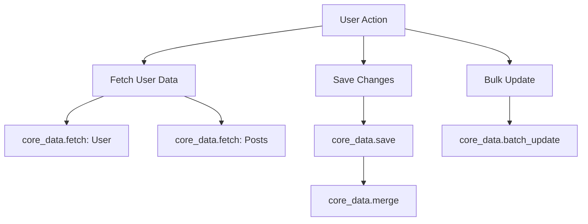

# How to Instrument Core Data Operations with OpenTelemetry in Swift

Author: [nawazdhandala](https://www.github.com/nawazdhandala)

Tags: OpenTelemetry, Swift, Core Data, iOS, Database, Tracing

Description: Learn how to instrument Core Data operations in Swift with OpenTelemetry to track database performance, identify slow queries, and understand data access patterns in your iOS applications.

Core Data is the primary persistence framework for iOS and macOS applications, but tracking its performance can be challenging without proper instrumentation. OpenTelemetry provides a standardized way to capture detailed traces of Core Data operations, helping you identify bottlenecks and optimize database interactions.

## Why Instrument Core Data with OpenTelemetry

Core Data operations can significantly impact your app's performance. Fetch requests, save operations, and batch updates all interact with SQLite under the hood, and inefficient queries can lead to UI freezes and poor user experience. By instrumenting these operations with OpenTelemetry, you gain visibility into:

- Fetch request execution times and result counts
- Save operation duration and affected object counts
- Batch operation performance
- Context merge times
- Faulting behavior and relationship traversal

This visibility allows you to identify performance issues before they affect users and validate optimizations with real data.

## Setting Up OpenTelemetry in Your Swift Project

First, add the OpenTelemetry Swift SDK to your project. You can use Swift Package Manager by adding the dependency to your Package.swift or through Xcode.

```swift
// Package.swift dependencies
dependencies: [
    .package(url: "https://github.com/open-telemetry/opentelemetry-swift", from: "1.0.0")
]
```

Create a tracer provider configuration that will handle span creation and export. This example uses the OTLP exporter to send traces to your observability backend.

```swift
import OpenTelemetryApi
import OpenTelemetrySdk
import StdoutExporter
import ResourceExtension

class TelemetryManager {
    static let shared = TelemetryManager()
    private var tracerProvider: TracerProviderSdk!
    private(set) var tracer: Tracer!

    private init() {
        setupTelemetry()
    }

    func setupTelemetry() {
        // Configure resource attributes for your app
        let resource = Resource(attributes: [
            ResourceAttributes.serviceName.rawValue: AttributeValue.string("MyiOSApp"),
            ResourceAttributes.serviceVersion.rawValue: AttributeValue.string("1.0.0"),
            "deployment.environment": AttributeValue.string("production")
        ])

        // Create span processor and exporter
        let spanExporter = StdoutExporter()
        let spanProcessor = SimpleSpanProcessor(spanExporter: spanExporter)

        // Initialize tracer provider
        tracerProvider = TracerProviderBuilder()
            .add(spanProcessor: spanProcessor)
            .with(resource: resource)
            .build()

        // Get tracer instance
        tracer = tracerProvider.get(instrumentationName: "coredata", instrumentationVersion: "1.0.0")
    }
}
```

## Creating a Core Data Wrapper with Instrumentation

The most effective approach is to create a wrapper around your Core Data stack that automatically instruments all operations. This ensures consistent tracing without modifying every data access point in your app.

```swift
import CoreData
import OpenTelemetryApi

class InstrumentedCoreDataStack {
    private let tracer: Tracer
    private let persistentContainer: NSPersistentContainer

    init(containerName: String, tracer: Tracer) {
        self.tracer = tracer
        self.persistentContainer = NSPersistentContainer(name: containerName)
        self.persistentContainer.loadPersistentStores { description, error in
            if let error = error {
                fatalError("Failed to load Core Data stack: \(error)")
            }
        }
    }

    var viewContext: NSManagedObjectContext {
        return persistentContainer.viewContext
    }

    // Create a background context for async operations
    func newBackgroundContext() -> NSManagedObjectContext {
        return persistentContainer.newBackgroundContext()
    }
}
```

## Instrumenting Fetch Requests

Fetch requests are the most common Core Data operation and prime candidates for instrumentation. Track both the execution time and the result count to identify expensive queries.

```swift
extension InstrumentedCoreDataStack {
    func executeFetchRequest<T: NSManagedObject>(
        _ request: NSFetchRequest<T>,
        in context: NSManagedObjectContext
    ) throws -> [T] {
        // Create a span for the fetch operation
        let span = tracer.spanBuilder(spanName: "core_data.fetch")
            .setSpanKind(spanKind: .client)
            .startSpan()

        // Add attributes describing the fetch request
        span.setAttribute(key: "db.system", value: "sqlite")
        span.setAttribute(key: "db.operation", value: "SELECT")
        span.setAttribute(key: "db.entity", value: request.entityName ?? "unknown")

        if let predicate = request.predicate {
            span.setAttribute(key: "db.predicate", value: predicate.predicateFormat)
        }

        if let limit = request.fetchLimit, limit > 0 {
            span.setAttribute(key: "db.fetch_limit", value: limit)
        }

        if let batchSize = request.fetchBatchSize, batchSize > 0 {
            span.setAttribute(key: "db.batch_size", value: batchSize)
        }

        do {
            // Execute the fetch request
            let startTime = Date()
            let results = try context.fetch(request)
            let duration = Date().timeIntervalSince(startTime)

            // Record success metrics
            span.setAttribute(key: "db.result_count", value: results.count)
            span.setAttribute(key: "db.duration_ms", value: duration * 1000)
            span.setStatus(status: .ok)

            span.end()
            return results
        } catch {
            // Record error information
            span.setAttribute(key: "error", value: true)
            span.setAttribute(key: "error.message", value: error.localizedDescription)
            span.setStatus(status: .error(description: error.localizedDescription))
            span.end()
            throw error
        }
    }
}
```

## Instrumenting Save Operations

Save operations can be expensive, especially when dealing with large change sets or complex object graphs. Instrument saves to track duration and the number of affected objects.

```swift
extension InstrumentedCoreDataStack {
    func save(context: NSManagedObjectContext) throws {
        // Only create a span if there are changes
        guard context.hasChanges else { return }

        let span = tracer.spanBuilder(spanName: "core_data.save")
            .setSpanKind(spanKind: .client)
            .startSpan()

        span.setAttribute(key: "db.system", value: "sqlite")
        span.setAttribute(key: "db.operation", value: "COMMIT")

        // Count the changes being saved
        let insertedCount = context.insertedObjects.count
        let updatedCount = context.updatedObjects.count
        let deletedCount = context.deletedObjects.count

        span.setAttribute(key: "db.inserted_count", value: insertedCount)
        span.setAttribute(key: "db.updated_count", value: updatedCount)
        span.setAttribute(key: "db.deleted_count", value: deletedCount)
        span.setAttribute(key: "db.total_changes", value: insertedCount + updatedCount + deletedCount)

        do {
            let startTime = Date()
            try context.save()
            let duration = Date().timeIntervalSince(startTime)

            span.setAttribute(key: "db.duration_ms", value: duration * 1000)
            span.setStatus(status: .ok)
            span.end()
        } catch {
            span.setAttribute(key: "error", value: true)
            span.setAttribute(key: "error.message", value: error.localizedDescription)
            span.setStatus(status: .error(description: error.localizedDescription))
            span.end()
            throw error
        }
    }
}
```

## Tracing Batch Operations

Batch operations like batch updates and batch deletes are more efficient than loading objects into memory, but they can still take time with large datasets. Instrument these operations to monitor their performance.

```swift
extension InstrumentedCoreDataStack {
    func executeBatchUpdateRequest(
        _ request: NSBatchUpdateRequest,
        in context: NSManagedObjectContext
    ) throws -> NSBatchUpdateResult {
        let span = tracer.spanBuilder(spanName: "core_data.batch_update")
            .setSpanKind(spanKind: .client)
            .startSpan()

        span.setAttribute(key: "db.system", value: "sqlite")
        span.setAttribute(key: "db.operation", value: "BATCH_UPDATE")
        span.setAttribute(key: "db.entity", value: request.entityName ?? "unknown")

        if let predicate = request.predicate {
            span.setAttribute(key: "db.predicate", value: predicate.predicateFormat)
        }

        // Set result type to return count
        request.resultType = .updatedObjectsCountResultType

        do {
            let startTime = Date()
            let result = try context.execute(request) as! NSBatchUpdateResult
            let duration = Date().timeIntervalSince(startTime)

            if let count = result.result as? Int {
                span.setAttribute(key: "db.affected_rows", value: count)
            }

            span.setAttribute(key: "db.duration_ms", value: duration * 1000)
            span.setStatus(status: .ok)
            span.end()

            return result
        } catch {
            span.setAttribute(key: "error", value: true)
            span.setAttribute(key: "error.message", value: error.localizedDescription)
            span.setStatus(status: .error(description: error.localizedDescription))
            span.end()
            throw error
        }
    }
}
```

## Monitoring Context Merges

When working with multiple contexts, merge operations can impact performance. Track these to understand the cost of synchronizing data between contexts.

```swift
extension InstrumentedCoreDataStack {
    func setupContextMergeMonitoring() {
        NotificationCenter.default.addObserver(
            forName: .NSManagedObjectContextDidSave,
            object: nil,
            queue: .main
        ) { [weak self] notification in
            self?.handleContextSave(notification)
        }
    }

    private func handleContextSave(_ notification: Notification) {
        guard let context = notification.object as? NSManagedObjectContext else { return }

        let span = tracer.spanBuilder(spanName: "core_data.merge")
            .setSpanKind(spanKind: .internal)
            .startSpan()

        span.setAttribute(key: "db.system", value: "sqlite")
        span.setAttribute(key: "db.operation", value: "MERGE")

        // Extract change counts from notification
        if let inserted = notification.userInfo?[NSInsertedObjectsKey] as? Set<NSManagedObject> {
            span.setAttribute(key: "db.inserted_count", value: inserted.count)
        }

        if let updated = notification.userInfo?[NSUpdatedObjectsKey] as? Set<NSManagedObject> {
            span.setAttribute(key: "db.updated_count", value: updated.count)
        }

        if let deleted = notification.userInfo?[NSDeletedObjectsKey] as? Set<NSManagedObject> {
            span.setAttribute(key: "db.deleted_count", value: deleted.count)
        }

        span.setStatus(status: .ok)
        span.end()
    }
}
```

## Visualizing Core Data Performance

Here's how the instrumented operations create a trace hierarchy:



## Usage Example

Here's how to use the instrumented Core Data stack in your application:

```swift
class UserRepository {
    private let coreDataStack: InstrumentedCoreDataStack

    init() {
        self.coreDataStack = InstrumentedCoreDataStack(
            containerName: "MyApp",
            tracer: TelemetryManager.shared.tracer
        )
        coreDataStack.setupContextMergeMonitoring()
    }

    func fetchUsers(matching predicate: NSPredicate?) throws -> [User] {
        let request: NSFetchRequest<User> = User.fetchRequest()
        request.predicate = predicate
        request.fetchBatchSize = 20

        return try coreDataStack.executeFetchRequest(
            request,
            in: coreDataStack.viewContext
        )
    }

    func createUser(name: String, email: String) throws {
        let context = coreDataStack.viewContext
        let user = User(context: context)
        user.name = name
        user.email = email

        try coreDataStack.save(context: context)
    }

    func updateAllUsersInBackground() throws {
        let context = coreDataStack.newBackgroundContext()

        let batchUpdate = NSBatchUpdateRequest(entityName: "User")
        batchUpdate.propertiesToUpdate = ["lastUpdated": Date()]
        batchUpdate.resultType = .updatedObjectsCountResultType

        _ = try coreDataStack.executeBatchUpdateRequest(batchUpdate, in: context)
    }
}
```

## Best Practices for Core Data Instrumentation

When instrumenting Core Data operations, follow these guidelines to get the most value from your traces:

**Use consistent naming conventions** for spans. Prefix all Core Data operations with "core_data." to make them easy to filter and analyze.

**Include entity names** in span attributes. This helps you identify which entities are causing performance issues and allows you to create dashboards grouped by entity type.

**Track result counts** for fetch requests. A query returning thousands of objects might be fast, but it could cause memory issues or UI slowdowns when rendering.

**Monitor batch sizes**. If you see slow fetches with small batch sizes, increasing the batch size might improve performance. Conversely, large batch sizes on constrained devices can cause memory pressure.

**Set up alerts** for slow operations. Define thresholds for acceptable fetch and save times, then alert when operations exceed them.

**Correlate with UI events**. Link Core Data operations to the user actions that triggered them, so you can see how data access affects perceived performance.

Instrumenting Core Data with OpenTelemetry transforms a black box into a transparent, measurable system. You gain the insights needed to optimize data access patterns, validate performance improvements, and ensure your app delivers a smooth user experience even as data volumes grow.
