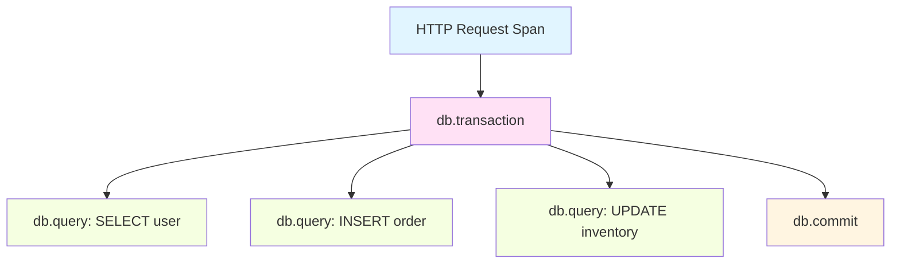

# How to Instrument C++ Database Clients with OpenTelemetry

Author: [nawazdhandala](https://www.github.com/nawazdhandala)

Tags: OpenTelemetry, C++, Database, Clients, SQL, Tracing

Description: Complete guide to instrumenting C++ database clients with OpenTelemetry for comprehensive database operation tracing and performance monitoring.

Database operations are often the bottleneck in application performance. Instrumenting your C++ database clients with OpenTelemetry provides visibility into query execution times, connection pool behavior, and database performance patterns. Unlike interpreted languages with automatic instrumentation, C++ requires manual instrumentation that gives you fine-grained control over what gets traced.

## The Anatomy of Database Instrumentation

Database instrumentation captures several critical pieces of information: the query itself, execution time, connection details, rows affected, and errors. OpenTelemetry's semantic conventions provide standardized attribute names for database operations, ensuring your telemetry is consistent with industry standards.

The key is wrapping database operations in spans that represent the logical unit of work. For synchronous operations, this is straightforward. For async operations or connection pooling, you need careful span lifecycle management.

## Instrumenting a Simple SQL Client

Starting with a basic SQL client wrapper helps illustrate the core concepts. This example uses a generic SQL interface, but the patterns apply to any database client library.

```cpp
// database_client.h - wrapper around your SQL client
#include "opentelemetry/trace/provider.h"
#include "opentelemetry/trace/span.h"
#include "opentelemetry/context/context.h"

namespace trace = opentelemetry::trace;
namespace nostd = opentelemetry::nostd;

class InstrumentedDatabaseClient {
private:
    std::shared_ptr<trace::Tracer> tracer_;
    std::unique_ptr<SQLConnection> connection_;
    std::string db_name_;
    std::string db_system_;

public:
    InstrumentedDatabaseClient(
        const std::string& connection_string,
        const std::string& db_name,
        const std::string& db_system
    ) : db_name_(db_name), db_system_(db_system) {
        auto provider = trace::Provider::GetTracerProvider();
        tracer_ = provider->GetTracer("database-client", "1.0.0");
        connection_ = std::make_unique<SQLConnection>(connection_string);
    }

    // Execute a query and return results
    QueryResult ExecuteQuery(const std::string& query);

    // Execute a command that doesn't return results
    int ExecuteCommand(const std::string& command);

private:
    // Helper to create a span with common database attributes
    nostd::shared_ptr<trace::Span> CreateDatabaseSpan(
        const std::string& operation,
        const std::string& statement
    );
};
```

The tracer instance is stored as a member variable, avoiding repeated lookups. The database name and system type are cached for efficient attribute setting.

## Creating Database Spans with Semantic Conventions

OpenTelemetry defines specific semantic conventions for database operations. Following these conventions ensures your telemetry is compatible with analysis tools and dashboards.

```cpp
// database_client.cpp - implementation of span creation
nostd::shared_ptr<trace::Span>
InstrumentedDatabaseClient::CreateDatabaseSpan(
    const std::string& operation,
    const std::string& statement
) {
    // Create span with database operation name
    trace::StartSpanOptions options;
    options.kind = trace::SpanKind::kClient;

    auto span = tracer_->StartSpan(operation, options);

    // Set semantic convention attributes for databases
    span->SetAttribute("db.system", db_system_);  // e.g., "postgresql", "mysql"
    span->SetAttribute("db.name", db_name_);
    span->SetAttribute("db.statement", statement);
    span->SetAttribute("db.operation", operation);

    // Connection-level attributes
    span->SetAttribute("db.connection_string", connection_->GetSanitizedConnectionString());
    span->SetAttribute("net.peer.name", connection_->GetHost());
    span->SetAttribute("net.peer.port", connection_->GetPort());

    return span;
}
```

Notice the sanitized connection string prevents leaking credentials into your telemetry. Always sanitize sensitive data before setting span attributes.

## Instrumenting Query Execution

Query execution needs to capture both successful operations and failures. The span status should reflect whether the database operation succeeded.

```cpp
// Implementation of query execution with instrumentation
QueryResult InstrumentedDatabaseClient::ExecuteQuery(const std::string& query) {
    // Extract operation type from query (SELECT, INSERT, etc.)
    std::string operation = ExtractOperationType(query);
    std::string span_name = "db." + operation;

    auto span = CreateDatabaseSpan(span_name, query);

    // Use a scope to automatically end the span
    auto scope = tracer_->WithActiveSpan(span);

    try {
        auto start_time = std::chrono::steady_clock::now();

        // Execute the actual database query
        QueryResult result = connection_->Execute(query);

        auto end_time = std::chrono::steady_clock::now();
        auto duration_ms = std::chrono::duration_cast<std::chrono::milliseconds>(
            end_time - start_time
        ).count();

        // Record success metrics
        span->SetAttribute("db.rows_affected", result.GetRowCount());
        span->SetAttribute("db.execution_time_ms", duration_ms);
        span->SetStatus(trace::StatusCode::kOk);

        return result;

    } catch (const DatabaseException& e) {
        // Record error information
        span->SetStatus(trace::StatusCode::kError, e.what());
        span->SetAttribute("db.error.type", e.GetErrorType());
        span->SetAttribute("db.error.code", e.GetErrorCode());

        // Add an event for the exception
        span->AddEvent("exception", {
            {"exception.type", typeid(e).name()},
            {"exception.message", e.what()},
            {"exception.stacktrace", e.GetStackTrace()}
        });

        throw;  // Re-throw to maintain original error handling
    }
}
```

The try-catch block ensures errors are recorded before propagating. Adding events for exceptions provides additional context for debugging.

## Handling Connection Pools

Connection pools add complexity because spans need to track both pool operations and individual query execution.

```cpp
// Connection pool wrapper with instrumentation
class InstrumentedConnectionPool {
private:
    std::shared_ptr<trace::Tracer> tracer_;
    std::unique_ptr<ConnectionPool> pool_;

public:
    class ScopedConnection {
    private:
        nostd::shared_ptr<trace::Span> span_;
        Connection* conn_;
        ConnectionPool* pool_;

    public:
        ScopedConnection(
            nostd::shared_ptr<trace::Span> span,
            Connection* conn,
            ConnectionPool* pool
        ) : span_(span), conn_(conn), pool_(pool) {}

        ~ScopedConnection() {
            // Return connection to pool and end span
            if (conn_) {
                pool_->Release(conn_);
                span_->End();
            }
        }

        Connection* Get() { return conn_; }
        Connection* operator->() { return conn_; }
    };

    ScopedConnection AcquireConnection() {
        auto span = tracer_->StartSpan("db.pool.acquire");

        auto start_time = std::chrono::steady_clock::now();

        try {
            Connection* conn = pool_->Acquire();

            auto wait_time = std::chrono::duration_cast<std::chrono::milliseconds>(
                std::chrono::steady_clock::now() - start_time
            ).count();

            // Record pool metrics
            span->SetAttribute("db.pool.wait_time_ms", wait_time);
            span->SetAttribute("db.pool.size", pool_->GetTotalConnections());
            span->SetAttribute("db.pool.active", pool_->GetActiveConnections());
            span->SetAttribute("db.pool.idle", pool_->GetIdleConnections());
            span->SetStatus(trace::StatusCode::kOk);

            return ScopedConnection(span, conn, pool_.get());

        } catch (const PoolExhaustedException& e) {
            span->SetStatus(trace::StatusCode::kError, "Pool exhausted");
            span->SetAttribute("db.pool.timeout", true);
            throw;
        }
    }
};
```

The `ScopedConnection` class ensures connections are returned to the pool when the scope ends, and the span is properly closed. This pattern prevents resource leaks.

## Instrumenting Prepared Statements

Prepared statements are executed multiple times with different parameters. You should create a span for preparation and separate spans for each execution.

```cpp
// Instrumented prepared statement wrapper
class InstrumentedPreparedStatement {
private:
    std::shared_ptr<trace::Tracer> tracer_;
    std::unique_ptr<PreparedStatement> statement_;
    std::string query_;
    std::string statement_id_;

public:
    InstrumentedPreparedStatement(
        std::shared_ptr<trace::Tracer> tracer,
        Connection* conn,
        const std::string& query
    ) : tracer_(tracer), query_(query) {
        auto span = tracer_->StartSpan("db.prepare");
        span->SetAttribute("db.statement", query);

        try {
            statement_ = conn->Prepare(query);
            statement_id_ = GenerateStatementId(query);

            span->SetAttribute("db.statement.id", statement_id_);
            span->SetStatus(trace::StatusCode::kOk);
            span->End();

        } catch (const std::exception& e) {
            span->SetStatus(trace::StatusCode::kError, e.what());
            span->End();
            throw;
        }
    }

    template<typename... Params>
    QueryResult Execute(Params... params) {
        auto span = tracer_->StartSpan("db.execute");
        span->SetAttribute("db.statement.id", statement_id_);
        span->SetAttribute("db.statement", query_);

        // Record parameter count (not values for security)
        span->SetAttribute("db.statement.param_count", sizeof...(params));

        try {
            auto result = statement_->Execute(params...);

            span->SetAttribute("db.rows_affected", result.GetRowCount());
            span->SetStatus(trace::StatusCode::kOk);
            span->End();

            return result;

        } catch (const std::exception& e) {
            span->SetStatus(trace::StatusCode::kError, e.what());
            span->End();
            throw;
        }
    }

private:
    std::string GenerateStatementId(const std::string& query) {
        // Create a hash or unique ID for the statement
        return std::to_string(std::hash<std::string>{}(query));
    }
};
```

Recording parameter count without values maintains observability while protecting sensitive data. Never log parameter values unless you're certain they don't contain PII or credentials.

## Async Database Operations

Asynchronous database operations require careful context propagation to maintain the parent-child span relationship.

```cpp
// Async query execution with proper context propagation
std::future<QueryResult> InstrumentedDatabaseClient::ExecuteQueryAsync(
    const std::string& query
) {
    std::string operation = ExtractOperationType(query);
    std::string span_name = "db." + operation;

    auto span = CreateDatabaseSpan(span_name, query);

    // Capture the current context
    auto current_context = opentelemetry::context::RuntimeContext::GetCurrent();

    // Return a future that will execute the query
    return std::async(std::launch::async, [this, query, span, current_context]() {
        // Restore context in the async thread
        auto token = opentelemetry::context::RuntimeContext::Attach(current_context);

        try {
            QueryResult result = connection_->Execute(query);

            span->SetAttribute("db.rows_affected", result.GetRowCount());
            span->SetStatus(trace::StatusCode::kOk);
            span->End();

            return result;

        } catch (const DatabaseException& e) {
            span->SetStatus(trace::StatusCode::kError, e.what());
            span->SetAttribute("db.error.type", e.GetErrorType());
            span->End();
            throw;
        }
    });
}
```

Capturing and restoring context ensures the async operation's span is properly linked to the calling context. Without this, spans would appear disconnected in your trace visualization.

## Transaction Instrumentation

Database transactions require a parent span that encompasses all operations within the transaction boundary.

```cpp
// Transaction wrapper with instrumentation
class InstrumentedTransaction {
private:
    nostd::shared_ptr<trace::Span> transaction_span_;
    std::shared_ptr<trace::Tracer> tracer_;
    std::unique_ptr<Transaction> transaction_;
    bool committed_ = false;

public:
    InstrumentedTransaction(
        std::shared_ptr<trace::Tracer> tracer,
        Connection* conn
    ) : tracer_(tracer) {
        transaction_span_ = tracer_->StartSpan("db.transaction");
        transaction_span_->SetAttribute("db.transaction.id", GenerateTransactionId());
        transaction_ = conn->BeginTransaction();
    }

    ~InstrumentedTransaction() {
        if (!committed_) {
            // Transaction was not committed, must have failed
            transaction_span_->SetAttribute("db.transaction.outcome", "rollback");
            transaction_span_->SetStatus(trace::StatusCode::kError, "Implicit rollback");
            transaction_span_->End();
        }
    }

    QueryResult Execute(const std::string& query) {
        // Create a child span for each operation within the transaction
        auto span = tracer_->StartSpan("db.query", {}, transaction_span_->GetContext());
        span->SetAttribute("db.statement", query);

        try {
            auto result = transaction_->Execute(query);
            span->SetAttribute("db.rows_affected", result.GetRowCount());
            span->SetStatus(trace::StatusCode::kOk);
            span->End();
            return result;

        } catch (const std::exception& e) {
            span->SetStatus(trace::StatusCode::kError, e.what());
            span->End();
            throw;
        }
    }

    void Commit() {
        auto span = tracer_->StartSpan("db.commit", {}, transaction_span_->GetContext());

        try {
            transaction_->Commit();
            committed_ = true;

            span->SetStatus(trace::StatusCode::kOk);
            transaction_span_->SetAttribute("db.transaction.outcome", "commit");
            transaction_span_->SetStatus(trace::StatusCode::kOk);

            span->End();
            transaction_span_->End();

        } catch (const std::exception& e) {
            span->SetStatus(trace::StatusCode::kError, e.what());
            transaction_span_->SetAttribute("db.transaction.outcome", "rollback");
            transaction_span_->SetStatus(trace::StatusCode::kError, e.what());

            span->End();
            transaction_span_->End();
            throw;
        }
    }
};
```

The destructor ensures rollback is recorded if the transaction isn't explicitly committed. This catches cases where exceptions cause early exit.

## Visualizing Database Operation Flow

Understanding how spans relate to each other helps diagnose performance issues.



This hierarchical structure makes it easy to identify which database operations belong to which transaction and trace back to the originating request.

## Performance Considerations

Instrumentation adds overhead. For high-throughput database applications, consider sampling or conditional instrumentation.

```cpp
// Conditional instrumentation based on sampling
class SampledDatabaseClient {
private:
    std::shared_ptr<trace::Tracer> tracer_;
    std::unique_ptr<SQLConnection> connection_;
    double sample_rate_;  // 0.0 to 1.0

    bool ShouldSample() {
        return (static_cast<double>(rand()) / RAND_MAX) < sample_rate_;
    }

public:
    QueryResult ExecuteQuery(const std::string& query) {
        if (ShouldSample()) {
            return ExecuteQueryInstrumented(query);
        } else {
            return connection_->Execute(query);
        }
    }

private:
    QueryResult ExecuteQueryInstrumented(const std::string& query) {
        // Full instrumentation code here
        auto span = CreateDatabaseSpan("db.query", query);
        // ... rest of instrumentation
    }
};
```

Sampling reduces overhead while still providing representative telemetry. For production systems with millions of queries per second, sampling is essential.

Instrumenting database clients requires balancing observability with performance. By following OpenTelemetry's semantic conventions and carefully managing span lifecycle, you create telemetry that provides deep insights into database behavior without overwhelming your systems. The patterns shown here apply across different database technologies and scale from simple applications to complex distributed systems.
