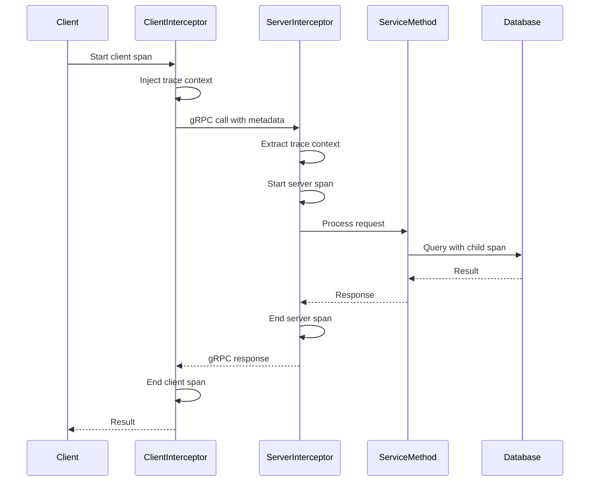

# How to Instrument C++ gRPC Services with OpenTelemetry

Author: [nawazdhandala](https://www.github.com/nawazdhandala)

Tags: OpenTelemetry, C++, gRPC, Services, Tracing, Microservices

Description: Learn how to add OpenTelemetry instrumentation to C++ gRPC services, including client and server interceptors, context propagation, and distributed tracing across microservices.

gRPC services power many high-performance microservice architectures. Adding OpenTelemetry instrumentation to these services provides critical visibility into inter-service communication, latency, and errors.

## gRPC Architecture Overview

gRPC uses HTTP/2 for transport and Protocol Buffers for serialization. Understanding the request flow helps determine where to inject tracing:


Interceptors provide the ideal hook points for adding tracing without modifying service code.

## Defining a gRPC Service

Start with a simple gRPC service definition:

```protobuf
syntax = "proto3";

package demo;

service UserService {
  rpc GetUser(GetUserRequest) returns (GetUserResponse);
  rpc ListUsers(ListUsersRequest) returns (ListUsersResponse);
  rpc CreateUser(CreateUserRequest) returns (CreateUserResponse);
}

message GetUserRequest {
  string user_id = 1;
}

message GetUserResponse {
  string user_id = 1;
  string name = 2;
  string email = 3;
}

message ListUsersRequest {
  int32 page_size = 1;
  string page_token = 2;
}

message ListUsersResponse {
  repeated GetUserResponse users = 1;
  string next_page_token = 2;
}

message CreateUserRequest {
  string name = 1;
  string email = 2;
}

message CreateUserResponse {
  string user_id = 1;
}
```

## Server-Side Interceptor

Create an interceptor that automatically traces all incoming RPC calls:

```cpp
#include <grpcpp/grpcpp.h>
#include <grpcpp/server_context.h>
#include "opentelemetry/trace/provider.h"
#include "opentelemetry/trace/span.h"
#include "opentelemetry/context/propagation/global_propagator.h"
#include "opentelemetry/trace/propagation/http_trace_context.h"

namespace trace_api = opentelemetry::trace;
namespace context = opentelemetry::context;

// Carrier to extract trace context from gRPC metadata
class GrpcServerCarrier : public context::propagation::TextMapCarrier {
public:
    explicit GrpcServerCarrier(grpc::ServerContext* context)
        : context_(context) {}

    nostd::string_view Get(nostd::string_view key) const noexcept override {
        auto metadata = context_->client_metadata();
        auto it = metadata.find(grpc::string_ref(key.data(), key.size()));
        if (it != metadata.end()) {
            value_ = std::string(it->second.data(), it->second.size());
            return nostd::string_view(value_);
        }
        return "";
    }

    void Set(nostd::string_view key, nostd::string_view value) noexcept override {
        // Not used for extraction
    }

private:
    grpc::ServerContext* context_;
    mutable std::string value_;
};

// Server interceptor that creates spans for each RPC
class TracingServerInterceptor : public grpc::experimental::Interceptor {
public:
    explicit TracingServerInterceptor(
        grpc::experimental::ServerRpcInfo* info,
        trace_api::Tracer* tracer
    ) : info_(info), tracer_(tracer) {}

    void Intercept(grpc::experimental::InterceptorBatchMethods* methods) override {
        if (methods->QueryInterceptionHookPoint(
            grpc::experimental::InterceptionHookPoints::POST_RECV_INITIAL_METADATA
        )) {
            // Extract trace context from incoming metadata
            GrpcServerCarrier carrier(info_->server_context());
            auto prop = context::propagation::GlobalTextMapPropagator::GetGlobalPropagator();
            auto current_ctx = prop->Extract(carrier, context::RuntimeContext::GetCurrent());

            // Start server span
            trace_api::StartSpanOptions options;
            options.kind = trace_api::SpanKind::kServer;
            options.parent = trace_api::GetSpan(current_ctx)->GetContext();

            std::string span_name = std::string(info_->method());
            span_ = tracer_->StartSpan(span_name, {
                {"rpc.system", "grpc"},
                {"rpc.service", std::string(info_->service())},
                {"rpc.method", std::string(info_->method())},
                {"rpc.grpc.status_code", 0}
            }, options);

            scope_ = tracer_->WithActiveSpan(span_);
        }

        if (methods->QueryInterceptionHookPoint(
            grpc::experimental::InterceptionHookPoints::PRE_SEND_STATUS
        )) {
            // Record final status
            if (span_) {
                auto status = info_->server_context()->status();
                span_->SetAttribute("rpc.grpc.status_code",
                                   static_cast<int>(status.error_code()));

                if (!status.ok()) {
                    span_->SetStatus(trace_api::StatusCode::kError,
                                   status.error_message());
                    span_->AddEvent("error", {
                        {"error.message", status.error_message()}
                    });
                }

                span_->End();
            }
        }

        methods->Proceed();
    }

private:
    grpc::experimental::ServerRpcInfo* info_;
    trace_api::Tracer* tracer_;
    std::shared_ptr<trace_api::Span> span_;
    trace_api::Scope scope_;
};

// Factory for creating server interceptors
class TracingServerInterceptorFactory
    : public grpc::experimental::ServerInterceptorFactoryInterface {
public:
    explicit TracingServerInterceptorFactory(trace_api::Tracer* tracer)
        : tracer_(tracer) {}

    grpc::experimental::Interceptor* CreateServerInterceptor(
        grpc::experimental::ServerRpcInfo* info
    ) override {
        return new TracingServerInterceptor(info, tracer_);
    }

private:
    trace_api::Tracer* tracer_;
};
```

## Implementing the Service

Create a service implementation that benefits from automatic tracing:

```cpp
#include "user_service.grpc.pb.h"
#include <memory>

class UserServiceImpl final : public demo::UserService::Service {
public:
    grpc::Status GetUser(
        grpc::ServerContext* context,
        const demo::GetUserRequest* request,
        demo::GetUserResponse* response
    ) override {
        // The interceptor has already created a span for this RPC
        // Get the current tracer to create child spans
        auto tracer = trace_api::Provider::GetTracerProvider()
            ->GetTracer("user-service", "1.0.0");

        // Create a child span for database lookup
        auto db_span = tracer->StartSpan("database.get_user");
        db_span->SetAttribute("db.system", "postgresql");
        db_span->SetAttribute("db.operation", "SELECT");
        db_span->SetAttribute("user.id", request->user_id());

        // Simulate database query
        std::this_thread::sleep_for(std::chrono::milliseconds(5));

        response->set_user_id(request->user_id());
        response->set_name("John Doe");
        response->set_email("john@example.com");

        db_span->End();

        return grpc::Status::OK;
    }

    grpc::Status ListUsers(
        grpc::ServerContext* context,
        const demo::ListUsersRequest* request,
        demo::ListUsersResponse* response
    ) override {
        auto tracer = trace_api::Provider::GetTracerProvider()
            ->GetTracer("user-service", "1.0.0");

        auto db_span = tracer->StartSpan("database.list_users");
        db_span->SetAttribute("db.system", "postgresql");
        db_span->SetAttribute("page_size", request->page_size());

        // Simulate database query
        std::this_thread::sleep_for(std::chrono::milliseconds(10));

        // Add sample user
        auto user = response->add_users();
        user->set_user_id("user1");
        user->set_name("Jane Smith");
        user->set_email("jane@example.com");

        db_span->End();

        return grpc::Status::OK;
    }

    grpc::Status CreateUser(
        grpc::ServerContext* context,
        const demo::CreateUserRequest* request,
        demo::CreateUserResponse* response
    ) override {
        auto tracer = trace_api::Provider::GetTracerProvider()
            ->GetTracer("user-service", "1.0.0");

        // Validate input
        auto validation_span = tracer->StartSpan("validate_user");
        if (request->email().empty()) {
            validation_span->SetStatus(trace_api::StatusCode::kError,
                                      "Email is required");
            validation_span->End();
            return grpc::Status(grpc::StatusCode::INVALID_ARGUMENT,
                               "Email is required");
        }
        validation_span->End();

        // Create user in database
        auto db_span = tracer->StartSpan("database.create_user");
        db_span->SetAttribute("db.system", "postgresql");
        db_span->SetAttribute("user.email", request->email());

        std::this_thread::sleep_for(std::chrono::milliseconds(8));

        response->set_user_id("new-user-123");
        db_span->End();

        return grpc::Status::OK;
    }
};
```

## Client-Side Interceptor

Create a client interceptor to inject trace context into outgoing calls:

```cpp
// Carrier to inject trace context into gRPC metadata
class GrpcClientCarrier : public context::propagation::TextMapCarrier {
public:
    explicit GrpcClientCarrier(grpc::ClientContext* context)
        : context_(context) {}

    nostd::string_view Get(nostd::string_view key) const noexcept override {
        return "";  // Not needed for injection
    }

    void Set(nostd::string_view key, nostd::string_view value) noexcept override {
        context_->AddMetadata(std::string(key), std::string(value));
    }

private:
    grpc::ClientContext* context_;
};

// Client interceptor for outgoing calls
class TracingClientInterceptor : public grpc::experimental::Interceptor {
public:
    explicit TracingClientInterceptor(
        grpc::experimental::ClientRpcInfo* info,
        trace_api::Tracer* tracer
    ) : info_(info), tracer_(tracer) {}

    void Intercept(grpc::experimental::InterceptorBatchMethods* methods) override {
        if (methods->QueryInterceptionHookPoint(
            grpc::experimental::InterceptionHookPoints::PRE_SEND_INITIAL_METADATA
        )) {
            // Start client span
            trace_api::StartSpanOptions options;
            options.kind = trace_api::SpanKind::kClient;

            std::string span_name = std::string(info_->method());
            span_ = tracer_->StartSpan(span_name, {
                {"rpc.system", "grpc"},
                {"rpc.service", std::string(info_->service())},
                {"rpc.method", std::string(info_->method())},
                {"net.peer.name", std::string(info_->channel()->GetLoadBalancingPolicyName())}
            }, options);

            // Inject trace context into metadata
            GrpcClientCarrier carrier(info_->client_context());
            auto prop = context::propagation::GlobalTextMapPropagator::GetGlobalPropagator();
            auto current_ctx = context::RuntimeContext::GetCurrent();
            prop->Inject(carrier, current_ctx.SetValue("active_span", span_));

            scope_ = tracer_->WithActiveSpan(span_);
        }

        if (methods->QueryInterceptionHookPoint(
            grpc::experimental::InterceptionHookPoints::POST_RECV_STATUS
        )) {
            if (span_) {
                auto status = info_->client_context()->status();
                span_->SetAttribute("rpc.grpc.status_code",
                                   static_cast<int>(status.error_code()));

                if (!status.ok()) {
                    span_->SetStatus(trace_api::StatusCode::kError,
                                   status.error_message());
                }

                span_->End();
            }
        }

        methods->Proceed();
    }

private:
    grpc::experimental::ClientRpcInfo* info_;
    trace_api::Tracer* tracer_;
    std::shared_ptr<trace_api::Span> span_;
    trace_api::Scope scope_;
};

// Factory for creating client interceptors
class TracingClientInterceptorFactory
    : public grpc::experimental::ClientInterceptorFactoryInterface {
public:
    explicit TracingClientInterceptorFactory(trace_api::Tracer* tracer)
        : tracer_(tracer) {}

    grpc::experimental::Interceptor* CreateClientInterceptor(
        grpc::experimental::ClientRpcInfo* info
    ) override {
        return new TracingClientInterceptor(info, tracer_);
    }

private:
    trace_api::Tracer* tracer_;
};
```

## Creating a Traced gRPC Server

Set up a server with the tracing interceptor:

```cpp
#include <grpcpp/server.h>
#include <grpcpp/server_builder.h>
#include <memory>

void RunServer() {
    // Initialize OpenTelemetry
    auto exporter = opentelemetry::exporter::otlp::OtlpGrpcExporterFactory::Create();
    auto processor = opentelemetry::sdk::trace::BatchSpanProcessorFactory::Create(
        std::move(exporter)
    );
    auto provider = opentelemetry::sdk::trace::TracerProviderFactory::Create(
        std::move(processor)
    );
    opentelemetry::trace::Provider::SetTracerProvider(provider);

    auto tracer = opentelemetry::trace::Provider::GetTracerProvider()
        ->GetTracer("user-service", "1.0.0");

    // Set up global propagator
    opentelemetry::context::propagation::GlobalTextMapPropagator::SetGlobalPropagator(
        std::make_shared<opentelemetry::trace::propagation::HttpTraceContext>()
    );

    // Create service implementation
    UserServiceImpl service;

    // Build server with interceptor
    grpc::ServerBuilder builder;
    builder.AddListeningPort("0.0.0.0:50051", grpc::InsecureServerCredentials());
    builder.RegisterService(&service);

    // Add tracing interceptor
    std::vector<std::unique_ptr<grpc::experimental::ServerInterceptorFactoryInterface>>
        interceptor_factories;
    interceptor_factories.push_back(
        std::make_unique<TracingServerInterceptorFactory>(tracer.get())
    );
    builder.experimental().SetInterceptorCreators(std::move(interceptor_factories));

    // Start server
    std::unique_ptr<grpc::Server> server(builder.BuildAndStart());
    std::cout << "Server listening on 0.0.0.0:50051" << std::endl;
    server->Wait();
}
```

## Creating a Traced gRPC Client

Set up a client with the tracing interceptor:

```cpp
void CallService() {
    auto tracer = opentelemetry::trace::Provider::GetTracerProvider()
        ->GetTracer("user-client", "1.0.0");

    // Set up channel with interceptor
    grpc::ChannelArguments channel_args;
    std::vector<std::unique_ptr<grpc::experimental::ClientInterceptorFactoryInterface>>
        interceptor_factories;
    interceptor_factories.push_back(
        std::make_unique<TracingClientInterceptorFactory>(tracer.get())
    );

    auto channel = grpc::experimental::CreateCustomChannelWithInterceptors(
        "localhost:50051",
        grpc::InsecureChannelCredentials(),
        channel_args,
        std::move(interceptor_factories)
    );

    // Create stub
    auto stub = demo::UserService::NewStub(channel);

    // Make RPC call (automatically traced)
    grpc::ClientContext context;
    demo::GetUserRequest request;
    request.set_user_id("user123");
    demo::GetUserResponse response;

    grpc::Status status = stub->GetUser(&context, request, &response);

    if (status.ok()) {
        std::cout << "User: " << response.name() << std::endl;
    } else {
        std::cerr << "RPC failed: " << status.error_message() << std::endl;
    }
}
```

## Distributed Trace Flow

The complete trace flow across services:



## CMakeLists.txt Configuration

Configure your build to include gRPC and OpenTelemetry:

```cmake
cmake_minimum_required(VERSION 3.14)
project(grpc-otel-demo)

set(CMAKE_CXX_STANDARD 17)

find_package(Protobuf REQUIRED)
find_package(gRPC REQUIRED)
find_package(opentelemetry-cpp REQUIRED)

# Generate gRPC code
add_library(user_service_proto user_service.proto)
target_link_libraries(user_service_proto
    PUBLIC
    protobuf::libprotobuf
    gRPC::grpc++
)
target_include_directories(user_service_proto PUBLIC ${CMAKE_CURRENT_BINARY_DIR})

protobuf_generate(TARGET user_service_proto)
protobuf_generate(TARGET user_service_proto LANGUAGE grpc
    GENERATE_EXTENSIONS .grpc.pb.h .grpc.pb.cc
    PLUGIN "protoc-gen-grpc=\$<TARGET_FILE:gRPC::grpc_cpp_plugin>")

# Server executable
add_executable(server server.cpp)
target_link_libraries(server
    PRIVATE
    user_service_proto
    gRPC::grpc++
    opentelemetry-cpp::trace
    opentelemetry-cpp::otlp_grpc_exporter
)

# Client executable
add_executable(client client.cpp)
target_link_libraries(client
    PRIVATE
    user_service_proto
    gRPC::grpc++
    opentelemetry-cpp::trace
    opentelemetry-cpp::otlp_grpc_exporter
)
```

Instrumenting gRPC services with OpenTelemetry interceptors provides comprehensive visibility into microservice communication without requiring changes to service implementation code. The automatic context propagation ensures traces flow correctly across service boundaries.
