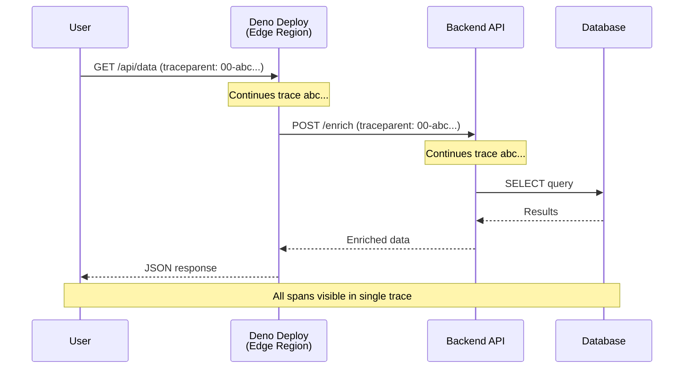

# How to Instrument Deno Deploy Edge Functions with OpenTelemetry

Author: [nawazdhandala](https://www.github.com/nawazdhandala)

Tags: OpenTelemetry, Deno, Deno Deploy, Edge Functions, Tracing, Serverless, Observability

Description: Learn how to add OpenTelemetry tracing and metrics to Deno Deploy edge functions for full observability across your serverless workloads.

---

Deno Deploy runs your TypeScript and JavaScript code at the edge, close to your users, across dozens of regions worldwide. That geographic distribution is great for latency but creates a real challenge for observability. When a request fails or slows down, you need to know which region handled it, what downstream calls it made, and where the time was spent. OpenTelemetry gives you that visibility.

This guide covers how to instrument Deno Deploy edge functions with OpenTelemetry, from basic setup through advanced patterns for tracing HTTP handlers, outbound fetch calls, and KV store operations.

## Deno's Built-in OpenTelemetry Support

Starting with Deno 2.x, the runtime includes native OpenTelemetry support. This is a significant advantage over other edge platforms because you do not need to bundle a separate SDK. Deno can emit traces, metrics, and logs using the standard OTLP protocol out of the box.

To enable it, you set environment variables in your Deno Deploy project settings:

```bash
# Environment variables for Deno Deploy project
# These configure the built-in OpenTelemetry integration

OTEL_EXPORTER_OTLP_ENDPOINT=https://your-collector.example.com:4318
OTEL_EXPORTER_OTLP_PROTOCOL=http/protobuf
OTEL_SERVICE_NAME=my-edge-api
OTEL_DENO=true
```

With `OTEL_DENO=true`, the runtime automatically instruments incoming HTTP requests and outbound `fetch()` calls. Each request becomes a trace with spans for the handler execution and any external HTTP calls it makes.

## Manual Instrumentation for Custom Spans

The automatic instrumentation covers HTTP boundaries, but you often need visibility into the logic between those boundaries. Deno exposes the standard OpenTelemetry tracing API for creating custom spans:

```typescript
// main.ts
// Edge function with custom OpenTelemetry spans for business logic

const tracer = new Deno.opentelemetry.Tracer("edge-api");

Deno.serve(async (req: Request) => {
  // The incoming request span is created automatically by the runtime
  const url = new URL(req.url);

  if (url.pathname === "/api/process") {
    return await handleProcess(req);
  }

  return new Response("Not Found", { status: 404 });
});

async function handleProcess(req: Request): Promise<Response> {
  // Create a custom span for the processing logic
  return tracer.startActiveSpan("process-request", async (span) => {
    try {
      const body = await req.json();

      // Add attributes to help with debugging and filtering
      span.setAttribute("request.item_count", body.items?.length ?? 0);
      span.setAttribute("request.priority", body.priority ?? "normal");

      // Validate input with its own span for timing visibility
      const validated = await tracer.startActiveSpan("validate-input", async (validationSpan) => {
        const result = validatePayload(body);
        validationSpan.setAttribute("validation.passed", result.valid);
        if (!result.valid) {
          validationSpan.setAttribute("validation.error", result.error);
        }
        validationSpan.end();
        return result;
      });

      if (!validated.valid) {
        span.setAttribute("error", true);
        span.end();
        return new Response(JSON.stringify({ error: validated.error }), {
          status: 400,
          headers: { "Content-Type": "application/json" },
        });
      }

      // Call downstream service (automatically traced by Deno runtime)
      const result = await fetch("https://api.internal.example.com/enrich", {
        method: "POST",
        headers: { "Content-Type": "application/json" },
        body: JSON.stringify(body),
      });

      const enriched = await result.json();
      span.setAttribute("response.status", result.status);
      span.end();

      return new Response(JSON.stringify(enriched), {
        status: 200,
        headers: { "Content-Type": "application/json" },
      });
    } catch (error) {
      // Record the exception on the span for error tracking
      span.recordException(error);
      span.setAttribute("error", true);
      span.end();
      return new Response("Internal Server Error", { status: 500 });
    }
  });
}
```

Each `startActiveSpan` call creates a child span under the current trace context. The runtime handles context propagation automatically, so the parent-child relationships are correct without any manual wiring.

## Instrumenting Deno KV Operations

Deno Deploy includes Deno KV, a globally distributed key-value store. Operations against KV can have variable latency depending on consistency requirements and geographic distribution. Wrapping these calls in spans gives you visibility into storage performance:

```typescript
// kv-instrumented.ts
// Helper module for traced Deno KV operations

const tracer = new Deno.opentelemetry.Tracer("deno-kv");
const kv = await Deno.openKv();

// Wrapper that adds tracing to KV get operations
export async function tracedGet<T>(key: Deno.KvKey): Promise<Deno.KvEntryMaybe<T>> {
  return tracer.startActiveSpan("kv.get", async (span) => {
    // Record the key for debugging (be careful with sensitive keys)
    span.setAttribute("kv.operation", "get");
    span.setAttribute("kv.key", JSON.stringify(key));

    const start = performance.now();
    const result = await kv.get<T>(key);
    const duration = performance.now() - start;

    span.setAttribute("kv.hit", result.value !== null);
    span.setAttribute("kv.latency_ms", duration);
    span.end();
    return result;
  });
}

// Wrapper that adds tracing to KV set operations
export async function tracedSet(
  key: Deno.KvKey,
  value: unknown,
): Promise<Deno.KvCommitResult> {
  return tracer.startActiveSpan("kv.set", async (span) => {
    span.setAttribute("kv.operation", "set");
    span.setAttribute("kv.key", JSON.stringify(key));

    const start = performance.now();
    const result = await kv.set(key, value);
    const duration = performance.now() - start;

    span.setAttribute("kv.latency_ms", duration);
    span.setAttribute("kv.success", result.ok);
    span.end();
    return result;
  });
}

// Wrapper for atomic transactions
export async function tracedAtomic(
  operations: (atomic: Deno.AtomicOperation) => Deno.AtomicOperation,
): Promise<Deno.KvCommitResult> {
  return tracer.startActiveSpan("kv.atomic", async (span) => {
    span.setAttribute("kv.operation", "atomic");

    const atomic = operations(kv.atomic());
    const result = await atomic.commit();

    span.setAttribute("kv.success", result.ok);
    span.end();
    return result;
  });
}
```

With these wrappers, every KV interaction shows up as a span in your traces. You can quickly spot slow reads, failed writes, and contention on atomic operations.

## Trace Context Propagation Across Edge Regions

When one edge function calls another (or calls a backend service), you need trace context propagation to stitch the spans together into a single trace. Deno Deploy automatically injects W3C Trace Context headers into outbound `fetch()` calls when OpenTelemetry is enabled.

For incoming requests from other instrumented services, the runtime extracts the `traceparent` and `tracestate` headers and continues the trace. This means a request that starts in your frontend, hits an edge function, calls a backend API, and touches a database will appear as one connected trace.



If you need to propagate context to systems that do not support W3C Trace Context, you can manually extract and inject headers:

```typescript
// Manual context propagation for non-standard systems
// Useful when calling services that use custom correlation headers

Deno.serve(async (req: Request) => {
  return tracer.startActiveSpan("proxy-request", async (span) => {
    // Extract the current trace ID and span ID
    const traceId = span.spanContext().traceId;
    const spanId = span.spanContext().spanId;

    // Forward to a legacy system that uses custom headers
    const response = await fetch("https://legacy.example.com/api", {
      headers: {
        // Standard W3C header (auto-injected, but shown for clarity)
        "traceparent": `00-${traceId}-${spanId}-01`,
        // Custom header for legacy systems
        "X-Correlation-ID": traceId,
      },
    });

    span.end();
    return response;
  });
});
```

## Adding Custom Metrics

Beyond tracing, you can emit custom metrics from your edge functions. This is useful for tracking business-level indicators like request counts by endpoint, error rates by region, or processing times for specific operations:

```typescript
// metrics.ts
// Custom metrics for edge function monitoring

const meter = new Deno.opentelemetry.Meter("edge-api-metrics");

// Counter for tracking requests by endpoint and status
const requestCounter = meter.createCounter("edge.requests.total", {
  description: "Total number of requests handled by the edge function",
});

// Histogram for tracking response times
const latencyHistogram = meter.createHistogram("edge.request.duration_ms", {
  description: "Request processing time in milliseconds",
});

Deno.serve(async (req: Request) => {
  const start = performance.now();
  const url = new URL(req.url);

  try {
    const response = await handleRequest(req);
    const duration = performance.now() - start;

    // Record metrics with attributes for filtering
    requestCounter.add(1, {
      "http.method": req.method,
      "http.route": url.pathname,
      "http.status_code": response.status,
    });

    latencyHistogram.record(duration, {
      "http.method": req.method,
      "http.route": url.pathname,
    });

    return response;
  } catch (error) {
    const duration = performance.now() - start;

    requestCounter.add(1, {
      "http.method": req.method,
      "http.route": url.pathname,
      "http.status_code": 500,
      "error.type": error.constructor.name,
    });

    latencyHistogram.record(duration, {
      "http.method": req.method,
      "http.route": url.pathname,
    });

    return new Response("Internal Server Error", { status: 500 });
  }
});
```

These metrics flow through the same OTLP exporter as your traces, so they arrive at your observability backend alongside the tracing data. You can build dashboards that correlate spikes in error rates with specific trace examples.

## Collector Configuration for Receiving Edge Telemetry

Your central collector needs to accept OTLP over HTTP since Deno Deploy edge functions use HTTP/protobuf for export. Here is a collector configuration that receives telemetry from edge functions:

```yaml
# collector-config.yaml
# Central collector configuration for receiving Deno Deploy telemetry

receivers:
  otlp:
    protocols:
      http:
        # Edge functions export via OTLP/HTTP
        endpoint: 0.0.0.0:4318
        cors:
          allowed_origins: ["*"]

processors:
  batch:
    timeout: 5s
    send_batch_size: 256

  # Add region information based on source IP or headers
  attributes:
    actions:
      - key: deployment.platform
        value: deno-deploy
        action: upsert

exporters:
  otlp:
    endpoint: your-backend.example.com:4317

service:
  pipelines:
    traces:
      receivers: [otlp]
      processors: [attributes, batch]
      exporters: [otlp]
    metrics:
      receivers: [otlp]
      processors: [attributes, batch]
      exporters: [otlp]
```

The `attributes` processor tags all incoming telemetry with `deployment.platform: deno-deploy`, which makes it easy to filter and search for edge function telemetry in your observability UI.

## Summary

Deno Deploy's native OpenTelemetry support makes edge function observability straightforward. The runtime handles the heavy lifting of HTTP instrumentation and context propagation, while the standard tracing and metrics APIs let you add custom spans and counters where you need deeper visibility. Combined with a central collector and an observability backend like OneUptime, you get full distributed tracing across your edge functions, backend services, and databases without sacrificing the performance benefits of running code at the edge.
