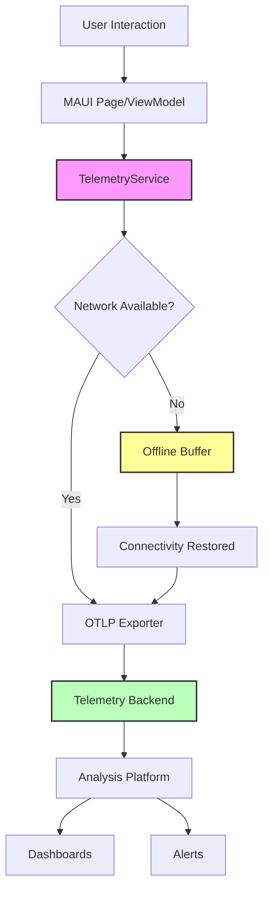

# How to Instrument .NET MAUI Applications with OpenTelemetry

Author: [nawazdhandala](https://www.github.com/nawazdhandala)

Tags: OpenTelemetry, .NET MAUI, Mobile, Cross-Platform, Tracing, C#

Description: Learn how to implement OpenTelemetry instrumentation in .NET MAUI applications for iOS, Android, Windows, and macOS to monitor mobile app performance and user interactions.

Mobile application observability has traditionally lagged behind web and server-side monitoring, yet mobile apps face unique challenges that make observability even more critical. Network conditions vary wildly, devices have limited resources, and users expect instant responsiveness. .NET MAUI (Multi-platform App UI) enables building cross-platform mobile applications, and OpenTelemetry brings professional-grade observability to these applications.

## Understanding Mobile Observability Challenges

Mobile applications operate in unpredictable environments. Users switch between WiFi and cellular networks, experience varying signal strengths, and run apps on devices with different capabilities. These factors create monitoring challenges that don't exist in server environments:

- Intermittent connectivity requires offline telemetry buffering
- Battery and data usage constraints limit instrumentation overhead
- Platform-specific APIs need different instrumentation approaches
- User privacy concerns require careful data handling
- App lifecycle events (backgrounding, suspension) affect telemetry collection
- Crash reporting must work even when the app terminates unexpectedly

OpenTelemetry provides the foundation for addressing these challenges while maintaining consistency with your backend observability infrastructure.

## Setting Up OpenTelemetry in .NET MAUI

Install the required OpenTelemetry packages in your .NET MAUI project:

```bash
dotnet add package OpenTelemetry
dotnet add package OpenTelemetry.Exporter.OpenTelemetryProtocol
dotnet add package OpenTelemetry.Extensions.Hosting
dotnet add package OpenTelemetry.Instrumentation.Http
```

Configure OpenTelemetry in your MauiProgram.cs:

```csharp
using OpenTelemetry;
using OpenTelemetry.Resources;
using OpenTelemetry.Trace;
using OpenTelemetry.Metrics;

public static class MauiProgram
{
    public static MauiApp CreateMauiApp()
    {
        var builder = MauiApp.CreateBuilder();
        builder
            .UseMauiApp<App>()
            .ConfigureFonts(fonts =>
            {
                fonts.AddFont("OpenSans-Regular.ttf", "OpenSansRegular");
            });

        // Configure OpenTelemetry for mobile
        builder.Services.AddOpenTelemetry()
            .ConfigureResource(resource => resource
                .AddService("MauiApp", serviceVersion: "1.0.0")
                .AddAttributes(new Dictionary<string, object>
                {
                    ["device.platform"] = DeviceInfo.Platform.ToString(),
                    ["device.model"] = DeviceInfo.Model,
                    ["device.manufacturer"] = DeviceInfo.Manufacturer,
                    ["device.version"] = DeviceInfo.VersionString,
                    ["app.version"] = AppInfo.VersionString,
                    ["app.build"] = AppInfo.BuildString
                }))
            .WithTracing(tracing => tracing
                .AddSource("MauiApp.*")
                .AddHttpClientInstrumentation(options =>
                {
                    options.RecordException = true;
                    options.FilterHttpRequestMessage = request =>
                    {
                        // Only instrument API calls, not analytics
                        return request.RequestUri?.Host.Contains("api.") ?? false;
                    };
                })
                .AddOtlpExporter(options =>
                {
                    options.Endpoint = new Uri("https://telemetry.yourcompany.com/v1/traces");
                    options.Protocol = OpenTelemetry.Exporter.OtlpExportProtocol.HttpProtobuf;
                }))
            .WithMetrics(metrics => metrics
                .AddMeter("MauiApp.*")
                .AddOtlpExporter(options =>
                {
                    options.Endpoint = new Uri("https://telemetry.yourcompany.com/v1/metrics");
                    options.Protocol = OpenTelemetry.Exporter.OtlpExportProtocol.HttpProtobuf;
                }));

        // Register telemetry services
        builder.Services.AddSingleton<ITelemetryService, TelemetryService>();
        builder.Services.AddSingleton<IConnectivityService, ConnectivityService>();

        return builder.Build();
    }
}
```

## Creating a Telemetry Service for MAUI

Build a centralized telemetry service that handles the unique requirements of mobile applications:

```csharp
using System.Diagnostics;
using System.Diagnostics.Metrics;
using System.Collections.Concurrent;

public interface ITelemetryService
{
    Activity? StartActivity(string name, ActivityKind kind = ActivityKind.Internal);
    void TrackPageView(string pageName);
    void TrackEvent(string eventName, Dictionary<string, object>? properties = null);
    void TrackException(Exception exception);
    Task FlushAsync();
}

public class TelemetryService : ITelemetryService
{
    private static readonly ActivitySource ActivitySource =
        new ActivitySource("MauiApp.Telemetry");

    private static readonly Meter Meter =
        new Meter("MauiApp.Telemetry", "1.0.0");

    private readonly Counter<long> _pageViewCounter;
    private readonly Counter<long> _eventCounter;
    private readonly Counter<long> _exceptionCounter;
    private readonly Histogram<double> _pageLoadDuration;
    private readonly ConcurrentQueue<Activity> _offlineBuffer;
    private readonly IConnectivityService _connectivityService;

    public TelemetryService(IConnectivityService connectivityService)
    {
        _connectivityService = connectivityService;
        _offlineBuffer = new ConcurrentQueue<Activity>();

        // Initialize metrics
        _pageViewCounter = Meter.CreateCounter<long>(
            "app.page.views",
            unit: "views",
            description: "Number of page views");

        _eventCounter = Meter.CreateCounter<long>(
            "app.events",
            unit: "events",
            description: "Number of tracked events");

        _exceptionCounter = Meter.CreateCounter<long>(
            "app.exceptions",
            unit: "exceptions",
            description: "Number of exceptions");

        _pageLoadDuration = Meter.CreateHistogram<double>(
            "app.page.load_duration",
            unit: "ms",
            description: "Page load duration");

        // Subscribe to connectivity changes
        _connectivityService.ConnectivityChanged += OnConnectivityChanged;
    }

    public Activity? StartActivity(string name, ActivityKind kind = ActivityKind.Internal)
    {
        var activity = ActivitySource.StartActivity(name, kind);

        if (activity != null)
        {
            // Add common mobile context
            activity.SetTag("device.orientation", DeviceDisplay.MainDisplayInfo.Orientation.ToString());
            activity.SetTag("device.density", DeviceDisplay.MainDisplayInfo.Density);
            activity.SetTag("network.type", Connectivity.NetworkAccess.ToString());

            // Buffer offline activities
            if (!_connectivityService.IsConnected)
            {
                _offlineBuffer.Enqueue(activity);
            }
        }

        return activity;
    }

    public void TrackPageView(string pageName)
    {
        using var activity = StartActivity($"PageView.{pageName}", ActivityKind.Internal);

        activity?.SetTag("page.name", pageName);
        activity?.SetTag("page.timestamp", DateTimeOffset.UtcNow.ToUnixTimeMilliseconds());

        _pageViewCounter.Add(1,
            new KeyValuePair<string, object?>("page", pageName));

        activity?.SetStatus(ActivityStatusCode.Ok);
    }

    public void TrackEvent(string eventName, Dictionary<string, object>? properties = null)
    {
        using var activity = StartActivity($"Event.{eventName}", ActivityKind.Internal);

        activity?.SetTag("event.name", eventName);

        if (properties != null)
        {
            foreach (var prop in properties)
            {
                activity?.SetTag($"event.{prop.Key}", prop.Value);
            }
        }

        _eventCounter.Add(1,
            new KeyValuePair<string, object?>("event", eventName));

        activity?.SetStatus(ActivityStatusCode.Ok);
    }

    public void TrackException(Exception exception)
    {
        using var activity = StartActivity("Exception", ActivityKind.Internal);

        activity?.SetTag("exception.type", exception.GetType().Name);
        activity?.SetTag("exception.message", exception.Message);
        activity?.SetTag("exception.stacktrace", exception.StackTrace);
        activity?.RecordException(exception);

        _exceptionCounter.Add(1,
            new KeyValuePair<string, object?>("type", exception.GetType().Name));

        activity?.SetStatus(ActivityStatusCode.Error, exception.Message);
    }

    public async Task FlushAsync()
    {
        // Process offline buffer when connectivity is restored
        while (_offlineBuffer.TryDequeue(out var activity))
        {
            // Re-export buffered activities
            await Task.Delay(10); // Rate limiting
        }
    }

    private async void OnConnectivityChanged(object? sender, ConnectivityChangedEventArgs e)
    {
        if (e.IsConnected)
        {
            await FlushAsync();
        }
    }
}

public interface IConnectivityService
{
    bool IsConnected { get; }
    event EventHandler<ConnectivityChangedEventArgs>? ConnectivityChanged;
}

public class ConnectivityService : IConnectivityService
{
    public bool IsConnected => Connectivity.NetworkAccess == NetworkAccess.Internet;

    public event EventHandler<ConnectivityChangedEventArgs>? ConnectivityChanged;

    public ConnectivityService()
    {
        Connectivity.ConnectivityChanged += (s, e) =>
        {
            ConnectivityChanged?.Invoke(this,
                new ConnectivityChangedEventArgs(IsConnected));
        };
    }
}

public class ConnectivityChangedEventArgs : EventArgs
{
    public bool IsConnected { get; }

    public ConnectivityChangedEventArgs(bool isConnected)
    {
        IsConnected = isConnected;
    }
}
```

## Instrumenting MAUI Pages and ViewModels

Create a base page class that automatically tracks navigation and lifecycle events:

```csharp
using System.Diagnostics;

public class InstrumentedContentPage : ContentPage
{
    private static readonly ActivitySource ActivitySource =
        new ActivitySource("MauiApp.Pages");

    private Activity? _pageActivity;
    private readonly Stopwatch _pageLoadStopwatch;
    private readonly ITelemetryService _telemetry;

    public InstrumentedContentPage()
    {
        _pageLoadStopwatch = new Stopwatch();
        _telemetry = Handler?.MauiContext?.Services.GetService<ITelemetryService>()
            ?? throw new InvalidOperationException("TelemetryService not found");
    }

    protected override void OnAppearing()
    {
        _pageLoadStopwatch.Start();

        // Start page view activity
        _pageActivity = ActivitySource.StartActivity(
            $"Page.{GetType().Name}",
            ActivityKind.Internal);

        _pageActivity?.SetTag("page.name", GetType().Name);
        _pageActivity?.SetTag("page.event", "appearing");
        _pageActivity?.AddEvent(new ActivityEvent("PageAppearing"));

        _telemetry.TrackPageView(GetType().Name);

        base.OnAppearing();
    }

    protected override void OnDisappearing()
    {
        _pageLoadStopwatch.Stop();

        _pageActivity?.SetTag("page.duration_ms", _pageLoadStopwatch.ElapsedMilliseconds);
        _pageActivity?.AddEvent(new ActivityEvent("PageDisappearing"));
        _pageActivity?.SetStatus(ActivityStatusCode.Ok);
        _pageActivity?.Dispose();

        base.OnDisappearing();
    }

    protected override void OnNavigatedTo(NavigatedToEventArgs args)
    {
        _pageActivity?.AddEvent(new ActivityEvent("NavigatedTo"));
        _pageActivity?.SetTag("navigation.mode", args.NavigationMode.ToString());

        base.OnNavigatedTo(args);
    }

    protected override void OnNavigatedFrom(NavigatedFromEventArgs args)
    {
        _pageActivity?.AddEvent(new ActivityEvent("NavigatedFrom"));

        base.OnNavigatedFrom(args);
    }

    protected void TrackUserAction(string action, Dictionary<string, object>? properties = null)
    {
        using var activity = ActivitySource.StartActivity(
            $"UserAction.{action}",
            ActivityKind.Internal);

        activity?.SetTag("action.name", action);
        activity?.SetTag("page.name", GetType().Name);

        if (properties != null)
        {
            foreach (var prop in properties)
            {
                activity?.SetTag($"action.{prop.Key}", prop.Value);
            }
        }

        _telemetry.TrackEvent(action, properties);
    }
}
```

Instrument a ViewModel with OpenTelemetry:

```csharp
using System.Diagnostics;
using System.Windows.Input;

public class ProductListViewModel : BaseViewModel
{
    private static readonly ActivitySource ActivitySource =
        new ActivitySource("MauiApp.ViewModels");

    private static readonly Meter Meter =
        new Meter("MauiApp.ViewModels");

    private static readonly Counter<long> _searchCounter;
    private static readonly Histogram<double> _loadDuration;

    static ProductListViewModel()
    {
        _searchCounter = Meter.CreateCounter<long>(
            "products.search.count",
            unit: "searches");

        _loadDuration = Meter.CreateHistogram<double>(
            "products.load.duration",
            unit: "ms");
    }

    private readonly IProductService _productService;
    private readonly ITelemetryService _telemetry;

    public ICommand LoadProductsCommand { get; }
    public ICommand SearchCommand { get; }

    public ProductListViewModel(
        IProductService productService,
        ITelemetryService telemetry)
    {
        _productService = productService;
        _telemetry = telemetry;

        LoadProductsCommand = new Command(async () => await LoadProductsAsync());
        SearchCommand = new Command<string>(async (query) => await SearchProductsAsync(query));
    }

    private async Task LoadProductsAsync()
    {
        using var activity = ActivitySource.StartActivity(
            "LoadProducts",
            ActivityKind.Client);

        var stopwatch = Stopwatch.StartNew();

        activity?.SetTag("operation", "load_products");

        try
        {
            IsBusy = true;

            var products = await _productService.GetProductsAsync();

            stopwatch.Stop();
            _loadDuration.Record(stopwatch.ElapsedMilliseconds);

            activity?.SetTag("products.count", products.Count);
            activity?.SetTag("duration_ms", stopwatch.ElapsedMilliseconds);
            activity?.SetStatus(ActivityStatusCode.Ok);

            Products = new ObservableCollection<Product>(products);
        }
        catch (Exception ex)
        {
            activity?.SetStatus(ActivityStatusCode.Error, ex.Message);
            activity?.RecordException(ex);

            _telemetry.TrackException(ex);

            await ShowErrorAsync("Failed to load products");
        }
        finally
        {
            IsBusy = false;
        }
    }

    private async Task SearchProductsAsync(string query)
    {
        using var activity = ActivitySource.StartActivity(
            "SearchProducts",
            ActivityKind.Client);

        activity?.SetTag("search.query", query);
        activity?.SetTag("search.query_length", query?.Length ?? 0);

        _searchCounter.Add(1,
            new KeyValuePair<string, object?>("has_query", !string.IsNullOrEmpty(query)));

        try
        {
            var results = await _productService.SearchProductsAsync(query);

            activity?.SetTag("search.results_count", results.Count);
            activity?.SetStatus(ActivityStatusCode.Ok);

            Products = new ObservableCollection<Product>(results);
        }
        catch (Exception ex)
        {
            activity?.SetStatus(ActivityStatusCode.Error, ex.Message);
            activity?.RecordException(ex);

            _telemetry.TrackException(ex);
        }
    }

    private ObservableCollection<Product> _products = new();
    public ObservableCollection<Product> Products
    {
        get => _products;
        set
        {
            _products = value;
            OnPropertyChanged();
        }
    }

    private bool _isBusy;
    public bool IsBusy
    {
        get => _isBusy;
        set
        {
            _isBusy = value;
            OnPropertyChanged();
        }
    }
}
```

## Monitoring HTTP API Calls

Create an instrumented HTTP client service:

```csharp
using System.Diagnostics;

public class InstrumentedHttpService
{
    private static readonly ActivitySource ActivitySource =
        new ActivitySource("MauiApp.Http");

    private static readonly Meter Meter =
        new Meter("MauiApp.Http");

    private readonly HttpClient _httpClient;
    private readonly Counter<long> _requestCounter;
    private readonly Histogram<double> _requestDuration;

    public InstrumentedHttpService(HttpClient httpClient)
    {
        _httpClient = httpClient;

        _requestCounter = Meter.CreateCounter<long>(
            "http.client.requests",
            unit: "requests");

        _requestDuration = Meter.CreateHistogram<double>(
            "http.client.duration",
            unit: "ms");
    }

    public async Task<T?> GetAsync<T>(string url)
    {
        using var activity = ActivitySource.StartActivity(
            "HTTP GET",
            ActivityKind.Client);

        activity?.SetTag("http.method", "GET");
        activity?.SetTag("http.url", url);
        activity?.SetTag("network.type", Connectivity.NetworkAccess.ToString());

        var stopwatch = Stopwatch.StartNew();

        try
        {
            var response = await _httpClient.GetAsync(url);

            stopwatch.Stop();

            activity?.SetTag("http.status_code", (int)response.StatusCode);
            activity?.SetTag("http.duration_ms", stopwatch.ElapsedMilliseconds);

            _requestCounter.Add(1,
                new KeyValuePair<string, object?>("method", "GET"),
                new KeyValuePair<string, object?>("status", (int)response.StatusCode));

            _requestDuration.Record(stopwatch.ElapsedMilliseconds,
                new KeyValuePair<string, object?>("method", "GET"));

            response.EnsureSuccessStatusCode();

            var content = await response.Content.ReadAsStringAsync();
            var result = JsonSerializer.Deserialize<T>(content);

            activity?.SetStatus(ActivityStatusCode.Ok);
            return result;
        }
        catch (Exception ex)
        {
            stopwatch.Stop();

            activity?.SetStatus(ActivityStatusCode.Error, ex.Message);
            activity?.RecordException(ex);

            _requestCounter.Add(1,
                new KeyValuePair<string, object?>("method", "GET"),
                new KeyValuePair<string, object?>("status", "error"));

            throw;
        }
    }
}
```

## Handling App Lifecycle Events

Monitor app lifecycle to understand usage patterns:

```csharp
public partial class App : Application
{
    private static readonly ActivitySource ActivitySource =
        new ActivitySource("MauiApp.Lifecycle");

    private readonly ITelemetryService _telemetry;
    private DateTime _startTime;

    public App(ITelemetryService telemetry)
    {
        InitializeComponent();

        _telemetry = telemetry;
        _startTime = DateTime.UtcNow;

        MainPage = new AppShell();
    }

    protected override void OnStart()
    {
        using var activity = ActivitySource.StartActivity("App.Start");

        activity?.SetTag("app.session_id", Guid.NewGuid().ToString());
        activity?.SetTag("app.start_time", _startTime);

        _telemetry.TrackEvent("AppStarted");

        base.OnStart();
    }

    protected override void OnSleep()
    {
        using var activity = ActivitySource.StartActivity("App.Sleep");

        var sessionDuration = DateTime.UtcNow - _startTime;
        activity?.SetTag("app.session_duration_seconds", sessionDuration.TotalSeconds);

        _telemetry.TrackEvent("AppBackgrounded", new Dictionary<string, object>
        {
            ["session_duration"] = sessionDuration.TotalSeconds
        });

        // Flush telemetry before backgrounding
        _ = _telemetry.FlushAsync();

        base.OnSleep();
    }

    protected override void OnResume()
    {
        using var activity = ActivitySource.StartActivity("App.Resume");

        _telemetry.TrackEvent("AppResumed");

        base.OnResume();
    }
}
```

## Telemetry Flow in MAUI Applications

Understanding the path telemetry takes from your mobile app to your backend:



## Platform-Specific Considerations

Different platforms require different approaches for optimal telemetry:

**iOS**: Background telemetry is limited. Flush data when the app enters background mode. Consider using batch exporters to reduce network overhead.

**Android**: Handle Doze mode and app standby. Use WorkManager for guaranteed telemetry delivery during background operations.

**Windows/macOS**: Desktop platforms have fewer restrictions but should still respect user privacy and system resources.

## Best Practices for Mobile Observability

**Respect Battery Life**: Use batch exporters and limit telemetry frequency. Mobile users are sensitive to battery drain.

**Handle Offline Scenarios**: Buffer telemetry when offline and flush when connectivity is restored. Don't lose critical error data.

**Minimize Data Usage**: Compress telemetry payloads and consider WiFi-only export options for non-critical data.

**Protect User Privacy**: Never log personally identifiable information. Be transparent about data collection.

**Sample Aggressively**: Not every tap needs a span. Focus on business-critical user journeys and error conditions.

**Test on Real Devices**: Emulators don't accurately represent network conditions, performance characteristics, or battery impact.

Mobile applications need observability just as much as server-side systems. With OpenTelemetry properly implemented in your .NET MAUI applications, you gain visibility into the mobile experience while respecting the constraints and expectations of mobile users.
