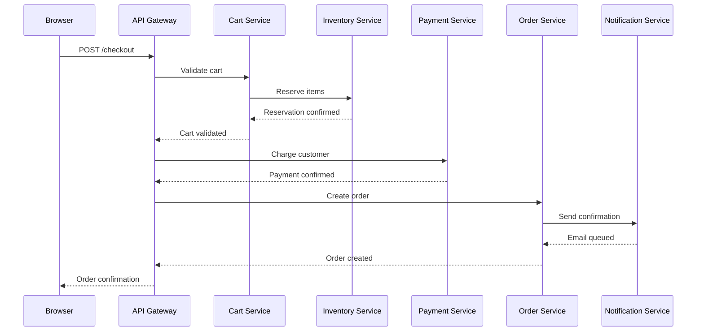

# How to Instrument an E-Commerce Checkout Flow with OpenTelemetry End-to-End

Author: [nawazdhandala](https://www.github.com/nawazdhandala)

Tags: OpenTelemetry, E-Commerce, Distributed Tracing, Checkout, Observability, Node.js, Microservices

Description: Learn how to instrument an e-commerce checkout flow end-to-end with OpenTelemetry, covering cart validation, payment, inventory, and order confirmation across microservices.

---

The checkout flow is the most critical path in any e-commerce application. When a customer clicks "Place Order," a cascade of operations fires across multiple services: cart validation, inventory reservation, payment processing, order creation, and confirmation. If any of those steps fails silently or runs slowly, you lose revenue. The tricky part is that these operations span multiple services, databases, and external APIs, making it hard to understand what actually happened during a failed or slow checkout.

OpenTelemetry gives you the tools to trace every step of that flow as a single, connected transaction. This guide walks through instrumenting a realistic checkout pipeline so you can see exactly where time is spent and where failures occur.

## Checkout Flow Architecture

A typical checkout involves several services working together. Here is what the flow looks like:



Each arrow in that diagram represents a network call that can fail or slow down. Our goal is to have a single trace that follows the request from the browser all the way through every service.

## Setting Up the OpenTelemetry SDK

Before instrumenting individual services, you need a shared SDK setup. Every service in the checkout flow will use a similar initialization pattern. Here is the setup for a Node.js service:

```javascript
// tracing.js - Shared OpenTelemetry initialization for all checkout services
const { NodeSDK } = require('@opentelemetry/sdk-node');
const { OTLPTraceExporter } = require('@opentelemetry/exporter-trace-otlp-grpc');
const { OTLPMetricExporter } = require('@opentelemetry/exporter-metrics-otlp-grpc');
const { PeriodicExportingMetricReader } = require('@opentelemetry/sdk-metrics');
const { HttpInstrumentation } = require('@opentelemetry/instrumentation-http');
const { ExpressInstrumentation } = require('@opentelemetry/instrumentation-express');
const { PgInstrumentation } = require('@opentelemetry/instrumentation-pg');
const { Resource } = require('@opentelemetry/resources');
const {
  ATTR_SERVICE_NAME,
  ATTR_SERVICE_VERSION,
  ATTR_DEPLOYMENT_ENVIRONMENT,
} = require('@opentelemetry/semantic-conventions');

// Initialize the SDK with service-specific resource attributes
function initTracing(serviceName) {
  const sdk = new NodeSDK({
    resource: new Resource({
      [ATTR_SERVICE_NAME]: serviceName,
      [ATTR_SERVICE_VERSION]: process.env.APP_VERSION || '1.0.0',
      [ATTR_DEPLOYMENT_ENVIRONMENT]: process.env.NODE_ENV || 'development',
    }),
    // Send traces to the OpenTelemetry Collector
    traceExporter: new OTLPTraceExporter({
      url: process.env.OTEL_EXPORTER_OTLP_ENDPOINT || 'http://otel-collector:4317',
    }),
    metricReader: new PeriodicExportingMetricReader({
      exporter: new OTLPMetricExporter({
        url: process.env.OTEL_EXPORTER_OTLP_ENDPOINT || 'http://otel-collector:4317',
      }),
      // Export metrics every 30 seconds
      exportIntervalMillis: 30000,
    }),
    // Auto-instrument HTTP, Express, and PostgreSQL
    instrumentations: [
      new HttpInstrumentation(),
      new ExpressInstrumentation(),
      new PgInstrumentation(),
    ],
  });

  sdk.start();
  return sdk;
}

module.exports = { initTracing };
```

This initialization file gets imported at the very top of each service's entry point, before any other imports. The auto-instrumentation libraries handle HTTP calls and database queries automatically, but the real value comes from the manual spans we will add for business logic.

## Instrumenting the Cart Validation Step

The cart service validates the customer's cart before checkout proceeds. This includes checking that items are still available, prices have not changed, and the cart total is correct. Here is how to wrap that logic in meaningful spans:

```javascript
// cart-service/checkout.js
const { trace, SpanStatusCode } = require('@opentelemetry/api');

// Get a tracer named after this service module
const tracer = trace.getTracer('cart-service', '1.0.0');

async function validateCart(cartId, userId) {
  // Create a span that covers the entire cart validation process
  return tracer.startActiveSpan('cart.validate', async (span) => {
    try {
      // Record business context as span attributes
      span.setAttribute('cart.id', cartId);
      span.setAttribute('user.id', userId);

      // Fetch cart contents from the database
      const cart = await tracer.startActiveSpan('cart.fetch_contents', async (fetchSpan) => {
        const result = await db.query('SELECT * FROM cart_items WHERE cart_id = $1', [cartId]);
        fetchSpan.setAttribute('cart.item_count', result.rows.length);
        fetchSpan.end();
        return result.rows;
      });

      // Validate each item's price and availability
      await tracer.startActiveSpan('cart.verify_prices', async (priceSpan) => {
        let staleCount = 0;
        for (const item of cart) {
          const currentPrice = await catalogService.getPrice(item.product_id);
          if (currentPrice !== item.unit_price) {
            staleCount++;
            // Add an event to flag the price discrepancy
            priceSpan.addEvent('price_mismatch', {
              'product.id': item.product_id,
              'price.expected': item.unit_price,
              'price.actual': currentPrice,
            });
          }
        }
        priceSpan.setAttribute('cart.stale_prices', staleCount);
        priceSpan.end();

        if (staleCount > 0) {
          throw new Error(`${staleCount} items have outdated prices`);
        }
      });

      // Reserve inventory through the inventory service
      const reservation = await reserveInventory(cart);
      span.setAttribute('inventory.reservation_id', reservation.id);

      span.setStatus({ code: SpanStatusCode.OK });
      return { cart, reservation };
    } catch (error) {
      // Record the error on the span so it shows up in traces
      span.setStatus({ code: SpanStatusCode.ERROR, message: error.message });
      span.recordException(error);
      throw error;
    } finally {
      span.end();
    }
  });
}
```

The key details here are the semantic attributes. Recording `cart.id`, `user.id`, and `cart.item_count` means you can later search for traces by customer or filter for large carts that might be slower to validate. The price mismatch events create a detailed audit trail without creating separate spans for every item.

## Instrumenting Inventory Reservation

The inventory service needs to atomically reserve stock so two customers do not purchase the last item simultaneously. This is a critical section that benefits from detailed tracing:

```javascript
// inventory-service/reserve.js
const { trace, SpanStatusCode, context, propagation } = require('@opentelemetry/api');

const tracer = trace.getTracer('inventory-service', '1.0.0');

async function reserveItems(items) {
  return tracer.startActiveSpan('inventory.reserve_batch', async (span) => {
    span.setAttribute('inventory.item_count', items.length);
    const reservations = [];

    for (const item of items) {
      // Each item reservation gets its own child span
      await tracer.startActiveSpan('inventory.reserve_item', async (itemSpan) => {
        itemSpan.setAttribute('product.id', item.productId);
        itemSpan.setAttribute('quantity.requested', item.quantity);

        try {
          // Use a database transaction with row-level locking
          const result = await db.transaction(async (tx) => {
            // SELECT FOR UPDATE locks the row to prevent race conditions
            const stock = await tx.query(
              'SELECT available_qty FROM inventory WHERE product_id = $1 FOR UPDATE',
              [item.productId]
            );

            if (stock.rows[0].available_qty < item.quantity) {
              // Not enough stock - record this as a span event
              itemSpan.addEvent('insufficient_stock', {
                'available': stock.rows[0].available_qty,
                'requested': item.quantity,
              });
              throw new Error(`Insufficient stock for product ${item.productId}`);
            }

            // Decrement available quantity and create reservation record
            await tx.query(
              'UPDATE inventory SET available_qty = available_qty - $1 WHERE product_id = $2',
              [item.quantity, item.productId]
            );

            const reservation = await tx.query(
              'INSERT INTO reservations (product_id, quantity, expires_at) VALUES ($1, $2, NOW() + interval \'15 minutes\') RETURNING id',
              [item.productId, item.quantity]
            );

            return reservation.rows[0];
          });

          itemSpan.setAttribute('reservation.id', result.id);
          itemSpan.setStatus({ code: SpanStatusCode.OK });
          reservations.push(result);
        } catch (error) {
          itemSpan.setStatus({ code: SpanStatusCode.ERROR, message: error.message });
          itemSpan.recordException(error);
          throw error;
        } finally {
          itemSpan.end();
        }
      });
    }

    span.setAttribute('inventory.reservations_created', reservations.length);
    span.setStatus({ code: SpanStatusCode.OK });
    span.end();
    return reservations;
  });
}
```

Notice how each item reservation is a separate child span. If one item out of twenty causes a slow query due to row-level locking contention, you will see exactly which product caused the delay. The `insufficient_stock` event is especially useful for understanding why checkouts fail.

## Instrumenting the Payment Step

Payment processing involves an external API call, which introduces unpredictable latency and failure modes. You want to capture as much context as possible without logging sensitive card data:

```javascript
// payment-service/charge.js
const { trace, SpanStatusCode, SpanKind } = require('@opentelemetry/api');
const { SemanticAttributes } = require('@opentelemetry/semantic-conventions');

const tracer = trace.getTracer('payment-service', '1.0.0');

async function processPayment(orderId, amount, currency, paymentMethodId) {
  // Mark this as a CLIENT span since we are calling an external service
  return tracer.startActiveSpan('payment.process', { kind: SpanKind.CLIENT }, async (span) => {
    span.setAttribute('order.id', orderId);
    span.setAttribute('payment.amount', amount);
    span.setAttribute('payment.currency', currency);
    // Never log the full payment method ID or card details
    span.setAttribute('payment.method_type', 'card');

    try {
      // Call the payment gateway with timeout handling
      const startTime = Date.now();
      const result = await tracer.startActiveSpan('payment.gateway_call', {
        kind: SpanKind.CLIENT,
        attributes: {
          'peer.service': 'stripe-api',
          'http.method': 'POST',
          'http.url': 'https://api.stripe.com/v1/charges',
        },
      }, async (gatewaySpan) => {
        try {
          const response = await stripeClient.charges.create({
            amount: Math.round(amount * 100),
            currency: currency,
            payment_method: paymentMethodId,
            confirm: true,
          });

          gatewaySpan.setAttribute('payment.gateway_latency_ms', Date.now() - startTime);
          gatewaySpan.setAttribute('payment.charge_id', response.id);
          gatewaySpan.setAttribute('payment.status', response.status);
          gatewaySpan.setStatus({ code: SpanStatusCode.OK });
          return response;
        } catch (error) {
          gatewaySpan.setAttribute('payment.gateway_latency_ms', Date.now() - startTime);
          gatewaySpan.setAttribute('payment.decline_code', error.decline_code || 'unknown');
          gatewaySpan.setStatus({ code: SpanStatusCode.ERROR, message: error.message });
          gatewaySpan.recordException(error);
          throw error;
        } finally {
          gatewaySpan.end();
        }
      });

      span.setAttribute('payment.charge_id', result.id);
      span.setStatus({ code: SpanStatusCode.OK });
      return result;
    } catch (error) {
      span.setStatus({ code: SpanStatusCode.ERROR, message: error.message });
      span.recordException(error);
      throw error;
    } finally {
      span.end();
    }
  });
}
```

The `payment.gateway_latency_ms` attribute is critical. Payment gateways sometimes have variable latency, and you need to know whether slowness is on your side or theirs. Recording the `decline_code` on failed payments lets you distinguish between soft declines (retry-worthy) and hard declines (permanent failures).

## Connecting the Full Checkout Trace

The API gateway orchestrates the entire checkout. This is where context propagation ties everything together into a single trace:

```javascript
// api-gateway/checkout.js
const { trace, SpanStatusCode } = require('@opentelemetry/api');

const tracer = trace.getTracer('api-gateway', '1.0.0');

app.post('/api/checkout', async (req, res) => {
  // The HTTP instrumentation creates the root span automatically.
  // We create a child span for the business logic.
  return tracer.startActiveSpan('checkout.process', async (span) => {
    const { cartId, userId, paymentMethodId } = req.body;
    span.setAttribute('cart.id', cartId);
    span.setAttribute('user.id', userId);
    span.setAttribute('checkout.step', 'initiated');

    try {
      // Step 1: Validate cart and reserve inventory
      span.setAttribute('checkout.step', 'validating_cart');
      const { cart, reservation } = await cartClient.validateCart(cartId, userId);
      span.addEvent('cart_validated', { 'cart.item_count': cart.length });

      // Step 2: Calculate final total
      const total = cart.reduce((sum, item) => sum + item.unit_price * item.quantity, 0);
      span.setAttribute('checkout.total', total);
      span.setAttribute('checkout.item_count', cart.length);

      // Step 3: Process payment
      span.setAttribute('checkout.step', 'processing_payment');
      const payment = await paymentClient.processPayment(
        reservation.id, total, 'usd', paymentMethodId
      );
      span.addEvent('payment_processed', { 'payment.charge_id': payment.id });

      // Step 4: Create order record
      span.setAttribute('checkout.step', 'creating_order');
      const order = await orderClient.createOrder({
        userId, cartId, reservationId: reservation.id,
        paymentId: payment.id, total,
      });
      span.addEvent('order_created', { 'order.id': order.id });

      // Step 5: Send confirmation (async, do not block the response)
      span.setAttribute('checkout.step', 'complete');
      notificationClient.sendConfirmation(order.id, userId).catch((err) => {
        // Log but do not fail checkout if notification fails
        console.error('Notification failed:', err);
      });

      span.setStatus({ code: SpanStatusCode.OK });
      span.setAttribute('order.id', order.id);
      res.json({ orderId: order.id, status: 'confirmed' });
    } catch (error) {
      span.setStatus({ code: SpanStatusCode.ERROR, message: error.message });
      span.recordException(error);
      span.setAttribute('checkout.failure_step', span.attributes?.['checkout.step']);
      res.status(500).json({ error: error.message });
    } finally {
      span.end();
    }
  });
});
```

The `checkout.step` attribute updates as the flow progresses. If the span ends in an error, `checkout.failure_step` tells you exactly which step failed. This is far more useful than just knowing "the checkout failed."

## Collector Configuration

All these services send telemetry to an OpenTelemetry Collector that processes and exports the data:

```yaml
# otel-collector-config.yaml
receivers:
  otlp:
    protocols:
      grpc:
        endpoint: 0.0.0.0:4317
      http:
        endpoint: 0.0.0.0:4318

processors:
  # Prevent out-of-memory crashes under load
  memory_limiter:
    check_interval: 1s
    limit_mib: 1024
    spike_limit_mib: 256

  # Batch telemetry for efficient export
  batch:
    timeout: 5s
    send_batch_size: 512

  # Add checkout-specific resource attributes
  resource:
    attributes:
      - key: platform
        value: ecommerce
        action: upsert

exporters:
  otlp:
    endpoint: your-observability-backend:4317
    tls:
      insecure: false

service:
  pipelines:
    traces:
      receivers: [otlp]
      processors: [memory_limiter, resource, batch]
      exporters: [otlp]
    metrics:
      receivers: [otlp]
      processors: [memory_limiter, resource, batch]
      exporters: [otlp]
```

## Custom Checkout Metrics

Beyond traces, you should track checkout-specific metrics for dashboards and alerting:

```javascript
// metrics/checkout-metrics.js
const { metrics } = require('@opentelemetry/api');

const meter = metrics.getMeter('checkout-metrics', '1.0.0');

// Counter for completed checkouts, partitioned by status
const checkoutCounter = meter.createCounter('checkout.completed', {
  description: 'Number of completed checkout attempts',
});

// Histogram for checkout duration across all steps
const checkoutDuration = meter.createHistogram('checkout.duration_ms', {
  description: 'Total checkout duration in milliseconds',
  unit: 'ms',
});

// Histogram for individual step durations
const stepDuration = meter.createHistogram('checkout.step_duration_ms', {
  description: 'Duration of individual checkout steps',
  unit: 'ms',
});

// Track a checkout attempt
function recordCheckout(status, durationMs, itemCount) {
  checkoutCounter.add(1, { 'checkout.status': status });
  checkoutDuration.record(durationMs, {
    'checkout.status': status,
    'checkout.item_count_bucket': itemCount > 10 ? 'large' : 'small',
  });
}

// Track an individual step
function recordStep(stepName, durationMs, status) {
  stepDuration.record(durationMs, {
    'checkout.step': stepName,
    'step.status': status,
  });
}

module.exports = { recordCheckout, recordStep };
```

These metrics complement your traces. While traces show you what happened in a single checkout, metrics show you patterns across thousands of checkouts. A spike in `checkout.step_duration_ms` for the payment step tells you to dig into traces for that time window.

## Debugging a Slow Checkout

With this instrumentation in place, debugging becomes straightforward. Suppose your alerting fires because checkout p99 latency exceeded 8 seconds. You query your traces backend for slow checkout traces and find one that took 9.2 seconds. The trace waterfall shows:

```
checkout.process                    [=====================================] 9.2s
  cart.validate                     [=====]                                1.1s
    cart.fetch_contents             [==]                                   0.3s
    cart.verify_prices              [==]                                   0.6s
  inventory.reserve_batch           [=]                                    0.2s
  payment.process                   [===========================]          7.1s
    payment.gateway_call            [==========================]           6.9s
  order.create                      [=]                                    0.3s
```

The trace makes it obvious: the payment gateway call took 6.9 seconds. The `peer.service: stripe-api` attribute confirms this is external latency, not something in your code. You can then check the payment provider's status page or adjust your timeout configuration.

## Conclusion

Instrumenting an e-commerce checkout flow with OpenTelemetry requires a structured approach: initialize the SDK consistently across services, add manual spans for business logic, record meaningful attributes for filtering and debugging, and connect everything through context propagation. The investment pays off immediately when the first checkout incident hits and you can pinpoint the failing step in seconds rather than hours. Start with the critical path, get traces flowing, and then expand coverage to edge cases and background processes.
