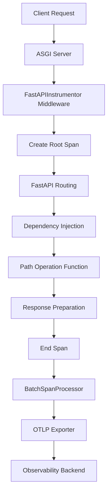

# How to Instrument FastAPI with OpenTelemetry FastAPIInstrumentor

Author: [nawazdhandala](https://www.github.com/nawazdhandala)

Tags: OpenTelemetry, FastAPI, Python, FastAPIInstrumentor, ASGI, Tracing

Description: Comprehensive guide to automatically instrumenting FastAPI applications with OpenTelemetry FastAPIInstrumentor for distributed tracing and observability.

FastAPI has rapidly become a preferred framework for building high-performance Python APIs, thanks to its async capabilities, automatic validation, and excellent developer experience. As FastAPI applications grow and serve production traffic, observability becomes critical. OpenTelemetry's FastAPIInstrumentor provides automatic instrumentation that captures request traces, performance metrics, and error information without requiring changes to your application logic.

## Understanding FastAPI and ASGI Instrumentation

FastAPI is built on Starlette, an ASGI framework. Unlike WSGI frameworks like Flask, ASGI supports asynchronous request handling, allowing a single server process to handle thousands of concurrent connections. This architectural difference affects how instrumentation works.

The FastAPIInstrumentor hooks into the ASGI lifecycle, intercepting requests as they enter your application and responses as they leave. Because FastAPI uses async/await patterns, the instrumentation must properly handle asynchronous context propagation to ensure spans remain correctly associated with their requests across async boundaries.

## Installation and Setup

Start by installing the necessary OpenTelemetry packages for FastAPI instrumentation.

```bash
# Install core OpenTelemetry packages
pip install opentelemetry-api opentelemetry-sdk

# Install FastAPI instrumentation
pip install opentelemetry-instrumentation-fastapi

# Install ASGI instrumentation (dependency for FastAPI)
pip install opentelemetry-instrumentation-asgi

# Install exporters
pip install opentelemetry-exporter-otlp
```

The FastAPI instrumentation builds on top of the ASGI instrumentation, adding FastAPI-specific features like route parameter extraction and dependency injection awareness.

## Basic FastAPI Application Instrumentation

Here's a complete example showing how to instrument a FastAPI application from scratch.

```python
from fastapi import FastAPI, HTTPException
from opentelemetry import trace
from opentelemetry.sdk.trace import TracerProvider
from opentelemetry.sdk.trace.export import BatchSpanProcessor
from opentelemetry.exporter.otlp.proto.grpc.trace_exporter import OTLPSpanExporter
from opentelemetry.instrumentation.fastapi import FastAPIInstrumentor
from opentelemetry.sdk.resources import Resource

# Create FastAPI application
app = FastAPI(title="FastAPI OpenTelemetry Example")

# Configure OpenTelemetry with service metadata
resource = Resource(attributes={
    "service.name": "fastapi-service",
    "service.version": "1.0.0",
    "deployment.environment": "production"
})

# Set up tracer provider
provider = TracerProvider(resource=resource)
trace.set_tracer_provider(provider)

# Configure OTLP exporter
otlp_exporter = OTLPSpanExporter(
    endpoint="http://localhost:4317",
    insecure=True
)

# Add span processor for batch export
span_processor = BatchSpanProcessor(otlp_exporter)
provider.add_span_processor(span_processor)

# Instrument FastAPI application
FastAPIInstrumentor.instrument_app(app)

# Define endpoints
@app.get("/")
async def root():
    return {"message": "Hello World"}

@app.get("/api/users/{user_id}")
async def get_user(user_id: int):
    if user_id < 0:
        raise HTTPException(status_code=400, detail="Invalid user ID")
    return {"user_id": user_id, "name": f"User {user_id}"}

@app.post("/api/users")
async def create_user(name: str, email: str):
    return {"id": 123, "name": name, "email": email}

# Run with: uvicorn main:app --reload
```

This code automatically creates spans for every HTTP request. Span names follow the pattern `HTTP {method} {route}`, such as `HTTP GET /api/users/{user_id}`.

## Understanding the Instrumentation Flow

The following diagram shows how FastAPIInstrumentor integrates with the request lifecycle:



## Instrumenting with Request and Response Hooks

FastAPIInstrumentor supports hooks that let you customize span attributes based on request and response data.

```python
from fastapi import FastAPI, Request
from opentelemetry.instrumentation.fastapi import FastAPIInstrumentor
from opentelemetry import trace

app = FastAPI()

def server_request_hook(span, scope):
    """
    Called when a request starts, before path operation
    Args:
        span: The current span being processed
        scope: ASGI scope dict containing request information
    """
    if span and span.is_recording():
        # Add custom attributes from request
        span.set_attribute("http.client_ip", scope.get("client", ["unknown"])[0])
        span.set_attribute("http.scheme", scope.get("scheme", "http"))

        # Extract custom headers
        headers = dict(scope.get("headers", []))
        user_agent = headers.get(b"user-agent", b"").decode("utf-8")
        span.set_attribute("http.user_agent", user_agent)

        # Add request ID if present
        request_id = headers.get(b"x-request-id", b"").decode("utf-8")
        if request_id:
            span.set_attribute("request.id", request_id)

def client_request_hook(span, scope):
    """
    Called for outgoing requests made by the application
    """
    if span and span.is_recording():
        span.set_attribute("custom.hook", "client_request")

def client_response_hook(span, message):
    """
    Called when outgoing request receives response
    """
    if span and span.is_recording():
        span.set_attribute("custom.hook", "client_response")

# Instrument with hooks
FastAPIInstrumentor.instrument_app(
    app,
    server_request_hook=server_request_hook,
    client_request_hook=client_request_hook,
    client_response_hook=client_response_hook
)

@app.get("/api/data")
async def get_data():
    return {"data": [1, 2, 3]}
```

These hooks execute at specific points in the request lifecycle, giving you fine-grained control over telemetry data.

## Working with FastAPI Dependencies

FastAPI's dependency injection system is powerful. You can create dependencies that add tracing context.

```python
from fastapi import FastAPI, Depends, Header
from opentelemetry import trace
from typing import Optional

app = FastAPI()
tracer = trace.get_tracer(__name__)

# Dependency that adds user context to span
async def get_current_user(authorization: Optional[str] = Header(None)):
    """Extract user from auth header and add to trace"""
    span = trace.get_current_span()

    if authorization:
        # Parse auth header (simplified)
        user_id = authorization.split("Bearer ")[-1]
        span.set_attribute("user.id", user_id)
        span.set_attribute("user.authenticated", True)
        return {"user_id": user_id}
    else:
        span.set_attribute("user.authenticated", False)
        return None

# Dependency that tracks database connections
async def get_db_connection():
    """Track database connection in span"""
    span = trace.get_current_span()
    span.set_attribute("db.connection", "acquired")

    with tracer.start_as_current_span("database.connect"):
        # Simulate connection
        connection = {"connected": True}

    try:
        yield connection
    finally:
        with tracer.start_as_current_span("database.disconnect"):
            # Simulate disconnection
            span.set_attribute("db.connection", "released")

@app.get("/api/profile")
async def get_profile(
    user: dict = Depends(get_current_user),
    db = Depends(get_db_connection)
):
    """Get user profile with dependency-injected tracing"""
    if not user:
        return {"error": "Unauthorized"}, 401

    with tracer.start_as_current_span("profile.fetch") as span:
        span.set_attribute("user.id", user["user_id"])
        profile = {"user_id": user["user_id"], "name": "John Doe"}

    return profile
```

Dependencies execute before your path operation function, and any spans created within them become children of the HTTP request span.

## Async Operations and Context Propagation

FastAPI's async nature requires careful attention to context propagation. OpenTelemetry handles this automatically, but understanding how it works helps with debugging.

```python
from fastapi import FastAPI
from opentelemetry import trace
import asyncio
import httpx

app = FastAPI()
tracer = trace.get_tracer(__name__)

@app.get("/api/aggregate")
async def aggregate_data():
    """
    Fetch data from multiple sources concurrently
    Context propagates correctly across async operations
    """

    with tracer.start_as_current_span("aggregate.fetch_all") as span:
        # Launch multiple concurrent operations
        results = await asyncio.gather(
            fetch_users(),
            fetch_products(),
            fetch_orders()
        )

        span.set_attribute("aggregate.sources", 3)
        span.set_attribute("aggregate.total_items", sum(len(r) for r in results))

    return {
        "users": results[0],
        "products": results[1],
        "orders": results[2]
    }

async def fetch_users():
    """Fetch users with tracing"""
    with tracer.start_as_current_span("external.fetch_users") as span:
        span.set_attribute("service.name", "user-service")
        # Simulate async operation
        await asyncio.sleep(0.1)
        span.set_attribute("result.count", 5)
        return [{"id": i} for i in range(5)]

async def fetch_products():
    """Fetch products with tracing"""
    with tracer.start_as_current_span("external.fetch_products") as span:
        span.set_attribute("service.name", "product-service")
        await asyncio.sleep(0.15)
        span.set_attribute("result.count", 10)
        return [{"id": i} for i in range(10)]

async def fetch_orders():
    """Fetch orders with tracing"""
    with tracer.start_as_current_span("external.fetch_orders") as span:
        span.set_attribute("service.name", "order-service")
        await asyncio.sleep(0.08)
        span.set_attribute("result.count", 3)
        return [{"id": i} for i in range(3)]

@app.get("/api/external")
async def call_external_api():
    """Make external HTTP request with context propagation"""
    with tracer.start_as_current_span("external.api.call") as span:
        span.set_attribute("http.url", "https://api.example.com/data")

        # httpx automatically propagates trace context
        async with httpx.AsyncClient() as client:
            response = await client.get("https://api.example.com/data")
            span.set_attribute("http.status_code", response.status_code)

        return {"status": response.status_code}
```

The tracer context automatically propagates across await points and async operations, ensuring spans remain correctly associated with their parent request.

## Background Tasks with Tracing

FastAPI supports background tasks that run after the response is sent. Tracing these requires special handling.

```python
from fastapi import FastAPI, BackgroundTasks
from opentelemetry import trace
from opentelemetry.trace import set_span_in_context
import asyncio

app = FastAPI()
tracer = trace.get_tracer(__name__)

async def send_notification(user_id: int, message: str):
    """Background task with tracing"""
    # Background tasks run outside the request span
    # Create a new span for the background work
    with tracer.start_as_current_span("background.send_notification") as span:
        span.set_attribute("user.id", user_id)
        span.set_attribute("notification.type", "email")

        # Simulate sending notification
        await asyncio.sleep(2)

        span.set_attribute("notification.status", "sent")

async def process_order(order_id: int):
    """Complex background task with multiple spans"""
    with tracer.start_as_current_span("background.process_order") as span:
        span.set_attribute("order.id", order_id)

        with tracer.start_as_current_span("order.validate"):
            await asyncio.sleep(0.5)

        with tracer.start_as_current_span("order.charge_payment"):
            await asyncio.sleep(1)

        with tracer.start_as_current_span("order.update_inventory"):
            await asyncio.sleep(0.3)

        span.set_attribute("order.status", "completed")

@app.post("/api/orders")
async def create_order(
    user_id: int,
    background_tasks: BackgroundTasks
):
    """Create order and process in background"""
    order_id = 12345

    # Add background tasks
    background_tasks.add_task(process_order, order_id)
    background_tasks.add_task(send_notification, user_id, "Order created")

    # Return immediately
    return {"order_id": order_id, "status": "processing"}
```

Background tasks create separate trace spans that aren't children of the HTTP request span, since they execute after the response is sent.

## Exception Handling and Error Tracking

FastAPIInstrumentor automatically captures exceptions and marks spans as errors. Enhance this with custom error handling.

```python
from fastapi import FastAPI, HTTPException, Request
from fastapi.responses import JSONResponse
from opentelemetry import trace
from opentelemetry.trace import Status, StatusCode

app = FastAPI()
tracer = trace.get_tracer(__name__)

class DatabaseError(Exception):
    """Custom database exception"""
    pass

@app.exception_handler(DatabaseError)
async def database_exception_handler(request: Request, exc: DatabaseError):
    """Handle database errors with tracing"""
    span = trace.get_current_span()
    span.record_exception(exc)
    span.set_status(Status(StatusCode.ERROR, "Database error"))
    span.set_attribute("error.type", "DatabaseError")

    return JSONResponse(
        status_code=503,
        content={"error": "Database unavailable"}
    )

@app.get("/api/users/{user_id}")
async def get_user(user_id: int):
    """Get user with error handling"""
    span = trace.get_current_span()
    span.set_attribute("user.id", user_id)

    try:
        with tracer.start_as_current_span("database.query") as db_span:
            db_span.set_attribute("db.operation", "SELECT")

            if user_id < 0:
                raise ValueError("Invalid user ID")

            if user_id > 1000:
                raise DatabaseError("Database connection failed")

            user = {"id": user_id, "name": f"User {user_id}"}

        return user

    except ValueError as e:
        span.record_exception(e)
        span.set_status(Status(StatusCode.ERROR, str(e)))
        raise HTTPException(status_code=400, detail=str(e))
    except DatabaseError:
        # Handled by exception handler
        raise
```

## Excluding Endpoints from Tracing

Like Flask, you can exclude certain endpoints from tracing to reduce noise and costs.

```python
from fastapi import FastAPI
from opentelemetry.instrumentation.fastapi import FastAPIInstrumentor

app = FastAPI()

# Health check endpoint
@app.get("/health")
async def health_check():
    return {"status": "healthy"}

# Metrics endpoint
@app.get("/metrics")
async def metrics():
    return {"requests": 1000}

# Business endpoint
@app.get("/api/data")
async def get_data():
    return {"data": [1, 2, 3]}

# Instrument with exclusions
FastAPIInstrumentor.instrument_app(
    app,
    excluded_urls="/health,/metrics"
)
```

The excluded_urls parameter accepts a comma-separated list of URL patterns to skip.

## Environment-Based Configuration

Configure instrumentation using environment variables for flexible deployment.

```python
import os
from fastapi import FastAPI
from opentelemetry import trace
from opentelemetry.sdk.trace import TracerProvider
from opentelemetry.sdk.trace.export import BatchSpanProcessor
from opentelemetry.exporter.otlp.proto.grpc.trace_exporter import OTLPSpanExporter
from opentelemetry.instrumentation.fastapi import FastAPIInstrumentor
from opentelemetry.sdk.resources import Resource

app = FastAPI()

# Read configuration from environment
service_name = os.getenv("OTEL_SERVICE_NAME", "fastapi-service")
otlp_endpoint = os.getenv("OTEL_EXPORTER_OTLP_ENDPOINT", "http://localhost:4317")
environment = os.getenv("DEPLOYMENT_ENVIRONMENT", "development")
tracing_enabled = os.getenv("OTEL_TRACING_ENABLED", "true").lower() == "true"

if tracing_enabled:
    # Configure tracing
    resource = Resource(attributes={
        "service.name": service_name,
        "deployment.environment": environment
    })

    provider = TracerProvider(resource=resource)
    trace.set_tracer_provider(provider)

    otlp_exporter = OTLPSpanExporter(endpoint=otlp_endpoint, insecure=True)
    provider.add_span_processor(BatchSpanProcessor(otlp_exporter))

    # Instrument FastAPI
    FastAPIInstrumentor.instrument_app(app)

@app.get("/api/data")
async def get_data():
    return {"data": [1, 2, 3]}
```

Set environment variables when running your application:

```bash
export OTEL_SERVICE_NAME="api-gateway"
export OTEL_EXPORTER_OTLP_ENDPOINT="https://otel-collector.example.com:4317"
export DEPLOYMENT_ENVIRONMENT="production"
export OTEL_TRACING_ENABLED="true"

uvicorn main:app --host 0.0.0.0 --port 8000
```

## Performance Optimization

FastAPI applications often handle high request volumes. Optimize tracing for performance:

```python
from opentelemetry.sdk.trace.export import BatchSpanProcessor
from opentelemetry.sdk.trace.sampling import TraceIdRatioBased

# Sample 10% of traces in high-traffic scenarios
sampler = TraceIdRatioBased(0.1)
provider = TracerProvider(resource=resource, sampler=sampler)

# Tune batch processor
span_processor = BatchSpanProcessor(
    otlp_exporter,
    max_queue_size=4096,         # Larger queue for high throughput
    schedule_delay_millis=3000,   # Export every 3 seconds
    max_export_batch_size=1024    # Larger batches
)
provider.add_span_processor(span_processor)
```

FastAPIInstrumentor provides seamless automatic instrumentation for FastAPI applications, handling the complexity of ASGI and async context propagation. By combining automatic instrumentation with custom spans, hooks, and proper configuration, you gain deep visibility into your FastAPI application's behavior, enabling effective monitoring, debugging, and performance optimization in production environments.
