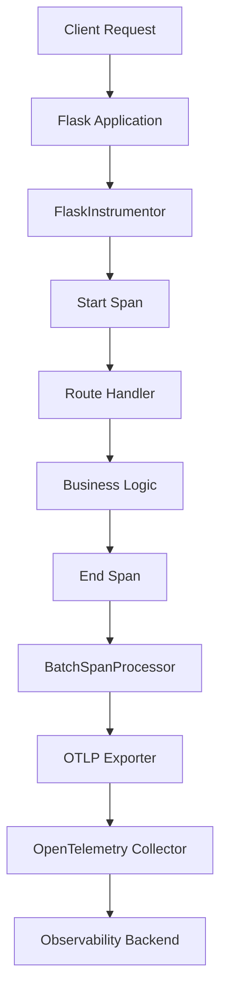

# How to Instrument Flask Applications with OpenTelemetry FlaskInstrumentor

Author: [nawazdhandala](https://www.github.com/nawazdhandala)

Tags: OpenTelemetry, Flask, Python, FlaskInstrumentor, Auto-Instrumentation

Description: Complete guide to automatically instrumenting Flask applications with OpenTelemetry FlaskInstrumentor for distributed tracing and observability.

Flask remains one of the most popular Python web frameworks, powering countless APIs and web applications. When running Flask apps in production, understanding request flows, performance bottlenecks, and error patterns becomes critical. OpenTelemetry provides automatic instrumentation for Flask through the FlaskInstrumentor, making it straightforward to add observability without modifying your application logic.

## Understanding FlaskInstrumentor

The FlaskInstrumentor is part of the OpenTelemetry instrumentation ecosystem. It automatically wraps Flask's request handling to create spans for each HTTP request, capturing essential metadata like HTTP method, URL path, status codes, and response times. This happens transparently, requiring minimal code changes to your existing Flask application.

The instrumentation works by hooking into Flask's request lifecycle. When a request arrives, a span starts. As your application processes the request through routes, middleware, and templates, the span remains active. When the response is sent, the span ends with all captured telemetry data.

## Installation and Dependencies

Before instrumenting your Flask application, you need to install the required packages. The FlaskInstrumentor lives in a separate package from the core OpenTelemetry SDK.

```bash
# Install core OpenTelemetry packages
pip install opentelemetry-api opentelemetry-sdk

# Install Flask instrumentation
pip install opentelemetry-instrumentation-flask

# Install exporters (OTLP is the standard)
pip install opentelemetry-exporter-otlp
```

These packages provide everything needed: the instrumentation library hooks into Flask, the SDK processes telemetry data, and the exporter sends data to your observability backend.

## Basic Flask Application Instrumentation

Here's a complete example showing how to instrument a simple Flask application. The key is calling `FlaskInstrumentor().instrument_app()` with your Flask app instance.

```python
from flask import Flask, jsonify
from opentelemetry import trace
from opentelemetry.sdk.trace import TracerProvider
from opentelemetry.sdk.trace.export import BatchSpanProcessor
from opentelemetry.exporter.otlp.proto.grpc.trace_exporter import OTLPSpanExporter
from opentelemetry.instrumentation.flask import FlaskInstrumentor
from opentelemetry.sdk.resources import Resource

# Create a Flask application
app = Flask(__name__)

# Configure OpenTelemetry with service information
resource = Resource(attributes={
    "service.name": "flask-api",
    "service.version": "1.0.0",
    "deployment.environment": "production"
})

# Set up the tracer provider
provider = TracerProvider(resource=resource)
trace.set_tracer_provider(provider)

# Configure OTLP exporter to send traces
otlp_exporter = OTLPSpanExporter(
    endpoint="http://localhost:4317",
    insecure=True
)

# Use BatchSpanProcessor for better performance
span_processor = BatchSpanProcessor(otlp_exporter)
provider.add_span_processor(span_processor)

# Instrument the Flask app automatically
FlaskInstrumentor().instrument_app(app)

# Define your routes as normal
@app.route('/api/users')
def get_users():
    users = [
        {"id": 1, "name": "Alice"},
        {"id": 2, "name": "Bob"}
    ]
    return jsonify(users)

@app.route('/api/users/<int:user_id>')
def get_user(user_id):
    user = {"id": user_id, "name": f"User {user_id}"}
    return jsonify(user)

if __name__ == '__main__':
    app.run(debug=True, port=5000)
```

This code automatically creates spans for every request. The span names follow the pattern `HTTP {method} {route}`, such as `HTTP GET /api/users`.

## Architecture Flow

The following diagram illustrates how FlaskInstrumentor integrates with your application:



## Capturing Request and Response Data

By default, FlaskInstrumentor captures standard HTTP attributes. You can configure it to capture additional data like headers, query parameters, or request/response bodies.

```python
from opentelemetry.instrumentation.flask import FlaskInstrumentor

# Configure instrumentation with custom options
FlaskInstrumentor().instrument_app(
    app,
    excluded_urls="/health,/metrics",  # Skip these endpoints
    request_hook=request_hook,
    response_hook=response_hook
)

def request_hook(span, environ):
    """Called when a request starts, before route handler"""
    if span and span.is_recording():
        # Add custom attributes from the request
        span.set_attribute("http.user_agent", environ.get("HTTP_USER_AGENT", ""))
        span.set_attribute("http.client_ip", environ.get("REMOTE_ADDR", ""))

def response_hook(span, status, response_headers):
    """Called when response is ready, before sending to client"""
    if span and span.is_recording():
        # Add response-specific attributes
        content_type = dict(response_headers).get("Content-Type", "")
        span.set_attribute("http.response.content_type", content_type)
```

These hooks give you fine-grained control over what telemetry data gets captured. The request hook runs before your route handler, while the response hook runs after.

## Working with Flask Application Factory Pattern

Many Flask applications use the application factory pattern. Instrumentation works seamlessly with this approach.

```python
from flask import Flask
from opentelemetry.instrumentation.flask import FlaskInstrumentor

def create_app(config_name='development'):
    """Application factory function"""
    app = Flask(__name__)
    app.config.from_object(config_name)

    # Register blueprints
    from .api import api_blueprint
    from .auth import auth_blueprint
    app.register_blueprint(api_blueprint, url_prefix='/api')
    app.register_blueprint(auth_blueprint, url_prefix='/auth')

    # Instrument after all configuration and blueprints
    FlaskInstrumentor().instrument_app(app)

    return app

# In your main entry point
app = create_app('production')

if __name__ == '__main__':
    app.run()
```

The critical point is to call `instrument_app()` after registering all blueprints and configuring the application. This ensures all routes get instrumented properly.

## Adding Custom Spans Within Routes

While automatic instrumentation handles HTTP-level tracing, you often want to trace specific operations within your route handlers. Combine automatic and manual instrumentation for complete visibility.

```python
from flask import Flask, jsonify
from opentelemetry import trace

app = Flask(__name__)
tracer = trace.get_tracer(__name__)

@app.route('/api/complex-operation')
def complex_operation():
    # The HTTP request span is created automatically

    # Add a custom span for database operation
    with tracer.start_as_current_span("database.query") as db_span:
        db_span.set_attribute("db.system", "postgresql")
        db_span.set_attribute("db.statement", "SELECT * FROM users")
        users = fetch_users_from_db()

    # Add another span for external API call
    with tracer.start_as_current_span("external.api.call") as api_span:
        api_span.set_attribute("http.url", "https://api.example.com/data")
        external_data = call_external_api()

    # Process and return results
    result = process_data(users, external_data)
    return jsonify(result)

def fetch_users_from_db():
    # Simulate database query
    return [{"id": 1, "name": "Alice"}]

def call_external_api():
    # Simulate external API call
    return {"status": "success"}

def process_data(users, external_data):
    return {"users": users, "external": external_data}
```

These nested spans appear as children of the HTTP request span, giving you a hierarchical view of your application's execution.

## Handling Errors and Exceptions

FlaskInstrumentor automatically captures exceptions and marks spans as errors. You can enhance this with additional context.

```python
from flask import Flask, jsonify
from opentelemetry import trace
from opentelemetry.trace import Status, StatusCode

app = Flask(__name__)
tracer = trace.get_tracer(__name__)

@app.route('/api/risky-operation')
def risky_operation():
    current_span = trace.get_current_span()

    try:
        result = perform_risky_operation()
        return jsonify({"result": result})
    except ValueError as e:
        # Span is automatically marked as error
        # Add additional context
        current_span.set_attribute("error.type", "ValueError")
        current_span.set_attribute("error.message", str(e))
        current_span.record_exception(e)
        return jsonify({"error": str(e)}), 400
    except Exception as e:
        # Record unexpected errors
        current_span.record_exception(e)
        current_span.set_status(Status(StatusCode.ERROR, str(e)))
        return jsonify({"error": "Internal server error"}), 500

def perform_risky_operation():
    # Simulate an operation that might fail
    import random
    if random.random() < 0.3:
        raise ValueError("Operation failed randomly")
    return "success"
```

## Environment Variables Configuration

Instead of hardcoding configuration in your application, use environment variables for flexible deployment.

```python
import os
from flask import Flask
from opentelemetry import trace
from opentelemetry.sdk.trace import TracerProvider
from opentelemetry.sdk.trace.export import BatchSpanProcessor
from opentelemetry.exporter.otlp.proto.grpc.trace_exporter import OTLPSpanExporter
from opentelemetry.instrumentation.flask import FlaskInstrumentor
from opentelemetry.sdk.resources import Resource

app = Flask(__name__)

# Read configuration from environment
service_name = os.getenv("OTEL_SERVICE_NAME", "flask-api")
otlp_endpoint = os.getenv("OTEL_EXPORTER_OTLP_ENDPOINT", "http://localhost:4317")
environment = os.getenv("DEPLOYMENT_ENVIRONMENT", "development")

# Configure tracing
resource = Resource(attributes={
    "service.name": service_name,
    "deployment.environment": environment
})

provider = TracerProvider(resource=resource)
trace.set_tracer_provider(provider)

otlp_exporter = OTLPSpanExporter(endpoint=otlp_endpoint, insecure=True)
provider.add_span_processor(BatchSpanProcessor(otlp_exporter))

# Instrument Flask
FlaskInstrumentor().instrument_app(app)

@app.route('/health')
def health():
    return {"status": "healthy"}

if __name__ == '__main__':
    app.run()
```

Set these environment variables when running your application:

```bash
export OTEL_SERVICE_NAME="user-service"
export OTEL_EXPORTER_OTLP_ENDPOINT="https://otel-collector.example.com:4317"
export DEPLOYMENT_ENVIRONMENT="production"

python app.py
```

## Performance Considerations

Instrumentation adds minimal overhead, but be mindful of these factors:

1. **Sampling**: In high-traffic applications, trace every request might generate too much data. Configure sampling to capture a representative subset.

2. **Batch Processing**: The BatchSpanProcessor buffers spans and sends them in batches, reducing network overhead compared to exporting each span immediately.

3. **Excluded URLs**: Health checks and metrics endpoints often run frequently. Exclude them from tracing to reduce noise and storage costs.

4. **Span Processor Configuration**: Tune batch size and timeout values based on your traffic patterns.

```python
from opentelemetry.sdk.trace.export import BatchSpanProcessor

# Configure batch processor with custom settings
span_processor = BatchSpanProcessor(
    otlp_exporter,
    max_queue_size=2048,        # Maximum spans to queue
    schedule_delay_millis=5000,  # Export every 5 seconds
    max_export_batch_size=512    # Spans per batch
)
provider.add_span_processor(span_processor)
```

## Verifying Instrumentation

After instrumenting your Flask application, verify that traces are being generated and exported correctly. Make a few requests to your application and check your observability backend for traces. Each request should create a span with attributes like:

- `http.method`: GET, POST, etc.
- `http.route`: The Flask route pattern
- `http.status_code`: Response status
- `http.url`: Full request URL

You can also enable debug logging to see what OpenTelemetry is doing:

```python
import logging

logging.basicConfig(level=logging.DEBUG)
logging.getLogger("opentelemetry").setLevel(logging.DEBUG)
```

FlaskInstrumentor provides a powerful way to gain observability into your Flask applications with minimal effort. The automatic instrumentation handles the common cases, while hooks and custom spans let you capture application-specific details. Combined with proper configuration and monitoring, you get production-ready tracing that helps you understand and debug your application's behavior in real-time.
