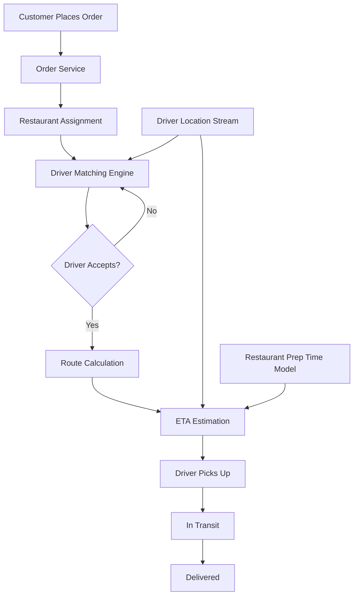

# How to Instrument Food Delivery Dispatch Systems with OpenTelemetry

Author: [nawazdhandala](https://www.github.com/nawazdhandala)

Tags: OpenTelemetry, Food Delivery, Dispatch, Logistics, Tracing, Metrics, Real-time Systems, Geolocation

Description: Learn how to instrument food delivery dispatch systems with OpenTelemetry to trace order assignment, driver tracking, ETA calculation, and delivery lifecycle with practical code examples.

---

Food delivery dispatch systems are among the most operationally complex backends you can build. A single order triggers a cascade of real-time decisions: which restaurant prepares it fastest, which driver is closest, what is the optimal route, and how do you keep the customer informed with accurate ETAs. When any part of this chain breaks, food arrives late and customers do not come back.

Traditional request/response monitoring does not capture the full lifecycle of an order from placement through delivery. OpenTelemetry gives you the tools to trace that entire lifecycle and measure each decision point.

---

## Dispatch System Architecture

A typical food delivery dispatch system looks something like this:



Each box in this diagram is a potential failure point or source of latency. The driver matching engine might struggle during peak hours. The ETA model might give wildly inaccurate predictions. The restaurant might take longer than expected. Your monitoring needs to cover all of it.

---

## Setting Up the Telemetry Foundation

Since dispatch involves long-running operations (an order lifecycle can span 30 to 60 minutes), you need to think about span duration differently than a typical web service:

```python
# pip install opentelemetry-api opentelemetry-sdk opentelemetry-exporter-otlp

from opentelemetry import trace, metrics
from opentelemetry.sdk.trace import TracerProvider
from opentelemetry.sdk.trace.export import BatchSpanProcessor
from opentelemetry.sdk.metrics import MeterProvider
from opentelemetry.sdk.metrics.export import PeriodicExportingMetricReader
from opentelemetry.exporter.otlp.proto.grpc.trace_exporter import OTLPSpanExporter
from opentelemetry.exporter.otlp.proto.grpc.metric_exporter import OTLPMetricExporter
from opentelemetry.sdk.resources import Resource

resource = Resource.create({
    "service.name": "dispatch-service",
    "service.version": "5.1.0",
    "deployment.environment": "production",
})

# Tracing setup
trace_provider = TracerProvider(resource=resource)
trace_provider.add_span_processor(
    BatchSpanProcessor(
        OTLPSpanExporter(endpoint="otel-collector:4317"),
        max_export_batch_size=512,  # Larger batches for high throughput
        schedule_delay_millis=5000,
    )
)
trace.set_tracer_provider(trace_provider)

# Metrics setup
metric_reader = PeriodicExportingMetricReader(
    OTLPMetricExporter(endpoint="otel-collector:4317"),
    export_interval_millis=10000,
)
meter_provider = MeterProvider(resource=resource, metric_readers=[metric_reader])
metrics.set_meter_provider(meter_provider)

tracer = trace.get_tracer("dispatch.service")
meter = metrics.get_meter("dispatch.service")
```

For dispatch specifically, you do not want to create a single span that covers the entire order lifecycle (that could be an hour long). Instead, create separate spans for each phase and link them together using the order ID as an attribute.

---

## Tracing Order Creation and Restaurant Assignment

When a customer places an order, the first dispatch decision is which restaurant to assign it to (for chains with multiple locations) or to confirm that the restaurant can accept it:

```python
# Order lifecycle metrics
orders_created = meter.create_counter(
    name="dispatch.orders.created_total",
    description="Total orders created",
)

restaurant_assignment_latency = meter.create_histogram(
    name="dispatch.restaurant.assignment_latency",
    description="Time to assign an order to a restaurant",
    unit="ms",
)

restaurant_rejection_counter = meter.create_counter(
    name="dispatch.restaurant.rejections_total",
    description="Restaurant order rejections",
)

def create_order(order_request, customer):
    """Create a new delivery order and assign it to a restaurant."""
    with tracer.start_as_current_span(
        "dispatch.order.create",
        attributes={
            "dispatch.order_id": order_request.order_id,
            "dispatch.customer_id": customer.id,
            "dispatch.restaurant_id": order_request.restaurant_id,
            "dispatch.item_count": len(order_request.items),
            "dispatch.order_value_cents": order_request.total_cents,
            "dispatch.delivery_address.zone": customer.delivery_zone,
        },
    ) as span:
        orders_created.add(1, {
            "dispatch.zone": customer.delivery_zone,
        })

        # Confirm the restaurant can accept the order
        with tracer.start_as_current_span(
            "dispatch.restaurant.confirm",
            attributes={
                "dispatch.restaurant_id": order_request.restaurant_id,
            },
        ) as confirm_span:
            confirmation = restaurant_api.confirm_order(
                order_request.restaurant_id, order_request.items
            )

            confirm_span.set_attribute(
                "dispatch.restaurant.accepted", confirmation.accepted
            )
            confirm_span.set_attribute(
                "dispatch.restaurant.estimated_prep_minutes",
                confirmation.prep_time_minutes,
            )

            if not confirmation.accepted:
                restaurant_rejection_counter.add(1, {
                    "dispatch.restaurant_id": order_request.restaurant_id,
                    "dispatch.rejection_reason": confirmation.reason,
                })
                span.add_event("restaurant_rejected", {
                    "reason": confirmation.reason,
                })
                raise OrderRejectedError(confirmation.reason)

        # Order is confirmed, start driver matching
        order = Order.create(order_request, confirmation)
        initiate_driver_matching(order)

        return order
```

The restaurant prep time estimate recorded here is important because it feeds into the ETA model later. If restaurants consistently underestimate their prep time, you will see it when comparing the estimated prep time attribute against actual pickup timestamps.

---

## Instrumenting the Driver Matching Engine

Driver matching is the core of the dispatch system. It needs to find the best available driver based on proximity, current load, and historical performance:

```python
# Driver matching metrics
driver_match_latency = meter.create_histogram(
    name="dispatch.driver.match_latency",
    description="Time to find and confirm a driver",
    unit="ms",
)

driver_offers_sent = meter.create_counter(
    name="dispatch.driver.offers_sent_total",
    description="Driver assignment offers sent",
)

driver_offer_rejections = meter.create_counter(
    name="dispatch.driver.offer_rejections_total",
    description="Driver assignment offers rejected",
)

active_drivers_gauge = meter.create_up_down_counter(
    name="dispatch.driver.active_count",
    description="Currently active drivers by zone",
    unit="drivers",
)

def initiate_driver_matching(order):
    """Find the best available driver for an order."""
    with tracer.start_as_current_span(
        "dispatch.driver.matching",
        attributes={
            "dispatch.order_id": order.id,
            "dispatch.restaurant.location": order.restaurant.location_str,
            "dispatch.delivery.zone": order.delivery_zone,
        },
    ) as span:
        attempt = 0
        max_attempts = 5

        while attempt < max_attempts:
            attempt += 1

            # Find nearby available drivers
            with tracer.start_as_current_span(
                "dispatch.driver.search_nearby",
                attributes={
                    "dispatch.attempt": attempt,
                    "dispatch.search_radius_km": get_search_radius(attempt),
                },
            ) as search_span:
                candidates = driver_pool.find_nearby(
                    location=order.restaurant.location,
                    radius_km=get_search_radius(attempt),
                    max_results=10,
                )
                search_span.set_attribute(
                    "dispatch.driver.candidates_found", len(candidates)
                )

            if not candidates:
                span.add_event("no_candidates_found", {"attempt": attempt})
                continue

            # Score and rank candidates
            scored = driver_scorer.rank(candidates, order)

            # Offer to the best candidate
            best_driver = scored[0]
            with tracer.start_as_current_span(
                "dispatch.driver.send_offer",
                attributes={
                    "dispatch.driver_id": best_driver.id,
                    "dispatch.driver.distance_km": round(best_driver.distance_km, 2),
                    "dispatch.driver.current_orders": best_driver.active_order_count,
                },
            ) as offer_span:
                driver_offers_sent.add(1, {"dispatch.zone": order.delivery_zone})

                # Wait for driver to accept or reject (with timeout)
                response = driver_comms.send_offer(
                    best_driver.id, order, timeout_seconds=30
                )

                offer_span.set_attribute("dispatch.driver.accepted", response.accepted)

                if response.accepted:
                    span.set_attribute("dispatch.driver.final_id", best_driver.id)
                    span.set_attribute("dispatch.driver.match_attempts", attempt)
                    assign_driver(order, best_driver)
                    return

                driver_offer_rejections.add(1, {
                    "dispatch.zone": order.delivery_zone,
                    "dispatch.rejection_reason": response.reason,
                })

        # All attempts exhausted
        span.set_attribute("dispatch.driver.match_failed", True)
        escalate_unmatched_order(order)
```

The expanding search radius pattern (where each attempt searches a larger area) is common in dispatch systems. By tracking the attempt number and radius, you can see how often orders need multiple attempts and whether your driver coverage is thin in certain zones.

---

## Tracking ETA Accuracy

ETA accuracy is one of the most important quality metrics for a food delivery service. Customers base their decisions on the promised ETA, and consistent misses erode trust:

```python
# ETA metrics
eta_accuracy = meter.create_histogram(
    name="dispatch.eta.accuracy_minutes",
    description="Difference between estimated and actual delivery time",
    unit="minutes",
)

eta_calculations = meter.create_counter(
    name="dispatch.eta.calculations_total",
    description="ETA calculations performed",
)

def calculate_eta(order, driver):
    """Calculate estimated delivery time for an order."""
    with tracer.start_as_current_span(
        "dispatch.eta.calculate",
        attributes={
            "dispatch.order_id": order.id,
            "dispatch.driver_id": driver.id,
        },
    ) as span:
        # Component 1: Driver travel time to restaurant
        with tracer.start_as_current_span("dispatch.eta.driver_to_restaurant") as leg1:
            pickup_eta = routing_service.estimate_travel_time(
                origin=driver.current_location,
                destination=order.restaurant.location,
            )
            leg1.set_attribute("dispatch.eta.pickup_minutes", pickup_eta.minutes)

        # Component 2: Restaurant preparation time
        with tracer.start_as_current_span("dispatch.eta.prep_time") as prep_span:
            prep_estimate = prep_time_model.predict(
                restaurant_id=order.restaurant.id,
                item_count=order.item_count,
                current_load=order.restaurant.current_order_count,
            )
            prep_span.set_attribute("dispatch.eta.prep_minutes", prep_estimate.minutes)

        # Component 3: Driver travel time from restaurant to customer
        with tracer.start_as_current_span("dispatch.eta.restaurant_to_customer") as leg2:
            delivery_eta = routing_service.estimate_travel_time(
                origin=order.restaurant.location,
                destination=order.delivery_address,
            )
            leg2.set_attribute("dispatch.eta.delivery_minutes", delivery_eta.minutes)

        # Driver might arrive before food is ready
        wait_at_restaurant = max(0, prep_estimate.minutes - pickup_eta.minutes)
        total_minutes = pickup_eta.minutes + wait_at_restaurant + delivery_eta.minutes
        buffer = eta_buffer_model.get_buffer(order.delivery_zone)

        span.set_attribute("dispatch.eta.total_minutes", round(total_minutes + buffer, 1))
        eta_calculations.add(1, {"dispatch.zone": order.delivery_zone})

        return ETAResult(total_minutes=total_minutes + buffer)
```

Breaking the ETA into components (pickup travel, prep time, delivery travel) as separate spans lets you identify which component is most often wrong. Maybe your routing service is accurate but the prep time model consistently underestimates during dinner rush.

---

## Monitoring the Delivery Lifecycle

Once a driver is assigned, track the order through pickup and delivery with key lifecycle metrics:

```python
# Delivery lifecycle metrics
pickup_wait_time = meter.create_histogram(
    name="dispatch.delivery.pickup_wait_minutes",
    description="Time driver waits at restaurant for order",
    unit="minutes",
)

delivery_completion_time = meter.create_histogram(
    name="dispatch.delivery.total_minutes",
    description="Total time from order placement to delivery",
    unit="minutes",
)

late_deliveries = meter.create_counter(
    name="dispatch.delivery.late_total",
    description="Deliveries that exceeded the promised ETA",
)

def record_delivery_complete(order_id, driver_id):
    """Record that the order has been delivered to the customer."""
    with tracer.start_as_current_span(
        "dispatch.delivery.completed",
        attributes={
            "dispatch.order_id": order_id,
            "dispatch.driver_id": driver_id,
        },
    ) as span:
        order = order_store.get(order_id)
        total_minutes = (time.time() - order.created_at) / 60.0

        delivery_completion_time.record(
            total_minutes, {"dispatch.zone": order.delivery_zone}
        )

        # Check if we met the promised ETA
        eta_diff = total_minutes - order.promised_eta_minutes
        eta_accuracy.record(eta_diff, {"dispatch.zone": order.delivery_zone})

        span.set_attribute("dispatch.total_delivery_minutes", round(total_minutes, 1))
        span.set_attribute("dispatch.eta_diff_minutes", round(eta_diff, 1))
        span.set_attribute("dispatch.on_time", eta_diff <= 0)

        if eta_diff > 0:
            late_deliveries.add(1, {
                "dispatch.zone": order.delivery_zone,
                "dispatch.late_bucket": bucket_lateness(eta_diff),
            })
```

The pickup wait time metric is especially valuable for operations. If drivers consistently wait at a particular restaurant, that restaurant is either slow to prepare food or has a pickup process that creates delays. This data helps your operations team work with restaurant partners to improve throughput.

---

## Alerting for Dispatch Health

With these metrics flowing, set up alerts for the most critical dispatch issues:

- **Driver match failure rate above 5% in any zone.** Not enough driver coverage; adjust incentives or allocation.
- **Average ETA accuracy worse than 5 minutes late over 30 minutes.** Something systemic is affecting delivery times.
- **Driver offer rejection rate above 40%.** Drivers are unhappy with the orders being offered.
- **Restaurant pickup wait time p75 above 10 minutes.** Drivers spending too much time waiting.

---

## Wrapping Up

Food delivery dispatch systems have a unique monitoring challenge: the "request" is not a quick HTTP call but a 30-to-60 minute lifecycle spanning multiple services and real-world events. By instrumenting each phase with separate OpenTelemetry spans and custom metrics, you get visibility into every decision point. The practical value shows up when you can answer "why are deliveries in the downtown zone 8 minutes late?" and trace the answer to a specific restaurant or a routing model that underestimates rush hour traffic.
