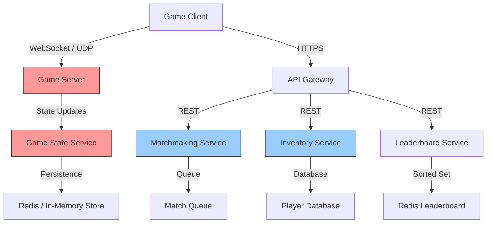

# How to Instrument a Gaming Backend for Low-Latency Monitoring

Author: [nawazdhandala](https://www.github.com/nawazdhandala)

Tags: OpenTelemetry, Gaming, Low Latency, Performance Monitoring, Distributed Tracing, Metrics, Real-Time

Description: A practical guide to instrumenting a gaming backend with OpenTelemetry for low-latency monitoring, covering game loop tracing, matchmaking metrics, and player session observability.

---

Gaming backends operate under latency constraints that most web applications never face. When a player fires a weapon in a multiplayer game, the round-trip time from client to server and back needs to stay under 50 milliseconds for the experience to feel responsive. A matchmaking system that takes 30 seconds instead of 5 causes players to quit. An inventory transaction that occasionally drops items destroys player trust.

The challenge with observability in gaming is that traditional instrumentation approaches add too much overhead. You cannot wrap every game tick in a distributed trace without tanking your frame rate. OpenTelemetry provides the flexibility to instrument selectively, measuring what matters without slowing down the critical path. This guide covers how to instrument a gaming backend's key subsystems while keeping the performance impact minimal.

## Gaming Backend Architecture

A typical multiplayer gaming backend has several distinct subsystems, each with different latency requirements:



The game server and game state service (red) have hard latency budgets under 10 milliseconds per tick. The matchmaking, inventory, and leaderboard services (blue) are more tolerant but still need to be fast. Our instrumentation strategy differs for each tier.

## SDK Setup with Low Overhead

The OpenTelemetry SDK setup for a gaming backend needs aggressive batching and sampling to minimize the performance impact on game ticks:

```go
// otel_init.go
package observability

import (
    "context"
    "time"

    "go.opentelemetry.io/otel"
    "go.opentelemetry.io/otel/exporters/otlp/otlptrace/otlptracegrpc"
    "go.opentelemetry.io/otel/exporters/otlp/otlpmetric/otlpmetricgrpc"
    "go.opentelemetry.io/otel/sdk/metric"
    "go.opentelemetry.io/otel/sdk/resource"
    "go.opentelemetry.io/otel/sdk/trace"
    semconv "go.opentelemetry.io/otel/semconv/v1.24.0"
)

func InitTelemetry(ctx context.Context, serviceName string) (func(), error) {
    // Define the service resource
    res, err := resource.New(ctx,
        resource.WithAttributes(
            semconv.ServiceName(serviceName),
            semconv.ServiceVersion("2.1.0"),
            semconv.DeploymentEnvironment("production"),
        ),
    )
    if err != nil {
        return nil, err
    }

    // Trace exporter with connection pooling for low latency
    traceExporter, err := otlptracegrpc.New(ctx,
        otlptracegrpc.WithEndpoint("otel-collector:4317"),
        otlptracegrpc.WithInsecure(),
    )
    if err != nil {
        return nil, err
    }

    // Use a batch span processor with aggressive batching
    // to minimize export overhead during game ticks
    bsp := trace.NewBatchSpanProcessor(traceExporter,
        // Export every 5 seconds or when 512 spans accumulate
        trace.WithBatchTimeout(5*time.Second),
        trace.WithMaxExportBatchSize(512),
        // Large queue to absorb bursts without blocking
        trace.WithMaxQueueSize(8192),
    )

    // Sample only 10% of normal game ticks but 100% of errors
    sampler := trace.ParentBased(
        trace.TraceIDRatioBased(0.10),
    )

    tp := trace.NewTracerProvider(
        trace.WithResource(res),
        trace.WithSpanProcessor(bsp),
        trace.WithSampler(sampler),
    )
    otel.SetTracerProvider(tp)

    // Metric exporter with periodic export
    metricExporter, err := otlpmetricgrpc.New(ctx,
        otlpmetricgrpc.WithEndpoint("otel-collector:4317"),
        otlpmetricgrpc.WithInsecure(),
    )
    if err != nil {
        return nil, err
    }

    mp := metric.NewMeterProvider(
        metric.WithResource(res),
        metric.WithReader(metric.NewPeriodicReader(
            metricExporter,
            // Export metrics every 15 seconds to reduce overhead
            metric.WithInterval(15*time.Second),
        )),
    )
    otel.SetMeterProvider(mp)

    // Return a cleanup function
    cleanup := func() {
        tp.Shutdown(ctx)
        mp.Shutdown(ctx)
    }
    return cleanup, nil
}
```

Two critical choices here. First, the 10% sampling rate for normal operations keeps trace volume manageable for high-frequency game ticks. Second, the large queue size (8192) ensures that the batch processor never blocks the game loop waiting for export capacity. Dropped spans are better than added latency.

## Instrumenting the Game Loop

The game loop runs at a fixed tick rate, typically 20 to 60 times per second. You cannot trace every tick, but you should measure tick duration and detect outliers:

```go
// game_loop.go
package gameserver

import (
    "context"
    "time"

    "go.opentelemetry.io/otel"
    "go.opentelemetry.io/otel/attribute"
    "go.opentelemetry.io/otel/metric"
)

var (
    meter        = otel.Meter("game-server")
    // Histogram for tick duration to track frame time distribution
    tickDuration metric.Float64Histogram
    // Counter for ticks that exceeded the budget
    tickOverruns metric.Int64Counter
    // Gauge for current player count on this server
    playerCount  metric.Int64UpDownCounter
)

func init() {
    var err error
    tickDuration, err = meter.Float64Histogram(
        "game.tick.duration",
        metric.WithDescription("Duration of a single game tick"),
        metric.WithUnit("ms"),
        // Custom bucket boundaries tuned for game tick timing
        // Most ticks should be under 16ms (60fps budget)
        metric.WithExplicitBucketBoundaries(
            1, 2, 4, 8, 12, 16, 20, 33, 50, 100,
        ),
    )
    if err != nil {
        panic(err)
    }

    tickOverruns, _ = meter.Int64Counter(
        "game.tick.overruns",
        metric.WithDescription("Number of ticks that exceeded the time budget"),
    )

    playerCount, _ = meter.Int64UpDownCounter(
        "game.players.active",
        metric.WithDescription("Number of active players on this server"),
    )
}

func RunGameLoop(ctx context.Context, tickRate time.Duration) {
    ticker := time.NewTicker(tickRate)
    defer ticker.Stop()

    for {
        select {
        case <-ctx.Done():
            return
        case <-ticker.C:
            start := time.Now()

            // Process one game tick
            processTick(ctx)

            elapsed := time.Since(start)
            elapsedMs := float64(elapsed.Microseconds()) / 1000.0

            // Record tick duration in the histogram
            tickDuration.Record(ctx, elapsedMs, metric.WithAttributes(
                attribute.String("game.mode", "battle_royale"),
                attribute.String("game.map", currentMap),
            ))

            // Count overruns when tick exceeds budget
            if elapsed > tickRate {
                tickOverruns.Add(ctx, 1, metric.WithAttributes(
                    attribute.String("game.mode", "battle_royale"),
                    attribute.Float64("tick.duration_ms", elapsedMs),
                ))
            }
        }
    }
}
```

Notice that the game loop uses metrics only, not traces. Creating a span for every tick at 60 ticks per second per server would generate an enormous amount of data with little value. Metrics with custom bucket boundaries give you the latency distribution you need to detect performance problems.

The bucket boundaries `1, 2, 4, 8, 12, 16, 20, 33, 50, 100` are deliberately chosen. For a 60fps game, the tick budget is 16.67ms. Most ticks should land in the 4-16ms buckets. Ticks hitting the 33ms or 50ms buckets indicate a problem. The 100ms bucket catches catastrophic stalls.

## Tracing Matchmaking

Matchmaking is a good candidate for full tracing because it runs at lower frequency (players queue once per session) and the latency directly impacts player experience:

```go
// matchmaking.go
package matchmaking

import (
    "context"
    "time"

    "go.opentelemetry.io/otel"
    "go.opentelemetry.io/otel/attribute"
    "go.opentelemetry.io/otel/codes"
    "go.opentelemetry.io/otel/metric"
    otelTrace "go.opentelemetry.io/otel/trace"
)

var (
    tracer            = otel.Tracer("matchmaking-service")
    meterMM           = otel.Meter("matchmaking-service")
    matchmakingTime   metric.Float64Histogram
    matchesCreated    metric.Int64Counter
    queueSize         metric.Int64UpDownCounter
    matchQuality      metric.Float64Histogram
)

func init() {
    matchmakingTime, _ = meterMM.Float64Histogram(
        "matchmaking.duration",
        metric.WithDescription("Time from queue entry to match found"),
        metric.WithUnit("ms"),
    )
    matchesCreated, _ = meterMM.Int64Counter(
        "matchmaking.matches_created",
        metric.WithDescription("Number of matches successfully created"),
    )
    queueSize, _ = meterMM.Int64UpDownCounter(
        "matchmaking.queue_size",
        metric.WithDescription("Current number of players in matchmaking queue"),
    )
    matchQuality, _ = meterMM.Float64Histogram(
        "matchmaking.quality_score",
        metric.WithDescription("Quality score of created matches (0-1)"),
    )
}

func FindMatch(ctx context.Context, player Player) (*Match, error) {
    // Create a span covering the entire matchmaking process
    ctx, span := tracer.Start(ctx, "matchmaking.find_match",
        otelTrace.WithAttributes(
            attribute.String("player.id", player.ID),
            attribute.Int("player.skill_rating", player.SkillRating),
            attribute.String("game.mode", player.PreferredMode),
            attribute.String("player.region", player.Region),
        ),
    )
    defer span.End()

    startTime := time.Now()
    queueSize.Add(ctx, 1)
    defer queueSize.Add(ctx, -1)

    // Step 1: Find compatible players in the queue
    ctx, searchSpan := tracer.Start(ctx, "matchmaking.search_candidates")
    candidates, err := searchCandidates(ctx, player)
    searchSpan.SetAttributes(
        attribute.Int("candidates.found", len(candidates)),
        attribute.Int("candidates.skill_range",
            player.SkillRating+200) ,
    )
    searchSpan.End()

    if err != nil {
        span.SetStatus(codes.Error, err.Error())
        span.RecordError(err)
        return nil, err
    }

    // Step 2: Score and rank candidates by match quality
    ctx, scoreSpan := tracer.Start(ctx, "matchmaking.score_candidates")
    rankedCandidates := scoreCandidates(player, candidates)
    scoreSpan.SetAttributes(
        attribute.Int("candidates.scored", len(rankedCandidates)),
        attribute.Float64("best_match.quality",
            rankedCandidates[0].QualityScore),
    )
    scoreSpan.End()

    // Step 3: Create the match lobby
    ctx, createSpan := tracer.Start(ctx, "matchmaking.create_lobby")
    match, err := createLobby(ctx, player, rankedCandidates)
    if err != nil {
        createSpan.SetStatus(codes.Error, err.Error())
        createSpan.RecordError(err)
        createSpan.End()
        span.SetStatus(codes.Error, "Failed to create lobby")
        return nil, err
    }
    createSpan.SetAttributes(
        attribute.String("match.id", match.ID),
        attribute.Int("match.player_count", match.PlayerCount),
        attribute.String("match.server_region", match.ServerRegion),
    )
    createSpan.End()

    // Record matchmaking metrics
    durationMs := float64(time.Since(startTime).Milliseconds())
    attrs := metric.WithAttributes(
        attribute.String("game.mode", player.PreferredMode),
        attribute.String("player.region", player.Region),
    )
    matchmakingTime.Record(ctx, durationMs, attrs)
    matchesCreated.Add(ctx, 1, attrs)
    matchQuality.Record(ctx, match.QualityScore, attrs)

    span.SetAttributes(
        attribute.String("match.id", match.ID),
        attribute.Float64("matchmaking.duration_ms", durationMs),
        attribute.Float64("match.quality_score", match.QualityScore),
    )
    span.SetStatus(codes.Ok, "")
    return match, nil
}
```

The matchmaking trace captures every phase: candidate search, scoring, and lobby creation. The `match.quality_score` attribute lets you correlate match quality with player retention. If your match quality drops (perhaps due to a smaller player pool at off-peak hours), you will see it in both the traces and the histogram metric.

## Instrumenting Player Actions and Inventory

Player-facing transactions like purchasing items or trading with other players need reliable tracing because errors here directly impact player satisfaction:

```go
// inventory.go
package inventory

import (
    "context"
    "fmt"

    "go.opentelemetry.io/otel"
    "go.opentelemetry.io/otel/attribute"
    "go.opentelemetry.io/otel/codes"
    otelTrace "go.opentelemetry.io/otel/trace"
)

var tracer = otel.Tracer("inventory-service")

func PurchaseItem(ctx context.Context, playerID string,
    itemID string, currencyType string, price int64) error {

    ctx, span := tracer.Start(ctx, "inventory.purchase",
        otelTrace.WithAttributes(
            attribute.String("player.id", playerID),
            attribute.String("item.id", itemID),
            attribute.String("currency.type", currencyType),
            attribute.Int64("item.price", price),
        ),
    )
    defer span.End()

    // Step 1: Verify player has sufficient currency
    ctx, balanceSpan := tracer.Start(ctx, "inventory.check_balance")
    balance, err := getPlayerBalance(ctx, playerID, currencyType)
    balanceSpan.SetAttributes(
        attribute.Int64("player.balance", balance),
        attribute.Bool("balance.sufficient", balance >= price),
    )
    balanceSpan.End()

    if err != nil {
        span.SetStatus(codes.Error, "Failed to check balance")
        span.RecordError(err)
        return err
    }
    if balance < price {
        span.SetStatus(codes.Error, "Insufficient balance")
        span.AddEvent("purchase_rejected", otelTrace.WithAttributes(
            attribute.String("reason", "insufficient_balance"),
            attribute.Int64("balance", balance),
            attribute.Int64("price", price),
        ))
        return fmt.Errorf("insufficient %s balance: have %d, need %d",
            currencyType, balance, price)
    }

    // Step 2: Deduct currency and grant item atomically
    ctx, txSpan := tracer.Start(ctx, "inventory.execute_transaction")
    err = executeTransaction(ctx, func(tx Transaction) error {
        // Deduct currency
        if err := tx.DeductCurrency(playerID, currencyType, price); err != nil {
            return fmt.Errorf("currency deduction failed: %w", err)
        }
        // Grant item to player
        if err := tx.GrantItem(playerID, itemID); err != nil {
            return fmt.Errorf("item grant failed: %w", err)
        }
        return nil
    })
    txSpan.SetAttributes(attribute.Bool("transaction.success", err == nil))
    txSpan.End()

    if err != nil {
        span.SetStatus(codes.Error, err.Error())
        span.RecordError(err)
        // Record a specific event for transaction failures
        // so we can alert on them separately
        span.AddEvent("transaction_failed", otelTrace.WithAttributes(
            attribute.String("error", err.Error()),
        ))
        return err
    }

    // Step 3: Log the purchase for analytics
    span.AddEvent("purchase_completed", otelTrace.WithAttributes(
        attribute.String("item.id", itemID),
        attribute.Int64("item.price", price),
    ))
    span.SetStatus(codes.Ok, "")
    return nil
}
```

The `transaction_failed` event is important because it represents a case where the player expected to receive an item but did not. These events should trigger alerts because even a small number of failed inventory transactions erodes player trust.

## Real-Time Session Metrics

Track player session metrics to understand server load patterns and detect anomalies:

```go
// session_metrics.go
package gameserver

import (
    "context"
    "time"

    "go.opentelemetry.io/otel"
    "go.opentelemetry.io/otel/attribute"
    "go.opentelemetry.io/otel/metric"
)

var sessionMeter = otel.Meter("game-sessions")

func InitSessionMetrics() {
    // Track session duration distribution
    sessionDuration, _ := sessionMeter.Float64Histogram(
        "game.session.duration",
        metric.WithDescription("Player session duration"),
        metric.WithUnit("s"),
        metric.WithExplicitBucketBoundaries(
            30, 60, 120, 300, 600, 1200, 1800, 3600, 7200,
        ),
    )

    // Track concurrent sessions per server
    concurrentSessions, _ := sessionMeter.Int64UpDownCounter(
        "game.sessions.concurrent",
        metric.WithDescription("Number of concurrent player sessions"),
    )

    // Track network round-trip time per player
    playerRTT, _ := sessionMeter.Float64Histogram(
        "game.player.rtt",
        metric.WithDescription("Player network round-trip time"),
        metric.WithUnit("ms"),
        metric.WithExplicitBucketBoundaries(
            5, 10, 20, 30, 50, 75, 100, 150, 200, 500,
        ),
    )

    // Track server frame rate
    serverFPS, _ := sessionMeter.Float64Histogram(
        "game.server.fps",
        metric.WithDescription("Server simulation frame rate"),
        metric.WithUnit("{frames}/s"),
        metric.WithExplicitBucketBoundaries(
            10, 20, 30, 40, 50, 55, 58, 60,
        ),
    )

    // Register callbacks for async metrics collection
    _ = sessionDuration
    _ = concurrentSessions
    _ = playerRTT
    _ = serverFPS
}

func RecordPlayerRTT(ctx context.Context, playerID string,
    region string, rttMs float64) {
    playerRTT, _ := sessionMeter.Float64Histogram(
        "game.player.rtt",
        metric.WithUnit("ms"),
    )
    playerRTT.Record(ctx, rttMs, metric.WithAttributes(
        attribute.String("player.region", region),
        attribute.String("server.region", serverRegion),
    ))
}
```

The RTT bucket boundaries are tuned for gaming: anything under 20ms is excellent, 20-50ms is acceptable, 50-100ms is noticeable, and over 100ms seriously degrades the experience. The server FPS histogram has boundaries clustered near 60 because you care about the difference between 58 and 55 FPS much more than the difference between 30 and 20.

## Collector Configuration for Gaming Telemetry

The Collector configuration needs to handle the mix of high-frequency metrics and lower-frequency traces from gaming services:

```yaml
# otel-collector-config.yaml
receivers:
  otlp:
    protocols:
      grpc:
        endpoint: 0.0.0.0:4317
        # Increase max message size for batch trace exports
        max_recv_msg_size_mib: 16

processors:
  memory_limiter:
    check_interval: 1s
    limit_mib: 2048
    spike_limit_mib: 512

  # Aggressive batching for high-volume game telemetry
  batch:
    timeout: 10s
    send_batch_size: 1024
    send_batch_max_size: 2048

  # Tail sampling to keep interesting traces
  tail_sampling:
    decision_wait: 5s
    policies:
      # Always keep traces with errors
      - name: errors
        type: status_code
        status_code:
          status_codes: [ERROR]
      # Keep slow matchmaking requests
      - name: slow-matchmaking
        type: latency
        latency:
          threshold_ms: 10000
      # Keep all inventory transactions (lower volume, high value)
      - name: inventory-transactions
        type: string_attribute
        string_attribute:
          key: otel.library.name
          values: ["inventory-service"]
      # Sample 5% of normal game traces
      - name: baseline
        type: probabilistic
        probabilistic:
          sampling_percentage: 5

  # Add gaming-specific resource attributes
  resource:
    attributes:
      - key: platform
        value: gaming
        action: upsert

exporters:
  otlp:
    endpoint: your-backend:4317
    tls:
      insecure: false
    sending_queue:
      enabled: true
      num_consumers: 8
      queue_size: 10000

service:
  pipelines:
    traces:
      receivers: [otlp]
      processors: [memory_limiter, tail_sampling, resource, batch]
      exporters: [otlp]
    metrics:
      receivers: [otlp]
      processors: [memory_limiter, resource, batch]
      exporters: [otlp]
```

The tail sampling policy keeps all inventory transaction traces (since they are low volume but high business value) and all error traces. Normal game tick traces are sampled at 5% to keep volume manageable. The large sending queue (10000) absorbs traffic spikes during peak playing hours.

## Alerting for Gaming Backends

Gaming alerts need to be fast and specific. Here are the rules that catch the problems players actually notice:

```yaml
# alert-rules.yaml
groups:
  - name: gaming_alerts
    rules:
      # Alert when game tick overruns spike
      - alert: GameTickOverruns
        expr: |
          rate(game_tick_overruns_total[2m]) > 5
        for: 1m
        labels:
          severity: critical
        annotations:
          summary: "Game server experiencing tick overruns"
          description: "{{ $value }} tick overruns per second"

      # Alert when player RTT is high for a region
      - alert: HighPlayerLatency
        expr: |
          histogram_quantile(0.95,
            rate(game_player_rtt_bucket[5m])
          ) > 100
        for: 3m
        labels:
          severity: warning
        annotations:
          summary: "High player latency in {{ $labels.player_region }}"

      # Alert when matchmaking is slow
      - alert: SlowMatchmaking
        expr: |
          histogram_quantile(0.95,
            rate(matchmaking_duration_bucket[5m])
          ) > 30000
        for: 5m
        labels:
          severity: warning
        annotations:
          summary: "Matchmaking p95 above 30 seconds"

      # Alert when inventory transactions fail
      - alert: InventoryTransactionFailures
        expr: |
          rate(inventory_transaction_failures_total[5m]) > 0.1
        for: 2m
        labels:
          severity: critical
        annotations:
          summary: "Inventory transaction failures detected"
```

The tick overrun alert has a very short evaluation window (2 minutes) and fires after just 1 minute because tick overruns directly cause visible lag for players. The inventory transaction alert fires on any sustained failure rate because even a small number of failed transactions means players are losing items or currency.

## Performance Impact Considerations

When instrumenting a gaming backend, measure the overhead of your instrumentation itself. Here is a quick benchmark approach:

```go
// bench_test.go
package gameserver

import (
    "context"
    "testing"
    "time"
)

func BenchmarkGameTickWithoutTracing(b *testing.B) {
    ctx := context.Background()
    for i := 0; i < b.N; i++ {
        processTickRaw(ctx)
    }
}

func BenchmarkGameTickWithMetrics(b *testing.B) {
    ctx := context.Background()
    for i := 0; i < b.N; i++ {
        start := time.Now()
        processTickRaw(ctx)
        elapsed := float64(time.Since(start).Microseconds()) / 1000.0
        tickDuration.Record(ctx, elapsed)
    }
}
```

In practice, recording a single histogram measurement adds around 200-500 nanoseconds of overhead, which is negligible compared to a 16ms tick budget. Creating a full trace span is more expensive (1-5 microseconds) but still acceptable at the sampling rates used for game loops.

The real overhead risk is in the export path. If the batch span processor's queue fills up and the exporter blocks, it can stall the game loop. The large queue size (8192) and the fact that the batch processor drops spans rather than blocking when the queue is full prevents this. Always verify this behavior under load in your specific environment.

## Conclusion

Instrumenting a gaming backend with OpenTelemetry requires a tiered approach. Use metrics with custom bucket boundaries for the high-frequency game loop where every microsecond counts. Use full distributed tracing for lower-frequency but high-value operations like matchmaking, inventory transactions, and player session management. Configure aggressive sampling at both the SDK and Collector levels to keep telemetry volume proportional to the insights it provides. The goal is not to trace everything but to measure the things that directly affect player experience: tick timing, matchmaking speed, transaction reliability, and network latency.
