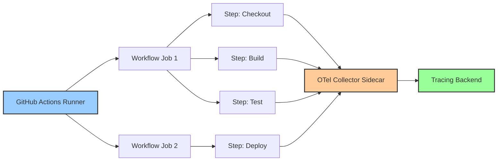

# How to Instrument GitHub Actions Workflows with OpenTelemetry

Author: [nawazdhandala](https://www.github.com/nawazdhandala)

Tags: OpenTelemetry, GitHub Actions, CI/CD, Tracing, Observability, DevOps

Description: Learn how to instrument GitHub Actions workflows with OpenTelemetry to gain full visibility into your CI/CD pipeline performance and failures.

---

CI/CD pipelines are critical infrastructure, but most teams treat them as black boxes. When a build takes 20 minutes instead of the usual 5, or when a deployment fails halfway through, you are stuck scrolling through logs trying to piece together what happened. OpenTelemetry can change that by giving you structured traces for every workflow run, every job, and every step.

This guide walks through instrumenting GitHub Actions workflows with OpenTelemetry so you can trace builds end to end, spot bottlenecks, and debug failures faster.

## Why Trace CI/CD Pipelines

Traditional CI/CD monitoring gives you pass/fail status and maybe some timing data. But modern workflows are complex. They run parallel jobs, call external services, deploy to multiple environments, and trigger downstream pipelines. Without distributed tracing, understanding the actual flow of a pipeline run is painful.

With OpenTelemetry tracing on your GitHub Actions workflows, you get:

- A visual timeline of every job and step in a workflow run
- Accurate duration measurements for each phase
- Error attribution showing exactly which step failed and why
- Correlation between CI events and downstream deployment traces
- Historical data for identifying performance regressions in your build process

## Architecture Overview

The instrumentation approach uses the OpenTelemetry Collector as a sidecar within GitHub Actions, with workflow steps sending trace data via OTLP.



Each workflow run becomes a trace. Each job becomes a child span. Each step becomes a span nested under its job. This hierarchy maps naturally to the way GitHub Actions executes workflows.

## Setting Up the OpenTelemetry Collector in GitHub Actions

The first step is to run an OpenTelemetry Collector as a service container within your workflow. This collector receives spans from your steps and exports them to your backend.

Create a reusable workflow file that starts the collector as a service container alongside your jobs.

```yaml
# .github/workflows/build-with-tracing.yml
# This workflow demonstrates running an OTel Collector as a service container
# so that individual steps can emit trace data during the build.
name: Build with Tracing

on:
  push:
    branches: [main]
  pull_request:
    branches: [main]

jobs:
  build:
    runs-on: ubuntu-latest

    # Service containers run alongside the job
    services:
      otel-collector:
        image: otel/opentelemetry-collector-contrib:latest
        ports:
          # OTLP gRPC receiver
          - 4317:4317
          # OTLP HTTP receiver
          - 4318:4318
        env:
          # Pass the collector config inline via environment variable
          OTEL_CONFIG: |
            receivers:
              otlp:
                protocols:
                  grpc:
                    endpoint: 0.0.0.0:4317
                  http:
                    endpoint: 0.0.0.0:4318
            processors:
              batch:
                timeout: 5s
            exporters:
              otlphttp:
                endpoint: ${{ secrets.OTEL_EXPORTER_ENDPOINT }}
                headers:
                  Authorization: "Bearer ${{ secrets.OTEL_AUTH_TOKEN }}"
            service:
              pipelines:
                traces:
                  receivers: [otlp]
                  processors: [batch]
                  exporters: [otlphttp]

    steps:
      - uses: actions/checkout@v4

      - name: Build
        run: |
          make build

      - name: Test
        run: |
          make test
```

However, a simpler and more practical approach is to use a dedicated GitHub Action that handles the collector setup for you. Let's look at that next.

## Using a Custom Action for Trace Instrumentation

A cleaner approach is to build a composite action that wraps the trace logic. This action starts a span at the beginning of a step and finishes it at the end.

First, create a shell script that sends spans using curl and the OTLP HTTP protocol.

```bash
#!/bin/bash
# scripts/otel-trace.sh
# This script sends a single span to an OTLP HTTP endpoint.
# Usage: otel-trace.sh <span-name> <status> <start-time> <end-time>

SPAN_NAME="$1"
STATUS="$2"
START_TIME="$3"
END_TIME="$4"

# Generate random trace and span IDs in hex format
TRACE_ID="${OTEL_TRACE_ID:-$(openssl rand -hex 16)}"
SPAN_ID="$(openssl rand -hex 8)"
PARENT_SPAN_ID="${OTEL_PARENT_SPAN_ID:-}"

# Convert ISO timestamps to nanoseconds since epoch
START_NANOS=$(date -d "$START_TIME" +%s%N 2>/dev/null || gdate -d "$START_TIME" +%s%N)
END_NANOS=$(date -d "$END_TIME" +%s%N 2>/dev/null || gdate -d "$END_TIME" +%s%N)

# Set the status code based on the result
if [ "$STATUS" = "success" ]; then
  STATUS_CODE=1
else
  STATUS_CODE=2
fi

# Build the OTLP JSON payload
# The nested structure follows the OTLP specification for trace data
PAYLOAD=$(cat <<EOF
{
  "resourceSpans": [{
    "resource": {
      "attributes": [
        {"key": "service.name", "value": {"stringValue": "github-actions"}},
        {"key": "ci.provider", "value": {"stringValue": "github"}},
        {"key": "ci.pipeline.name", "value": {"stringValue": "${GITHUB_WORKFLOW}"}},
        {"key": "ci.pipeline.run.id", "value": {"stringValue": "${GITHUB_RUN_ID}"}}
      ]
    },
    "scopeSpans": [{
      "scope": {"name": "github-actions-tracer", "version": "1.0.0"},
      "spans": [{
        "traceId": "${TRACE_ID}",
        "spanId": "${SPAN_ID}",
        "parentSpanId": "${PARENT_SPAN_ID}",
        "name": "${SPAN_NAME}",
        "kind": 1,
        "startTimeUnixNano": "${START_NANOS}",
        "endTimeUnixNano": "${END_NANOS}",
        "status": {"code": ${STATUS_CODE}},
        "attributes": [
          {"key": "github.repository", "value": {"stringValue": "${GITHUB_REPOSITORY}"}},
          {"key": "github.ref", "value": {"stringValue": "${GITHUB_REF}"}},
          {"key": "github.sha", "value": {"stringValue": "${GITHUB_SHA}"}},
          {"key": "github.actor", "value": {"stringValue": "${GITHUB_ACTOR}"}},
          {"key": "github.event_name", "value": {"stringValue": "${GITHUB_EVENT_NAME}"}}
        ]
      }]
    }]
  }]
}
EOF
)

# Send the span to the OTLP HTTP endpoint
curl -s -X POST "${OTEL_EXPORTER_OTLP_ENDPOINT}/v1/traces" \
  -H "Content-Type: application/json" \
  -H "Authorization: Bearer ${OTEL_AUTH_TOKEN}" \
  -d "${PAYLOAD}"
```

This script builds a well-formed OTLP JSON payload and posts it to any OTLP-compatible endpoint. The key detail is maintaining the trace ID across steps so all spans in a workflow run are grouped into a single trace.

## Instrumenting a Full Workflow

Now let's put it all together in a complete workflow that traces every step.

```yaml
# .github/workflows/traced-pipeline.yml
# Each step records its start time, runs the actual work, then sends a span
# with the timing data to the OTLP endpoint.
name: Traced CI Pipeline

on:
  push:
    branches: [main]

env:
  OTEL_EXPORTER_OTLP_ENDPOINT: ${{ secrets.OTEL_EXPORTER_ENDPOINT }}
  OTEL_AUTH_TOKEN: ${{ secrets.OTEL_AUTH_TOKEN }}

jobs:
  build-and-test:
    runs-on: ubuntu-latest
    steps:
      - uses: actions/checkout@v4

      # Generate a trace ID that will be shared across all steps in this job
      - name: Initialize Tracing
        id: trace-init
        run: |
          # Create a single trace ID for the entire workflow run
          echo "OTEL_TRACE_ID=$(openssl rand -hex 16)" >> $GITHUB_ENV
          echo "JOB_SPAN_ID=$(openssl rand -hex 8)" >> $GITHUB_ENV
          echo "JOB_START=$(date -u +%Y-%m-%dT%H:%M:%SZ)" >> $GITHUB_ENV

      - name: Install Dependencies
        run: |
          STEP_START=$(date -u +%Y-%m-%dT%H:%M:%SZ)
          npm ci
          STEP_END=$(date -u +%Y-%m-%dT%H:%M:%SZ)
          export OTEL_PARENT_SPAN_ID=${{ env.JOB_SPAN_ID }}
          bash scripts/otel-trace.sh "install-dependencies" "success" "$STEP_START" "$STEP_END"

      - name: Lint
        run: |
          STEP_START=$(date -u +%Y-%m-%dT%H:%M:%SZ)
          npm run lint
          STEP_END=$(date -u +%Y-%m-%dT%H:%M:%SZ)
          export OTEL_PARENT_SPAN_ID=${{ env.JOB_SPAN_ID }}
          bash scripts/otel-trace.sh "lint" "success" "$STEP_START" "$STEP_END"

      - name: Unit Tests
        run: |
          STEP_START=$(date -u +%Y-%m-%dT%H:%M:%SZ)
          npm test
          STEP_END=$(date -u +%Y-%m-%dT%H:%M:%SZ)
          export OTEL_PARENT_SPAN_ID=${{ env.JOB_SPAN_ID }}
          bash scripts/otel-trace.sh "unit-tests" "success" "$STEP_START" "$STEP_END"

      - name: Build
        run: |
          STEP_START=$(date -u +%Y-%m-%dT%H:%M:%SZ)
          npm run build
          STEP_END=$(date -u +%Y-%m-%dT%H:%M:%SZ)
          export OTEL_PARENT_SPAN_ID=${{ env.JOB_SPAN_ID }}
          bash scripts/otel-trace.sh "build" "success" "$STEP_START" "$STEP_END"

      # Send the parent job-level span after all steps complete
      - name: Finalize Job Trace
        if: always()
        run: |
          JOB_END=$(date -u +%Y-%m-%dT%H:%M:%SZ)
          bash scripts/otel-trace.sh "build-and-test" "${{ job.status }}" "${{ env.JOB_START }}" "$JOB_END"
```

The `if: always()` on the finalize step is important. It ensures the job-level span is sent even when a previous step fails, so you always get the full picture in your traces.

## Adding Semantic Attributes for CI/CD

OpenTelemetry has proposed semantic conventions for CI/CD systems. Adding these attributes makes your trace data consistent and queryable.

```bash
# scripts/otel-ci-attributes.sh
# Builds a list of CI/CD semantic convention attributes for GitHub Actions.
# Source these into your trace script to enrich span data.

# CI/CD semantic conventions (proposed)
CI_ATTRIBUTES=(
  # The CI system running the pipeline
  "cicd.pipeline.name=${GITHUB_WORKFLOW}"
  # Unique identifier for this pipeline run
  "cicd.pipeline.run.id=${GITHUB_RUN_ID}"
  # Attempt number for retried runs
  "cicd.pipeline.run.attempt=${GITHUB_RUN_ATTEMPT}"
  # The task within the pipeline (job name)
  "cicd.pipeline.task.name=${GITHUB_JOB}"
  # Source control attributes
  "vcs.repository.url.full=https://github.com/${GITHUB_REPOSITORY}"
  "vcs.repository.ref.name=${GITHUB_REF_NAME}"
  "vcs.repository.ref.revision=${GITHUB_SHA}"
  # Runner information
  "cicd.runner.os=${RUNNER_OS}"
  "cicd.runner.arch=${RUNNER_ARCH}"
)
```

These attributes let you build dashboards that answer questions like "which repository has the slowest builds?" or "how many pipeline runs failed on this branch this week?"

## Handling Failures and Errors

When a step fails, you want the span to capture the error status and relevant details. Here is how to handle failures gracefully.

```yaml
# Wrapping a step with error capture so the span records the failure
- name: Run Integration Tests
  id: integration-tests
  continue-on-error: true
  run: |
    STEP_START=$(date -u +%Y-%m-%dT%H:%M:%SZ)
    npm run test:integration 2>&1 | tee test-output.log
    echo "TEST_EXIT_CODE=$?" >> $GITHUB_ENV
    echo "STEP_START=$STEP_START" >> $GITHUB_ENV

- name: Record Integration Test Span
  if: always()
  run: |
    STEP_END=$(date -u +%Y-%m-%dT%H:%M:%SZ)
    if [ "${{ env.TEST_EXIT_CODE }}" = "0" ]; then
      STATUS="success"
    else
      STATUS="error"
    fi
    export OTEL_PARENT_SPAN_ID=${{ env.JOB_SPAN_ID }}
    bash scripts/otel-trace.sh "integration-tests" "$STATUS" "${{ env.STEP_START }}" "$STEP_END"
```

By separating the execution step from the span-recording step and using `continue-on-error`, you ensure that trace data is always emitted regardless of whether the step succeeded or failed.

## Visualizing Workflow Traces

Once data flows into your tracing backend, a single workflow run produces a trace that looks something like this:

```mermaid
gantt
    title GitHub Actions Workflow Trace
    dateFormat  HH:mm:ss
    axisFormat  %H:%M:%S

    section build-and-test
    Initialize Tracing       :done, 10:00:00, 2s
    Install Dependencies     :done, 10:00:02, 45s
    Lint                     :done, 10:00:47, 15s
    Unit Tests               :done, 10:01:02, 90s
    Build                    :done, 10:02:32, 60s

    section deploy
    Deploy to Staging        :done, 10:03:32, 30s
    Smoke Tests              :done, 10:04:02, 20s
    Deploy to Production     :done, 10:04:22, 45s
```



From a trace view, you can immediately see that unit tests take 90 seconds out of a roughly 5 minute pipeline. That is your optimization target. Without tracing, you would have to manually add up step durations from the GitHub Actions UI.

## Correlating with Application Traces

The real power comes from connecting CI/CD traces to application traces. When you deploy a new version, tag the deployment span with the commit SHA and version number. Then, when investigating a production incident, you can trace back from the application error to the exact deployment and build that introduced the change.

```bash
# scripts/tag-deployment.sh
# Adds deployment-specific attributes to a span, linking CI traces
# to application traces for full end-to-end visibility.

DEPLOY_ATTRIBUTES=(
  "deployment.environment=${DEPLOY_ENV}"
  "deployment.version=${APP_VERSION}"
  "deployment.commit=${GITHUB_SHA}"
  # Link to the CI trace that built this artifact
  "deployment.ci.trace_id=${OTEL_TRACE_ID}"
  "deployment.ci.run_url=https://github.com/${GITHUB_REPOSITORY}/actions/runs/${GITHUB_RUN_ID}"
)
```

This creates a bridge between your CI/CD observability and your production observability, giving you a complete picture from code commit to running service.

## Conclusion

Instrumenting GitHub Actions with OpenTelemetry turns your CI/CD pipeline from a black box into a fully observable system. You get structured traces that show exactly where time is spent, which steps fail most often, and how your build performance changes over time. The approach uses standard OTLP protocols, so the trace data works with any OpenTelemetry-compatible backend. Start with the basic shell script approach to get quick wins, and expand to full semantic conventions as your CI/CD observability practice matures.
