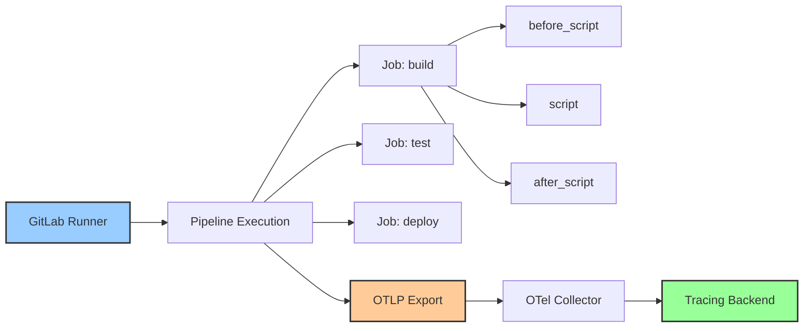
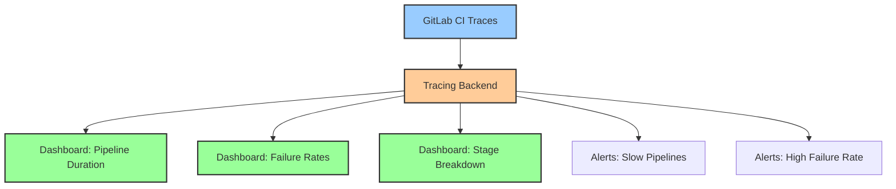

# How to Instrument GitLab CI Pipelines with OpenTelemetry

Author: [nawazdhandala](https://www.github.com/nawazdhandala)

Tags: OpenTelemetry, GitLab CI, CI/CD, Tracing, Observability, DevOps

Description: Learn how to instrument GitLab CI pipelines with OpenTelemetry to trace builds, detect bottlenecks, and improve pipeline reliability.

---

GitLab CI has a built-in integration with OpenTelemetry that most teams do not know about. Starting with GitLab 15.11, you can export trace data from your pipelines directly to any OTLP-compatible backend. Every pipeline, job, and even individual script commands can become spans in a distributed trace.

This guide walks through enabling GitLab's native OpenTelemetry support, adding custom instrumentation for deeper visibility, and building a complete CI/CD observability setup around your GitLab pipelines.

## GitLab's Built-in OpenTelemetry Support

GitLab has native support for exporting pipeline traces using the OpenTelemetry protocol. When enabled, GitLab automatically creates traces for pipeline runs, with spans for each job and section within a job.



The trace hierarchy maps naturally to GitLab's pipeline structure. The pipeline is the root span, each job is a child span, and each script section within a job gets its own span.

## Enabling OpenTelemetry in GitLab

To enable tracing, you configure the OTLP endpoint in your GitLab instance settings or at the project level using CI/CD variables.

For self-managed GitLab, add the configuration to your GitLab Rails settings.

```ruby
# /etc/gitlab/gitlab.rb
# Enable OpenTelemetry tracing for CI/CD pipelines.
# This sends trace data for all pipeline runs to the specified OTLP endpoint.

gitlab_rails['env'] = {
  # OTLP endpoint for trace export
  'OTEL_EXPORTER_OTLP_ENDPOINT' => 'https://otel-collector.example.com:4318',

  # Service name that appears in traces
  'OTEL_SERVICE_NAME' => 'gitlab-ci',

  # Authentication for the OTLP endpoint
  'OTEL_EXPORTER_OTLP_HEADERS' => 'Authorization=Bearer your-token-here',

  # Export protocol (http/protobuf or grpc)
  'OTEL_EXPORTER_OTLP_PROTOCOL' => 'http/protobuf'
}
```

For GitLab.com or project-level configuration, set these as CI/CD variables in your project settings under Settings, then CI/CD, then Variables.

```yaml
# Project-level CI/CD variables for OpenTelemetry
# Set these in GitLab UI: Settings > CI/CD > Variables
#
# OTEL_EXPORTER_OTLP_ENDPOINT: https://otel-collector.example.com:4318
# OTEL_EXPORTER_OTLP_HEADERS: Authorization=Bearer your-token-here
# OTEL_SERVICE_NAME: my-project-ci
```

Once these variables are set, GitLab will automatically export trace data for every pipeline run in that project.

## Understanding the Automatic Trace Structure

With tracing enabled, each pipeline run generates a trace with the following structure. Understanding this hierarchy helps you write effective queries against your trace data.

```
Trace: gitlab-pipeline-run
  |
  |-- Span: Pipeline #12345
  |   |-- ci.pipeline.id: 12345
  |   |-- ci.pipeline.source: push
  |   |-- ci.pipeline.ref: main
  |   |-- ci.pipeline.status: success
  |   |
  |   |-- Span: Stage 'build'
  |   |   |-- Span: Job 'compile'
  |   |   |   |-- ci.job.id: 67890
  |   |   |   |-- ci.job.status: success
  |   |   |   |-- ci.runner.type: shared
  |   |   |   |-- Span: before_script
  |   |   |   |-- Span: script
  |   |   |   |-- Span: after_script
  |   |   |
  |   |   |-- Span: Job 'docker-build'
  |   |       |-- ci.job.id: 67891
  |   |       |-- ci.job.status: success
  |   |
  |   |-- Span: Stage 'test'
  |   |   |-- Span: Job 'unit-tests'
  |   |   |-- Span: Job 'integration-tests'
  |   |   |-- Span: Job 'linting'
  |   |
  |   |-- Span: Stage 'deploy'
  |       |-- Span: Job 'deploy-production'
```

Each span carries attributes that map to GitLab CI concepts, making it straightforward to filter and aggregate by project, branch, job name, or runner type.

## Adding Custom Instrumentation

The automatic instrumentation captures the pipeline structure, but you often want more granular tracing inside your scripts. You can add custom spans by calling the OTLP HTTP API directly from your job scripts.

Here is a reusable script that creates spans for individual operations within a GitLab CI job.

```bash
#!/bin/bash
# scripts/trace-step.sh
# Creates a child span for a specific operation within a GitLab CI job.
# Usage: source scripts/trace-step.sh && trace_step "step-name" "command to run"

trace_step() {
  local STEP_NAME="$1"
  shift
  local COMMAND="$@"

  # Record the start time in nanoseconds
  local START_TIME=$(date +%s%N)

  # Generate a unique span ID for this step
  local SPAN_ID=$(openssl rand -hex 8)

  # Execute the actual command
  eval "$COMMAND"
  local EXIT_CODE=$?

  # Record the end time
  local END_TIME=$(date +%s%N)

  # Determine span status based on exit code
  local STATUS_CODE=1
  if [ $EXIT_CODE -ne 0 ]; then
    STATUS_CODE=2
  fi

  # Build and send the OTLP trace payload
  # Uses the trace context from the parent GitLab job span
  curl -s -X POST "${OTEL_EXPORTER_OTLP_ENDPOINT}/v1/traces" \
    -H "Content-Type: application/json" \
    -H "${OTEL_EXPORTER_OTLP_HEADERS}" \
    -d "{
      \"resourceSpans\": [{
        \"resource\": {
          \"attributes\": [
            {\"key\": \"service.name\", \"value\": {\"stringValue\": \"${OTEL_SERVICE_NAME}\"}},
            {\"key\": \"ci.project.path\", \"value\": {\"stringValue\": \"${CI_PROJECT_PATH}\"}},
            {\"key\": \"ci.pipeline.id\", \"value\": {\"stringValue\": \"${CI_PIPELINE_ID}\"}}
          ]
        },
        \"scopeSpans\": [{
          \"scope\": {\"name\": \"gitlab-ci-custom\", \"version\": \"1.0.0\"},
          \"spans\": [{
            \"traceId\": \"${OTEL_TRACE_ID}\",
            \"spanId\": \"${SPAN_ID}\",
            \"parentSpanId\": \"${OTEL_PARENT_SPAN_ID}\",
            \"name\": \"${STEP_NAME}\",
            \"kind\": 1,
            \"startTimeUnixNano\": \"${START_TIME}\",
            \"endTimeUnixNano\": \"${END_TIME}\",
            \"status\": {\"code\": ${STATUS_CODE}},
            \"attributes\": [
              {\"key\": \"ci.job.name\", \"value\": {\"stringValue\": \"${CI_JOB_NAME}\"}},
              {\"key\": \"ci.step.name\", \"value\": {\"stringValue\": \"${STEP_NAME}\"}},
              {\"key\": \"ci.step.exit_code\", \"value\": {\"intValue\": ${EXIT_CODE}}}
            ]
          }]
        }]
      }]
    }"

  return $EXIT_CODE
}
```

Now you can use this function inside your `.gitlab-ci.yml` to trace specific operations.

```yaml
# .gitlab-ci.yml
# Pipeline with custom OpenTelemetry instrumentation for granular tracing.
# Each significant operation is wrapped in a trace_step call.

stages:
  - build
  - test
  - deploy

variables:
  OTEL_EXPORTER_OTLP_ENDPOINT: "https://otel-collector.example.com:4318"
  OTEL_SERVICE_NAME: "my-app-ci"

build:
  stage: build
  image: docker:24
  services:
    - docker:24-dind
  script:
    - source scripts/trace-step.sh
    # Each trace_step call creates a separate span in the trace
    - trace_step "docker-login" "docker login -u $CI_REGISTRY_USER -p $CI_REGISTRY_PASSWORD $CI_REGISTRY"
    - trace_step "docker-build" "docker build -t $CI_REGISTRY_IMAGE:$CI_COMMIT_SHA ."
    - trace_step "docker-push" "docker push $CI_REGISTRY_IMAGE:$CI_COMMIT_SHA"

unit-tests:
  stage: test
  image: node:20
  script:
    - source scripts/trace-step.sh
    - trace_step "npm-install" "npm ci"
    - trace_step "run-unit-tests" "npm test"
  artifacts:
    reports:
      junit: junit-report.xml

integration-tests:
  stage: test
  image: node:20
  services:
    - postgres:16
    - redis:7
  script:
    - source scripts/trace-step.sh
    - trace_step "npm-install" "npm ci"
    - trace_step "wait-for-db" "scripts/wait-for-postgres.sh"
    - trace_step "run-migrations" "npm run migrate"
    - trace_step "run-integration-tests" "npm run test:integration"

deploy-production:
  stage: deploy
  image: bitnami/kubectl:latest
  environment:
    name: production
  script:
    - source scripts/trace-step.sh
    - trace_step "kubectl-apply" "kubectl apply -f k8s/production/"
    - trace_step "rollout-wait" "kubectl rollout status deployment/my-app -n production --timeout=300s"
  only:
    - main
```

With this setup, your traces show not just that a job ran, but exactly how long each operation within the job took. You can see that `docker build` took 3 minutes while `docker push` took 45 seconds, or that waiting for Postgres to be ready added 10 seconds to every integration test run.

## Setting Up the OpenTelemetry Collector

Route your GitLab CI traces through an OpenTelemetry Collector for processing and enrichment before they reach your backend.

```yaml
# otel-collector-config.yaml
# Collector configuration for processing GitLab CI trace data.
# Adds CI-specific resource attributes and filters noise.
receivers:
  otlp:
    protocols:
      grpc:
        endpoint: 0.0.0.0:4317
      http:
        endpoint: 0.0.0.0:4318

processors:
  batch:
    timeout: 10s
    send_batch_size: 512

  # Enrich traces with metadata about the CI environment
  resource:
    attributes:
      - key: ci.system
        value: gitlab
        action: upsert
      - key: deployment.environment
        value: ci
        action: upsert

  # Add span-level attributes based on existing data
  attributes:
    actions:
      # Extract the project name from the full path
      - key: ci.project.name
        from_attribute: ci.project.path
        action: upsert

exporters:
  otlphttp:
    endpoint: https://your-tracing-backend.example.com
    headers:
      Authorization: "Bearer ${OTEL_AUTH_TOKEN}"

service:
  pipelines:
    traces:
      receivers: [otlp]
      processors: [resource, attributes, batch]
      exporters: [otlphttp]
```

## Tracing Multi-Project Pipelines

GitLab supports triggering pipelines across projects. When you have multi-project pipelines, you want traces that span across project boundaries to show the full execution flow.

```yaml
# .gitlab-ci.yml in the parent project
# Triggers a downstream pipeline and passes trace context so
# both pipelines appear in the same trace.

trigger-deploy:
  stage: deploy
  variables:
    # Pass trace context to the downstream pipeline
    UPSTREAM_TRACE_ID: "${OTEL_TRACE_ID}"
    UPSTREAM_PIPELINE_ID: "${CI_PIPELINE_ID}"
    UPSTREAM_PROJECT: "${CI_PROJECT_PATH}"
    DEPLOY_VERSION: "${CI_COMMIT_SHA}"
  trigger:
    project: infrastructure/deploy-pipeline
    branch: main
    strategy: depend
```

In the downstream pipeline, use the passed trace context to link spans.

```yaml
# .gitlab-ci.yml in the downstream deploy project
# Receives trace context from the upstream pipeline
# and uses it to create linked spans.

deploy:
  stage: deploy
  script:
    - source scripts/trace-step.sh
    # Use the upstream trace ID to link this pipeline's spans
    - export OTEL_TRACE_ID="${UPSTREAM_TRACE_ID}"
    - trace_step "deploy-to-kubernetes" "scripts/deploy.sh ${DEPLOY_VERSION}"
    - trace_step "verify-deployment" "scripts/smoke-test.sh"
  environment:
    name: production
```

This creates a single trace that spans both the build pipeline and the deploy pipeline, giving you end-to-end visibility across project boundaries.

## Building Dashboards from Pipeline Traces

Once you have trace data flowing, you can build dashboards that answer operational questions about your CI/CD system.

Key metrics to derive from trace data include:

- **Pipeline duration by project**: Average and p95 duration of pipeline runs, grouped by project. Identifies which projects have the slowest builds.
- **Stage duration breakdown**: Time spent in each stage, showing where the build time goes. Often reveals that a single stage dominates total duration.
- **Failure rate by job**: Percentage of job runs that fail, grouped by job name. Highlights flaky jobs that need attention.
- **Queue time**: Time between pipeline creation and the first job starting. High queue times mean you need more runners.
- **Runner utilization**: How busy your runners are, based on the ratio of job execution time to total time.



## Debugging Failed Pipelines with Traces

When a pipeline fails, traces give you structured data that is much easier to work with than raw logs. Instead of scrolling through thousands of lines of console output, you can look at the trace to see exactly which span failed, how long it ran before failing, and what attributes were attached.

For example, if an integration test fails intermittently, you can query for all failed spans with `ci.step.name = "run-integration-tests"` and look at patterns. Maybe failures correlate with specific runners, or they happen during high-traffic periods when the shared Postgres service is under load.

The span duration tells you whether the test failed quickly (likely a setup issue) or after running for a while (likely a test logic or timeout issue). The exit code attribute tells you the specific error code, which you can correlate with your test framework's error codes.

## Alerting on Pipeline Anomalies

Set up alerts based on trace data to catch CI/CD problems early. Some useful alert conditions include pipeline duration exceeding twice the historical average, failure rate for a specific job exceeding 10% over the last hour, and queue time exceeding 5 minutes.

These alerts catch problems that are not visible from individual pipeline runs but become obvious in aggregate. A slowly growing build time might add 30 seconds per week, which nobody notices until it is 10 minutes longer than it should be. Trace-based alerts catch that drift early.

## Conclusion

GitLab CI's built-in OpenTelemetry support makes it straightforward to get pipeline traces flowing to your observability backend. The automatic instrumentation captures the pipeline structure, while custom trace steps give you granular visibility into individual operations. Combined with an OpenTelemetry Collector for enrichment and processing, you get a complete picture of your CI/CD performance that helps you optimize build times, reduce failure rates, and debug issues faster.
