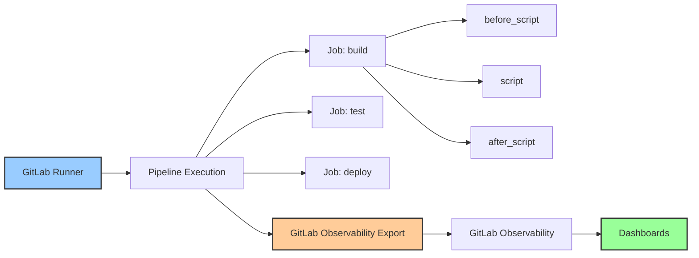
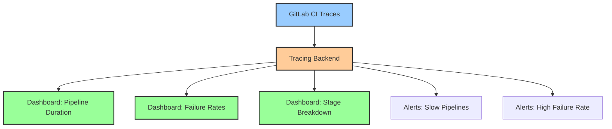

# How to Instrument GitLab CI Pipelines with OpenTelemetry

Author: [nawazdhandala](https://www.github.com/nawazdhandala)

Tags: OpenTelemetry, GitLab CI, CI/CD, Tracing, Observability, DevOps

Description: Learn how to instrument GitLab CI pipelines with OpenTelemetry to trace builds, detect bottlenecks, and improve pipeline reliability.

---

GitLab CI has an experimental integration with GitLab Observability that most teams do not know about. In current GitLab versions, you can enable automatic CI/CD telemetry export to GitLab Observability with a CI/CD variable. Pipeline jobs and execution flow can be represented as OpenTelemetry telemetry, and individual script commands can be instrumented with your own OTLP spans when you need more detail.

This guide walks through enabling GitLab's automatic CI/CD telemetry support, adding custom instrumentation for deeper visibility, and building a complete CI/CD observability setup around your GitLab pipelines.

## GitLab's Built-in OpenTelemetry Support

GitLab Observability has experimental support for automatic CI/CD pipeline telemetry. When enabled, GitLab captures pipeline execution data after pipelines complete, converts it to OpenTelemetry format, and makes it available in GitLab Observability.

### Tier and Availability (Read This First)

There is a lot of confusion about which GitLab edition you need, so let us be precise. As of GitLab 18.1, the GitLab documentation lists CI/CD pipeline telemetry and GitLab Observability with `Tier: Free, Premium, Ultimate` and `Offering: GitLab.com, GitLab Self-Managed`, and both carry `Status: Experiment`. In other words, the current feature is not gated behind the Ultimate tier.

If you read older documentation (GitLab 16.x and 17.x), you likely saw that observability and distributed tracing required the Ultimate tier and an `observability_features` feature flag. That earlier implementation was reworked. The version covered in this guide (GitLab 18.1 and later) is the one documented for all tiers. Always check the tier badge at the top of the page you are reading, because an experiment can change tier or behavior between releases.

Because this is an experiment, treat it as subject to change and verify the current state against the official docs at https://docs.gitlab.com/operations/observability/ci_cd/ before relying on it in production.


```mermaid
graph LR
    A[GitLab Runner] --> B[Pipeline Execution]
    B --> C[Job: build]
    B --> D[Job: test]
    B --> E[Job: deploy]
    C --> F[before_script]
    C --> G[script]
    C --> H[after_script]
    B --> I[GitLab Observability Export]
    I --> J[GitLab Observability]
    J --> K[Dashboards]

    style A fill:#9cf,stroke:#333,stroke-width:2px
    style I fill:#fc9,stroke:#333,stroke-width:2px
    style K fill:#9f9,stroke:#333,stroke-width:2px
```

The trace hierarchy maps naturally to GitLab's pipeline structure. The pipeline is the root operation, with telemetry for job dependencies, timing, and execution flow.

## Prerequisite: Set Up GitLab Observability First

The `GITLAB_OBSERVABILITY_EXPORT` variable exports telemetry to GitLab Observability, not to an arbitrary OTLP endpoint. So before the CI/CD variable does anything, GitLab Observability has to exist and be connected to your project's group. How you do that depends on where GitLab runs, and this is the step most people miss.

On GitLab.com, there is no `gitlab.rb` to edit and no separate backend to host. You enable it per group in the UI. With the Developer, Maintainer, or Owner role on the group, open the group, go to Settings, then Observability, then Setup, and select Enable Observability. GitLab then generates and displays the OpenTelemetry endpoint URL for that group. See https://docs.gitlab.com/operations/observability/setup_gitlab_com/ for the current steps.

On GitLab Self-Managed, you do not enable this purely by editing `gitlab.rb` either. The current model (GitLab 18.1 and later) runs GitLab Observability as a separate application that you deploy alongside GitLab, then connect to. At a high level the documented steps are:

- Provision a separate host for the Observability backend (the docs reference a `t3.large` or larger virtual machine, at least 100 GB of storage, and Docker plus Docker Compose).
- Deploy the GitLab Observability backend on that host and open the required ports (for example, 4317 and 4318 for OTLP).
- Connect your GitLab instance to it by configuring the group's Observability settings.

The group connection is configured through the GitLab Rails console, not through `gitlab.rb`. The documented object is `Observability::GroupO11ySetting`:

```ruby
# Run on your GitLab Self-Managed instance:
#   gitlab-rails console
# Replace the placeholder values with your deployed Observability backend details.
group = Group.find_by_path('your-group-name')
Observability::GroupO11ySetting.create!(
  group_id: group.id,
  o11y_service_url: 'https://your-o11y-instance.example.com',
  o11y_service_user_email: 'observability@example.com',
  o11y_service_password: 'your-secure-password',
  o11y_service_post_message_encryption_key: 'your-32-char-minimum-encryption-key'
)
```

So to answer the two questions that come up most often: this is not an Ultimate-only feature in current GitLab (the docs list Free, Premium, and Ultimate), and on Self-Managed you do not flip it on by editing `gitlab.rb`. You stand up the separate Observability backend and connect the group to it. For the authoritative, version-specific steps, follow https://docs.gitlab.com/operations/observability/setup_self_managed/.

## Enabling OpenTelemetry in GitLab

Once GitLab Observability is set up and connected to your group, enable automatic pipeline telemetry by adding the `GITLAB_OBSERVABILITY_EXPORT` CI/CD variable at the project or group level.

For GitLab.com or self-managed projects, set this as a CI/CD variable in your project or group settings under Settings, then CI/CD, then Variables.

```yaml
# Project-level CI/CD variables for OpenTelemetry
# Set these in GitLab UI: Settings > CI/CD > Variables
#
# GITLAB_OBSERVABILITY_EXPORT: traces
#
# You can also enable multiple signals:
# GITLAB_OBSERVABILITY_EXPORT: traces,metrics,logs
```

Once this variable is set, GitLab automatically captures pipeline execution data after each pipeline completes and exports the selected telemetry types to your connected GitLab Observability instance. If you set the variable but see no data, the most common cause is that GitLab Observability has not been set up and connected for the group, as described in the prerequisite section above.

## Understanding the Automatic Trace Structure

With tracing enabled, each pipeline run can generate telemetry with a structure like the following. Understanding this hierarchy helps you write effective queries against your trace data.

```text
Trace: gitlab-pipeline-run
  |
  |-- Span: Pipeline #12345
  |   |-- cicd.pipeline.run.id: 12345
  |   |-- cicd.pipeline.action.name: RUN
  |   |-- vcs.ref.head.name: main
  |   |-- cicd.pipeline.result: success
  |   |
  |   |-- Span: Stage 'build'
  |   |   |-- Span: Job 'compile'
  |   |   |   |-- cicd.pipeline.task.run.id: 67890
  |   |   |   |-- cicd.pipeline.task.run.result: success
  |   |   |   |-- cicd.worker.name: shared-runner
  |   |   |   |-- Span: before_script
  |   |   |   |-- Span: script
  |   |   |   |-- Span: after_script
  |   |   |
  |   |   |-- Span: Job 'docker-build'
  |   |       |-- cicd.pipeline.task.run.id: 67891
  |   |       |-- cicd.pipeline.task.run.result: success
  |   |
  |   |-- Span: Stage 'test'
  |   |   |-- Span: Job 'unit-tests'
  |   |   |-- Span: Job 'integration-tests'
  |   |   |-- Span: Job 'linting'
  |   |
  |   |-- Span: Stage 'deploy'
  |       |-- Span: Job 'deploy-production'
```

Each span can carry attributes that map to GitLab CI concepts, making it straightforward to filter and aggregate by project, branch, job name, or runner.

## Adding Custom Instrumentation

The automatic instrumentation captures the pipeline structure, but you often want more granular tracing inside your scripts. You can add custom spans by calling the OTLP HTTP API directly from your job scripts. These custom spans are separate from GitLab's automatic Observability export unless you explicitly manage and propagate the same trace context yourself.

Here is a reusable script that creates spans for individual operations within a GitLab CI job.

```bash
#!/bin/sh
# scripts/trace-step.sh
# Creates a span for a specific operation within a GitLab CI job.
# Usage: . scripts/trace-step.sh && trace_step "step-name" "command to run"

otel_hex_id() {
  od -An -N"$1" -tx1 /dev/urandom | tr -d ' \n'
}

if [ -z "${CUSTOM_TRACE_ID:-}" ]; then
  CUSTOM_TRACE_ID="$(otel_hex_id 16)"
  export CUSTOM_TRACE_ID
fi

trace_step() {
  STEP_NAME="$1"
  shift
  COMMAND="$*"

  # Record the start time in nanoseconds
  START_TIME=$(date +%s%N)

  # Generate a unique span ID for this step
  SPAN_ID=$(otel_hex_id 8)

  # Execute the actual command
  eval "$COMMAND"
  EXIT_CODE=$?

  # Record the end time
  END_TIME=$(date +%s%N)

  # Determine span status based on exit code
  STATUS_CODE=1
  if [ $EXIT_CODE -ne 0 ]; then
    STATUS_CODE=2
  fi

  # Build and send the OTLP trace payload
  set -- -H "Content-Type: application/json"
  if [ -n "${OTEL_EXPORTER_OTLP_AUTH_HEADER:-}" ]; then
    set -- "$@" -H "${OTEL_EXPORTER_OTLP_AUTH_HEADER}"
  fi

  # Sends OTLP/JSON to a collector or backend that accepts OTLP over HTTP.
  # Use CUSTOM_TRACE_ID to correlate multiple steps in the same trace.
  curl -sS -X POST "${OTEL_EXPORTER_OTLP_ENDPOINT}/v1/traces" \
    "$@" \
    -d "{
      \"resourceSpans\": [{
        \"resource\": {
          \"attributes\": [
            {\"key\": \"service.name\", \"value\": {\"stringValue\": \"${OTEL_SERVICE_NAME}\"}},
            {\"key\": \"vcs.repository.name\", \"value\": {\"stringValue\": \"${CI_PROJECT_PATH}\"}},
            {\"key\": \"cicd.pipeline.run.id\", \"value\": {\"stringValue\": \"${CI_PIPELINE_ID}\"}}
          ]
        },
        \"scopeSpans\": [{
          \"scope\": {\"name\": \"gitlab-ci-custom\", \"version\": \"1.0.0\"},
          \"spans\": [{
            \"traceId\": \"${CUSTOM_TRACE_ID}\",
            \"spanId\": \"${SPAN_ID}\",
            \"name\": \"${STEP_NAME}\",
            \"kind\": 1,
            \"startTimeUnixNano\": \"${START_TIME}\",
            \"endTimeUnixNano\": \"${END_TIME}\",
            \"status\": {\"code\": ${STATUS_CODE}},
            \"attributes\": [
              {\"key\": \"cicd.pipeline.task.name\", \"value\": {\"stringValue\": \"${CI_JOB_NAME}\"}},
              {\"key\": \"cicd.pipeline.task.run.id\", \"value\": {\"stringValue\": \"${CI_JOB_ID}\"}},
              {\"key\": \"cicd.pipeline.task.run.result\", \"value\": {\"stringValue\": \"$(if [ $EXIT_CODE -eq 0 ]; then echo success; else echo failure; fi)\"}},
              {\"key\": \"ci.step.name\", \"value\": {\"stringValue\": \"${STEP_NAME}\"}},
              {\"key\": \"ci.step.exit_code\", \"value\": {\"intValue\": ${EXIT_CODE}}}
            ]
          }]
        }]
      }]
    }"

  return $EXIT_CODE
}
```

Now you can use this function inside your `.gitlab-ci.yml` to trace specific operations. The job image must include `curl`, `od`, `tr`, and GNU `date`.

```yaml
# .gitlab-ci.yml
# Pipeline with custom OpenTelemetry instrumentation for granular tracing.
# Each significant operation is wrapped in a trace_step call.

stages:
  - build
  - test
  - deploy

variables:
  OTEL_EXPORTER_OTLP_ENDPOINT: "https://otel-collector.example.com:4318"
  OTEL_SERVICE_NAME: "my-app-ci"
  OTEL_EXPORTER_OTLP_AUTH_HEADER: "Authorization: Bearer your-token-here"

build:
  stage: build
  image: docker:24
  services:
    - docker:24-dind
  script:
    - apk add --no-cache curl coreutils
    - . scripts/trace-step.sh
    # Each trace_step call creates a separate span in the trace
    - trace_step "docker-login" "docker login -u $CI_REGISTRY_USER -p $CI_REGISTRY_PASSWORD $CI_REGISTRY"
    - trace_step "docker-build" "docker build -t $CI_REGISTRY_IMAGE:$CI_COMMIT_SHA ."
    - trace_step "docker-push" "docker push $CI_REGISTRY_IMAGE:$CI_COMMIT_SHA"

unit-tests:
  stage: test
  image: node:20
  script:
    - . scripts/trace-step.sh
    - trace_step "npm-install" "npm ci"
    - trace_step "run-unit-tests" "npm test"
  artifacts:
    reports:
      junit: junit-report.xml

integration-tests:
  stage: test
  image: node:20
  services:
    - postgres:16
    - redis:7
  script:
    - . scripts/trace-step.sh
    - trace_step "npm-install" "npm ci"
    - trace_step "wait-for-db" "scripts/wait-for-postgres.sh"
    - trace_step "run-migrations" "npm run migrate"
    - trace_step "run-integration-tests" "npm run test:integration"

deploy-production:
  stage: deploy
  image: bitnami/kubectl:latest
  environment:
    name: production
  script:
    - . scripts/trace-step.sh
    - trace_step "kubectl-apply" "kubectl apply -f k8s/production/"
    - trace_step "rollout-wait" "kubectl rollout status deployment/my-app -n production --timeout=300s"
  rules:
    - if: $CI_COMMIT_BRANCH == "main"
```

With this setup, your traces show not just that a job ran, but exactly how long each operation within the job took. You can see that `docker build` took 3 minutes while `docker push` took 45 seconds, or that waiting for Postgres to be ready added 10 seconds to every integration test run.

## Setting Up the OpenTelemetry Collector

Route your custom GitLab CI traces through an OpenTelemetry Collector for processing and enrichment before they reach your backend. GitLab's automatic Observability export is configured separately with `GITLAB_OBSERVABILITY_EXPORT`.

```yaml
# otel-collector-config.yaml
# Collector configuration for processing custom GitLab CI trace data.
# Adds CI-specific resource attributes.
receivers:
  otlp:
    protocols:
      grpc:
        endpoint: 0.0.0.0:4317
      http:
        endpoint: 0.0.0.0:4318

processors:
  batch:
    timeout: 10s
    send_batch_size: 512

  # Enrich traces with metadata about the CI environment
  resource:
    attributes:
      - key: ci.system
        value: gitlab
        action: upsert
      - key: deployment.environment
        value: ci
        action: upsert

  # Add span-level attributes based on existing data
  attributes:
    actions:
      # Copy the repository path to a CI-specific attribute for queries
      - key: ci.project.name
        from_attribute: vcs.repository.name
        action: upsert

exporters:
  otlphttp:
    endpoint: https://your-tracing-backend.example.com
    headers:
      Authorization: "Bearer ${OTEL_AUTH_TOKEN}"

service:
  pipelines:
    traces:
      receivers: [otlp]
      processors: [resource, attributes, batch]
      exporters: [otlphttp]
```

## Tracing Multi-Project Pipelines

GitLab supports triggering pipelines across projects. When you have multi-project pipelines and custom OTLP spans, you can pass a generated trace ID across project boundaries so spans from both projects can use the same trace.

```yaml
# .gitlab-ci.yml in the parent project
# Generates a trace ID, triggers a downstream pipeline, and passes context so
# custom spans from both pipelines can appear in the same trace.

stages:
  - prepare
  - deploy

prepare-trace:
  stage: prepare
  image: alpine:3.20
  script:
    - apk add --no-cache coreutils
    - echo "CUSTOM_TRACE_ID=$(od -An -N16 -tx1 /dev/urandom | tr -d ' \n')" >> trace.env
  artifacts:
    reports:
      dotenv: trace.env

trigger-deploy:
  stage: deploy
  needs:
    - prepare-trace
  variables:
    # Tell the downstream pipeline where to fetch the dotenv trace context
    UPSTREAM_TRACE_JOB: "prepare-trace"
    UPSTREAM_PIPELINE_ID: "${CI_PIPELINE_ID}"
    UPSTREAM_PROJECT: "${CI_PROJECT_PATH}"
    UPSTREAM_REF: "${CI_COMMIT_REF_NAME}"
    DEPLOY_VERSION: "${CI_COMMIT_SHA}"
  trigger:
    project: infrastructure/deploy-pipeline
    branch: main
    strategy: mirror
```

In the downstream pipeline, use the passed trace context for custom spans.

```yaml
# .gitlab-ci.yml in the downstream deploy project
# Receives trace context from the upstream pipeline
# and uses it to create custom spans in the same trace.

deploy:
  stage: deploy
  needs:
    - project: $UPSTREAM_PROJECT
      job: $UPSTREAM_TRACE_JOB
      ref: $UPSTREAM_REF
      artifacts: true
  script:
    - . scripts/trace-step.sh
    - trace_step "deploy-to-kubernetes" "scripts/deploy.sh ${DEPLOY_VERSION}"
    - trace_step "verify-deployment" "scripts/smoke-test.sh"
  environment:
    name: production
```

This gives your custom spans a shared trace ID across the build pipeline and the deploy pipeline, giving you end-to-end visibility across project boundaries for the spans you emit yourself.

## Building Dashboards from Pipeline Traces

Once you have telemetry flowing, you can build dashboards that answer operational questions about your CI/CD system.

Key metrics to derive from trace data include:

- **Pipeline duration by project**: Average and p95 duration of pipeline runs, grouped by project. Identifies which projects have the slowest builds.
- **Stage duration breakdown**: Time spent in each stage, showing where the build time goes. Often reveals that a single stage dominates total duration.
- **Failure rate by job**: Percentage of job runs that fail, grouped by job name. Highlights flaky jobs that need attention.
- **Queue time**: Time between pipeline creation and the first job starting. High queue times mean you need more runners.
- **Runner utilization**: How busy your runners are, based on the ratio of job execution time to total time.


```mermaid
graph TD
    A[GitLab CI Traces] --> B[Tracing Backend]
    B --> C[Dashboard: Pipeline Duration]
    B --> D[Dashboard: Failure Rates]
    B --> E[Dashboard: Stage Breakdown]
    B --> F[Alerts: Slow Pipelines]
    B --> G[Alerts: High Failure Rate]

    style A fill:#9cf,stroke:#333,stroke-width:2px
    style B fill:#fc9,stroke:#333,stroke-width:2px
    style C fill:#9f9,stroke:#333,stroke-width:2px
    style D fill:#9f9,stroke:#333,stroke-width:2px
    style E fill:#9f9,stroke:#333,stroke-width:2px
```

## Debugging Failed Pipelines with Traces

When a pipeline fails, traces give you structured data that is much easier to work with than raw logs. Instead of scrolling through thousands of lines of console output, you can look at the trace to see exactly which span failed, how long it ran before failing, and what attributes were attached.

For example, if an integration test fails intermittently, you can query for all failed spans with `ci.step.name = "run-integration-tests"` and look at patterns. Maybe failures correlate with specific runners, or they happen during high-traffic periods when the shared Postgres service is under load.

The span duration tells you whether the test failed quickly (likely a setup issue) or after running for a while (likely a test logic or timeout issue). The exit code attribute tells you the specific error code, which you can correlate with your test framework's error codes.

## Alerting on Pipeline Anomalies

Set up alerts based on trace data to catch CI/CD problems early. Some useful alert conditions include pipeline duration exceeding twice the historical average, failure rate for a specific job exceeding 10% over the last hour, and queue time exceeding 5 minutes.

These alerts catch problems that are not visible from individual pipeline runs but become obvious in aggregate. A slowly growing build time might add 30 seconds per week, which nobody notices until it is 10 minutes longer than it should be. Trace-based alerts catch that drift early.

## Conclusion

GitLab CI's experimental Observability support makes it straightforward to get pipeline telemetry flowing to GitLab Observability. The automatic instrumentation captures the pipeline structure, while custom OTLP trace steps give you granular visibility into individual operations that you can send through an OpenTelemetry Collector for enrichment and processing. Together, they give you a complete picture of your CI/CD performance that helps you optimize build times, reduce failure rates, and debug issues faster.
