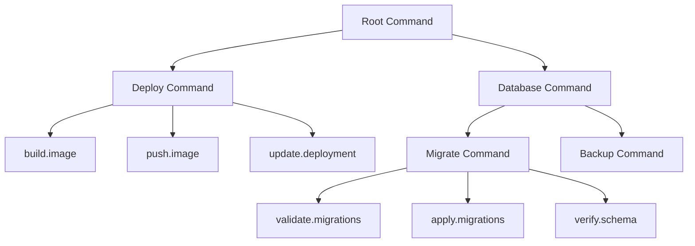

# How to Instrument Go Cobra CLI Commands with OpenTelemetry

Author: [nawazdhandala](https://www.github.com/nawazdhandala)

Tags: OpenTelemetry, Go, Cobra, CLI, Commands, Tracing

Description: Complete guide to adding OpenTelemetry tracing to Cobra CLI applications for observing command execution, measuring performance, and debugging issues.

Command-line tools built with Cobra power critical infrastructure operations. These tools deploy applications, manage databases, orchestrate containers, and automate workflows. When these CLI tools perform poorly or fail unexpectedly, troubleshooting becomes difficult without proper observability.

OpenTelemetry brings distributed tracing capabilities to CLI applications. You can track command execution time, observe subcommand relationships, measure external API calls, and debug failures with rich context. This instrumentation helps identify slow operations, track command usage patterns, and diagnose errors in production environments.

This guide demonstrates how to add OpenTelemetry tracing to Cobra-based CLI applications. We'll cover basic instrumentation, advanced patterns for complex command hierarchies, and techniques for capturing contextual information that makes traces actionable.

## Why Instrument CLI Tools

CLI tools typically run as short-lived processes, which creates unique observability challenges compared to long-running services. Each invocation starts fresh, executes a specific task, and terminates. Without instrumentation, understanding execution flow requires manual logging and scattered debug statements.

Tracing CLI commands provides several benefits:

**Performance Analysis** reveals which operations consume the most time. When a deployment command takes 5 minutes instead of 30 seconds, traces show exactly where time is spent.

**Error Context** captures the full execution context when failures occur. Instead of a simple error message, you get the complete chain of operations leading to the failure.

**Usage Patterns** show which commands users run most frequently, helping prioritize optimization efforts and identify feature adoption.

**Integration Visibility** tracks interactions with external services like APIs, databases, and cloud providers, making it easier to identify when third-party services cause slowdowns.

## Setting Up OpenTelemetry for Cobra

Install the required dependencies:

```bash
go get github.com/spf13/cobra
go get go.opentelemetry.io/otel
go get go.opentelemetry.io/otel/sdk/trace
go get go.opentelemetry.io/otel/exporters/otlp/otlptrace/otlptracegrpc
go get go.opentelemetry.io/otel/sdk/resource
go get go.opentelemetry.io/otel/semconv/v1.24.0
```

Create a tracing initialization module that configures OpenTelemetry for CLI usage:

```go
package telemetry

import (
    "context"
    "time"

    "go.opentelemetry.io/otel"
    "go.opentelemetry.io/otel/exporters/otlp/otlptrace/otlptracegrpc"
    "go.opentelemetry.io/otel/sdk/resource"
    sdktrace "go.opentelemetry.io/otel/sdk/trace"
    semconv "go.opentelemetry.io/otel/semconv/v1.24.0"
)

// InitTracer sets up OpenTelemetry tracing for CLI applications
// It configures batch export to minimize latency impact
func InitTracer(ctx context.Context, serviceName, version string) (*sdktrace.TracerProvider, error) {
    // Create OTLP exporter for sending traces to collector
    exporter, err := otlptracegrpc.New(ctx,
        otlptracegrpc.WithEndpoint("localhost:4317"),
        otlptracegrpc.WithInsecure(),
        otlptracegrpc.WithTimeout(5*time.Second),
    )
    if err != nil {
        return nil, err
    }

    // Define resource attributes identifying this CLI tool
    res, err := resource.New(ctx,
        resource.WithAttributes(
            semconv.ServiceNameKey.String(serviceName),
            semconv.ServiceVersionKey.String(version),
            semconv.DeploymentEnvironmentKey.String("cli"),
        ),
    )
    if err != nil {
        return nil, err
    }

    // Create tracer provider with batch processor
    // Batching reduces the number of network calls
    tp := sdktrace.NewTracerProvider(
        sdktrace.WithBatcher(exporter,
            sdktrace.WithBatchTimeout(2*time.Second),
            sdktrace.WithMaxExportBatchSize(512),
        ),
        sdktrace.WithResource(res),
        // Sample all traces for CLI tools since they're infrequent
        sdktrace.WithSampler(sdktrace.AlwaysSample()),
    )

    // Set as global tracer provider
    otel.SetTracerProvider(tp)

    return tp, nil
}
```

## Instrumenting Basic Commands

Start by instrumenting the root command and basic subcommands:

```go
package cmd

import (
    "context"
    "fmt"
    "os"
    "time"

    "github.com/spf13/cobra"
    "go.opentelemetry.io/otel"
    "go.opentelemetry.io/otel/attribute"
    "go.opentelemetry.io/otel/codes"
    "go.opentelemetry.io/otel/trace"

    "your-cli/telemetry"
)

var (
    tracer trace.Tracer
    tp     *sdktrace.TracerProvider
)

// rootCmd represents the base command
var rootCmd = &cobra.Command{
    Use:   "mycli",
    Short: "A CLI tool with OpenTelemetry tracing",
    PersistentPreRunE: func(cmd *cobra.Command, args []string) error {
        // Initialize tracing before any command runs
        ctx := cmd.Context()
        var err error
        tp, err = telemetry.InitTracer(ctx, "mycli", "1.0.0")
        if err != nil {
            return fmt.Errorf("failed to initialize tracer: %w", err)
        }

        tracer = otel.Tracer("mycli-commands")
        return nil
    },
    PersistentPostRunE: func(cmd *cobra.Command, args []string) error {
        // Ensure all traces are flushed before exit
        if tp != nil {
            ctx, cancel := context.WithTimeout(context.Background(), 5*time.Second)
            defer cancel()
            return tp.Shutdown(ctx)
        }
        return nil
    },
}

// Execute runs the root command
func Execute() {
    if err := rootCmd.ExecuteContext(context.Background()); err != nil {
        os.Exit(1)
    }
}
```

Create a helper function for instrumenting command execution:

```go
package cmd

import (
    "context"
    "time"

    "github.com/spf13/cobra"
    "go.opentelemetry.io/otel/attribute"
    "go.opentelemetry.io/otel/codes"
    "go.opentelemetry.io/otel/trace"
)

// withTracing wraps a cobra RunE function with tracing instrumentation
// It creates a span for the command execution and captures errors
func withTracing(runFunc func(*cobra.Command, []string) error) func(*cobra.Command, []string) error {
    return func(cmd *cobra.Command, args []string) error {
        ctx := cmd.Context()

        // Create span for this command execution
        spanName := fmt.Sprintf("command.%s", cmd.CommandPath())
        ctx, span := tracer.Start(ctx, spanName,
            trace.WithSpanKind(trace.SpanKindInternal),
            trace.WithAttributes(
                attribute.String("cli.command", cmd.CommandPath()),
                attribute.StringSlice("cli.args", args),
                attribute.Int("cli.args.count", len(args)),
            ),
        )
        defer span.End()

        // Update command context with traced context
        cmd.SetContext(ctx)

        // Record start time for duration calculation
        startTime := time.Now()

        // Execute the actual command logic
        err := runFunc(cmd, args)

        // Record execution duration
        duration := time.Since(startTime)
        span.SetAttributes(
            attribute.Int64("cli.duration_ms", duration.Milliseconds()),
        )

        // Record error if execution failed
        if err != nil {
            span.RecordError(err)
            span.SetStatus(codes.Error, err.Error())
            return err
        }

        span.SetStatus(codes.Ok, "command completed successfully")
        return nil
    }
}
```

Use the tracing wrapper in your commands:

```go
package cmd

import (
    "fmt"
    "time"

    "github.com/spf13/cobra"
    "go.opentelemetry.io/otel/attribute"
)

var deployCmd = &cobra.Command{
    Use:   "deploy [service]",
    Short: "Deploy a service",
    Args:  cobra.ExactArgs(1),
    RunE: withTracing(func(cmd *cobra.Command, args []string) error {
        ctx := cmd.Context()
        serviceName := args[0]

        // Get current span to add attributes
        span := trace.SpanFromContext(ctx)
        span.SetAttributes(
            attribute.String("service.name", serviceName),
        )

        fmt.Printf("Deploying service: %s\n", serviceName)

        // Simulate deployment steps with child spans
        if err := buildImage(ctx, serviceName); err != nil {
            return err
        }

        if err := pushImage(ctx, serviceName); err != nil {
            return err
        }

        if err := updateDeployment(ctx, serviceName); err != nil {
            return err
        }

        fmt.Printf("Successfully deployed %s\n", serviceName)
        return nil
    }),
}

// buildImage creates a child span for the image build step
func buildImage(ctx context.Context, serviceName string) error {
    _, span := tracer.Start(ctx, "build.image",
        trace.WithAttributes(
            attribute.String("service.name", serviceName),
        ),
    )
    defer span.End()

    // Simulate build process
    time.Sleep(2 * time.Second)

    span.SetAttributes(
        attribute.String("image.tag", "latest"),
        attribute.String("build.status", "success"),
    )

    return nil
}

func init() {
    rootCmd.AddCommand(deployCmd)
}
```

## Capturing Command Flags and Arguments

Command flags and arguments provide important context for traces. Capture them systematically:

```go
package cmd

import (
    "context"

    "github.com/spf13/cobra"
    "go.opentelemetry.io/otel/attribute"
    "go.opentelemetry.io/otel/trace"
)

// captureFlags extracts flag values and adds them as span attributes
func captureFlags(cmd *cobra.Command, span trace.Span) {
    // Iterate through all flags
    cmd.Flags().VisitAll(func(flag *pflag.Flag) {
        // Skip capturing sensitive flags like tokens or passwords
        if isSensitiveFlag(flag.Name) {
            span.SetAttributes(
                attribute.Bool(fmt.Sprintf("flag.%s.present", flag.Name), flag.Changed),
            )
            return
        }

        // Capture flag values by type
        if flag.Changed {
            switch flag.Value.Type() {
            case "bool":
                val, _ := cmd.Flags().GetBool(flag.Name)
                span.SetAttributes(
                    attribute.Bool(fmt.Sprintf("flag.%s", flag.Name), val),
                )
            case "string":
                val, _ := cmd.Flags().GetString(flag.Name)
                span.SetAttributes(
                    attribute.String(fmt.Sprintf("flag.%s", flag.Name), val),
                )
            case "int":
                val, _ := cmd.Flags().GetInt(flag.Name)
                span.SetAttributes(
                    attribute.Int(fmt.Sprintf("flag.%s", flag.Name), val),
                )
            case "stringSlice":
                val, _ := cmd.Flags().GetStringSlice(flag.Name)
                span.SetAttributes(
                    attribute.StringSlice(fmt.Sprintf("flag.%s", flag.Name), val),
                )
            }
        }
    })
}

// isSensitiveFlag checks if a flag contains sensitive data
func isSensitiveFlag(name string) bool {
    sensitiveFlags := []string{
        "password", "token", "secret", "apikey", "api-key",
        "access-key", "private-key", "credentials",
    }

    lowerName := strings.ToLower(name)
    for _, sensitive := range sensitiveFlags {
        if strings.Contains(lowerName, sensitive) {
            return true
        }
    }
    return false
}
```

Enhanced tracing wrapper that captures flags:

```go
func withTracingAndFlags(runFunc func(*cobra.Command, []string) error) func(*cobra.Command, []string) error {
    return func(cmd *cobra.Command, args []string) error {
        ctx := cmd.Context()

        spanName := fmt.Sprintf("command.%s", cmd.CommandPath())
        ctx, span := tracer.Start(ctx, spanName,
            trace.WithSpanKind(trace.SpanKindInternal),
            trace.WithAttributes(
                attribute.String("cli.command", cmd.CommandPath()),
                attribute.StringSlice("cli.args", args),
            ),
        )
        defer span.End()

        // Capture all flags
        captureFlags(cmd, span)

        cmd.SetContext(ctx)
        err := runFunc(cmd, args)

        if err != nil {
            span.RecordError(err)
            span.SetStatus(codes.Error, err.Error())
            return err
        }

        span.SetStatus(codes.Ok, "command completed successfully")
        return nil
    }
}
```

## Tracing External Operations

CLI tools frequently interact with external services. Instrument these operations:

```go
package operations

import (
    "context"
    "net/http"
    "time"

    "go.opentelemetry.io/otel"
    "go.opentelemetry.io/otel/attribute"
    "go.opentelemetry.io/otel/codes"
    "go.opentelemetry.io/otel/trace"
)

// APIClient wraps HTTP client with tracing
type APIClient struct {
    client  *http.Client
    tracer  trace.Tracer
    baseURL string
}

// NewAPIClient creates a traced API client
func NewAPIClient(baseURL string) *APIClient {
    return &APIClient{
        client:  &http.Client{Timeout: 30 * time.Second},
        tracer:  otel.Tracer("api-client"),
        baseURL: baseURL,
    }
}

// CreateResource makes a traced API call to create a resource
func (c *APIClient) CreateResource(ctx context.Context, resourceType, name string) error {
    ctx, span := c.tracer.Start(ctx, "api.create_resource",
        trace.WithSpanKind(trace.SpanKindClient),
        trace.WithAttributes(
            attribute.String("http.method", "POST"),
            attribute.String("resource.type", resourceType),
            attribute.String("resource.name", name),
            attribute.String("server.address", c.baseURL),
        ),
    )
    defer span.End()

    url := fmt.Sprintf("%s/resources/%s", c.baseURL, resourceType)

    // Create request with traced context
    req, err := http.NewRequestWithContext(ctx, "POST", url, nil)
    if err != nil {
        span.RecordError(err)
        span.SetStatus(codes.Error, "failed to create request")
        return err
    }

    // Execute request
    startTime := time.Now()
    resp, err := c.client.Do(req)
    duration := time.Since(startTime)

    span.SetAttributes(
        attribute.Int64("http.request.duration_ms", duration.Milliseconds()),
    )

    if err != nil {
        span.RecordError(err)
        span.SetStatus(codes.Error, "request failed")
        return err
    }
    defer resp.Body.Close()

    span.SetAttributes(
        attribute.Int("http.response.status_code", resp.StatusCode),
    )

    if resp.StatusCode >= 400 {
        span.SetStatus(codes.Error, fmt.Sprintf("HTTP %d", resp.StatusCode))
        return fmt.Errorf("API returned status %d", resp.StatusCode)
    }

    span.SetStatus(codes.Ok, "resource created")
    return nil
}
```

## Handling Command Hierarchies

Complex CLI tools have nested command structures. Trace the full hierarchy:



Each command in the hierarchy creates its own span, forming a trace tree that shows execution flow:

```go
package cmd

var databaseCmd = &cobra.Command{
    Use:   "database",
    Short: "Database operations",
    // Parent command doesn't need RunE, it just groups subcommands
}

var migrateCmd = &cobra.Command{
    Use:   "migrate",
    Short: "Run database migrations",
    RunE: withTracingAndFlags(func(cmd *cobra.Command, args []string) error {
        ctx := cmd.Context()

        span := trace.SpanFromContext(ctx)
        span.SetAttributes(
            attribute.String("database.operation", "migrate"),
        )

        // Each step creates a child span
        if err := validateMigrations(ctx); err != nil {
            return err
        }

        if err := applyMigrations(ctx); err != nil {
            return err
        }

        if err := verifySchema(ctx); err != nil {
            return err
        }

        return nil
    }),
}

func init() {
    rootCmd.AddCommand(databaseCmd)
    databaseCmd.AddCommand(migrateCmd)
}
```

## Error Tracking and Debugging

Capture detailed error context for easier debugging:

```go
package cmd

import (
    "context"
    "fmt"

    "go.opentelemetry.io/otel/attribute"
    "go.opentelemetry.io/otel/codes"
    "go.opentelemetry.io/otel/trace"
)

// recordError captures rich error context in the span
func recordError(ctx context.Context, err error, details map[string]string) {
    span := trace.SpanFromContext(ctx)

    // Record the error
    span.RecordError(err)
    span.SetStatus(codes.Error, err.Error())

    // Add contextual attributes
    attrs := make([]attribute.KeyValue, 0, len(details))
    for key, value := range details {
        attrs = append(attrs, attribute.String(key, value))
    }
    span.SetAttributes(attrs...)
}

// Example usage in a command
func processFile(ctx context.Context, filename string) error {
    ctx, span := tracer.Start(ctx, "process.file",
        trace.WithAttributes(
            attribute.String("file.name", filename),
        ),
    )
    defer span.End()

    data, err := os.ReadFile(filename)
    if err != nil {
        recordError(ctx, err, map[string]string{
            "error.type":   "file_read_error",
            "file.path":    filename,
            "operation":    "read",
        })
        return fmt.Errorf("failed to read file: %w", err)
    }

    span.SetAttributes(
        attribute.Int("file.size_bytes", len(data)),
    )

    // Process the file...
    return nil
}
```

## Performance Monitoring

Track command performance over time to identify regressions:

```go
package cmd

import (
    "context"
    "os"
    "runtime"

    "go.opentelemetry.io/otel/attribute"
    "go.opentelemetry.io/otel/trace"
)

// captureSystemMetrics adds system resource usage to spans
func captureSystemMetrics(span trace.Span) {
    var m runtime.MemStats
    runtime.ReadMemStats(&m)

    span.SetAttributes(
        attribute.Int64("system.memory.heap_alloc", int64(m.HeapAlloc)),
        attribute.Int64("system.memory.sys", int64(m.Sys)),
        attribute.Int("system.goroutines", runtime.NumGoroutine()),
    )

    // Capture environment context
    if user := os.Getenv("USER"); user != "" {
        span.SetAttributes(attribute.String("user.name", user))
    }

    if ci := os.Getenv("CI"); ci != "" {
        span.SetAttributes(attribute.Bool("ci.environment", true))
    }
}
```

## Testing Instrumented Commands

Write tests that verify tracing behavior:

```go
package cmd

import (
    "context"
    "testing"

    "github.com/stretchr/testify/assert"
    "github.com/stretchr/testify/require"
    "go.opentelemetry.io/otel/sdk/trace"
    "go.opentelemetry.io/otel/sdk/trace/tracetest"
)

func TestDeployCommandTracing(t *testing.T) {
    // Create in-memory span recorder for testing
    exporter := tracetest.NewInMemoryExporter()
    tp := trace.NewTracerProvider(
        trace.WithSyncer(exporter),
    )

    // Set as global provider
    otel.SetTracerProvider(tp)
    tracer = tp.Tracer("test-tracer")

    // Execute command
    cmd := deployCmd
    cmd.SetArgs([]string{"test-service"})
    err := cmd.ExecuteContext(context.Background())
    require.NoError(t, err)

    // Flush spans
    tp.ForceFlush(context.Background())

    // Verify spans were created
    spans := exporter.GetSpans()
    assert.NotEmpty(t, spans)

    // Verify root span attributes
    rootSpan := spans[0]
    assert.Equal(t, "command.deploy", rootSpan.Name)

    // Check for expected attributes
    attrs := rootSpan.Attributes
    assert.Contains(t, attrs, attribute.String("service.name", "test-service"))
}
```

OpenTelemetry transforms CLI observability by providing structured traces that capture execution flow, performance characteristics, and error context. Instrumented Cobra commands give you the visibility needed to debug issues, optimize performance, and understand how users interact with your tools.
