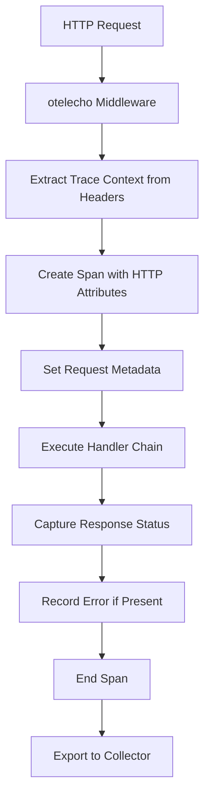

# How to Instrument a Go Echo Application with otelecho Middleware

Author: [nawazdhandala](https://www.github.com/nawazdhandala)

Tags: OpenTelemetry, Go, Echo, otelecho, Middleware, Tracing

Description: Implement comprehensive distributed tracing in Echo web applications using the otelecho middleware package for complete request visibility and performance monitoring.

Echo is a high-performance, minimalist web framework for Go that emphasizes speed and simplicity. When building production Echo applications, observability becomes essential for understanding request flow, identifying bottlenecks, and debugging issues across distributed systems. The otelecho package provides seamless OpenTelemetry integration for Echo applications, automatically instrumenting HTTP requests without requiring code changes to individual handlers.

## Why Instrument Echo with OpenTelemetry

Echo's middleware architecture makes it straightforward to add cross-cutting concerns like logging, authentication, and tracing. By adding OpenTelemetry instrumentation through otelecho, you gain visibility into:

- Request duration and throughput
- HTTP method, status code, and route patterns
- Error rates and failure patterns
- Distributed traces across microservices
- Database and external API call timing

Unlike manual instrumentation where you'd wrap each handler with tracing code, otelecho handles everything automatically through middleware, keeping your handler code clean and focused on business logic.

## Installing Required Dependencies

Start by installing Echo, OpenTelemetry SDK, and the otelecho instrumentation package.

```bash
# Install Echo framework
go get -u github.com/labstack/echo/v4

# Install OpenTelemetry SDK and API
go get -u go.opentelemetry.io/otel
go get -u go.opentelemetry.io/otel/sdk

# Install otelecho middleware
go get -u go.opentelemetry.io/contrib/instrumentation/github.com/labstack/echo/otelecho

# Install OTLP exporter for sending traces
go get -u go.opentelemetry.io/otel/exporters/otlp/otlptrace
go get -u go.opentelemetry.io/otel/exporters/otlp/otlptrace/otlptracegrpc
```

## Configuring OpenTelemetry Tracer Provider

Before using the middleware, you need to initialize the OpenTelemetry SDK with a tracer provider and exporter.

```go
package main

import (
    "context"
    "log"
    "time"

    "go.opentelemetry.io/otel"
    "go.opentelemetry.io/otel/exporters/otlp/otlptrace/otlptracegrpc"
    "go.opentelemetry.io/otel/sdk/resource"
    sdktrace "go.opentelemetry.io/otel/sdk/trace"
    semconv "go.opentelemetry.io/otel/semconv/v1.17.0"
)

// initTracer sets up the OpenTelemetry pipeline with OTLP exporter
// This configuration sends traces to a collector endpoint via gRPC
func initTracer() (*sdktrace.TracerProvider, error) {
    ctx := context.Background()

    // Create OTLP exporter that sends traces via gRPC
    // Default endpoint is localhost:4317
    exporter, err := otlptracegrpc.New(ctx,
        otlptracegrpc.WithInsecure(), // Use TLS in production
        otlptracegrpc.WithEndpoint("localhost:4317"),
    )
    if err != nil {
        return nil, err
    }

    // Define resource attributes that describe your service
    // These attributes appear on every span from this service
    res := resource.NewWithAttributes(
        semconv.SchemaURL,
        semconv.ServiceNameKey.String("echo-api-service"),
        semconv.ServiceVersionKey.String("1.0.0"),
        semconv.DeploymentEnvironmentKey.String("production"),
    )

    // Create tracer provider with batch span processor
    // Batching reduces network overhead by grouping spans
    tp := sdktrace.NewTracerProvider(
        sdktrace.WithBatcher(exporter,
            sdktrace.WithBatchTimeout(5*time.Second),
            sdktrace.WithMaxExportBatchSize(512),
        ),
        sdktrace.WithResource(res),
        sdktrace.WithSampler(sdktrace.AlwaysSample()),
    )

    // Register as global tracer provider
    otel.SetTracerProvider(tp)

    return tp, nil
}
```

## Adding otelecho Middleware to Echo

With the tracer provider initialized, you can add the otelecho middleware to your Echo application.

```go
package main

import (
    "net/http"

    "github.com/labstack/echo/v4"
    "github.com/labstack/echo/v4/middleware"
    "go.opentelemetry.io/contrib/instrumentation/github.com/labstack/echo/otelecho"
)

func main() {
    // Initialize OpenTelemetry tracer
    tp, err := initTracer()
    if err != nil {
        log.Fatalf("Failed to initialize tracer: %v", err)
    }
    defer func() {
        ctx, cancel := context.WithTimeout(context.Background(), 5*time.Second)
        defer cancel()
        if err := tp.Shutdown(ctx); err != nil {
            log.Printf("Error shutting down tracer provider: %v", err)
        }
    }()

    // Create Echo instance
    e := echo.New()

    // Add standard middleware
    e.Use(middleware.Logger())
    e.Use(middleware.Recover())

    // Add otelecho middleware for distributed tracing
    // This must match the service name in your tracer provider
    e.Use(otelecho.Middleware("echo-api-service"))

    // Register routes - these will be automatically traced
    e.GET("/users", listUsers)
    e.GET("/users/:id", getUser)
    e.POST("/users", createUser)
    e.PUT("/users/:id", updateUser)
    e.DELETE("/users/:id", deleteUser)

    // Start server
    log.Println("Server starting on :8080")
    if err := e.Start(":8080"); err != nil && err != http.ErrServerClosed {
        log.Fatalf("Server failed: %v", err)
    }
}
```

## Understanding What otelecho Captures

The otelecho middleware automatically extracts and records comprehensive information about each HTTP request.



The middleware automatically captures:

- **HTTP Method**: GET, POST, PUT, DELETE, PATCH, etc.
- **Route Pattern**: Parameterized route like `/users/:id` not `/users/123`
- **Status Code**: Response HTTP status code
- **Request URL**: Full URL path and query parameters
- **User Agent**: Client user agent header
- **Request/Response Size**: Content length headers
- **Trace Context**: W3C Trace Context headers for distributed tracing

## Implementing Echo Handlers with Context

Echo handlers receive an `echo.Context` that contains the standard `context.Context` with trace information.

```go
import (
    "net/http"

    "github.com/labstack/echo/v4"
)

// User represents a user entity
type User struct {
    ID    int    `json:"id"`
    Name  string `json:"name"`
    Email string `json:"email"`
}

// listUsers retrieves all users
// The span created by otelecho is already active in the request context
func listUsers(c echo.Context) error {
    // Extract the standard context for passing to other functions
    ctx := c.Request().Context()

    // Fetch users from database (will be a child span if instrumented)
    users, err := fetchUsersFromDB(ctx)
    if err != nil {
        return echo.NewHTTPError(http.StatusInternalServerError, "Failed to fetch users")
    }

    return c.JSON(http.StatusOK, users)
}

// getUser retrieves a specific user by ID
func getUser(c echo.Context) error {
    ctx := c.Request().Context()

    // Extract route parameter
    userID := c.Param("id")

    user, err := fetchUserByID(ctx, userID)
    if err != nil {
        return echo.NewHTTPError(http.StatusNotFound, "User not found")
    }

    return c.JSON(http.StatusOK, user)
}

// createUser creates a new user
func createUser(c echo.Context) error {
    ctx := c.Request().Context()

    var user User
    if err := c.Bind(&user); err != nil {
        return echo.NewHTTPError(http.StatusBadRequest, "Invalid request body")
    }

    if err := saveUserToDB(ctx, &user); err != nil {
        return echo.NewHTTPError(http.StatusInternalServerError, "Failed to create user")
    }

    return c.JSON(http.StatusCreated, user)
}

// updateUser updates an existing user
func updateUser(c echo.Context) error {
    ctx := c.Request().Context()
    userID := c.Param("id")

    var updates User
    if err := c.Bind(&updates); err != nil {
        return echo.NewHTTPError(http.StatusBadRequest, "Invalid request body")
    }

    if err := updateUserInDB(ctx, userID, &updates); err != nil {
        return echo.NewHTTPError(http.StatusInternalServerError, "Failed to update user")
    }

    return c.JSON(http.StatusOK, map[string]string{
        "message": "User updated successfully",
    })
}

// deleteUser removes a user by ID
func deleteUser(c echo.Context) error {
    ctx := c.Request().Context()
    userID := c.Param("id")

    if err := deleteUserFromDB(ctx, userID); err != nil {
        return echo.NewHTTPError(http.StatusInternalServerError, "Failed to delete user")
    }

    return c.JSON(http.StatusOK, map[string]string{
        "message": "User deleted successfully",
    })
}
```

## Customizing Middleware with Options

The otelecho package provides configuration options to customize span behavior.

```go
import (
    "go.opentelemetry.io/contrib/instrumentation/github.com/labstack/echo/otelecho"
    "go.opentelemetry.io/otel/trace"
)

func setupEchoWithCustomConfig() *echo.Engine {
    e := echo.New()

    // Use otelecho with custom configuration
    e.Use(otelecho.Middleware(
        "echo-api-service",
        // Skip tracing for health check endpoints
        otelecho.WithSkipper(func(c echo.Context) bool {
            path := c.Path()
            return path == "/health" || path == "/metrics"
        }),
        // Customize which trace propagator to use
        otelecho.WithTracerProvider(otel.GetTracerProvider()),
    ))

    return e
}
```

## Recording Errors and Exceptions

When errors occur in your handlers, you should record them in the active span for better observability.

```go
import (
    "go.opentelemetry.io/otel/codes"
    "go.opentelemetry.io/otel/trace"
)

// riskyOperation performs an operation that might fail
func riskyOperation(c echo.Context) error {
    ctx := c.Request().Context()

    // Get the current span from context
    span := trace.SpanFromContext(ctx)

    result, err := performDatabaseOperation(ctx)
    if err != nil {
        // Record the error in the span
        span.RecordError(err)
        span.SetStatus(codes.Error, err.Error())

        return echo.NewHTTPError(
            http.StatusInternalServerError,
            "Operation failed",
        )
    }

    span.SetStatus(codes.Ok, "Operation successful")
    return c.JSON(http.StatusOK, result)
}
```

## Adding Custom Spans for Business Logic

Sometimes you need to create additional spans to track specific operations within your handler.

```go
import (
    "go.opentelemetry.io/otel"
    "go.opentelemetry.io/otel/attribute"
)

// complexHandler performs multiple operations that should be individually traced
func complexHandler(c echo.Context) error {
    ctx := c.Request().Context()

    // Get tracer for creating custom spans
    tracer := otel.Tracer("echo-api-service")

    // Create custom span for validation
    ctx, validateSpan := tracer.Start(ctx, "validate_request",
        trace.WithAttributes(
            attribute.String("handler", "complexHandler"),
        ),
    )
    if err := validateRequest(c); err != nil {
        validateSpan.RecordError(err)
        validateSpan.End()
        return echo.NewHTTPError(http.StatusBadRequest, err.Error())
    }
    validateSpan.End()

    // Create custom span for business logic
    ctx, processSpan := tracer.Start(ctx, "process_business_logic")
    result, err := processBusinessLogic(ctx, c.Param("id"))
    if err != nil {
        processSpan.RecordError(err)
        processSpan.End()
        return echo.NewHTTPError(http.StatusInternalServerError, "Processing failed")
    }
    processSpan.End()

    // Create custom span for external API call
    ctx, apiSpan := tracer.Start(ctx, "call_external_api",
        trace.WithAttributes(
            attribute.String("api.endpoint", "https://api.example.com"),
        ),
    )
    apiResponse, err := callExternalAPI(ctx, result)
    if err != nil {
        apiSpan.RecordError(err)
        apiSpan.End()
        return echo.NewHTTPError(http.StatusBadGateway, "External API failed")
    }
    apiSpan.End()

    return c.JSON(http.StatusOK, apiResponse)
}
```

## Integrating with Echo Groups and Subrouters

Echo's group feature allows you to organize routes, and otelecho works seamlessly with grouped routes.

```go
func setupRoutesWithGroups(e *echo.Echo) {
    // Add global middleware
    e.Use(otelecho.Middleware("echo-api-service"))

    // Create API v1 group
    v1 := e.Group("/api/v1")

    // User routes
    users := v1.Group("/users")
    users.GET("", listUsers)
    users.GET("/:id", getUser)
    users.POST("", createUser)
    users.PUT("/:id", updateUser)
    users.DELETE("/:id", deleteUser)

    // Product routes
    products := v1.Group("/products")
    products.GET("", listProducts)
    products.GET("/:id", getProduct)
    products.POST("", createProduct)

    // Admin routes with additional middleware
    admin := v1.Group("/admin")
    admin.Use(authMiddleware) // Custom auth middleware
    admin.GET("/stats", getStats)
    admin.POST("/config", updateConfig)

    // Health check endpoint (not traced due to skipper)
    e.GET("/health", func(c echo.Context) error {
        return c.JSON(http.StatusOK, map[string]string{
            "status": "healthy",
        })
    })
}
```

## Propagating Context to Database Operations

When using database libraries, pass the extracted context to enable query tracing.

```go
import (
    "database/sql"
    "time"
)

type UserRepository struct {
    db *sql.DB
}

// FindByID retrieves a user by ID with context for tracing
func (r *UserRepository) FindByID(ctx context.Context, id string) (*User, error) {
    query := "SELECT id, name, email FROM users WHERE id = ?"

    var user User

    // Use QueryRowContext to propagate trace context
    err := r.db.QueryRowContext(ctx, query, id).Scan(
        &user.ID,
        &user.Name,
        &user.Email,
    )

    if err != nil {
        return nil, err
    }

    return &user, nil
}

// Save creates or updates a user with context for tracing
func (r *UserRepository) Save(ctx context.Context, user *User) error {
    query := `
        INSERT INTO users (name, email, created_at)
        VALUES (?, ?, ?)
        ON DUPLICATE KEY UPDATE
            name = VALUES(name),
            email = VALUES(email)
    `

    _, err := r.db.ExecContext(ctx, query,
        user.Name,
        user.Email,
        time.Now(),
    )

    return err
}
```

## Making Traced HTTP Requests to External Services

When calling other services, use an instrumented HTTP client to propagate trace context.

```go
import (
    "bytes"
    "encoding/json"
    "io"
    "net/http"

    "go.opentelemetry.io/contrib/instrumentation/net/http/otelhttp"
)

// ExternalAPIClient wraps HTTP calls with tracing
type ExternalAPIClient struct {
    client  *http.Client
    baseURL string
}

// NewExternalAPIClient creates a client with OpenTelemetry instrumentation
func NewExternalAPIClient(baseURL string) *ExternalAPIClient {
    return &ExternalAPIClient{
        client: &http.Client{
            Transport: otelhttp.NewTransport(http.DefaultTransport),
            Timeout:   10 * time.Second,
        },
        baseURL: baseURL,
    }
}

// GetUser fetches user data from external API with trace propagation
func (c *ExternalAPIClient) GetUser(ctx context.Context, userID string) (*User, error) {
    url := fmt.Sprintf("%s/users/%s", c.baseURL, userID)

    // Create request with context containing span information
    req, err := http.NewRequestWithContext(ctx, "GET", url, nil)
    if err != nil {
        return nil, err
    }

    // Execute request - trace context propagates via HTTP headers
    resp, err := c.client.Do(req)
    if err != nil {
        return nil, err
    }
    defer resp.Body.Close()

    if resp.StatusCode != http.StatusOK {
        return nil, fmt.Errorf("API returned status %d", resp.StatusCode)
    }

    var user User
    if err := json.NewDecoder(resp.Body).Decode(&user); err != nil {
        return nil, err
    }

    return &user, nil
}

// Handler that uses the external API client
func getUserWithExternalData(c echo.Context) error {
    ctx := c.Request().Context()
    userID := c.Param("id")

    // Create API client
    apiClient := NewExternalAPIClient("https://api.example.com")

    // Fetch user from external service - creates child span
    externalUser, err := apiClient.GetUser(ctx, userID)
    if err != nil {
        return echo.NewHTTPError(
            http.StatusBadGateway,
            "Failed to fetch external user data",
        )
    }

    return c.JSON(http.StatusOK, externalUser)
}
```

## Implementing Graceful Shutdown

Proper shutdown ensures all spans are exported before the application exits.

```go
import (
    "os"
    "os/signal"
    "syscall"
)

func main() {
    tp, err := initTracer()
    if err != nil {
        log.Fatalf("Failed to initialize tracer: %v", err)
    }

    e := echo.New()
    e.Use(otelecho.Middleware("echo-api-service"))

    // Register routes
    setupRoutes(e)

    // Start server in goroutine
    go func() {
        log.Println("Server starting on :8080")
        if err := e.Start(":8080"); err != nil && err != http.ErrServerClosed {
            log.Fatalf("Server failed: %v", err)
        }
    }()

    // Wait for interrupt signal
    quit := make(chan os.Signal, 1)
    signal.Notify(quit, syscall.SIGINT, syscall.SIGTERM)
    <-quit

    log.Println("Shutting down server...")

    // Create shutdown context with timeout
    ctx, cancel := context.WithTimeout(context.Background(), 10*time.Second)
    defer cancel()

    // Shutdown server gracefully
    if err := e.Shutdown(ctx); err != nil {
        log.Printf("Server shutdown error: %v", err)
    }

    // Shutdown tracer provider to flush remaining spans
    if err := tp.Shutdown(ctx); err != nil {
        log.Printf("Tracer shutdown error: %v", err)
    }

    log.Println("Server stopped")
}
```

## Testing Instrumented Echo Applications

You can test that your instrumentation is working correctly using an in-memory exporter.

```go
import (
    "net/http/httptest"
    "testing"

    "github.com/labstack/echo/v4"
    "github.com/stretchr/testify/assert"
    "go.opentelemetry.io/otel"
    sdktrace "go.opentelemetry.io/otel/sdk/trace"
    "go.opentelemetry.io/otel/sdk/trace/tracetest"
)

func TestOtelechoInstrumentation(t *testing.T) {
    // Create in-memory span recorder
    spanRecorder := tracetest.NewSpanRecorder()

    // Create tracer provider with span recorder
    tp := sdktrace.NewTracerProvider(
        sdktrace.WithSpanProcessor(spanRecorder),
    )
    otel.SetTracerProvider(tp)

    // Create Echo instance with middleware
    e := echo.New()
    e.Use(otelecho.Middleware("test-service"))

    // Register test route
    e.GET("/test", func(c echo.Context) error {
        return c.JSON(http.StatusOK, map[string]string{
            "message": "test",
        })
    })

    // Create test request
    req := httptest.NewRequest(http.MethodGet, "/test", nil)
    rec := httptest.NewRecorder()

    // Execute request
    e.ServeHTTP(rec, req)

    // Verify response
    assert.Equal(t, http.StatusOK, rec.Code)

    // Verify span was created
    spans := spanRecorder.Ended()
    assert.Equal(t, 1, len(spans))

    // Verify span attributes
    span := spans[0]
    assert.Equal(t, "GET /test", span.Name())
}
```

## Complete Working Example

Here's a complete, production-ready example demonstrating otelecho integration:

```go
package main

import (
    "context"
    "log"
    "net/http"
    "os"
    "os/signal"
    "syscall"
    "time"

    "github.com/labstack/echo/v4"
    "github.com/labstack/echo/v4/middleware"
    "go.opentelemetry.io/contrib/instrumentation/github.com/labstack/echo/otelecho"
    "go.opentelemetry.io/otel"
    "go.opentelemetry.io/otel/exporters/otlp/otlptrace/otlptracegrpc"
    "go.opentelemetry.io/otel/sdk/resource"
    sdktrace "go.opentelemetry.io/otel/sdk/trace"
    semconv "go.opentelemetry.io/otel/semconv/v1.17.0"
)

type User struct {
    ID   int    `json:"id"`
    Name string `json:"name"`
}

func main() {
    tp, err := initTracer()
    if err != nil {
        log.Fatalf("Failed to initialize tracer: %v", err)
    }

    e := echo.New()
    e.Use(middleware.Logger())
    e.Use(middleware.Recover())
    e.Use(otelecho.Middleware("echo-api-service"))

    e.GET("/users", func(c echo.Context) error {
        users := []User{
            {ID: 1, Name: "Alice"},
            {ID: 2, Name: "Bob"},
        }
        return c.JSON(http.StatusOK, users)
    })

    go func() {
        log.Println("Server starting on :8080")
        if err := e.Start(":8080"); err != nil && err != http.ErrServerClosed {
            log.Fatalf("Server failed: %v", err)
        }
    }()

    quit := make(chan os.Signal, 1)
    signal.Notify(quit, syscall.SIGINT, syscall.SIGTERM)
    <-quit

    ctx, cancel := context.WithTimeout(context.Background(), 10*time.Second)
    defer cancel()

    if err := e.Shutdown(ctx); err != nil {
        log.Printf("Server shutdown error: %v", err)
    }

    if err := tp.Shutdown(ctx); err != nil {
        log.Printf("Tracer shutdown error: %v", err)
    }
}

func initTracer() (*sdktrace.TracerProvider, error) {
    ctx := context.Background()

    exporter, err := otlptracegrpc.New(ctx,
        otlptracegrpc.WithInsecure(),
        otlptracegrpc.WithEndpoint("localhost:4317"),
    )
    if err != nil {
        return nil, err
    }

    res := resource.NewWithAttributes(
        semconv.SchemaURL,
        semconv.ServiceNameKey.String("echo-api-service"),
    )

    tp := sdktrace.NewTracerProvider(
        sdktrace.WithBatcher(exporter),
        sdktrace.WithResource(res),
    )

    otel.SetTracerProvider(tp)
    return tp, nil
}
```

The otelecho middleware provides robust, production-ready instrumentation for Echo applications with minimal setup. By adding just a few lines of middleware configuration, you gain comprehensive visibility into request patterns, performance characteristics, and error conditions across your entire service ecosystem.
