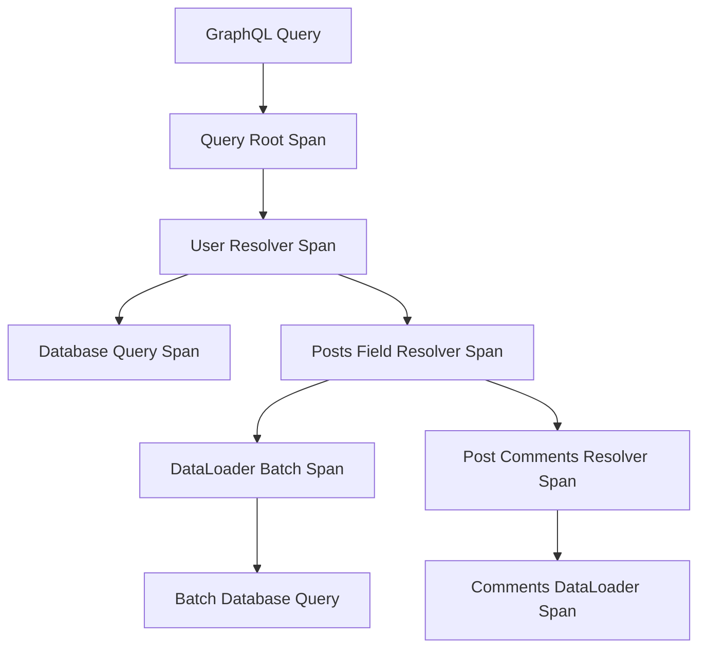

# How to Instrument Go GraphQL Resolvers with OpenTelemetry

Author: [nawazdhandala](https://www.github.com/nawazdhandala)

Tags: OpenTelemetry, Go, GraphQL, Resolvers, Tracing, gqlgen

Description: Implement comprehensive OpenTelemetry instrumentation for GraphQL resolvers to trace queries, mutations, field resolvers, and data loaders with context propagation.

GraphQL's flexible query language introduces unique observability challenges. A single GraphQL query can trigger dozens of resolver functions, each potentially making database calls or invoking downstream services. Without proper instrumentation, debugging slow queries becomes nearly impossible because you can't see which specific resolvers are causing delays or how the N+1 query problem manifests in your data loading patterns.

OpenTelemetry provides the tools to create detailed traces of GraphQL execution, showing not just the overall query duration but the performance characteristics of every field resolver, the relationships between parent and child resolvers, and the efficiency of your data loader batching strategies.

## GraphQL Execution Model and Tracing

GraphQL queries execute through a resolver chain. When a client requests nested data, the GraphQL engine calls resolvers in a specific order, with parent resolvers completing before child resolvers receive their data. This execution model maps naturally to OpenTelemetry's span hierarchy.



Each resolver becomes a span, with field-level resolution creating child spans under their parent resolvers. This structure makes it easy to identify slow resolvers and understand data loading patterns.

## Setting Up gqlgen with OpenTelemetry

The gqlgen library is the most popular GraphQL server implementation for Go. Start by defining your GraphQL schema and generating the server code.

```graphql
# schema.graphql
type Query {
    user(id: ID!): User
    users(limit: Int): [User!]!
}

type Mutation {
    createUser(input: CreateUserInput!): User!
    updateUser(id: ID!, input: UpdateUserInput!): User
}

type User {
    id: ID!
    name: String!
    email: String!
    posts: [Post!]!
    createdAt: String!
}

type Post {
    id: ID!
    title: String!
    content: String!
    author: User!
    comments: [Comment!]!
}

type Comment {
    id: ID!
    text: String!
    author: User!
    post: Post!
}

input CreateUserInput {
    name: String!
    email: String!
}

input UpdateUserInput {
    name: String
    email: String
}
```

Initialize OpenTelemetry with appropriate configuration for GraphQL tracing.

```go
package main

import (
    "context"
    "fmt"
    "log"
    "net/http"
    "time"

    "github.com/99designs/gqlgen/graphql"
    "github.com/99designs/gqlgen/graphql/handler"
    "github.com/99designs/gqlgen/graphql/playground"
    "go.opentelemetry.io/otel"
    "go.opentelemetry.io/otel/attribute"
    "go.opentelemetry.io/otel/exporters/otlp/otlptrace/otlptracegrpc"
    "go.opentelemetry.io/otel/propagation"
    "go.opentelemetry.io/otel/sdk/resource"
    "go.opentelemetry.io/otel/sdk/trace"
    semconv "go.opentelemetry.io/otel/semconv/v1.21.0"
    oteltrace "go.opentelemetry.io/otel/trace"
)

func initTracer() (*trace.TracerProvider, error) {
    ctx := context.Background()

    exporter, err := otlptracegrpc.New(ctx,
        otlptracegrpc.WithEndpoint("localhost:4317"),
        otlptracegrpc.WithInsecure(),
    )
    if err != nil {
        return nil, fmt.Errorf("creating OTLP exporter: %w", err)
    }

    res, err := resource.New(ctx,
        resource.WithAttributes(
            semconv.ServiceName("graphql-api"),
            semconv.ServiceVersion("1.0.0"),
            attribute.String("graphql.server", "gqlgen"),
        ),
    )
    if err != nil {
        return nil, fmt.Errorf("creating resource: %w", err)
    }

    tp := trace.NewTracerProvider(
        trace.WithBatcher(exporter),
        trace.WithResource(res),
        trace.WithSampler(trace.AlwaysSample()),
    )

    otel.SetTracerProvider(tp)
    otel.SetTextMapPropagator(propagation.TraceContext{})

    return tp, nil
}
```

This configuration sets up trace export with resource attributes that identify your GraphQL service in your observability backend.

## Creating GraphQL Middleware for Tracing

Build middleware that intercepts GraphQL operations and creates spans for queries, mutations, and field resolvers.

```go
// OperationTracer creates spans for top-level GraphQL operations
type OperationTracer struct {
    tracer oteltrace.Tracer
}

func NewOperationTracer() *OperationTracer {
    return &OperationTracer{
        tracer: otel.Tracer("graphql-operations"),
    }
}

var _ graphql.HandlerExtension = &OperationTracer{}
var _ graphql.OperationInterceptor = &OperationTracer{}
var _ graphql.ResponseInterceptor = &OperationTracer{}
var _ graphql.FieldInterceptor = &OperationTracer{}

func (t *OperationTracer) ExtensionName() string {
    return "OpenTelemetryTracer"
}

func (t *OperationTracer) Validate(schema graphql.ExecutableSchema) error {
    return nil
}

// InterceptOperation creates a span for the entire GraphQL operation
func (t *OperationTracer) InterceptOperation(ctx context.Context, next graphql.OperationHandler) graphql.ResponseHandler {
    oc := graphql.GetOperationContext(ctx)

    operationType := "query"
    if oc.Operation != nil && oc.Operation.Operation != "" {
        operationType = string(oc.Operation.Operation)
    }

    operationName := "anonymous"
    if oc.OperationName != "" {
        operationName = oc.OperationName
    }

    spanName := fmt.Sprintf("%s %s", operationType, operationName)
    ctx, span := t.tracer.Start(ctx, spanName,
        oteltrace.WithSpanKind(oteltrace.SpanKindServer),
    )
    defer span.End()

    // Add operation details to span
    span.SetAttributes(
        attribute.String("graphql.operation.type", operationType),
        attribute.String("graphql.operation.name", operationName),
        attribute.String("graphql.query", oc.RawQuery),
    )

    // Add variables if present
    if len(oc.Variables) > 0 {
        span.SetAttributes(
            attribute.Int("graphql.variables.count", len(oc.Variables)),
        )
    }

    // Store span in context for field resolvers
    ctx = context.WithValue(ctx, "otel.operation.span", span)

    return next(ctx)
}

// InterceptResponse captures operation results and errors
func (t *OperationTracer) InterceptResponse(ctx context.Context, next graphql.ResponseHandler) *graphql.Response {
    span := oteltrace.SpanFromContext(ctx)

    response := next(ctx)

    if response != nil {
        if len(response.Errors) > 0 {
            span.SetAttributes(
                attribute.Int("graphql.errors.count", len(response.Errors)),
            )

            for i, err := range response.Errors {
                span.AddEvent(fmt.Sprintf("graphql.error.%d", i), oteltrace.WithAttributes(
                    attribute.String("error.message", err.Message),
                    attribute.String("error.path", fmt.Sprintf("%v", err.Path)),
                ))
            }
        }
    }

    return response
}

// InterceptField creates spans for individual field resolvers
func (t *OperationTracer) InterceptField(ctx context.Context, next graphql.Resolver) (interface{}, error) {
    fc := graphql.GetFieldContext(ctx)

    spanName := fmt.Sprintf("%s.%s", fc.Object, fc.Field.Name)
    ctx, span := t.tracer.Start(ctx, spanName,
        oteltrace.WithSpanKind(oteltrace.SpanKindInternal),
    )
    defer span.End()

    // Add field resolution details
    span.SetAttributes(
        attribute.String("graphql.field.object", fc.Object),
        attribute.String("graphql.field.name", fc.Field.Name),
        attribute.String("graphql.field.alias", fc.Field.Alias),
        attribute.Bool("graphql.field.is_method", fc.IsMethod),
        attribute.Bool("graphql.field.is_resolver", fc.IsResolver),
    )

    // Add arguments if present
    if len(fc.Args) > 0 {
        span.SetAttributes(
            attribute.Int("graphql.field.args.count", len(fc.Args)),
        )
    }

    start := time.Now()
    res, err := next(ctx)
    duration := time.Since(start)

    span.SetAttributes(
        attribute.Int64("graphql.field.duration_ms", duration.Milliseconds()),
    )

    if err != nil {
        span.SetAttributes(
            attribute.String("error.message", err.Error()),
            attribute.Bool("graphql.field.error", true),
        )
    }

    return res, err
}
```

This tracer implements gqlgen's extension interfaces to intercept operations, responses, and field resolutions, creating a complete trace hierarchy.

## Implementing Instrumented Resolvers

Create resolver implementations that work with the tracing middleware and add custom instrumentation where needed.

```go
// Resolver is the root resolver
type Resolver struct {
    userRepo    *UserRepository
    postRepo    *PostRepository
    commentRepo *CommentRepository
    userLoader  *UserLoader
    postLoader  *PostLoader
}

// Query resolver implementation
type queryResolver struct{ *Resolver }

func (r *queryResolver) User(ctx context.Context, id string) (*User, error) {
    span := oteltrace.SpanFromContext(ctx)
    span.SetAttributes(
        attribute.String("user.id", id),
    )

    user, err := r.userRepo.FindByID(ctx, id)
    if err != nil {
        span.SetAttributes(attribute.String("error", err.Error()))
        return nil, err
    }

    if user == nil {
        span.SetAttributes(attribute.Bool("user.not_found", true))
        return nil, fmt.Errorf("user not found")
    }

    span.SetAttributes(
        attribute.String("user.name", user.Name),
        attribute.String("user.email", user.Email),
    )

    return user, nil
}

func (r *queryResolver) Users(ctx context.Context, limit *int) ([]*User, error) {
    span := oteltrace.SpanFromContext(ctx)

    queryLimit := 10
    if limit != nil {
        queryLimit = *limit
    }

    span.SetAttributes(
        attribute.Int("query.limit", queryLimit),
    )

    users, err := r.userRepo.FindAll(ctx, queryLimit)
    if err != nil {
        return nil, err
    }

    span.SetAttributes(
        attribute.Int("users.count", len(users)),
    )

    return users, nil
}

// Mutation resolver implementation
type mutationResolver struct{ *Resolver }

func (r *mutationResolver) CreateUser(ctx context.Context, input CreateUserInput) (*User, error) {
    span := oteltrace.SpanFromContext(ctx)
    span.SetAttributes(
        attribute.String("input.name", input.Name),
        attribute.String("input.email", input.Email),
    )

    user := &User{
        ID:        generateID(),
        Name:      input.Name,
        Email:     input.Email,
        CreatedAt: time.Now().Format(time.RFC3339),
    }

    if err := r.userRepo.Create(ctx, user); err != nil {
        span.SetAttributes(attribute.String("error", err.Error()))
        return nil, err
    }

    span.SetAttributes(
        attribute.String("user.id", user.ID),
        attribute.Bool("user.created", true),
    )

    return user, nil
}

func (r *mutationResolver) UpdateUser(ctx context.Context, id string, input UpdateUserInput) (*User, error) {
    span := oteltrace.SpanFromContext(ctx)
    span.SetAttributes(
        attribute.String("user.id", id),
    )

    user, err := r.userRepo.FindByID(ctx, id)
    if err != nil || user == nil {
        return nil, fmt.Errorf("user not found")
    }

    updated := false
    if input.Name != nil {
        user.Name = *input.Name
        updated = true
        span.SetAttributes(attribute.Bool("updated.name", true))
    }
    if input.Email != nil {
        user.Email = *input.Email
        updated = true
        span.SetAttributes(attribute.Bool("updated.email", true))
    }

    if updated {
        if err := r.userRepo.Update(ctx, user); err != nil {
            return nil, err
        }
    }

    span.SetAttributes(attribute.Bool("user.updated", updated))
    return user, nil
}

// User field resolver for nested data
type userResolver struct{ *Resolver }

func (r *userResolver) Posts(ctx context.Context, obj *User) ([]*Post, error) {
    span := oteltrace.SpanFromContext(ctx)
    span.SetAttributes(
        attribute.String("user.id", obj.ID),
    )

    posts, err := r.postRepo.FindByUserID(ctx, obj.ID)
    if err != nil {
        return nil, err
    }

    span.SetAttributes(
        attribute.Int("posts.count", len(posts)),
    )

    return posts, nil
}
```

Each resolver method extracts the span from context and adds relevant attributes that describe what the resolver is doing and what data it's operating on.

## Instrumenting DataLoaders

DataLoaders batch and cache data fetches to solve the N+1 query problem. Instrument them to show batching efficiency.

```go
// UserLoader batches user fetches
type UserLoader struct {
    repo   *UserRepository
    tracer oteltrace.Tracer
}

func NewUserLoader(repo *UserRepository) *UserLoader {
    return &UserLoader{
        repo:   repo,
        tracer: otel.Tracer("dataloader"),
    }
}

func (l *UserLoader) LoadBatch(ctx context.Context, ids []string) ([]interface{}, []error) {
    ctx, span := l.tracer.Start(ctx, "UserLoader.LoadBatch")
    defer span.End()

    span.SetAttributes(
        attribute.Int("dataloader.batch.size", len(ids)),
        attribute.StringSlice("dataloader.batch.ids", ids),
    )

    start := time.Now()
    users, err := l.repo.FindByIDs(ctx, ids)
    duration := time.Since(start)

    span.SetAttributes(
        attribute.Int64("dataloader.query.duration_ms", duration.Milliseconds()),
    )

    if err != nil {
        span.SetAttributes(attribute.String("error", err.Error()))
        errors := make([]error, len(ids))
        for i := range errors {
            errors[i] = err
        }
        return nil, errors
    }

    // Create map for O(1) lookup
    userMap := make(map[string]*User)
    for _, user := range users {
        userMap[user.ID] = user
    }

    // Return users in same order as requested IDs
    results := make([]interface{}, len(ids))
    errors := make([]error, len(ids))
    foundCount := 0

    for i, id := range ids {
        if user, ok := userMap[id]; ok {
            results[i] = user
            foundCount++
        } else {
            errors[i] = fmt.Errorf("user not found: %s", id)
        }
    }

    span.SetAttributes(
        attribute.Int("dataloader.results.found", foundCount),
        attribute.Int("dataloader.results.missing", len(ids)-foundCount),
        attribute.Float64("dataloader.batch.efficiency", float64(foundCount)/float64(len(ids))),
    )

    return results, errors
}

// Repository with tracing
type UserRepository struct {
    db     *sql.DB
    tracer oteltrace.Tracer
}

func (r *UserRepository) FindByIDs(ctx context.Context, ids []string) ([]*User, error) {
    ctx, span := r.tracer.Start(ctx, "UserRepository.FindByIDs")
    defer span.End()

    span.SetAttributes(
        attribute.Int("query.ids.count", len(ids)),
    )

    query := "SELECT id, name, email, created_at FROM users WHERE id = ANY($1)"

    rows, err := r.db.QueryContext(ctx, query, pq.Array(ids))
    if err != nil {
        return nil, err
    }
    defer rows.Close()

    var users []*User
    for rows.Next() {
        var user User
        if err := rows.Scan(&user.ID, &user.Name, &user.Email, &user.CreatedAt); err != nil {
            return nil, err
        }
        users = append(users, &user)
    }

    span.SetAttributes(
        attribute.Int("query.results.count", len(users)),
    )

    return users, rows.Err()
}
```

The dataloader spans show batch sizes and efficiency metrics, making it easy to identify when batching isn't working as expected.

## Complete Server Setup

Wire everything together with the tracing middleware and dataloaders.

```go
func main() {
    tp, err := initTracer()
    if err != nil {
        log.Fatalf("Failed to initialize tracer: %v", err)
    }
    defer func() {
        if err := tp.Shutdown(context.Background()); err != nil {
            log.Printf("Error shutting down tracer: %v", err)
        }
    }()

    // Initialize database connection
    db, err := sql.Open("postgres", "postgresql://localhost/graphql_db")
    if err != nil {
        log.Fatal(err)
    }
    defer db.Close()

    // Create repositories
    userRepo := &UserRepository{db: db, tracer: otel.Tracer("repository")}
    postRepo := &PostRepository{db: db, tracer: otel.Tracer("repository")}
    commentRepo := &CommentRepository{db: db, tracer: otel.Tracer("repository")}

    // Create dataloaders
    userLoader := NewUserLoader(userRepo)
    postLoader := NewPostLoader(postRepo)

    // Create resolver
    resolver := &Resolver{
        userRepo:    userRepo,
        postRepo:    postRepo,
        commentRepo: commentRepo,
        userLoader:  userLoader,
        postLoader:  postLoader,
    }

    // Create GraphQL server with tracing
    srv := handler.NewDefaultServer(generated.NewExecutableSchema(generated.Config{
        Resolvers: resolver,
    }))

    // Add OpenTelemetry tracer extension
    srv.Use(NewOperationTracer())

    // Set up HTTP handlers
    http.Handle("/", playground.Handler("GraphQL Playground", "/query"))
    http.Handle("/query", srv)

    log.Println("GraphQL server listening on :8080")
    log.Fatal(http.ListenAndServe(":8080", nil))
}

func generateID() string {
    return fmt.Sprintf("%d", time.Now().UnixNano())
}
```

This setup creates a fully instrumented GraphQL server where every operation, resolver, and dataloader batch is traced with OpenTelemetry.

## Analyzing GraphQL Traces

When you query your GraphQL API, the traces reveal the complete execution flow:

```graphql
query GetUserWithPosts {
    user(id: "123") {
        name
        email
        posts {
            title
            comments {
                text
                author {
                    name
                }
            }
        }
    }
}
```

This query generates a trace hierarchy showing the root query span, the user resolver span with its database query, the posts resolver span with its batched fetch, and the nested comments and author resolver spans. You can immediately see if the N+1 problem exists or if dataloaders are batching effectively.

OpenTelemetry instrumentation transforms GraphQL from a black box into a transparent execution engine where you can see exactly how your resolvers perform, identify inefficient data fetching patterns, and optimize based on real production data rather than assumptions.