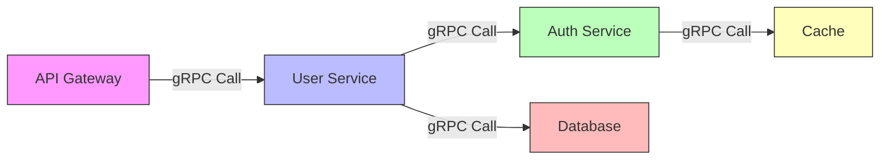

# How to Instrument Go gRPC Services with OpenTelemetry Interceptors

Author: [nawazdhandala](https://www.github.com/nawazdhandala)

Tags: OpenTelemetry, Go, gRPC, Interceptors, Tracing, Microservices

Description: Learn how to instrument Go gRPC services using OpenTelemetry interceptors for comprehensive distributed tracing across your microservices architecture.

When building microservices with gRPC in Go, observability becomes critical for debugging and performance optimization. OpenTelemetry provides powerful interceptors that automatically capture traces for both unary and streaming RPCs, giving you complete visibility into your service mesh.

## Understanding gRPC Interceptors

gRPC interceptors work like middleware in HTTP servers. They wrap around RPC calls, allowing you to inject cross-cutting concerns like logging, authentication, and tracing without modifying business logic. OpenTelemetry leverages this pattern to automatically instrument your gRPC services.

There are four types of interceptors:
- Unary server interceptors (for simple request-response calls)
- Unary client interceptors (for outgoing simple calls)
- Stream server interceptors (for streaming RPCs on the server)
- Stream client interceptors (for streaming RPCs on the client)

## Setting Up OpenTelemetry for gRPC

First, you need to initialize the OpenTelemetry SDK with a tracer provider. This example uses the OTLP exporter to send traces to a collector.

```go
package main

import (
    "context"
    "log"
    "time"

    "go.opentelemetry.io/otel"
    "go.opentelemetry.io/otel/exporters/otlp/otlptrace/otlptracegrpc"
    "go.opentelemetry.io/otel/sdk/resource"
    sdktrace "go.opentelemetry.io/otel/sdk/trace"
    semconv "go.opentelemetry.io/otel/semconv/v1.21.0"
)

// Initialize OpenTelemetry tracer provider with OTLP exporter
func initTracer(serviceName string) (*sdktrace.TracerProvider, error) {
    ctx := context.Background()

    // Create OTLP trace exporter
    exporter, err := otlptracegrpc.New(ctx,
        otlptracegrpc.WithEndpoint("localhost:4317"),
        otlptracegrpc.WithInsecure(),
    )
    if err != nil {
        return nil, err
    }

    // Define service resource attributes
    res, err := resource.New(ctx,
        resource.WithAttributes(
            semconv.ServiceNameKey.String(serviceName),
            semconv.ServiceVersionKey.String("1.0.0"),
        ),
    )
    if err != nil {
        return nil, err
    }

    // Create tracer provider with batch span processor
    tp := sdktrace.NewTracerProvider(
        sdktrace.WithBatcher(exporter),
        sdktrace.WithResource(res),
        sdktrace.WithSampler(sdktrace.AlwaysSample()),
    )

    // Set global tracer provider
    otel.SetTracerProvider(tp)

    return tp, nil
}
```

## Instrumenting a gRPC Server

Now we'll create a gRPC server with OpenTelemetry interceptors. These interceptors automatically create spans for incoming requests.

```go
package main

import (
    "context"
    "fmt"
    "log"
    "net"

    "google.golang.org/grpc"
    "go.opentelemetry.io/contrib/instrumentation/google.golang.org/grpc/otelgrpc"

    pb "your-module/proto" // Your generated protobuf code
)

// Server implements the gRPC service interface
type server struct {
    pb.UnimplementedUserServiceServer
}

// GetUser is a unary RPC method that retrieves user information
func (s *server) GetUser(ctx context.Context, req *pb.GetUserRequest) (*pb.User, error) {
    // Your business logic here
    // The span is automatically created by the interceptor

    user := &pb.User{
        Id:    req.GetId(),
        Name:  "John Doe",
        Email: "john@example.com",
    }

    return user, nil
}

// ListUsers is a server streaming RPC method
func (s *server) ListUsers(req *pb.ListUsersRequest, stream pb.UserService_ListUsersServer) error {
    // Stream multiple users back to client
    // The interceptor handles streaming spans automatically

    users := []*pb.User{
        {Id: 1, Name: "Alice", Email: "alice@example.com"},
        {Id: 2, Name: "Bob", Email: "bob@example.com"},
        {Id: 3, Name: "Charlie", Email: "charlie@example.com"},
    }

    for _, user := range users {
        if err := stream.Send(user); err != nil {
            return err
        }
    }

    return nil
}

func startGRPCServer() error {
    // Initialize OpenTelemetry
    tp, err := initTracer("user-service")
    if err != nil {
        return fmt.Errorf("failed to initialize tracer: %w", err)
    }
    defer func() {
        if err := tp.Shutdown(context.Background()); err != nil {
            log.Printf("Error shutting down tracer provider: %v", err)
        }
    }()

    // Create listener
    lis, err := net.Listen("tcp", ":50051")
    if err != nil {
        return fmt.Errorf("failed to listen: %w", err)
    }

    // Create gRPC server with OpenTelemetry interceptors
    grpcServer := grpc.NewServer(
        grpc.UnaryInterceptor(otelgrpc.UnaryServerInterceptor()),
        grpc.StreamInterceptor(otelgrpc.StreamServerInterceptor()),
    )

    // Register service implementation
    pb.RegisterUserServiceServer(grpcServer, &server{})

    log.Printf("Server listening on %v", lis.Addr())
    return grpcServer.Serve(lis)
}
```

## Instrumenting a gRPC Client

Client-side instrumentation is equally important for end-to-end tracing. The client interceptors propagate trace context to downstream services.

```go
package main

import (
    "context"
    "log"
    "time"

    "google.golang.org/grpc"
    "google.golang.org/grpc/credentials/insecure"
    "go.opentelemetry.io/contrib/instrumentation/google.golang.org/grpc/otelgrpc"

    pb "your-module/proto"
)

// Create a gRPC client with OpenTelemetry interceptors
func createInstrumentedClient(address string) (*grpc.ClientConn, error) {
    // Dial with OpenTelemetry interceptors for automatic instrumentation
    conn, err := grpc.Dial(
        address,
        grpc.WithTransportCredentials(insecure.NewCredentials()),
        grpc.WithUnaryInterceptor(otelgrpc.UnaryClientInterceptor()),
        grpc.WithStreamInterceptor(otelgrpc.StreamClientInterceptor()),
    )
    if err != nil {
        return nil, err
    }

    return conn, nil
}

// Example client usage with tracing
func makeTracedRequest() error {
    // Initialize tracer for client
    tp, err := initTracer("user-client")
    if err != nil {
        return err
    }
    defer tp.Shutdown(context.Background())

    // Create instrumented client connection
    conn, err := createInstrumentedClient("localhost:50051")
    if err != nil {
        return err
    }
    defer conn.Close()

    client := pb.NewUserServiceClient(conn)

    // Create context with timeout
    ctx, cancel := context.WithTimeout(context.Background(), time.Second*10)
    defer cancel()

    // Make unary RPC call - automatically traced
    user, err := client.GetUser(ctx, &pb.GetUserRequest{Id: 123})
    if err != nil {
        log.Printf("Failed to get user: %v", err)
        return err
    }

    log.Printf("Received user: %v", user)

    // Make streaming RPC call - also automatically traced
    stream, err := client.ListUsers(ctx, &pb.ListUsersRequest{})
    if err != nil {
        log.Printf("Failed to list users: %v", err)
        return err
    }

    for {
        user, err := stream.Recv()
        if err != nil {
            break
        }
        log.Printf("Received user from stream: %v", user)
    }

    return nil
}
```

## Adding Custom Attributes to gRPC Spans

While automatic instrumentation captures standard gRPC metadata, you often want to add custom attributes for better observability.

```go
package main

import (
    "context"

    "go.opentelemetry.io/otel"
    "go.opentelemetry.io/otel/attribute"
    "go.opentelemetry.io/otel/trace"

    pb "your-module/proto"
)

type instrumentedServer struct {
    pb.UnimplementedUserServiceServer
}

// GetUser with custom span attributes
func (s *instrumentedServer) GetUser(ctx context.Context, req *pb.GetUserRequest) (*pb.User, error) {
    // Get the current span from context (created by interceptor)
    span := trace.SpanFromContext(ctx)

    // Add custom attributes to the span
    span.SetAttributes(
        attribute.Int64("user.id", req.GetId()),
        attribute.String("request.type", "user_lookup"),
    )

    // Simulate database lookup with a child span
    tracer := otel.Tracer("user-service")
    dbCtx, dbSpan := tracer.Start(ctx, "database.query")
    defer dbSpan.End()

    // Add database-specific attributes
    dbSpan.SetAttributes(
        attribute.String("db.system", "postgresql"),
        attribute.String("db.operation", "SELECT"),
        attribute.String("db.table", "users"),
    )

    // Your database logic here
    user := fetchUserFromDB(dbCtx, req.GetId())

    // Add response attributes
    span.SetAttributes(
        attribute.Bool("user.found", user != nil),
    )

    return user, nil
}

func fetchUserFromDB(ctx context.Context, id int64) *pb.User {
    // Simulated database query
    return &pb.User{
        Id:    id,
        Name:  "John Doe",
        Email: "john@example.com",
    }
}
```

## Handling Errors in Traced gRPC Calls

Proper error handling is crucial for debugging. OpenTelemetry provides methods to record errors and set span status.

```go
package main

import (
    "context"
    "fmt"

    "google.golang.org/grpc/codes"
    "google.golang.org/grpc/status"
    "go.opentelemetry.io/otel/trace"

    pb "your-module/proto"
)

type errorHandlingServer struct {
    pb.UnimplementedUserServiceServer
}

// GetUser with proper error recording
func (s *errorHandlingServer) GetUser(ctx context.Context, req *pb.GetUserRequest) (*pb.User, error) {
    span := trace.SpanFromContext(ctx)

    // Validate request
    if req.GetId() <= 0 {
        err := status.Error(codes.InvalidArgument, "user ID must be positive")

        // Record the error in the span
        span.RecordError(err)
        span.SetStatus(codes.InvalidArgument, "invalid user ID")

        return nil, err
    }

    // Attempt to fetch user
    user, err := fetchUserFromDB(ctx, req.GetId())
    if err != nil {
        // Record the error with additional context
        span.RecordError(err)
        span.SetStatus(codes.Internal, "database query failed")

        return nil, status.Error(codes.Internal, fmt.Sprintf("failed to fetch user: %v", err))
    }

    if user == nil {
        err := status.Error(codes.NotFound, "user not found")
        span.RecordError(err)
        span.SetStatus(codes.NotFound, "user not found")

        return nil, err
    }

    // Success - mark span as OK
    span.SetStatus(codes.Ok, "")

    return user, nil
}
```

## Distributed Tracing Across Services

The real power of OpenTelemetry emerges when tracing requests across multiple services. Context propagation happens automatically through gRPC metadata.



Here's how trace context flows automatically:

```go
// API Gateway makes call to User Service
func gatewayHandler(ctx context.Context) error {
    tracer := otel.Tracer("api-gateway")
    ctx, span := tracer.Start(ctx, "handle_user_request")
    defer span.End()

    // Context automatically propagates to User Service
    conn, _ := createInstrumentedClient("user-service:50051")
    defer conn.Close()

    userClient := pb.NewUserServiceClient(conn)
    user, err := userClient.GetUser(ctx, &pb.GetUserRequest{Id: 123})

    return err
}

// User Service receives context and calls Auth Service
func (s *server) GetUser(ctx context.Context, req *pb.GetUserRequest) (*pb.User, error) {
    // Context from API Gateway is automatically available
    tracer := otel.Tracer("user-service")
    ctx, span := tracer.Start(ctx, "verify_and_fetch_user")
    defer span.End()

    // Call Auth Service with propagated context
    conn, _ := createInstrumentedClient("auth-service:50051")
    defer conn.Close()

    authClient := pb.NewAuthServiceClient(conn)
    authorized, err := authClient.CheckAuth(ctx, &pb.AuthRequest{UserId: req.Id})

    if !authorized {
        return nil, status.Error(codes.PermissionDenied, "unauthorized")
    }

    return fetchUserFromDB(ctx, req.Id)
}
```

## Performance Considerations

OpenTelemetry interceptors add minimal overhead, but you should consider these optimization strategies:

**Sampling**: Use sampling to reduce trace volume in high-throughput services.

```go
import "go.opentelemetry.io/otel/sdk/trace"

// Sample only 10% of traces
tp := sdktrace.NewTracerProvider(
    sdktrace.WithSampler(sdktrace.TraceIDRatioBased(0.1)),
    sdktrace.WithBatcher(exporter),
)
```

**Batching**: The batch span processor reduces network overhead by grouping spans.

```go
// Configure batch processor with custom settings
bsp := sdktrace.NewBatchSpanProcessor(
    exporter,
    sdktrace.WithMaxQueueSize(2048),
    sdktrace.WithBatchTimeout(time.Second * 5),
    sdktrace.WithMaxExportBatchSize(512),
)

tp := sdktrace.NewTracerProvider(
    sdktrace.WithSpanProcessor(bsp),
)
```

## Testing gRPC Services with Tracing

When writing tests, you can use an in-memory span exporter to verify tracing behavior.

```go
package main

import (
    "context"
    "testing"

    "go.opentelemetry.io/otel/sdk/trace"
    "go.opentelemetry.io/otel/sdk/trace/tracetest"
)

func TestTracedGRPCCall(t *testing.T) {
    // Create in-memory exporter for testing
    exporter := tracetest.NewInMemoryExporter()

    tp := trace.NewTracerProvider(
        trace.WithSyncer(exporter),
    )
    defer tp.Shutdown(context.Background())

    // Start your instrumented server and client
    // Make test RPC calls

    // Verify spans were created
    spans := exporter.GetSpans()
    if len(spans) == 0 {
        t.Fatal("expected spans to be recorded")
    }

    // Verify span attributes
    span := spans[0]
    if span.Name != "user_service.GetUser" {
        t.Errorf("unexpected span name: %s", span.Name)
    }
}
```

OpenTelemetry's gRPC interceptors provide comprehensive, automated instrumentation for your Go microservices. By following these patterns, you gain complete visibility into service interactions, request flows, and performance bottlenecks without cluttering your business logic with tracing code. The automatic context propagation ensures that traces flow seamlessly across service boundaries, giving you end-to-end observability in distributed systems.
