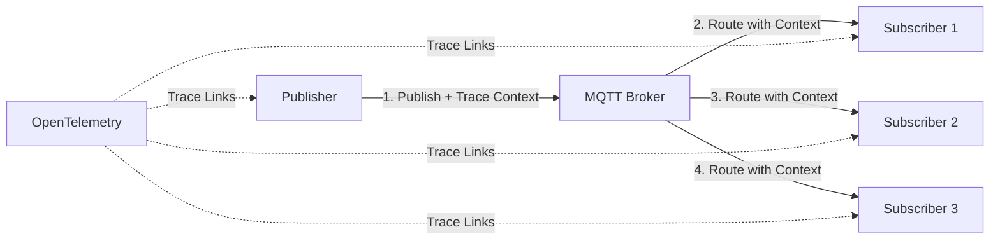

# How to Instrument Go MQTT Clients with OpenTelemetry

Author: [nawazdhandala](https://www.github.com/nawazdhandala)

Tags: OpenTelemetry, Go, MQTT, IoT, Messaging, Tracing

Description: Implement OpenTelemetry instrumentation for MQTT clients to trace message publishing, subscription handling, and connection lifecycle events in IoT and messaging applications.

MQTT (Message Queuing Telemetry Transport) powers millions of IoT devices and messaging applications, but observing message flow through MQTT brokers presents unique challenges. Unlike HTTP requests with clear request-response patterns, MQTT uses asynchronous publish-subscribe messaging where producers and consumers are decoupled.

OpenTelemetry brings distributed tracing to MQTT by propagating trace context through message headers and creating spans that link publishers to subscribers. This visibility helps you understand message latency, identify slow subscribers, and debug delivery issues in complex MQTT topologies.

## MQTT and Distributed Tracing Architecture

MQTT separates message producers from consumers through topics and QoS levels. A publisher sends a message to a topic without knowing which subscribers will receive it. The broker handles routing, retention, and delivery guarantees.



OpenTelemetry creates a span when publishing a message, embeds the trace context in the MQTT message payload or user properties, and creates child spans when subscribers process the message. This creates a complete trace showing message flow from publisher through the broker to all subscribers.

## Setting Up MQTT with OpenTelemetry

Use the Paho MQTT Go client with OpenTelemetry instrumentation.

```go
package main

import (
    "context"
    "encoding/json"
    "fmt"
    "log"
    "time"

    mqtt "github.com/eclipse/paho.mqtt.golang"
    "go.opentelemetry.io/otel"
    "go.opentelemetry.io/otel/attribute"
    "go.opentelemetry.io/otel/exporters/otlp/otlptrace/otlptracegrpc"
    "go.opentelemetry.io/otel/propagation"
    "go.opentelemetry.io/otel/sdk/resource"
    "go.opentelemetry.io/otel/sdk/trace"
    semconv "go.opentelemetry.io/otel/semconv/v1.21.0"
    oteltrace "go.opentelemetry.io/otel/trace"
)

func initTracer(serviceName string) (*trace.TracerProvider, error) {
    ctx := context.Background()

    exporter, err := otlptracegrpc.New(ctx,
        otlptracegrpc.WithEndpoint("localhost:4317"),
        otlptracegrpc.WithInsecure(),
    )
    if err != nil {
        return nil, fmt.Errorf("creating OTLP exporter: %w", err)
    }

    res, err := resource.New(ctx,
        resource.WithAttributes(
            semconv.ServiceName(serviceName),
            semconv.ServiceVersion("1.0.0"),
            attribute.String("messaging.system", "mqtt"),
            attribute.String("messaging.protocol", "mqtt"),
            attribute.String("messaging.protocol.version", "3.1.1"),
        ),
    )
    if err != nil {
        return nil, fmt.Errorf("creating resource: %w", err)
    }

    tp := trace.NewTracerProvider(
        trace.WithBatcher(exporter),
        trace.WithResource(res),
        trace.WithSampler(trace.AlwaysSample()),
    )

    otel.SetTracerProvider(tp)
    otel.SetTextMapPropagator(propagation.TraceContext{})

    return tp, nil
}
```

The tracer configuration includes messaging-specific semantic conventions that help observability platforms recognize and properly display MQTT traces.

## Creating an Instrumented MQTT Client

Build a wrapper around the Paho MQTT client that adds OpenTelemetry instrumentation.

```go
// InstrumentedMQTTClient wraps mqtt.Client with OpenTelemetry tracing
type InstrumentedMQTTClient struct {
    client     mqtt.Client
    tracer     oteltrace.Tracer
    propagator propagation.TextMapPropagator
    clientID   string
    brokerURL  string
}

// MQTTConfig holds MQTT client configuration
type MQTTConfig struct {
    BrokerURL string
    ClientID  string
    Username  string
    Password  string
}

// NewInstrumentedMQTTClient creates an MQTT client with tracing
func NewInstrumentedMQTTClient(config MQTTConfig) (*InstrumentedMQTTClient, error) {
    opts := mqtt.NewClientOptions()
    opts.AddBroker(config.BrokerURL)
    opts.SetClientID(config.ClientID)

    if config.Username != "" {
        opts.SetUsername(config.Username)
        opts.SetPassword(config.Password)
    }

    opts.SetDefaultPublishHandler(func(client mqtt.Client, msg mqtt.Message) {
        log.Printf("Unexpected message on topic: %s", msg.Topic())
    })

    opts.SetConnectionLostHandler(func(client mqtt.Client, err error) {
        log.Printf("Connection lost: %v", err)
    })

    opts.SetOnConnectHandler(func(client mqtt.Client) {
        log.Printf("Connected to MQTT broker: %s", config.BrokerURL)
    })

    client := mqtt.NewClient(opts)

    instrumented := &InstrumentedMQTTClient{
        client:     client,
        tracer:     otel.Tracer("mqtt-client"),
        propagator: otel.GetTextMapPropagator(),
        clientID:   config.ClientID,
        brokerURL:  config.BrokerURL,
    }

    return instrumented, nil
}

// Connect establishes connection to MQTT broker with tracing
func (c *InstrumentedMQTTClient) Connect(ctx context.Context) error {
    ctx, span := c.tracer.Start(ctx, "mqtt.connect",
        oteltrace.WithSpanKind(oteltrace.SpanKindClient),
    )
    defer span.End()

    span.SetAttributes(
        attribute.String("messaging.system", "mqtt"),
        attribute.String("messaging.destination", c.brokerURL),
        attribute.String("messaging.client_id", c.clientID),
    )

    token := c.client.Connect()
    if !token.WaitTimeout(10 * time.Second) {
        err := fmt.Errorf("connection timeout")
        span.SetAttributes(attribute.String("error.message", err.Error()))
        return err
    }

    if err := token.Error(); err != nil {
        span.SetAttributes(attribute.String("error.message", err.Error()))
        return fmt.Errorf("connecting to MQTT broker: %w", err)
    }

    span.SetAttributes(attribute.Bool("mqtt.connected", true))
    return nil
}

// Disconnect closes the MQTT connection with tracing
func (c *InstrumentedMQTTClient) Disconnect(ctx context.Context) {
    ctx, span := c.tracer.Start(ctx, "mqtt.disconnect")
    defer span.End()

    span.SetAttributes(
        attribute.String("messaging.system", "mqtt"),
        attribute.String("messaging.client_id", c.clientID),
    )

    c.client.Disconnect(250)
}
```

The instrumented client wraps connection operations with spans that track connection lifecycle and timing.

## Publishing Messages with Trace Context

Implement message publishing that embeds trace context in the message payload.

```go
// Message represents an MQTT message with trace context
type Message struct {
    TraceContext map[string]string `json:"trace_context"`
    Payload      interface{}       `json:"payload"`
    Timestamp    time.Time         `json:"timestamp"`
    MessageID    string            `json:"message_id"`
}

// Publish sends a message with embedded trace context
func (c *InstrumentedMQTTClient) Publish(ctx context.Context, topic string, qos byte, retained bool, payload interface{}) error {
    ctx, span := c.tracer.Start(ctx, fmt.Sprintf("mqtt.publish %s", topic),
        oteltrace.WithSpanKind(oteltrace.SpanKindProducer),
    )
    defer span.End()

    span.SetAttributes(
        attribute.String("messaging.system", "mqtt"),
        attribute.String("messaging.destination", topic),
        attribute.String("messaging.operation", "publish"),
        attribute.Int("messaging.mqtt.qos", int(qos)),
        attribute.Bool("messaging.mqtt.retained", retained),
    )

    // Create message with trace context
    message := Message{
        TraceContext: make(map[string]string),
        Payload:      payload,
        Timestamp:    time.Now(),
        MessageID:    generateMessageID(),
    }

    // Inject trace context into message
    carrier := propagation.MapCarrier(message.TraceContext)
    c.propagator.Inject(ctx, carrier)

    span.SetAttributes(
        attribute.String("messaging.message_id", message.MessageID),
    )

    // Serialize message
    data, err := json.Marshal(message)
    if err != nil {
        span.SetAttributes(attribute.String("error.message", err.Error()))
        return fmt.Errorf("marshaling message: %w", err)
    }

    span.SetAttributes(
        attribute.Int("messaging.message.payload_size_bytes", len(data)),
    )

    // Publish to MQTT broker
    token := c.client.Publish(topic, qos, retained, data)
    if !token.WaitTimeout(5 * time.Second) {
        err := fmt.Errorf("publish timeout")
        span.SetAttributes(attribute.String("error.message", err.Error()))
        return err
    }

    if err := token.Error(); err != nil {
        span.SetAttributes(attribute.String("error.message", err.Error()))
        return fmt.Errorf("publishing message: %w", err)
    }

    span.SetAttributes(attribute.Bool("mqtt.published", true))
    return nil
}

// PublishBatch publishes multiple messages with tracing
func (c *InstrumentedMQTTClient) PublishBatch(ctx context.Context, topic string, qos byte, payloads []interface{}) error {
    ctx, span := c.tracer.Start(ctx, fmt.Sprintf("mqtt.publish.batch %s", topic),
        oteltrace.WithSpanKind(oteltrace.SpanKindProducer),
    )
    defer span.End()

    span.SetAttributes(
        attribute.String("messaging.system", "mqtt"),
        attribute.String("messaging.destination", topic),
        attribute.Int("messaging.batch.count", len(payloads)),
    )

    successCount := 0
    for i, payload := range payloads {
        if err := c.Publish(ctx, topic, qos, false, payload); err != nil {
            span.SetAttributes(
                attribute.Int("messaging.batch.failed_at", i),
                attribute.String("error.message", err.Error()),
            )
            return fmt.Errorf("publishing message %d: %w", i, err)
        }
        successCount++
    }

    span.SetAttributes(
        attribute.Int("messaging.batch.success_count", successCount),
    )

    return nil
}

func generateMessageID() string {
    return fmt.Sprintf("msg-%d", time.Now().UnixNano())
}
```

The publish method creates a producer span, injects the trace context into the message payload, and tracks publishing metrics like message size and success status.

## Subscribing to Topics with Trace Context Extraction

Implement subscription handlers that extract trace context and create child spans.

```go
// MessageHandler is called when a message is received
type MessageHandler func(ctx context.Context, topic string, payload interface{}) error

// Subscribe subscribes to a topic with traced message handling
func (c *InstrumentedMQTTClient) Subscribe(ctx context.Context, topic string, qos byte, handler MessageHandler) error {
    ctx, span := c.tracer.Start(ctx, fmt.Sprintf("mqtt.subscribe %s", topic),
        oteltrace.WithSpanKind(oteltrace.SpanKindConsumer),
    )
    defer span.End()

    span.SetAttributes(
        attribute.String("messaging.system", "mqtt"),
        attribute.String("messaging.destination", topic),
        attribute.String("messaging.operation", "subscribe"),
        attribute.Int("messaging.mqtt.qos", int(qos)),
    )

    // Create wrapped handler that extracts trace context
    wrappedHandler := c.createTracedHandler(topic, handler)

    token := c.client.Subscribe(topic, qos, wrappedHandler)
    if !token.WaitTimeout(5 * time.Second) {
        err := fmt.Errorf("subscribe timeout")
        span.SetAttributes(attribute.String("error.message", err.Error()))
        return err
    }

    if err := token.Error(); err != nil {
        span.SetAttributes(attribute.String("error.message", err.Error()))
        return fmt.Errorf("subscribing to topic: %w", err)
    }

    span.SetAttributes(attribute.Bool("mqtt.subscribed", true))
    return nil
}

// createTracedHandler wraps a message handler with tracing
func (c *InstrumentedMQTTClient) createTracedHandler(topic string, handler MessageHandler) mqtt.MessageHandler {
    return func(client mqtt.Client, msg mqtt.Message) {
        start := time.Now()

        // Parse message
        var message Message
        if err := json.Unmarshal(msg.Payload(), &message); err != nil {
            log.Printf("Error unmarshaling message: %v", err)
            return
        }

        // Extract trace context from message
        carrier := propagation.MapCarrier(message.TraceContext)
        ctx := c.propagator.Extract(context.Background(), carrier)

        // Create consumer span
        ctx, span := c.tracer.Start(ctx, fmt.Sprintf("mqtt.process %s", topic),
            oteltrace.WithSpanKind(oteltrace.SpanKindConsumer),
        )
        defer span.End()

        span.SetAttributes(
            attribute.String("messaging.system", "mqtt"),
            attribute.String("messaging.destination", topic),
            attribute.String("messaging.operation", "process"),
            attribute.String("messaging.message_id", message.MessageID),
            attribute.Int("messaging.message.payload_size_bytes", len(msg.Payload())),
        )

        // Calculate message latency
        latency := time.Since(message.Timestamp)
        span.SetAttributes(
            attribute.Int64("messaging.message.latency_ms", latency.Milliseconds()),
        )

        // Call the actual handler
        if err := handler(ctx, topic, message.Payload); err != nil {
            span.SetAttributes(
                attribute.String("error.message", err.Error()),
                attribute.Bool("messaging.processing.error", true),
            )
            log.Printf("Error handling message: %v", err)
            return
        }

        processingTime := time.Since(start)
        span.SetAttributes(
            attribute.Int64("messaging.processing.duration_ms", processingTime.Milliseconds()),
            attribute.Bool("messaging.processing.success", true),
        )
    }
}

// Unsubscribe unsubscribes from a topic with tracing
func (c *InstrumentedMQTTClient) Unsubscribe(ctx context.Context, topics ...string) error {
    ctx, span := c.tracer.Start(ctx, "mqtt.unsubscribe")
    defer span.End()

    span.SetAttributes(
        attribute.String("messaging.system", "mqtt"),
        attribute.StringSlice("messaging.destinations", topics),
    )

    token := c.client.Unsubscribe(topics...)
    if !token.WaitTimeout(5 * time.Second) {
        err := fmt.Errorf("unsubscribe timeout")
        span.SetAttributes(attribute.String("error.message", err.Error()))
        return err
    }

    if err := token.Error(); err != nil {
        span.SetAttributes(attribute.String("error.message", err.Error()))
        return fmt.Errorf("unsubscribing from topics: %w", err)
    }

    span.SetAttributes(attribute.Bool("mqtt.unsubscribed", true))
    return nil
}
```

The subscription handler extracts trace context from incoming messages, creating a link between the publisher's span and the subscriber's processing span. This shows the complete message journey through the system.

## Complete MQTT Application Example

Build a complete IoT application demonstrating publisher and subscriber instrumentation.

```go
func main() {
    // Initialize tracer for publisher
    tpPublisher, err := initTracer("mqtt-publisher")
    if err != nil {
        log.Fatalf("Failed to initialize publisher tracer: %v", err)
    }
    defer func() {
        if err := tpPublisher.Shutdown(context.Background()); err != nil {
            log.Printf("Error shutting down publisher tracer: %v", err)
        }
    }()

    // Initialize tracer for subscriber
    tpSubscriber, err := initTracer("mqtt-subscriber")
    if err != nil {
        log.Fatalf("Failed to initialize subscriber tracer: %v", err)
    }
    defer func() {
        if err := tpSubscriber.Shutdown(context.Background()); err != nil {
            log.Printf("Error shutting down subscriber tracer: %v", err)
        }
    }()

    ctx := context.Background()

    // Create publisher client
    publisher, err := NewInstrumentedMQTTClient(MQTTConfig{
        BrokerURL: "tcp://localhost:1883",
        ClientID:  "publisher-1",
    })
    if err != nil {
        log.Fatalf("Failed to create publisher: %v", err)
    }

    if err := publisher.Connect(ctx); err != nil {
        log.Fatalf("Failed to connect publisher: %v", err)
    }
    defer publisher.Disconnect(ctx)

    // Create subscriber client
    subscriber, err := NewInstrumentedMQTTClient(MQTTConfig{
        BrokerURL: "tcp://localhost:1883",
        ClientID:  "subscriber-1",
    })
    if err != nil {
        log.Fatalf("Failed to create subscriber: %v", err)
    }

    if err := subscriber.Connect(ctx); err != nil {
        log.Fatalf("Failed to connect subscriber: %v", err)
    }
    defer subscriber.Disconnect(ctx)

    // Subscribe to topics
    if err := subscriber.Subscribe(ctx, "sensors/temperature", 1, handleTemperature); err != nil {
        log.Fatalf("Failed to subscribe: %v", err)
    }

    if err := subscriber.Subscribe(ctx, "sensors/humidity", 1, handleHumidity); err != nil {
        log.Fatalf("Failed to subscribe: %v", err)
    }

    if err := subscriber.Subscribe(ctx, "alerts/#", 2, handleAlert); err != nil {
        log.Fatalf("Failed to subscribe to alerts: %v", err)
    }

    // Simulate sensor data publishing
    go publishSensorData(ctx, publisher)

    // Simulate alert publishing
    go publishAlerts(ctx, publisher)

    // Run forever
    select {}
}

func publishSensorData(ctx context.Context, client *InstrumentedMQTTClient) {
    ticker := time.NewTicker(2 * time.Second)
    defer ticker.Stop()

    for range ticker.C {
        // Publish temperature reading
        temperature := 20.0 + float64(time.Now().Unix()%10)
        if err := client.Publish(ctx, "sensors/temperature", 1, false, map[string]interface{}{
            "sensor_id": "temp-001",
            "value":     temperature,
            "unit":      "celsius",
        }); err != nil {
            log.Printf("Failed to publish temperature: %v", err)
        }

        // Publish humidity reading
        humidity := 50.0 + float64(time.Now().Unix()%20)
        if err := client.Publish(ctx, "sensors/humidity", 1, false, map[string]interface{}{
            "sensor_id": "humid-001",
            "value":     humidity,
            "unit":      "percent",
        }); err != nil {
            log.Printf("Failed to publish humidity: %v", err)
        }
    }
}

func publishAlerts(ctx context.Context, client *InstrumentedMQTTClient) {
    ticker := time.NewTicker(10 * time.Second)
    defer ticker.Stop()

    for range ticker.C {
        if err := client.Publish(ctx, "alerts/critical", 2, false, map[string]interface{}{
            "type":    "temperature",
            "message": "Temperature above threshold",
            "value":   35.5,
        }); err != nil {
            log.Printf("Failed to publish alert: %v", err)
        }
    }
}

func handleTemperature(ctx context.Context, topic string, payload interface{}) error {
    span := oteltrace.SpanFromContext(ctx)

    data, ok := payload.(map[string]interface{})
    if !ok {
        return fmt.Errorf("invalid payload type")
    }

    sensorID := data["sensor_id"].(string)
    value := data["value"].(float64)

    span.SetAttributes(
        attribute.String("sensor.id", sensorID),
        attribute.Float64("sensor.temperature", value),
    )

    log.Printf("Processed temperature: sensor=%s, value=%.2f°C", sensorID, value)

    // Simulate processing time
    time.Sleep(10 * time.Millisecond)

    return nil
}

func handleHumidity(ctx context.Context, topic string, payload interface{}) error {
    span := oteltrace.SpanFromContext(ctx)

    data, ok := payload.(map[string]interface{})
    if !ok {
        return fmt.Errorf("invalid payload type")
    }

    sensorID := data["sensor_id"].(string)
    value := data["value"].(float64)

    span.SetAttributes(
        attribute.String("sensor.id", sensorID),
        attribute.Float64("sensor.humidity", value),
    )

    log.Printf("Processed humidity: sensor=%s, value=%.2f%%", sensorID, value)

    // Simulate processing time
    time.Sleep(15 * time.Millisecond)

    return nil
}

func handleAlert(ctx context.Context, topic string, payload interface{}) error {
    span := oteltrace.SpanFromContext(ctx)

    data, ok := payload.(map[string]interface{})
    if !ok {
        return fmt.Errorf("invalid payload type")
    }

    alertType := data["type"].(string)
    message := data["message"].(string)

    span.SetAttributes(
        attribute.String("alert.type", alertType),
        attribute.String("alert.message", message),
        attribute.String("alert.severity", "critical"),
    )

    log.Printf("ALERT [%s]: %s", alertType, message)

    // Simulate alert processing
    time.Sleep(20 * time.Millisecond)

    return nil
}
```

This application publishes sensor readings and alerts while subscribers process them, with complete distributed traces showing message flow from publisher to subscriber.

## Analyzing MQTT Traces

The instrumentation reveals critical insights about your MQTT messaging patterns:

**Message Latency**: The time difference between message timestamp and processing time shows how long messages wait in the broker before delivery. High latency indicates broker congestion or subscriber backlog.

**Processing Time**: Individual subscriber spans show how long each subscriber takes to process messages. Slow subscribers can cause message queuing and memory issues at the broker.

**Fan-out Patterns**: When multiple subscribers receive the same message, you can see how processing time varies across subscribers and identify which ones are bottlenecks.

**QoS Impact**: Comparing traces for QoS 0, 1, and 2 messages shows the latency cost of delivery guarantees.

MQTT instrumentation with OpenTelemetry transforms opaque message flows into visible, traceable operations. You can see exactly how long messages take to travel through your system, identify slow subscribers before they cause broker issues, and optimize your messaging topology based on real production data.