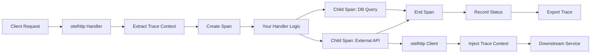

# How to Instrument Go net/http Handlers with otelhttp for OpenTelemetry

Author: [nawazdhandala](https://www.github.com/nawazdhandala)

Tags: OpenTelemetry, Go, net/http, otelhttp, HTTP, Standard Library

Description: Learn how to add OpenTelemetry instrumentation to standard library net/http handlers using otelhttp for automatic tracing and metrics collection.

The Go standard library's net/http package provides the foundation for HTTP servers in Go. While many developers use third-party routers like Chi or Gorilla Mux, net/http remains the bedrock of HTTP handling in Go. Understanding how to instrument standard library handlers with OpenTelemetry gives you observability capabilities regardless of which routing framework you choose.

The otelhttp package provides instrumentation for net/http by wrapping handlers and transports with OpenTelemetry-aware implementations. This wrapper approach means you can add tracing to existing applications without rewriting handler logic or changing function signatures.

## Understanding otelhttp Architecture

The otelhttp package works by intercepting HTTP requests at the handler level. When a request arrives, otelhttp creates a span, extracts any incoming trace context from headers, and passes the enriched context to your handler. After your handler completes, otelhttp records the response status, duration, and any errors before ending the span.

For outbound requests, otelhttp wraps the http.Client transport to inject trace context into request headers, enabling distributed tracing across service boundaries. This bidirectional instrumentation creates complete traces showing request flow through your entire system.

## Installing Dependencies

Install the OpenTelemetry SDK and otelhttp instrumentation package.

```bash
go get -u go.opentelemetry.io/otel
go get -u go.opentelemetry.io/otel/sdk/trace
go get -u go.opentelemetry.io/otel/exporters/stdout/stdouttrace
go get -u go.opentelemetry.io/contrib/instrumentation/net/http/otelhttp
```

These packages provide the core OpenTelemetry functionality, trace SDK, a development exporter, and net/http instrumentation.

## Initializing the Tracer Provider

Set up OpenTelemetry before instrumenting handlers. This initialization configures trace collection, processing, and export.

```go
package main

import (
    "context"
    "log"
    "time"

    "go.opentelemetry.io/otel"
    "go.opentelemetry.io/otel/exporters/stdout/stdouttrace"
    "go.opentelemetry.io/otel/sdk/resource"
    sdktrace "go.opentelemetry.io/otel/sdk/trace"
    semconv "go.opentelemetry.io/otel/semconv/v1.17.0"
)

func initTracer() (*sdktrace.TracerProvider, error) {
    // Create stdout exporter for development
    exporter, err := stdouttrace.New(
        stdouttrace.WithPrettyPrint(),
    )
    if err != nil {
        return nil, err
    }

    // Define service resource
    res := resource.NewWithAttributes(
        semconv.SchemaURL,
        semconv.ServiceName("http-service"),
        semconv.ServiceVersion("1.0.0"),
    )

    // Create tracer provider
    tp := sdktrace.NewTracerProvider(
        sdktrace.WithBatcher(exporter),
        sdktrace.WithResource(res),
    )

    // Set as global provider
    otel.SetTracerProvider(tp)

    return tp, nil
}
```

This setup creates a tracer provider that exports spans to stdout for development. The resource attributes identify your service in trace visualizations.

## Wrapping Basic HTTP Handlers

Wrap your http.HandlerFunc with otelhttp to add automatic tracing.

```go
package main

import (
    "fmt"
    "net/http"
    "time"

    "go.opentelemetry.io/contrib/instrumentation/net/http/otelhttp"
)

func main() {
    // Initialize tracer
    tp, err := initTracer()
    if err != nil {
        log.Fatal(err)
    }
    defer func() {
        ctx, cancel := context.WithTimeout(context.Background(), 5*time.Second)
        defer cancel()
        tp.Shutdown(ctx)
    }()

    // Wrap handler with otelhttp
    handler := http.HandlerFunc(helloHandler)
    wrappedHandler := otelhttp.NewHandler(handler, "hello-operation")

    // Register wrapped handler
    http.Handle("/hello", wrappedHandler)

    // Start server
    log.Println("Server starting on :8080")
    http.ListenAndServe(":8080", nil)
}

func helloHandler(w http.ResponseWriter, r *http.Request) {
    // Handler logic - automatically traced
    name := r.URL.Query().Get("name")
    if name == "" {
        name = "World"
    }

    fmt.Fprintf(w, "Hello, %s!", name)
}
```

The `otelhttp.NewHandler()` function wraps your handler and accepts an operation name that appears in traces. Each request to this handler creates a new span with timing and status information.

## Using ServeMux with otelhttp

When using http.ServeMux, wrap individual handlers or the entire mux.

```go
package main

import (
    "encoding/json"
    "net/http"

    "go.opentelemetry.io/contrib/instrumentation/net/http/otelhttp"
)

func setupRouter() http.Handler {
    mux := http.NewServeMux()

    // Wrap individual handlers with descriptive operation names
    mux.Handle("/api/users", otelhttp.NewHandler(
        http.HandlerFunc(listUsersHandler),
        "list-users",
    ))

    mux.Handle("/api/users/", otelhttp.NewHandler(
        http.HandlerFunc(getUserHandler),
        "get-user",
    ))

    mux.Handle("/api/products", otelhttp.NewHandler(
        http.HandlerFunc(listProductsHandler),
        "list-products",
    ))

    // Wrap the entire mux to catch all requests
    return otelhttp.NewHandler(mux, "http-server")
}

func listUsersHandler(w http.ResponseWriter, r *http.Request) {
    users := []map[string]string{
        {"id": "1", "name": "Alice"},
        {"id": "2", "name": "Bob"},
    }

    w.Header().Set("Content-Type", "application/json")
    json.NewEncoder(w).Encode(users)
}

func getUserHandler(w http.ResponseWriter, r *http.Request) {
    // Extract user ID from path
    userID := r.URL.Path[len("/api/users/"):]

    user := map[string]string{
        "id":   userID,
        "name": "Alice",
    }

    w.Header().Set("Content-Type", "application/json")
    json.NewEncoder(w).Encode(user)
}

func listProductsHandler(w http.ResponseWriter, r *http.Request) {
    products := []map[string]interface{}{
        {"id": "1", "name": "Widget", "price": 19.99},
        {"id": "2", "name": "Gadget", "price": 29.99},
    }

    w.Header().Set("Content-Type", "application/json")
    json.NewEncoder(w).Encode(products)
}
```

Wrapping the entire mux creates a root span for all requests, while wrapping individual handlers creates more specific span names for better trace organization.

## Adding Custom Spans and Attributes

Extract the span from the request context to add custom attributes or create child spans.

```go
package main

import (
    "context"
    "fmt"
    "net/http"
    "time"

    "go.opentelemetry.io/otel"
    "go.opentelemetry.io/otel/attribute"
    "go.opentelemetry.io/otel/codes"
    "go.opentelemetry.io/otel/trace"
)

func orderHandler(w http.ResponseWriter, r *http.Request) {
    ctx := r.Context()

    // Get current span from context
    span := trace.SpanFromContext(ctx)

    // Add custom attributes to the span
    orderID := r.URL.Query().Get("order_id")
    span.SetAttributes(
        attribute.String("order.id", orderID),
        attribute.String("customer.type", "premium"),
    )

    // Create child span for validation
    validationCtx, validationSpan := otel.Tracer("handlers").Start(
        ctx,
        "validate-order",
    )

    if err := validateOrder(validationCtx, orderID); err != nil {
        validationSpan.RecordError(err)
        validationSpan.SetStatus(codes.Error, "validation failed")
        validationSpan.End()

        http.Error(w, "Invalid order", http.StatusBadRequest)
        return
    }
    validationSpan.End()

    // Create child span for database operation
    _, dbSpan := otel.Tracer("handlers").Start(ctx, "fetch-order-from-db")
    dbSpan.SetAttributes(attribute.String("db.system", "postgresql"))

    order := fetchOrderFromDB(orderID)
    dbSpan.End()

    // Create child span for external API call
    _, apiSpan := otel.Tracer("handlers").Start(ctx, "get-shipping-status")
    shippingStatus := getShippingStatus(orderID)
    apiSpan.SetAttributes(attribute.String("shipping.status", shippingStatus))
    apiSpan.End()

    // Set success status on root span
    span.SetStatus(codes.Ok, "order processed successfully")

    w.Header().Set("Content-Type", "application/json")
    fmt.Fprintf(w, `{"order_id": "%s", "status": "%s"}`, orderID, shippingStatus)
}

func validateOrder(ctx context.Context, orderID string) error {
    time.Sleep(10 * time.Millisecond)
    if orderID == "" {
        return fmt.Errorf("order ID is required")
    }
    return nil
}

func fetchOrderFromDB(orderID string) map[string]interface{} {
    time.Sleep(50 * time.Millisecond)
    return map[string]interface{}{
        "id":     orderID,
        "amount": 99.99,
    }
}

func getShippingStatus(orderID string) string {
    time.Sleep(100 * time.Millisecond)
    return "in_transit"
}
```

This handler demonstrates creating child spans for different operations, adding custom attributes, and recording errors. The context propagates trace information through the entire request lifecycle.

## Instrumenting HTTP Clients

Use otelhttp to instrument outbound HTTP requests, enabling distributed tracing across service calls.

```go
package main

import (
    "context"
    "io"
    "net/http"
    "time"

    "go.opentelemetry.io/contrib/instrumentation/net/http/otelhttp"
)

// Create instrumented HTTP client
func createInstrumentedClient() *http.Client {
    return &http.Client{
        Transport: otelhttp.NewTransport(http.DefaultTransport),
        Timeout:   30 * time.Second,
    }
}

func gatewayHandler(w http.ResponseWriter, r *http.Request) {
    ctx := r.Context()

    // Create instrumented client
    client := createInstrumentedClient()

    // Make request to downstream service
    // Trace context is automatically propagated via headers
    req, err := http.NewRequestWithContext(
        ctx,
        "GET",
        "http://downstream-service:8081/api/data",
        nil,
    )
    if err != nil {
        http.Error(w, "Failed to create request", http.StatusInternalServerError)
        return
    }

    resp, err := client.Do(req)
    if err != nil {
        http.Error(w, "Failed to fetch data", http.StatusInternalServerError)
        return
    }
    defer resp.Body.Close()

    // Read response
    body, err := io.ReadAll(resp.Body)
    if err != nil {
        http.Error(w, "Failed to read response", http.StatusInternalServerError)
        return
    }

    w.Header().Set("Content-Type", "application/json")
    w.Write(body)
}
```

The `otelhttp.NewTransport()` wrapper automatically injects trace context into outbound request headers using W3C Trace Context format. This allows the downstream service to continue the trace.

## Configuring otelhttp Options

Customize otelhttp behavior with configuration options.

```go
package main

import (
    "net/http"

    "go.opentelemetry.io/contrib/instrumentation/net/http/otelhttp"
    "go.opentelemetry.io/otel/attribute"
    "go.opentelemetry.io/otel/metric"
    "go.opentelemetry.io/otel/propagation"
)

func setupAdvancedHandler() http.Handler {
    handler := http.HandlerFunc(advancedHandler)

    // Configure otelhttp with options
    wrappedHandler := otelhttp.NewHandler(
        handler,
        "advanced-operation",
        otelhttp.WithSpanOptions(
            trace.WithAttributes(
                attribute.String("service.component", "api"),
            ),
        ),
        otelhttp.WithFilter(func(r *http.Request) bool {
            // Skip tracing for health checks
            return r.URL.Path != "/health"
        }),
        otelhttp.WithSpanNameFormatter(func(operation string, r *http.Request) string {
            // Customize span names
            return fmt.Sprintf("%s %s", r.Method, r.URL.Path)
        }),
    )

    return wrappedHandler
}

func advancedHandler(w http.ResponseWriter, r *http.Request) {
    w.WriteHeader(http.StatusOK)
    w.Write([]byte("Advanced handler with custom configuration"))
}

// Configure client with custom options
func createAdvancedClient() *http.Client {
    transport := otelhttp.NewTransport(
        http.DefaultTransport,
        otelhttp.WithClientTrace(func(ctx context.Context) *httptrace.ClientTrace {
            // Add detailed client tracing
            return &httptrace.ClientTrace{
                DNSStart: func(info httptrace.DNSStartInfo) {
                    span := trace.SpanFromContext(ctx)
                    span.AddEvent("DNS lookup started",
                        trace.WithAttributes(attribute.String("host", info.Host)))
                },
                ConnectStart: func(network, addr string) {
                    span := trace.SpanFromContext(ctx)
                    span.AddEvent("Connection started",
                        trace.WithAttributes(
                            attribute.String("network", network),
                            attribute.String("addr", addr),
                        ))
                },
            }
        }),
    )

    return &http.Client{
        Transport: transport,
        Timeout:   30 * time.Second,
    }
}
```

These options control span naming, filtering, attributes, and detailed HTTP client tracing. The filter option prevents health check endpoints from generating excessive trace data.

## Middleware Pattern with otelhttp

Create reusable middleware that combines otelhttp with other handlers.

```go
package main

import (
    "log"
    "net/http"
    "time"

    "go.opentelemetry.io/contrib/instrumentation/net/http/otelhttp"
)

// Middleware chain combining logging and tracing
func chain(handler http.Handler, middlewares ...func(http.Handler) http.Handler) http.Handler {
    for i := len(middlewares) - 1; i >= 0; i-- {
        handler = middlewares[i](handler)
    }
    return handler
}

func loggingMiddleware(next http.Handler) http.Handler {
    return http.HandlerFunc(func(w http.ResponseWriter, r *http.Request) {
        start := time.Now()
        log.Printf("Started %s %s", r.Method, r.URL.Path)

        next.ServeHTTP(w, r)

        log.Printf("Completed %s %s in %v", r.Method, r.URL.Path, time.Since(start))
    })
}

func tracingMiddleware(operation string) func(http.Handler) http.Handler {
    return func(next http.Handler) http.Handler {
        return otelhttp.NewHandler(next, operation)
    }
}

func setupMiddlewareChain() http.Handler {
    mux := http.NewServeMux()

    mux.HandleFunc("/api/data", dataHandler)

    // Apply middleware chain: logging -> tracing -> handlers
    handler := chain(
        mux,
        loggingMiddleware,
        tracingMiddleware("http-server"),
    )

    return handler
}

func dataHandler(w http.ResponseWriter, r *http.Request) {
    w.Header().Set("Content-Type", "application/json")
    w.Write([]byte(`{"status": "ok"}`))
}
```

This pattern creates a clean middleware chain where logging and tracing wrap your handlers in a predictable order.

## Trace Flow Visualization

Understanding how traces flow through your instrumented handlers:



Each layer in your application adds spans to the trace, creating a complete picture of request processing from entry to exit.

## Testing Instrumented Handlers

Verify your instrumentation with tests that inspect trace data.

```go
package main

import (
    "net/http"
    "net/http/httptest"
    "testing"

    "go.opentelemetry.io/otel"
    "go.opentelemetry.io/otel/sdk/trace"
    "go.opentelemetry.io/otel/sdk/trace/tracetest"
    "go.opentelemetry.io/contrib/instrumentation/net/http/otelhttp"
)

func TestHandlerTracing(t *testing.T) {
    // Setup in-memory span recorder
    sr := tracetest.NewSpanRecorder()
    tp := trace.NewTracerProvider(trace.WithSpanProcessor(sr))
    otel.SetTracerProvider(tp)

    // Create instrumented handler
    handler := otelhttp.NewHandler(
        http.HandlerFunc(func(w http.ResponseWriter, r *http.Request) {
            w.WriteHeader(http.StatusOK)
            w.Write([]byte("OK"))
        }),
        "test-operation",
    )

    // Make test request
    req := httptest.NewRequest("GET", "/test", nil)
    rec := httptest.NewRecorder()
    handler.ServeHTTP(rec, req)

    // Verify response
    if rec.Code != http.StatusOK {
        t.Errorf("Expected status 200, got %d", rec.Code)
    }

    // Verify trace was created
    spans := sr.Ended()
    if len(spans) != 1 {
        t.Fatalf("Expected 1 span, got %d", len(spans))
    }

    span := spans[0]
    if span.Name() != "test-operation" {
        t.Errorf("Expected span name 'test-operation', got '%s'", span.Name())
    }
}
```

This test verifies that your handlers create spans with the correct names and attributes.

The otelhttp package brings enterprise-grade observability to standard library HTTP handlers with minimal code changes. By wrapping handlers and clients, you gain automatic trace propagation, timing information, and error tracking across your entire HTTP layer. Combined with custom instrumentation for business logic, otelhttp provides the foundation for understanding request flows, debugging issues, and optimizing performance in production systems.
