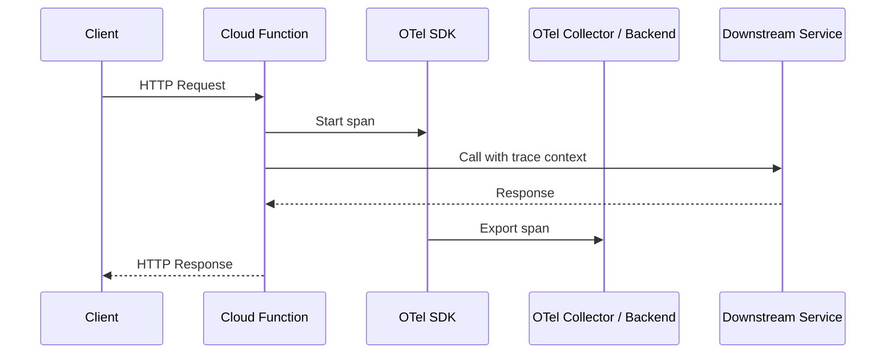
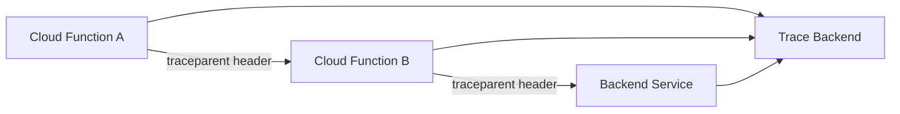

# How to Instrument Google Cloud Functions with OpenTelemetry

Author: [nawazdhandala](https://www.github.com/nawazdhandala)

Tags: OpenTelemetry, Google Cloud Functions, Serverless, Tracing, Node.js, Python

Description: A practical guide to adding OpenTelemetry tracing and metrics to Google Cloud Functions for full serverless observability.

---

Serverless functions are notoriously hard to observe. They spin up, execute, and disappear. When something goes wrong, you are left staring at logs trying to reconstruct what happened. OpenTelemetry changes that by giving you structured traces and metrics from inside your Cloud Functions, so you can see exactly how each invocation behaves and where time is spent.

This guide covers how to instrument both HTTP-triggered and event-triggered Google Cloud Functions using OpenTelemetry. We will work through examples in Node.js and Python, the two most popular runtimes for Cloud Functions.

## How It Works

The key challenge with serverless is that your function process may be reused across invocations (warm starts) or created fresh (cold starts). OpenTelemetry needs to be initialized once and then create a new span for each invocation. The trace context should also be propagated if your function calls downstream services.



## Prerequisites

You will need:

- A Google Cloud project with Cloud Functions enabled.
- The `gcloud` CLI installed and authenticated.
- An OpenTelemetry backend to receive traces (this could be the OTel Collector, Google Cloud Trace, or any OTLP-compatible backend).

## Node.js: HTTP-Triggered Function

Let's start with a Node.js Cloud Function that handles HTTP requests. First, set up the project and install dependencies.

```bash
# Create a new function directory
mkdir my-cloud-function && cd my-cloud-function
npm init -y

# Install OpenTelemetry packages
npm install @opentelemetry/sdk-node \
  @opentelemetry/api \
  @opentelemetry/exporter-trace-otlp-grpc \
  @opentelemetry/sdk-trace-node \
  @opentelemetry/resources \
  @opentelemetry/semantic-conventions \
  @opentelemetry/instrumentation-http \
  @google-cloud/functions-framework
```

Create a tracing initialization file that runs once when the function instance starts up. This file sets up the OpenTelemetry SDK and registers it globally.

```javascript
// tracing.js - Initialize OpenTelemetry once per function instance
const { NodeSDK } = require('@opentelemetry/sdk-node');
const { OTLPTraceExporter } = require('@opentelemetry/exporter-trace-otlp-grpc');
const { Resource } = require('@opentelemetry/resources');
const { ATTR_SERVICE_NAME } = require('@opentelemetry/semantic-conventions');
const { HttpInstrumentation } = require('@opentelemetry/instrumentation-http');

// Create the OTLP exporter pointing to your collector
const exporter = new OTLPTraceExporter({
  url: process.env.OTEL_EXPORTER_OTLP_ENDPOINT || 'http://localhost:4317',
});

// Initialize the SDK with service metadata
const sdk = new NodeSDK({
  resource: new Resource({
    [ATTR_SERVICE_NAME]: 'my-cloud-function',
    'faas.name': process.env.K_SERVICE || 'unknown',
    'cloud.provider': 'gcp',
    'cloud.platform': 'gcp_cloud_functions',
  }),
  traceExporter: exporter,
  instrumentations: [
    // Automatically trace all outgoing HTTP calls
    new HttpInstrumentation(),
  ],
});

// Start the SDK - this must happen before any other code runs
sdk.start();

// Ensure spans are flushed when the process exits
process.on('SIGTERM', () => {
  sdk.shutdown().then(() => process.exit(0));
});

module.exports = sdk;
```

Now write the function itself. The key thing is to require the tracing module at the top so it initializes before anything else.

```javascript
// index.js - The Cloud Function handler
// Import tracing first so instrumentation is active before other imports
require('./tracing');

const { trace, SpanStatusCode } = require('@opentelemetry/api');
const functions = require('@google-cloud/functions-framework');

// Get a tracer for this module
const tracer = trace.getTracer('my-cloud-function');

functions.http('helloWorld', async (req, res) => {
  // Create a span for the function invocation
  return tracer.startActiveSpan('handle-request', async (span) => {
    try {
      // Add useful attributes about the request
      span.setAttribute('http.method', req.method);
      span.setAttribute('http.url', req.url);
      span.setAttribute('faas.trigger', 'http');

      // Simulate some work with a child span
      const result = await tracer.startActiveSpan('process-data', async (childSpan) => {
        // Your business logic goes here
        const data = { message: 'Hello from Cloud Functions with OpenTelemetry!' };
        childSpan.setAttribute('result.size', JSON.stringify(data).length);
        childSpan.end();
        return data;
      });

      res.json(result);
      span.setStatus({ code: SpanStatusCode.OK });
    } catch (error) {
      // Record the error on the span
      span.setStatus({ code: SpanStatusCode.ERROR, message: error.message });
      span.recordException(error);
      res.status(500).send('Internal Server Error');
    } finally {
      span.end();
    }
  });
});
```

Deploy the function with the OTLP endpoint configured as an environment variable.

```bash
# Deploy to Google Cloud Functions (2nd gen)
gcloud functions deploy helloWorld \
  --gen2 \
  --runtime=nodejs20 \
  --region=us-central1 \
  --source=. \
  --entry-point=helloWorld \
  --trigger-http \
  --allow-unauthenticated \
  --set-env-vars="OTEL_EXPORTER_OTLP_ENDPOINT=https://your-collector-endpoint:4317"
```

## Python: Event-Triggered Function

For Python, the setup follows the same pattern but uses the Python OpenTelemetry SDK. This example instruments a function triggered by Cloud Pub/Sub messages.

Install the dependencies.

```bash
# requirements.txt
opentelemetry-api==1.23.0
opentelemetry-sdk==1.23.0
opentelemetry-exporter-otlp-proto-grpc==1.23.0
opentelemetry-instrumentation-requests==0.44b0
functions-framework==3.*
```

Create the tracing initialization module.

```python
# otel_init.py - Set up OpenTelemetry for Cloud Functions
import os
from opentelemetry import trace
from opentelemetry.sdk.trace import TracerProvider
from opentelemetry.sdk.trace.export import BatchSpanProcessor
from opentelemetry.exporter.otlp.proto.grpc.trace_exporter import OTLPSpanExporter
from opentelemetry.sdk.resources import Resource

def init_telemetry():
    """Initialize OpenTelemetry once per function instance."""
    # Define the service resource with serverless-specific attributes
    resource = Resource.create({
        "service.name": "pubsub-processor",
        "faas.name": os.environ.get("K_SERVICE", "unknown"),
        "cloud.provider": "gcp",
        "cloud.platform": "gcp_cloud_functions",
    })

    # Set up the tracer provider with OTLP export
    provider = TracerProvider(resource=resource)
    exporter = OTLPSpanExporter(
        endpoint=os.environ.get("OTEL_EXPORTER_OTLP_ENDPOINT", "localhost:4317"),
        insecure=True,
    )
    # BatchSpanProcessor buffers spans and sends them in batches
    provider.add_span_processor(BatchSpanProcessor(exporter))
    trace.set_tracer_provider(provider)

    return trace.get_tracer("pubsub-processor")
```

Now write the function handler that processes Pub/Sub messages.

```python
# main.py - Cloud Function triggered by Pub/Sub
import base64
import json
from opentelemetry import trace
from opentelemetry.trace import SpanKind, StatusCode
from otel_init import init_telemetry

# Initialize tracing at module level (runs once per cold start)
tracer = init_telemetry()

def process_pubsub(cloud_event):
    """Process a Pub/Sub message with OpenTelemetry tracing."""
    # Start a span for the entire function invocation
    with tracer.start_as_current_span(
        "process-pubsub-message",
        kind=SpanKind.CONSUMER,
        attributes={
            "faas.trigger": "pubsub",
            "messaging.system": "gcp_pubsub",
        }
    ) as span:
        try:
            # Decode the Pub/Sub message data
            message_data = base64.b64decode(cloud_event.data["message"]["data"])
            payload = json.loads(message_data)

            # Record message attributes on the span
            span.set_attribute("messaging.message.payload_size_bytes", len(message_data))
            span.set_attribute("messaging.destination.name",
                             cloud_event.data.get("subscription", "unknown"))

            # Process the message in a child span
            with tracer.start_as_current_span("handle-payload") as child_span:
                result = handle_message(payload)
                child_span.set_attribute("processing.result", result)

            span.set_status(StatusCode.OK)

        except Exception as e:
            # Record the exception and mark the span as failed
            span.set_status(StatusCode.ERROR, str(e))
            span.record_exception(e)
            raise

def handle_message(payload):
    """Business logic for processing the message."""
    # Your actual processing logic goes here
    return "processed"
```

## Handling Cold Starts

Cold starts are a fact of life with serverless. The OpenTelemetry SDK initialization adds some overhead to cold starts, typically 50-200ms depending on the number of instrumentations loaded. Here are a few things you can do to minimize the impact.

Keep your dependencies minimal. Only install the instrumentations you actually need. If your function does not make HTTP calls, skip the HTTP instrumentation.

Use the `BatchSpanProcessor` instead of `SimpleSpanProcessor`. The batch processor queues spans and exports them in the background, so it does not block your function's response.

Consider using the `OTEL_SDK_DISABLED` environment variable during local testing to skip initialization entirely when you do not need tracing.

## Flushing Spans Before Function Exit

This is the most common mistake people make with OpenTelemetry in serverless. The function might finish and the runtime might freeze the process before the batch processor has a chance to export spans. You need to force a flush.

In Node.js, call `forceFlush` on the provider before returning.

```javascript
// Force flush spans before the function returns
const { trace } = require('@opentelemetry/api');

async function flushTraces() {
  const provider = trace.getTracerProvider();
  if (provider && provider.forceFlush) {
    // Wait for all pending spans to be exported
    await provider.forceFlush();
  }
}

// Call this at the end of your function handler
await flushTraces();
```

In Python, do the same thing.

```python
from opentelemetry import trace

def flush_traces():
    """Force export all pending spans before the function freezes."""
    provider = trace.get_tracer_provider()
    if hasattr(provider, 'force_flush'):
        # Give it up to 5 seconds to flush
        provider.force_flush(timeout_millis=5000)
```

## Exporting to Google Cloud Trace

If you want traces to show up directly in Google Cloud Trace rather than sending them to a separate Collector, you can use the Google Cloud Trace exporter.

```bash
# For Python
pip install opentelemetry-exporter-gcp-trace

# For Node.js
npm install @google-cloud/opentelemetry-cloud-trace-exporter
```

Then swap out the OTLP exporter for the Cloud Trace exporter.

```python
# Use Google Cloud Trace instead of OTLP
from opentelemetry.exporter.cloud_trace import CloudTraceSpanExporter

# This exporter sends spans directly to Google Cloud Trace
# It uses Application Default Credentials automatically
exporter = CloudTraceSpanExporter(project_id="your-gcp-project-id")
```

## Trace Context Propagation

When your Cloud Function calls other services, you want the trace to continue across those calls. If you are using the HTTP instrumentation, context propagation happens automatically for outgoing HTTP requests. The instrumentation injects the `traceparent` header into outgoing requests so downstream services can join the same trace.

For non-HTTP communication like Pub/Sub or direct gRPC calls, you need to manually inject the trace context into your message headers or metadata.



## Summary

Instrumenting Google Cloud Functions with OpenTelemetry takes a bit of upfront work, but the observability payoff is significant. The most important things to remember are: initialize the SDK at module level so it only runs once per instance, always flush spans before the function returns, and keep your instrumentation lightweight to minimize cold start impact. With these pieces in place, you get full distributed tracing across your serverless workloads without locking yourself into any particular observability vendor.
