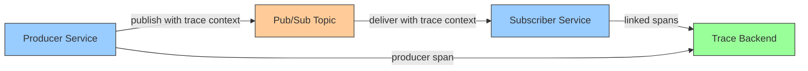

# How to Instrument Google Cloud Pub/Sub with OpenTelemetry

Author: [nawazdhandala](https://www.github.com/nawazdhandala)

Tags: OpenTelemetry, Google Cloud, Pub/Sub, Distributed Tracing, Messaging, Observability, GCP

Description: Learn how to instrument Google Cloud Pub/Sub with OpenTelemetry for distributed tracing, message flow visibility, and latency monitoring across publishers and subscribers.

---

Google Cloud Pub/Sub is a fully managed messaging service that decouples producers from consumers. While the managed nature of Pub/Sub removes much of the operational burden, it also creates a blind spot in distributed traces. When a request publishes a message and a separate service processes it, the trace context is lost unless you explicitly propagate it. OpenTelemetry gives you the tools to bridge that gap and get full visibility into your asynchronous message flows.

This guide walks through instrumenting both the publishing and subscribing sides of Pub/Sub, propagating trace context through message attributes, and capturing meaningful metrics about message processing.

## Why Instrument Pub/Sub?

In a synchronous HTTP or gRPC call chain, trace context flows naturally through headers. But when a service publishes a message to Pub/Sub and another service picks it up seconds or minutes later, the connection between those two operations is invisible to your tracing backend. You end up with two disconnected traces instead of one unified picture.

Instrumenting Pub/Sub solves several problems:
- Connecting publisher and subscriber spans into a single trace
- Measuring end-to-end latency from publish to processing completion
- Identifying slow consumers or processing bottlenecks
- Tracking message retry patterns and dead-letter routing



## Setting Up the OpenTelemetry SDK

Before instrumenting Pub/Sub, you need a working OpenTelemetry setup. This example uses Python, but the same concepts apply to Java, Go, and Node.js.

```python
# otel_setup.py - Initialize OpenTelemetry with OTLP exporter
from opentelemetry import trace
from opentelemetry.sdk.trace import TracerProvider
from opentelemetry.sdk.trace.export import BatchSpanProcessor
from opentelemetry.exporter.otlp.proto.grpc.trace_exporter import OTLPSpanExporter
from opentelemetry.sdk.resources import Resource

def init_telemetry(service_name: str):
    # Create a resource that identifies this service
    resource = Resource.create({
        "service.name": service_name,
        "service.version": "1.0.0",
        "deployment.environment": "production",
    })

    # Configure the tracer provider with OTLP export
    provider = TracerProvider(resource=resource)
    exporter = OTLPSpanExporter(endpoint="http://otel-collector:4317")
    provider.add_span_processor(BatchSpanProcessor(exporter))

    # Set as the global tracer provider
    trace.set_tracer_provider(provider)
    return trace.get_tracer(service_name)
```

This sets up a tracer provider that exports spans to an OpenTelemetry Collector over gRPC. The resource attributes help identify which service produced each span in your tracing backend.

## Instrumenting the Publisher

The publisher side is where trace context originates. You need to create a span for the publish operation and inject the trace context into the Pub/Sub message attributes so the subscriber can pick it up.

```python
# publisher.py - Publish messages with trace context propagation
from google.cloud import pubsub_v1
from opentelemetry import trace, context
from opentelemetry.propagate import inject

# Initialize telemetry for the publisher service
tracer = init_telemetry("order-service")

publisher = pubsub_v1.PublisherClient()
topic_path = publisher.topic_path("my-project", "order-events")

def publish_order_event(order_id: str, event_type: str, payload: dict):
    # Start a span representing the publish operation
    with tracer.start_as_current_span(
        "pubsub.publish",
        kind=trace.SpanKind.PRODUCER,
        attributes={
            "messaging.system": "gcp_pubsub",
            "messaging.destination.name": "order-events",
            "messaging.operation": "publish",
            "order.id": order_id,
            "order.event_type": event_type,
        },
    ) as span:
        # Inject trace context into message attributes
        carrier = {}
        inject(carrier)

        # Pub/Sub attributes must be strings
        attributes = {
            "order_id": order_id,
            "event_type": event_type,
        }
        # Add trace context headers to message attributes
        attributes.update(carrier)

        # Publish the message with trace context attached
        import json
        data = json.dumps(payload).encode("utf-8")
        future = publisher.publish(topic_path, data, **attributes)

        # Record the message ID once publishing completes
        message_id = future.result()
        span.set_attribute("messaging.message.id", message_id)

        return message_id
```

The key detail here is the `inject(carrier)` call. This serializes the current trace context (trace ID, span ID, trace flags) into a dictionary. Those key-value pairs then become Pub/Sub message attributes, which travel with the message through the Pub/Sub infrastructure and arrive at the subscriber.

The span kind is set to `PRODUCER` following OpenTelemetry semantic conventions for messaging systems. The attributes follow the messaging semantic conventions, which makes your telemetry data consistent and queryable across different messaging systems.

## Instrumenting the Subscriber

On the subscriber side, you extract the trace context from the incoming message attributes and create a new span linked to the publisher's span. This connects the two halves of the asynchronous operation into a single trace.

```python
# subscriber.py - Process messages with trace context extraction
from google.cloud import pubsub_v1
from opentelemetry import trace, context
from opentelemetry.propagate import extract
import json
import time

# Initialize telemetry for the subscriber service
tracer = init_telemetry("fulfillment-service")

subscriber = pubsub_v1.SubscriberClient()
subscription_path = subscriber.subscription_path("my-project", "order-events-sub")

def process_message(message):
    # Extract trace context from message attributes
    # This restores the trace context from the publisher
    ctx = extract(carrier=dict(message.attributes))

    # Start a consumer span linked to the producer trace
    with tracer.start_as_current_span(
        "pubsub.process",
        context=ctx,
        kind=trace.SpanKind.CONSUMER,
        attributes={
            "messaging.system": "gcp_pubsub",
            "messaging.destination.name": "order-events",
            "messaging.operation": "process",
            "messaging.message.id": message.message_id,
        },
    ) as span:
        try:
            # Parse and process the message payload
            payload = json.loads(message.data.decode("utf-8"))
            order_id = message.attributes.get("order_id", "unknown")

            span.set_attribute("order.id", order_id)
            span.set_attribute("order.event_type",
                             message.attributes.get("event_type", "unknown"))

            # Calculate publish-to-process latency
            publish_time = message.publish_time.timestamp()
            process_latency = time.time() - publish_time
            span.set_attribute("messaging.process_latency_ms",
                             int(process_latency * 1000))

            # Your business logic here
            handle_order_event(order_id, payload)

            # Acknowledge the message on success
            message.ack()
            span.set_status(trace.StatusCode.OK)

        except Exception as e:
            # Record the error and nack for retry
            span.set_status(trace.StatusCode.ERROR, str(e))
            span.record_exception(e)
            message.nack()

# Start listening for messages
streaming_pull = subscriber.subscribe(subscription_path, callback=process_message)
```

The `extract` call reads the trace context from the message attributes and returns a context object. Passing that context when creating the consumer span ensures the subscriber's span becomes a child of the publisher's span. Now your tracing backend shows the complete journey from the HTTP request that triggered the publish all the way through to message processing.

The publish-to-process latency calculation uses the Pub/Sub message's `publish_time` field, which is set by the Pub/Sub service when it receives the message. This gives you an accurate measurement of how long messages sit in the queue before being processed.

## Adding Metrics for Message Processing

Traces show individual message flows, but metrics give you the aggregate picture. Adding a few key metrics helps you spot trends and set up alerts.

```python
# metrics.py - Track Pub/Sub processing metrics
from opentelemetry import metrics
from opentelemetry.sdk.metrics import MeterProvider
from opentelemetry.sdk.metrics.export import PeriodicExportingMetricReader
from opentelemetry.exporter.otlp.proto.grpc.metric_exporter import OTLPMetricExporter

# Set up the meter provider
metric_reader = PeriodicExportingMetricReader(
    OTLPMetricExporter(endpoint="http://otel-collector:4317"),
    export_interval_millis=30000,
)
meter_provider = MeterProvider(metric_readers=[metric_reader])
metrics.set_meter_provider(meter_provider)

meter = metrics.get_meter("pubsub-metrics")

# Create instruments for key Pub/Sub metrics
messages_processed = meter.create_counter(
    "pubsub.messages.processed",
    description="Total messages processed",
    unit="messages",
)

processing_duration = meter.create_histogram(
    "pubsub.processing.duration",
    description="Time to process a message",
    unit="ms",
)

delivery_latency = meter.create_histogram(
    "pubsub.delivery.latency",
    description="Time from publish to processing start",
    unit="ms",
)
```

You can then record these metrics inside your message processing callback alongside the tracing code. The histograms for processing duration and delivery latency are especially useful for understanding whether your subscribers are keeping up with the message volume.

## Collector Configuration for Pub/Sub Telemetry

Your OpenTelemetry Collector should be configured to receive the telemetry data and forward it to your backend. Here is a straightforward configuration:

```yaml
# otel-collector-config.yaml
receivers:
  otlp:
    protocols:
      grpc:
        endpoint: 0.0.0.0:4317
      http:
        endpoint: 0.0.0.0:4318

processors:
  # Batch spans for efficient export
  batch:
    timeout: 10s
    send_batch_size: 200

  # Add GCP metadata to all telemetry
  resourcedetection:
    detectors: [gcp]
    timeout: 5s

exporters:
  otlp:
    endpoint: https://oneuptime-ingest.example.com:4317
    tls:
      insecure: false

service:
  pipelines:
    traces:
      receivers: [otlp]
      processors: [resourcedetection, batch]
      exporters: [otlp]
    metrics:
      receivers: [otlp]
      processors: [resourcedetection, batch]
      exporters: [otlp]
```

The `resourcedetection` processor with the `gcp` detector automatically adds GCP-specific attributes like project ID, region, and instance information to your telemetry. This is helpful when running on GCE, GKE, or Cloud Run.

## Handling Dead Letter Topics

When messages fail repeatedly and get routed to a dead letter topic, you want that visible in your traces too. Instrument the dead letter subscriber to maintain the trace chain:

```python
# dead_letter_subscriber.py - Track dead-lettered messages
def process_dead_letter(message):
    # Extract original trace context
    ctx = extract(carrier=dict(message.attributes))

    with tracer.start_as_current_span(
        "pubsub.dead_letter.process",
        context=ctx,
        kind=trace.SpanKind.CONSUMER,
        attributes={
            "messaging.system": "gcp_pubsub",
            "messaging.destination.name": "order-events-dead-letter",
            "messaging.operation": "process",
            "messaging.message.id": message.message_id,
            # Track delivery attempt count from Pub/Sub
            "messaging.delivery_attempt": message.delivery_attempt,
        },
    ) as span:
        span.add_event("message_dead_lettered", {
            "original_subscription": "order-events-sub",
            "delivery_attempts": message.delivery_attempt or 0,
        })

        # Store for manual investigation or retry
        store_failed_message(message)
        message.ack()
```

By extracting the trace context from the dead-lettered message, you maintain the connection back to the original publish operation. This makes it straightforward to investigate why a particular message failed: you can follow the trace from the original request through the publish, the failed processing attempts, and into the dead letter handler.

## Verifying Your Instrumentation

After deploying the instrumented code, verify that traces are flowing correctly. You should see traces that span from the producer service through Pub/Sub into the consumer service, with accurate timing for each stage.

Check for these indicators of correct instrumentation:
- Producer and consumer spans share the same trace ID
- The consumer span is a child of the producer span
- Message attributes include `traceparent` (for W3C propagation)
- Latency measurements align with expected Pub/Sub delivery times

If spans appear disconnected, the most common cause is a mismatch in propagation format. Make sure both publisher and subscriber use the same propagator (W3C TraceContext is the default in OpenTelemetry).

## Conclusion

Instrumenting Google Cloud Pub/Sub with OpenTelemetry closes the visibility gap that asynchronous messaging creates in distributed systems. By injecting trace context into message attributes on the publish side and extracting it on the subscribe side, you get unified traces that show the complete lifecycle of each message. Combined with processing metrics and dead letter tracking, this gives you the observability foundation needed to operate Pub/Sub-based architectures with confidence.
