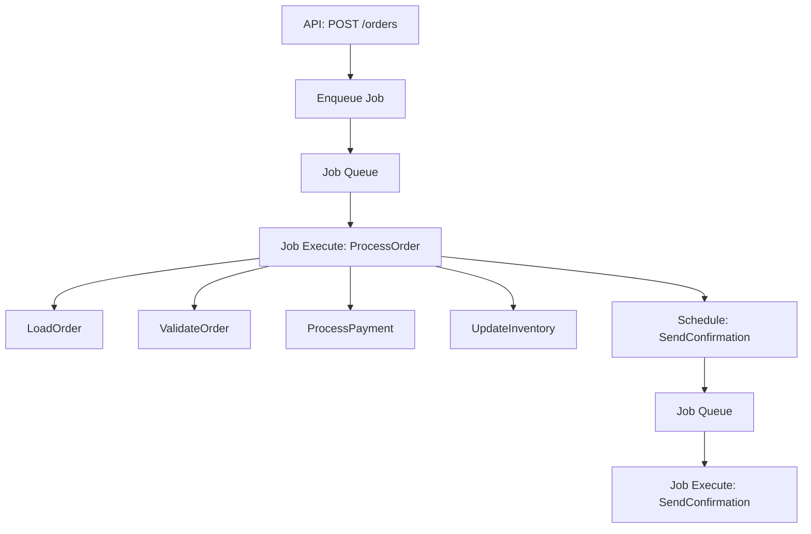

# How to Instrument Hangfire Background Jobs with OpenTelemetry in .NET

Author: [nawazdhandala](https://www.github.com/nawazdhandala)

Tags: OpenTelemetry, Hangfire, .NET, Background Jobs, Scheduling, Tracing

Description: Complete guide to instrumenting Hangfire background jobs with OpenTelemetry for full visibility into job execution, retries, and failures in .NET.

Hangfire handles background processing in .NET applications, managing everything from simple fire-and-forget tasks to complex recurring jobs. When jobs execute across multiple servers, tracking execution time, failure rates, and retry attempts becomes critical. OpenTelemetry provides the distributed tracing and metrics to monitor your background job infrastructure.

## Understanding Hangfire's Execution Model

Hangfire processes jobs through a pipeline of filters and execution stages. Jobs can be:

- Fire-and-forget: Execute once, as soon as possible
- Delayed: Execute once, after a specified delay
- Recurring: Execute on a schedule (cron expressions)
- Continuations: Execute after another job completes

Each execution creates opportunities for instrumentation. Tracking job lifecycle from enqueue to completion (or failure) gives you complete visibility.

## Setting Up Hangfire with OpenTelemetry

Install the required packages:

```bash
dotnet add package Hangfire.Core
dotnet add package Hangfire.SqlServer
dotnet add package Hangfire.AspNetCore
dotnet add package OpenTelemetry.Extensions.Hosting
dotnet add package OpenTelemetry.Instrumentation.AspNetCore
dotnet add package OpenTelemetry.Exporter.OpenTelemetryProtocol
```

Configure Hangfire and OpenTelemetry in your application:

```csharp
using Hangfire;
using Hangfire.SqlServer;
using OpenTelemetry.Resources;
using OpenTelemetry.Trace;
using OpenTelemetry.Metrics;

var builder = WebApplication.CreateBuilder(args);

// Configure OpenTelemetry
builder.Services.AddOpenTelemetry()
    .ConfigureResource(resource => resource
        .AddService("background-worker", serviceVersion: "1.0.0")
        .AddAttributes(new Dictionary<string, object>
        {
            ["deployment.environment"] = builder.Environment.EnvironmentName,
            ["server.id"] = Environment.MachineName
        }))
    .WithTracing(tracing => tracing
        .AddAspNetCoreInstrumentation()
        .AddHttpClientInstrumentation()
        .AddSqlClientInstrumentation()
        .AddSource("Hangfire.Jobs")
        .AddOtlpExporter(options =>
        {
            options.Endpoint = new Uri("http://localhost:4317");
        }))
    .WithMetrics(metrics => metrics
        .AddAspNetCoreInstrumentation()
        .AddMeter("Hangfire.Metrics")
        .AddOtlpExporter(options =>
        {
            options.Endpoint = new Uri("http://localhost:4317");
        }));

// Configure Hangfire
builder.Services.AddHangfire(configuration => configuration
    .SetDataCompatibilityLevel(CompatibilityLevel.Version_180)
    .UseSimpleAssemblyNameTypeSerializer()
    .UseRecommendedSerializerSettings()
    .UseSqlServerStorage(
        builder.Configuration.GetConnectionString("HangfireConnection"),
        new SqlServerStorageOptions
        {
            CommandBatchMaxTimeout = TimeSpan.FromMinutes(5),
            SlidingInvisibilityTimeout = TimeSpan.FromMinutes(5),
            QueuePollInterval = TimeSpan.Zero,
            UseRecommendedIsolationLevel = true,
            DisableGlobalLocks = true
        }));

builder.Services.AddHangfireServer();

var app = builder.Build();

app.UseHangfireDashboard();

app.Run();
```

## Creating an OpenTelemetry Job Filter

Hangfire's filter pipeline is perfect for adding telemetry. Create a filter that instruments all job executions:

```csharp
using System.Diagnostics;
using System.Diagnostics.Metrics;
using Hangfire.Client;
using Hangfire.Common;
using Hangfire.Server;
using Hangfire.States;
using Hangfire.Storage;

public class OpenTelemetryJobFilter :
    IClientFilter,
    IServerFilter,
    IElectStateFilter,
    IApplyStateFilter
{
    private static readonly ActivitySource ActivitySource =
        new ActivitySource("Hangfire.Jobs");

    private static readonly Meter Meter =
        new Meter("Hangfire.Metrics");

    private readonly Counter<long> _jobsEnqueued;
    private readonly Counter<long> _jobsExecuted;
    private readonly Counter<long> _jobsFailed;
    private readonly Counter<long> _jobsSucceeded;
    private readonly Histogram<double> _jobDuration;
    private readonly Histogram<int> _retryAttempts;

    public OpenTelemetryJobFilter()
    {
        _jobsEnqueued = Meter.CreateCounter<long>(
            "hangfire.jobs.enqueued",
            description: "Number of jobs enqueued");

        _jobsExecuted = Meter.CreateCounter<long>(
            "hangfire.jobs.executed",
            description: "Number of jobs executed");

        _jobsFailed = Meter.CreateCounter<long>(
            "hangfire.jobs.failed",
            description: "Number of jobs that failed");

        _jobsSucceeded = Meter.CreateCounter<long>(
            "hangfire.jobs.succeeded",
            description: "Number of jobs that succeeded");

        _jobDuration = Meter.CreateHistogram<double>(
            "hangfire.job.duration",
            unit: "ms",
            description: "Job execution duration");

        _retryAttempts = Meter.CreateHistogram<int>(
            "hangfire.job.retry_attempts",
            description: "Number of retry attempts");
    }

    // Client filter - called when job is created
    public void OnCreating(CreatingContext context)
    {
        var activity = ActivitySource.StartActivity(
            "Hangfire.Job.Create",
            ActivityKind.Producer);

        context.SetJobParameter("telemetry.trace_id", activity?.TraceId.ToString());
        context.SetJobParameter("telemetry.span_id", activity?.SpanId.ToString());
        context.SetJobParameter("telemetry.created_at", DateTime.UtcNow.ToString("o"));

        activity?.SetTag("job.type", context.Job.Type.Name);
        activity?.SetTag("job.method", context.Job.Method.Name);
        activity?.SetTag("job.queue", context.InitialState?.Name ?? "default");

        context.Items["activity"] = activity;
    }

    public void OnCreated(CreatedContext context)
    {
        var activity = context.Items["activity"] as Activity;

        activity?.SetTag("job.id", context.BackgroundJob?.Id);
        activity?.AddEvent(new ActivityEvent("JobEnqueued"));

        _jobsEnqueued.Add(1, new KeyValuePair<string, object?>(
            "job.type", context.Job.Type.Name));

        activity?.Dispose();
    }

    // Server filter - called during job execution
    public void OnPerforming(PerformingContext context)
    {
        var traceId = context.GetJobParameter<string>("telemetry.trace_id");
        var spanId = context.GetJobParameter<string>("telemetry.span_id");

        ActivityContext parentContext = default;

        if (!string.IsNullOrEmpty(traceId) && !string.IsNullOrEmpty(spanId))
        {
            parentContext = new ActivityContext(
                ActivityTraceId.CreateFromString(traceId.AsSpan()),
                ActivitySpanId.CreateFromString(spanId.AsSpan()),
                ActivityTraceFlags.Recorded);
        }

        var activity = ActivitySource.StartActivity(
            "Hangfire.Job.Execute",
            ActivityKind.Consumer,
            parentContext);

        activity?.SetTag("job.id", context.BackgroundJob.Id);
        activity?.SetTag("job.type", context.BackgroundJob.Job.Type.Name);
        activity?.SetTag("job.method", context.BackgroundJob.Job.Method.Name);
        activity?.SetTag("job.queue", context.BackgroundJob.Job.Queue ?? "default");

        var retryCount = context.GetJobParameter<int>("RetryCount");
        if (retryCount > 0)
        {
            activity?.SetTag("job.retry_count", retryCount);
            activity?.AddEvent(new ActivityEvent("JobRetry"));
        }

        context.Items["activity"] = activity;
        context.Items["start_time"] = DateTime.UtcNow;
    }

    public void OnPerformed(PerformedContext context)
    {
        var activity = context.Items["activity"] as Activity;
        var startTime = (DateTime)context.Items["start_time"];
        var duration = (DateTime.UtcNow - startTime).TotalMilliseconds;

        _jobsExecuted.Add(1, new KeyValuePair<string, object?>(
            "job.type", context.BackgroundJob.Job.Type.Name));

        _jobDuration.Record(duration, new KeyValuePair<string, object?>(
            "job.type", context.BackgroundJob.Job.Type.Name));

        if (context.Exception != null)
        {
            activity?.SetStatus(ActivityStatusCode.Error, context.Exception.Message);
            activity?.RecordException(context.Exception);
            activity?.SetTag("job.success", false);

            _jobsFailed.Add(1, new KeyValuePair<string, object?>(
                "job.type", context.BackgroundJob.Job.Type.Name));
        }
        else
        {
            activity?.SetTag("job.success", true);
            activity?.AddEvent(new ActivityEvent("JobCompleted"));

            _jobsSucceeded.Add(1, new KeyValuePair<string, object?>(
                "job.type", context.BackgroundJob.Job.Type.Name));
        }

        activity?.SetTag("job.duration_ms", duration);
        activity?.Dispose();
    }

    // State change filters
    public void OnStateElection(ElectStateContext context)
    {
        var activity = Activity.Current;

        if (activity != null)
        {
            activity.SetTag("job.state.from", context.CurrentState);
            activity.SetTag("job.state.to", context.CandidateState.Name);
        }
    }

    public void OnStateApplied(ApplyStateContext context, IWriteOnlyTransaction transaction)
    {
        var activity = Activity.Current;

        if (activity != null && context.NewState is FailedState failedState)
        {
            var retryAttempt = context.GetJobParameter<int>("RetryCount") + 1;
            context.SetJobParameter("RetryCount", retryAttempt);

            _retryAttempts.Record(retryAttempt, new KeyValuePair<string, object?>(
                "job.type", context.BackgroundJob.Job.Type.Name));

            activity.AddEvent(new ActivityEvent("JobFailed",
                tags: new ActivityTagsCollection
                {
                    ["exception.type"] = failedState.Exception.GetType().Name,
                    ["exception.message"] = failedState.Exception.Message,
                    ["retry.attempt"] = retryAttempt
                }));
        }
    }

    public void OnStateUnapplied(ApplyStateContext context, IWriteOnlyTransaction transaction)
    {
        // Not used for telemetry
    }
}
```

Register the filter globally:

```csharp
GlobalJobFilters.Filters.Add(new OpenTelemetryJobFilter());
```

## Creating Instrumented Background Jobs

Now create jobs that add custom telemetry for business logic:

```csharp
using System.Diagnostics;
using Hangfire;

public interface IOrderProcessingJobs
{
    Task ProcessOrderAsync(Guid orderId);
    Task SendOrderConfirmationAsync(Guid orderId, string email);
    Task GenerateMonthlyReportAsync(DateTime reportMonth);
}

public class OrderProcessingJobs : IOrderProcessingJobs
{
    private static readonly ActivitySource ActivitySource =
        new ActivitySource("Hangfire.Jobs");

    private readonly IOrderRepository _orderRepository;
    private readonly IEmailService _emailService;
    private readonly IReportGenerator _reportGenerator;
    private readonly ILogger<OrderProcessingJobs> _logger;

    public OrderProcessingJobs(
        IOrderRepository orderRepository,
        IEmailService emailService,
        IReportGenerator reportGenerator,
        ILogger<OrderProcessingJobs> logger)
    {
        _orderRepository = orderRepository;
        _emailService = emailService;
        _reportGenerator = reportGenerator;
        _logger = logger;
    }

    [AutomaticRetry(Attempts = 3, DelaysInSeconds = new[] { 60, 300, 900 })]
    public async Task ProcessOrderAsync(Guid orderId)
    {
        // Parent span created by OpenTelemetryJobFilter
        // Add child spans for internal operations
        using var activity = ActivitySource.StartActivity(
            "ProcessOrder",
            ActivityKind.Internal);

        activity?.SetTag("order.id", orderId);

        try
        {
            _logger.LogInformation("Processing order {OrderId}", orderId);

            // Load order from database
            using (var loadActivity = ActivitySource.StartActivity("LoadOrder"))
            {
                var order = await _orderRepository.GetByIdAsync(orderId);

                if (order == null)
                {
                    loadActivity?.SetStatus(ActivityStatusCode.Error, "Order not found");
                    throw new InvalidOperationException($"Order {orderId} not found");
                }

                loadActivity?.SetTag("order.status", order.Status);
                loadActivity?.SetTag("order.amount", order.TotalAmount);
            }

            // Validate order
            using (var validateActivity = ActivitySource.StartActivity("ValidateOrder"))
            {
                var isValid = await ValidateOrderAsync(orderId);

                validateActivity?.SetTag("validation.result", isValid);

                if (!isValid)
                {
                    validateActivity?.SetStatus(ActivityStatusCode.Error, "Invalid order");
                    throw new InvalidOperationException($"Order {orderId} validation failed");
                }
            }

            // Process payment
            using (var paymentActivity = ActivitySource.StartActivity("ProcessPayment"))
            {
                await ProcessPaymentAsync(orderId);
                paymentActivity?.SetTag("payment.success", true);
            }

            // Update inventory
            using (var inventoryActivity = ActivitySource.StartActivity("UpdateInventory"))
            {
                await UpdateInventoryAsync(orderId);
                inventoryActivity?.SetTag("inventory.updated", true);
            }

            // Schedule confirmation email
            using (var scheduleActivity = ActivitySource.StartActivity("ScheduleConfirmation"))
            {
                var order = await _orderRepository.GetByIdAsync(orderId);
                BackgroundJob.Enqueue<IOrderProcessingJobs>(
                    x => x.SendOrderConfirmationAsync(orderId, order.CustomerEmail));

                scheduleActivity?.SetTag("email.scheduled", true);
            }

            activity?.SetTag("processing.success", true);
            activity?.AddEvent(new ActivityEvent("OrderProcessedSuccessfully"));

            _logger.LogInformation("Order {OrderId} processed successfully", orderId);
        }
        catch (Exception ex)
        {
            activity?.SetStatus(ActivityStatusCode.Error, ex.Message);
            activity?.RecordException(ex);
            _logger.LogError(ex, "Failed to process order {OrderId}", orderId);
            throw;
        }
    }

    [AutomaticRetry(Attempts = 5)]
    public async Task SendOrderConfirmationAsync(Guid orderId, string email)
    {
        using var activity = ActivitySource.StartActivity(
            "SendOrderConfirmation",
            ActivityKind.Internal);

        activity?.SetTag("order.id", orderId);
        activity?.SetTag("email.recipient", email);

        try
        {
            _logger.LogInformation(
                "Sending confirmation email for order {OrderId} to {Email}",
                orderId,
                email);

            var order = await _orderRepository.GetByIdAsync(orderId);

            if (order == null)
            {
                activity?.SetStatus(ActivityStatusCode.Error, "Order not found");
                throw new InvalidOperationException($"Order {orderId} not found");
            }

            await _emailService.SendConfirmationAsync(order, email);

            activity?.SetTag("email.sent", true);
            activity?.AddEvent(new ActivityEvent("EmailSent"));

            _logger.LogInformation(
                "Confirmation email sent for order {OrderId}",
                orderId);
        }
        catch (Exception ex)
        {
            activity?.SetStatus(ActivityStatusCode.Error, ex.Message);
            activity?.RecordException(ex);
            _logger.LogError(
                ex,
                "Failed to send confirmation email for order {OrderId}",
                orderId);
            throw;
        }
    }

    [AutomaticRetry(Attempts = 2)]
    [Queue("reports")]
    public async Task GenerateMonthlyReportAsync(DateTime reportMonth)
    {
        using var activity = ActivitySource.StartActivity(
            "GenerateMonthlyReport",
            ActivityKind.Internal);

        activity?.SetTag("report.month", reportMonth.ToString("yyyy-MM"));
        activity?.SetTag("report.type", "monthly");

        try
        {
            _logger.LogInformation(
                "Generating monthly report for {Month}",
                reportMonth.ToString("yyyy-MM"));

            // Generate report
            using (var generateActivity = ActivitySource.StartActivity("GenerateReport"))
            {
                var report = await _reportGenerator.GenerateMonthlyAsync(reportMonth);

                generateActivity?.SetTag("report.orders_count", report.OrderCount);
                generateActivity?.SetTag("report.total_revenue", report.TotalRevenue);
            }

            // Save report
            using (var saveActivity = ActivitySource.StartActivity("SaveReport"))
            {
                await _reportGenerator.SaveReportAsync(reportMonth);
                saveActivity?.SetTag("report.saved", true);
            }

            activity?.SetTag("report.generation.success", true);
            activity?.AddEvent(new ActivityEvent("ReportGenerated"));

            _logger.LogInformation(
                "Monthly report generated for {Month}",
                reportMonth.ToString("yyyy-MM"));
        }
        catch (Exception ex)
        {
            activity?.SetStatus(ActivityStatusCode.Error, ex.Message);
            activity?.RecordException(ex);
            _logger.LogError(
                ex,
                "Failed to generate monthly report for {Month}",
                reportMonth.ToString("yyyy-MM"));
            throw;
        }
    }

    private async Task<bool> ValidateOrderAsync(Guid orderId)
    {
        await Task.Delay(100); // Simulate validation
        return true;
    }

    private async Task ProcessPaymentAsync(Guid orderId)
    {
        await Task.Delay(200); // Simulate payment processing
    }

    private async Task UpdateInventoryAsync(Guid orderId)
    {
        await Task.Delay(150); // Simulate inventory update
    }
}

public interface IOrderRepository
{
    Task<Order?> GetByIdAsync(Guid orderId);
}

public interface IEmailService
{
    Task SendConfirmationAsync(Order order, string email);
}

public interface IReportGenerator
{
    Task<MonthlyReport> GenerateMonthlyAsync(DateTime month);
    Task SaveReportAsync(DateTime month);
}

public class Order
{
    public Guid Id { get; set; }
    public string Status { get; set; } = string.Empty;
    public decimal TotalAmount { get; set; }
    public string CustomerEmail { get; set; } = string.Empty;
}

public class MonthlyReport
{
    public int OrderCount { get; set; }
    public decimal TotalRevenue { get; set; }
}
```

## Scheduling Jobs with Context Propagation

When scheduling jobs from API endpoints, propagate trace context:

```csharp
using System.Diagnostics;
using Hangfire;

[ApiController]
[Route("api/[controller]")]
public class OrdersController : ControllerBase
{
    private static readonly ActivitySource ActivitySource =
        new ActivitySource("Hangfire.Jobs");

    private readonly IBackgroundJobClient _backgroundJobClient;

    public OrdersController(IBackgroundJobClient backgroundJobClient)
    {
        _backgroundJobClient = backgroundJobClient;
    }

    [HttpPost]
    public IActionResult CreateOrder([FromBody] CreateOrderRequest request)
    {
        using var activity = ActivitySource.StartActivity(
            "CreateOrder",
            ActivityKind.Internal);

        var orderId = Guid.NewGuid();

        activity?.SetTag("order.id", orderId);
        activity?.SetTag("order.customer_email", request.CustomerEmail);

        // Enqueue background job
        // OpenTelemetryJobFilter will propagate context
        var jobId = _backgroundJobClient.Enqueue<IOrderProcessingJobs>(
            x => x.ProcessOrderAsync(orderId));

        activity?.SetTag("job.id", jobId);
        activity?.AddEvent(new ActivityEvent("JobScheduled"));

        return Accepted(new { orderId, jobId });
    }

    [HttpPost("delayed")]
    public IActionResult CreateDelayedOrder(
        [FromBody] CreateOrderRequest request,
        [FromQuery] int delaySeconds = 300)
    {
        using var activity = ActivitySource.StartActivity(
            "CreateDelayedOrder",
            ActivityKind.Internal);

        var orderId = Guid.NewGuid();

        activity?.SetTag("order.id", orderId);
        activity?.SetTag("job.delay_seconds", delaySeconds);

        // Schedule job with delay
        var jobId = _backgroundJobClient.Schedule<IOrderProcessingJobs>(
            x => x.ProcessOrderAsync(orderId),
            TimeSpan.FromSeconds(delaySeconds));

        activity?.SetTag("job.id", jobId);
        activity?.AddEvent(new ActivityEvent("DelayedJobScheduled"));

        return Accepted(new { orderId, jobId, delaySeconds });
    }

    [HttpPost("recurring")]
    public IActionResult SetupRecurringReports()
    {
        using var activity = ActivitySource.StartActivity(
            "SetupRecurringReports",
            ActivityKind.Internal);

        // Schedule recurring job (runs on first day of each month at 2 AM)
        RecurringJob.AddOrUpdate<IOrderProcessingJobs>(
            "monthly-report",
            x => x.GenerateMonthlyReportAsync(DateTime.UtcNow.AddMonths(-1)),
            "0 2 1 * *");

        activity?.SetTag("recurring.job.id", "monthly-report");
        activity?.AddEvent(new ActivityEvent("RecurringJobScheduled"));

        return Ok(new { message = "Recurring reports configured" });
    }
}

public record CreateOrderRequest(string CustomerEmail, decimal TotalAmount);
```

## Visualizing Job Execution Flow

OpenTelemetry traces show the complete job lifecycle:



Each job execution appears as a connected span, showing the relationship between the API call and background processing.

## Monitoring Job Health

Create dashboards to track:

**Job Execution Metrics:**
- Jobs enqueued per minute
- Jobs executed per minute
- Success vs. failure rate
- Average execution duration
- P95/P99 execution latency

**Retry Metrics:**
- Retry attempts per job type
- Jobs that exhausted retries
- Average retry delay

**Queue Metrics:**
- Queue depth per queue name
- Processing rate per queue
- Oldest job waiting time

Set up alerts for:
- High failure rate (> 5%)
- Jobs taking longer than expected
- Queue depth growing unbounded
- Jobs consistently exhausting retries

Your Hangfire implementation now has comprehensive OpenTelemetry instrumentation. Every job from creation to completion (or failure) is traced and measured, giving you complete visibility into your background processing infrastructure. This makes troubleshooting failures, optimizing performance, and understanding system behavior straightforward and data-driven.
