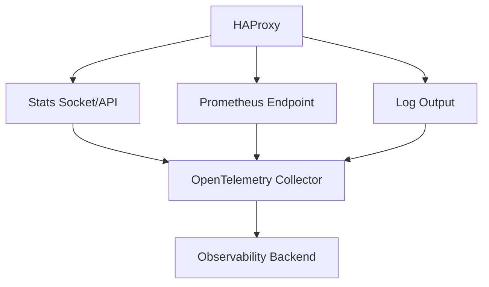
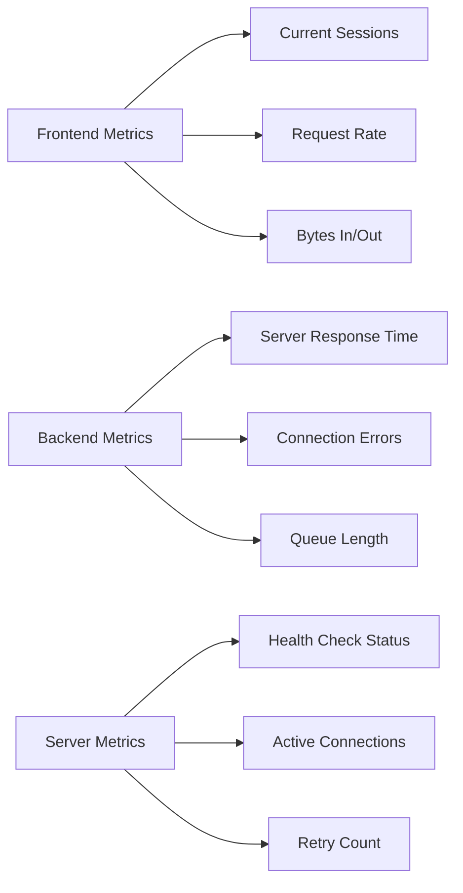
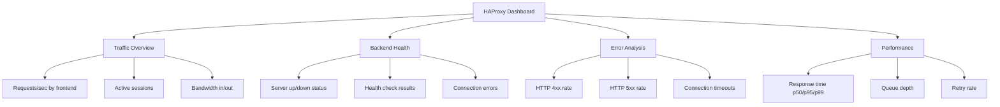

# How to Instrument HAProxy Load Balancer with OpenTelemetry

Author: [nawazdhandala](https://www.github.com/nawazdhandala)

Tags: OpenTelemetry, HAProxy, Load Balancer, Monitoring, Observability, Metrics

Description: Step-by-step guide to instrumenting HAProxy load balancer with OpenTelemetry for metrics collection, tracing, and performance monitoring.

---

HAProxy is one of the most widely deployed load balancers in production systems. It's fast, reliable, and handles millions of connections without breaking a sweat. But knowing that it works and knowing how well it works are two different things. When traffic patterns shift or backend servers start struggling, you need detailed telemetry to understand what's happening at the load balancer layer.

This guide shows you how to integrate HAProxy with OpenTelemetry to collect metrics, enable request tracing, and build a complete picture of your load balancer's behavior.

## Overview of HAProxy Observability

HAProxy exposes a wealth of statistics through its built-in stats interface and runtime API. The challenge is getting this data into a modern observability pipeline. OpenTelemetry bridges this gap by providing a standard way to collect, process, and export HAProxy telemetry alongside data from the rest of your infrastructure.



There are three main approaches to getting data out of HAProxy: scraping the Prometheus exporter endpoint, reading from the stats socket, and collecting structured logs. We'll cover all three.

## Enabling the HAProxy Prometheus Endpoint

HAProxy 2.0+ includes a built-in Prometheus exporter. This is the easiest way to get metrics into OpenTelemetry. You just need to enable it in your HAProxy configuration.

Add a dedicated frontend section to expose Prometheus metrics on a separate port. Keep this port internal and don't expose it to the internet.

```haproxy
# haproxy.cfg
# Enable the Prometheus metrics endpoint on an internal-only port
frontend prometheus
    # Bind to port 8405 - keep this behind your firewall
    bind *:8405
    mode http
    http-request use-service prometheus-exporter if { path /metrics }
    # Reject any request that isn't for the metrics path
    default_backend empty

# Your existing frontend configuration
frontend http_front
    bind *:80
    bind *:443 ssl crt /etc/haproxy/certs/
    mode http

    # Enable unique request IDs for trace correlation
    unique-id-format %{+X}o\ %ci:%cp_%fi:%fp_%Ts_%rt:%pid
    unique-id-header X-Request-ID

    # Log format that includes timing data for observability
    log-format "%ci:%cp [%tr] %ft %b/%s %TR/%Tw/%Tc/%Tr/%Ta %ST %B %CC %CS %tsc %ac/%fc/%bc/%sc/%rc %sq/%bq %hr %hs %{+Q}r"

    default_backend app_servers

backend app_servers
    mode http
    balance roundrobin
    # Enable health checks every 3 seconds
    option httpchk GET /health
    server app1 10.0.1.10:8080 check inter 3s
    server app2 10.0.1.11:8080 check inter 3s
    server app3 10.0.1.12:8080 check inter 3s
```

## Configuring the OpenTelemetry Collector for HAProxy

Now set up the OpenTelemetry Collector to scrape HAProxy's Prometheus endpoint. The collector also enriches the data with additional metadata before exporting it.

This collector config uses the Prometheus receiver to pull metrics from HAProxy and the HAProxy receiver for additional stats.

```yaml
# otel-collector-config.yaml
# Collector configuration for HAProxy monitoring
receivers:
  # Scrape HAProxy's built-in Prometheus exporter
  prometheus:
    config:
      scrape_configs:
        - job_name: 'haproxy'
          # Scrape every 15 seconds for near-real-time metrics
          scrape_interval: 15s
          static_configs:
            - targets: ['haproxy-server:8405']
              labels:
                instance: 'haproxy-primary'
          # Only keep metrics that start with haproxy_ to filter out Go runtime metrics
          metric_relabel_configs:
            - source_labels: [__name__]
              regex: 'haproxy_.*'
              action: keep

  # Use the dedicated HAProxy receiver for stats socket data
  # This provides additional metrics not available through Prometheus
  haproxy:
    endpoint: http://haproxy-server:8405/metrics
    collection_interval: 30s

processors:
  # Batch metrics for efficient network usage
  batch:
    timeout: 15s
    send_batch_size: 256

  # Add resource attributes to identify this HAProxy instance
  resource:
    attributes:
      - key: service.name
        value: haproxy-primary
        action: upsert
      - key: service.type
        value: load-balancer
        action: insert
      - key: deployment.environment
        value: production
        action: insert

  # Transform HAProxy metric names to follow OpenTelemetry conventions
  metricstransform:
    transforms:
      # Rename connection metrics for clarity
      - include: haproxy_frontend_current_sessions
        action: update
        new_name: haproxy.frontend.sessions.active
      - include: haproxy_backend_response_time_average_seconds
        action: update
        new_name: haproxy.backend.response_time.avg

exporters:
  otlp:
    endpoint: "your-backend:4317"
    tls:
      insecure: false

service:
  pipelines:
    metrics:
      receivers: [prometheus, haproxy]
      processors: [resource, metricstransform, batch]
      exporters: [otlp]
```

## Key HAProxy Metrics to Track

HAProxy exposes hundreds of metrics, but these are the ones that matter most for day-to-day operations. Understanding what each one tells you helps you build useful dashboards and alerts.



**Frontend metrics** tell you about incoming traffic. Watch `haproxy_frontend_current_sessions` for connection pressure and `haproxy_frontend_http_requests_total` for request throughput. A sudden drop in request rate often means something is wrong upstream of HAProxy, like a DNS issue.

**Backend metrics** reveal how your application servers are performing. The most important one is `haproxy_backend_response_time_average_seconds`. If this is climbing, your backend servers are getting slow. Combined with `haproxy_backend_connection_errors_total`, you can distinguish between slow backends and failing backends.

**Queue length** (`haproxy_backend_current_queue`) is a leading indicator of trouble. If requests are queuing up, it means backends can't keep up with incoming traffic. You usually want to alert on this before users start noticing latency.

## Adding OpenTelemetry Tracing to HAProxy

HAProxy doesn't natively support OpenTelemetry tracing, but you can enable trace context propagation through it. The key is making sure HAProxy forwards the W3C Trace Context headers from incoming requests to your backend servers.

Configure HAProxy to pass through trace headers so that distributed traces aren't broken at the load balancer.

```haproxy
# haproxy.cfg - Trace context propagation
frontend http_front
    bind *:80
    mode http

    # Generate a unique request ID if one doesn't exist
    # This helps correlate HAProxy logs with traces
    unique-id-format %{+X}o\ %ci:%cp_%fi:%fp_%Ts_%rt:%pid
    unique-id-header X-Request-ID

    # Capture OpenTelemetry trace headers for logging
    # These captures let you include trace IDs in HAProxy logs
    capture request header traceparent len 128
    capture request header tracestate len 256
    capture request header baggage len 512

    default_backend app_servers

backend app_servers
    mode http
    balance roundrobin

    # Forward trace context headers to backend servers
    # HAProxy passes these through by default in HTTP mode,
    # but explicitly capturing them ensures they appear in logs
    http-request set-header X-Forwarded-Proto %[ssl_fc,iif(https,http)]

    server app1 10.0.1.10:8080 check
    server app2 10.0.1.11:8080 check
```

## Collecting HAProxy Logs with OpenTelemetry

HAProxy logs contain valuable request-level data that complements your metrics. By collecting these logs through the OpenTelemetry Collector, you can correlate them with traces and metrics.

First, configure HAProxy to output structured logs. Then set up the collector's filelog receiver to parse them.

```haproxy
# haproxy.cfg - Structured logging configuration
global
    # Send logs to a local file that the OTel Collector will tail
    log /var/log/haproxy/haproxy.log local0 info
    log-tag haproxy

defaults
    log global
    mode http
    option httplog
    option dontlognull

    # Custom log format with all timing fields and trace ID
    # %ID is the unique-id we configured earlier
    log-format '{"timestamp":"%t","client":"%ci:%cp","frontend":"%f","backend":"%b","server":"%s","timings":{"request":%TR,"queue":%Tw,"connect":%Tc,"response":%Tr,"total":%Ta},"status":%ST,"bytes":%B,"request_id":"%ID","method":"%HM","uri":"%HU","traceparent":"%[capture.req.hdr(0)]"}'
```

Now configure the OpenTelemetry Collector to read and parse these structured logs.

```yaml
# Add to your otel-collector-config.yaml
receivers:
  filelog:
    include:
      - /var/log/haproxy/haproxy.log
    # Parse the JSON-structured HAProxy logs
    operators:
      - type: json_parser
        timestamp:
          parse_from: attributes.timestamp
          layout: '%d/%b/%Y:%H:%M:%S.%L'
      - type: move
        from: attributes.status
        to: attributes.http.status_code
      - type: move
        from: attributes.method
        to: attributes.http.method
      - type: move
        from: attributes.uri
        to: attributes.http.url
      # Extract trace context from the captured traceparent header
      - type: trace_parser
        trace_id:
          parse_from: attributes.traceparent
          regex: '^00-(?P<trace_id>[a-f0-9]{32})-'
        span_id:
          parse_from: attributes.traceparent
          regex: '^00-[a-f0-9]{32}-(?P<span_id>[a-f0-9]{16})-'

service:
  pipelines:
    logs:
      receivers: [filelog]
      processors: [resource, batch]
      exporters: [otlp]
```

## Building a Monitoring Dashboard

With metrics and logs flowing through the collector, you can build a comprehensive HAProxy monitoring dashboard. Here are the key panels you should include.



The most important view is response time broken down by backend server. This quickly shows you if one server in the pool is dragging down overall performance. If one server consistently has higher latency than the others, it might need more resources or it might be handling a disproportionate share of expensive requests.

## Setting Up Alerts

Here are practical alert rules based on the metrics we're collecting. These thresholds are starting points; tune them based on your traffic patterns.

```yaml
# alert-rules.yaml
# Alert definitions for HAProxy monitoring
groups:
  - name: haproxy_alerts
    rules:
      # Alert when backend error rate exceeds 5%
      - alert: HAProxyHighBackendErrorRate
        expr: |
          rate(haproxy_backend_http_responses_total{code="5xx"}[5m])
          / rate(haproxy_backend_http_responses_total[5m]) > 0.05
        for: 2m
        labels:
          severity: critical
        annotations:
          summary: "HAProxy backend {{ $labels.proxy }} has high error rate"

      # Alert when request queue is building up
      - alert: HAProxyQueueBuildUp
        expr: haproxy_backend_current_queue > 10
        for: 1m
        labels:
          severity: warning
        annotations:
          summary: "Requests queuing on backend {{ $labels.proxy }}"

      # Alert when a backend server goes down
      - alert: HAProxyServerDown
        expr: haproxy_server_status == 0
        for: 30s
        labels:
          severity: critical
        annotations:
          summary: "HAProxy server {{ $labels.server }} in {{ $labels.proxy }} is down"
```

## Wrapping Up

Instrumenting HAProxy with OpenTelemetry gives you a unified view of your load balancer alongside the rest of your infrastructure. By combining Prometheus metrics for aggregate performance data, structured logs for request-level detail, and trace context propagation for distributed tracing, you get complete visibility into how traffic flows through your system.

The setup doesn't require any changes to HAProxy itself beyond enabling the Prometheus exporter and adjusting log formats. The OpenTelemetry Collector handles all the heavy lifting of collection, transformation, and export. This approach scales well whether you have a single HAProxy instance or a fleet of them handling traffic across multiple data centers.

Start with the Prometheus metrics receiver since it gives you the quickest return on investment. Add log collection once you need request-level debugging capability. With this foundation in place, you'll be able to diagnose HAProxy-related issues quickly and confidently.
