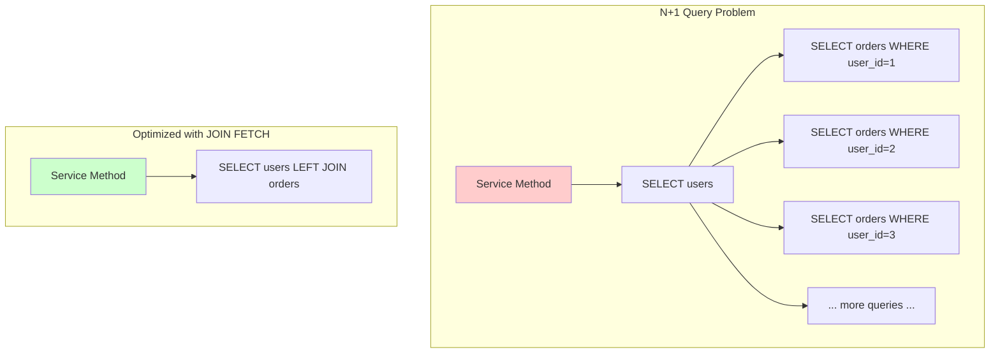

# How to Instrument Hibernate ORM Queries with OpenTelemetry

Author: [nawazdhandala](https://www.github.com/nawazdhandala)

Tags: OpenTelemetry, Hibernate, ORM, Database, SQL, Java Tracing

Description: Learn to instrument Hibernate ORM queries with OpenTelemetry for detailed database performance insights, including SQL statement tracking, N+1 query detection, and transaction monitoring.

Hibernate ORM abstracts database interactions behind a convenient object-oriented API, but this abstraction can hide performance problems. Slow queries, N+1 selects, and excessive database calls often go unnoticed until they cause production issues. OpenTelemetry provides visibility into Hibernate's database interactions, revealing exactly what SQL is executed and how long it takes.

This guide shows you how to instrument Hibernate with OpenTelemetry to gain deep insights into your ORM queries and transactions.

## Understanding Hibernate's Query Execution

Hibernate generates SQL dynamically based on entity mappings, lazy loading configuration, and query methods. A single repository call might trigger multiple database queries due to lazy loading or join fetches. Without instrumentation, these hidden queries remain invisible.

OpenTelemetry can capture each database operation as a span, including connection acquisition, query execution, and result set processing. This visibility helps identify performance bottlenecks and optimize database access patterns.

## Project Setup

Add the required dependencies to your Maven project:

```xml
<!-- Spring Boot with JPA -->
<dependency>
    <groupId>org.springframework.boot</groupId>
    <artifactId>spring-boot-starter-data-jpa</artifactId>
    <version>3.2.1</version>
</dependency>

<!-- Hibernate core -->
<dependency>
    <groupId>org.hibernate.orm</groupId>
    <artifactId>hibernate-core</artifactId>
    <version>6.4.1.Final</version>
</dependency>

<!-- OpenTelemetry instrumentation -->
<dependency>
    <groupId>io.opentelemetry.instrumentation</groupId>
    <artifactId>opentelemetry-spring-boot-starter</artifactId>
    <version>2.0.0</version>
</dependency>

<!-- OpenTelemetry JDBC instrumentation -->
<dependency>
    <groupId>io.opentelemetry.instrumentation</groupId>
    <artifactId>opentelemetry-jdbc</artifactId>
    <version>2.0.0</version>
</dependency>

<!-- Database driver (PostgreSQL example) -->
<dependency>
    <groupId>org.postgresql</groupId>
    <artifactId>postgresql</artifactId>
    <version>42.7.1</version>
</dependency>
```

The opentelemetry-jdbc library automatically instruments JDBC calls, capturing SQL statements and execution times.

## Configuring JDBC Instrumentation

Configure your application.properties to enable OpenTelemetry JDBC tracing:

```properties
# Database configuration with OpenTelemetry JDBC wrapper
spring.datasource.url=jdbc:otel:postgresql://localhost:5432/mydb
spring.datasource.username=myuser
spring.datasource.password=mypassword
spring.datasource.driver-class-name=io.opentelemetry.instrumentation.jdbc.OpenTelemetryDriver

# Hibernate configuration
spring.jpa.hibernate.ddl-auto=validate
spring.jpa.show-sql=false
spring.jpa.properties.hibernate.format_sql=true
spring.jpa.properties.hibernate.use_sql_comments=true
spring.jpa.properties.hibernate.jdbc.batch_size=20

# OpenTelemetry configuration
otel.service.name=hibernate-app
otel.traces.exporter=otlp
otel.exporter.otlp.endpoint=http://localhost:4317
otel.instrumentation.jdbc.statement-sanitizer.enabled=true
```

The jdbc:otel: prefix wraps the JDBC driver with OpenTelemetry instrumentation. The statement sanitizer removes sensitive data from SQL statements before exporting.

## Creating Hibernate Interceptor

Build a custom Hibernate interceptor to add span attributes and track entity operations:

```java
import io.opentelemetry.api.trace.Span;
import io.opentelemetry.api.trace.Tracer;
import org.hibernate.CallbackException;
import org.hibernate.Interceptor;
import org.hibernate.type.Type;
import org.springframework.stereotype.Component;

import java.io.Serializable;

@Component
public class TracingHibernateInterceptor implements Interceptor {

    private final Tracer tracer;

    public TracingHibernateInterceptor(Tracer tracer) {
        this.tracer = tracer;
    }

    @Override
    public boolean onLoad(Object entity, Serializable id, Object[] state,
                          String[] propertyNames, Type[] types) {
        Span currentSpan = Span.current();
        currentSpan.setAttribute("hibernate.operation", "load");
        currentSpan.setAttribute("hibernate.entity", entity.getClass().getSimpleName());
        currentSpan.setAttribute("hibernate.entity.id", id.toString());
        return false;
    }

    @Override
    public boolean onSave(Object entity, Serializable id, Object[] state,
                          String[] propertyNames, Type[] types) {
        Span currentSpan = Span.current();
        currentSpan.setAttribute("hibernate.operation", "save");
        currentSpan.setAttribute("hibernate.entity", entity.getClass().getSimpleName());
        if (id != null) {
            currentSpan.setAttribute("hibernate.entity.id", id.toString());
        }
        return false;
    }

    @Override
    public void onDelete(Object entity, Serializable id, Object[] state,
                         String[] propertyNames, Type[] types) {
        Span currentSpan = Span.current();
        currentSpan.setAttribute("hibernate.operation", "delete");
        currentSpan.setAttribute("hibernate.entity", entity.getClass().getSimpleName());
        currentSpan.setAttribute("hibernate.entity.id", id.toString());
    }

    @Override
    public boolean onFlushDirty(Object entity, Serializable id, Object[] currentState,
                                Object[] previousState, String[] propertyNames, Type[] types) {
        Span currentSpan = Span.current();
        currentSpan.setAttribute("hibernate.operation", "update");
        currentSpan.setAttribute("hibernate.entity", entity.getClass().getSimpleName());
        currentSpan.setAttribute("hibernate.entity.id", id.toString());
        return false;
    }
}
```

This interceptor adds metadata to spans whenever Hibernate performs entity operations.

## Registering the Interceptor

Configure Spring to use the custom interceptor:

```java
import org.hibernate.Interceptor;
import org.springframework.boot.autoconfigure.orm.jpa.HibernatePropertiesCustomizer;
import org.springframework.context.annotation.Bean;
import org.springframework.context.annotation.Configuration;

import java.util.Map;

@Configuration
public class HibernateConfig {

    @Bean
    public HibernatePropertiesCustomizer hibernatePropertiesCustomizer(
            TracingHibernateInterceptor interceptor) {
        return hibernateProperties ->
            hibernateProperties.put("hibernate.session_factory.interceptor", interceptor);
    }
}
```

This ensures the interceptor is active for all Hibernate sessions.

## Creating Traced Repository Operations

Build a service layer that creates explicit spans for repository operations:

```java
import io.opentelemetry.api.trace.Span;
import io.opentelemetry.api.trace.StatusCode;
import io.opentelemetry.api.trace.Tracer;
import io.opentelemetry.context.Context;
import io.opentelemetry.context.Scope;
import org.springframework.stereotype.Service;
import org.springframework.transaction.annotation.Transactional;

import java.util.List;
import java.util.Optional;

@Service
public class UserService {

    private final UserRepository userRepository;
    private final Tracer tracer;

    public UserService(UserRepository userRepository, Tracer tracer) {
        this.userRepository = userRepository;
        this.tracer = tracer;
    }

    @Transactional(readOnly = true)
    public Optional<User> findById(Long id) {
        Span span = tracer.spanBuilder("UserService.findById")
            .setParent(Context.current())
            .startSpan();

        try (Scope scope = span.makeCurrent()) {
            span.setAttribute("user.id", id);

            Optional<User> user = userRepository.findById(id);
            span.setAttribute("user.found", user.isPresent());

            span.setStatus(StatusCode.OK);
            return user;
        } catch (Exception e) {
            span.setStatus(StatusCode.ERROR, e.getMessage());
            span.recordException(e);
            throw e;
        } finally {
            span.end();
        }
    }

    @Transactional(readOnly = true)
    public List<User> findByEmailDomain(String domain) {
        Span span = tracer.spanBuilder("UserService.findByEmailDomain")
            .setParent(Context.current())
            .startSpan();

        try (Scope scope = span.makeCurrent()) {
            span.setAttribute("email.domain", domain);

            List<User> users = userRepository.findByEmailContaining("@" + domain);
            span.setAttribute("result.count", users.size());

            span.setStatus(StatusCode.OK);
            return users;
        } catch (Exception e) {
            span.setStatus(StatusCode.ERROR, e.getMessage());
            span.recordException(e);
            throw e;
        } finally {
            span.end();
        }
    }

    @Transactional
    public User createUser(User user) {
        Span span = tracer.spanBuilder("UserService.createUser")
            .setParent(Context.current())
            .startSpan();

        try (Scope scope = span.makeCurrent()) {
            span.setAttribute("user.email", user.getEmail());

            User savedUser = userRepository.save(user);
            span.setAttribute("user.id", savedUser.getId());

            span.setStatus(StatusCode.OK);
            return savedUser;
        } catch (Exception e) {
            span.setStatus(StatusCode.ERROR, e.getMessage());
            span.recordException(e);
            throw e;
        } finally {
            span.end();
        }
    }
}
```

Each method creates a span that encompasses the repository operation and any generated SQL queries.

## Detecting N+1 Query Problems

Create a utility to detect and alert on N+1 query patterns:

```java
import io.opentelemetry.api.trace.Span;
import io.opentelemetry.api.trace.Tracer;
import org.aspectj.lang.ProceedingJoinPoint;
import org.aspectj.lang.annotation.Around;
import org.aspectj.lang.annotation.Aspect;
import org.hibernate.SessionFactory;
import org.hibernate.stat.Statistics;
import org.springframework.stereotype.Component;

@Aspect
@Component
public class QueryCountMonitor {

    private final SessionFactory sessionFactory;
    private final Tracer tracer;

    public QueryCountMonitor(SessionFactory sessionFactory, Tracer tracer) {
        this.sessionFactory = sessionFactory;
        this.tracer = tracer;
    }

    @Around("@annotation(org.springframework.transaction.annotation.Transactional)")
    public Object monitorQueryCount(ProceedingJoinPoint joinPoint) throws Throwable {
        Statistics stats = sessionFactory.getStatistics();
        stats.setStatisticsEnabled(true);
        stats.clear();

        long startQueryCount = stats.getQueryExecutionCount();

        Object result = joinPoint.proceed();

        long endQueryCount = stats.getQueryExecutionCount();
        long queriesExecuted = endQueryCount - startQueryCount;

        Span currentSpan = Span.current();
        currentSpan.setAttribute("hibernate.query.count", queriesExecuted);
        currentSpan.setAttribute("hibernate.entity.load.count", stats.getEntityLoadCount());
        currentSpan.setAttribute("hibernate.entity.fetch.count", stats.getEntityFetchCount());

        // Alert if potential N+1 problem detected
        if (queriesExecuted > 10) {
            currentSpan.setAttribute("hibernate.potential_n_plus_1", true);
            currentSpan.addEvent("Potential N+1 query detected: " + queriesExecuted + " queries");
        }

        return result;
    }
}
```

This aspect monitors query counts and flags transactions that execute many queries, indicating possible N+1 problems.

## Instrumenting Custom Queries

Add tracing to custom JPQL and native queries:

```java
import jakarta.persistence.EntityManager;
import jakarta.persistence.TypedQuery;
import org.springframework.stereotype.Repository;

import java.util.List;

@Repository
public class CustomUserRepository {

    private final EntityManager entityManager;
    private final Tracer tracer;

    public CustomUserRepository(EntityManager entityManager, Tracer tracer) {
        this.entityManager = entityManager;
        this.tracer = tracer;
    }

    public List<User> findActiveUsersWithOrders() {
        Span span = tracer.spanBuilder("CustomUserRepository.findActiveUsersWithOrders")
            .setParent(Context.current())
            .startSpan();

        try (Scope scope = span.makeCurrent()) {
            // JPQL query with join fetch to avoid N+1
            String jpql = """
                SELECT DISTINCT u FROM User u
                LEFT JOIN FETCH u.orders o
                WHERE u.active = true
                AND o.status = 'COMPLETED'
                ORDER BY u.createdAt DESC
                """;

            span.setAttribute("query.type", "JPQL");
            span.setAttribute("query.fetch_strategy", "JOIN_FETCH");

            TypedQuery<User> query = entityManager.createQuery(jpql, User.class);
            query.setMaxResults(100);

            List<User> users = query.getResultList();
            span.setAttribute("result.count", users.size());

            span.setStatus(StatusCode.OK);
            return users;
        } catch (Exception e) {
            span.setStatus(StatusCode.ERROR, e.getMessage());
            span.recordException(e);
            throw e;
        } finally {
            span.end();
        }
    }

    public int updateUserStatusBatch(List<Long> userIds, String status) {
        Span span = tracer.spanBuilder("CustomUserRepository.updateUserStatusBatch")
            .setParent(Context.current())
            .startSpan();

        try (Scope scope = span.makeCurrent()) {
            span.setAttribute("query.type", "UPDATE");
            span.setAttribute("batch.size", userIds.size());

            String jpql = "UPDATE User u SET u.status = :status WHERE u.id IN :ids";

            int updated = entityManager.createQuery(jpql)
                .setParameter("status", status)
                .setParameter("ids", userIds)
                .executeUpdate();

            span.setAttribute("updated.count", updated);
            span.setStatus(StatusCode.OK);
            return updated;
        } catch (Exception e) {
            span.setStatus(StatusCode.ERROR, e.getMessage());
            span.recordException(e);
            throw e;
        } finally {
            span.end();
        }
    }

    public List<UserStatistics> getUserStatistics() {
        Span span = tracer.spanBuilder("CustomUserRepository.getUserStatistics")
            .setParent(Context.current())
            .startSpan();

        try (Scope scope = span.makeCurrent()) {
            span.setAttribute("query.type", "NATIVE_SQL");
            span.setAttribute("query.aggregation", true);

            String sql = """
                SELECT u.id, u.email,
                       COUNT(o.id) as order_count,
                       SUM(o.total) as total_spent
                FROM users u
                LEFT JOIN orders o ON u.id = o.user_id
                GROUP BY u.id, u.email
                HAVING COUNT(o.id) > 0
                ORDER BY total_spent DESC
                """;

            List<UserStatistics> stats = entityManager.createNativeQuery(sql, UserStatistics.class)
                .setMaxResults(50)
                .getResultList();

            span.setAttribute("result.count", stats.size());
            span.setStatus(StatusCode.OK);
            return stats;
        } catch (Exception e) {
            span.setStatus(StatusCode.ERROR, e.getMessage());
            span.recordException(e);
            throw e;
        } finally {
            span.end();
        }
    }
}
```

Each query method creates a span with relevant metadata about the query type and execution.

## Monitoring Transaction Boundaries

Track transaction lifecycle with custom annotations:

```java
import io.opentelemetry.api.trace.Span;
import io.opentelemetry.api.trace.Tracer;
import org.aspectj.lang.ProceedingJoinPoint;
import org.aspectj.lang.annotation.Around;
import org.aspectj.lang.annotation.Aspect;
import org.springframework.stereotype.Component;
import org.springframework.transaction.support.TransactionSynchronizationManager;

@Aspect
@Component
public class TransactionMonitor {

    private final Tracer tracer;

    public TransactionMonitor(Tracer tracer) {
        this.tracer = tracer;
    }

    @Around("@annotation(org.springframework.transaction.annotation.Transactional)")
    public Object monitorTransaction(ProceedingJoinPoint joinPoint) throws Throwable {
        Span span = tracer.spanBuilder("Transaction: " + joinPoint.getSignature().getName())
            .setParent(Context.current())
            .startSpan();

        try (Scope scope = span.makeCurrent()) {
            boolean isNewTransaction = TransactionSynchronizationManager.isActualTransactionActive();
            span.setAttribute("transaction.new", isNewTransaction);
            span.setAttribute("transaction.name",
                TransactionSynchronizationManager.getCurrentTransactionName());
            span.setAttribute("transaction.readonly",
                TransactionSynchronizationManager.isCurrentTransactionReadOnly());

            long startTime = System.currentTimeMillis();
            Object result = joinPoint.proceed();
            long duration = System.currentTimeMillis() - startTime;

            span.setAttribute("transaction.duration_ms", duration);
            span.setStatus(StatusCode.OK);

            return result;
        } catch (Exception e) {
            span.setAttribute("transaction.rollback", true);
            span.setStatus(StatusCode.ERROR, e.getMessage());
            span.recordException(e);
            throw e;
        } finally {
            span.end();
        }
    }
}
```

This aspect provides visibility into transaction boundaries and behavior.

## Entity Relationship Example

Here's how traces look for a complex entity relationship scenario:

```java
// Entity definitions with relationships
@Entity
@Table(name = "users")
public class User {
    @Id
    @GeneratedValue(strategy = GenerationType.IDENTITY)
    private Long id;

    private String email;
    private boolean active;

    // Lazy loading by default
    @OneToMany(mappedBy = "user", fetch = FetchType.LAZY)
    private List<Order> orders;

    @ManyToOne(fetch = FetchType.LAZY)
    @JoinColumn(name = "company_id")
    private Company company;

    // Getters and setters
}

@Entity
@Table(name = "orders")
public class Order {
    @Id
    @GeneratedValue(strategy = GenerationType.IDENTITY)
    private Long id;

    private String status;
    private Double total;

    @ManyToOne(fetch = FetchType.LAZY)
    @JoinColumn(name = "user_id")
    private User user;

    @OneToMany(mappedBy = "order", fetch = FetchType.LAZY)
    private List<OrderItem> items;

    // Getters and setters
}

// Service method that demonstrates different fetch strategies
@Service
public class ReportService {

    private final UserRepository userRepository;
    private final Tracer tracer;

    @Transactional(readOnly = true)
    public List<UserReport> generateUserReports() {
        Span span = tracer.spanBuilder("ReportService.generateUserReports")
            .setParent(Context.current())
            .startSpan();

        try (Scope scope = span.makeCurrent()) {
            // This will cause N+1 queries without proper fetch strategy
            List<User> users = userRepository.findAll();
            span.setAttribute("users.loaded", users.size());

            return users.stream()
                .map(user -> {
                    // Each access to orders triggers a separate query
                    int orderCount = user.getOrders().size();
                    double totalSpent = user.getOrders().stream()
                        .mapToDouble(Order::getTotal)
                        .sum();

                    return new UserReport(user.getEmail(), orderCount, totalSpent);
                })
                .toList();
        } finally {
            span.end();
        }
    }

    // Optimized version using join fetch
    @Transactional(readOnly = true)
    public List<UserReport> generateUserReportsOptimized() {
        Span span = tracer.spanBuilder("ReportService.generateUserReportsOptimized")
            .setParent(Context.current())
            .startSpan();

        try (Scope scope = span.makeCurrent()) {
            span.setAttribute("optimization", "JOIN_FETCH");

            // Single query with join fetch
            List<User> users = userRepository.findAllWithOrders();
            span.setAttribute("users.loaded", users.size());

            return users.stream()
                .map(user -> {
                    int orderCount = user.getOrders().size();
                    double totalSpent = user.getOrders().stream()
                        .mapToDouble(Order::getTotal)
                        .sum();

                    return new UserReport(user.getEmail(), orderCount, totalSpent);
                })
                .toList();
        } finally {
            span.end();
        }
    }
}
```

## Trace Comparison Visualization

Comparing N+1 queries versus optimized fetch:



The optimized version creates a single span with one database query, while the N+1 version shows multiple query spans.

## Analyzing Query Performance

Create a custom span processor to analyze query patterns:

```java
import io.opentelemetry.sdk.trace.ReadableSpan;
import io.opentelemetry.sdk.trace.SpanProcessor;
import org.slf4j.Logger;
import org.slf4j.LoggerFactory;

public class QueryAnalysisProcessor implements SpanProcessor {

    private static final Logger logger = LoggerFactory.getLogger(QueryAnalysisProcessor.class);
    private static final long SLOW_QUERY_THRESHOLD_MS = 1000;

    @Override
    public void onEnd(ReadableSpan span) {
        String spanName = span.getName();

        // Check for database operations
        if (spanName.contains("SELECT") || spanName.contains("INSERT") ||
            spanName.contains("UPDATE") || spanName.contains("DELETE")) {

            long durationMs = span.getLatencyNanos() / 1_000_000;

            if (durationMs > SLOW_QUERY_THRESHOLD_MS) {
                logger.warn("Slow query detected: {} took {}ms",
                    spanName, durationMs);

                span.getAttributes().forEach((key, value) -> {
                    logger.info("  {}: {}", key, value);
                });
            }
        }

        // Check for potential N+1
        Object queryCount = span.getAttributes().get(
            AttributeKey.longKey("hibernate.query.count"));

        if (queryCount != null && ((Long) queryCount) > 10) {
            logger.warn("Potential N+1 query pattern: {} executed {} queries",
                spanName, queryCount);
        }
    }

    // Other interface methods...
}
```

This processor logs warnings for slow queries and potential N+1 patterns in real-time.

## Best Practices

**Use Entity Graphs**: Define entity graphs for complex fetch strategies to control exactly what gets loaded.

**Enable Statistics**: Hibernate statistics provide valuable metrics that complement OpenTelemetry traces.

**Batch Operations**: Configure batch_size for bulk inserts and updates to reduce database round trips.

**Query Hints**: Use query hints in JPQL to give Hibernate performance guidance.

**Connection Pooling**: Monitor connection pool metrics alongside query traces to identify connection bottlenecks.

## Conclusion

Instrumenting Hibernate with OpenTelemetry reveals the hidden SQL that ORM abstractions generate. By combining JDBC instrumentation, custom interceptors, and strategic span creation, you gain complete visibility into database operations. The query count monitor helps detect N+1 problems before they reach production, while transaction monitoring ensures database operations execute efficiently. With these tools, you can optimize Hibernate performance with confidence, knowing exactly what SQL runs and how long it takes.
