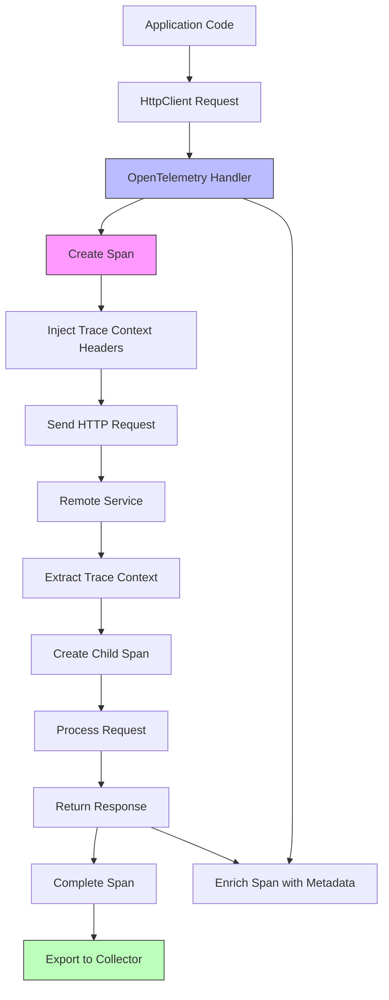

# How to Instrument HttpClient Calls with OpenTelemetry in .NET

Author: [nawazdhandala](https://www.github.com/nawazdhandala)

Tags: OpenTelemetry, .NET, HttpClient, HTTP, Tracing, C#

Description: Master HttpClient instrumentation in .NET with OpenTelemetry for distributed tracing, including correlation, retry logic, and external API monitoring.

HttpClient is the standard way to make HTTP requests in .NET applications, and proper instrumentation is critical for understanding external dependencies. When your application calls third-party APIs, microservices, or any HTTP endpoint, you need visibility into request duration, failures, retry attempts, and correlation across service boundaries. OpenTelemetry's HttpClient instrumentation provides automatic tracing with rich context propagation that maintains trace continuity across distributed systems.

## Understanding HttpClient and Distributed Tracing

HttpClient requests represent boundaries between services in a distributed system. Each outgoing HTTP request is a potential point of failure and a source of latency. Without proper instrumentation, these external calls become black boxes where you can't determine if slow response times are caused by network issues, the remote service, or how requests correlate to user actions.

OpenTelemetry's HttpClient instrumentation automatically creates spans for each HTTP request, propagates trace context through standard HTTP headers, and enriches spans with detailed request and response metadata. This enables end-to-end tracing across service boundaries.

## Request Flow with Instrumentation



## Setting Up Basic HttpClient Instrumentation

Start by installing the required packages for HttpClient instrumentation.

```bash
# Core OpenTelemetry packages
dotnet add package OpenTelemetry
dotnet add package OpenTelemetry.Extensions.Hosting

# HttpClient instrumentation
dotnet add package OpenTelemetry.Instrumentation.Http

# Exporters
dotnet add package OpenTelemetry.Exporter.OpenTelemetryProtocol
dotnet add package OpenTelemetry.Exporter.Console
```

Configure OpenTelemetry in Program.cs with HttpClient instrumentation:

```csharp
using OpenTelemetry;
using OpenTelemetry.Resources;
using OpenTelemetry.Trace;

var builder = WebApplication.CreateBuilder(args);

// Register HttpClient for dependency injection
builder.Services.AddHttpClient();

// Configure OpenTelemetry
builder.Services.AddOpenTelemetry()
    .ConfigureResource(resource => resource
        .AddService(
            serviceName: "http-client-demo",
            serviceVersion: "1.0.0")
        .AddAttributes(new Dictionary<string, object>
        {
            ["deployment.environment"] = builder.Environment.EnvironmentName
        }))
    .WithTracing(tracing => tracing
        // Add HttpClient instrumentation
        .AddHttpClientInstrumentation(options =>
        {
            // Enrich spans with request data
            options.EnrichWithHttpRequestMessage = (activity, request) =>
            {
                activity.SetTag("http.request.method", request.Method.ToString());
                activity.SetTag("http.request.url", request.RequestUri?.ToString());
                activity.SetTag("http.request.content_length",
                    request.Content?.Headers.ContentLength);
            };

            // Enrich spans with response data
            options.EnrichWithHttpResponseMessage = (activity, response) =>
            {
                activity.SetTag("http.response.status_code", (int)response.StatusCode);
                activity.SetTag("http.response.content_length",
                    response.Content.Headers.ContentLength);
            };

            // Record exceptions
            options.RecordException = true;
        })
        .AddAspNetCoreInstrumentation()
        .AddConsoleExporter()
        .AddOtlpExporter(options =>
        {
            options.Endpoint = new Uri("http://localhost:4317");
        }));

var app = builder.Build();

app.MapGet("/", () => "HttpClient Instrumentation Demo");

app.Run();
```

## Creating an Instrumented HTTP Service

Build a service class that uses HttpClient with proper instrumentation practices.

```csharp
using System.Diagnostics;
using System.Text.Json;

namespace HttpClientDemo.Services;

public interface IExternalApiService
{
    Task<WeatherData?> GetWeatherAsync(string city);
    Task<UserProfile?> GetUserProfileAsync(int userId);
    Task<bool> PostDataAsync<T>(string endpoint, T data);
}

public class ExternalApiService : IExternalApiService
{
    private readonly HttpClient _httpClient;
    private readonly ILogger<ExternalApiService> _logger;
    private static readonly ActivitySource ActivitySource = new(
        "HttpClientDemo.ExternalApi",
        "1.0.0");

    public ExternalApiService(
        HttpClient httpClient,
        ILogger<ExternalApiService> logger)
    {
        _httpClient = httpClient;
        _httpClient.BaseAddress = new Uri("https://api.example.com");
        _httpClient.Timeout = TimeSpan.FromSeconds(30);
        _logger = logger;
    }

    public async Task<WeatherData?> GetWeatherAsync(string city)
    {
        // Create a custom span to wrap the HTTP call with business context
        using var activity = ActivitySource.StartActivity(
            "GetWeather",
            ActivityKind.Client);

        activity?.SetTag("weather.city", city);
        activity?.SetTag("api.operation", "get_weather");

        try
        {
            _logger.LogInformation("Fetching weather data for {City}", city);

            // HttpClient call is automatically instrumented
            var response = await _httpClient.GetAsync($"/weather?city={city}");

            activity?.SetTag("http.response.status", (int)response.StatusCode);

            if (!response.IsSuccessStatusCode)
            {
                _logger.LogWarning(
                    "Weather API returned {StatusCode} for city {City}",
                    response.StatusCode,
                    city);

                activity?.SetStatus(ActivityStatusCode.Error,
                    $"HTTP {response.StatusCode}");

                return null;
            }

            var content = await response.Content.ReadAsStringAsync();
            var weatherData = JsonSerializer.Deserialize<WeatherData>(content);

            activity?.SetTag("weather.temperature",
                weatherData?.Temperature);

            return weatherData;
        }
        catch (HttpRequestException ex)
        {
            _logger.LogError(ex, "HTTP request failed for city {City}", city);
            activity?.SetStatus(ActivityStatusCode.Error, ex.Message);
            activity?.RecordException(ex);
            throw;
        }
        catch (TaskCanceledException ex)
        {
            _logger.LogError(ex, "Request timeout for city {City}", city);
            activity?.SetStatus(ActivityStatusCode.Error, "Request timeout");
            activity?.RecordException(ex);
            throw;
        }
    }

    public async Task<UserProfile?> GetUserProfileAsync(int userId)
    {
        using var activity = ActivitySource.StartActivity(
            "GetUserProfile",
            ActivityKind.Client);

        activity?.SetTag("user.id", userId);
        activity?.SetTag("api.operation", "get_user_profile");

        try
        {
            _logger.LogInformation("Fetching user profile for {UserId}", userId);

            var response = await _httpClient.GetAsync($"/users/{userId}");

            if (response.StatusCode == System.Net.HttpStatusCode.NotFound)
            {
                _logger.LogWarning("User {UserId} not found", userId);
                activity?.SetTag("user.found", false);
                return null;
            }

            response.EnsureSuccessStatusCode();

            var profile = await response.Content.ReadFromJsonAsync<UserProfile>();
            activity?.SetTag("user.found", true);
            activity?.SetTag("user.name", profile?.Name);

            return profile;
        }
        catch (Exception ex)
        {
            _logger.LogError(ex, "Failed to fetch user profile {UserId}", userId);
            activity?.SetStatus(ActivityStatusCode.Error, ex.Message);
            activity?.RecordException(ex);
            throw;
        }
    }

    public async Task<bool> PostDataAsync<T>(string endpoint, T data)
    {
        using var activity = ActivitySource.StartActivity(
            "PostData",
            ActivityKind.Client);

        activity?.SetTag("http.endpoint", endpoint);
        activity?.SetTag("data.type", typeof(T).Name);

        try
        {
            var response = await _httpClient.PostAsJsonAsync(endpoint, data);

            activity?.SetTag("http.response.status", (int)response.StatusCode);

            if (response.IsSuccessStatusCode)
            {
                _logger.LogInformation("Successfully posted data to {Endpoint}", endpoint);
                return true;
            }

            _logger.LogWarning(
                "Failed to post data to {Endpoint}. Status: {StatusCode}",
                endpoint,
                response.StatusCode);

            return false;
        }
        catch (Exception ex)
        {
            _logger.LogError(ex, "Error posting data to {Endpoint}", endpoint);
            activity?.SetStatus(ActivityStatusCode.Error, ex.Message);
            activity?.RecordException(ex);
            return false;
        }
    }
}

public record WeatherData(string City, double Temperature, string Condition);
public record UserProfile(int Id, string Name, string Email);
```

Register the service with a configured HttpClient:

```csharp
builder.Services.AddHttpClient<IExternalApiService, ExternalApiService>(client =>
{
    client.BaseAddress = new Uri("https://api.example.com");
    client.Timeout = TimeSpan.FromSeconds(30);
    client.DefaultRequestHeaders.Add("User-Agent", "HttpClientDemo/1.0");
});
```

## Advanced Enrichment and Filtering

Customize instrumentation behavior with advanced options for filtering and enrichment.

```csharp
.AddHttpClientInstrumentation(options =>
{
    // Filter requests to exclude certain endpoints
    options.FilterHttpRequestMessage = (request) =>
    {
        // Don't trace health checks or metrics endpoints
        if (request.RequestUri?.AbsolutePath.Contains("/health") == true ||
            request.RequestUri?.AbsolutePath.Contains("/metrics") == true)
        {
            return false;
        }

        // Don't trace internal localhost calls in development
        if (request.RequestUri?.Host == "localhost" &&
            Environment.GetEnvironmentVariable("ASPNETCORE_ENVIRONMENT") == "Development")
        {
            return false;
        }

        return true;
    };

    // Enrich with custom request data
    options.EnrichWithHttpRequestMessage = (activity, request) =>
    {
        // Add custom headers as tags
        if (request.Headers.TryGetValues("X-Correlation-ID", out var correlationIds))
        {
            activity.SetTag("correlation.id", correlationIds.FirstOrDefault());
        }

        // Add query parameters (be careful with sensitive data)
        if (request.RequestUri?.Query != null)
        {
            var queryParams = System.Web.HttpUtility.ParseQueryString(
                request.RequestUri.Query);

            // Only add non-sensitive query parameters
            var safeTags = new[] { "page", "limit", "sort", "filter" };
            foreach (var key in queryParams.AllKeys.Where(k => safeTags.Contains(k)))
            {
                activity.SetTag($"http.query.{key}", queryParams[key]);
            }
        }

        // Add request body size
        if (request.Content != null)
        {
            activity.SetTag("http.request.body.size",
                request.Content.Headers.ContentLength ?? 0);

            activity.SetTag("http.request.content_type",
                request.Content.Headers.ContentType?.ToString());
        }

        // Add HTTP version
        activity.SetTag("http.version", request.Version.ToString());
    };

    // Enrich with response data
    options.EnrichWithHttpResponseMessage = (activity, response) =>
    {
        // Add response headers
        if (response.Headers.TryGetValues("X-RateLimit-Remaining", out var rateLimit))
        {
            activity.SetTag("ratelimit.remaining", rateLimit.FirstOrDefault());
        }

        // Add content type
        activity.SetTag("http.response.content_type",
            response.Content.Headers.ContentType?.ToString());

        // Add cache status
        if (response.Headers.TryGetValues("X-Cache", out var cacheStatus))
        {
            activity.SetTag("cache.status", cacheStatus.FirstOrDefault());
        }

        // Mark non-success responses appropriately
        if (!response.IsSuccessStatusCode)
        {
            activity.SetStatus(
                ActivityStatusCode.Error,
                $"HTTP {(int)response.StatusCode}");
        }
    };

    // Enrich when exceptions occur
    options.EnrichWithException = (activity, exception) =>
    {
        activity.SetTag("exception.escaped", true);

        if (exception is HttpRequestException httpEx)
        {
            activity.SetTag("exception.http.message", httpEx.Message);
        }
        else if (exception is TaskCanceledException)
        {
            activity.SetTag("exception.type", "timeout");
            activity.SetTag("timeout", true);
        }
    };

    // Record all exceptions
    options.RecordException = true;
})
```

## Implementing Retry Logic with Instrumentation

Use Polly for retry logic and ensure each retry attempt is properly traced.

```bash
dotnet add package Microsoft.Extensions.Http.Polly
```

Configure resilient HttpClient with retry policies:

```csharp
using Polly;
using Polly.Extensions.Http;

// Define retry policy
IAsyncPolicy<HttpResponseMessage> GetRetryPolicy()
{
    return HttpPolicyExtensions
        .HandleTransientHttpError()
        .OrResult(msg => msg.StatusCode == System.Net.HttpStatusCode.TooManyRequests)
        .WaitAndRetryAsync(
            retryCount: 3,
            sleepDurationProvider: retryAttempt =>
                TimeSpan.FromSeconds(Math.Pow(2, retryAttempt)),
            onRetry: (outcome, timespan, retryCount, context) =>
            {
                // Add retry information to current activity
                var activity = Activity.Current;
                if (activity != null)
                {
                    activity.AddEvent(new ActivityEvent(
                        "http.retry",
                        tags: new ActivityTagsCollection
                        {
                            ["retry.attempt"] = retryCount,
                            ["retry.delay_ms"] = timespan.TotalMilliseconds,
                            ["http.status_code"] = (int?)outcome.Result?.StatusCode
                        }));

                    activity.SetTag("http.retry.count", retryCount);
                }
            });
}

// Register HttpClient with retry policy
builder.Services.AddHttpClient<IExternalApiService, ExternalApiService>(client =>
{
    client.BaseAddress = new Uri("https://api.example.com");
    client.Timeout = TimeSpan.FromSeconds(30);
})
.AddPolicyHandler(GetRetryPolicy())
.AddPolicyHandler(Policy.TimeoutAsync<HttpResponseMessage>(TimeSpan.FromSeconds(10)));
```

## Named HttpClients with Different Configurations

Create multiple named HttpClients with different instrumentation behaviors.

```csharp
// Fast API - short timeout, no retries
builder.Services.AddHttpClient("FastApi", client =>
{
    client.BaseAddress = new Uri("https://fast-api.example.com");
    client.Timeout = TimeSpan.FromSeconds(5);
})
.ConfigurePrimaryHttpMessageHandler(() => new HttpClientHandler
{
    // Configure handler for this specific client
    AllowAutoRedirect = false
});

// Slow API - longer timeout, retry policy
builder.Services.AddHttpClient("SlowApi", client =>
{
    client.BaseAddress = new Uri("https://slow-api.example.com");
    client.Timeout = TimeSpan.FromSeconds(60);
})
.AddPolicyHandler(GetRetryPolicy());

// External API with authentication
builder.Services.AddHttpClient("AuthenticatedApi", client =>
{
    client.BaseAddress = new Uri("https://authenticated-api.example.com");
    client.DefaultRequestHeaders.Add("Authorization", "Bearer YOUR_TOKEN");
});
```

Use named clients in your services:

```csharp
public class MultiApiService
{
    private readonly IHttpClientFactory _httpClientFactory;
    private static readonly ActivitySource ActivitySource = new(
        "HttpClientDemo.MultiApi",
        "1.0.0");

    public MultiApiService(IHttpClientFactory httpClientFactory)
    {
        _httpClientFactory = httpClientFactory;
    }

    public async Task<string> GetDataFromFastApiAsync()
    {
        using var activity = ActivitySource.StartActivity(
            "GetFastApiData",
            ActivityKind.Client);

        activity?.SetTag("api.type", "fast");

        var client = _httpClientFactory.CreateClient("FastApi");
        var response = await client.GetAsync("/data");
        return await response.Content.ReadAsStringAsync();
    }

    public async Task<string> GetDataFromSlowApiAsync()
    {
        using var activity = ActivitySource.StartActivity(
            "GetSlowApiData",
            ActivityKind.Client);

        activity?.SetTag("api.type", "slow");

        var client = _httpClientFactory.CreateClient("SlowApi");
        var response = await client.GetAsync("/data");
        return await response.Content.ReadAsStringAsync();
    }
}
```

## Propagating Custom Headers

Ensure custom headers are propagated along with trace context.

```csharp
public class HeaderPropagationHandler : DelegatingHandler
{
    private static readonly ActivitySource ActivitySource = new(
        "HttpClientDemo.HeaderPropagation",
        "1.0.0");

    protected override async Task<HttpResponseMessage> SendAsync(
        HttpRequestMessage request,
        CancellationToken cancellationToken)
    {
        var activity = Activity.Current;

        // Add custom correlation headers
        if (activity != null)
        {
            // Propagate trace ID as custom header for legacy systems
            request.Headers.Add("X-Trace-ID", activity.TraceId.ToString());
            request.Headers.Add("X-Span-ID", activity.SpanId.ToString());

            // Add business context
            if (activity.GetTagItem("user.id") is string userId)
            {
                request.Headers.Add("X-User-ID", userId);
            }

            // Add timestamp
            request.Headers.Add("X-Request-Time",
                DateTimeOffset.UtcNow.ToUnixTimeMilliseconds().ToString());
        }

        return await base.SendAsync(request, cancellationToken);
    }
}
```

Register the custom handler:

```csharp
builder.Services.AddTransient<HeaderPropagationHandler>();

builder.Services.AddHttpClient<IExternalApiService, ExternalApiService>()
    .AddHttpMessageHandler<HeaderPropagationHandler>();
```

## Monitoring HttpClient Performance

Track HttpClient metrics alongside traces for comprehensive monitoring.

```csharp
using System.Diagnostics.Metrics;

public class HttpClientMetricsService
{
    private static readonly Meter Meter = new(
        "HttpClientDemo.Metrics",
        "1.0.0");

    private readonly Counter<long> _requestCounter;
    private readonly Histogram<double> _requestDuration;
    private readonly Counter<long> _errorCounter;

    public HttpClientMetricsService()
    {
        _requestCounter = Meter.CreateCounter<long>(
            "http.client.requests",
            description: "Total number of HTTP client requests");

        _requestDuration = Meter.CreateHistogram<double>(
            "http.client.duration",
            unit: "ms",
            description: "Duration of HTTP client requests");

        _errorCounter = Meter.CreateCounter<long>(
            "http.client.errors",
            description: "Total number of HTTP client errors");
    }

    public void RecordRequest(string method, string host, int statusCode, double durationMs)
    {
        var tags = new KeyValuePair<string, object?>[]
        {
            new("http.method", method),
            new("http.host", host),
            new("http.status_code", statusCode)
        };

        _requestCounter.Add(1, tags);
        _requestDuration.Record(durationMs, tags);

        if (statusCode >= 400)
        {
            _errorCounter.Add(1, tags);
        }
    }
}
```

## Testing Instrumented HttpClient

Create tests to verify instrumentation is working correctly.

```csharp
using System.Diagnostics;
using OpenTelemetry;
using OpenTelemetry.Trace;
using Xunit;

public class HttpClientInstrumentationTests
{
    [Fact]
    public async Task HttpClient_Request_CreatesSpan()
    {
        // Arrange
        var exportedItems = new List<Activity>();

        using var tracerProvider = Sdk.CreateTracerProviderBuilder()
            .AddHttpClientInstrumentation()
            .AddInMemoryExporter(exportedItems)
            .Build();

        var httpClient = new HttpClient();

        // Act
        try
        {
            await httpClient.GetAsync("https://httpbin.org/get");
        }
        catch
        {
            // Ignore errors, we're testing instrumentation
        }

        // Force flush
        tracerProvider?.ForceFlush();

        // Assert
        Assert.NotEmpty(exportedItems);

        var httpSpan = exportedItems.FirstOrDefault(a =>
            a.DisplayName.Contains("GET"));

        Assert.NotNull(httpSpan);
        Assert.Equal(ActivityKind.Client, httpSpan.Kind);
        Assert.Contains("http", httpSpan.Tags.Select(t => t.Key));
    }
}
```

## Best Practices

Always use IHttpClientFactory instead of creating HttpClient instances directly. This ensures proper handler lifecycle management and enables instrumentation to work correctly.

Set reasonable timeouts for all HttpClient instances. Without timeouts, hung requests can accumulate and exhaust resources while creating orphaned spans in your tracing system.

Use named or typed clients to organize different API endpoints with appropriate configurations. Each client can have different retry policies, timeouts, and authentication mechanisms while maintaining consistent instrumentation.

Filter out high-volume, low-value endpoints like health checks and metrics from instrumentation to reduce telemetry overhead and costs.

Be cautious about adding sensitive data to spans. Request bodies, authentication tokens, and personal information should never be included in telemetry tags.

HttpClient instrumentation with OpenTelemetry provides comprehensive visibility into external dependencies without requiring changes to individual HTTP calls. By combining automatic instrumentation with custom spans for business context and proper configuration of retry policies and filters, you create a robust observability foundation for understanding how your application interacts with external services.
