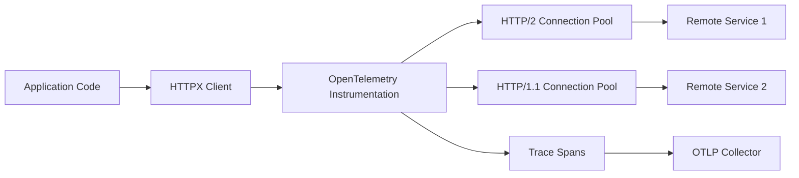

# How to Instrument HTTPX Async Client with OpenTelemetry in Python

Author: [nawazdhandala](https://www.github.com/nawazdhandala)

Tags: OpenTelemetry, HTTPX, Python, Async, HTTP Client, Tracing

Description: Learn how to instrument HTTPX async HTTP client with OpenTelemetry for distributed tracing in modern Python async applications.

HTTPX is a next-generation HTTP client for Python that provides both sync and async APIs, full HTTP/2 support, and a clean, intuitive interface. As applications increasingly adopt async/await patterns for improved concurrency, HTTPX has become the go-to choice for async HTTP operations.

When building async microservices with HTTPX, distributed tracing becomes essential for understanding request flows, debugging issues across service boundaries, and identifying performance bottlenecks. OpenTelemetry provides automatic instrumentation for HTTPX that captures all HTTP operations with comprehensive span data.

## Why HTTPX for Async Applications

HTTPX offers several advantages over traditional HTTP clients like requests:

- Full async/await support with asyncio
- HTTP/2 and HTTP/1.1 protocol support
- Connection pooling and multiplexing
- Streaming request and response bodies
- Modern, type-annotated API
- Built-in timeout and retry configuration



## Installation

Install HTTPX along with OpenTelemetry instrumentation packages.

```bash
pip install httpx \
            opentelemetry-api \
            opentelemetry-sdk \
            opentelemetry-instrumentation-httpx \
            opentelemetry-exporter-otlp
```

## Basic Async HTTPX Instrumentation

Here's how to instrument an async HTTPX client for automatic tracing.

```python
import asyncio
import httpx
from opentelemetry import trace
from opentelemetry.sdk.trace import TracerProvider
from opentelemetry.sdk.trace.export import BatchSpanProcessor, ConsoleSpanExporter
from opentelemetry.sdk.resources import Resource
from opentelemetry.instrumentation.httpx import HTTPXClientInstrumentor

# Configure OpenTelemetry with service metadata
resource = Resource.create({
    "service.name": "httpx-async-client",
    "service.version": "1.0.0",
    "deployment.environment": "production"
})

# Set up tracer provider with console exporter
provider = TracerProvider(resource=resource)
processor = BatchSpanProcessor(ConsoleSpanExporter())
provider.add_span_processor(processor)
trace.set_tracer_provider(provider)

# Enable automatic instrumentation for HTTPX
# This instruments both sync and async clients
HTTPXClientInstrumentor().instrument()

async def make_async_request():
    """
    Simple async HTTP request with automatic tracing.
    The instrumentation automatically creates spans for each request.
    """
    # Create async client
    async with httpx.AsyncClient() as client:
        # GET request - automatically traced
        response = await client.get('https://api.github.com/users/octocat')
        print(f"Status: {response.status_code}")
        print(f"User: {response.json()['name']}")

        return response.json()

# Run async function
if __name__ == "__main__":
    asyncio.run(make_async_request())
```

## Complete Async Application with OTLP Export

Here's a production-ready example with OTLP exporter and custom spans.

```python
import asyncio
import httpx
from opentelemetry import trace
from opentelemetry.sdk.trace import TracerProvider
from opentelemetry.sdk.trace.export import BatchSpanProcessor
from opentelemetry.exporter.otlp.proto.grpc.trace_exporter import OTLPSpanExporter
from opentelemetry.sdk.resources import Resource
from opentelemetry.instrumentation.httpx import HTTPXClientInstrumentor

# Configure OpenTelemetry with comprehensive metadata
resource = Resource.create({
    "service.name": "async-api-gateway",
    "service.version": "2.0.0",
    "deployment.environment": "staging",
    "service.instance.id": "gateway-001"
})

# Initialize tracer provider with OTLP exporter
provider = TracerProvider(resource=resource)
otlp_exporter = OTLPSpanExporter(
    endpoint="http://localhost:4317",
    insecure=True
)
processor = BatchSpanProcessor(otlp_exporter)
provider.add_span_processor(processor)
trace.set_tracer_provider(provider)

# Instrument HTTPX before making any requests
HTTPXClientInstrumentor().instrument()

# Get tracer for creating custom spans
tracer = trace.get_tracer(__name__)

async def fetch_user_data(user_id: int) -> dict:
    """
    Fetch user data from external API with custom span tracking.
    Combines automatic and manual instrumentation.
    """
    with tracer.start_as_current_span("fetch-user-data") as span:
        span.set_attribute("user.id", user_id)
        span.set_attribute("operation.type", "user_fetch")

        try:
            # HTTPX request is automatically traced
            async with httpx.AsyncClient() as client:
                response = await client.get(
                    f'https://jsonplaceholder.typicode.com/users/{user_id}',
                    timeout=5.0
                )
                response.raise_for_status()

                # Add response attributes to custom span
                user_data = response.json()
                span.set_attribute("user.name", user_data.get("name", "unknown"))
                span.set_attribute("user.email", user_data.get("email", "unknown"))
                span.set_attribute("response.success", True)

                return user_data

        except httpx.HTTPStatusError as e:
            # Record HTTP errors
            span.record_exception(e)
            span.set_attribute("error.type", "http_status_error")
            span.set_attribute("error.status_code", e.response.status_code)
            span.set_status(trace.Status(trace.StatusCode.ERROR, str(e)))
            raise

        except httpx.TimeoutException as e:
            # Record timeout errors
            span.record_exception(e)
            span.set_attribute("error.type", "timeout")
            span.set_status(trace.Status(trace.StatusCode.ERROR, "Request timeout"))
            raise

        except Exception as e:
            # Record unexpected errors
            span.record_exception(e)
            span.set_attribute("error.type", "unknown")
            span.set_status(trace.Status(trace.StatusCode.ERROR, str(e)))
            raise

async def fetch_multiple_users(user_ids: list[int]) -> list[dict]:
    """
    Fetch multiple users concurrently with parallel tracing.
    Each concurrent request creates its own span under the parent.
    """
    with tracer.start_as_current_span("fetch-multiple-users") as span:
        span.set_attribute("user.count", len(user_ids))
        span.set_attribute("operation.type", "batch_fetch")

        # Create tasks for concurrent execution
        tasks = [fetch_user_data(user_id) for user_id in user_ids]

        # Execute all requests concurrently
        # Each request gets its own traced span
        results = await asyncio.gather(*tasks, return_exceptions=True)

        # Count successful vs failed requests
        successful = sum(1 for r in results if not isinstance(r, Exception))
        span.set_attribute("batch.successful", successful)
        span.set_attribute("batch.failed", len(results) - successful)

        # Filter out exceptions and return only successful results
        users = [r for r in results if not isinstance(r, Exception)]

        return users

async def post_data_with_retry(url: str, data: dict, max_retries: int = 3) -> dict:
    """
    POST request with retry logic and comprehensive tracing.
    Each retry attempt creates a separate span.
    """
    with tracer.start_as_current_span("post-with-retry") as span:
        span.set_attribute("http.url", url)
        span.set_attribute("retry.max_attempts", max_retries)

        async with httpx.AsyncClient() as client:
            for attempt in range(1, max_retries + 1):
                with tracer.start_as_current_span(f"attempt-{attempt}") as attempt_span:
                    attempt_span.set_attribute("retry.attempt", attempt)

                    try:
                        response = await client.post(
                            url,
                            json=data,
                            timeout=10.0
                        )
                        response.raise_for_status()

                        attempt_span.set_attribute("retry.success", True)
                        span.set_attribute("retry.successful_attempt", attempt)

                        return response.json()

                    except (httpx.HTTPStatusError, httpx.TimeoutException) as e:
                        attempt_span.record_exception(e)
                        attempt_span.set_attribute("retry.success", False)
                        attempt_span.set_attribute("error.type", type(e).__name__)

                        if attempt == max_retries:
                            span.set_status(
                                trace.Status(
                                    trace.StatusCode.ERROR,
                                    f"Failed after {max_retries} attempts"
                                )
                            )
                            raise

                        # Exponential backoff
                        wait_time = 2 ** (attempt - 1)
                        attempt_span.set_attribute("retry.backoff_seconds", wait_time)
                        await asyncio.sleep(wait_time)

async def stream_large_file(url: str) -> int:
    """
    Stream large file download with progress tracking.
    Demonstrates streaming with HTTPX and tracing.
    """
    with tracer.start_as_current_span("stream-download") as span:
        span.set_attribute("download.url", url)

        async with httpx.AsyncClient() as client:
            total_bytes = 0

            # Stream the response
            async with client.stream('GET', url) as response:
                response.raise_for_status()

                # Add response metadata
                content_length = response.headers.get('Content-Length')
                if content_length:
                    span.set_attribute("download.total_size_bytes", int(content_length))

                # Stream chunks
                async for chunk in response.aiter_bytes(chunk_size=8192):
                    total_bytes += len(chunk)
                    # Process chunk here

            span.set_attribute("download.bytes_received", total_bytes)
            span.set_attribute("download.success", True)

            return total_bytes

async def main():
    """Main application entry point demonstrating various patterns"""

    # Single user fetch
    user = await fetch_user_data(1)
    print(f"Fetched user: {user['name']}")

    # Concurrent batch fetch
    users = await fetch_multiple_users([1, 2, 3, 4, 5])
    print(f"Fetched {len(users)} users concurrently")

    # POST with retry
    new_post = {
        "title": "Test Post",
        "body": "This is a test post",
        "userId": 1
    }
    result = await post_data_with_retry(
        'https://jsonplaceholder.typicode.com/posts',
        new_post
    )
    print(f"Created post with ID: {result['id']}")

if __name__ == "__main__":
    asyncio.run(main())
```

## Custom Request and Response Hooks

Add custom attributes to spans based on request and response data.

```python
from opentelemetry.instrumentation.httpx import HTTPXClientInstrumentor
from httpx import Request, Response

async def async_request_hook(span, request: Request):
    """
    Hook called before async request is sent.
    Add custom attributes based on request parameters.
    """
    # Add request details
    span.set_attribute("http.method", request.method)
    span.set_attribute("http.url", str(request.url))

    # Extract URL components
    span.set_attribute("http.scheme", request.url.scheme)
    span.set_attribute("http.host", request.url.host)
    span.set_attribute("http.path", request.url.path)

    # Add custom headers (avoid sensitive data)
    if "X-Request-ID" in request.headers:
        span.set_attribute("request.id", request.headers["X-Request-ID"])

    if "X-Correlation-ID" in request.headers:
        span.set_attribute("correlation.id", request.headers["X-Correlation-ID"])

    # Tag API versions
    if "/v1/" in str(request.url):
        span.set_attribute("api.version", "v1")
    elif "/v2/" in str(request.url):
        span.set_attribute("api.version", "v2")

    # Add request body size for POST/PUT
    if request.method in ["POST", "PUT", "PATCH"]:
        if request.content:
            span.set_attribute("http.request_content_length", len(request.content))

async def async_response_hook(span, request: Request, response: Response):
    """
    Hook called after async response is received.
    Add attributes based on response data.
    """
    # Add response status
    span.set_attribute("http.status_code", response.status_code)

    # Add response headers
    span.set_attribute("http.response_content_type",
                      response.headers.get("Content-Type", "unknown"))

    if "Content-Length" in response.headers:
        span.set_attribute("http.response_content_length",
                          int(response.headers["Content-Length"]))

    # Track caching
    if "X-Cache" in response.headers:
        span.set_attribute("cache.status", response.headers["X-Cache"])

    # Tag successful vs error responses
    if response.is_success:
        span.set_attribute("response.success", True)
    elif response.is_error:
        span.set_attribute("response.success", False)
        span.set_attribute("error.category",
                          "client_error" if response.is_client_error else "server_error")

    # Add custom timing headers if present
    if "X-Response-Time" in response.headers:
        span.set_attribute("server.response_time_ms",
                          response.headers["X-Response-Time"])

# Instrument with async hooks
HTTPXClientInstrumentor().instrument(
    request_hook=async_request_hook,
    response_hook=async_response_hook
)
```

## Using HTTP/2 with Tracing

HTTPX supports HTTP/2, which allows request multiplexing over a single connection.

```python
import asyncio
import httpx
from opentelemetry import trace

# Instrumentation already enabled
tracer = trace.get_tracer(__name__)

async def http2_concurrent_requests():
    """
    Demonstrate HTTP/2 multiplexing with tracing.
    Multiple requests share the same connection.
    """
    with tracer.start_as_current_span("http2-multiplexing") as span:
        span.set_attribute("http.version", "2.0")
        span.set_attribute("request.count", 5)

        # Create client with HTTP/2 support
        async with httpx.AsyncClient(http2=True) as client:
            # Multiple concurrent requests over same connection
            urls = [
                'https://http2.github.io/',
                'https://http2.github.io/faq/',
                'https://http2.github.io/implementations/',
                'https://http2.github.io/specs/',
                'https://http2.github.io/tools/'
            ]

            # All requests are traced individually
            tasks = [client.get(url) for url in urls]
            responses = await asyncio.gather(*tasks)

            # Process responses
            for idx, response in enumerate(responses):
                print(f"Response {idx + 1}: {response.status_code} "
                      f"(HTTP/{response.http_version})")

            span.set_attribute("responses.successful",
                             sum(1 for r in responses if r.is_success))

async def main():
    await http2_concurrent_requests()

if __name__ == "__main__":
    asyncio.run(main())
```

## Connection Pooling and Limits

Configure connection pooling for optimal performance while maintaining traceability.

```python
import asyncio
import httpx
from opentelemetry import trace

tracer = trace.get_tracer(__name__)

async def configure_connection_limits():
    """
    Configure connection pooling with limits.
    All pooled connections are traced automatically.
    """
    with tracer.start_as_current_span("pooled-requests") as span:

        # Configure connection limits
        limits = httpx.Limits(
            max_keepalive_connections=10,  # Keep 10 connections alive
            max_connections=20,             # Maximum 20 total connections
            keepalive_expiry=30.0          # Keep connections alive for 30s
        )

        # Create client with custom limits
        async with httpx.AsyncClient(limits=limits, http2=True) as client:
            span.set_attribute("pool.max_connections", 20)
            span.set_attribute("pool.max_keepalive", 10)

            # Make multiple requests that will reuse connections
            tasks = []
            for i in range(50):
                task = client.get(f'https://httpbin.org/delay/0.1')
                tasks.append(task)

            responses = await asyncio.gather(*tasks)

            span.set_attribute("requests.total", len(responses))
            span.set_attribute("requests.successful",
                             sum(1 for r in responses if r.is_success))

async def main():
    await configure_connection_limits()

if __name__ == "__main__":
    asyncio.run(main())
```

## Advanced Timeout Configuration

Configure granular timeouts for different phases of the request lifecycle.

```python
import asyncio
import httpx
from opentelemetry import trace

tracer = trace.get_tracer(__name__)

async def timeout_configuration():
    """
    Demonstrate different timeout configurations with tracing.
    Timeouts are reflected in span attributes and error tracking.
    """
    with tracer.start_as_current_span("timeout-demo") as span:

        # Configure granular timeouts
        timeout = httpx.Timeout(
            connect=5.0,    # 5 seconds to establish connection
            read=10.0,      # 10 seconds to read response
            write=5.0,      # 5 seconds to send request
            pool=5.0        # 5 seconds to acquire connection from pool
        )

        span.set_attribute("timeout.connect_seconds", 5.0)
        span.set_attribute("timeout.read_seconds", 10.0)

        async with httpx.AsyncClient(timeout=timeout) as client:
            try:
                # This endpoint delays for 2 seconds
                response = await client.get('https://httpbin.org/delay/2')
                span.set_attribute("request.completed", True)
                print(f"Response: {response.status_code}")

            except httpx.TimeoutException as e:
                span.record_exception(e)
                span.set_attribute("request.timeout", True)
                span.set_attribute("error.type", "timeout")
                print(f"Request timed out: {e}")

async def main():
    await timeout_configuration()

if __name__ == "__main__":
    asyncio.run(main())
```

## Async Context Manager Pattern

Use async context managers for proper resource management with tracing.

```python
import asyncio
import httpx
from typing import AsyncIterator
from contextlib import asynccontextmanager
from opentelemetry import trace

tracer = trace.get_tracer(__name__)

@asynccontextmanager
async def traced_http_client() -> AsyncIterator[httpx.AsyncClient]:
    """
    Async context manager for HTTP client with tracing.
    Ensures proper cleanup and span lifecycle.
    """
    with tracer.start_as_current_span("http-client-lifecycle") as span:
        span.set_attribute("client.type", "httpx_async")

        # Create client
        client = httpx.AsyncClient(
            timeout=10.0,
            limits=httpx.Limits(max_connections=50),
            http2=True
        )

        try:
            span.set_attribute("client.initialized", True)
            yield client

        finally:
            # Ensure cleanup
            await client.aclose()
            span.set_attribute("client.closed", True)

async def use_traced_client():
    """Use the traced client context manager"""
    async with traced_http_client() as client:
        response = await client.get('https://httpbin.org/json')
        return response.json()

async def main():
    data = await use_traced_client()
    print(f"Retrieved data: {data}")

if __name__ == "__main__":
    asyncio.run(main())
```

## Error Handling Patterns

Implement comprehensive error handling with proper span recording.

```python
import asyncio
import httpx
from opentelemetry import trace

tracer = trace.get_tracer(__name__)

async def handle_all_error_types(url: str):
    """
    Demonstrate handling different error types with proper tracing.
    Each error type is recorded with appropriate span attributes.
    """
    with tracer.start_as_current_span("error-handling") as span:
        span.set_attribute("request.url", url)

        async with httpx.AsyncClient() as client:
            try:
                response = await client.get(url, timeout=5.0)
                response.raise_for_status()

                span.set_attribute("request.success", True)
                return response.json()

            except httpx.HTTPStatusError as e:
                # HTTP error response (4xx, 5xx)
                span.record_exception(e)
                span.set_attribute("error.type", "http_status_error")
                span.set_attribute("error.status_code", e.response.status_code)
                span.set_attribute("error.response_body", e.response.text[:200])
                span.set_status(trace.Status(trace.StatusCode.ERROR, str(e)))
                print(f"HTTP Error: {e.response.status_code}")

            except httpx.TimeoutException as e:
                # Request timeout
                span.record_exception(e)
                span.set_attribute("error.type", "timeout")
                span.set_status(trace.Status(trace.StatusCode.ERROR, "Timeout"))
                print(f"Timeout error: {e}")

            except httpx.ConnectError as e:
                # Connection error
                span.record_exception(e)
                span.set_attribute("error.type", "connection_error")
                span.set_status(trace.Status(trace.StatusCode.ERROR, "Connection failed"))
                print(f"Connection error: {e}")

            except httpx.RequestError as e:
                # General request error
                span.record_exception(e)
                span.set_attribute("error.type", "request_error")
                span.set_status(trace.Status(trace.StatusCode.ERROR, str(e)))
                print(f"Request error: {e}")

async def main():
    # Test with various URLs
    await handle_all_error_types('https://httpbin.org/status/200')  # Success
    await handle_all_error_types('https://httpbin.org/status/404')  # Not found
    await handle_all_error_types('https://httpbin.org/delay/10')    # Timeout

if __name__ == "__main__":
    asyncio.run(main())
```

## Best Practices

When instrumenting HTTPX async clients with OpenTelemetry:

1. **Instrument at startup** - Call `HTTPXClientInstrumentor().instrument()` before creating any clients
2. **Use async context managers** - Always use `async with` for proper resource cleanup
3. **Configure connection limits** - Set appropriate limits for your workload to prevent resource exhaustion
4. **Enable HTTP/2** - Use `http2=True` for better performance with multiplexing
5. **Set appropriate timeouts** - Configure granular timeouts to prevent hanging requests
6. **Handle all error types** - Catch and record specific HTTPX exceptions in spans
7. **Use custom spans** for business logic that wraps HTTP calls
8. **Add meaningful attributes** - Include business context in spans for better debugging
9. **Monitor concurrent requests** - Track batch operations with parent spans and attributes
10. **Clean up resources** - Always close clients properly to avoid connection leaks

HTTPX combined with OpenTelemetry instrumentation provides a powerful foundation for building observable async Python applications with comprehensive distributed tracing.
