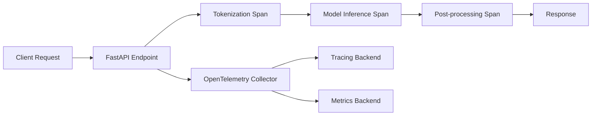

# How to Instrument Hugging Face Transformers with OpenTelemetry

Author: [nawazdhandala](https://www.github.com/nawazdhandala)

Tags: OpenTelemetry, Hugging Face, Transformers, Machine Learning, Python, Observability

Description: Learn how to add OpenTelemetry instrumentation to Hugging Face Transformers pipelines for tracing inference, tokenization, and model loading in production ML systems.

---

Hugging Face Transformers is one of the most popular libraries for working with pre-trained machine learning models. Whether you're running text classification, named entity recognition, or text generation, these models are increasingly showing up in production systems. But once they're in production, you need visibility into what's happening. How long does tokenization take? Is the model loading every time a request comes in? Where are the bottlenecks in your inference pipeline?

That's where OpenTelemetry comes in. By instrumenting your Transformers code with OpenTelemetry traces and metrics, you get a clear picture of every step in the ML inference process. In this post, we'll walk through how to set that up from scratch.

## Why Instrument Hugging Face Transformers?

Running ML models in production is different from running them in a notebook. In production, you care about:

- **Latency**: How long does each inference call take, and where is time being spent?
- **Throughput**: How many requests per second can your model handle?
- **Resource usage**: Are you saturating your CPU or GPU during inference?
- **Error rates**: Are certain inputs causing failures in tokenization or model forward passes?

OpenTelemetry gives you a vendor-neutral way to capture all of this. You can export your telemetry data to any backend that supports the OpenTelemetry Protocol (OTLP), whether that's OneUptime, Jaeger, or something else entirely.

## Architecture Overview

Here's what the instrumented pipeline looks like at a high level:



Each major step in the Transformers pipeline gets its own span, nested under a parent span for the overall request. This lets you drill into exactly where time is being spent.

## Setting Up Dependencies

First, install the required packages. You'll need the OpenTelemetry SDK, an OTLP exporter, and of course the Transformers library itself.

```bash
# Install OpenTelemetry core packages and the OTLP exporter
pip install opentelemetry-api opentelemetry-sdk opentelemetry-exporter-otlp

# Install Hugging Face Transformers and a tokenizer backend
pip install transformers torch

# Optional: auto-instrumentation for FastAPI if you're using it
pip install opentelemetry-instrumentation-fastapi
```

## Configuring the OpenTelemetry Tracer

Before you can create spans, you need to set up a tracer provider and configure the OTLP exporter. This is standard OpenTelemetry setup that applies to any Python application.

```python
# otel_setup.py - Configure OpenTelemetry tracer and exporter

from opentelemetry import trace
from opentelemetry.sdk.trace import TracerProvider
from opentelemetry.sdk.trace.export import BatchSpanProcessor
from opentelemetry.exporter.otlp.proto.grpc.trace_exporter import OTLPSpanExporter
from opentelemetry.sdk.resources import Resource

def configure_otel():
    # Define a resource that identifies this service in your tracing backend
    resource = Resource.create({
        "service.name": "huggingface-inference",
        "service.version": "1.0.0",
        "deployment.environment": "production",
    })

    # Create the tracer provider with the resource metadata
    provider = TracerProvider(resource=resource)

    # Set up the OTLP exporter pointing to your collector
    exporter = OTLPSpanExporter(endpoint="http://localhost:4317", insecure=True)

    # Use a batch processor for better performance in production
    provider.add_span_processor(BatchSpanProcessor(exporter))

    # Register this provider globally
    trace.set_tracer_provider(provider)

    return trace.get_tracer("huggingface.transformers")
```

The `BatchSpanProcessor` is important here. It buffers spans and sends them in batches rather than one at a time, which keeps the overhead low during inference.

## Wrapping the Transformers Pipeline

Now let's create a wrapper around the Hugging Face pipeline that adds tracing to each stage. The key idea is to create child spans for tokenization, model inference, and post-processing.

```python
# instrumented_pipeline.py - Wrap Hugging Face pipeline with OpenTelemetry spans

import time
from transformers import AutoTokenizer, AutoModelForSequenceClassification
import torch
from opentelemetry import trace

class InstrumentedClassifier:
    def __init__(self, model_name: str):
        self.tracer = trace.get_tracer("huggingface.transformers")

        # Trace the model loading step since it can be slow on first call
        with self.tracer.start_as_current_span("model.load") as span:
            span.set_attribute("model.name", model_name)
            self.tokenizer = AutoTokenizer.from_pretrained(model_name)
            self.model = AutoModelForSequenceClassification.from_pretrained(model_name)
            self.model.eval()

    def predict(self, text: str) -> dict:
        # Parent span wrapping the entire prediction
        with self.tracer.start_as_current_span("predict") as parent_span:
            parent_span.set_attribute("input.text_length", len(text))

            # Child span for tokenization
            with self.tracer.start_as_current_span("tokenize") as tok_span:
                inputs = self.tokenizer(
                    text,
                    return_tensors="pt",
                    truncation=True,
                    max_length=512
                )
                tok_span.set_attribute("tokenizer.input_ids_length", len(inputs["input_ids"][0]))

            # Child span for the actual model forward pass
            with self.tracer.start_as_current_span("model.forward") as inf_span:
                with torch.no_grad():
                    outputs = self.model(**inputs)
                inf_span.set_attribute("model.output_logits_shape", str(outputs.logits.shape))

            # Child span for converting logits to a readable result
            with self.tracer.start_as_current_span("postprocess") as post_span:
                probabilities = torch.nn.functional.softmax(outputs.logits, dim=-1)
                predicted_class = torch.argmax(probabilities, dim=-1).item()
                confidence = probabilities[0][predicted_class].item()

                post_span.set_attribute("prediction.class_id", predicted_class)
                post_span.set_attribute("prediction.confidence", confidence)

            return {
                "class_id": predicted_class,
                "confidence": confidence,
            }
```

Notice how each span gets attributes that are relevant to that step. The tokenization span records the token count, the inference span records the output shape, and the post-processing span records the predicted class and confidence. This makes debugging much easier when something goes wrong.

## Adding Custom Metrics

Traces are great for understanding individual requests, but you also want aggregate metrics. Let's add a histogram to track inference latency and a counter for total predictions.

```python
# metrics_setup.py - Add custom metrics for inference monitoring

from opentelemetry import metrics
from opentelemetry.sdk.metrics import MeterProvider
from opentelemetry.sdk.metrics.export import PeriodicExportingMetricReader
from opentelemetry.exporter.otlp.proto.grpc.metric_exporter import OTLPMetricExporter

def configure_metrics():
    # Set up the metric exporter and reader
    exporter = OTLPMetricExporter(endpoint="http://localhost:4317", insecure=True)
    reader = PeriodicExportingMetricReader(exporter, export_interval_millis=10000)

    # Create and register the meter provider
    provider = MeterProvider(metric_readers=[reader])
    metrics.set_meter_provider(provider)

    meter = metrics.get_meter("huggingface.transformers")

    # Histogram for tracking inference duration in milliseconds
    inference_duration = meter.create_histogram(
        name="hf.inference.duration",
        description="Time taken for model inference in milliseconds",
        unit="ms",
    )

    # Counter for total number of predictions made
    prediction_counter = meter.create_counter(
        name="hf.predictions.total",
        description="Total number of predictions served",
    )

    return inference_duration, prediction_counter
```

## Putting It All Together with FastAPI

Here's a complete example that ties everything together in a FastAPI application. This is the kind of setup you'd deploy to production.

```python
# app.py - FastAPI app with full OpenTelemetry instrumentation

from fastapi import FastAPI
from opentelemetry.instrumentation.fastapi import FastAPIInstrumentor
from otel_setup import configure_otel
from metrics_setup import configure_metrics
from instrumented_pipeline import InstrumentedClassifier
import time

# Initialize OpenTelemetry before anything else
tracer = configure_otel()
inference_duration, prediction_counter = configure_metrics()

# Load the model at startup, not per-request
classifier = InstrumentedClassifier("distilbert-base-uncased-finetuned-sst-2-english")

app = FastAPI()

# Auto-instrument FastAPI to get HTTP spans for free
FastAPIInstrumentor.instrument_app(app)

@app.post("/predict")
async def predict(text: str):
    start_time = time.time()

    result = classifier.predict(text)

    # Record the inference duration metric
    duration_ms = (time.time() - start_time) * 1000
    inference_duration.record(duration_ms, {"model.name": "distilbert-sst2"})

    # Increment the prediction counter
    prediction_counter.add(1, {"model.name": "distilbert-sst2"})

    return result
```

## Tracing the Token Generation Pipeline

If you're using Transformers for text generation rather than classification, the tracing looks a bit different. Generation involves multiple forward passes, and you'll want to capture the total generation time along with token counts.

```python
# generation_tracing.py - Trace text generation with token-level metrics

from transformers import AutoTokenizer, AutoModelForCausalLM
from opentelemetry import trace
import torch

tracer = trace.get_tracer("huggingface.generation")

def generate_text(prompt: str, max_new_tokens: int = 100) -> str:
    with tracer.start_as_current_span("text_generation") as span:
        span.set_attribute("gen.prompt_length", len(prompt))
        span.set_attribute("gen.max_new_tokens", max_new_tokens)

        tokenizer = AutoTokenizer.from_pretrained("gpt2")
        model = AutoModelForCausalLM.from_pretrained("gpt2")

        # Tokenize the input prompt
        with tracer.start_as_current_span("tokenize_prompt"):
            input_ids = tokenizer.encode(prompt, return_tensors="pt")

        # Run the generation loop (this is where most time is spent)
        with tracer.start_as_current_span("generate") as gen_span:
            output_ids = model.generate(
                input_ids,
                max_new_tokens=max_new_tokens,
                do_sample=True,
                temperature=0.7,
            )
            gen_span.set_attribute("gen.output_token_count", len(output_ids[0]))
            gen_span.set_attribute("gen.new_tokens", len(output_ids[0]) - len(input_ids[0]))

        # Decode the output back to text
        with tracer.start_as_current_span("decode_output"):
            result = tokenizer.decode(output_ids[0], skip_special_tokens=True)

        return result
```

## Best Practices for Production

A few things to keep in mind as you roll this out:

1. **Load models once at startup**. Don't load models inside request handlers. The model loading span should only fire during application initialization.

2. **Use semantic attributes**. OpenTelemetry has conventions for GenAI attributes (currently being standardized under the `gen_ai` namespace). Use them when available so your telemetry is compatible with other tools.

3. **Keep span cardinality low**. Don't put user input text as a span name. That creates high cardinality and will blow up your tracing backend's storage. Put variable data in span attributes instead.

4. **Sample in production**. If you're handling thousands of inference requests per second, you probably don't need traces for every single one. Use OpenTelemetry's built-in sampling (like `TraceIdRatioBased` sampler) to keep only a percentage.

5. **Add model metadata as resource attributes**. Things like model name, version, and quantization level should be on the resource so they're attached to every span automatically.

## Conclusion

Instrumenting Hugging Face Transformers with OpenTelemetry isn't complicated, but it does require some thought about what to measure and where to put your spans. The approach we've covered here gives you visibility into tokenization, inference, and post-processing as separate stages, while also capturing aggregate metrics like latency and throughput.

Once you've got this data flowing, you can set up alerts for inference latency regressions, track how different model versions perform in production, and diagnose issues quickly when they arise. That kind of visibility is what separates a proof-of-concept from a production-ready ML system.
