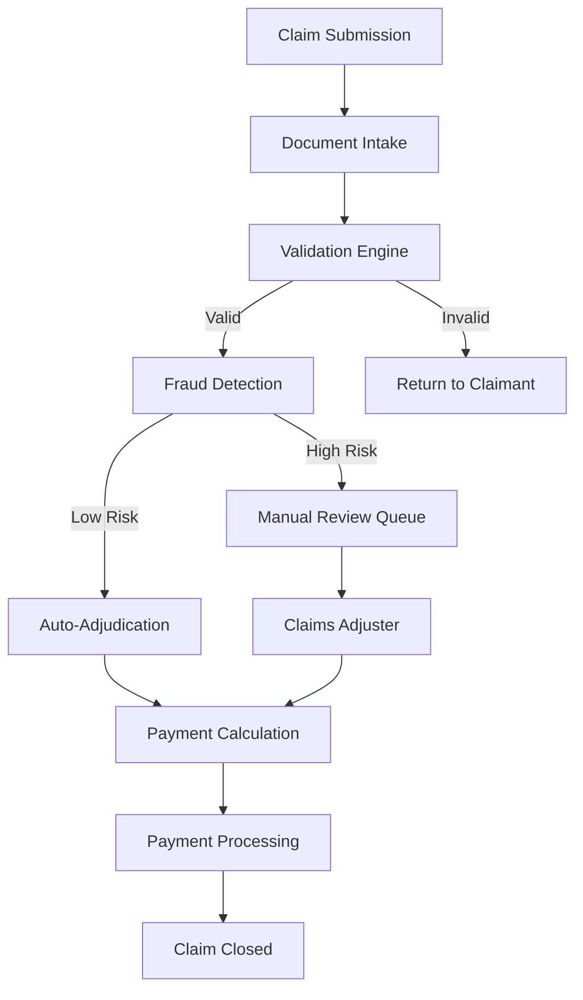

# How to Instrument Insurance Claims Processing Pipelines with OpenTelemetry

Author: [nawazdhandala](https://www.github.com/nawazdhandala)

Tags: OpenTelemetry, Insurance, Claims Processing, Observability, Workflow Monitoring, Enterprise

Description: Learn how to instrument insurance claims processing pipelines with OpenTelemetry to track claim lifecycle, detect bottlenecks, and monitor fraud detection and adjudication services.

---

Insurance claims processing is one of those domains where observability is not just a technical concern but a regulatory and customer satisfaction one. A claim can take days or weeks to process, passing through intake, validation, fraud detection, adjudication, and payment stages. When a claim gets stuck in a queue for three days with no visibility into why, both the customer and the compliance team want answers.

OpenTelemetry can bring transparency to this entire pipeline. Unlike typical web request tracing where a span lasts milliseconds, claims processing involves long-running workflows where individual steps might take hours. This guide covers how to instrument these pipelines effectively, including patterns for long-running traces and business metric tracking.

## Claims Processing Pipeline Overview

A typical insurance claims processing pipeline follows this flow:



Each stage might be handled by a different service, different team, or even a different vendor system. The challenge is maintaining visibility across all of them.

## Designing Traces for Long-Running Workflows

Standard distributed traces work well for synchronous request-response flows. But a claim that takes five days to process cannot live as a single trace with one root span. Instead, we use linked traces where each processing stage creates its own trace and links back to the original claim trace.

```python
# claim_tracing.py - Trace management for long-running claims
from opentelemetry import trace, context
from opentelemetry.trace import Link, SpanKind
from opentelemetry.sdk.trace import TracerProvider
from opentelemetry.sdk.trace.export import BatchSpanProcessor
from opentelemetry.exporter.otlp.proto.grpc.trace_exporter import OTLPSpanExporter
from opentelemetry.sdk.resources import Resource, SERVICE_NAME

def setup_tracing(service_name: str):
    """Configure tracing for a claims processing service."""
    resource = Resource.create({
        SERVICE_NAME: service_name,
        "service.namespace": "claims-processing",
        "deployment.environment": "production",
    })

    provider = TracerProvider(resource=resource)
    exporter = OTLPSpanExporter(endpoint="otel-collector:4317", insecure=True)
    provider.add_span_processor(BatchSpanProcessor(exporter))
    trace.set_tracer_provider(provider)
    return trace.get_tracer(service_name)


class ClaimTraceManager:
    """Manages trace context across long-running claim processing stages."""

    def __init__(self, tracer):
        self.tracer = tracer

    def start_claim_trace(self, claim_id: str, claim_type: str, claimant_id: str):
        """Create the initial trace when a claim is submitted."""
        span = self.tracer.start_span(
            "claim.submitted",
            kind=SpanKind.PRODUCER,
            attributes={
                "claim.id": claim_id,
                "claim.type": claim_type,
                "claimant.id": claimant_id,
                "claim.submitted_at": datetime.utcnow().isoformat(),
            },
        )

        # Store the span context so later stages can link back
        span_context = span.get_span_context()
        trace_reference = {
            "trace_id": format(span_context.trace_id, '032x'),
            "span_id": format(span_context.span_id, '016x'),
        }

        span.end()

        # Persist this reference alongside the claim record
        return trace_reference

    def start_stage_trace(self, stage_name: str, claim_id: str, original_trace_ref: dict):
        """Start a new trace for a processing stage, linked to the original claim trace."""

        # Reconstruct the original span context for linking
        original_context = trace.SpanContext(
            trace_id=int(original_trace_ref["trace_id"], 16),
            span_id=int(original_trace_ref["span_id"], 16),
            is_remote=True,
            trace_flags=trace.TraceFlags(0x01),
        )

        # Create a new trace with a link to the original submission
        span = self.tracer.start_span(
            f"claim.stage.{stage_name}",
            kind=SpanKind.CONSUMER,
            links=[Link(original_context, {"link.type": "claim_origin"})],
            attributes={
                "claim.id": claim_id,
                "claim.stage": stage_name,
                "claim.stage_started_at": datetime.utcnow().isoformat(),
            },
        )

        return span
```

This pattern stores the trace reference in your claims database alongside the claim record. When a claim moves to the next processing stage (which might happen hours or days later), the new stage creates a fresh trace and links it back to the original submission. Your observability backend can then show you the full chain of processing stages for any claim.

## Instrumenting the Document Intake Service

Document intake is the first processing stage after submission. It handles document upload, OCR, and initial data extraction.

```python
# document_intake.py - Document processing with detailed instrumentation
from opentelemetry import trace, metrics
from claim_tracing import setup_tracing, ClaimTraceManager
import time

tracer = setup_tracing("document-intake-service")
meter = metrics.get_meter("document-intake-service")
trace_manager = ClaimTraceManager(tracer)

# Metrics for document processing
doc_processing_time = meter.create_histogram(
    "claims.document.processing_time_seconds",
    description="Time to process a submitted document",
    unit="s",
)
doc_count = meter.create_counter(
    "claims.document.processed_total",
    description="Total documents processed by type and status",
)
ocr_confidence = meter.create_histogram(
    "claims.document.ocr_confidence",
    description="OCR confidence score for extracted text",
)

async def process_document_intake(claim_id: str, documents: list, trace_ref: dict):
    """Process submitted claim documents through OCR and validation."""

    # Start a new trace for this stage, linked to the original claim
    stage_span = trace_manager.start_stage_trace("document_intake", claim_id, trace_ref)

    try:
        stage_span.set_attribute("documents.count", len(documents))
        extracted_data = {}

        for doc in documents:
            # Each document gets its own child span
            with tracer.start_as_current_span(
                "process_document",
                attributes={
                    "document.type": doc.doc_type,
                    "document.size_bytes": doc.size,
                    "document.format": doc.format,
                },
            ) as doc_span:
                start = time.monotonic()

                # Run OCR on the document
                with tracer.start_as_current_span("ocr_extraction") as ocr_span:
                    ocr_result = await ocr_service.extract_text(doc)
                    ocr_span.set_attribute("ocr.confidence", ocr_result.confidence)
                    ocr_span.set_attribute("ocr.page_count", ocr_result.pages)
                    ocr_confidence.record(ocr_result.confidence, {
                        "document_type": doc.doc_type,
                    })

                # Validate extracted data against expected schema
                with tracer.start_as_current_span("data_validation") as val_span:
                    validation = validate_extracted_data(ocr_result, doc.doc_type)
                    val_span.set_attribute("validation.passed", validation.passed)
                    val_span.set_attribute("validation.errors", len(validation.errors))

                    if not validation.passed:
                        doc_span.add_event("validation_failed", {
                            "errors": str(validation.errors[:5]),
                        })

                elapsed = time.monotonic() - start
                doc_processing_time.record(elapsed, {"doc_type": doc.doc_type})
                doc_count.add(1, {
                    "doc_type": doc.doc_type,
                    "status": "valid" if validation.passed else "invalid",
                })

                extracted_data[doc.doc_type] = ocr_result.data

        stage_span.set_attribute("documents.all_valid",
            all(d.get("valid", False) for d in extracted_data.values()))
        stage_span.add_event("intake_complete")

        return extracted_data

    except Exception as e:
        stage_span.record_exception(e)
        stage_span.set_status(trace.StatusCode.ERROR, str(e))
        raise
    finally:
        stage_span.end()
```

The document intake instrumentation captures both the technical metrics (processing time, OCR confidence scores) and the business metrics (document type distribution, validation pass rates). The OCR confidence histogram is particularly useful because low-confidence scores correlate with claims that get stuck in manual review later.

## Instrumenting the Fraud Detection Service

Fraud detection is often the most computationally expensive stage. It runs the claim through multiple detection models and rule engines.

```python
# fraud_detection.py - Fraud scoring with model performance tracking
from opentelemetry import trace, metrics
from claim_tracing import setup_tracing, ClaimTraceManager

tracer = setup_tracing("fraud-detection-service")
meter = metrics.get_meter("fraud-detection-service")
trace_manager = ClaimTraceManager(tracer)

# Fraud detection metrics
fraud_score_distribution = meter.create_histogram(
    "claims.fraud.score",
    description="Distribution of fraud risk scores",
)
model_latency = meter.create_histogram(
    "claims.fraud.model_latency_ms",
    description="Latency of individual fraud detection models",
    unit="ms",
)
fraud_flags = meter.create_counter(
    "claims.fraud.flags_total",
    description="Total fraud flags raised by type",
)
review_queue_size = meter.create_up_down_counter(
    "claims.fraud.review_queue_size",
    description="Current size of the manual fraud review queue",
)

async def run_fraud_detection(claim_id: str, claim_data: dict, trace_ref: dict):
    """Run fraud detection models against a claim."""

    stage_span = trace_manager.start_stage_trace("fraud_detection", claim_id, trace_ref)

    try:
        scores = {}

        # Run multiple fraud detection models in parallel
        with tracer.start_as_current_span("run_fraud_models") as models_span:

            # Model 1: Pattern-based rules engine
            with tracer.start_as_current_span("rules_engine") as rule_span:
                import time
                start = time.monotonic()
                rules_result = await rules_engine.evaluate(claim_data)
                elapsed_ms = (time.monotonic() - start) * 1000

                rule_span.set_attribute("rules.triggered", len(rules_result.triggered_rules))
                rule_span.set_attribute("rules.score", rules_result.score)
                model_latency.record(elapsed_ms, {"model": "rules_engine"})
                scores["rules"] = rules_result.score

                # Log each triggered rule as a span event
                for rule in rules_result.triggered_rules:
                    rule_span.add_event("rule_triggered", {
                        "rule.id": rule.id,
                        "rule.name": rule.name,
                        "rule.severity": rule.severity,
                    })
                    fraud_flags.add(1, {"flag_type": rule.name})

            # Model 2: ML-based anomaly detection
            with tracer.start_as_current_span("ml_anomaly_detection") as ml_span:
                start = time.monotonic()
                ml_result = await ml_model.predict(claim_data)
                elapsed_ms = (time.monotonic() - start) * 1000

                ml_span.set_attribute("ml.score", ml_result.score)
                ml_span.set_attribute("ml.model_version", ml_result.model_version)
                ml_span.set_attribute("ml.features_used", ml_result.feature_count)
                model_latency.record(elapsed_ms, {"model": "ml_anomaly"})
                scores["ml_anomaly"] = ml_result.score

            # Model 3: Network analysis (checks for connected suspicious claims)
            with tracer.start_as_current_span("network_analysis") as net_span:
                start = time.monotonic()
                network_result = await network_analyzer.check_connections(claim_data)
                elapsed_ms = (time.monotonic() - start) * 1000

                net_span.set_attribute("network.connections_found", network_result.connections)
                net_span.set_attribute("network.suspicious_links", network_result.suspicious)
                model_latency.record(elapsed_ms, {"model": "network_analysis"})
                scores["network"] = network_result.score

        # Calculate composite fraud score
        composite_score = calculate_composite_score(scores)
        fraud_score_distribution.record(composite_score, {
            "claim_type": claim_data["claim_type"],
        })

        # Determine routing based on score
        if composite_score > 0.8:
            routing = "manual_review"
            review_queue_size.add(1)
        elif composite_score > 0.5:
            routing = "enhanced_review"
        else:
            routing = "auto_adjudicate"

        stage_span.set_attributes({
            "fraud.composite_score": composite_score,
            "fraud.routing": routing,
            "fraud.models_run": len(scores),
        })

        return FraudResult(score=composite_score, routing=routing, details=scores)

    except Exception as e:
        stage_span.record_exception(e)
        stage_span.set_status(trace.StatusCode.ERROR, str(e))
        raise
    finally:
        stage_span.end()
```

Each fraud model gets its own span with latency tracking. This is valuable because fraud models tend to degrade in performance as the data they rely on grows. If the network analysis model starts taking 10 seconds instead of 2 seconds, you will see it immediately in the model latency histogram.

## Tracking the Claim Lifecycle with Metrics

Beyond individual stage instrumentation, you need metrics that show the overall health of the claims pipeline.

```python
# pipeline_metrics.py - Pipeline-level claim lifecycle metrics
from opentelemetry import metrics

meter = metrics.get_meter("claims-pipeline")

# How long claims spend in each stage
stage_duration = meter.create_histogram(
    "claims.stage.duration_hours",
    description="Time claims spend in each processing stage",
    unit="h",
)

# Claims currently in each stage (queue depth)
stage_queue_depth = meter.create_up_down_counter(
    "claims.stage.queue_depth",
    description="Number of claims currently in each stage",
)

# End-to-end claim processing time
claim_total_time = meter.create_histogram(
    "claims.total_processing_days",
    description="Total days from submission to closure",
    unit="d",
)

# SLA compliance tracking
sla_breaches = meter.create_counter(
    "claims.sla.breaches_total",
    description="Claims that exceeded their SLA processing time",
)

def record_stage_transition(claim_id: str, from_stage: str, to_stage: str,
                            stage_duration_hours: float, claim_type: str):
    """Record metrics when a claim moves from one stage to another."""

    # Track how long the claim spent in the previous stage
    stage_duration.record(stage_duration_hours, {
        "stage": from_stage,
        "claim_type": claim_type,
    })

    # Update queue depths
    stage_queue_depth.add(-1, {"stage": from_stage, "claim_type": claim_type})
    stage_queue_depth.add(1, {"stage": to_stage, "claim_type": claim_type})

    # Check SLA compliance
    sla_limit = get_sla_limit(from_stage, claim_type)
    if stage_duration_hours > sla_limit:
        sla_breaches.add(1, {
            "stage": from_stage,
            "claim_type": claim_type,
            "breach_hours": stage_duration_hours - sla_limit,
        })
```

These pipeline-level metrics let you build dashboards that show the flow of claims through your system. You can see at a glance which stage has the largest backlog, which claim types are processing fastest, and where SLA breaches are occurring.

## Collector Configuration

For claims processing, the collector needs to handle a moderate volume of high-cardinality data (each claim has a unique ID) while preserving all traces since claim data can be relevant for audits.

```yaml
# otel-collector-claims.yaml
receivers:
  otlp:
    protocols:
      grpc:
        endpoint: 0.0.0.0:4317

processors:
  batch:
    timeout: 30s
    send_batch_size: 256

  # Scrub PII from claim attributes before export
  attributes:
    actions:
      - key: claimant.ssn
        action: delete
      - key: claimant.email
        action: hash
      - key: claimant.phone
        action: delete

  # Transform claim IDs into a consistent format
  resource:
    attributes:
      - key: regulatory.jurisdiction
        value: "US"
        action: upsert

exporters:
  otlp:
    endpoint: oneuptime-collector:4317

service:
  pipelines:
    traces:
      receivers: [otlp]
      processors: [attributes, resource, batch]
      exporters: [otlp]
    metrics:
      receivers: [otlp]
      processors: [resource, batch]
      exporters: [otlp]
```

The PII scrubbing in the attributes processor is critical for insurance workloads. Claims data contains sensitive personal information that should never end up in your observability backend. Hashing the email lets you still correlate traces for the same claimant without storing the actual email address.

## Conclusion

Instrumenting insurance claims processing pipelines with OpenTelemetry requires adapting distributed tracing patterns to long-running workflows. The linked trace pattern gives you end-to-end visibility across processing stages that might span days, while stage-level metrics show you pipeline health and SLA compliance in real time. Combined with PII-safe data handling in the collector, this gives you the observability foundation needed to keep claims moving efficiently while maintaining regulatory compliance.
