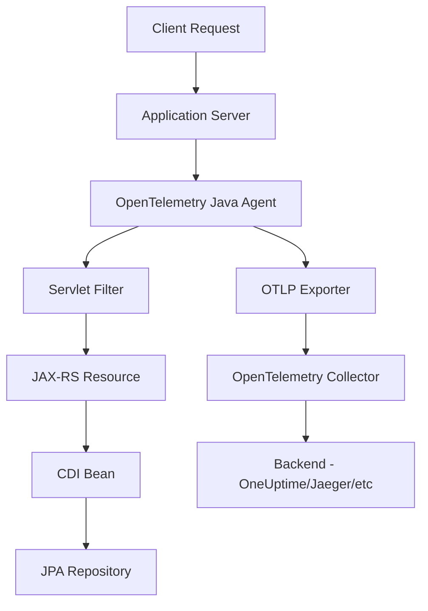

# How to Instrument Jakarta EE 10 Applications with OpenTelemetry

Author: [nawazdhandala](https://www.github.com/nawazdhandala)

Tags: OpenTelemetry, Jakarta EE, Java, Enterprise, Instrumentation

Description: Complete guide to instrumenting Jakarta EE 10 applications with OpenTelemetry for distributed tracing, metrics, and logs using both automatic and manual instrumentation approaches.

Jakarta EE 10 represents the modern evolution of enterprise Java, bringing new features like CDI 4.0, JAX-RS 3.1, and Jakarta Persistence 3.1. Observability in these applications becomes critical as microservices architectures grow more complex. OpenTelemetry provides a vendor-neutral way to instrument Jakarta EE applications for comprehensive telemetry data collection.

## Understanding Jakarta EE 10 and OpenTelemetry Integration

Jakarta EE 10 applications typically run on application servers like WildFly, Open Liberty, Payara, or TomEE. These servers provide the runtime environment for your enterprise components including servlets, EJBs, CDI beans, and JAX-RS resources. OpenTelemetry can instrument these components both automatically through the Java agent and manually through SDK integration.

The integration approach you choose depends on your requirements. The Java agent provides zero-code instrumentation for common frameworks, while manual instrumentation gives you fine-grained control over what telemetry data you collect.

## Architecture Overview

Here's how OpenTelemetry integrates with a Jakarta EE 10 application:



## Setting Up OpenTelemetry with the Java Agent

The simplest way to instrument a Jakarta EE 10 application is using the OpenTelemetry Java agent. Download the latest agent and configure your application server to use it.

First, download the OpenTelemetry Java agent:

```bash
# Download the latest Java agent
curl -L -o opentelemetry-javaagent.jar \
  https://github.com/open-telemetry/opentelemetry-java-instrumentation/releases/latest/download/opentelemetry-javaagent.jar
```

Configure your application server to use the agent. For WildFly, modify the standalone.conf or domain.conf:

```bash
# Add to JAVA_OPTS in standalone.conf
JAVA_OPTS="$JAVA_OPTS -javaagent:/path/to/opentelemetry-javaagent.jar"
JAVA_OPTS="$JAVA_OPTS -Dotel.service.name=jakarta-ee-app"
JAVA_OPTS="$JAVA_OPTS -Dotel.traces.exporter=otlp"
JAVA_OPTS="$JAVA_OPTS -Dotel.metrics.exporter=otlp"
JAVA_OPTS="$JAVA_OPTS -Dotel.logs.exporter=otlp"
JAVA_OPTS="$JAVA_OPTS -Dotel.exporter.otlp.endpoint=http://localhost:4317"
```

For Open Liberty, add the agent configuration to jvm.options:

```properties
# jvm.options file
-javaagent:/path/to/opentelemetry-javaagent.jar
-Dotel.service.name=jakarta-ee-app
-Dotel.traces.exporter=otlp
-Dotel.exporter.otlp.endpoint=http://localhost:4317
-Dotel.instrumentation.common.default-enabled=true
```

## Manual Instrumentation with OpenTelemetry SDK

For more control over your telemetry data, use manual instrumentation with the OpenTelemetry SDK. Add the required dependencies to your Maven project:

```xml
<properties>
    <opentelemetry.version>1.37.0</opentelemetry.version>
</properties>

<dependencies>
    <!-- OpenTelemetry API -->
    <dependency>
        <groupId>io.opentelemetry</groupId>
        <artifactId>opentelemetry-api</artifactId>
        <version>${opentelemetry.version}</version>
    </dependency>

    <!-- OpenTelemetry SDK -->
    <dependency>
        <groupId>io.opentelemetry</groupId>
        <artifactId>opentelemetry-sdk</artifactId>
        <version>${opentelemetry.version}</version>
    </dependency>

    <!-- OTLP Exporter -->
    <dependency>
        <groupId>io.opentelemetry</groupId>
        <artifactId>opentelemetry-exporter-otlp</artifactId>
        <version>${opentelemetry.version}</version>
    </dependency>

    <!-- Semantic Conventions -->
    <dependency>
        <groupId>io.opentelemetry.semconv</groupId>
        <artifactId>opentelemetry-semconv</artifactId>
        <version>1.23.1-alpha</version>
    </dependency>
</dependencies>
```

Create a CDI producer to initialize OpenTelemetry:

```java
package com.example.telemetry;

import io.opentelemetry.api.OpenTelemetry;
import io.opentelemetry.api.common.Attributes;
import io.opentelemetry.api.trace.Tracer;
import io.opentelemetry.exporter.otlp.trace.OtlpGrpcSpanExporter;
import io.opentelemetry.sdk.OpenTelemetrySdk;
import io.opentelemetry.sdk.resources.Resource;
import io.opentelemetry.sdk.trace.SdkTracerProvider;
import io.opentelemetry.sdk.trace.export.BatchSpanProcessor;
import io.opentelemetry.semconv.ResourceAttributes;

import jakarta.enterprise.context.ApplicationScoped;
import jakarta.enterprise.inject.Produces;
import jakarta.annotation.PreDestroy;

@ApplicationScoped
public class OpenTelemetryProducer {

    private OpenTelemetry openTelemetry;
    private SdkTracerProvider tracerProvider;

    // Initialize OpenTelemetry SDK with OTLP exporter
    @Produces
    @ApplicationScoped
    public OpenTelemetry produceOpenTelemetry() {
        if (openTelemetry == null) {
            // Create resource with service information
            Resource resource = Resource.getDefault()
                .merge(Resource.create(
                    Attributes.builder()
                        .put(ResourceAttributes.SERVICE_NAME, "jakarta-ee-app")
                        .put(ResourceAttributes.SERVICE_VERSION, "1.0.0")
                        .put(ResourceAttributes.DEPLOYMENT_ENVIRONMENT, "production")
                        .build()
                ));

            // Configure OTLP exporter
            OtlpGrpcSpanExporter spanExporter = OtlpGrpcSpanExporter.builder()
                .setEndpoint("http://localhost:4317")
                .build();

            // Build tracer provider with batch processor
            tracerProvider = SdkTracerProvider.builder()
                .addSpanProcessor(BatchSpanProcessor.builder(spanExporter).build())
                .setResource(resource)
                .build();

            // Create OpenTelemetry instance
            openTelemetry = OpenTelemetrySdk.builder()
                .setTracerProvider(tracerProvider)
                .build();
        }

        return openTelemetry;
    }

    // Produce a tracer for injection
    @Produces
    @ApplicationScoped
    public Tracer produceTracer(OpenTelemetry openTelemetry) {
        return openTelemetry.getTracer("com.example.jakarta-ee-app", "1.0.0");
    }

    // Clean shutdown of OpenTelemetry resources
    @PreDestroy
    public void cleanup() {
        if (tracerProvider != null) {
            tracerProvider.close();
        }
    }
}
```

## Instrumenting JAX-RS Resources

JAX-RS resources are the entry points for REST APIs in Jakarta EE. Create a custom interceptor to automatically trace all JAX-RS endpoints:

```java
package com.example.telemetry;

import io.opentelemetry.api.trace.Span;
import io.opentelemetry.api.trace.SpanKind;
import io.opentelemetry.api.trace.StatusCode;
import io.opentelemetry.api.trace.Tracer;
import io.opentelemetry.context.Context;
import io.opentelemetry.context.Scope;

import jakarta.inject.Inject;
import jakarta.ws.rs.container.ContainerRequestContext;
import jakarta.ws.rs.container.ContainerRequestFilter;
import jakarta.ws.rs.container.ContainerResponseContext;
import jakarta.ws.rs.container.ContainerResponseFilter;
import jakarta.ws.rs.ext.Provider;
import java.io.IOException;

@Provider
public class OpenTelemetryJaxRsFilter implements ContainerRequestFilter, ContainerResponseFilter {

    private static final String SPAN_CONTEXT_KEY = "otel.span.context";
    private static final String SPAN_KEY = "otel.span";

    @Inject
    private Tracer tracer;

    @Override
    public void filter(ContainerRequestContext requestContext) throws IOException {
        // Extract HTTP method and path
        String method = requestContext.getMethod();
        String path = requestContext.getUriInfo().getPath();

        // Create a new span for this request
        Span span = tracer.spanBuilder(method + " " + path)
            .setSpanKind(SpanKind.SERVER)
            .startSpan();

        // Add HTTP attributes
        span.setAttribute("http.method", method);
        span.setAttribute("http.url", requestContext.getUriInfo().getRequestUri().toString());
        span.setAttribute("http.route", path);

        // Store span and context for response filter
        Context context = Context.current().with(span);
        requestContext.setProperty(SPAN_CONTEXT_KEY, context);
        requestContext.setProperty(SPAN_KEY, span);
    }

    @Override
    public void filter(ContainerRequestContext requestContext,
                      ContainerResponseContext responseContext) throws IOException {
        Span span = (Span) requestContext.getProperty(SPAN_KEY);
        Context context = (Context) requestContext.getProperty(SPAN_CONTEXT_KEY);

        if (span != null) {
            try (Scope scope = context.makeCurrent()) {
                // Add response status
                int status = responseContext.getStatus();
                span.setAttribute("http.status_code", status);

                // Set span status based on HTTP status
                if (status >= 500) {
                    span.setStatus(StatusCode.ERROR, "Server error");
                } else if (status >= 400) {
                    span.setStatus(StatusCode.ERROR, "Client error");
                } else {
                    span.setStatus(StatusCode.OK);
                }
            } finally {
                span.end();
            }
        }
    }
}
```

## Instrumenting CDI Beans with Custom Annotations

Create a custom annotation and interceptor to trace CDI bean methods:

```java
package com.example.telemetry;

import jakarta.interceptor.InterceptorBinding;
import java.lang.annotation.ElementType;
import java.lang.annotation.Retention;
import java.lang.annotation.RetentionPolicy;
import java.lang.annotation.Target;

@InterceptorBinding
@Target({ElementType.METHOD, ElementType.TYPE})
@Retention(RetentionPolicy.RUNTIME)
public @interface Traced {
    String value() default "";
}
```

Implement the interceptor to create spans:

```java
package com.example.telemetry;

import io.opentelemetry.api.trace.Span;
import io.opentelemetry.api.trace.SpanKind;
import io.opentelemetry.api.trace.StatusCode;
import io.opentelemetry.api.trace.Tracer;
import io.opentelemetry.context.Scope;

import jakarta.inject.Inject;
import jakarta.interceptor.AroundInvoke;
import jakarta.interceptor.Interceptor;
import jakarta.interceptor.InvocationContext;

@Traced
@Interceptor
public class TracedInterceptor {

    @Inject
    private Tracer tracer;

    @AroundInvoke
    public Object trace(InvocationContext context) throws Exception {
        // Get custom span name or use method name
        Traced annotation = context.getMethod().getAnnotation(Traced.class);
        String spanName = annotation != null && !annotation.value().isEmpty()
            ? annotation.value()
            : context.getMethod().getDeclaringClass().getSimpleName() + "." + context.getMethod().getName();

        // Create and start a new span
        Span span = tracer.spanBuilder(spanName)
            .setSpanKind(SpanKind.INTERNAL)
            .startSpan();

        try (Scope scope = span.makeCurrent()) {
            // Add method parameters as attributes
            Object[] params = context.getParameters();
            if (params != null) {
                for (int i = 0; i < params.length; i++) {
                    if (params[i] != null) {
                        span.setAttribute("param." + i, params[i].toString());
                    }
                }
            }

            // Execute the method
            Object result = context.proceed();
            span.setStatus(StatusCode.OK);
            return result;

        } catch (Exception e) {
            // Record exception and rethrow
            span.recordException(e);
            span.setStatus(StatusCode.ERROR, e.getMessage());
            throw e;
        } finally {
            span.end();
        }
    }
}
```

Enable the interceptor in beans.xml:

```xml
<?xml version="1.0" encoding="UTF-8"?>
<beans xmlns="https://jakarta.ee/xml/ns/jakartaee"
       xmlns:xsi="http://www.w3.org/2001/XMLSchema-instance"
       xsi:schemaLocation="https://jakarta.ee/xml/ns/jakartaee
                           https://jakarta.ee/xml/ns/jakartaee/beans_4_0.xsd"
       version="4.0">
    <interceptors>
        <class>com.example.telemetry.TracedInterceptor</class>
    </interceptors>
</beans>
```

## Tracing JPA Operations

Monitor database operations by instrumenting your JPA repositories:

```java
package com.example.service;

import com.example.telemetry.Traced;
import io.opentelemetry.api.trace.Span;
import io.opentelemetry.api.trace.Tracer;

import jakarta.enterprise.context.ApplicationScoped;
import jakarta.inject.Inject;
import jakarta.persistence.EntityManager;
import jakarta.persistence.PersistenceContext;
import jakarta.transaction.Transactional;
import java.util.List;

@ApplicationScoped
public class UserRepository {

    @PersistenceContext
    private EntityManager em;

    @Inject
    private Tracer tracer;

    @Traced("UserRepository.findAll")
    @Transactional
    public List<User> findAll() {
        Span span = Span.current();
        span.setAttribute("db.system", "postgresql");
        span.setAttribute("db.operation", "SELECT");
        span.setAttribute("db.sql.table", "users");

        return em.createQuery("SELECT u FROM User u", User.class)
            .getResultList();
    }

    @Traced("UserRepository.findById")
    @Transactional
    public User findById(Long id) {
        Span span = Span.current();
        span.setAttribute("db.system", "postgresql");
        span.setAttribute("db.operation", "SELECT");
        span.setAttribute("db.sql.table", "users");
        span.setAttribute("user.id", id);

        return em.find(User.class, id);
    }

    @Traced("UserRepository.save")
    @Transactional
    public User save(User user) {
        Span span = Span.current();
        span.setAttribute("db.system", "postgresql");

        if (user.getId() == null) {
            span.setAttribute("db.operation", "INSERT");
            em.persist(user);
        } else {
            span.setAttribute("db.operation", "UPDATE");
            user = em.merge(user);
        }

        return user;
    }
}
```

## Adding Custom Metrics

Beyond tracing, collect custom metrics for business operations:

```java
package com.example.telemetry;

import io.opentelemetry.api.OpenTelemetry;
import io.opentelemetry.api.metrics.LongCounter;
import io.opentelemetry.api.metrics.Meter;

import jakarta.enterprise.context.ApplicationScoped;
import jakarta.inject.Inject;

@ApplicationScoped
public class MetricsService {

    private final LongCounter requestCounter;
    private final LongCounter errorCounter;

    @Inject
    public MetricsService(OpenTelemetry openTelemetry) {
        Meter meter = openTelemetry.getMeter("com.example.jakarta-ee-app");

        // Counter for total requests
        requestCounter = meter.counterBuilder("app.requests.total")
            .setDescription("Total number of requests processed")
            .setUnit("1")
            .build();

        // Counter for errors
        errorCounter = meter.counterBuilder("app.errors.total")
            .setDescription("Total number of errors")
            .setUnit("1")
            .build();
    }

    public void recordRequest(String endpoint, String method) {
        requestCounter.add(1,
            io.opentelemetry.api.common.Attributes.builder()
                .put("endpoint", endpoint)
                .put("method", method)
                .build());
    }

    public void recordError(String endpoint, String errorType) {
        errorCounter.add(1,
            io.opentelemetry.api.common.Attributes.builder()
                .put("endpoint", endpoint)
                .put("error.type", errorType)
                .build());
    }
}
```

## Complete Example Application

Here's a complete JAX-RS resource using all the instrumentation techniques:

```java
package com.example.api;

import com.example.service.UserRepository;
import com.example.telemetry.MetricsService;
import com.example.telemetry.Traced;
import io.opentelemetry.api.trace.Span;

import jakarta.inject.Inject;
import jakarta.ws.rs.*;
import jakarta.ws.rs.core.MediaType;
import jakarta.ws.rs.core.Response;

@Path("/users")
@Produces(MediaType.APPLICATION_JSON)
@Consumes(MediaType.APPLICATION_JSON)
public class UserResource {

    @Inject
    private UserRepository userRepository;

    @Inject
    private MetricsService metricsService;

    @GET
    @Traced("UserResource.listUsers")
    public Response listUsers() {
        metricsService.recordRequest("/users", "GET");

        // Add custom attribute to current span
        Span.current().setAttribute("operation", "list_users");

        try {
            List<User> users = userRepository.findAll();
            Span.current().setAttribute("result.count", users.size());
            return Response.ok(users).build();
        } catch (Exception e) {
            metricsService.recordError("/users", e.getClass().getSimpleName());
            throw e;
        }
    }

    @GET
    @Path("/{id}")
    @Traced("UserResource.getUser")
    public Response getUser(@PathParam("id") Long id) {
        metricsService.recordRequest("/users/{id}", "GET");
        Span.current().setAttribute("user.id", id);

        User user = userRepository.findById(id);
        if (user == null) {
            return Response.status(Response.Status.NOT_FOUND).build();
        }

        return Response.ok(user).build();
    }

    @POST
    @Traced("UserResource.createUser")
    public Response createUser(User user) {
        metricsService.recordRequest("/users", "POST");

        User created = userRepository.save(user);
        Span.current().setAttribute("user.id", created.getId());

        return Response.status(Response.Status.CREATED).entity(created).build();
    }
}
```

## Testing Your Instrumentation

Verify your OpenTelemetry instrumentation by sending test requests and checking your observability backend. You can use OneUptime, Jaeger, or any OpenTelemetry-compatible backend.

Deploy your application and make some test requests:

```bash
# Create a user
curl -X POST http://localhost:8080/api/users \
  -H "Content-Type: application/json" \
  -d '{"name":"John Doe","email":"john@example.com"}'

# List all users
curl http://localhost:8080/api/users

# Get specific user
curl http://localhost:8080/api/users/1
```

Check your tracing backend to see the distributed traces showing the complete request flow through your JAX-RS resources, CDI beans, and JPA repositories.

Jakarta EE 10 applications benefit significantly from OpenTelemetry instrumentation, providing deep visibility into enterprise application behavior. The combination of automatic instrumentation through the Java agent and manual instrumentation with custom spans gives you complete control over your observability strategy while maintaining clean, maintainable code.
