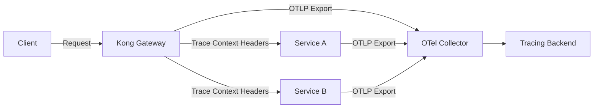
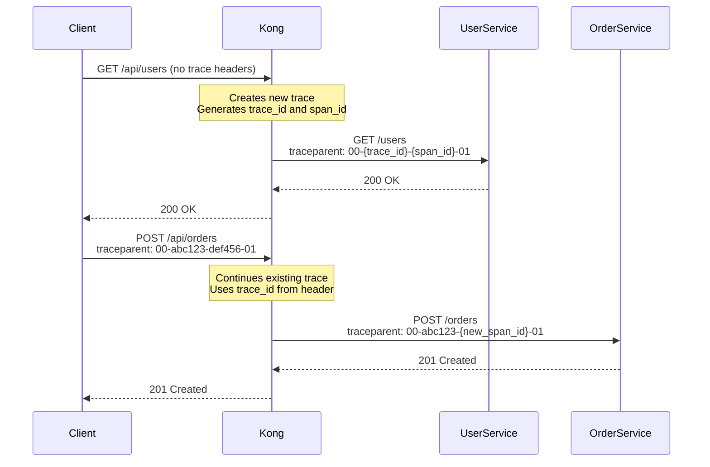

# How to Instrument Kong API Gateway with OpenTelemetry

Author: [nawazdhandala](https://www.github.com/nawazdhandala)

Tags: OpenTelemetry, Kong, API Gateway, Distributed Tracing, Observability, Microservices

Description: A practical guide to instrumenting Kong API Gateway with OpenTelemetry for end-to-end request tracing, metrics collection, and improved API observability.

---

Kong is one of the most popular API gateways for managing, securing, and routing traffic to your backend services. But if you're running Kong in front of a microservices architecture, you've probably hit a common problem: traces start at your backend services, and you have no visibility into what happened at the gateway layer. Latency introduced by plugins, rate limiting decisions, authentication checks - all of that is a black box.

OpenTelemetry integration with Kong fixes this gap. Kong ships with a built-in OpenTelemetry plugin that generates traces and propagates context to upstream services. This means your distributed traces now start at the very edge of your infrastructure, giving you the full picture from the moment a request arrives to when the response goes back.

## Architecture Overview

When Kong is instrumented with OpenTelemetry, it creates spans for each request that passes through the gateway. These spans capture timing information for the entire request lifecycle, including plugin execution. Kong then propagates the trace context to upstream services via HTTP headers, so your backend services can continue the same trace.



## Enabling the OpenTelemetry Plugin

Kong's OpenTelemetry plugin is bundled with Kong Gateway starting from version 3.0. You don't need to install anything extra. You can enable it globally (for all routes and services) or selectively per route or service.

Here's how to enable the plugin globally using Kong's Admin API. This will instrument every request that passes through the gateway.

```bash
# Enable the OpenTelemetry plugin globally on Kong
# This sends traces for all routes and services to the specified OTLP endpoint
curl -X POST http://localhost:8001/plugins \
  --data "name=opentelemetry" \
  --data "config.endpoint=http://otel-collector:4318/v1/traces" \
  --data "config.resource_attributes.service.name=kong-gateway" \
  --data "config.resource_attributes.deployment.environment=production"
```

If you prefer to enable it for a specific service only, you can scope the plugin to that service. This is useful when you want to start with selective instrumentation before rolling it out everywhere.

```bash
# Enable OpenTelemetry only for a specific service
# Replace {service_id} with your actual Kong service ID
curl -X POST http://localhost:8001/services/{service_id}/plugins \
  --data "name=opentelemetry" \
  --data "config.endpoint=http://otel-collector:4318/v1/traces" \
  --data "config.resource_attributes.service.name=kong-gateway"
```

## Declarative Configuration with kong.yml

If you manage Kong using declarative configuration (which is common in Kubernetes deployments and CI/CD pipelines), you can define the OpenTelemetry plugin in your `kong.yml` file.

This example shows a full declarative config with the plugin enabled globally and configured with sampling, custom headers, and resource attributes.

```yaml
# kong.yml - Declarative Kong configuration with OpenTelemetry
_format_version: "3.0"

# Enable the OpenTelemetry plugin globally
plugins:
  - name: opentelemetry
    config:
      # OTLP HTTP endpoint for the OpenTelemetry Collector
      endpoint: http://otel-collector:4318/v1/traces

      # Resource attributes attached to every span from Kong
      resource_attributes:
        service.name: kong-gateway
        service.version: "3.6.0"
        deployment.environment: production

      # Headers to include when exporting to the collector
      headers:
        X-Auth-Token: "${OTEL_AUTH_TOKEN}"

      # Sampling rate: 1.0 = 100% of traces, 0.1 = 10%
      sampling_rate: 1.0

      # Header type for trace context propagation to upstream services
      # Options: w3c, b3, jaeger, ot, aws, gcp
      header_type: w3c

# Define your services and routes
services:
  - name: user-service
    url: http://user-service:8080
    routes:
      - name: user-routes
        paths:
          - /api/users
        strip_path: true

  - name: order-service
    url: http://order-service:8080
    routes:
      - name: order-routes
        paths:
          - /api/orders
        strip_path: true
```

## Understanding Kong Span Attributes

Kong's OpenTelemetry plugin generates spans with a rich set of attributes that follow OpenTelemetry semantic conventions. Understanding these attributes helps you build meaningful queries and dashboards.

Here are the key attributes you'll see on Kong-generated spans.

```yaml
# Span attributes generated by Kong's OpenTelemetry plugin
# These follow OpenTelemetry semantic conventions for HTTP

http.method: GET                           # HTTP request method
http.url: https://api.example.com/users    # Full request URL
http.scheme: https                         # URL scheme
http.host: api.example.com                 # Request host header
http.target: /users                        # Path and query string
http.status_code: 200                      # Response status code
http.flavor: "1.1"                         # HTTP version
http.user_agent: "Mozilla/5.0..."          # Client user agent

# Kong-specific attributes
kong.route: user-routes                    # Name of the matched Kong route
kong.service: user-service                 # Name of the upstream Kong service
kong.consumer: mobile-app                  # Authenticated consumer (if any)
kong.balancer.ip: 10.0.1.15               # IP of the upstream target selected
kong.balancer.port: 8080                   # Port of the upstream target

# Network attributes
net.peer.ip: 192.168.1.100                # Client IP address
net.peer.port: 54321                      # Client port
```

## Trace Context Propagation

One of the most important aspects of gateway instrumentation is making sure the trace context propagates correctly to your upstream services. Kong supports multiple propagation formats through the `header_type` configuration.

The W3C Trace Context format is the default and recommended option. It uses the `traceparent` and `tracestate` headers. If you have services instrumented with Jaeger or Zipkin that use B3 headers, Kong can propagate in those formats too.



When a client sends a request without trace headers, Kong starts a new trace. When the request already contains a `traceparent` header (maybe from a frontend instrumented with OpenTelemetry), Kong continues that trace and adds its own span as a child.

## Kubernetes Deployment

In Kubernetes environments, you'll typically deploy Kong alongside an OpenTelemetry Collector using a sidecar or DaemonSet pattern. Here's a Helm values file that configures Kong with OpenTelemetry in a Kubernetes cluster.

```yaml
# kong-values.yaml - Helm chart values for Kong with OpenTelemetry
env:
  # Enable the OpenTelemetry plugin in Kong's configuration
  plugins: "bundled,opentelemetry"

  # Set tracing instrumentation level
  # Options: off, request, all
  tracing_instrumentations: all

  # Sampling rate for tracing
  tracing_sampling_rate: "1.0"

# Kong plugin configuration via environment variables
plugins:
  configMaps:
    - name: kong-otel-plugin-config
      pluginName: opentelemetry

# Resource limits for Kong pods
resources:
  requests:
    cpu: 500m
    memory: 256Mi
  limits:
    cpu: 1000m
    memory: 512Mi
```

And here is a ConfigMap that holds the OpenTelemetry plugin configuration for Kong running in Kubernetes.

```yaml
# kong-otel-configmap.yaml
apiVersion: v1
kind: ConfigMap
metadata:
  name: kong-otel-plugin-config
  namespace: kong
data:
  opentelemetry: |
    endpoint: http://otel-collector.observability.svc.cluster.local:4318/v1/traces
    resource_attributes:
      service.name: kong-gateway
      k8s.namespace.name: kong
      k8s.cluster.name: production
    sampling_rate: 0.5
    header_type: w3c
```

## Collector Configuration for Kong

Your OpenTelemetry Collector should be set up to receive the traces from Kong and forward them to your tracing backend. Here's a collector configuration that processes Kong's traces and exports them.

```yaml
# otel-collector-config.yaml
receivers:
  # Receive traces from Kong via OTLP HTTP
  otlp:
    protocols:
      http:
        endpoint: 0.0.0.0:4318

processors:
  # Batch spans before exporting
  batch:
    timeout: 5s
    send_batch_size: 512

  # Add additional attributes to all spans from Kong
  attributes:
    actions:
      - key: gateway.type
        value: kong
        action: upsert

  # Tail-based sampling to keep interesting traces
  tail_sampling:
    decision_wait: 10s
    policies:
      # Always keep traces with errors
      - name: error-policy
        type: status_code
        status_code:
          status_codes: [ERROR]
      # Sample 20% of successful traces
      - name: success-sample
        type: probabilistic
        probabilistic:
          sampling_percentage: 20

exporters:
  otlp:
    endpoint: https://your-backend:4317
    tls:
      insecure: false

service:
  pipelines:
    traces:
      receivers: [otlp]
      processors: [batch, attributes, tail_sampling]
      exporters: [otlp]
```

## Monitoring Kong Plugin Latency

One valuable use case for Kong's OpenTelemetry integration is measuring the latency added by individual plugins. Kong creates child spans for plugin execution phases, so you can see exactly how much time each plugin adds to request processing.

For example, if you're running authentication, rate limiting, and request transformation plugins, you'll see separate spans for each. This makes it straightforward to identify plugins that are adding unexpected latency.

To dig into plugin performance, query your tracing backend for spans where `kong.plugin` is set. Group by plugin name and look at the p95 and p99 durations. If your rate limiting plugin is taking 50ms because it's hitting a slow Redis instance, you'll spot it immediately.

## Troubleshooting Common Issues

A few things can go wrong when setting up OpenTelemetry with Kong. The most common issue is Kong not being able to reach the collector endpoint. Make sure the collector is reachable from Kong's network and that the endpoint URL is correct. Kong uses HTTP (not gRPC) by default for OTLP export, so your collector needs the HTTP receiver enabled on port 4318.

Another common problem is missing traces for certain routes. Double-check that the plugin is enabled at the right scope. If you enabled it on a specific service, only that service's routes will be instrumented. Enable it globally if you want complete coverage.

If you're seeing traces from Kong but they're not connecting to your backend service traces, the issue is usually trace context propagation. Make sure your backend services are configured to read the same header format that Kong sends. If Kong uses W3C (`traceparent`) but your backend expects B3 headers, the trace will break at the gateway boundary.

## Wrapping Up

Instrumenting Kong with OpenTelemetry closes the visibility gap at your API gateway layer. You get full distributed traces that start when a request first hits Kong and continue through every backend service it touches. The built-in plugin makes it straightforward to set up, and with proper collector configuration, you can sample, process, and export those traces to whatever backend you prefer. The gateway is the front door to your services, and now you can actually see what happens there.
